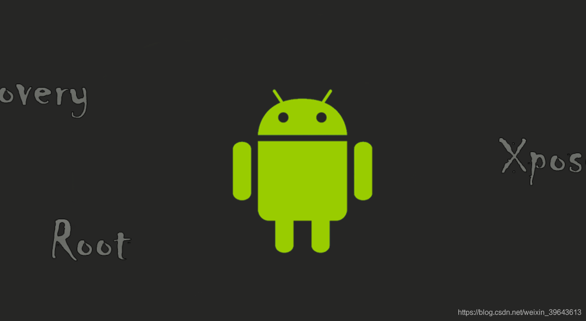
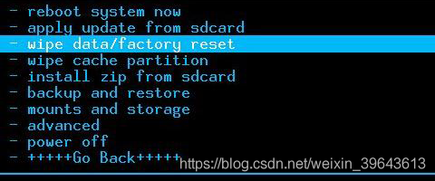
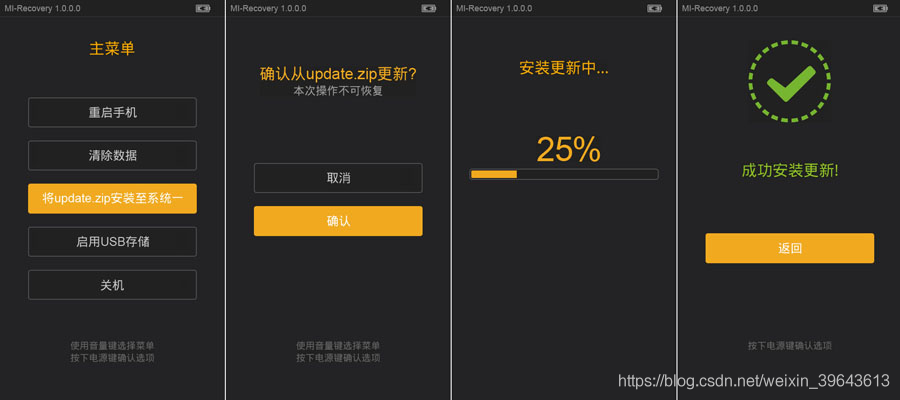
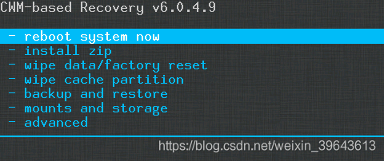
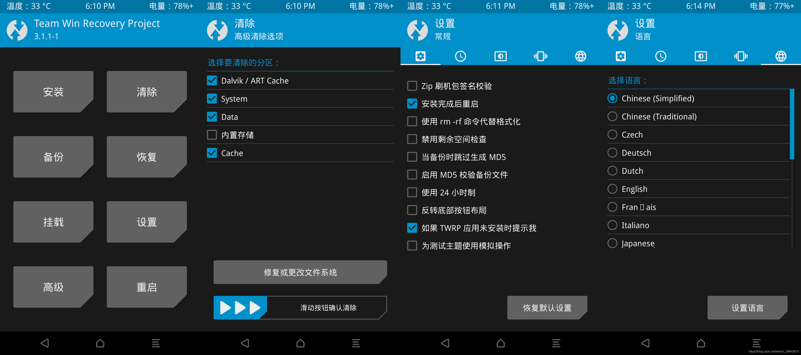
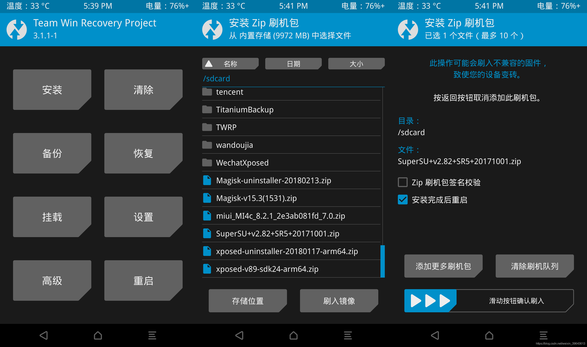
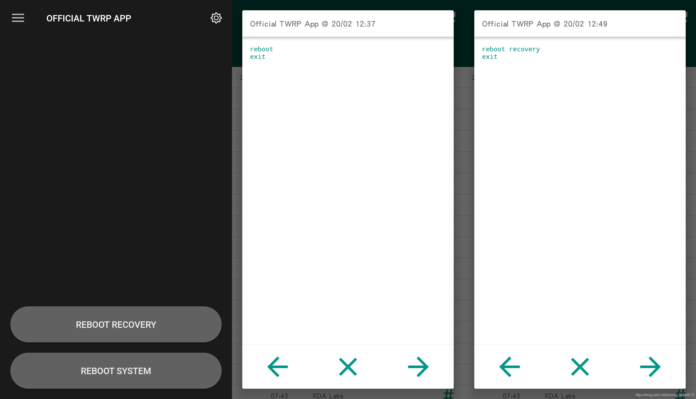
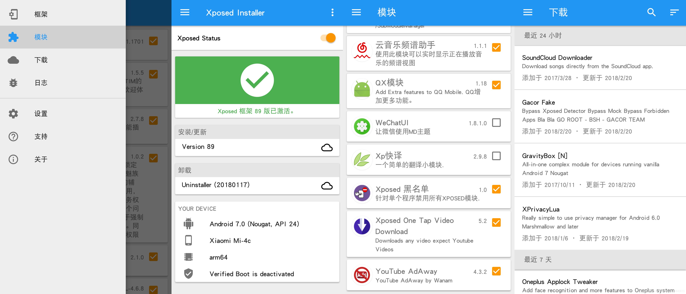
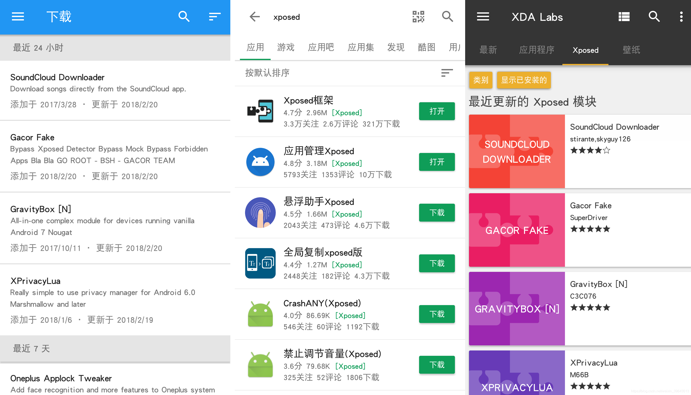
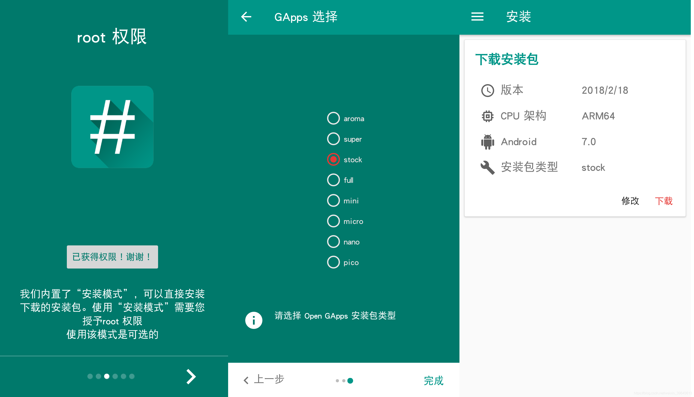

# Android 玩机终极指南

src:https://sspai.com/post/43338

@[toc]
# 引言
对于一般用户而言，Android 的使用体验一直受限于国内安卓生态环境与对 Android 的不甚了解，使得用户体验与 Android 本能提供的服务不匹配。通过这篇文章我将给这些困扰提供一份全面详细的阐述与解决之法。无论你是想学习有关 Android 中更高级玩法的原 Android 用户，抑或是原 iOS 使用者想快速入门 Android 的用户，这篇指南都能够满足你的需求。其间涉及到的安卓系统中更新缓慢的原因 与 Root 安全性问题更是会通过浅显易懂的文字呈现给大家。写这篇文章的初衷就是希望大家在使用 Android 的过程中能够少走弯路，通过简单的学习就知道如何去获得更加优秀的 Android 体验。

# Chapter 1 认识 Android 系统

## Android 系统简介

Android，常见的非官方中文名称为安卓，由谷歌(Google)公司发布的一个基于 Linux 内核的开放源代码移动操作系统。Android 最初由 Andy · Rubin 等人开发制作，最初目的是创建一个数码相机的先进操作系统，于2005年7月11日被 Google 收购。2007年11月，Google 与 84 家硬件制造商、软件开发商及电信营运商成立开放手持设备联盟来共同研发改良 Android，随后Google 以 Apache 免费开放源代码许可证的授权方式。第一部 Android 智能手机发布于2008年9月22日。

Android 底层使用开源的 Linux 操作系统，亦可归于嵌入式系统，同时开放了应用程序开发工具，使用 Java 语言进行开发(也支持 Kotlin)，所有程序开发人员都在统一、开放的开发平台上进行开发，保证了 Android 应用程序的可移植性。

## Android 系统版本
Android系统最早的一个版本 Android 1.0 beta 发布于2007年11月5日，至今已经发布了多个更新。这些更新版本都在前一个版本的基础上修复了 Bug 并且添加了前一个版本所没有的新功能。

从2009年5月开始，Android 操作系统改用甜点来作为版本代号，这些版本按照从 C 大写字母开始的顺序来进行命名：纸杯蛋糕（Cupcake）、甜甜圈（Donut）、闪电泡芙（Éclair）、冻酸奶（Froyo）、姜饼（Gingerbread）、蜂巢（Honeycomb）﹑冰淇淋三明治（Ice Cream Sandwich）、果冻豆（Jelly Bean）、奇巧（KitKat）、棒棒糖（Lollipop）、棉花糖（Marshmallow）、牛轧糖（Nougat）、奥利奥（Oreo）。

此外，Android 操作系统还有两个预发布的内部版本，它们分别是原子小金刚（Astro）和机器人班亭(Bender，电视动画《飞出个未来》角色)。
## Android API 等级
随着版本的更迭，应用程序编程接口(API)等级不断递增。

作为参照，下面列举其中几个 API 等级与其 Android 版本一一对应的关系列表。

* API等级24：Android 7.0 Nougat 牛轧糖
* API等级25：Android 7.1 – 7.1.2 Nougat 牛轧糖
* API等级26：Android 8.0 Oreo 奥利奥
* API等级27：Android 8.1 Oreo 奥利奥
## 基于原生安卓的定制系统
由于安卓系统开源、免费和可定制的特性，只要你想，任何人都可以定制自己的系统。这些定制系统可分为两大类，一是有些社区论坛不满原手机系统，于是自己在原生安卓（AOSP）的基础上进行修改优化而发布的第三方ROM；二是OEM手机厂商为了系统本地化和方便用户使用，为自家手机品牌开发出的专属系统。

## 第三方 ROM
这类绝大多数为类原生系统。

[LineageOS](https://www.lineageos.org/)：原 CyanogenMod(CM)，因原小组中几位成员不满其后的商业化不开源之路，以 Chainfire 为代表的几位成员遂脱离 CM 小组创立了现在的 LineageOS，其沿袭了 CM 稳定的特点，虽尚存少许 Bug，但瑕不掩瑜。国内有一个[LineageOS 中文论坛](https://www.lineageos.org.cn/) 。

[魔趣ROM](https://download.mokeedev.com/)：国内开源项目，本地化非常好，很符合国内使用的情况。

[Resurrection Remix OS](https://resurrectionremix.com/)：简称 RR，基于 LineageOS 大幅修改的第三方 ROM，自定义的程度很高。

[AICP](https://aicp-rom.com/)：基于 LineageOS 修改的第三方，但是自定义的程度相比 RR 较少。

[OmniROM](https://omnirom.org/)：基于AOSP的第三方，最大特点就是省电，自定义较少。

还有一些是不那么常见的第三方 ROM 如 XSOP 等。

## OEM 定制 ROM
Touchwiz（三星）、Emotion UI（华为）、MIUI（小米）、Flyme OS（魅族）、Smartisan OS（锤子科技）、Color OS（OPPO）、H2OS/Oxygen OS(一加，国内为氢OS，国外为氧 OS)等等。

## 关于 Google's Project Treble
Google I/O 2017 时谷歌推出的一项安卓更新计划。Android 8.0 版本的一项新元素是 Project Treble。这是 Android 操作系统框架在架构方面的一项重大改变，旨在让制造商以更低的成本更轻松、更快速地将设备更新到新版 Android 系统。Project Treble 适用于搭载 Android 8.0 及后续版本的所有新设备（这种新的架构已经在 Pixel 手机的开发者预览版中投入使用）。利用新的供应商接口，Project Treble 将供应商实现（由芯片制造商编写的设备专属底层软件）与 Android 操作系统框架分离开来。

通俗的讲，之前各定制系统如此慢的重要原因之一为：由芯片供应商提供的芯片驱动必须与 Android 的 API 严格对应，这样一来芯片厂商先要从 Google 拿到最新的系统的源代码，芯片厂商编写芯片驱动以能运行在最新的 Android，然后芯片厂商把驱动交给 OEM 厂商，最后 OEM 厂商为其设备适配，这样一来 OEM 厂商适配新版 Android 系统的进度严重依赖于前面几个环节。Project Treble 旨在最新的 Android 上应用兼容的芯片驱动，加快最新系统适配的速度。但这同样需要芯片厂商的的参与，如放出长支持（LTS）的芯片驱动。

目前已有数部手机已支持 Project Treble，目前少数厂商一两部手机支持就不列举了，可自行查询。 在 Android 8.0 版本以上的系统中在 Termux(免 Root 终端，或其它手机终端) 中输入getprop ro.treble.enabled命令，返回的结果为true则为支持，false则为不支持。

## 无处不在的 Android 系统
在移动端操作系统中，目前 Android 系统的全球市场占有率是最高的，运行 Android 系统的设备主要是智能手机和平板电脑，然而安卓系统还运行在其它产品上，包括手表、电视、数码相机、智能家居、智能眼镜、车载信息娱乐系统、游戏机等等。

## 任何人都可以免费为安卓系统开发应用
对于 iOS 系统，需要每年支付 $99 来成为一个开发者，而 Android 系统，你可以免费开发应用（Windows Phone 同样如此）。然而，如果你想在 Google Play 上架你的应用的话，需要支付 $25 的注册费。

## 安卓玩机需要知道的一些社区论坛

[XDA Forum](https://www.xda-developers.com/)，国外的开发者社区(全英文站)，里面汇聚了国内外顶尖的安卓开发者，拥有最全机型的 ROM，APP，Xposed 框架，游戏资源等全部有汇聚。还有官方提供的 App 如 XDA Labs、XDA Feed，可以方便地查看最新的 Android 动态。

[机锋论坛](http://bbs.gfan.com/)，算是国内的小XDA论坛吧。

[酷安网](https://www.coolapk.com/)，一个国内应用市场平台，里面几乎所有 App 有对应的应用吧供酷友交流。也是一个交友、技术交流的社区。

[安卓巴士](http://www.apkbus.com/)，国内的安卓开发者社区，开发工具、教程、源码等等资源很丰富。

手机品牌官方论坛，如华为，小米，魅族都有自己的论坛供粉丝交流。

最主要的就是这些了，如果大家有更好的推荐欢迎评论区讨论。

# Chapter 2 认识 Recovery
## Recovery 是什么
Recovery 中文意思是恢复，简称 Rec。我们所说的 Recovery，一般是指手机的 Recovery Mode(恢复模式，俗称工程模式)。这是一种可以对安卓手机内部的数据或系统进行修改的模式。Recovery 的定位类似 PC 平台的 WinPE，在这个模式下我们可以刷入新的 ROM 包，或者对已有的系统进行备份或升级，也可以在此恢复出厂设置。

不同厂商的 Recovery 界面不一样，常见的几种界面如下：

华为 Recovery

小米 Recovery

官方的(手机出厂自带的) Recovery 做了限制，无法刷入第三方的 ROM 包(刷机包)，因此一般我们要先刷入第三方的 Recovery，以解除限制和获得更多功能。

## 第三方 Recovery 介绍
**ClockworkMod Recovery**，简称 **CWM**，资格非常老的第三方 Recovery。CWM 基于安卓 2.1 的 Recovery 改写，从安卓2.x 时代开始，它就非常流行，一度是最受欢迎的第三方 Recovery。不过，CWM 对触屏的支持并不好，而且功能也渐渐被其他 Recovery 超赶。

CWM

**Team Win Recovery Project**，简称 **TWRP**，目前最为流行的第三方 Recovery，可以说是现在刷机的标配了。TWRP 的界面更加华丽，语言可选中文，全触屏操作，支持截图等功能。在功能方面，TWRP 对比 CWM 可谓是有过之而无不及。

TWRP

## 如何进入 Recovery 模式

绝大多数手机关机状态下按住音量加键+电源键，待手机开机即可进入 Recovery 模式。各种机型方法略有不同，具体方法的可查阅你的手机品牌官网或网上查找。

如果手机已 Root，还可通过系统内某些软件重启进入 Recovery，如 Official TWRP App、Xposed Installer 等软件。

## 刷入 Recovery 前先了解 BootLoader

Bootloader(以下简称BL)，译为引导加载程序，是嵌入式系统在加电后执行的第一段代码，在它完成 CPU 和相关硬件的初始化之后，再将操作系统映像或固化的嵌入式应用程序装在到内存中然后跳转到操作系统所在的空间，启动操作系统运行。可形象的理解为硬件锁。

当 BL 被锁住时，你的手机便只认可官方的固件（简单说就是能够操纵硬件的系统底层程序，如官方的 Recovery），如果 BL 发现手机中的系统不是被指定的，就会阻止其启动。

手机厂商要锁定 BL，一来是为了自己的利益，限制用户安装除自己之外的其他 ROM。二来是保护手机内的数据，防止被盗或者丢失后被人拿去刷机占为己有。

没有解锁 BL，就无法进行 FastBoot 刷机(FastBoot，是一种比 Recovery 更加底层的刷机模式，俗称引导模式。是一种线刷，即使用 USB 数据线连接手机的一种刷机模式。相对于某些系统(如小米)的卡刷来说，线刷更加安全可靠)。

## 如何解锁 BootLoader

手机的厂商不同，解锁 BL 的方式也不同，一般来说，解锁 BL 有“官解”和“强解”两种方式。“官解”，就是“官方解锁”，一般是通过官方网站申请解锁，如小米申请解锁的网站。当官方不提供 BL 解锁渠道时，可以利用手机当中的一些软件漏洞来强制解锁 BL，不过这种解锁方式并不安全。**PS**：解锁之前请务必关闭查找手机功能，否则会解锁失败。

如果你想了解解锁 BL 的具体方式，可以在搜索引擎当中搜索关键字：你的手机品牌+你的手机型号+解锁 Bootloader。还有 XDA 论坛放出的 ROM 包下有时也会附解锁方法，如[此处示例](https://www.xda-developers.com/lineageos-honor-view-10-huawei-mate-10-pro-project-treble/)。

## 如何刷入第三方 Recovery
刷入第三方 Recovery 的方法有很多，但是前提都是手机已经解锁 BL，确定你的手机处理器(CPU)不是联发科(MTK)的，因为目前联发科处理器不支持 FastBoot 刷入，需要使用专门的工具才能刷入，此处就不叙述 MTK 处理器的 Rec 刷入方法了。

刷入第三方 Recovery 方法有很多，这里只介绍大部分机型都通用的方法。步骤如下：

1. 下载你所持机型的 Recovery 的 `.img`包

* TWRP 官网的 `.img`下载链接隐藏的比较深入，这里迂回进入其官网下载，先进入[LineageOS镜像下载](https://download.lineageos.org.cn/)页面，找到你所持设备该行，没有就是不支持此设备，然后点击行末的 TWRP 就会进入 TWRP 官网的 `.img`下载链接的页面。
* TWRP 官方移动端软件 Official TWRP App 选择你的设备也能下载 `.img`包，还有一些论坛也提供下载
2. 手机开启USB调试功能，连接电脑，安装驱动(Win 10系统会自动安装驱动，如果你能在Windows 系统资源管理器中访问手机的 sdcard 目录，即说明驱动安装成功)。有命令行的操作方式，也有一键式刷入工具(其本质还是命令行操作，不过是把各条命令通过脚本集成在一个工具中)，为了节约时间，就以一键式刷入工具为例，提供一个谷歌云盘的[下载地址](https://drive.google.com/file/d/1IuGdNYBWzr6gTPHn4Nx6F54spv7iSoqb/view?usp=sharing)，把下载的 `*.img` 文件重命名为 `recovery.img` 放入 recovery 文件夹，或者自己在网上下载个一键式刷入工具，记得把其中的`*.img`替换一下，然后以管理员身份运行`run.bat`，接下来按提示操作即可。

3. 刷完 TWRP 后系统重启进入TWRP界面，若无法进入系统卡在开机界面，可尝试进入Rec 添加 Root 卡刷包(SuperSU 或 Magisk 都可以，下文会详细提到)刷入。

# Chapter 3 认识 Root 权限
## 什么是 Root 权限
Root 译为“根”，所以 Root 权限也叫根权限，Root 是 Linux 系统中的超级管理员用户账户，类似于 Windows系统中的 System 权限(Windows 系统内最高的权限)。拥有 Root 权限后，可以对系统中任何文件(包括系统文件)执行增、删、改、查和配置文件权限的操作。

## 安卓系统中的 Root 权限

安卓系统内核就是Linux，所以安卓获取Root其实和Linux获取Root权限是一回事。

在 Linux 下获取 Root 权限时，执行`sudo`或者`su`，然后输入 root 用户的密码，就可以了。

但是 Android 里的`su`和 Linux 的不一样，不是验证密码的，而是看你原来的权限是什么。也就是说如果你是 root，那么你可以通过su切换到别的用户，比如 `shell`，`radio`，`audio` 什么的。但是如果你是 root 之外的用户，就不能切换回 root 了，会提示没有权限。

## 安卓系统如何获取 Root 权限
1. **卡刷 SuperSU 的 .zip包刷入**
刷入 TWRP 后，刷入SuperSU (目前最流行的 Root 权限管理工具，即使是最新的安卓版本只要选择合适 SuperSU卡刷包仍能完美Root)卡刷包即可 Root。下载 SuperSU 的 `.zip`卡刷包放在手机 sdcard 目录，进入 Rec 选择该文件并安装，**不要勾选 Zip刷机包签名校验。**

2. **卡刷 Magisk 的` .zip`包刷入**
文件换成 [Magisk](https://magiskmanager.com/) 的 `.zip`卡刷包，或在 [XDA下载](https://forum.xda-developers.com/apps/magisk) `.zip`包(或者手机端安装 Magisk 软件进行下载安装，和 Official TWRP App 的操作类似)，刷入方法和 SuperSU 的方法完全一样。Magisk 完全开源，并且能够隐藏 Root 不被系统检测到，同时也支持框架功能(由于推出的时间不长，现在能用的模块比较少)，目前在XDA论坛非常流行，大有追赶 Xposed 和赶超SuperSU之势，被认为将来是 Xposed 框架和 SuperSU 的继任者。**PS**：Magisk 和 SuperSU 有冲突，不能共存。

3. **其它方法(不推荐)**
ROM 自带 Root，如 MIUI 开发版可在设置中开启，但却只有读权限，几乎没什么用处，还会被系统检测出 Root 危险；魔趣 ROM 自带的 Root 排除在此项之外；第三方 Root工具，如 KingRoot，Root大师等利用系统漏洞来接管 Root 权限，从原理上分析来看对于Android 6.0 以上的话，成功率会很低，安全性也令人堪忧。

## Root 安全性问题

**Root 权限可以随意读写系统下任意文件，系统下任意一个文件的执行必须要获得并通过相应权限请求。**

以此为指导思想再来分析 Root 的安全问题就容易理解了，Android 系统下有些操作只有 Root 权限才能执行，如系统的重启、重启到 Recovery 模式等操作，如果你在 SuperSU 里开启了日志记录功能，能够查看权限请求日志。以下分别是通过软件 Official TWRP App 重启系统和重启至 Recovery 的权限请求日志。这正是正常的 Root 权限请求日志。

Root 授权请求

假如不良软件获得 Root 权限之后，在后台静默安装监控程序，访问联系人等隐私数据(找了好久没找到流氓软件样本就不测试了)。这正是由于软件滥用 Root 权限才造成的不安全因素，这就好比你把家门钥匙交给你“朋友”，让你“朋友”去你家帮拿件衣服，你“朋友”拿了衣服之后又顺走了家里的钱财等你没让 ta 拿的东西。

看到这里想必大家能够对 Root 权限有一个理性正确的认识了，正确的防范之法就是选择安全的软件源，利用权限请求日志分析软件是否安全。

# Chapter 4 认识 Xposed

## 什么是 Xposed
Xposed 是由 rovo89 和 Tungstwenty 共同开发的一款可以在不修改 APK 的情况下修改系统功能和应用程序的框架。

基于它可以制作出许多功能强大的模块，且在功能不冲突的情况下同时运作。所有的修改都在内存当中进行，所以只需要停用 Xposed 框架，你的系统便恢复原样了。

## Xposed 框架原理简单介绍
Xposed 通过替换 `/system/bin/app_process` 程序控制zygote进程，使得它在系统启动的过程中会加载 Xposed Framework 的一个`jar`文件即`XposedBridge.jar`，从而完成对`Zygote`进程及其创建的 `Dalvik` 虚拟机的劫持，并且能够允许开发者独立的替代任何`class`，例如Framework 本身，系统 UI 又或者任意的一个 App。

## Xposed 能做什么
Xposed 十分强大，通过它，可以实现：App 读取手机信息的控制(修改手机IMEI、网络类型、GPS信息、手机号、手机型号、DPI等等)、App 的权限控制、App 行为控制与修改(自动抢红包、随机游戏作弊、阻止撤回消息、界面更改、付费音乐下载、解锁歌曲版权限制等等)、系统内核修改(去除签名验证、系统参数修改、系统UI修改)等等几乎所有你能想到的一切功能。

## 关于 Xposed Installer
Xposed Installer，中文翻译为 Xposed 安装器，是一款安卓App。

在这个 App 内，可以安装、卸载、升级 Xposed 框架，下载、安装、卸载、升级与管理 Xposed 模块。

Xposed Installer 3.1.5 界面

## Xposed 框架的安装
确认你的设备已经获取 Root 权限，或者已经安装第三方 Recovery，则可以开始安装Xposed 框架。

1. **下载 Xposed Installer**
在酷安下载安装 Xposed Installer。

2. **打开 Xposed Installer 安装框架**

* 已经Root 的：点击安装/更新后面的云彩图标，点击 Install，下载安装完重启即可。
* 未 Root，但是已经安装第三方 Recovery 的：点击安装/更新后面的云彩图标，点击Install via recovery，重启即可安装。

不管有没有 Root，推荐都通过卡刷安装，Root 法安装更容易出错。

* **意外情况的处置**
如果刷入后无法重启，再次进入Recovery 刷入.zip的 Xposed 卸载包(下载地址)，进入系统后再次尝试刷入 Xposed 框架。

## 关于 Xposed 模块
Xposed 模块本质也是 APK 文件，没有 Xposed 框架的情况下你也能安装、卸载模块。

与普通的 APK 文件不同的是，Xposed 模块 APK 里有一个特殊文件`asstss/xposed_init`，里面声明了入口类。系统每次启动新的 App，Xposed 框架都会调用这个类，因此 Xposed 模块可以不需要在后台运行，也能起作用，无需设置开机自启。

在 APK 的`AndroidManifest.xml`文件中还添加了`mete-data`标签，包括 `xposedmoudle`、`xposeddescription`、`xposedminversio`属性，以让 Xposed Installer 识别该App 为 Xposed 模块，显示在 Xposed 模块列表中，并且显示模块的描述与支持的最低 API 版本号。

## 如何获取 Xposed 模块
1. 网页端：从[官网](https://repo.xposed.info/module-overview)，[Xposed 中文论坛](http://xposed.appkg.com/category/modules)或者 [XDA 论坛下载](https://forum.xda-developers.com/xposed/modules)

2. 手机端：Xposed Installer，酷安 App 或者 XDA Labs 下载

3. 社区，手机品牌官方论坛等

下载安装模块后，在 Xposed Installer 的模块列表中，勾选模块，然后重启手机，模块便生效了。

由于 Xposed 模块拥有十分强大的能力(比如获取你输入的密码、劫持你浏览的网页、锁住手机、破坏手机系统等等)，因此推荐只在值得信任的网站下载安装，否则可能造成不必要的损失。

# Chapter 5 认识谷歌服务
## 什么是 Google Play 服务
Google Play 服务完全依赖于谷歌服务框架（Google Services Framework），是谷歌公司的系列应用在 Android上运行的基础软件环境。谷歌公司为 Android 提供了一套系统服务(包括账号，联系人，SMS，手机查找等数据的同步备份，类似于Apple ID)，谷歌发布的包括谷歌服务框架在内的一系列软件统称为 GApps(Google Apps)。

由于Google Inc 在中国大陆被屏蔽，中国产的手机一般会进行系统定制，常见的小米的MIUI，魅族的 Flyme 等，定制的过程就会把谷歌相关的服务框架全部剔除，替换为自家的服务(云服务，定制的系统软件等)，也有些厂商会自带谷歌服务，如华为的 EMUI 等。其实两者功能上和谷歌服务提供的功能差不多，叫法不同而已。
## Android 设备如何安装 Google Play 服务
1. **通过第三方 Recovery 卡刷 GApps 包**
首先要获取.zip的 GApps卡刷包，可在 Open GApps 中或者官方App 中下载合适的版本。提供不同 GApps 版本，鼠标置于版本上会悬浮显示该版本信息说明，各版本区别自行了解。然后进入Rec 安装此*.zip即可。
2. **通过Open GApps App 安装**
官方 App 中提供一个 Root 的安装方法。

Open GApps App

3. **第三方安装工具App(推荐)**
网上有很多安装谷歌服务的第三方安装工具，但目前最好第三方谷歌服务安装工具是[GO谷歌安装器](http://www.goplaycn.com/)，免 Root 安装。对于那些只想安装谷歌服务而不想折腾框架之类是一个不错的选择。

国内定制系统用第三方安装工具 App，卡刷 GApps 系统条件苛刻才能成功，安装了无法运行卸载起来非常困难。第三方 ROM 也推荐首选第三方安装工具。
# 写在最后
最后整理一下刷机的流程：解锁BL，刷入TWRP，刷入Root 包，通过 TWRP 刷 ROM，然后就是按照自己想法安装 Xposed，谷歌服务等增强组件。以此指南作为指导可以为你在提升 Android 的使用体验过程中省下不少功夫。

当然了，网上还有一些下载即用的第三方刷机工具，如刷机精灵、刷机大师等刷机工具提供ROM 的下载与刷机。这些工具的优缺点也是异常明显，优点是操作极其简单，缺点是其提供的 ROM中几乎都内置几个不可卸载的推广软件，安全性也令人担忧。

前文多次提到的 XDA 论坛能提供几乎关于Android的一切资源，如果你英语足够好，完全可以凭借 XDA 玩 Android 就足够了，通过 XDA Labs 还能第一时间了解到自己设备是否适配 AOSP 等ROM 的信息，等等，XDA 能提供给你的远不止这么多。

提供一些 ROM 选择建议：国内定制系统加入了许多的本地定制功能，如电话短信骚扰拦截等本地化功能，并且这些厂商在自家系统的调教上所花的时间比任何其它 ROM 的都要多，所以在续航、稳定性等方面是最好的；而类原生的第三方系统要想符合国内的使用情况，必然要安装额外的电话短信拦截或其它合乎你使用习惯的组件，但这却是一件比较繁琐的事情。然而大部分的 Android 用户的使用习惯只是想增强系统功能而已，而不是各种折腾走上极客之路。至于国内定制系统中植入的系统广告，社区论坛等提供的 Xposed 模块完全可以解决。希望以此你们能够选择适合自己的系统。

将来 Android 有大的更新和新的高级玩法会不断添加进去。有什么问题也欢迎评论区提出。