# Magisk Manager详解

src:https://sspai.com/post/53043

# 一：Magisk初识与安装

> Come together, not the same.

选择 Android 的同时，我们也选择一种「可能性」。

今天厌倦了死板的默认字体我们可以更换，明天想在 MIUI 上试试颜值更高并且没有广告的索尼天气，我们也可以想办法突破 OEM 定制应用的机型限制……诸如 Xposed 这类不断涌现的「神器」在自定义这件事情上为 Android 插上了腾飞的翅膀，也让「千机千面」成为了可能。

只是美丽向来也伴随着风险：未获得 Google「认证」的设备无法从 Play 应用商店下载安装 Netflix，Google Pay、Pokémon Go 等应用不能在已 root 的设备上正常运行，改动过系统文件的 ROM 无法通过 OEM 渠道进行正常的 OTA 更新升级……

对 Android 生态而言，自定义和稳定性长久以来似乎都是「鱼与熊掌」——直到 Magisk 的横空出世。

## Magisk是如何工作的？
在一些用户眼里，Magisk 与另一款名为 Xposed 的神器有着高度的相似性，部分群体当中甚至还存在着「Magisk 框架」这样的说法。

的确，二者的工作机制都是「拦截」。Xposed 通过劫持 Android 系统的 zygote 进程来加载自定义功能，这就像是半路截杀，在应用运行之前就已经将我们需要的自定义内容强加在了系统进程当中。

Magisk 则另辟蹊径，通过挂载一个与系统文件相隔离的文件系统来加载自定义内容，为系统分区打开了一个通往平行世界的入口，所有改动在那个世界（Magisk 分区）里发生，在必要的时候却又可以被认为是（从系统分区的角度而言）没有发生过。

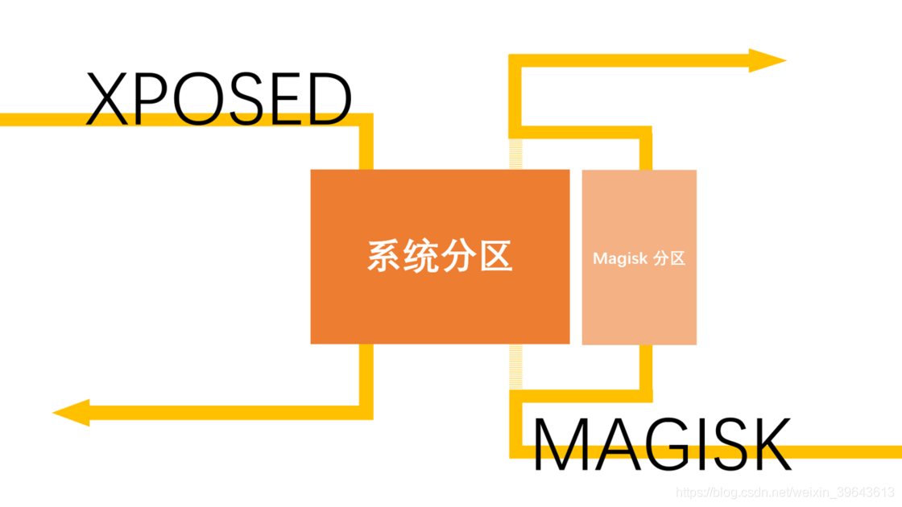

Xposed/Magisk 原理示意图

Magisk 的实现方式就像是一种魔法，当被挂载的 Magisk 分区被隐藏甚至被取消挂载时，原有系统分区的完整性丝毫未损，玩需要 root 验证的游戏、运行对设备认证状态有要求的应用甚至进行需要验证系统完整性的 OTA 更新都没有任何问题。

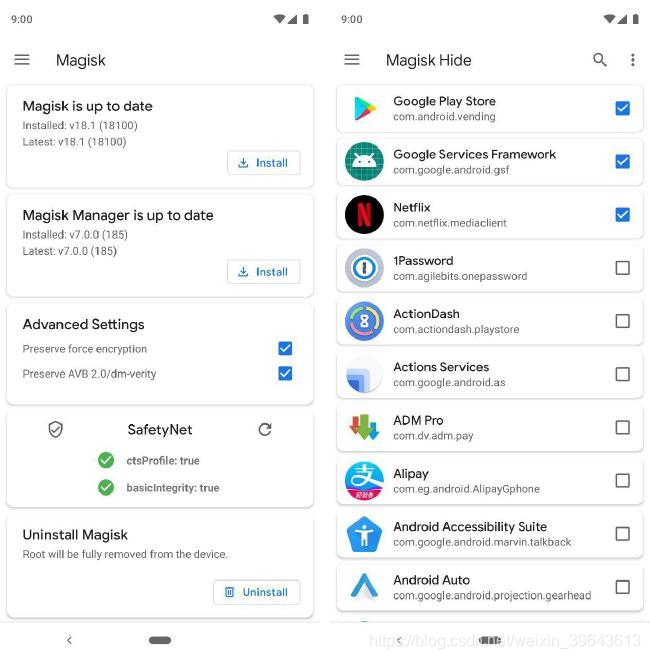

可通过 SafetyNet 认证并有针对性地隐藏 root

因此严格来说 Magisk 可以被看作是一种文件系统，这种文件系统通过巧妙的实现方式避开了对系统文件的直接修改，从稳定性上来看要优于以往任何一种系统框架，这也是当前它在玩机社区广受认可和好评的原因所在。

## 它的魔力不止于 root
很多人对 Magisk 的初步认识可能是 root ——在 SuperSU 销声匿迹之后，它自然而然就成为了当前 Android 社区用来获取 root 权限的主流方式。

不过 Magisk 特殊的运作机制还赋予了它相较于 Android 平台其他定制工具而言独一无二的特质——**systemless**。这种 systemless 特质让 Magisk 拥有了获取 root 权限之外的诸多优势：

**一方面，得益于独特的挂载机制，使用 Magisk 时我们可以有针对性地隐藏 root，甚至暂时隐藏 Magisk 本身。**

如此一来，不仅「root 模式下使用特定应用」成为了可能，就连无缝 OTA 更新这种「魔改党」们想都不敢想的事也变得不再遥远。在 Magisk Manager 应用的设置中，我们甚至还可以用随机包名对 Magisk 进行重新安装，让它从其他应用的眼皮底下彻底消失——多么具有魔法特质的高明手段！

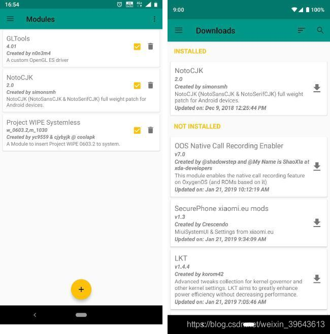
**另一方面，挂载系统的存在，也让 Magisk 拥有了多样的模块化生态系统。**

既然用了「开外挂」的实现方式，那不妨就多挂载一些额外的东西，字体、音效、驱动……甚至 Xposed 本身。Magisk 提供了一个独立于系统分区以外的、可以随时隐形的「沙盒」，那自然不能将其才华禁锢于 root 这一件事上。在 Magisk 的模块仓库里，我们可以找到各式各样的模块（modules）来满足自己的定制化需求，借助这些模块，我们在 root 之后能做的事情其实也还有很多。

在这里的讨论语境下，Magisk 如何给人们留下「框架」这一认知误区的原因就浮出水面了。**只是功能方面好不逊色的 Magisk，稳定性和上手门槛对大部分用户来说都更加友好。**

## 如何安装 Magisk
作为一套复杂的文件系统，Magisk 的安装步骤却是十分简单。

在电脑上配置好 adb 环境 并解开 Bootloader 锁后，如果你的设备有来自 TWRP 的官方支持，只需在打开 USB 调试后将手机与电脑相连，然后打开电脑端的命令行窗口：

1. 执行 `adb reboot bootloader` 进入 Bootloader 界面
2. 执行 `fastboot boot TWRP.img` 进入临时 TWRP
3. 在 TWRP 中刷入你下载的 Magisk 安装包

没有官方 TWRP 支持的设备安装 Magisk 的步骤要稍微复杂一些：

1. 从你的刷机包中提取当前固件的 **boot.img** 文件，将它传入到安装了 Magisk Manager 的手机中
2. 进入 Magisk Manager —— 安装（install）—— install —— 修补 boot 镜像文件
3. 然后选择传入的 boot.img 文件进行生成，并将生成后的 Patchedboot.img （姑且这么命名） 传输到电脑上。

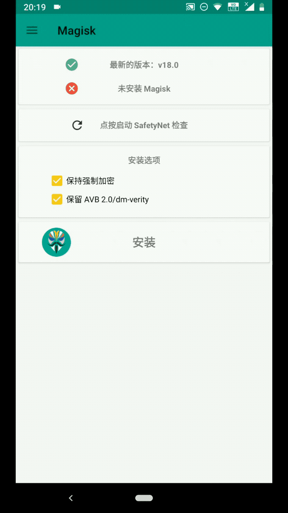

修补boot镜像文件

1. 打开命令行窗口
2. 执行 adb reboot bootloader 进入 Bootloader 界面
3. 执行 fastboot boot Patchedboot.img 来加载生成后的 boot 分区文件获取**临时 root**

此时进入系统，你会发现你已经成功安装了 Magisk（如果显示没有安装则为获取失败，请检查操作过程重新尝试），但这还不够，我们还得进入 Magisk Manager，选择安装（install）——install——Direct Install（直接安装）才能将临时 root 转换为永久 root。

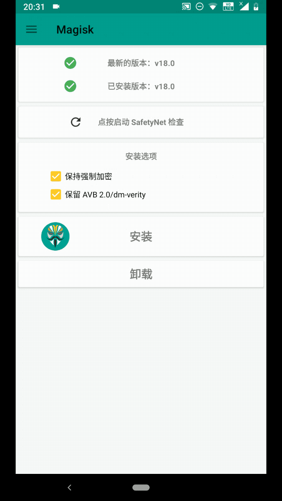

别忘了进行二次安装

三星、华为等特殊机型的 Magisk 安装方法参见 Magisk 官方帮助文档。

安装完 Magisk 后，我们就可以通过 TWRP 或者 Magisk Manager 刷入获取到的模块了。模块的获取方式可以是 Magisk Manager 自带的模块仓库，也可以是其他第三方论坛（如酷安、XDA 等）。

卸载 Magisk 最为彻底的方式就是在 Magisk Manager 中点击「卸载」、「完全卸载」，应用会自动下载刷完 uninstall.zip 卸载包、自动卸载它自己、自动重启。如果你无法进入系统，在 TWRP 中手动刷入 uninstall.zip 卸载包即可。

至于哪些模块值得刷，就是完全看个人需求了。我们会在后续文章为大家推荐一些基础的必备模块，也欢迎 Magisk 的老玩家们向我们投稿分享。

# 二. 保留 Magisk 进行「无痛 OTA」
无论从我平时接触到的 Android 用户还是从此前与 root 相关的讨论来看，很多人在要不要 root 这件事情上反复纠结的最大原因在于 OTA。

对移动平台操作系统而言，OTA 更新也许是最为常见也最为方便的系统升级方式，以 Google 自家的 Pixel 设备为例，一次没有太多功能更新的月度安全补丁推送也许只需要下载几十兆大小的更新包，与之形成对比的则是以 GB 为单位计算的全量工厂镜像。

因此无论从便利性还是从带宽、流量角度出发，为 OTA 而放弃 root 的行为都值得理解了：**大部分 root 工具都会直接对系统分区内的文件进行修改，经过修改的系统文件显然是过不了 OTA 流程中「系统完整性验证」这一关的。**

而我们在 上一篇 中已经提到，得益于 systemless 特性，能够无痛 OTA 更新也是 Magisk 的一大优点。本文就将介绍如何在安装了 Magisk 的前提下进行无痛 OTA 系统更新。

## 确认 A/B 系统分区支持状态
A/B 系统分区是 Google 在 Android 7.0 时代引入的新机制，顾名思义，采用这个机制的设备拥有 A、B 两套系统分区，用户数据则能够在这两套系统分区之间共用。

这种分区机制带来的最大好处，在于让无缝系统更新（seemless updates）成为了可能——举个例子，当我们在 A 系统中进行 OTA 更新时，接受更新的很有可能是当前并未启用的 B 系统。这样一来，OTA 更新的过程可以在不干扰当前使用的前提下顺利完成，手机重启后，系统分区从 A 切换到 B，用户自然也就用上了新系统。

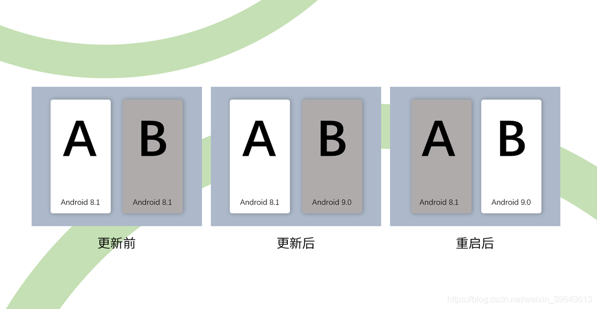

A/B 分区的系统更新流程

此外，采用 A/B 系统分区的设备在遭遇 OTA 事故时，还能在系统启动失败后自动切换回更新前能够正常工作的系统分区。得益于这些便利，Android 7.0 正式推出后的主流 Android 设备很多都已经支持了 A/B 系统分区方式。

A/B 分区同样也是安装了 Magisk 状态下进行无痛 OTA 系统更新的前提条件，**那么该如何确定自己的设备支持这种分区方式呢？**

首先，如果你已经在电脑端正确配置好了 ADB 环境，不妨在手机端打开 USB 调试后将手机连上电脑，然后在电脑端按照下列步骤检查设备是否采用了支持无缝系统更新的 A/B 分区：

1. 运行 CMD 命令行工具或终端
2. 执行 adb shell 指令，此处应返回 设备代号:/$
3. 随后执行 getprop ro.build.ab_update 指令

返回结果为 true 则表示你的设备采用了 A/B 系统分区。

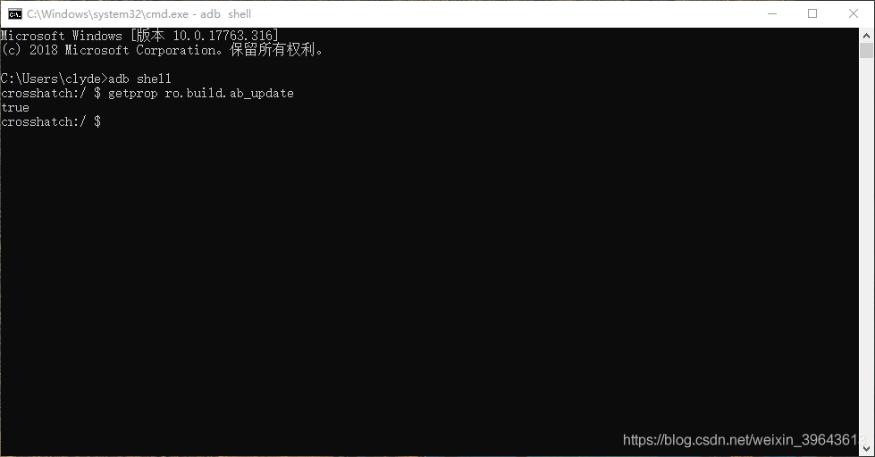

使用 CMD 鉴定 A/B 分区兼容性

当然，你也可以通过 Treble Check 这款小应用来检测 Project Treble 和 A/B 系统分区的兼容性，这款工具无需 root，下载安装后直接运行即可看到结果。

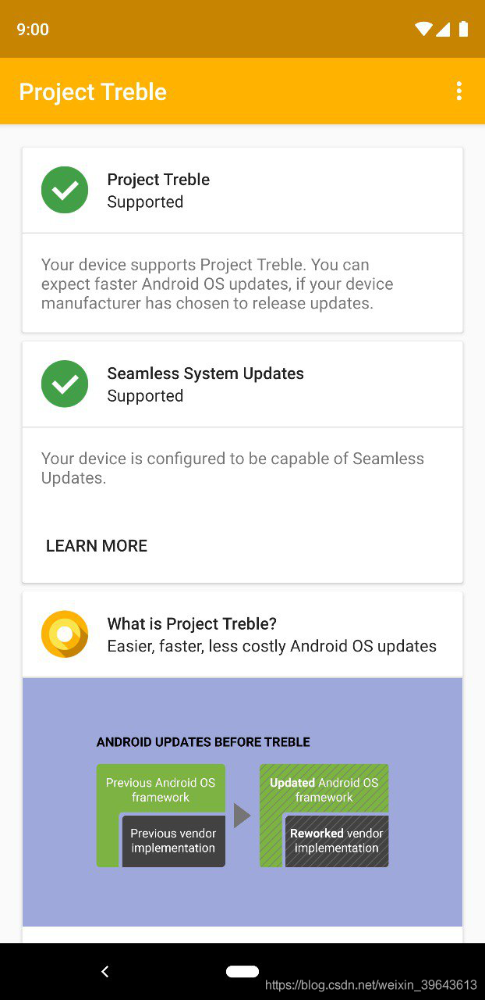
确认设备支持 A/B 系统分区后，我们就可以接着进行下一步了。

## 做好准备工作
由于 A/B 分区在系统更新过程中几乎不会对用户造成打扰，一些 OEM 厂商也顺势将 OTA 更新做成了一个可以在后台自动完成的任务。

但问题在于，伴随着自动完成 OTA 更新后系统分区的切换，我们在更新前借助 Magisk 获取的 root 权限和已经安装过的 Magisk 模块都会一一失效。鉴于本文要讨论的 OTA 更新特指 **既能通过 OEM 官方通道进行 OTA 更新，又能在 OTA 更新后保留 Magisk 的 root 权限和已安装模块。** 如果你想在安装了 Magisk 后的使用过程中均采用本文介绍的 OTA 方式，就必须做好一些事前准备，

首先，找到并关闭自动系统更新选项。这个选项位于开发者选项的第一部分设置当中，因此还算好找。

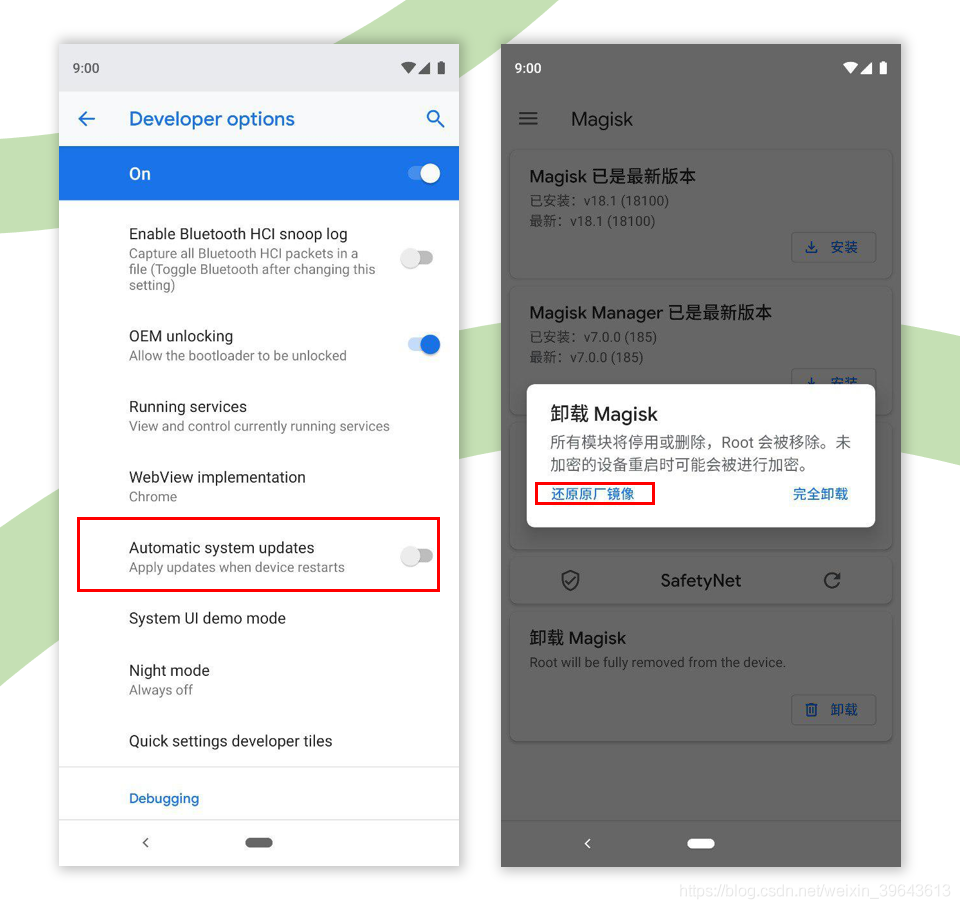

关闭自动更新并还原原厂件镜像

然后，在厂商发布系统更新或确认能检测到 OTA 更新后，点击进入 Magisk Manager 应用，找到位于主界面的「卸载 Magisk」选项，然后点击「还原原厂镜像」。

注意，如果你在此时遇到了 `stock backup does not exist` 这样的提示，则表明 Magisk 未能在安装时成功创建 boot 分区的备份（自然也就无法还原原厂镜像），此时建议使用我们在 第一篇 文章中提到的 boot 镜像修补法来重新安装 Magisk，这样就能保证原厂镜像得到正确备份了。

另外，和第一步操作不同的是，自动系统更新选项我们建议保持长期关闭，**还原原厂镜像操作在每次进行 OTA 更新操作前都要执行。**

## 科学的 OTA 更新流程
接下来我们要做的就是执行正常的 OTA 更新流程了。

在执行完毕「还原原厂镜像」操作后，大部分机型在系统设置中应该都能成功检测并安装来自 OEM 厂商的 OTA 更新了。

正如上文所言，OTA 更新流程结束后，系统应该会提示我们重启，重启后系统就自动切换到了更新过的另一个系统分区上。只是此时另一个系统分区并没有保留 Magisk 的安装和 root 状态，相关模块也无从启用。

**因此在安装完 OTA 更新后，请先不要重启。**

无视系统的重启提示，直接打开 Magisk Manager 应用，找到「安装」选项，然后在点击后的弹出菜单中选择「安装到未使用的槽位（Install to Inactive Slot）」。

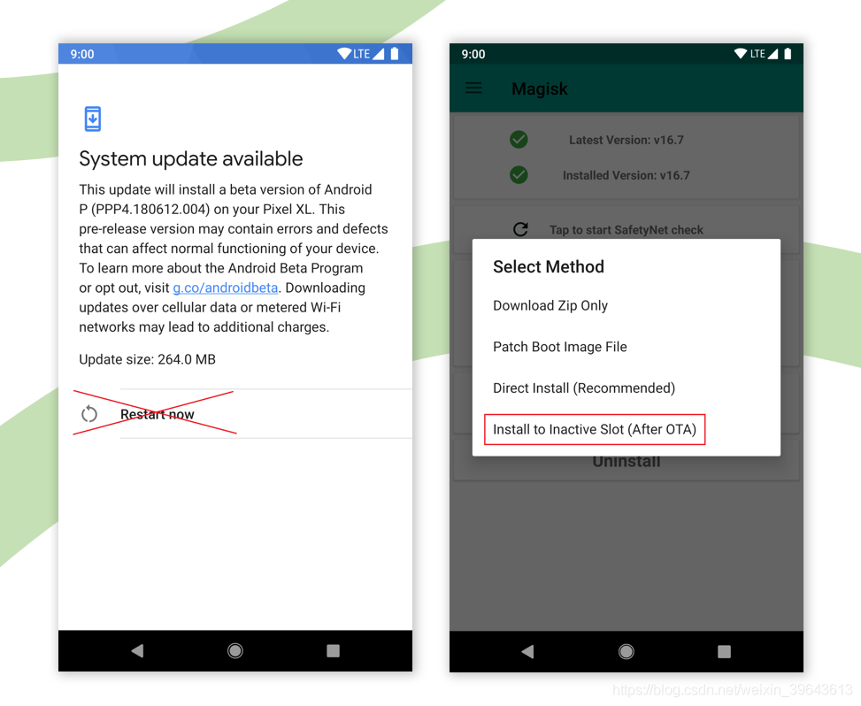
随后，Magisk 就会在已经顺利进行过 OTA 更新的另一系统分区中进行安装。安装完成后直接点击安装界面右下角的「重启」按钮，即可重启到既保留了 Magisk，又应用了 OTA 更新的另一系统分区了。

# 三：Magisk Manager 详解
久等了。

在本系列的前两篇文章中，我们介绍了 Magisk 这个（相对而言）兼具稳定性和可玩性的「神器」:作为一个 root 方案，它能在不破坏系统实现无痛 OTA，作为一个插件扩展平台，它又能提供丰富的自定义模块来满足多样化的定制需求。

但也正如我们在本系列第一篇中所言， Magisk 本质上是一种文件挂载系统。我们大多数时候所接触到的那个图标为面具的应用，其实只是我们与之发生各种交互行为的「媒介」。

今天我们就来介绍一下这个「媒介」的四大功能。

## 隐藏 root 事实「无痛」玩机

从某种角度上来说，是 Magisk Hide 让「刷入 Magisk」这件事情从可选项变成了推荐项。

>大家好，我是一名 Android 玩家，自从看了少数派的文章给手机解 BL 锁、Root 了之后，奇怪的事情便接踵而至：没办法从 Play Store 中搜索到 Netflix、心爱的宝可梦走等一些游戏没办法玩耍、朋友推荐我下载的 App 居然提示不兼容此设备、看视频的时候清晰度死活上不去……
>难道是我的手机坏了？

许多新手玩家都有这样的疑惑。事实上，包括谷歌服务在内的许多 Android 上的应用、游戏、服务都十分重视保护自己的版权内容，当这些软件检测到你的手机遭到「魔改」后，便会拒绝认证你的设备。

好在道高一尺魔高一仗，我们现在可以通过 Magisk Hide 来绕过这些检测。

在我们设置 Magisk Hide 前，先进入 Magisk Manager 检测是否通过了谷歌服务中的 SafetyNet 安全性测试。想要通过 SafetyNet 测试，最好使用原厂系统，或者是值得信赖的第三方 ROM 正式版（也就是 Official Builds），以减少不必要的麻烦。

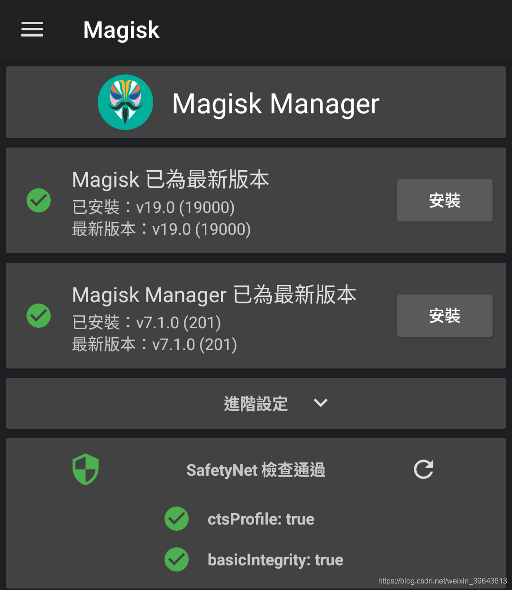

主界面中的 SafetyNet 检测

如果是 **basic integrity** 这一项没有通过认证，那说明你遇到了大麻烦：试着开启「Magisk 核心功能模式」或者卸载所有模块，如果还是没有通过，那么你可能需要换一个系统或者第三方 ROM 了。

如果是 **ctsProfile** 这一项没有通过，那说明你的 ROM 没有通过其兼容性测试，一些 beta 版本或者国内厂商的 ROM 可能出现这种问题。这时我们下载使用 MagiskHide Props Config 这个模块往往能够解决问题。

确保 SafetyNet 检测无虞后，我们才能开始「蒙眼」行动，即对指定的某些 App 隐藏 Magisk 的存在。

在 Magisk Manager 的侧边菜单中找到 Magisk Hide 项，选中我们想要隐藏的目标 App 即可。最近更新的 Magisk 19.0 版本还加入了「应用组件」层面进行 Magisk Hide 的功能。

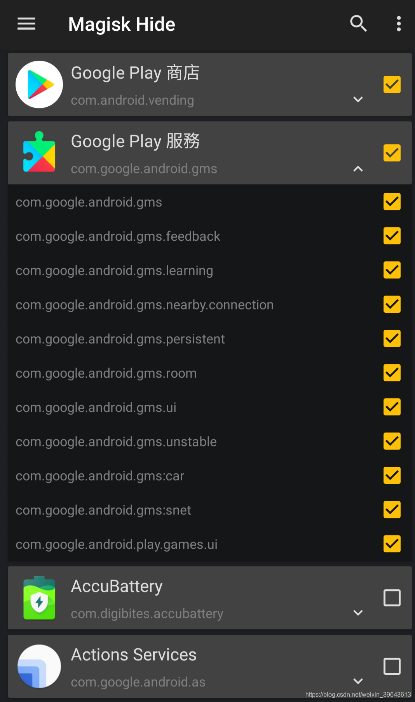

Magisk Hide 界面

至于对哪些应用进行 Magisk Hide，这个就要看每个读者的具体需要了。一般来说，Google Play 服务和商店是必须的，但也请注意这条来自开发者的注意事项：如无必要，不要**随意**在 Magisk Hide 列表添加 App 而造成滥用（**Do not abuse MagiskHide!**）。

如果你还不放心，还可以去 Magisk Manager 的设置中打开「隐藏 Magisk Manager」。此时 Magisk Manager 将会进行一次重新安装，以便打乱软件包名来躲过对 Magisk Manager 的检测。

至此，Magisk 已经能比较好地向那些对「系统完整性」有苛刻要求的应用隐藏自己。

## 替代 SuperSU 进行 root 权限管理
大多数用户刷 Magisk ，就是奔着超级用户权限（Superuser）去的，这也是 Magisk 的核心功能。

身兼 root 工具的 Magisk，在这方面的功能可以说是稳扎稳打。用户不必要过度操心，直接使用 Magisk Manager 中的默认设置就能用得舒心。App 向你提请超级用户权限的时候，用户可以选择永久同意、一定时间内同意或者是拒绝，超时之后没有进行选择，那么便会选择拒绝。

进入菜单中的超级用户项，你还可以手动管理已经进行操作过的 App，进行通过或者拒绝，亦或者是删除操作让 App 在下次打开时再次弹窗申请权限。子项目里你可以关闭 App 在使用超级用户权限时的浮动提醒或者是记录。虽然我并不建议这么做，实在厌烦的话还是从心关闭提醒吧。

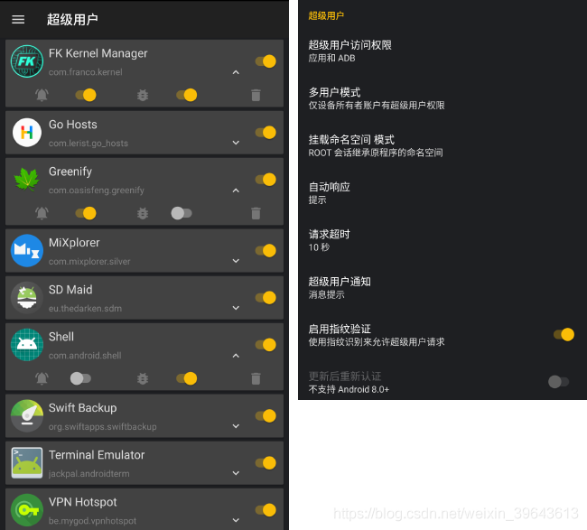

关于超级用户的设置

Manager 设置中的关于超级用户的并不多，但是用户还是可以自定义请求权限弹窗的倒计时时长（默认 10 秒）、对于请求权限的默认处理、开启指纹认证等等。

## 获取、管理 Magisk 模块
「模块」这个字眼，让许多用户把 Magisk 和 Xposed 这两件完全不同的工具混淆在了一起。

模块的本质，是将原本需要玩家繁复操作的玩机过程与 Magisk「不改动系统」（Systemless-ly） 的特性结合在一起，并进行打包和分发。模块极大地简易了玩机操作，一个小小的 .zip 包文件可能包含了另一套全字重字体，可能囊括了一整套内核参数调教方案，可能附加了一些额外的小功能或是界面美化……模块只是简易了玩机操作的实践，但并没有将它无害化，该翻车的操作还是会翻车，这个时候模块的管理就变得尤其重要。

从获取模块的角度来说，与 Xposed 类似，Magisk Manager 内集成了一个官方的模块仓库，用户在侧边菜单栏中切换到下载便可以查看这个模块仓库。最新更新的模块会显示在靠前位置，方便我们优先挑选那些仍在活跃更新的模块。但令人遗憾的是，模块仓库至今没有分类，你只能选择从这个单一的漫长的列表向下滑去，逐一阅读模块的简介（大多为英文）。

这个时候，英语这门语言工具终于派上了用场，点击模块卡片会具现出模块开发者的说明，里面会标明这个模块的用途、**要求**、**用法**、更新说明、相关的帖子群组链接等等重要内容。我强烈建议**对于未知的模块，应该先仔细完整地阅读一遍此说明。**

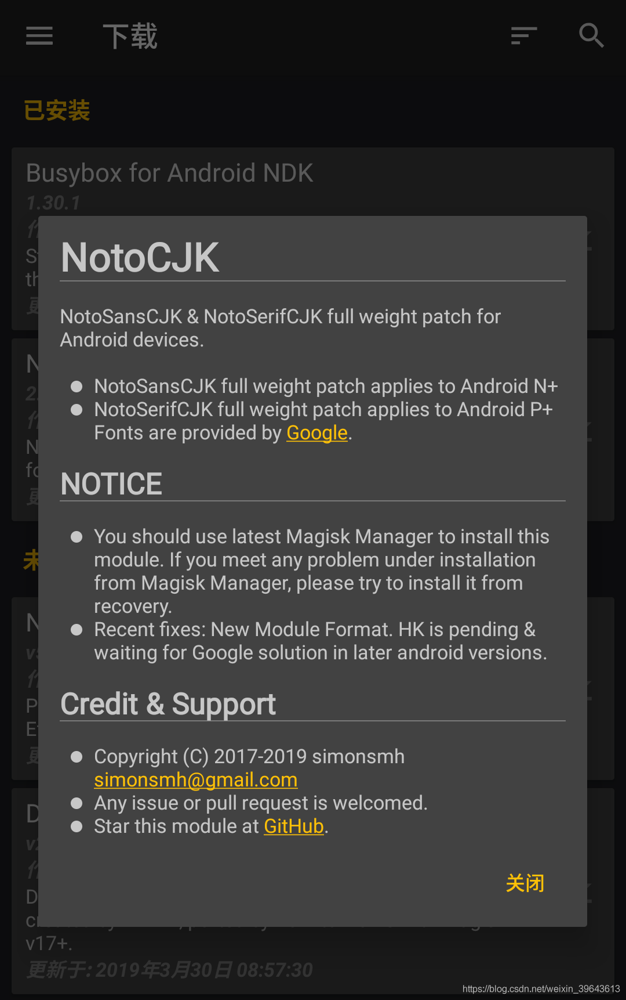

以 NotoCJK 为例，仔细查看模块说明

当然了，任何有能力制作模块的开发者都能分发自己制作的模块，也可以选择是否提交到官方的模块仓库。玩机论坛里面你可以看到更多玩家的刷入反馈和测试，著名国外玩机论坛 XDA 还有专门的 Magisk 板块，国内的酷安等交流地也有不少活跃制作模块的开发者。

知道模块可以从哪里得到后，我们要讨论的就是管理问题。管理主要是刷入和卸载两方面。广义地说，任何能给手机刷入 .zip 包的工具都可以进行模块的刷入，比如 TWRP、Magisk Manager 和 Franco Kernel Manager 等，操作也都简单得类似，刷入、重启生效。

今次我们主要讲讲 Magisk Manager：在模块仓库中点击下载，便会自动开始下载、刷入的步骤，刷入完成后你可以选择关闭或者是直接重启生效。模块更新也是一样的步骤。但如果你是手动下载的模块 .zip 包，一切都需要手动。进入模块菜单项，点击下方的加号图标进入文件目录选取目标模块 .zip 包，即可开始模块的刷入或是更新。

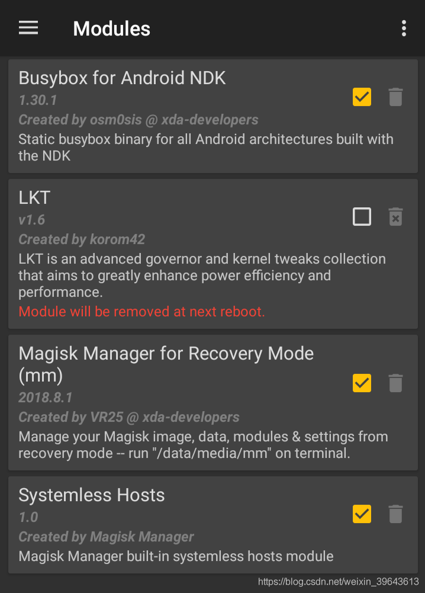

对模块进行管理

如果你刷入模块重启能顺利进入系统，那么意味着这个模块的刷入还算安全。在能够进入 Magisk Manager 的情况下，停用某个模块只需要把相应模块的钩子取消掉即可，如果你还想删掉这个模块，一并点击垃圾桶图标删除。停用和卸载都需要重启生效。

可是如果「翻车」进不了系统，那该如何停用和卸载问题模块呢？

1. 无论是提前安装好，还是翻车后进入 TWRP 安装，你都需要用到 Magisk Manager for Recovery Mode 模块（仓库中搜索 mm 即可）。翻车后进入 TWRP 中的终端输入使用指令即可开始管理模块，详见该模块的使用说明。
2. 部分模块可以以「同样的模块包，再刷入一次便是卸载」的方式对应进行停用卸载。
3. 痛定思痛，进入 TWRP 刷入 Magisk 的卸载包，卸载一整个 Magisk。
4. 没有 TWRP，保留数据刷写当前系统的完整包。
5. 
玩机千万条，数据第一条；模块不规范，机主两行泪。

## Magisk 安装与升级
Magisk Manager 不光是用于管理 Magisk 的功能行使，也时刻承载着其版本更迭。

每当 Magisk 进行版本更迭的时候，用户就会在 Manager 收到更新推送，一般是先更新 Magisk Manager，再由其来更新 Magisk 本体。有趣的是，和 Google Chrome 类似，Magisk 也具有稳定版、beta 测试版和 Canary 金丝雀版三个版本，都是由开发者官方推出，用户可以根据自己的经验和需要选择对应的版本。

同时，Magisk 是一个开源项目，不少开发者对它也有自己的想法和设计，比如开发 MD2 设计的 Manager，甚至是在 github 上维护一个自己的 Magisk 版本，提供更新链接供用户在 Manager 的设置中填入，从而跟随此版本的开发线。

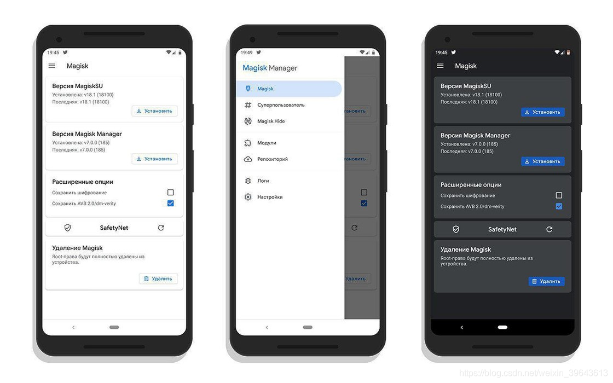

由开发者 @vsmhell 制作的 MD2 风格的 Magisk Manager

没有刷入 Magisk 的时候，Manager 能做的事情很有限，主要功能就是将原厂的 boot 分区镜像打包成具有 root 权限的镜像，供玩家启动和刷入。

## 结语
Magisk 的设计包含了许多奇妙的构想，呈现到功能上来让人惊呼 Magic。如果想要最大程度地对 Magisk 魔法般的功能善加利用，必须足够熟悉 Magisk Manager。大胆尝试、谨慎操作，补全系统的特性，或是增加自己想要的功能，让手中的设备成为一台梦想机，享受美好的数字生活。