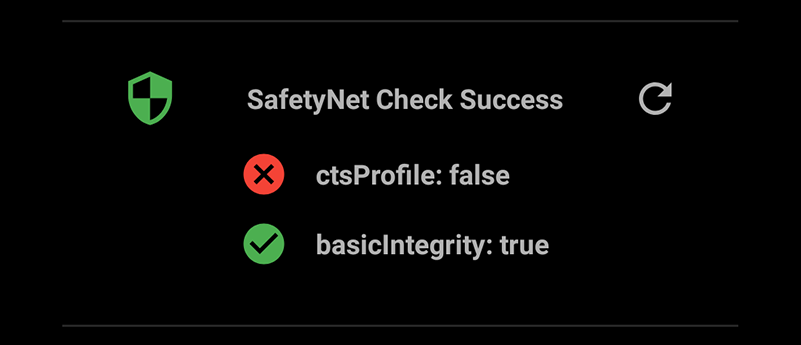
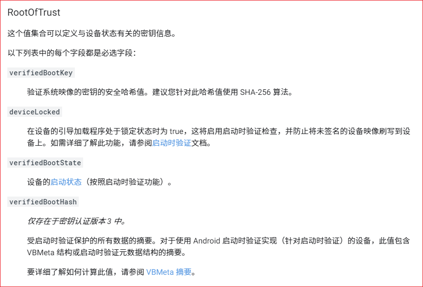

# Magisk的root隐藏功能

作为目前Android上面最为成功、便利的root框架，Magisk被大量用户用来获取设备的root权限。而它集成的隐藏root的功能也成功地骗过了许多应用的检查，甚至Google官方用于检测设备固件是否被修改的SafetyNet API也一直都被它骗过。不过这种好日子马上就要结束了，因为最近Google对SafetyNet作出了一次大更新，让它变得难以被绕过。

很多Android应用都会检测设备的root状态，比如说各种游戏和银行应用。其中有相当数量都使用了Google提供的SafetyNet API。它的“基本完整性”检查会检测设备的BootLoader是否被解锁，刷过机的玩家应该都知道，解了锁的BootLoader才能允许玩家刷入经过修改的各种Recovery、内核。而Magisk用来隐藏自己的方式就是直接修改内核，让自己拥有比Google Play更高的权限，直接为检测进程创建一个虚假的“安全环境”以欺骗它。这种手段非常有效，直到最近Google开始为SafetyNet引入新的硬件级检测。

在之前版本的Android中，Google引入了一项名为[Key Attestation](https://developer.android.com/training/articles/security-key-attestation)的功能，它可以提供设备的安全信息，新的SafetyNet认证就用上了这个功能。它基于证书链认证体系，如果想要骗过它，那么就要从设备的硬件密钥库中拿到相关的密钥，而这又涉及到破解设备的可信执行环境（TEE）固件，后者异常坚固。甚至有些设备直接采用专用的硬件安全模块，破解难度更高。

Magisk的主力开发者John Wu[在Twitter上面列举出了种种可能的招数](https://twitter.com/topjohnwu)，并一一说明了不可行的原因。过去的几年中，他一直在和Google交手，让Magisk活到了今天，但这次他好像是真的没办法了。不过Magisk Hide也并不是完全失效了，对于一些没有使用SafetyNet验证的应用，它还是能够有效地将设备伪装成非root状态的。