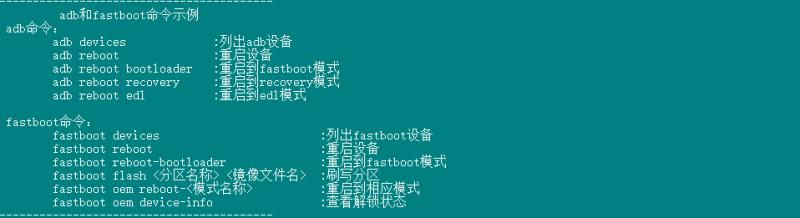
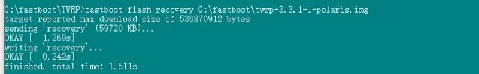
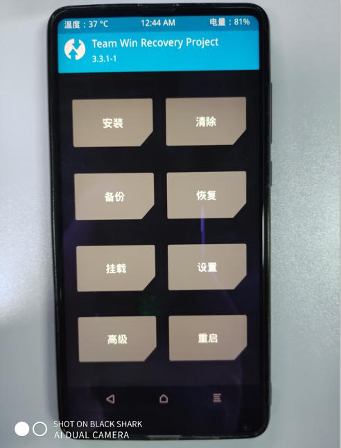
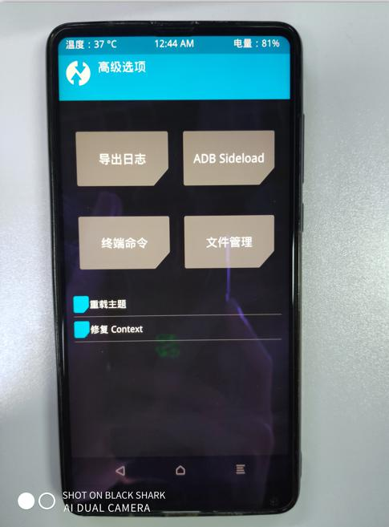
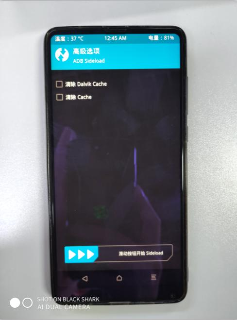
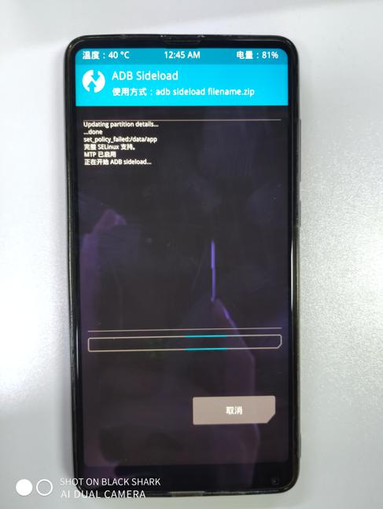
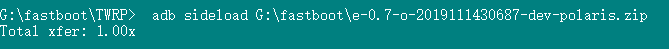

# 【TWRP】使用adb sideload线刷ROM的方法

本教程详细介绍 手机刷三方ROM 之前需要安装的 **TWRP** 这个神器工具
`楼主的手机是小米，所以此教程以小米手机为例。其他手机原理类似`

#### 第一步，解锁引导程序

1. 访问[小米的官方](http://en.miui.com/unlock/)解锁网站并申请解锁权限。
2. 等待直到获得批准，这可能需要几天的时间。
3. 同时，该设备链接到您的帐户弥在`Settings`> `Additional settings`> `Developer options`> `Mi Unlock status`。此步骤是强制性的，将触发倒计时360小时，这是设备可以解锁之前的等待时间。
4. 获得批准后，请再次访问该网站，您将被重定向到Mi Unlock应用程序下载页面。
5. 下载Mi Unlock应用程序（运行该应用程序需要Windows）。
6. 360小时的等待期结束后，请运行Mi Unlock应用并按照该应用提供的说明进行操作。
7. 成功验证设备和Mi帐户后，应解锁引导加载程序。
8. 由于设备已完全重置，因此您需要重新启用USB调试才能继续。

> 必须使用Mi帐户才能申请权限。您无需重新申请解锁新设备的权限，但是请注意，每个帐户仅允许每30天解锁一台唯一的设备。

> 强烈建议在进行解锁之前，在设备上安装最新的官方MIUI开发软件包。

#### 第二步，安装TWRP `fastboot`

1. 下载自定义恢复-您可以下载[TWRP](https://dl.twrp.me/polaris)。只需下载名为的最新恢复文件`twrp-x.x.x-x-polaris.img`。
2. 通过USB将设备连接到PC。


\3. 在计算机上，打开命令提示符（在Windows上）或终端（在Linux或macOS上）窗口，然后键入：

```
 adb reboot bootloader
```

您也可以通过组合键启动进入快速启动模式：

- 关闭设备电源，按住Volume Down+ Power。按住两个按钮，直到屏幕上出现“ FASTBOOT”字样，然后松开。

1. 设备进入快速启动模式后，请通过键入以下内容验证您的PC能够找到它：

   ```
    fastboot devices
   ```

2. 将闪存恢复到设备上：

   ```
    fastboot flash recovery twrp-x.x.x-x-polaris.img
   ```

   在某些设备上，可能需要以下命令

   ```
    fastboot boot twrp-x.x.x-x-polaris.img
   ```



当显示`OKEY`说明安装成功

1. 接着输入以下命令进入**`TWEP`**：

   ```
   fastboot oem reboot-recovery
   ```

即可看到这个界面。


点击高级


点击ADB Sideload



滑动开始Sideload



到达这个界面 连接`USB数据线到电脑` 然后 使用`ADB`执行

```
 adb sideload G:\fastboot\e-0.7-o-2019111430687-dev-polaris.zip
```

`sideload`后面是你的要刷入的ROM文件


当出现Total 即刷入成功 然后拔掉数据线 操作手机按提示重启即可进入 。只要ROM没问题 一般情况都可以正常进入系统。