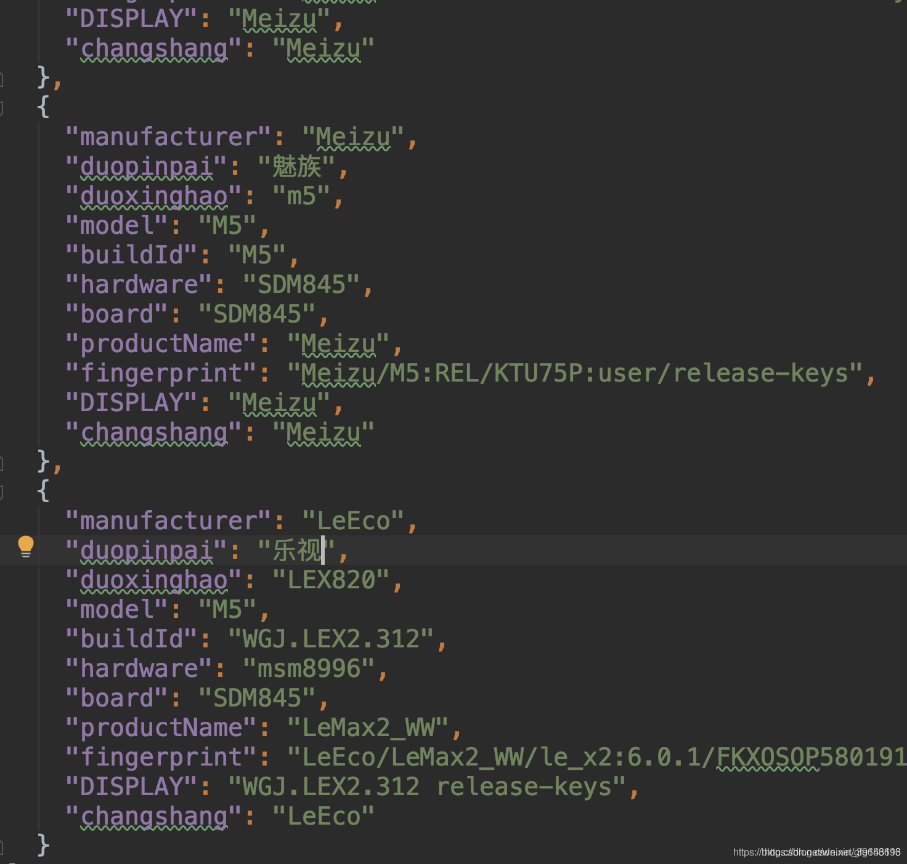
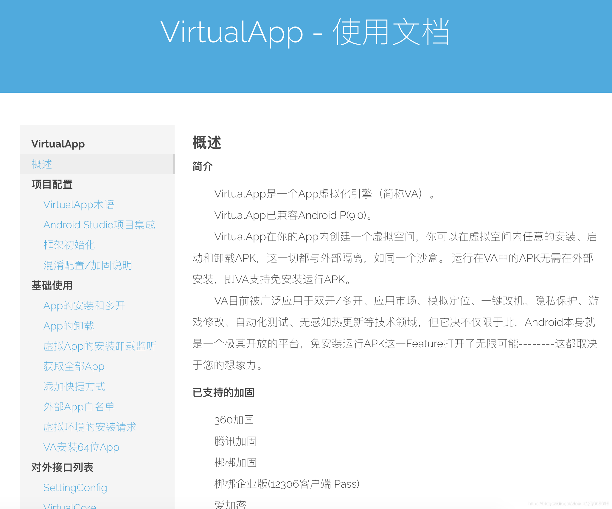

# 免root实现 Android改机（一键新机）技术解密

src:https://blog.csdn.net/gfg156196/article/details/103352172


此篇文章仅探讨Android底层技术。不提供任何软件和安装包……

我们通过一些底层技术对手机中的各种基础信息进行一个修改。

举例说明：主要修改的参数有：

Android_Id、IMEI、手机序列号、手机号码、WIFI-MAC、WIFI-Name、安卓系统版本、ROM固件、手机号码、手机型号、手机品牌、CPU型号、手机制造商、GPS定位、通话记录模拟、手机短信模拟……

等各类安卓手机系统信息的修改功能。

***
**举例子：统改机方式，使用xposed的代码：**

***

```java
HTool.XHookMethod(android.telephony.TelephonyManager.class.getName(),mLpp.classLoader, "getDeviceId", GetCatValue("imei"));
HTool.XHookMethod("com.android.internal.telephony.PhoneSubInfo",mLpp.classLoader, "getDeviceId", GetCatValue("imei"));
HTool.XHookMethod(android.telephony.TelephonyManager.class.getName(),mLpp.classLoader, "getSubscriberId", GetCatValue("imsi"));
HTool.XHookMethod(android.telephony.TelephonyManager.class.getName(),mLpp.classLoader, "getLine1Number", GetCatValue("number"));
HTool.XHookMethod(android.telephony.TelephonyManager.class.getName(),mLpp.classLoader, "getSimSerialNumber", GetCatValue("simserial"));
HTool.XHookMethod(android.telephony.TelephonyManager.class.getName(),mLpp.classLoader, "getSimCountryIso", GetCatValue("simcountryiso"));
HTool.XHookMethod(android.telephony.TelephonyManager.class.getName(),mLpp.classLoader, "getSimOperator", GetCatValue("simoperator"));
HTool.XHookMethod(android.telephony.TelephonyManager.class.getName(),mLpp.classLoader, "getSimOperatorName", GetCatValue("simoperatorname"));
HTool.XHookMethod(android.telephony.TelephonyManager.class.getName(),mLpp.classLoader, "getNetworkCountryIso", GetCatValue("networkcountryiso"));
HTool.XHookMethod(android.telephony.TelephonyManager.class.getName(),mLpp.classLoader, "getNetworkOperator", GetCatValue("networkoperator"));
HTool.XHookMethod(android.telephony.TelephonyManager.class.getName(),mLpp.classLoader, "getNetworkOperatorName", GetCatValue("networkoperatorname"));
 
//WIFI信息
HTool.XHookMethod(android.net.wifi.WifiInfo.class.getName(),mLpp.classLoader, "getMacAddress", GetCatValue("wifimac"));
HTool.XHookMethod(android.net.wifi.WifiInfo.class.getName(),mLpp.classLoader, "getBSSID", GetCatValue("bssid"));
HTool.XHookMethod(android.net.wifi.WifiInfo.class.getName(),mLpp.classLoader, "getSSID", "\""+GetCatValue("ssid")+"\"");
XposedHelpers.findAndHookMethod(java.net.NetworkInterface.class.getName(),mLpp.classLoader, "getHardwareAddress", new Object[] {
        new XC_MethodHook()
        {
            protected void afterHookedMethod(MethodHookParam param) throws Throwable
            {
                //每个安卓系统中 至少存在5个以上的MAC地址 
                //但大多数软件只修改了MAC和BSSID 
                //真正的MAC修改是在此处理函数中监听每次访问.
            }
        }});
         
//蓝牙信息
HTool.XHookMethod(BluetoothAdapter.class.getName(),mLpp.classLoader,"getAddress", GetCatValue("bluemac"));
HTool.XHookMethod(BluetoothAdapter.class.getName(),mLpp.classLoader, "getName", GetCatValue("bluename"));
 
//设置手机信息 无论手机是否插入了sim卡 都会模拟出SIM卡的信息 APP获得SIM卡消息时返回该手机已有SIM卡
HTool.XHookMethod(android.telephony.TelephonyManager.class.getName(),mLpp.classLoader, "getPhoneType", TelephonyManager.PHONE_TYPE_GSM);
HTool.XHookMethod(android.telephony.TelephonyManager.class.getName(),mLpp.classLoader, "getNetworkType", TelephonyManager.NETWORK_TYPE_HSPAP);
HTool.XHookMethod(android.telephony.TelephonyManager.class.getName(),mLpp.classLoader, "getSimState", TelephonyManager.SIM_STATE_READY);
HTool.XHookMethod(android.telephony.TelephonyManager.class.getName(),mLpp.classLoader, "hasIccCard", true);
 
     
//修改手机系统信息 此处是手机的基本信息 包括厂商 信号 ROM版本 安卓版本 主板 设备名 指纹名称等信息
XposedHelpers.setStaticObjectField(android.os.Build.class, "MODEL", GetCatValue("model"));
XposedHelpers.setStaticObjectField(android.os.Build.class, "MANUFACTURER", GetCatValue("manufacturer"));
XposedHelpers.setStaticObjectField(android.os.Build.class, "BRAND", GetCatValue("brand"));
XposedHelpers.setStaticObjectField(android.os.Build.class, "HARDWARE", GetCatValue("hardware"));
XposedHelpers.setStaticObjectField(android.os.Build.class, "BOARD", GetCatValue("board"));
XposedHelpers.setStaticObjectField(android.os.Build.class, "SERIAL", GetCatValue("serial"));
XposedHelpers.setStaticObjectField(android.os.Build.class, "DEVICE", GetCatValue("device"));
XposedHelpers.setStaticObjectField(android.os.Build.class, "ID", GetCatValue("id"));
XposedHelpers.setStaticObjectField(android.os.Build.class, "PRODUCT", GetCatValue("product"));
XposedHelpers.setStaticObjectField(android.os.Build.class, "DISPLAY", GetCatValue("display"));
XposedHelpers.setStaticObjectField(android.os.Build.class, "FINGERPRINT", GetCatValue("fingerprint"));
 
XposedHelpers.findAndHookMethod("android.os.SystemProperties",mLpp.classLoader, "native_get", new Object[] {String.class,String.class,
        new XC_MethodHook()
        {
            //为了防止某些APP跳过Build类 而直接使用SystemProperties.native_get获得参数
        }});
//修改系统版本 我看到世面上的软件基本上都是不能修改系统版本的 从而造成了刷量后 很多渠道最终会显示你的APP用户全部使用的某一系统版本
//这样的话数据就太假了.
XposedHelpers.setStaticObjectField(android.os.Build.VERSION.class, "RELEASE", GetCatValue("version"));
XposedHelpers.setStaticObjectField(android.os.Build.VERSION.class, "SDK", GetCatValue("apilevel"));
 
HTool.XHookMethod(android.os.Build.class.getName(),mLpp.classLoader, "getRadioVersion", GetCatValue("radioversion"));
 
//修改为指定的运营商mnc mcc信息
XposedHelpers.findAndHookMethod(android.content.res.Resources.class.getName(),mLpp.classLoader, "getConfiguration", new Object[] {
        new XC_MethodHook()
        {
            ...........................
            //此处的mnc和mcc必须和系统中其他关于运营商的数据对应!
        }});
 
//修改ANDROID_ID
XposedHelpers.findAndHookMethod(android.provider.Settings.Secure.class.getName(),mLpp.classLoader, "getString",
new Object[] {ContentResolver.class,String.class,
        new XC_MethodHook()
        {
            ...............................
            //此处会根据传入的String参数 判断返回值 其中包括比较关键的数据就是android_id
        }});
 
//防止APP使用Runtime.exec方式获取一些特定的系统属性
XposedHelpers.findAndHookMethod(Runtime.class.getName(),mLpp.classLoader, "exec",new Object[] {String.class,String[].class, File.class,
        new XC_MethodHook()
        {
            //一些APP从JAVA层获得到了数据 还会从shell(native)层获得一些更底层的数据 来判断用户的合法性
            //经常用到的有 cat、getprop、ifconfig等等命令，当exec执行这些命令后 往往会返回一些手机的真实信息
            //因为框架和处理方式不同，...部分此处根据自己需求，编写重定向返回值的过程...
        }});
 
//修改位置信息
XposedHelpers.findAndHookMethod(LocationManager.class.getName(),mLpp.classLoader, "getLastKnownLocation",
    new Object[] {String.class,
            new XC_MethodHook()
            {
                ..........................
                //返回预先设置好的经纬度信息以伪装地理位置
            }});
 
HTool.XHookMethod(Location.class.getName(),mLpp.classLoader, "getLatitude", latitude);
HTool.XHookMethod(Location.class.getName(),mLpp.classLoader, "getLongitude", longitude);
 
 
//修改GSM制式手机的基站信息
HTool.XHookMethod(android.telephony.gsm.GsmCellLocation.class.getName(),mLpp.classLoader, "getLac", GsmLac);
HTool.XHookMethod(android.telephony.gsm.GsmCellLocation.class.getName(),mLpp.classLoader, "getCid", GsmCid);
 
 
//修改CDMA制式手机的基站信息
HTool.XHookMethod(android.telephony.cdma.CdmaCellLocation.class.getName(),mLpp.classLoader, "getBaseStationLatitude", CdmaLatitude);
HTool.XHookMethod(android.telephony.cdma.CdmaCellLocation.class.getName(),mLpp.classLoader, "getBaseStationLongitude", CdmaLongitude);
HTool.XHookMethod(android.telephony.cdma.CdmaCellLocation.class.getName(),mLpp.classLoader, "getBaseStationId", CdmaBid);
HTool.XHookMethod(android.telephony.cdma.CdmaCellLocation.class.getName(),mLpp.classLoader, "getSystemId", CdmaSid);
HTool.XHookMethod(android.telephony.cdma.CdmaCellLocation.class.getName(),mLpp.classLoader, "getNetworkId", CdmaNid);
 
 
//模拟手机的APP列表
XposedHelpers.findAndHookMethod("android.app.ApplicationPackageManager",mLpp.classLoader, "getInstalledPackages",new Object[] {int.class,
        new XC_MethodHook()
        {
            //此处模拟正常用户的APP列表 其中随机的增加和删除一些常用APP 以达到每个手机的APP有很大的随意性和合理性
        }});
 
XposedHelpers.findAndHookMethod("android.app.ApplicationPackageManager",mLpp.classLoader, "getInstalledApplications",new Object[] {int.class,
        new XC_MethodHook()
        {
            //此处模拟正常用户的APP列表 其中随机的增加和删除一些常用APP 以达到每个手机的APP有很大的随意性和合理性
        }});
         
//防止APP的VPN SOCK5 HTTP代理检测
XposedHelpers.findAndHookMethod(java.net.NetworkInterface.class.getName(),mLpp.classLoader, "getNetworkInterfacesList",new Object[] {
        new XC_MethodHook()
        {
            ........................................
            //此处对于一些连接信息 对JAVA做了隐藏处理 但对于系统和Native层依然是可见的 所以APP不会检测到代理 但代理却可以正常的运行...
        }});
```

赠送源码：<https://github.com/yugu88/MagicWX>。

无论你做的多么天衣无缝，你手机root了，就拜拜……root环境是所有软件安全性检测的第一要点，必须免root。。

还有xposed的路径和包名都是被检测的重点……改了xposed源码也没用的，我有一千种方式知道你用了xposed框架。

有些人使用VirtualXposed这种不root手机，利用分身的方式。主要缺点：

* 第一：比root手机卡顿
* 第二：依然还是xposed
* 第三：适配性差

***

还有很多种方式，不用xposed也不用root手机 ，改机的方式千千万……其中下下策 就比如：太极，VirtualXposed。必封号。

你只能告诉你，至少有20种方式免root改机……Android所有的设备数据都是烧录在芯片里是无法修改的，只能读取。我们所有的操作都是针对这个读取类。修改他的读取值。

用xposed的缺点：

* Xposed需要替换/system/bin/app_process，因此需要手机获得root权限；
* Xposed 实现的hook在java层，只能修改通过JAVA层获取的设备参数。不能修改C++层。
* 手机需要安装XposedInstaller.apk； 
* xposed 是切面编程，对于每一次的JAVA调用，都会执行Xposed的hook函数，对系统性能有较大影响。

xposed 是对虚拟机的hook,  xposed只修改了通过JAVA层获取的设备参数。

 java层获取设备信息只是android标准的获取方式，还有多种获取设备信息的方法，专业的检查工具通常会通过C++的 jni调用，同时在native 层做设备检查， xposed 对这一层的操作无能为力。或者通过设备属性获取，xposed也是没有办法修改。检测不同方式获取设备信息的一致性，凭此一点便可判断是否虚假设备信息。

如此不完整的修改还不如不改。

***

市场上能买到的改机软件有这么几类：

* 修改系统类文件，改变从芯片里读取的参数，封装新的ROM包；（每次改机必须重启）

* 直接刷一个带xposed的root包，然后删除超级管理员，表面看着还是没root。（或者使用xposed 有RootCloak（Root隐藏），但是依然还是使用的xposed，改完参数不用重启。只要用了xposed就会秒死。）

* 基于VirtualApp商业版虚拟环境开发，把WX.apk安装进虚拟环境里，虚拟环境可以任意操控它内部安装的所有apk（不用刷机，不需要重启，而且不挑机型，只要安装一个VirtualApp就能搞定。）

***

市场上9成的改机都是使用的xposed。举例：

* 小鸟改机
* 微狗改机
* WG改机

还有很多需要你root手机的改机。看他们内部的源码如下。只是提前写死在包内十几个固定的机型。来回切换。而且参数很少。


***

使用VA（VirtualApp）商业版。这是目前改机最稳定的方式，也是使用上最简单的方式。通过修改VA的系统文件。模拟系统的app_process文件。相当于一个mini系统，所以不用刷机也不用xposed。使用简单方便。只有4M，只操作分身就可以提高运行速度。可以适配99%的国内手机。适配Android 10.0 并且适配了32位和64位。

VirtualApp开源库：<https://github.com/asLody/VirtualApp>

