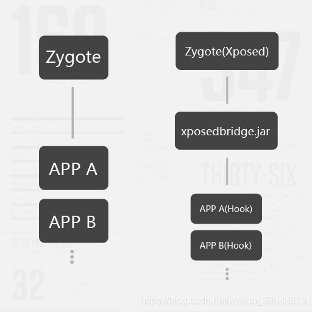
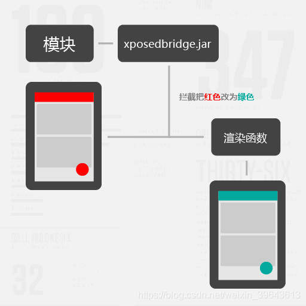
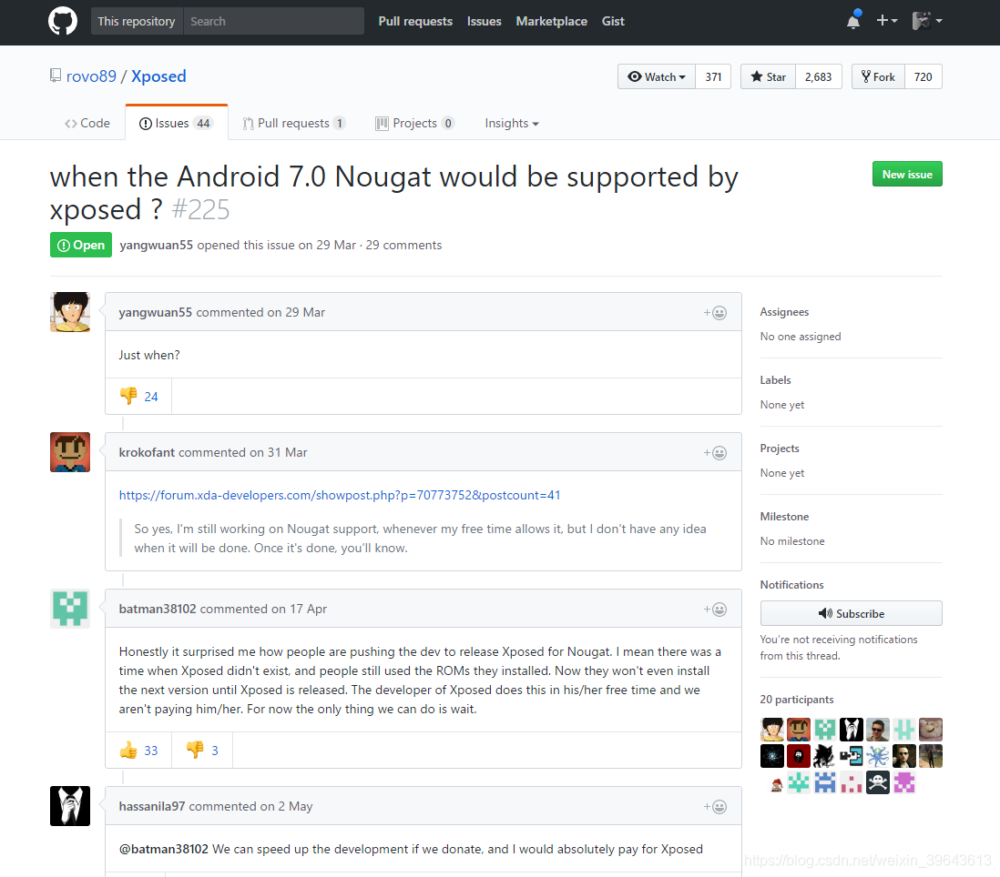
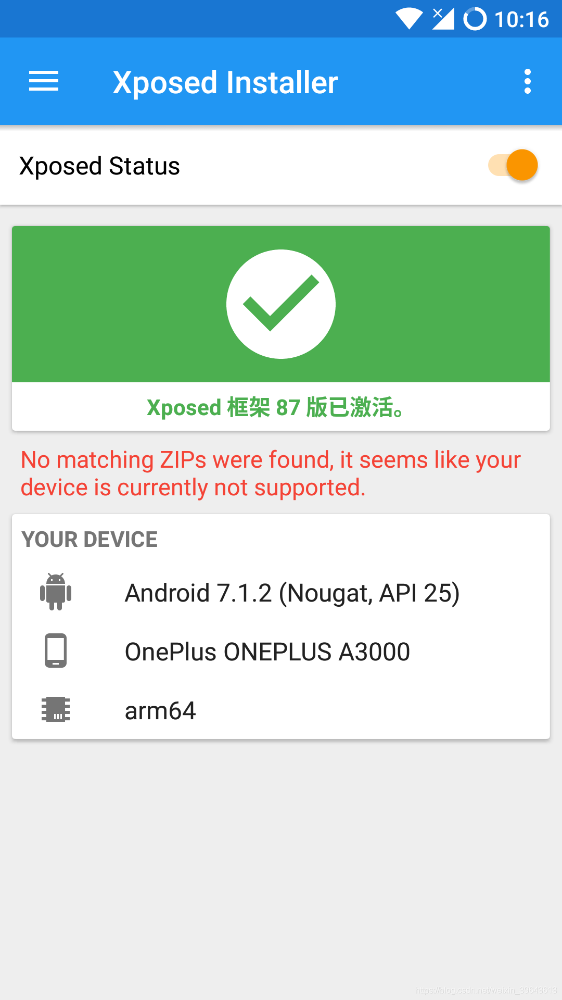
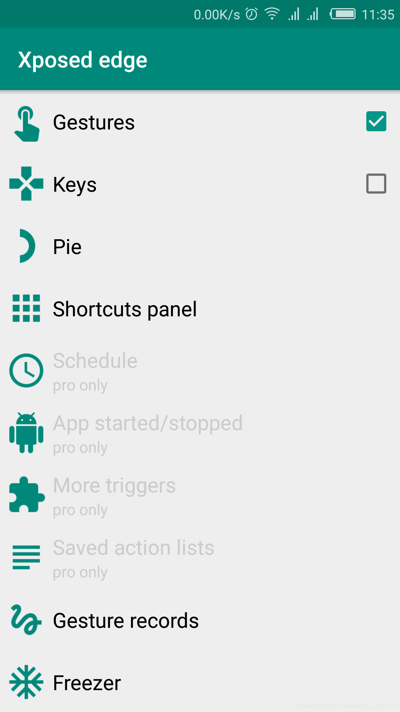
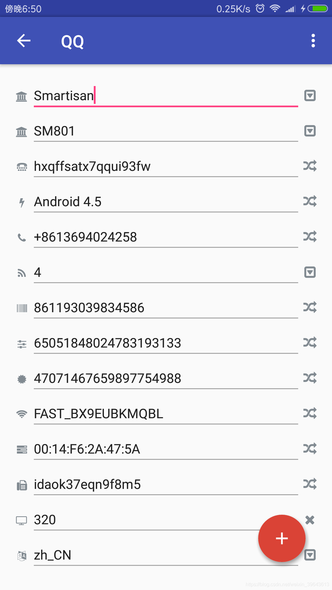

# 关于 Android 7.1 的 Xposed，你想知道的都在这

src: https://sspai.com/post/40121

熟悉 Android 的小伙伴们都知道，Android 最大的优点在于开源。开源意味着可定制化程度高，如果开发者对 Android 内核和运行原理的理解足够高，比如 rovo89，他甚至可以创造出 **Xposed** 这样的万能框架。最近，许多人翘首以盼的 Xposed for Nougat （虽然是第三方）终于发布了，趁着这个时间点，我们来总结一下这款神器的「前世今生」。

# 原理与功能
Xposed 是一个 Android 平台上的动态劫持框架，通过替换手机上的孵化器 zygote 进程为 Xposed 自带的 zygote，使其在启动过程中加载 XposedBridge.jar，模块开发者可以通过 jar 提供的 API 来实现对所有的 Function 的劫持，在原 Function 执行的前后加上自定义代码。

说成人话就是 Android 上所有正在运行的应用程序都是通过一个万物之主 —— Zygote 创造出来的，但是这个万物之主不听我们的话呀，Xposed 就是把这个万物之主换成自个家的，然后用一本天书（就是前面的 XposedBridge.jar）和他沟通，就可以实现对于系统上任意程序任意数据和行为运行前后的修改，至于我们不会写天书或者读懂天书也没关系，只要我们下载已经写好的天书（模块）就可以完成特定的需求。

基本原理

举个实际的例子，在某个 App 的界面被系统渲染出来之前，Hook（勾住）负责渲染界面的函数，把 App 传递过来的参数（例如红色）改成绿色，最后 App 界面就可以成功变成你想要的颜色啦（当然是选择原谅她）。

或者支付宝微信运动等等 App 请求运动传感器的步数，当传感器返回步数的函数执行完毕，我们就可以 Hook 它，然后把它返回的结果修改成我们想要的数字（例如 23333），现在知道微信运动里面那些天天占领封面的人夸张的步数怎么来了吧（大于 40000 步一天基本就是这样子修改的）。

你们尽管跑......

上面只是 Xposed 最为基础的一些应用实例，事实上，它可以修改系统上所有的数据，所以「Imagination is the only limitation」（这里说的主要是 Android 5.0 以上的 Xposed 框架）。

# 难产的 Xposed 7.0
**对于这样一个优点突出的框架，它的缺点也是明显的。**

由于把系统的 zygote 替换成定制的 zygote，一些厂家针对手机的优化也就没有了，同时频繁地 Hook 函数也会造成一些性能损失，直观体现为开机速度明显变慢以及 App 打开速度和滑动帧率的降低。

作为一个严谨（划掉）的德国人同时还是个完美主义者，Xposed 的作者 rovo89 怎么能够忍受如此明显的缺点。对完美框架的追求和并不多的业余时间导致 Xposed 框架对于 Android 7.0 的适配非常慢（Android 7.0 对于应用的底层优化大改也是一个原因）。

 Github 上不时就有 issue

虽然 Xposed 框架是开源的，但是涉及底层修改的源码对于绝大部分程序猿来说都是一道难以逾越的坎，对于小部分越过这道坎提交了代码还有提 issue 认为自己可以帮助适配的人，rovo89 是这样子说的：[rovo89 的回答](https://github.com/rovo89/Xposed/issues/225)

大意就是 7.0 的 Xposed 不是随随便便弄的，真正了解 Xposed 的人很少，按照他的经验还没有人可以真正的帮到他，所以他还是要自己一个人干，拒绝没用的 commit 而且绝对不会放出不完美的分支。还真是傲娇呀……

 不过即使这样子也阻止不了大家想在 Android 7.0 上体验 Xposed 的行动。最近，Github 上的 abforce 终于放出了一个并不完美的 Xposed for Nougat （Android 7.1+），即使此时 Android 8.0 已经临近发布了，XDA 和国内各个论坛还是瞬间沸腾了起来。不过对于这个版本，rovo89 是这样回复的：[rovo89 的回答](https://github.com/rovo89/Xposed/issues/230) 

这里贴一个很贴切的评论，[酷安 @Aviraxp 评论了应用 Xposed 框架](https://www.coolapk.com/feed/3702648)：

>rovo89刚刚发了长文，说他在去年10月就完成了目前这个所谓框架所达到的工作。但是，前95%的工作要花5%的时间，后5%的工作要花95%的时间。后期的兼容性修复花了他大量时间(中间有段时间搬家，几个月没开发)，而且现在他已经放弃以前的思路，避免关闭任何优化以减少性能问题。文中还对出现的预编译xposed二进制表示鄙夷

# Nougat 食用指南 
abforce 发布的框架是一个早期实验版，不仅要根据特定的 ROM （Android 7.1+）编译代码，而且还会伴随着某些模块无法使用和应用闪退。不过国内热情的机油们已经开始做出各种 ROM 适用的卡刷包，XDA 上也有人开始针对问题给出了修复版本。

如果你：

* 曾经使用过 Xposed 的模块
* 了解 Xposed 后被它某一个模块击中痛点，实在是离不开它带来的愉悦
* 
那么也许你可以开始尝试刷刷刷了。

# 目前可以使用的 ROM 
基于原生的系统：AICP，Lineage OS，Sudamod，Resurrection Remix OS，氧OS。 

国内系统：Color OS，H2OS，魔趣。 

其中魔趣在 ROM 编译之时就合并了 Xposed 的代码，在实现功能的同时保留了对系统的优化。对比其他 ROM 需要刷入卡刷包还要丢失对系统的优化，魔趣直接升级更省时省力，更加稳定，性能损失也更加少。

魔趣只需要安装 Installer 就可以激活 

# 注意事项
1. 安装需要 ROOT，使用时不需要。
2. 三星官方或基于官方的 ROM 目前会无限重启，请暂时远离框架。
3. 为了数据安全，请备份好个人数据。

# 可用模块推荐 
这里介绍几个非常好玩实用的模块，想知道更多好玩实用模块可以上 XDA 和酷安参与讨论。

 Xposed edge：一个提供系统级边缘操作的模块，支持类似 Tasker 的连锁任务。

微X模块：给微信添加更多功能，例如消息防撤回和自动回复等。

WechatUI：支持自定义微信界面，给微信加上抽屉和自定义气泡。

应用变量：针对每个应用设置不同的手机数据。 （请使用 2.0.4 版本）

XXX ADAway：彻底去除 XXX （代表应用名称）的广告。 

净眼：去掉应用界面中你不喜欢的部分（例如网易云音乐的 banner）。

官方截图

# 关于数据和信息安全
不管是 rovo89 还是 abforce，他们所发布的框架都是开源的，框架本身并没有窃取个人信息的风险。但是我们在使用模块的时候仍然要注意个人信息的安全：

* 尽量使用开源的模块，如果有能力的话尽量使用自己编译的版本；
* 如果你要的功能只有没有开源的模块，请注意模块本身有没有联网权限；
* 一些模块可能会 Hook 目标 App 的联网函数来发送自己的数据所以没有联网权限，通过抓包就能让它露出马脚，不会抓包又在意个人信息安全的小伙伴还是建议放弃使用有风险的模块。

最后希望大家都能安全地享受 Xposed 带来的方便和乐趣。

 
