# 双龙战记：Andrax vs. Nethunter

src:https://www.anquanke.com/post/id/223493#h2-0

 

## 0、引言

现如今，IPHONE12已经用上了5NM制程的西皮柚（CPU），主流安卓手机至少配置8个鸡（GB）的运存，当然高端机都配12个鸡，旗舰机型清一色向16个鸡靠拢，当然还有极个别的变态机用到了32个鸡。这些变态的配置之外，还有高速存储器（UFS3.1）的加持，那么算得快，读写快，I/O也快，这样的电脑实在是太适合开“黑“了。因此，有很多人就如何”武器化“安卓手机给出了很有趣的见解【1】【2】，让基于LINUX内核的安卓手机能够更加适合开”黑“。

说到安卓手机的“武器化“，那么不得不提最早适用于安卓手机的”黑客“软件环境——KALI NETHUNTER，它把KALI的成熟软件应用移植到了安卓手机上，当然还有强大的社区支持。正所谓”成也萧何败萧何“，KALI渐渐敌不过强大的PARROT， NETHUNTER也被KALI渐渐地带上了颓败之路。在这篇文章中，我们将对比两款以DRAGON为LOGO的、基于安卓系统的LINUX模拟器，也就是ANDRAX和KALI NETHUNTER。

虽然，我们已经足够努力的设定了一系列客观公正的比较参数，但是难免有失偏颇，或者让诸位大咖、“黑阔“觉得贻笑大方之处，还望多多包涵。话不多说，先给一个文章脉络的思维导图：

[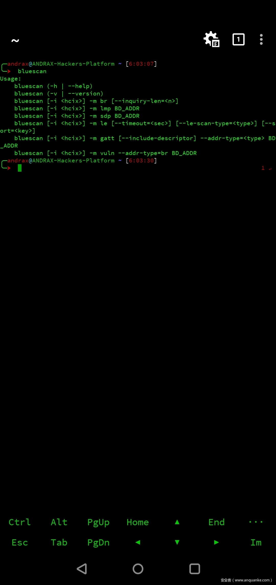0.mindmap](https://p5.ssl.qhimg.com/t0142790b3b3c753b6e.png)](https://p5.ssl.qhimg.com/t0142790b3b3c753b6e.png)

 

## 1、What？（简单的科普）

首先，我们来说说安卓手机上的LINUX模拟器。从本质上来说，安卓系统就是字母（Alphabet）公司旗下GOOGLE子公司所开发的一款自带LINUX内核的JAVA虚拟机【3】，通过底层代码优化，使得这个LINUX内核能够极好地支持JAVA虚拟机运行，甚至会让用户觉得这个JAVA虚拟机运行程序的速度跟在真实机器上运行原生.EXE程序没啥区别啊，一个字“快“。当然，这得益于硬件的不断升级，还有软件攻城狮的不懈努力（优化，优化，继续优化）。

那么，既然安卓本质上是LINUX，那为能不能在上面搞个终端跑跑SHELL脚本呢？当然，这是可以的，前提是你要安装一些软件并且获得ROOT权限（最好如此），比如，TERMUX，SSHDROID（ANDROID 7.0以后，使用SSHELPER），BUSYBOX等。用户可以通过TERMUX或者远程SSH到SSHDROID打开的2222端口，（ROOT权限）安装程序，包括一些经典的LINUX小程序，比如“小火车“，或者完成截屏，发短信甚至重启手机。不过，所有这些操作都是真枪实弹的，一不小心执行一条”RM -FR /”，那么你就完了。。。

[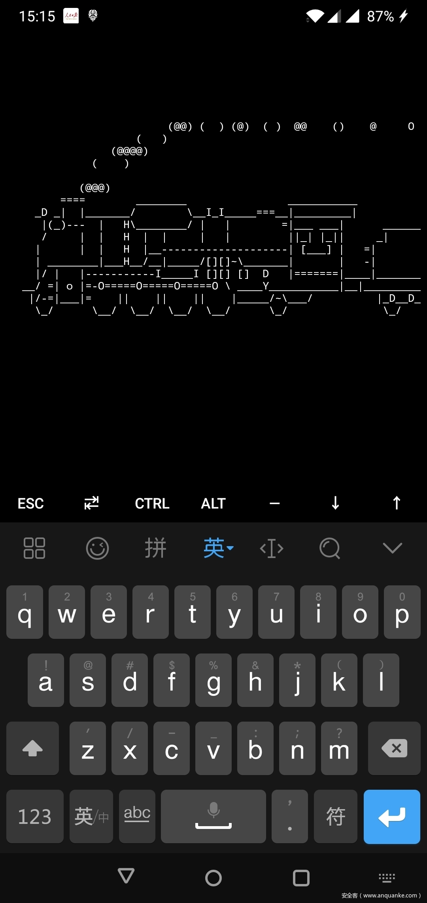](https://p3.ssl.qhimg.com/t012fca17fd2ad5c007.jpg)

既然可以运行LINUX，那能不能直接运行一个完整的LINUX呢？当然，要求不太高的话，可以做到，前提是你要安装一些LINUX模拟器，比如我们熟知的ANLINUX等等。为什么说是“要求不太高“呢？因为，有一些操作是在安卓上无法完成的，只能借助于CHROOT命令，将一个完整的LINUX系统放到某个目录下，所有的操作都在这个”牢笼“（也可以叫做“沙箱”）中完成的，也就是说你的操作不会影响到安卓的那个LINUX内核，只是会作用于你看到的那个“假假的”LINUX操作系统。

既然，我们可以通过CHROOT运行LINUX模拟器，那么我们当然有理由相信，我们可以在安卓手机上运行KALI之类的“黑阔”专用LINUX系统。是的，的确可以做到。早在，2014年9月24日，OFFENSIVE-SECURITY公司就发布了KALI Linux的移动终端版本，也就是KALI NETHUNTER，专门针对安卓系统定制开发的KALI渗透测试环境。六年多时间里，NETHUNTER得益于KALI社区的支持，几乎保持了与KALI LINUX的同步更新。

大概在2016年，一个叫做ANDRAX的基于安卓的LINUX模拟器发布了，这是一帮巴西人为核心的社区基于DEBIAN打造的LINUX模拟器。ANDRAX自诞生之日起，就给自己安了一个“碉堡”的名字，“NETHUNTER KILLER”，没做就叫做“NETHUNTER终结者”。

说了这么多，大家对这两个基于安卓的LINUX渗透测试环境（模拟器），估计还是不(很)太(懵)懂(逼)，那么我们接下来就按照之前的思维导图，逐一介绍。

 

## 2、系统安装

### 2.1 硬件要求

总的来说，andrax和Nethunter都是硬件友好的，既支持armhf（32位）和arm64（64位），因此如果你想装逼，可以在最新的安卓手机上安装Nethunter或者andrax，保证可以跑得起来，而且跑得很嗨。如果，你只是抱着“玩一把”的心态，那么你可以找个老一点的鸡，像什么Nexus6或者Nexus 6P之类的，同样你能低调的过把瘾，然后也不用天天在手机里面放这么个几乎不用还要占据10+G存储空间的APP。

说完西皮柚，接下来说一说内存吧。由于Linux本身对内存的需求不大，因此哪怕是你只有2GB内存，你同样可以玩Nethunter而且还很流畅（毕竟只在终端CLI上玩或者远程SSH玩），但注意只是Nethunter，不一定能玩andrax。为什么不包括andrax呢？因为，运存2个鸡的手机，往往外部存储器只有最多16GB，放不下andrax啊，更别说把两条龙都装下了。

接下来，我们唠一唠外部存储器。虽然andrax和Nethunter都声称是“存储友好”型的，但从实际使用情况来看，并非如此。我们分别在两台安卓手机上进行了测试，结果如下：
手机A：2GB+16GB， andrax – 失败， Nethunter – 成功
手机B：3GB+16GB， andrax – 失败， Nethunter – 成功

后来，我们在其它成功安装了andrax和Nethunter的手机上进行了存储空间的统计，andrax所占用的存储空间确实比Nethunter所占用的空间更多。
Andrax：15GB存储空间
Nethunter：10GB存储空间

就硬件部分打个总结，andrax和Nethunter这两个渗透测试环境对于硬件的要求都是比较低的，远远低于主流的“吃鸡”游戏，能够满足男女老少诸多人等的手机配置门槛，具体如下。
软件名称 CPU 运存 外存
Andrax Armhf/arm64 >=3GB >=32GB
Nethunter Armhf/arm64 >=2GB >=16GB

### 2.2 对安卓系统的要求

本来，没打算写这个小结的，因为这两款软件对Android系统的要求确实很低，就目前我们测试的情况来看，Nethunter支持Android 5.0及以上的系统，Andrax则支持Android 7.0及以上的系统。当然，如果有运存2GB且存储大于或等于32鸡的Android设备，估计Andrax也能跑起来。

### 2.3 系统安装

Andrax安装

相比较而言，andrax的安装比较easy，不需要动刷机的念头，只需要下载app和镜像文件即可，当然说起来简单，还是有个“大坑”。第一次安装的时候，我们通过andrax官网【4】下载了APK文件，然后直接安装，蹦出来一大堆黑底绿标的图标，蛮cool的，但是弹不出terminal，干着急。

[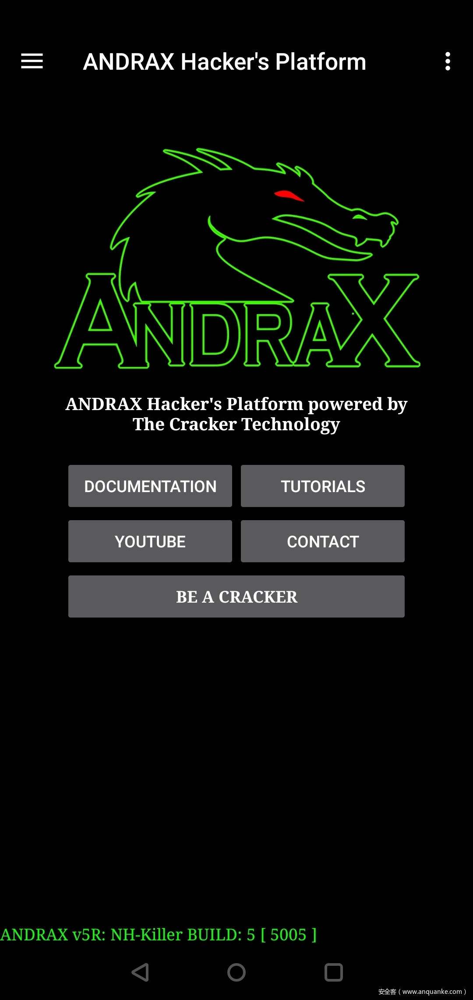](https://p1.ssl.qhimg.com/t013e49d0ad9e18b473.jpg)

后来，捣鼓了半天，才回过神来，这只是个模拟器的UI，整个andrax镜像文件还没下载。赶紧点击“manal download”。由于andrax的镜像比kali nethunter大很多，而且是通过app自己下载，不支持断点重传，而且由于安卓的“power saver”会自动掐死这个andrax UI，因此被迫进入开发者模式，全程亮屏而且一直插着充电线（不知几时才能下载完毕）。

[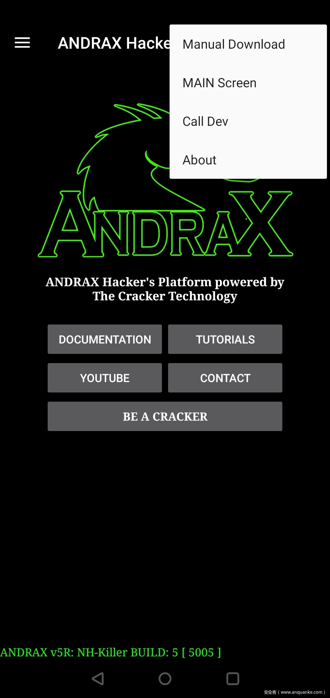](https://p1.ssl.qhimg.com/t01255860062964355a.jpg)

经过若干次反复虐机，最后发现一个最简单的andrax安装办法：

首先，从andrax在gitlab上的开源项目下载镜像文件【5】，最先镜像文件体积为2.9GB（比Nethunter整整大了1倍）

然后，把下载好的内核文件“andraxcore.tar.xz”拷贝到安卓手机/sdcard/Download目录下，不要尝试网上搜到的自解压文件，然后自个儿chroot启动andrax，不好使（这个坑，我已经踩过了）

最后，重新启动andrax的“Dragon Terminal” APP，它会提示你安装位于/sdcard/Download目录中的镜像文件。当然，全程点亮屏幕，确保“Dragon Terminal”位于前台，然后接上电源跑2小时左右，如果界面出现了一个大大的Dragon，那么恭喜你喜提3484款“hacing tools”。So easy！

[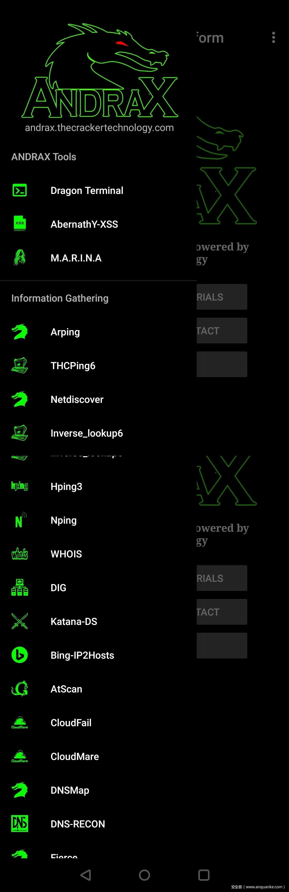](https://p3.ssl.qhimg.com/t01e069c80d210bb1f8.jpg)

相比而言，Nethunter的安装则少了些“人间烟火气”，官方推荐刷机方式，刷入Nethunter的镜像文件，对于很多人而言这或许是一个比较大的障碍。此外，官方给出的镜像文件有很多个版本（或许做了一定的优化），也会让初学者有种“乱花渐欲迷人眼“的感觉。如果想要以root权限运行Nethunter，那么必须先刷入Magisk或者SuperU（Android 7.0之前版本），然后正常启动系统后，再次关机或重启，刷入Nethunter镜像，不然可能会出现一些很奇怪的问题（别问我为啥知道）。

从上面Nethunter安装的过程描述可以看出，Nethunter的安装至少存在以下问题：
——考虑到手机西皮柚的差异，新手在选择镜像文件时，可能已经开始懵逼
——刷机方式安装，很多细节是隐藏了的，对于做安全的人而言，总有些不爽或者丝丝的不安全

当然，经过我们对Nethunter镜像包的简单分析，其实可以通过类似于andrax安装的方式，来实现Nethunter的安装和配置。

首先，根据自己手机西皮柚的型号，主要是看处理器的位宽（32位或64位），选择适合手机西皮柚的通用版本镜像文件。Nethunter提供了特定手机型号的定制镜像文件，同时也提供了针对32位（armhf）和64位（arm64）的通用版镜像文件。

然后，解压所下载的镜像文件，从解压目录中的\data\app目录下，将Nethunter.apk和NethunterTerminal.apk拷贝到手机中进行安装。

接下来，将压缩包中的kalifs-arm64(hf)-full.tar.xz拷贝到手机存储中，然后通过termux执行busybox中的tar命令解压这个压缩包并拷贝到指定路径/data/local/nhfilesystem目录下。
——armhf解压命令：busybox tar -jxvf /…/kalifs-armhf-full.tar.xz /data/local/nhsystem/kali-armhf
——arm64解压命令：busybox tar -jxvf /…/kalifs-arm64-full.tar.xz /data/local/nhsystem/kali-arm64

最后，启动已经安装好的Nethunter APP，通过“Kali Chroot Manager“界面中的“Edit”，将刚才保存解压后文件的路径填写到其中，默认值为“armhf”或者“arm64”。

[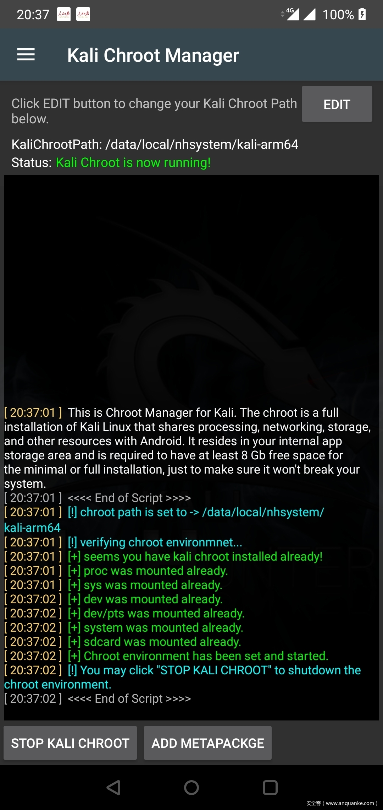](https://p5.ssl.qhimg.com/t011f8d60ee80f52c2e.jpg)

[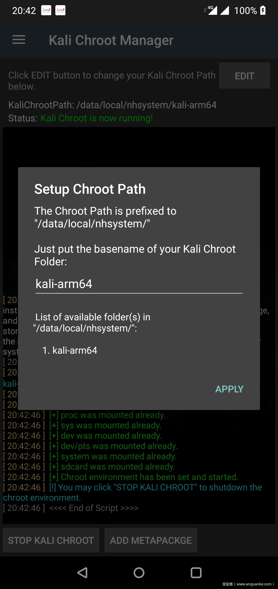](https://p3.ssl.qhimg.com/t01f0bf1db311a5d205.jpg)

这种通过APP来进行安装的方式避免了刷机，而且过程看起来至少更加透明、可控，不过必须要求已经获得root权限。安装完毕之后，可以通过NetHunter Terminal这个APP来实现对Android内核和Kali Linux模拟器的访问。

以上是“系统安装”部分的全部内容，andrax与Nethunter二者可以说各有优缺点：

硬件适配：两者都能很好的适配目前几乎所有的Android手机（不是所有Android设备），而且系统对内存的要求极低，哪怕是2GB的运行内存，16GB的存储器也可以跑起来。当然，这年头，除了二手手机，否则几乎都在这个运行门槛之上，也就是说当前的学生机也能很好的玩这两款很cool的“黑阔”手机系统。

系统安装：从我们的实际使用来看，这两款系统都很强大，可以说不分高下。当然，从系统安装的角度来看，andrax更加“接地气”，亮着屏幕下一宿就可以用了。Nethunter的话，官方建议的刷机安装方式对于新手而言不那么友好，而且基于APP安装的话，也需要进行一些非常规操作。

 

## 3、工具集成度

Andrax社区给他们的杰作起了一个叫做“Nethunter Killer”的别名，我第一次看到的时候也觉得“太拽“了，简直是狂妄自大，不知底厚天高。但是，使用过之后，觉得他们确实有狂妄和嚣张的资本。

如果单就集成的黑客软件工具数量而言，andrax绝对是吊打Nethunter（full Edition），甩掉Nethunter十几条大街啊。为什么？andrax集成了16类，共计3494款“黑阔“工具，你说屌不屌。

[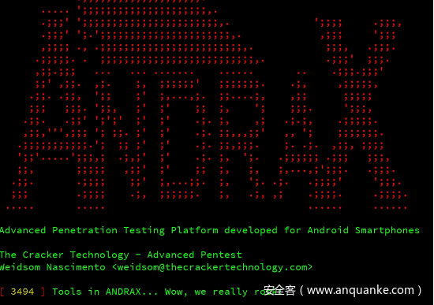](https://p5.ssl.qhimg.com/t01bbb75ffba98aee33.png)

再来看看Nethunter，full版本安装的情况下，通过Nethunter APP界面能够直接使用的工具不超过20个。通过Nethunter官方应用商店可以下载的APP一共是42款，而且很长时间都没有更新或者添加新的APP了，这个确实很不酷。接下来，我们通过列举并统计/usr/bin和/usr/sbin目录下的程序（注意，这还包括了Linux的基本命令在里面），只有600个程序左右。那么，做一个简单的算术，我们可以知道在工具集成度上，andrax取得了毫无争议的胜利。

[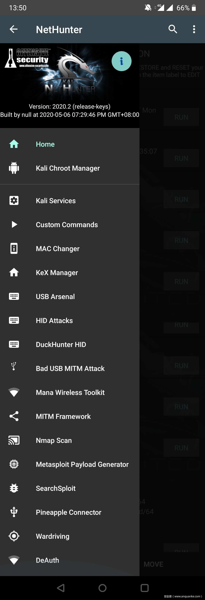](https://p0.ssl.qhimg.com/t01a53c5df9be2c5907.jpg)

 

## 4、易用性

易用性对于玩票性质的玩家而言，几乎可以忽略，但是对于一个希望把手机变成“战斗机“的高阶用户而言，这个是非常重要的一个指标，是Linux社区和发行版能够长久生存的关键。在这一部分，我们将从用户界面（UI），文字编辑以及硬件支持三个方面逐一进行对比，希望能够给即将”种草“的你带来更加客观的分析。

用户界面，当然我们在思维导图里面将它命名为“命令操作“，因为Linux下面很多很酷的工作我们都是通过”命令“实现的。当然，从一个更加抽象的高层次认知角度而言，这玩意儿经常被叫做UI。

Andrax社区的成员或许更多是一些Linux下长大的“黑阔“，他们提供的UI几乎全是CLI的。所有操作几乎都是在CLI中，通过一些列的命令来“玩”成。对于一些Windows下长大的“黑阔”而言，这或许需要一些时间适应。当然，andrax这种“黑+绿”的界面，非常“黑客帝国”，很酷，很炫，非常屌，特别适合忽悠萌妹子。

相比之下，Nethunter显得更加气定神闲，CLI+GUI的软件使用能够一定程度减少用户入手的抵触心理，当然更适合国人的信息成长道路。其中，比较常用的UI莫过于，Nethunter APP中的控制界面了，能够为用户直观显示“Home”信息，管理“Chroot”，哪怕是简单的“MAC”修改等等，可以说是保姆式的关怀。

为什么会将“文字编辑”这个小学一年级就能完成的工作视为一个评判依据或者指标呢？很简单，你要在手机方寸屏幕间完成文字的拷贝、复制，并且能够迅速切换到你希望粘贴文本的窗口进行快速粘贴或者编辑，一次、两次还行，时间久了就受不了啊。

首先，看看andrax。Andrax的文字选择操作真的是丝般顺滑，可以通过光标在狭小屏幕上，任意选择很小的文字，要是还不爽，那就直接放大屏幕。当然，要在andrax终端里面切换命令窗口的话，有种说不出的愤怒。文字编辑已经做得这么好了，为什么不能通过手指滑动来切换虚拟终端呢？就像Nethunter Terminal一样自由切换，不可以吗？有那么难吗？难道自由切换terminal不香吗？

[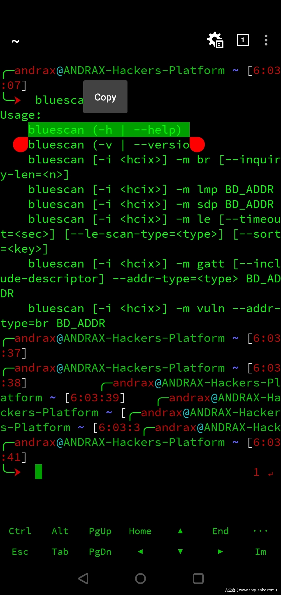](https://p5.ssl.qhimg.com/t01f1a7113db08a40df.jpg)

Nethunter上执行终端切换操作只需要指尖轻轻一划，多么完美的用户体验啊！但是，你要想在上面进行文字编辑，尤其是文字的选择和复制，一定要控制情绪，不要随便摔手机，我就不上图了，因为我的情绪极易失控。

既然聊到了“易用性”，那么不可避免的要聊一聊外设了。这两款系统对于设备的兼容性都很不错，但是具体能够支持哪些设备则不依赖于他们，而要依赖于你的“小机机”。对于这一点，我们team是深（屡）有（屡）体（掉）会（坑），多少白花花的银子都因为这个浪费了，一堆堆的外设在那儿吃灰就是因为这个啊。

因为我们team的绝大多数实验都是在移动终端（手机）上做的，确切地说能不用电脑，我们一定要用手机，因此我们购买了一堆外设。一开始没在意，买回来后，高高兴兴插了上去，完了用不了，装驱动，换驱动，一度还动了下载android代码重新编译内核的心思。后来，发现某些国产手机很坑爹，不支持OTG，就算它后来支持OTG了，它能是把android原生驱动给阉割得跟个太监似的。通过一些列的经验教训，我们悟出来了一个道理：亲儿子就是亲儿子，最香！在某宝上搜一下“kali wifi”，只要图片显示了类似“CDLinux，Kali”等字样的USB 网卡，那么放心买，亲儿子都能认出来，完了店家还会给以分享一个热气腾腾的WiFi破解字典。亲儿子胸怀有多宽广，可以参见这篇帖子【1】【2】，当然你要是真“壕”，那么砸钱买设备挨个插个遍。

[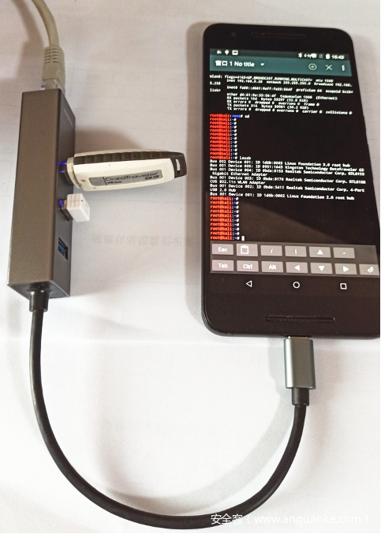](https://p0.ssl.qhimg.com/t012cefdfe2e3562c6e.png)

 

## 5、可扩展性

作为一个“黑阔”，最稀饭的莫过于把系统往死里作吧。就像上面图片里一样，一个手机插得跟个刺猬似的，那叫一个爽啊。当然，我们并不满足于物理层面的插入，我们更希望在软件层面进行发挥无限制的想象，毕竟github上有太多显得蛋疼的直男了，因此我们希望不断地去扩展整个系统，让它更加的个性化，用起来更顺手。

在软件的扩展性上，我们team一直偏爱Nethunter，虽然看起来很中年大叔，四平八稳，但是它就能稳稳当当的每月更新，source源上轻松安装各种工具。当然，这个归功于Offensive-Security团队的兢兢业业付出了。

跟中年大叔“Nethunter”比起来，小鲜肉Andrax则实在太逊了。先上图，看看andrax的更新源设置：

[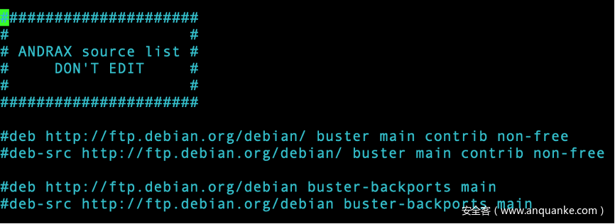](https://p5.ssl.qhimg.com/t0196f9d594042676ba.png)

瞅见了吧，不让你更新系统，哪怕是安全更新也不让啊！当然按照andrax开发者的说了，“别瞎改，别瞎更新，万一把我的软件依赖搞崩了，咋整啊！”要更新，可以啊，andrax能够保证每个月来一次，在gitlab.com（没写错，你也没看错，就是GITLAB.COM）上都最新内核，链接【5】。当然，有时候也不一定能保证每月一次，毕竟是男程序员嘛，可以理解。

[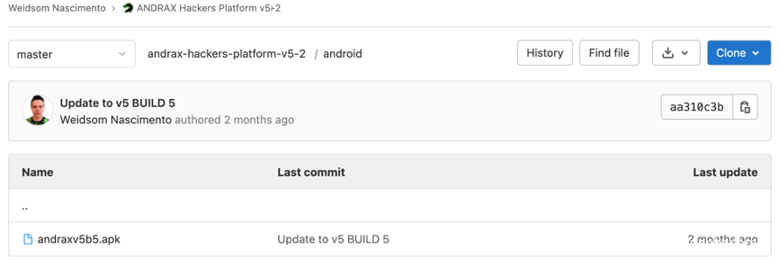](https://p3.ssl.qhimg.com/t014ed738c16fbec51f.png)

当然，也可以自己将andrax的更新源改为你想要的，但是开发者还是建议不要更新系统，just安个软件就好了，别tm瞎折腾。你要做的就是踩着每个月的点儿，去gitlab.com上看看有没有追更，完了下载一个近3GB的包，重新deploy一下就OK了。

还好，现在有万能的Python大法，我们team也开始慢慢喜欢上了在andrax这个变态的chroot牢笼中快乐的生活。当然，Nethunter和Andrax两个平台对于Python的支持都是非常好的，都默认支持Python3，因此只要在github上有中意的Python代码，直接薅过来，基本上都能用，比如routersploit等等。

总的来说，在系统扩展性方面，Nethunter应该是领先一筹，毕竟可以用apt愉快的更新和安装很多“黑阔”工具，充分汲取Offensive-Security的社区积累。Andrax虽然不推荐，甚至是极其排斥使用者通过apt更新系统或者安装新的应用，但是毕竟人家社区小（后面再慢慢唠），而且一口气都灌了3000+的“黑阔”工具了，能够满足温饱了吧。

 

## 6、开发团队

最后，我们还是来聊聊八卦，侃侃大山吧。开发者团队，在我看来是非常重要的，尤其对于一个系统工具而言，多的不说，看看Offensive-Security，ParrotSec，Rapid7。好的开发团队可以营造出好的技术氛围，为后续技术社区的健康，稳定发展奠定坚实的基础。

Nethunter是由Offensive-Security团队创立于2014年9月24日，也是笔者所知Android平台上最早的、专注于渗透测试的Linux模拟器。植根于Kali Linux社区生态环境，这也注定了必然有binkybear，jmingov，fattire，kalilinux，jcadduono，kimocoder，yesimxev，simonpunk，re4son等一众大牛的原始技术输出，能够在一众的Android渗透测试平台中鹤立鸡群，保持着旺盛的生命力，即便在ParrotSec不断蚕食Kali Linux用户群的大背景下。正是这种核心技术人员+社区助力的生态，Kali Nethunter几乎保持了每月更新的频率，这也使得移动渗透平台下的安全爱好者有了更为广阔的工具选择。虽然，Nethunter的应用商店很长时间以来都没有重磅级的应用更新，但是Nethunter的社区热度还是不错的。

Andrax的发展与Nethunter则大相径庭，几乎全是依靠Weidsom Nascimento一人之力。从官网的信息来看，Andrax于2016年9月8号创建，在2018年10月5日，项目正式在互联网上发布。据说，Andrax是一个流行于拉丁裔“黑阔”中的一个渗透测试平台，后来不知怎么的就开始做大做强了，而且这个平台一直蒙着一层面纱，因为它的官网几乎没有任何回应，twitter账号也很久没更新了，但是它的核心代码却保持更新。而且，同样诡异的是Andrax在全球前20名黑客武器排行榜上每年都在往上蹿，已经快要触顶了。

 

## 写在最后：

前面说了一大堆Andrax与Nethunter的不同，若要说一些共同点的话，那或许应该是这两款软件都以“Dragon”作为了自己的Logo。其实，从我们team使用的情况来看，这两款工具各有优缺点，我们只是从自己的角度进行了分析对比，希望能够与各位同行分享。

Authors：Duncan Secteam

参考文章：

1. asukafighting. 《Arm设备武器化指南.序》.https://www.anquanke.com/post/id/204544
2. asukafighting.《ARM设备武器化指南·破·Kali.Nethunter.2020a.上手实操》.https://www.anquanke.com/post/id/205455
3. coding十日谈. 《安卓到底是不是Linux》.HTTPS://WWW.CNBLOGS.COM/JFZHU/P/12986863.HTML
4. Andrax官方网站. https://andrax.thecrackertechnology.com/
5. Andrax GitLab官方站点. https://gitlab.com/crk-mythical/andrax-hackers-platform-v5-2