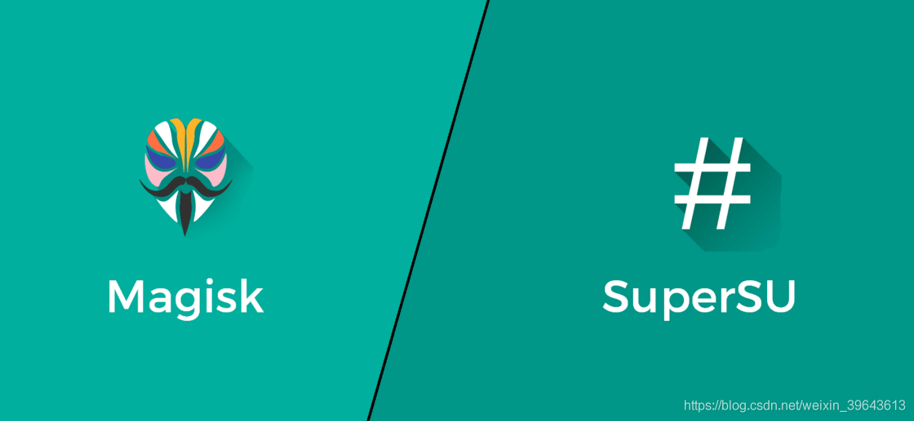

# 在 2019 年，Root 是否还有必要？

如果你在几年前使用过搭载 Android 或者 iOS 系统的手机，那个时候的你应该发现身边玩越狱和 Root 的人不少，由于智能手机系统才刚刚开始发展的原因，系统没有完全发挥手机本身的潜力。历史证明，如果一样工具不好用，那么广大人民群众就会发挥自己的独特智慧变着法儿让它们满足自己的需求。

自己改造的 B 站数据插件

用户的需求摆在那儿，手握手机系统的科技公司自然会去跟进，所以这几年我们看到智能手机系统上的功能越来越多，以前那些需要努力去折腾才能实现的功能现在大部分都有了。剩下的那些小需求好像也不足以让我们牺牲时间精力还有安全性等等去满足，于是这篇文章思考的主题就出现了：在 2019 年，越狱/Root 是否还有必要？

# Root 的现状
iOS 的越狱和 Android 上 Root 的诞生实际上都是为了获得系统最高权限（也就是让你有权力去修改系统里的任何东西）。由于 Android 内核是基于 Linux 源码[^1] 修改的，所以更加地容易获取到系统底层。虽然 iOS 的 XNU 内核由苹果自己研发，但它基于开源的 Darwin（类 Unix 系统）代码[^2] ，虽然没有 Android 系统上那么容易，但也为了最初的越狱提供了可能性。

比拼越狱速度曾经是安全团队「秀肌肉」的方式

有了最高权限，开发者们就能尽情的发挥自己想象力做出各种好玩实用的功能。尽管听上去很高大上，大部分用户利用越狱/Root 也只是想在 iOS 上换个字体、输入法，或者在 Android 上实现通话录音和手势操作。但不管怎么样，越狱/Root 至少让这些功能的实现成为了可能。

图源：iphonehacks

不过对于越狱而言，虽然最新的 iOS12 还是可以通过欺骗签名机制和缓解机制实现完美越狱[^3]，但是我们越狱之后常用的 Cydia 商店却宣布要永久关闭了[^4] （基本没有收入，加上有漏洞），虽然这一举动并不影响 Cydia 安装器本身的使用，但从关闭原因我们可以看出用户已经越来越没有需求去越狱了，加上从系统出来到初次越狱工具出现往往要好几个月，而且 iOS 最近几个版本更新添加了许多原本需要越狱才能够使用的功能，用户更愿意将信心放在「苹果会更新用户需要的所有功能」上。所以本文的重心将放在 Android 的 Root 这部分。

说到 Android，几年前国内各家的魔改 Android 系统和各种应用商店里面的应用，大家如果使用过都应该有深刻的体会：系统自带各种乱七八糟的应用，应用商店里面的应用流氓起来真是「八仙过海，各显神通」，不仅让手机变卡，还白白浪费了数据流量和电池电量。

所以之前 Android 用户 Root 为了功能性需求倒是很少（毕竟开源系统，功能上各个厂商都能自己添加），追求的更多是让手机系统更加地干净舒心。国内各家安全公司也是瞄准了这个需求，所谓全机型「一键 Root 」工具层出不穷，能不能 Root 不确定，倒是经常被人发现在用户系统里面「加料」。

著名的获取 Root 应用 Kingroot 现在官网都被 Chrome 标红了

之前最靠谱的工具是 SuperSU 和 SuperUser，不过在竞争多年后还是 SuperSU 赢了，成为了大多数用户和第三方系统内置的 Root 权限和管理应用。但遗憾的是 SuperSU 的开发者在 2015 年九月决定将它卖给一家在纽约创立的中国商业公司 CCMT[^5] ，虽然这是开发者经过深思熟虑后的决定，并且不一定由商业公司运营就会做出不好的事情，但是大多数用户依然不放心将自己手机的生杀大权交给一个不开源的商业应用，所以开源的 Magisk 便成为人们 Root 的新选择。

SuperSU 与 Magisk

Magisk 是由台湾开发者 [topjohnwu](https://github.com/topjohnwu) 开发的工具，它提供了一个不需要修改系统的第三方接口，让人们可以轻松地修改、删除和替换系统文件，也可以实现获取最高权限 Root 操作。听起来有点矛盾和拗口？实际上 Magisk 的原理也很神奇。

Magisk 巧妙利用了修补 Boot 镜像的方式把自身与引导 Android 系统启动的 Boot 镜像结合，每次开机时把自己挂载到 `/Data` 上构建一个自定义的文件系统，所有修改、删除和替换系统文件操作都在 SafetyNet[^6] 启动前完成，以此达到不修改系统分区（也就是 Systemless ）就能获得最高权限并绕过安全检测的目的。就像小时候趁着父母出去偷偷把藏起来的游戏机接到电视上玩，然后父母回家前一刻再把所有东西恢复原样。

下文所讨论的 Root 也都是基于 Magisk Root 方法得到的。

# Root 后你得到的
**Root 是一件很麻烦的事情，所以我们要去思考到底值不值得去 Root；**
**Root 也是一个很有用的事情，所以我们要去思考到底需不需要去 Root。**

## 完全的可定制性
对系统的完全掌握，随意改掉所有你不喜欢的地方，你喜欢功能只要手机硬件满足都可以支持，榨干手机的潜力。从此想要的功能不用再看手机公司的脸色了，你可以**轻松获得想要的主题、提升手机速度降低电池消耗、修改基带频段改善信号问题甚至提前用上最新的系统等等。** 比如：

* 系统级去广告：这个需求就很大众了，Root 后无论是 Hosts 还是使用上帝模式的方式都可以轻松去除掉任何你能看到的广告，不仅是网页广告，还包括应用里面的开屏广告、弹窗广告、底部广告等等。[^8]

Host 去广告

* 清除流氓服务和 Activity：一些应用和游戏不仅在你没有运行它的时候会偷偷在后台运行做各种各样的事情，还会唤醒它的「兄弟姐妹」一起开派对。Root 过后使用 My Android Tool 可以把这些流氓服务统统禁用。比如下面王者荣耀里面的 `XGPushServiceV3` 和 `XGRemoteService` 就是游戏的推送服务。

My Android Tool

* 自动安装应用：虽然 Google play 商店下载的应用都可以自动安装，但 Root 后支持的第三方应用商店（比如酷安）都可以像 Google play 那样自动安装应用了。

酷安应用自动安装 

* 冰箱（冻结应用）：每个人都有一些超级不想用但又不得不用的应用，巴不得每次用完都卸载。Root 后用冻结应用软件就可以实现这样的功能了，它可以把你指定的应用「冻结」起来，跟卸载没什么两样，不会在后台偷偷自动运行浪费电池了。和卸载不同的是，想要用的时候它又能在第一时间启动，有了冻结功能我就能随便放开了去装流氓毒瘤应用。

## 特殊需求满足
可定制的功能大多是针对手机改造，同型号每台手机自带系统都是一样的，而我们也需要手机满足我们自己的需求。Root 之后你就可以根据你的需求去改变你的手机，而不用去适应手机。不同行业的专业人士也可以在手机上定制功能满足不同行业的需求。比如：

* 修改系统目录文件：Root 后我就有了能够自定义系统的能力，比如王者荣耀新出高级功能优先开放到合作品牌（比如 VIVO）的手机上，或者某些应用的功能只对特定机型开放（比如 Pixel 的无限量原图备份），我就可以修改系统的配置文件伪装成特定的手机型号使用这些功能。不仅如此，Root 之后还可以随便修改 Mac 地址、手机识别码 IMEI 等各种系统参数，**再也不怕「精准隐私泄露」。**

应用变量 

* Tasker：Tasker 原本就是强大的自定义神器[^7] ，不用 Root 就可以实现很多强大的自定义自动化操作。有了 Root 的加持它变得更加强大了，我能使用 Tasker 执行系统底层的指令达到模拟按键与触屏操作等自动化，也能用数据库指令获取到原本是不公开的应用本地数据库里面的数据。

Tasker 使用 Root 执行 Shell 指令模拟按键 

* 数据库压缩：这项功能是我在写文章之前才发现的，它居然**可以让用了好几年的手机变流畅。** 跟很多朋友类似，一到新机发布的时候我就会觉得自己的旧手机怎么突然看起来就不那么顺眼，电池也不怎么好了，最重要的是使用起来也没有之前流畅了（这个倒是真的……）。恰巧看到 SD Maid 这款应用久违地更新了，于是重新安装起来用了下，没想到用了数据库压缩（需要 Root）这个功能后手机竟然重获流畅，就跟新机器一样，弄得我都没理由换新手机了。**虽然原理未知，但是推荐所有手机用久了感觉不流畅的朋友试试这个功能。**

 压缩效果

还有些我没在用但是觉得很不错的 Root 功能：

* 美化（换字体，全局背景，全局夜间模式「点名微信」等）。
* 本地 + 远程备份应用数据。
* 防止应用乱建文件夹和文件。
* 控制 CPU GPU 的调度，再也不怕更新系统降低性能。
* 针对自己的使用时间修改休眠唤醒策略，手机更省电。
* Hifi 和杜比全景声......

以及很多非常实用但是不能说的「tricky」「hack」的功能。

# Root 后你失去的
有得必有失，虽然 Root 让我们收获了不少，但同时我们也不能忽视为了实现它而失去的东西。

* （极少数手机）Data加密：Android7.0 以上的系统引入了 Data 分区文件级加密并默认开启，也就是说所有的手机文件都是加密储存的，只有在解锁手机之后才会解密[^9] 。**极少部分手机**在获取 Root 后会与这个功能冲突并且有可能卡在开机界面，不过只要你的手机还能进 Recovery 可以通过卸载卸载包卸载 Magisk 解决，一般来讲只要你用的是主流手机（也就是你日常听到的所有牌子）都不会出现这个问题。

* 保修：大多数厂商都声明过，用户擅自修改手机系统是没有保修的，这当然也包括 Root。不过只要你手机坏的时候还能开机进入 Recovery，通过卸载包卸载 Magisk 还原到未修改系统的状态（毕竟 Magisk 的原理就不用修改系统）就可以重新获得保修。

* OTA：Root 后通过 OTA 增量更新系统麻烦了点，每次更新前需要卸载 Magisk，更新后再装回来，不然有些使用 A/B 分区的手机（也就是官方系统放 A 分区备份，第三方系统放在 B 分区）会更新失败。

基本上 Root 失去了就是这些了，大部分 Root 应用只有在执行 不会影响流畅度也不会增加耗电，**如果按照我下面的原则甚至不会影响安全性。**

# 如何安全地使用 Root
上面也有提到过，只要遵守一些原则，即使 Root 手机我们也可以保证使用手机系统的安全性。那么我们应该如何安全的使用 Root 呢？

## 使用开源、老牌和原签名应用
第一点是个老生常谈的话题，开源应用不一定 100% 安全，但一定是百分百透明的。即使你不会看代码，使用开源应用也意味着应用代码起码经过了其他人的审查。如果是开源应用即使包含了需要 Root 的功能也可以放心。

次之选择老牌应用，即使代码不开源，老牌应用也会比新应用更加令人信任（因为经过了更多人的检验）。无论是开源应用还是老牌应用，重要的是一定确保应用包名和签名一定是正确的，也就是说强烈建议不要选择破解版或者净化版的应用（这些应用包名或签名与官方不同），尽量从官方的应用商店下载应用。

比如 Magisk 本身就是开源的 

## 用时才开 Root 权限
其实我们绝大部分用 Root 实现的功能都只需要运行一次或者偶尔手动运行几次，比如使用 Hosts 去广告只有每次导入新文件的时候才会用到一次 Root 权限。平时我们就可以在 Magisk 关掉这些应用的 Root 权限，用的时候才打开，多一个步骤换来的是安全性的保证。也可以关闭自动响应功能，这样每一次 Root 请求都必须我们手动同意应用才能够获取到权限。

 每个应用的通知和日志都可以单独控制

## 开启通知和日志
使用 Root 管理应用有一个很有好处的习惯：给所有应用打开通知和日志。这样一旦有应用使用 Root 权限，无论应用是否在前台，你都会在前台收到一个悬浮通知。

通知

结合查看日志文件，这样你就能清楚地知道什么应用在什么时间使用了 Root 权限。建议的操作是只要有应用在非你同意的情况下使用了 Root 权限立刻卸载，宁杀错勿放过。

遵守这三个原则，基本上就能安心安全地使用所有的 Root 应用去满足你的需求。

# 问题的答案
现在你基本已经了解到 Root 的现状，接下来就是该是我和你回答问题的时候了。所谓有没有必要，或者是值不值得，根本上就是得到的东西能否多于失去的东西。在 Root 这个问题上：失去和得到的都很明确，相信你的心里已经有了问题的答案。这里我也给出我的答案：**在 2019 年，Root 还有必要，因为它让我得到的，远远大于我失去的。**

# 结语
Root 不是万能神药，Root 也不是洪水猛兽。它只是我们实现需求道路上的其中一个必备条件，所以即使到现在在我看来 Root 还是十分有必要，厂商定制系统各式各样，但他们魔改的地方却并不全是大家喜欢的（比如为了性能牺牲续航和阉割辅助功能），对于普通手机用户而言，只要能够保证安全的前提下能改掉手机上不喜欢的地方，那么相信大部人都愿意去 Root。对于效率控以及各个行业的专业人士，只要 Root 让他们的手机能够完成想要的功能，那么就不是愿不愿意的问题，因为已经离不开 Root 了。我们是买手机而不是租手机，追求对自己手机的完全掌控完全没有错，只要了解功能谨慎使用，完全可以安全地实现一个对自己而言真正好用的手机系统。

 

[^1]:<https://en.wikipedia.org/wiki/IOS>
[^2]:<https://en.wikipedia.org/wiki/IOS#Kernel>
[^3]:<https://www.freebuf.com/articles/terminal/184877.html>
[^4]:<https://www.idownloadblog.com/2018/12/16/cydia-store-shut-down-faq/>
[^5]:<https://www.xda-developers.com/chainfire-makes-important-announcement-about-supersus-future/>
[^6]: 从 Android 6.0 开始，为了提高系统安全性 Google 封杀了之前流行的 Root 方法并推出了 SafetyNet 检测给开发者，添加了 SafetyNet 的 Android 应用（比如国外支付应用）和游戏（比如 FGO 和任天堂的手游）只要发现系统获取了最高权限就打不开或者直接崩溃。详见 <https://developer.android.com/training/safetynet>
[^7]:<https://sspai.com/post/42181>
[^8]:<https://sspai.com/post/45759>
[^9]:<https://source.android.com/security/encryption/file-based>