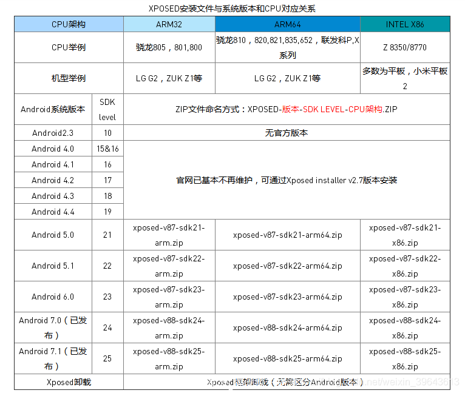
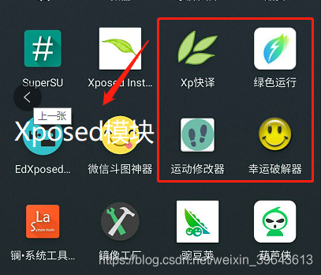
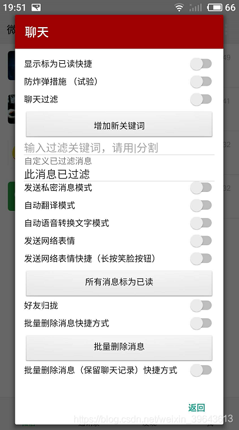
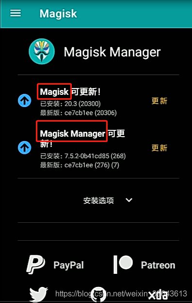
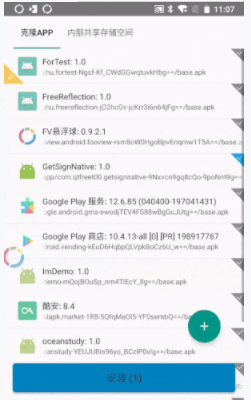

# 搞机的神器们——Xposed，Magisk，TaiChi(太极)的安装使用

src:https://blog.csdn.net/qq_35704550/article/details/104357834

# 前言：
只要是一个愿折腾的人，应该对安卓手机ROOT并不陌生。当了解了SuperSU神器后，又会发现Xposed，Magisk，太极等的一波新天地。有了这些，可以让你手机在使用应用的基础功能外还添加了连会员都体验不到的权限。手机本身ROOT外加上安装了以上框架以及框架的知名模块，手机就像开启了上帝模式，拥有最高权限的发烧机友。下面就简单介绍以下框架，具体介绍安装和使用过程。

# SuperSU:
在介绍框架需要介绍这个神器——SuperSU。 超级授权管理专业工具，它是款对Android手机进行ROOT的超级权限管理工具，超级用户访问权限管理必备利器。Super SU 原生无广告，自带简体中文，支持已ROOT设备上所有应用的超级用户访问权限管理，比Superuser功能更强大，界面更美观，更稳定！SuperSU 是最好用的授权管理应用，没有之一。 (对于Android P和Q，SuperSU不支持，ROOT方法需要另求)

**安装：**

1. 手机需要先刷入一个第三方Recovery，(手机的原厂Recovery不支持，刷第三方REC可以看我之前的推文)。

2. 手机关机后，电源按住上或下键进入TWRP或者 CWM （第三方的Recovery）。

3. 网上下载SuperSU.zip刷机包放入手机SD卡中。

4. 在TWRP中点击“安装”找到指定路径的SuperSU.zip将其刷入后重启。

5. 重启进入手机后将SuperSU.zip对应的SuperSU.apk安装就可以查看和管理手机上需要ROOT权限的应用了，自然手机也就ROOT了。

# Xposed：
Xposed是一款特殊的安卓应用，诞生于著名的XDA论坛，由Xposed框架和Xposed模块组成。 你可以把它看作是一部模块化手机，Xposed框架相当于手机的主体，而Xposed模块相当于模块化手机的诸如镜头模块、投影模块和电池模块此类的各式模块。 通过Xposed框架与不同的Xposed模块的组合，你可以对你手机中的功能进行高度的自定义，比如定制一个最符合你的审美和使用习惯的状态栏，防止喜欢在后台消耗你手机的硬件资源的应用偷偷地运行，禁止应用开机自启和禁止应用间的相互唤醒。

**安装：**

1.  安装分别是Xposed安装器和Xposed框架的卡刷包，同样也是一个zip后缀的和一个apk。

2.  安装Xposed前手机最好是ROOT过并且也刷入了第三方Recovery，然后进入REC进行卡刷zip包。

3.  卡刷包可以进入http://dl-xda.xposed.info/framework/。找到与当前手机机型对应的包，里面还有卸载包。

4.   如果手机是32位处理器，下载arm目录里的文件，如果手机是64位的处理器，下载arm64目录里的文件，如果手机使用的是英特尔芯的x86架构的处理器，那就下载x86目录里的文件，注意了，一定要下载zip格式 。

5. 在REC中刷入zip完成后重启，然后进入手机就可以安装Xposed Installer_xxx.apk了。

6.  接下来就是安装模块，这些也都是apk后缀的，本身就是APP所以也和一般应用一样的安装方法。然后打开Xposed Installer点击菜单按钮找到“模块”。

7.  进入到模块找到刚刚安装的Xposed模块，将其打勾，然后回到主页点击“重启设备”。

8.  重启过后就可以去模块扩展功能的应用里查看是否有该项功能了。

# Magisk：
Magisk，作者是来自中国台湾的topjohnwu，它主要有两个重大功能：ROOT权限获取和管理、挂载功能多样的各种扩展模块。 虽然和Xposed类似，但是Magisk是通过挂载一个与系统文件相隔离的文件系统来加载自定义内容，为系统分区打开了一个通往平行世界的入口，所有改动在那个世界（Magisk 分区）里发生，在必要的时候却又可以被认为是（从系统分区的角度而言）没有发生过。

**安装：**
1. Magisk同样分为两部分文件，一个卡刷包zip文件，一个安装管理器APP，需要在网上下载或联系我单独发送。

2. 和Xposed类似手机也需要有第三方的Recovery，然后通过其功能将面具包刷入，不过不用安装SuperSU,因为Magisk自带了ROOT功能，刷入后手机就拥有了ROOT权限，并且管理器也能对手机需要权限的应用进行管理，还有隐藏ROOT功能。

3. 刷包后重启手机就开始安装Magisk Manager.apk，而Magisk的模块都是zip结尾的，需要安装器进行刷入。

4. 进入安装器APP后点击菜单里的“模块”就可以查看安装了所有模块，创建点击下面的“+”号。

5. 将下载好的模块zip包放入手机的SD中，然后点击添加“打开文件”，选中模块包就可以进行刷入了，最后选中重启就可以了。

# TaiChi太极：
太极是一个类Xposed框架，它能够加载Xposed模块、模块能通过它改变系统和应用的行为。 如：修改系统和APP、拦截方法，执行hook逻辑等。 太极既能以传统的Root/刷机方式运作，也能免Root/免刷机运行，目前已稳定支持 Android 5.0 ~ 10。 一键安装太极APP和模块，免去了手机要先刷入第三方REC后再刷包

**安装：**

1. 官网下载太极APP并安装到手机，进入首页点击下面图标创建应用。

2. 点击后太极会先将应用卸载然后再次安装就成了太极式的应用了，随后就安装模块。在系统上也能照常使用。

3. 模块可以在太极APP内下载也可以在其他地方获取然后像安装普通APP一样，完后点击“模块管理”，将新装的模块勾选，最后回到首页将对应的应用长按“强制停止”，再回到系统上重启。

4. 回到应用查看模块的扩展功能是否加入就完毕了。

# 附加 VirtualXposed：
  [VirtualXposed](https://xposed.appkg.com/tag/virtualxposed) 是基于VirtualApp和epic在非ROOT环境下运行Xposed模块的实现（支持5.0~8.1)。一直以来[Xposed框架](https://xposed.appkg.com/tag/xposed%E6%A1%86%E6%9E%B6)最大的入门难度就在于设备需要Root，然后还要Recovery，还有承担变砖的各种搞基风险 。VirtualXposed同太极般，只需要安装该应用，不同的是要把需要的APP在VirtualXposed重新安装一遍，并且模块起效果的APP需要打开VirtualXposed里才能使用，不能同太极一样在系统上体验模块化的APP。
