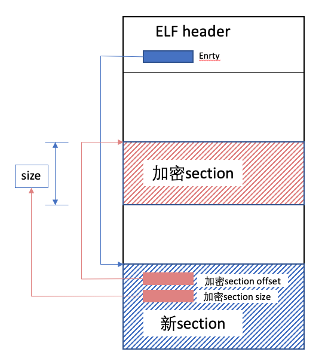

# Android so库加密Section 内存解密

在赵四的文章[《Android逆向之旅—基于对so中的section加密技术实现so加固》](http://www.520monkey.com/archives/565)中，已经很详尽的介绍了对so库的section加密并在内存中解密的过程，但是四哥的方法改动了`shoff`(section header offset)，这个在android7.0之后是不能work的，因为7.0之后android对so库elf头中关于section部分的进行了校验，修改`shoff`会导致so库加载后不能运行，本文的是借助了四哥的另一篇文章的方法来解决的这个问题。

四哥的这个加密section的方法中，将加密section的长度和加密section的偏移分别保存在elf header中的entry和shoff字段，修改entry字段的方法在android7.0之后是可行的，但是为了在之后解密过程中找到加密section，加密section的size和offset是少不了的（当然我也尝试过别的方法，之后再说），但是我没有再找到能添加的地方了（32位so库的section size和offset都是4byte，无法压缩到一个entry中），于是就“简单粗暴”的直接加个新的section，把加密section的size和offset存放在新的section里，再把新的section的offset存放到entry中，这不就解决了这个问题嘛，过程图我也画了一下。 

四哥的另一篇文章[《Android逆向之旅—Android应用的汉化功能(修改SO中的字符串内容)》](http://www.520monkey.com/archives/561)中，介绍了几种如何修改so库中的字符串内容的方法，其中一种是向so库中添加section，于是按照这篇文章实现了新section的添加。

解密过程参考四哥section加密的文章，其中解密函数修改如下：

| ` 1 2 3 4 5 6 7 8 9 10 11 12 13 14 15 16 17 18 19 20 21 22 23 24 25 26 27 28 29 30 31 32 33 34 35 36 37 38 39 40 41 42 43 44 45 46 47 48 49 50 51 52 53 54 55 56 57 58 59 60 ` | `void init_getString(){    int successFlag = 1;    unsigned int mySectionSize;    unsigned int mySectionOffset;    unsigned int sectionHeaderOffset;    unsigned int sectionHeaderSize;    unsigned int stringSectionHeaderOffset;    unsigned int addNewSectionOffset;    unsigned int nsize;    unsigned long base;    unsigned long text_addr;    unsigned int i;    Elf32_Ehdr *ehdr;     //获取so的起始地址    base = getLibAddr();        ehdr = (Elf32_Ehdr *)base;     //获取新加section的偏移值    addNewSectionOffset = ehdr->e_entry;        //从内存读取加密section的offset和size    mySectionOffset = *(unsigned int *)(base + addNewSectionOffset);    text_addr = mySectionOffset + base;     mySectionSize = *(unsigned int *) (base + addNewSectionOffset + 4);    nsize = mySectionSize/4096 + (mySectionSize%4096 == 0 ? 0 : 1);     __android_log_print(ANDROID_LOG_INFO, "JNITag", "addNewSectionOffset = 0x%x, addNewSectionVirtualOffset =  0x%x", addNewSectionOffset, addNewSectionOffset + base);    __android_log_print(ANDROID_LOG_INFO, "JNITag", "mySectionOffset = 0x%x, mySectionSize =  0x%x, nsize:%d", mySectionOffset, mySectionSize, nsize);    __android_log_print(ANDROID_LOG_INFO, "JNITag", "mySectionVirtualOffset =  0x%x", text_addr);    printf("mySectionSize = %d\n", mySectionSize);     //修改内存的操作权限    if(mprotect((void *) (text_addr / PAGE_SIZE * PAGE_SIZE), 4096 * nsize, PROT_READ | PROT_EXEC | PROT_WRITE) != 0){        puts("mem privilege change failed");        __android_log_print(ANDROID_LOG_INFO, "JNITag", "mem privilege change failed");        successFlag = 0;    }    //解密    for(i = 0;i < mySectionSize; i++){        char *addr = (char*)(text_addr + i);        *addr = ~(*addr);    }     if(mprotect((void *) (text_addr / PAGE_SIZE * PAGE_SIZE), 4096 * nsize, PROT_READ | PROT_EXEC) != 0){        puts("mem privilege change failed");        __android_log_print(ANDROID_LOG_INFO, "JNITag", "The second mem privilege change failed");        successFlag = 0;    }     if (successFlag) {        puts("Decrypt success");        __android_log_print(ANDROID_LOG_INFO, "JNITag", "Decrypt success");    } else {        puts("Decrypt fail");        __android_log_print(ANDROID_LOG_INFO, "JNITag", "Decrypt fail");    } } ` |
| ------------------------------------------------------------ | ------------------------------------------------------------ |
|                                                              |                                                              |

AddSection代码：https://github.com/hustwyk/AndroidSoAddSection

EncodeSection代码：https://github.com/hustwyk/AndroidSoEncodeSection