# VMP指令虚拟化原理

个人博客:http://www.cnblogs.com/2014asm/

0x00：什么是代码虚拟化？

　　虚拟机保护是这几年比较流行的软件保护技术。这个词源于俄罗斯的著名软件保护软件“VmProtect”，以此为开端引起了软件保护壳领域的革命，各大软件保护壳都将虚拟机保护这一新颖的技术加入到自己的产品中。
代码虚拟化是将程序代码编译为虚拟机指令即虚拟代码(自己定义的代码集)，通过虚拟CPU解释并执行的一种方式，大致流程如下:

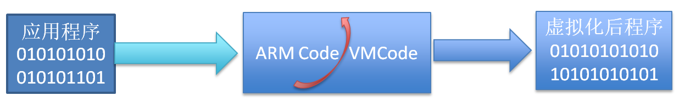

我们抛开ARM平台CPU流水线机制不谈，简单来说，其实CPU就是遵循一个简单的模式：循环读取、解码、执行这个过程。

0x01：为什么要指令虚拟化

　　首先我们来回顾下软件保护壳的发展，大致可分为三个阶段。
第一阶段：当壳完成解密目标代码时，它将不会再次控制程序，被保护程序的明文将在内存中展开。在此之前，壳可以调用一切系统手段来防治黑客的调试与逆向。
第二阶段：可以实现分段式的加解密，壳运行完毕后，并不会消失而仍然会在程序运行到某个点时再次启动。
第三阶段：其实最简单的解释是，将被保护的指令使用一套自定义的字节码(逻辑上等价)来替换掉程序中原有的指令，而字节码在执行的时候又由程序中的解释器来解释执行，自定义的字节码只有自己的解释器才能识别，也是因为这一点，基于虚拟机的保护相对其他保护而言要更加难分析。

0x02:代码虚拟化背后的原理

VMP加壳的大致流程:加载须要保护的文件->通过反汇编解析指令格式得到须要保护函数的信息->准备虚拟机环境->生成虚拟机指令 (pcode)->Handle模板。

虚拟机加密流程，它会把源程序的指令变成自定义的伪指令，等到执行的时候，VMP内置在保护程序中的VM就会启动，读取伪指令，然后解析执行。保护前后对比。

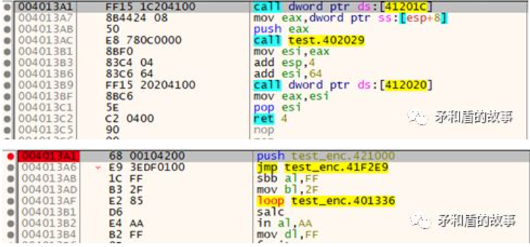

保护后会跳到虚拟机中执行，执行流程:

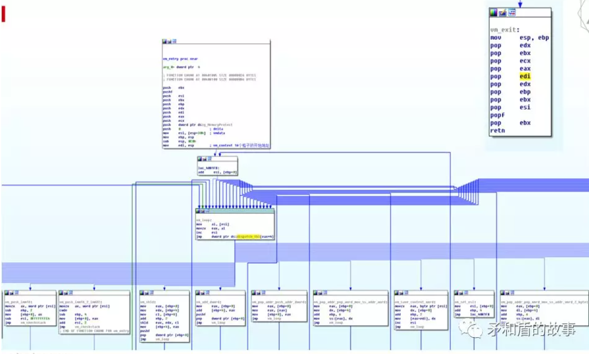

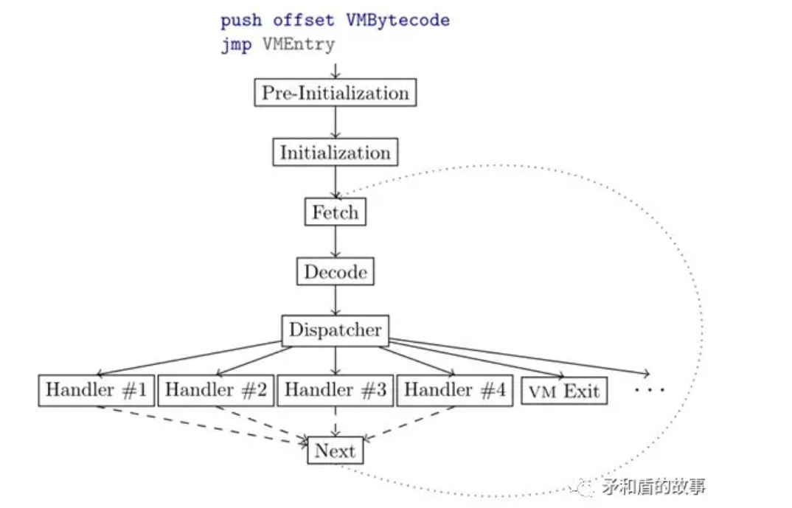

0x03：一个简单的虚拟机实现

了解过代码虚拟化的原理之后，就是自定义一套字节码，然后使用一个解释器解释运行字节码。所以，我们要实现定义字节码与实现解释器。
字节码只是一个标识，可以随意定义，以下是自定义的字节码，只定义了几个常用的指令，其中每条指令标识都对应于一个字节码。

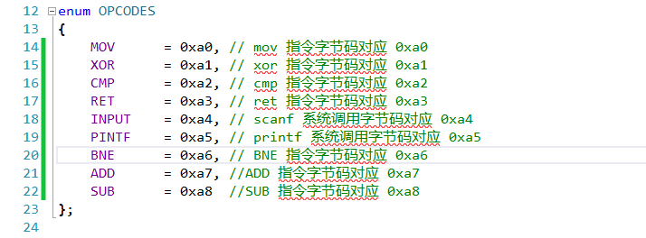

在定义好指令对应的字节码之后，就须要一个解释器来解释定义的指令字节码了。其实这里的解释器与物理机CPU很相似。在物理机中的程序执行需要处理器、寄存器、栈、堆等环境才可以运行起来，所以需要虚拟寄存器，栈、堆等，以下是处理器。

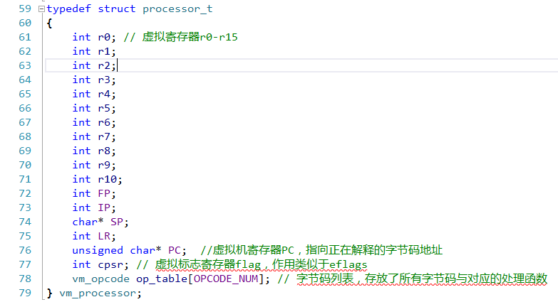

有了上面结构之后，就可以来动手写解释器了。解释器的工作其实就是判断当前解释的字节码是否可以解析，如果可以就把相应参数传递给相应的处理函数，让处理函数来解释执行这一条指令。以下是解释器代码。

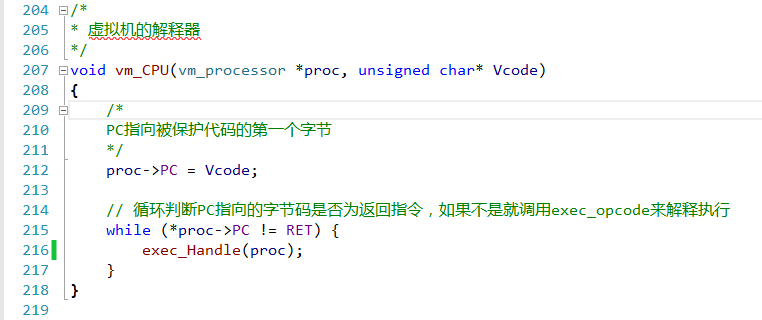

解释器解释执行过程:
首先可以从上面看到解释器vm_CPU执行时pc会指向Vcode，也就是自定义的字节码第一个字节0xa0(对应指令为MOV)，之后会判断pc指向的字节码是否为ret指令，ret指令是0xa3，如果pc指向的不是ret，进入exec_Handle函数进行字节码解释。

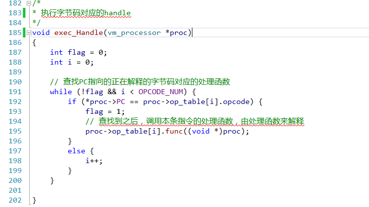

0xa0就对应着mov指令，所以当解释器遇到0xa0就会调用vm_mov函数来解释mov指令。

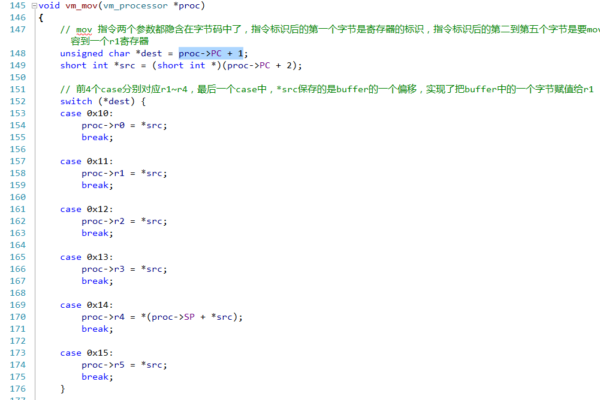

在vm_mov函数中首先把PC + 1处的一个字节和PC + 2处2个字节分别保存在dest和src中，dest是寄存器标识，在后面的switch中判断dest是哪个寄存器，在这个例子中dest是0x10，也就是r1寄存器，在case 0x10分支中就把*src赋值给r1。前4个字节就是第一条mov指令，对应着mov r1, xxxx，xxxx就是这4个字节中的后2个。

上面是一个解释器在解释执行字节码时的过程，其实很简单，就是通过一个字节码和解释函数的关系来调用相应的函数(Handle)，或者通过一个很长的switch来判断每个字节码，并调用相应函数(Handle) 。而解释函数则通过执行相应的操作来模拟出一个指令。最后，把这些指令串联在一起就可以执行完一个完整的逻辑。

下面是一个简单的CrackMe完整的Vcode

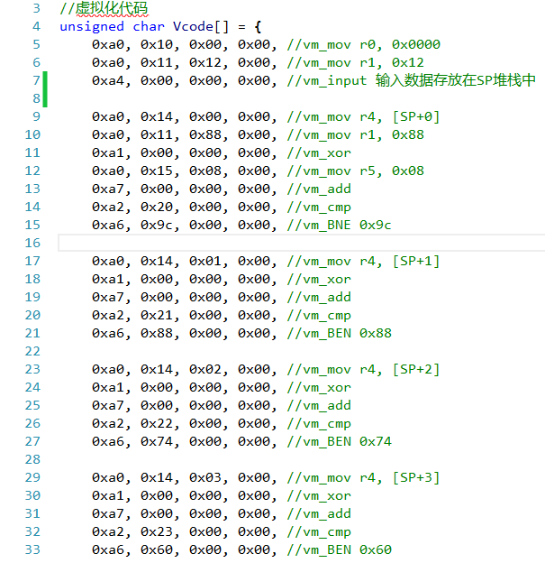

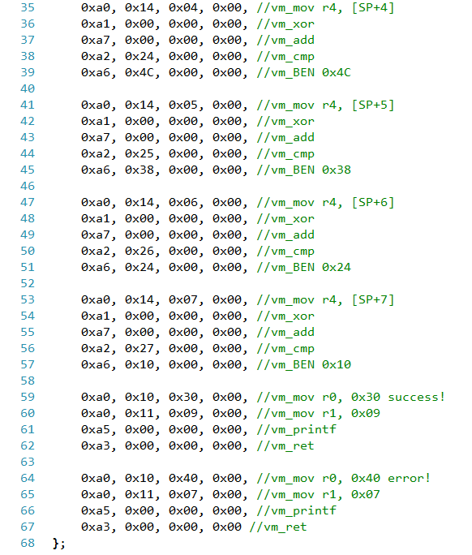

下面是一个简单的CrackMe完整的源代码

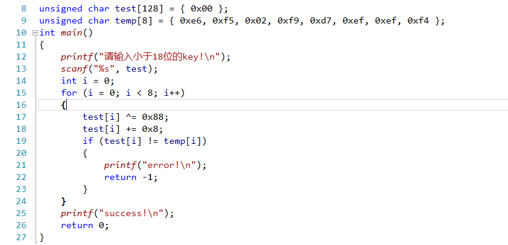

0x03：测试与总结

以android平台上测试如下:

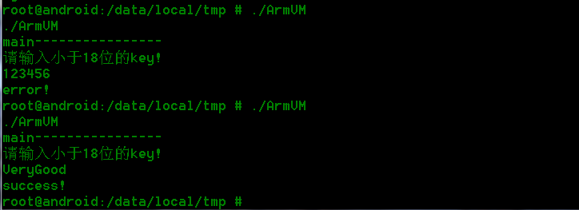

总结:
其实这只是最简单的实现，仅仅是为了学习和理解，如果想实现一个基于虚拟机的保护壳还是有些复杂，比如:随机VCode与Handle的关系映射、Handle混淆与乱序、代码变形、重定位等。

bin:

链接: https://pan.baidu.com/s/1nvbmcSp 密码: wduy