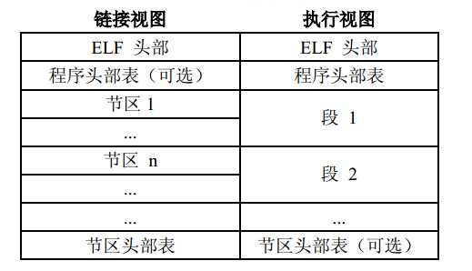
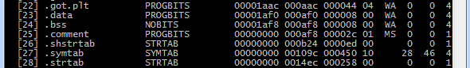
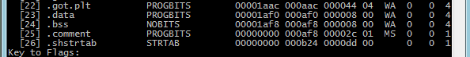
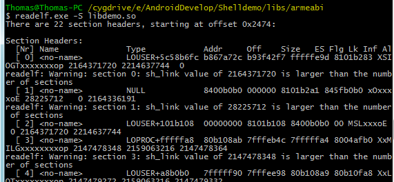
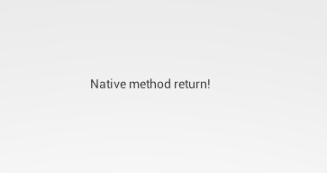
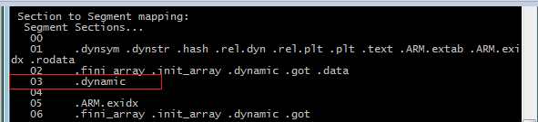
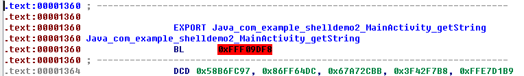

# 简单粗暴的so加解密实现

# 前言

以前一直对.so文件加载时解密不懂，不了解其工作原理和实现思路。最近翻看各种资料，有了一些思路。看到论坛没有类似帖子，故来一帖，也作为学习笔记。限于水平，本菜没有找到安卓平台一些具体实现思路，这些方法都是借鉴其他平台的实现思路和本菜的YY，肯定会有不少疏漏和错误之处，还请各位大牛指正，感激不尽！


## 一、 概述

利用动态链接库实现安卓应用的核心部分，能一定程度的对抗逆向。由于ida等神器的存在，还需要对核心部分进行加密。动态链接库的加密，在我看来，有两种实现方式：1. 有源码; 2、无源码。无源码的加密，类似window平台的加壳和对.dex文件的加壳，需要对文件进行分析，在合适的地方插入解密代码，并修正一些参数。而如果有源码，则可以构造解密代码，并让解密过程在.so被加载时完成。（当然，应用程序加载了.so文件后，内存中.so数据已经被解密，可直接dump分析。同时，也有一些对抗dump的方法，这里就不展开了）。
下文只针对有源码这种方式进行讨论，分析一些可行的实现方法。主要是包含对ELF header的分析(不是讨论各个字段含义); 基于特定section和特定函数的加解密实现(不讨论复杂的加密算法)。

# 二、 针对动态链接库的ELF头分析

网上有很多资料介绍ELF文件格式，而且写得很好很详细。我这里就不重复，不太了解的朋友，建议先看看。以下内容，我主要从链接视图和装载视图来分析ELF头的各个字段，希望能为读者提供一些ELF文件头的修正思路。
这里，我再罗嗦列出ELF头的各个字段：

```
typedef struct {
 unsigned char e_ident[EI_NIDENT]; /* File identification. */
 Elf32_Half e_type;  /* File type. */
 Elf32_Half e_machine; /* Machine architecture. */
 Elf32_Word e_version; /* ELF format version. */
 Elf32_Addr e_entry; /* Entry point. */
 Elf32_Off e_phoff; /* Program header file offset. */
 Elf32_Off e_shoff; /* Section header file offset. */
 Elf32_Word e_flags; /* Architecture-specific flags. */
 Elf32_Half e_ehsize; /* Size of ELF header in bytes. */
 Elf32_Half e_phentsize; /* Size of program header entry. */
 Elf32_Half e_phnum; /* Number of program header entries. */
 Elf32_Half e_shentsize; /* Size of section header entry. */
 Elf32_Half e_shnum; /* Number of section header entries. */
 Elf32_Half e_shstrndx; /* Section name strings section. */
} Elf32_Ehdr;
```

e_ident、e_type、e_machine、e_version、e_flags和e_ehsize字段比较固定；e_entry 入口地址与文件类型有关。e_phoff、e_phentsize和e_phnum与装载视图有关；e_shoff、e_shentsize、e_shnum和e_shstrndx与链接视图有关。目前e_ehsize = 52字节，e_shentsize = 40字节，e_phentsize = 32字节。
下面看看这两种视图的排列结构：

直接从图中，可以得到一些信息：Program header位于ELF header后面，Section Header位于ELF文件的尾部。那可以推出：
e_phoff = sizeof(e_ehsize);
整个ELF文件大小 = e_shoff + e_shnum * sizeof(e_shentsize) + 1
e_shstrndx字段的值跟strip有关。Strip之前：.shstrtab 并不是最后一个section.则 e_shstrndx = e_shnum – 1 – 2;

而经过strip之后，动态链接库末尾的.symtab和.strtab这两个section会被去掉. 则e_shstrndx = e_shnum – 1。

使用ndk生成在\libs\ armeabi\下的.so文件是经过strip的，也是被打包到apk中的。可以在\obj\local\armeabi\下找到未经过strip的.so文件。到这里，我们就可以把http://bbs.pediy.com/showthread.php?t=188793 帖子中提到的.so文件修正。如果e_shoff和e_shnum都改成任意值，那么修正起来比较麻烦。
感觉上好像e_shoff、e_shnum等与section相关的信息任意修改，对.so文件的使用毫无影响。的确是这样的，至少给出两个方面来佐证：

### 1. so文件在内存中的映射


信了解elf装载(执行)视图的朋友肯定清楚，.so文件是以segment为单位映射到内存的。图中红色区域的section是没有被映射的内存，当然也在segment中找不到。

### 2. 安卓linker源码

在linker.h源码中有一个重要的结构体soinfo，下面列出一些字段：

```
struct soinfo{
  const char name[SOINFO_NAME_LEN]; //so全名
  Elf32_Phdr *phdr; //Program header的地址
int phnum; //segment 数量
unsigned *dynamic; //指向.dynamic，在section和segment中相同的
//以下4个成员与.hash表有关
unsigned nbucket;
unsigned nchain;
unsigned *bucket;
unsigned *chain;

unsigned *preinit_array;
unsigned preinit_array_count;
//这两个成员只能会出现在可执行文件中

 //指向初始化代码，先于main函数之行，即在加载时被linker所调用，在linker.c可以看到：__linker_init -> link_image -> call_constructors -> call_array
unsigned *init_array;
unsigned init_array_count;
void (*init_func)(void);
//与init_array类似，只是在main结束之后执行
unsigned *fini_array;
unsigned fini_array_count;
void (*fini_func)(void);
}
```

另外，linker.c中也有许多地方可以佐证。其本质还是linker是基于装载视图解析的so文件的。
基于上面的结论，再来分析下ELF头的字段。
1) e_ident[EI_NIDENT] 字段包含魔数、字节序、字长和版本，后面填充0。对于安卓的linker，通过verify_elf_object函数检验魔数，判定是否为.so文件。那么，我们可以向位置写入数据，至少可以向后面的0填充位置写入数据。遗憾的是，我在fedora 14下测试，是不能向0填充位置写数据，链接器报非0填充错误。
2) 对于安卓的linker，对e_type、e_machine、e_version和e_flags字段并不关心，是可以修改成其他数据的(仅分析，没有实测)
3) 对于动态链接库，e_entry 入口地址是无意义的，因为程序被加载时，设定的跳转地址是动态连接器的地址，这个字段是可以被作为数据填充的。
4) so装载时，与链接视图没有关系，即e_shoff、e_shentsize、e_shnum和e_shstrndx这些字段是可以任意修改的。被修改之后，使用readelf和ida等工具打开，会报各种错误，相信读者已经见识过了。
5) 既然so装载与装载视图紧密相关，自然e_phoff、e_phentsize和e_phnum这些字段是不能动的。

根据上述结论，做一个面目全非，各种工具打开报错的so文件就很easy了，读者可以试试，这里就不举例，你将在后续内容中看到。

## 三、 基于特定section的加解密实现

这里提到基于section的加解密，是指将so文件的特定section进行加密，so文件被加载时解密。下面给出实例。
假设有一个shelldemo应用，调用一个native方法返回一个字符串供UI显示。在native方法中，又调用getString方法返回一个字符串供native方法返回。我需要将getString方法加密。这里，将getString方法存放在.mytext中(指定__attribute__((section (".mytext")));)，即是需要对.mytext进行加密。
加密流程：
1) 从so文件头读取section偏移shoff、shnum和shstrtab
2) 读取shstrtab中的字符串，存放在str空间中
3) 从shoff位置开始读取section header, 存放在shdr
4) 通过shdr -> sh_name 在str字符串中索引，与.mytext进行字符串比较，如果不匹配，继续读取
5) 通过shdr -> sh_offset 和 shdr -> sh_size字段，将.mytext内容读取并保存在content中。
6) 为了便于理解，不使用复杂的加密算法。这里，只将content的所有内容取反，即 *content = ~(*content);
7) 将content内容写回so文件中
8) 为了验证第二节中关于section 字段可以任意修改的结论，这里，将shdr -> addr 写入ELF头e_shoff，将shdr -> sh_size 和 addr 所在内存块写入e_entry中，即ehdr.e_entry = (length << 16) + nsize。当然，这样同时也简化了解密流程，还有一个好处是：如果将so文件头修正放回去，程序是不能运行的。

解密时，需要保证解密函数在so加载时被调用，那函数声明为：init_getString __attribute__((constructor))。(也可以使用c++构造器实现， 其本质也是用attribute实现)
解密流程：
1) 动态链接器通过call_array调用init_getString
2) Init_getString首先调用getLibAddr方法，得到so文件在内存中的起始地址
3) 读取前52字节，即ELF头。通过e_shoff获得.mytext内存加载地址，ehdr.e_entry获取.mytext大小和所在内存块
4) 修改.mytext所在内存块的读写权限
5) 将[e_shoff, e_shoff + size]内存区域数据解密，即取反操作：*content = ~(*content);
6) 修改回内存区域的读写权限
(这里是对代码段的数据进行解密，需要写权限。如果对数据段的数据解密，是不需要更改权限直接操作的)

利用readelf查看加密后的so文件：

运行结果很简单，源码见附件

注意：并不是所有的section都能全加，有些数据是不能加密的。比如直接对.text直接加密，会把与crt有关代码也加密，只能选择性的加密。下面将介绍如何实现

## 四、 基于特定函数的加解密实现

上面的加解密方式可谓简单粗暴。采用这种方式实现，如果ELF头section被恢复，则很容易被发现so多了一个section。那么，对ELF中已存在的section中的数据部分加密，可以达到一定的隐藏效果。
与上节例子类似，命名为shelldemo2，只是native直接返回字符串给UI。需要做的是对Java_com_example_shelldemo2_MainActivity_getString函数进行加密。加密和解密都是基于装载视图实现。需要注意的是，被加密函数如果用static声明，那么函数是不会出现在.dynsym中，是无法在装载视图中通过函数名找到进行解密的。当然，也可以采用取巧方式，类似上节，把地址和长度信息写入so头中实现。Java_com_example_shelldemo2_MainActivity_getString需要被调用，那么一定是能在.dynsym找到的。
加密流程：
1) 读取文件头，获取e_phoff、e_phentsize和e_phnum信息
2) 通过Elf32_Phdr中的p_type字段，找到DYNAMIC。从下图可以看出，其实DYNAMIC就是.dynamic section。从p_offset和p_filesz字段得到文件中的起始位置和长度

3) 遍历.dynamic，找到.dynsym、.dynstr、.hash section文件中的偏移和.dynstr的大小。在我的测试环境下，fedora 14和windows7 Cygwin x64中elf.h定义.hash的d_tag标示是：DT_GNU_HASH;而安卓源码中的是：DT_HASH。
4) 根据函数名称，计算hash值
5) 根据hash值，找到下标hash % nbuckets的bucket；根据bucket中的值，读取.dynsym中的对应索引的Elf32_Sym符号；从符号的st_name所以找到在.dynstr中对应的字符串与函数名进行比较。若不等，则根据chain[hash % nbuckets]找下一个Elf32_Sym符号，直到找到或者chain终止为止。这里叙述得有些复杂，直接上代码。
for(i = bucket[funHash % nbucket]; i != 0; i = chain[i]){
 if(strcmp(dynstr + (funSym + i)->st_name, funcName) == 0){
  flag = 0;
  break;
 }
}
6) 找到函数对应的Elf32_Sym符号后，即可根据st_value和st_size字段找到函数的位置和大小
7) 后面的步骤就和上节相同了，这里就不赘述

解密流程为加密逆过程，大体相同，只有一些细微的区别，具体如下：
1) 找到so文件在内存中的起始地址
2) 也是通过so文件头找到Phdr；从Phdr找到PT_DYNAMIC后，需取p_vaddr和p_filesz字段，并非p_offset，这里需要注意。
3) 后续操作就加密类似，就不赘述。对内存区域数据的解密，也需要注意读写权限问题。

加密后效果：

运行结果与上节相同，就不贴了。

## 五、 参考资料
http://blog.csdn.net/forlong401/article/details/12060605
《ELF文件格式》
Android linker源码：bionic\linker
Android libc源码：bionic\libc\bionic
谷歌：ELF链接视图与装载视图相关资料
\------------------------------------------------------------------------
基于上面的方法，我写了一个CrackMe.apk的注册机程序供大家玩耍。输入3~10位的username和regcodes，8位的校验码，字符范围：A~Z、a~z、0~9。若校验通过，则提示：congratulation! You crack it!. 