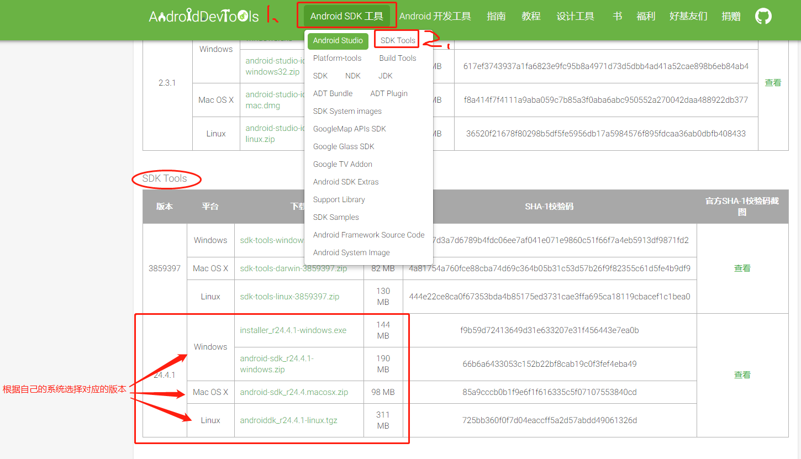
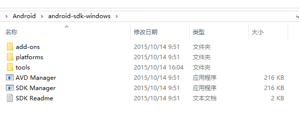
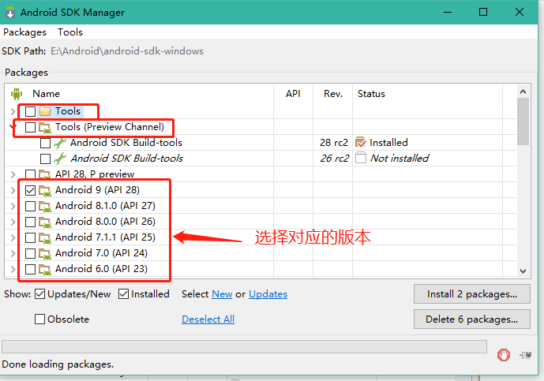
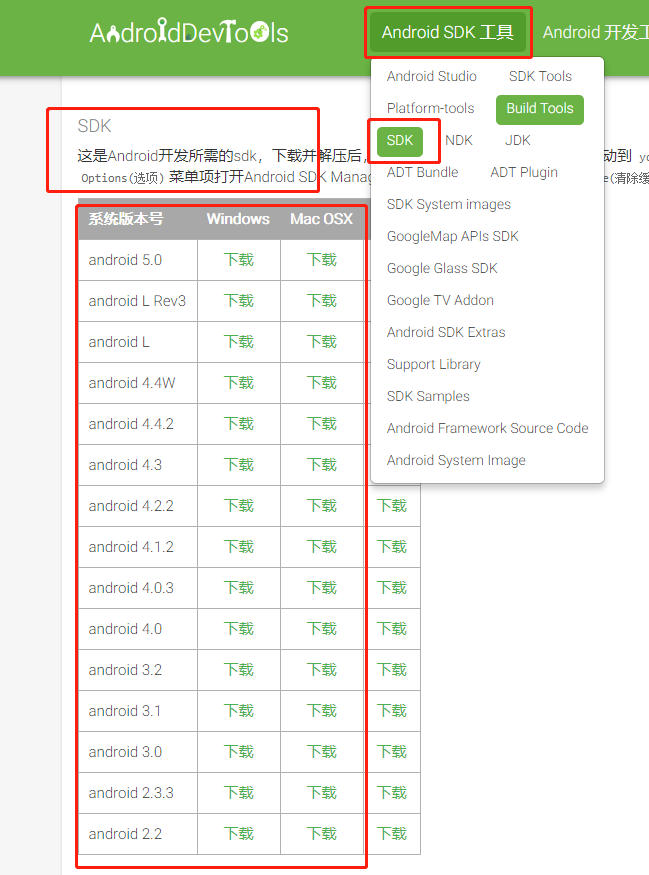
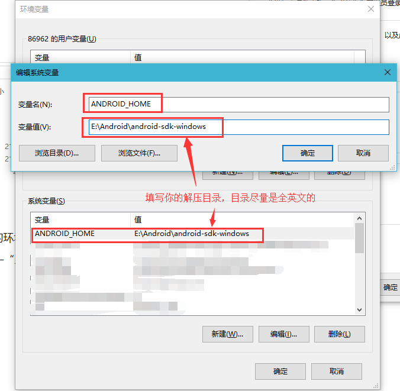
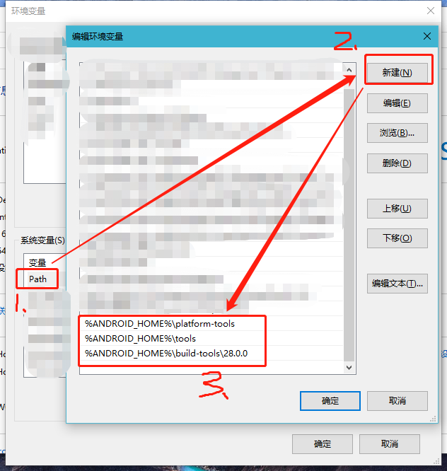
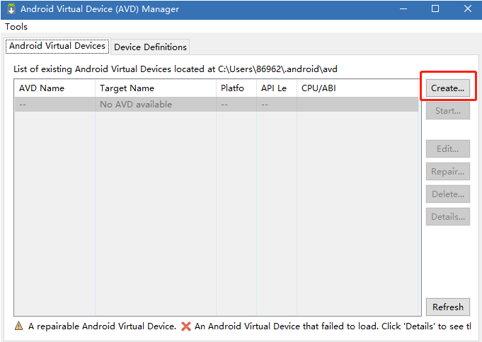
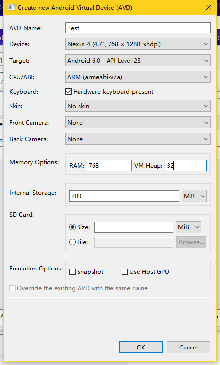
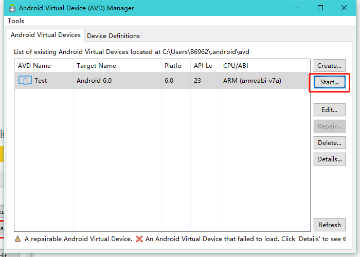
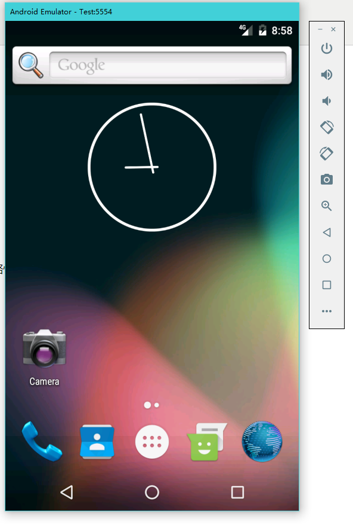

## 一、Android SDK简介

　　Android SDK（Software Development Kit，软件开发工具包）被软件开发工程师用于为特定的软件包、软件框架、硬件平台、操作系统等建立应用软件的开发工具的集合。它提供了 Android API 库和开发工具构建，测试和调试应用程序。简单来讲，Android SDK 可以看做用于开发和运行 Android 应用的一个软件。

## **二、下载SDK**

　　　　1.目前官网上已经没有单独的SDK下载安装包了。目前官网推荐的是下载包含有Android SDK的Android Studio。[官网下载传送门](https://developer.android.com/studio/)

　　　　　　Android Studio 的一个功能非常强大的用来做安卓开发试调的官方出品的工具。但是谷歌官网在国内是无法访问

　　　　2.由于这个Android Studio 的安装包过大且官网下载需要翻墙，而咱们在用Appium 的时候实际上只需要用到SDK 工具而已。所以推荐大家去另外一个国内的Android 工具的下载网站下载。[传送门](http://www.androiddevtools.cn/)

　　　　　　进入页面后点击【Android SDK 工具】按钮，然后在弹出的选择框内点击【SDK Tools】按钮，然后界面会自动跳转到SDK 的下载界面，选择适合自己的版本进行下载

　　　　[](https://images2018.cnblogs.com/blog/773489/201806/773489-20180608165838961-1017229544.png)

 

 　　　　　　　将下载后的安装包解压到相应的目录下，如下图：

 　　　　　[](https://images2018.cnblogs.com/blog/773489/201806/773489-20180608170919665-1674628939.png)

**三、安装Android 版本**

　　进入SDK的解压目录下，双击“SDK Manager.exe”打开SDK管理器

　　　　[](https://images2018.cnblogs.com/blog/773489/201806/773489-20180610155224920-579036518.png)

 　在使用这个管理器的时候，需要使用翻墙，才能进行下载安装；或者你也可以在上面推荐的那个下载SDK的国内安卓工具网站上下载适合你的版本的Android SDK 镜像，[网站传送门](http://www.androiddevtools.cn/)

 　　　　　[](https://images2018.cnblogs.com/blog/773489/201806/773489-20180610155822083-1482301575.png)

 

**四、SDK环境配置**　

　　　　在解压完成后，就可以开始配置环境变量了。方法和设置JAVA JDK的环境变量的方法类似。

　　　　“右键 我的电脑”—“属性”—“高级系统设置”—“环境变量”—“系统变量”—“新建”

\```SDK 需要对环境变量做如下更改(win 10)：``1 创建ANDROID_HOME，值是你的刚刚SDK的解压目录，比如     E:\Android\android-sdk-windows`

 　　　[](https://images2018.cnblogs.com/blog/773489/201806/773489-20180608193815690-850841894.png)

　　　　在新建完ANDROID_HOME之后，找到Path变量，然后双击打开Path 变量　　　　　　

```
将SDK的platform-tools和tool的路径添加到Path 变量内（这两个目录在你通过SDK Manager安装更新Android SDK Tools和Android SDK Platform-tools之后就会有了）1 新建 %ANDROID_HOME%\platform-tools 2 新建 %ANDROID_HOME%\tools3 新建 %ANDROID_HOME%\tools
```

 　　　[](https://images2018.cnblogs.com/blog/773489/201806/773489-20180610173440130-192311362.png)

 

**五、创建并启动一个安卓模拟器**

　　　　在安装了一个安卓SDK后，就可以创建一个对应版本的模拟器啦。

　　　　进入SDK的解压目录下，双击“AVD Manager.exe”打开安卓虚拟机管理器，如下图

　　　　[](https://images2018.cnblogs.com/blog/773489/201806/773489-20180610162957979-1859881302.png)

　　　　然后点击“Create”按钮，打开创建安卓虚拟设备界面(如下图)，然后输入各项信息进行虚拟设备创建。

　　　　[](https://images2018.cnblogs.com/blog/773489/201806/773489-20180610164929869-594913666.png)

　　　　不要选择超过电脑屏幕分辨率的Device，其他选项可参考上图，点击 “OK” 创建完成。

　　　　[](https://images2018.cnblogs.com/blog/773489/201806/773489-20180610165201900-219443377.png)

 　　　在 AVD Manage 工具中选中创建的Android虚拟机，点击 “Start…” 按钮启动(第一次启动会略慢，需要耐心的等一会儿)，启动成功后如下图所示

 　　　[](https://images2018.cnblogs.com/blog/773489/201806/773489-20180610170119720-342895783.png)


__EOF__