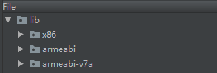
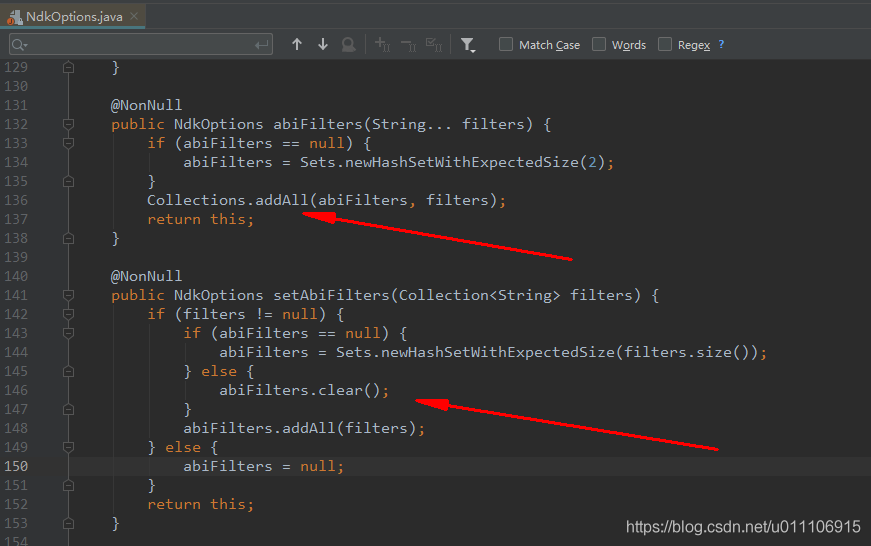

## 1.问题产生原因

项目引用远程gradle配置，该配置已经默认数种cpu架构类型，但是我在当前项目由于某种原因只想要其中一种架构，怎么处理？

##### 原配置

```java
   ndk {
       abiFilters 'armeabi-v7a', 'armeabi', 'x86'
   }
123
```

## 2.在当前项目内也采用该方式，但是打出的apk中仍然是上面的三种cpu架构类型

##### 当前项目配置

```java
   ndk {
       abiFilters 'armeabi-v7a'
   }
123
```



## 3.查明原因

点击进入源码，发现该方法是累加的，故不生效；查看源码发现setAbiFilters方法有个清除操作


## 4.调整配置方式，生效，达到目的

```java
   ndk {
       setAbiFilters(['armeabi-v7a'])
   }
```