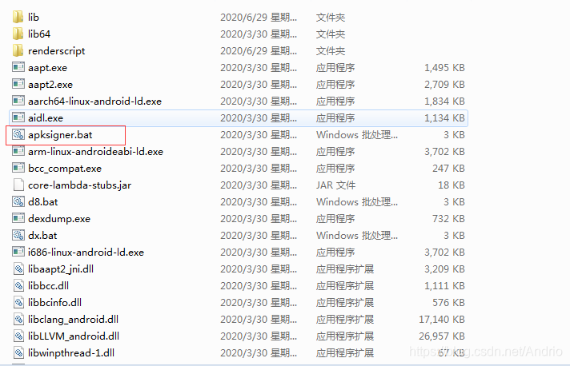
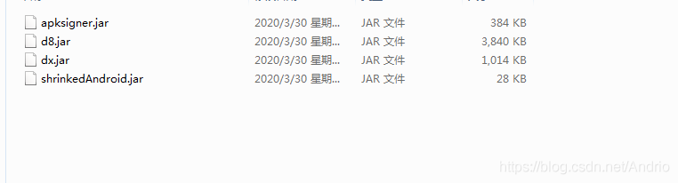

# Android 对APK进行v1+v2+v3签名

在AndroidStudio中，我们可以很方便的对apk进行打包与签名，也可以选择V1或V2签名；然而，有些时候（比如反编译重新打包、apk加固后...），我们却需要直接对APk进行签名.

在Android7.0引入了jdk7才支持的V2签名，这一签名不需要对所有文件进行摘要计算、且增加了APK 签名分块并且该分块有特定格式，所以，使用V2签名后，apk的安装速度与完整性保障都有不错的提升；然而，由于需要兼容旧版本，V1签名不能完全去掉，现多使用v1+v2(+v3）签名形式。

 

### V1签名（jarsigner方式）最基础签名

由于安全漏洞问题，最近对app进行了一些改善，其中包括使用了第三方进行加固；加固后，必须对apk进行重新签名，于是使用了以下方式：

```
 // apksigner -verbose -keystore (签名地址) -signedjar (签名后的apk地址) (待签名apk地址) (别名)
```

### V2签名（apksigner方式）

原来，jarsigner只是对apk进行了V1签名；前面说到在Android7.0引入了V2签名，因此，当进入sdk\25.0.0及后续版本，会发现一个apksigner.bat执行脚本。这里我用的是29.0.3版本


 





我们可以通过apksigner进行V2签名，当然，apksigner默认是同时支持V1与V2的，于是：

（使用jar命令时记得指向该jar地址）

```
//直接用apksigner进行签名
apksigner sign --ks (签名地址) --ks-key-alias (别名) --out (签名后的apk地址) (待签名apk地址)
 
//使用Jar命令进行签名
java -jar apksigner.jar sign --ks (签名地址) --ks-key-alias (别名) --out (签名后的apk地址) (待签名apk地址)
```

 

### 签名验证

至此，兼容V1、V2的apk签名已完成，我们可以使用以下指令验证是否签名成功：

```
//直接用apksigner进行验证
apksigner verify -v --print-certs (apk地址)
    
//使用Jar命令进行验证    
java -jar apksigner.jar   verify -v --print-certs (apk地址)
```


