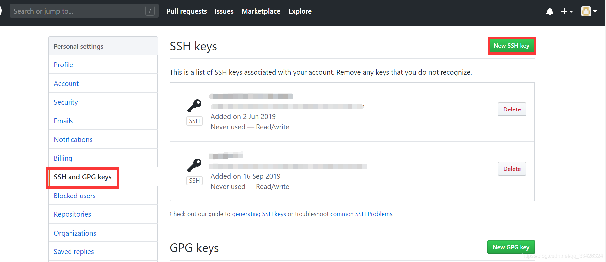
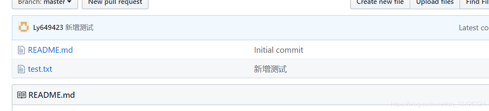

# git同时绑定两个账号gitlab、github

url：https://blog.csdn.net/qq_33426324/article/details/102687113


git同时绑定两个账号gitlab、github
有时候git需要同时绑定两个账号，一个是公司的gitlab、一个是私人的github

流程：
1 生成两对 公/私钥，一个账户一对
2 设置不同的Host
3 取消全局的username、usermail，为每个账户单独设置

步骤：
生成两对公/私钥
一般情况下，是已经有一对密钥的，只需要根据命令在生成一对就可以了，注意密钥的名称必须区分开来，我的电脑是一对密钥都没有，所以生成了两对。

```
ssh-keygen -t rsa -C "注册github邮箱" -f ~/.ssh/id_rsa_1
ssh-keygen -t rsa -C "注册gitlab邮箱" -f ~/.ssh/id_rsa_2
```

生成后，可以通过 **ls ~/.ssh** 查看已经生成的两组公/私钥


添加 私钥 到SSH:

```
ssh-add id_rsa_1
ssh-add id_rsa_2
```

## 设置不同的Host

**vim ~/.ssh/config**
编辑config里面的内容，没有config的话touch一个 **touch ~/.ssh/config**

```
# github user
Host git@github.com
Hostname https://github.com/
User github的用户名
IdentityFile ~/.ssh/id_rsa_1

#gitlab user
Host git@gitlab.com
Hostname http://gitlab.com/
User gitlab的用户名
IdentityFile ~/.ssh/id_rsa_2

```

配置完成后，在gitlab上添加ssh密钥，将id_rsa_1.pub中的内容复制过去,github同理。



测试是否配置成功：

```
ssh -T git@github.com
ssh -T git@gitlab.com
```

提示下面这句话，表示链接成功

Hi Ly9623! You’ve successfully authenticated, but GitHub does not provide shell access.

取消全局的username、usermail，为每个账户单独设置
取消全局配置：

```
git config ––global -l   //查看配置
git config ––global –unset user.name
git config ––global –unset user.email
```

在clone项目存放的目录中，打开git bush，单独设置每个账户的 username/usermail

```
git config user.email “邮箱”
git config user.name “用户名”
```

新建text.txt文档，push至github，输入用户名和密码，上传成功



