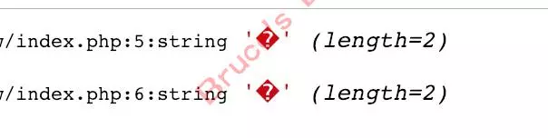

# base64加号问题

url：https://www.xiebruce.top/698.html

## base64为什么叫base64？

因为base64编码是由26个大写字母、26个小写字母、10个数字、“+”号、“/”号共64个字符组成的，base是基于的意思，所以我认为base64的意思就是『基于这64个字符』的一种编码方式，即不管什么字符串，经过base64编码后，都会转换成由这64个字符组成的字符串，当然还有个=号用于表示填充符（当转换成base64编码后如果字符串长度不是3的倍数，则会在末尾用`=`号填充直到整个字符串长度是3的倍数）。

## 加号问题

由于`+`号在url中会被转成空格，`/`号会被当成url分隔符，而我们又习惯在接收到参数后过滤参数两端的空格，所以如果在浏览器url上传输这些值，拿到值后再过滤掉两端的空格，然后再decode这个base64编码，结果肯定会出问题。比如`松`字的base64编码是`5p2+`，`蕾`字的base64编码是`6JW+`，我们试试把+号去掉再decode：

```php
var_dump(base64_decode('5p2'));
var_dump(base64_decode('6JW'));
```


解码的结果就是变成乱码：



为了避免这个问题，我们可以把`+`号换成横杠`-`，`/`号换成下划线`_`，然后再在url上传输，接收到参数后，只要在解码前把这两个特殊替换回`+`号和`/`号，然后再解码，这样就不会出错了：

```php
<?php
    /**
     * base64_encode后，把+替换成-，把/替换成_，因为这两个符号在url中会被转换
     * @param $str
     * @return mixed
     */
    function base64Encode($str){
        return strtr(base64_encode($str), '+/', '-_');
    }

    /**
     * 把-替换回+，把_替换回/后，再decode
     * @param $str
     * @return mixed
     */
    function base64Decode($str){
        return base64_decode(strtr($str, '-_', '+/'));
    }
```

