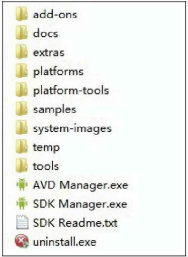

# Android SDK是什么？

SDK (Software Development Kit) 软件开发工具包是软件开发工程师用于为特定的软件包、软件框架、硬件平台、操作系统等建立应用软件的开发工具的集合。[Android](http://c.biancheng.net/android/) SDK 就是 Android 专属的软件开发工具包。

## Android SDK 目录结构

Android SDK 解压即可完成安装，其中包含的文件、文件夹如图 1 所示。

图 1 Android SDK 目录结构图

#### 1) add-ons

该目录中存放 Android 的扩展库，比如 Google Maps，但若未选择安装 Google API，则该目录为空。

#### 2) docs

该目录是 developer.Android.com 的开发文档，包含 SDK 平台、工具、ADT 等的介绍，开发指南，API 文档，相关资源等。

#### 3) extras

该目录用于存放 Android 附加支持文件，主要包含 Android 的 support 支持包、Google 的几个工具和驱动、Intel 的 IntelHaxm。

#### 4) platforms

该目录用于存放 Android SDK Platforms 平台相关文件，包括字体、res 资源、模板等。

#### 5) platform-tools

该目录包含各个平台工具，其中主要包含以下几部分。

| 名称                                             | 作用                                                         |
| ------------------------------------------------ | ------------------------------------------------------------ |
| api 目录                                         | api-versions.xml 文件，用于指明所需类的属性、方法、接口等    |
| lib 目录                                         | 目录中只有 dx.jar 文件，为平台工具启动 dx.bat 时加载并使用 jar 包里的类 |
| aapt.exe                                         | 把开发的应用打包成 APK 安装文件，如果用 Eclipse 开发，就不用通过命令窗口输入命令+参数实现打包 |
| adb.exe (Android Debug Bridge 调试桥)            | 通过它连接 Android 手机（或模拟器）与 PC 端，可以在 PC 端上控制手机的操作。如果用 Eclipse 开发，一般情况 下 ADB 会自动启动，之后我们可以通过 DDMS 来调试 Android 程序。 |
| aidl.exe (Android Interface Definition Language) | Android 内部进程通信接口的描述语言，用于生成可以在 Android 设备进行进程间通信 (Inter-Process Communication，IPC) 的代码 |
| dexdump.exe                                      | 可以反编译 .dex 文件，例如 .dex 文件里包含 3 个类，反编译后也会出现 3 个 .class 文件，通过这些文件可以大概了解原始的 [Java](http://c.biancheng.net/java/) 代码。 |
| dx.bat                                           | 将 .class 字节码文件转成 Android 字节码 .dex 文件            |
| fastboot.exe                                     | 可以进行重启系统、重写内核、查看连接设备、写分区、清空分区等操作 |
| Android llvm-rs-cc.exe                           | Renderscript 采用 LLVM 低阶虚拟机，llvm-rs-cc.exe 的主要作用是对 Renderscript 的处理 |
| NOTICE.txt 和 source.properties                  | NOTICE.txt 只是给出一些提示的信息；source.properties 是资源属性信息文件，主要显示该资源生成时间、系统类型、资源 URL 地址等。 |

#### 6) samples

samples 是 Android SDK 自带的默认示例工程，里面的 apidemos 强烈推荐初学者学习。

#### 7) system-images

该目录存放系统用到的所有图片。

#### 8) temp

该目录存放系统中的临时文件。

#### 9) tools

作为 SDK 根目录下的 tools 文件夹，这里包含重要的工具，比如 ddms 用于启动 Android 调试工具，如 logcat、屏幕截图和文件管理器；而 draw9patch 则是绘制 Android 平台的可缩放 PNG 图片的工具；sqlite3 可以在 PC 上操作 SQLite 数据库；而 monkeyrunner 则是一个不错的压力测试应用，模拟用户随机按钮；mksdcard 是模拟器 SD 映像的创建工具；emulator 是 Android 模拟器主程序，不过从 Android 1.5 开始，需要输入合适的参数才能启动模拟器；traceview 是 Android 平台上重要的调试工具。 

## Android.jar

作为一个 Java 项目，通常情况下都会引入要用到的工具类，也就是 JAR 包。

在 Android 开发中，绝大部分开发用的工具包都被封装到一个名叫 Android.jar 的文件里了。在 Eclipse 中展开来看，可以看到 J2SE 中的包、Apache 项目中的包，还有 Android 自身的包文件。Android 的包文件主要包括以下内容： 

| 名称              | 作用                                                     |
| ----------------- | -------------------------------------------------------- |
| Android.app       | 提供高层的程序模型和基本的运行环境                       |
| Android.content   | 包含各种对设备上的数据进行访问和发布的类                 |
| Android.database  | 通过内容提供者浏览和操作数据库                           |
| Android.graphics  | 底层的图形库                                             |
| Android.location  | 定位和相关服务的类                                       |
| Android.media     | 提供一些类管理多种音频、视频的媒体接口                   |
| Android.net       | 提供帮助网络访问的类，超过通常的 java.net.* 接口         |
| Android.os        | 提供系统服务、消息传输、IPC 机制                         |
| Android.openg     | 提供 OpenGL 的工具                                       |
| Android.provider  | 提供类，访问 Android 的内容提供者                        |
| Android.telephony | 提供与拨打电话相关的 API 交互                            |
| Android.view      | 提供基础的用户界面接口框架                               |
| Android.util      | 涉及工具性的方法，例如时间日期的操作                     |
| Android.webkit    | 默认浏览器操作接口                                       |
| Android.widget    | 包含各种 UI 元素（大部分是可见的）在应用程序的屏幕中使用 |

## Android API 扩展包

核心的 Android API 在每部手机上都可以使用，但仍然有一些 API 接口有各自特别的适用范围，这就是所谓的“可选API”。这些 API 之所以是“可选的”，主要是因为一个手持设备并不一定要完全支持这类 API，甚至可以完全不支持。

#### 1) Location-Based Services（定位服务）

Android 操作系统支持 GPS API-LBS，可以通过集成 GPS 芯片来接收卫星信号，通过 GPS 全球定位系统中至少 3 颗卫星和原子钟来获取当前手机的坐标数据，通过转换就可以成为地图上的具体位置，这一误差在手机上可以缩小到 10 米。在谷歌开发手机联盟中可以看到著名的 SiRF star。所以未来 gPhone 手机上市时集成 GPS 后的价格不会很贵。

同时，谷歌正在研制基于基站式的定位技术——MyLocation，可以更快速地定位，与前者 GPS 定位需要花费大约 1 分钟相比，基站定位更快。

#### 2) Media APIs（多媒体接口）

Android 平台上集成了很多影音解码器以及相关的多媒体 API，通过这些可选 API，厂商可以让手机支持 MP3、MP4、高清晰视频播放处理等。

#### 3) 3D Graphics with OpenGL（3D 图形处理 OpenGL）

可选 API。Android 平台上的游戏娱乐功能，如支持 3D 游戏或应用场景就需要用到 3D 技术，手机生产厂商根据手机的屏幕以及定位集成不同等级的 3D 加速图形芯片来加强 gPhone 手机的娱乐性，有来自高通的消息称，最新的显示芯片在 gPhone 上将会轻松超过索尼 PS3。

#### 4) Low-Level Hardware Access（低级硬件访问）

这个功能主要用于控制手机的底层方面操作，设计底层硬件操作将主要由各个手机硬件生产厂商来定制，支持不同设备的操作管理，如蓝牙 (Bluetooth) 以及 WIFI 无线网络支持等。