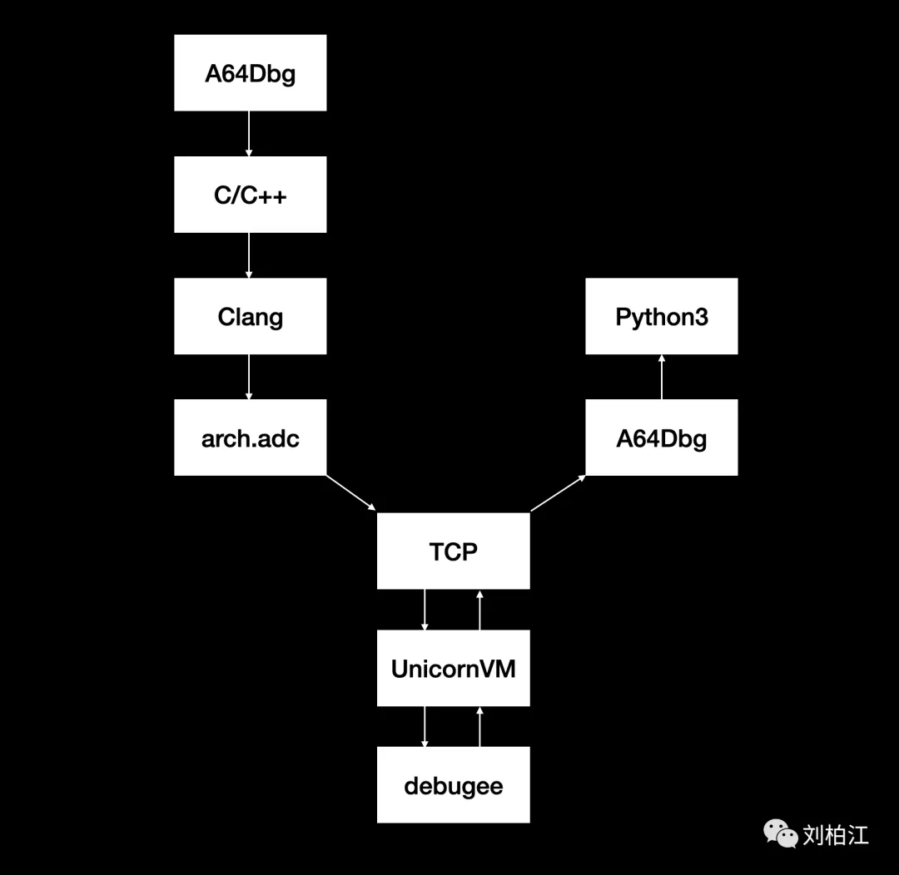
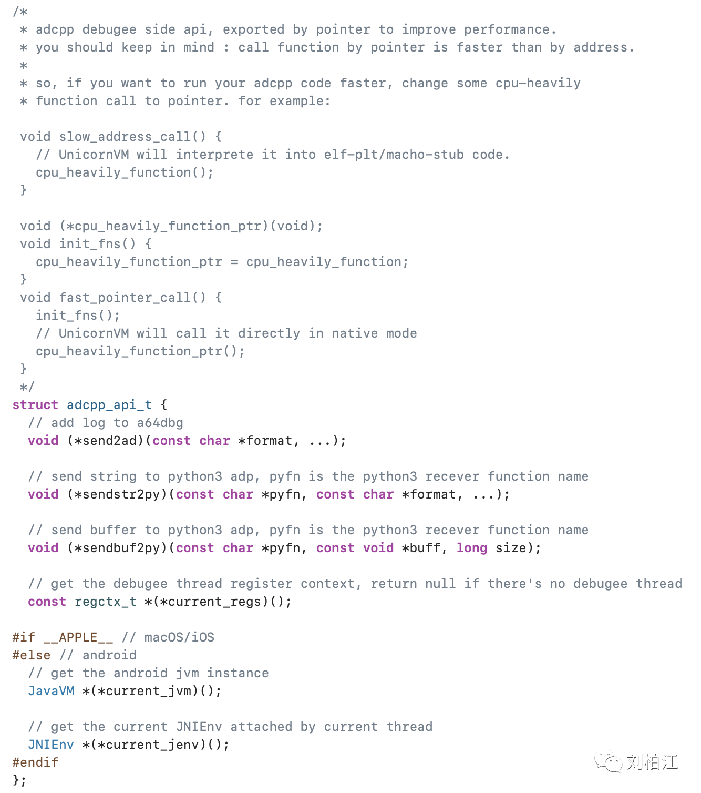

## A64Dbg-来瞧瞧ADCpp最潮流的Dump姿势

如果我们想Dump堆栈指针1024字节的数据，然后用Python去分析它，该如何操作？

以前的操作步骤（一顿操作猛如虎）：

```
lldb side: mem read ... -o /tmp/sp.bin
python side: with open('/tmp/sp.bin', 'rb') ...
```

现在的操作步骤（OneStep）：

```
def adcpp_dump(data):
    print(data)

runadc('''buf2py("adcpp_dump", (void *)sp, 1024);''')
```

运行之后可以得到sp数据输出：



是的，就是这么简单、直白、粗暴。今天我们为ADCpp头文件添加了调试线程寄存器访问的简易接口：

```
// get the debugee thread register context, return null if there's no debugee thread
const regctx_t *(*current_regs)();

// some register wrapper
#if __arm__
#define r0  adcapi()->current_regs()->r[0].w
#define r1  adcapi()->current_regs()->r[1].w
#define r2  adcapi()->current_regs()->r[2].w
#define r3  adcapi()->current_regs()->r[3].w
#define r4  adcapi()->current_regs()->r[4].w
#define r5  adcapi()->current_regs()->r[5].w
#define r6  adcapi()->current_regs()->r[6].w
#define r7  adcapi()->current_regs()->r[7].w
#define r8  adcapi()->current_regs()->r[8].w
#define r9  adcapi()->current_regs()->r[9].w
#define r10 adcapi()->current_regs()->r[10].w
#define r11 adcapi()->current_regs()->r[11].w
#define r12 adcapi()->current_regs()->r[12].w
#define r13 adcapi()->current_regs()->r[13].w
#define r14 adcapi()->current_regs()->r[14].w
#define r15 adcapi()->current_regs()->pc.w
#define fp  adcapi()->current_regs()->r[12].w
#define sp  adcapi()->current_regs()->r[13].w
#define lr  adcapi()->current_regs()->r[14].w
#define pc  adcapi()->current_regs()->pc.w
#else
#define x0  adcapi()->current_regs()->r[0].x
#define x1  adcapi()->current_regs()->r[1].x
#define x2  adcapi()->current_regs()->r[2].x
#define x3  adcapi()->current_regs()->r[3].x
#define x4  adcapi()->current_regs()->r[4].x
#define x5  adcapi()->current_regs()->r[5].x
#define x6  adcapi()->current_regs()->r[6].x
#define x7  adcapi()->current_regs()->r[7].x
#define x29 adcapi()->current_regs()->r[29].x
#define x30 adcapi()->current_regs()->r[30].x
#define x31 adcapi()->current_regs()->r[31].x
#define fp  adcapi()->current_regs()->r[29].x
#define sp  adcapi()->current_regs()->r[30].x
#define lr  adcapi()->current_regs()->r[31].x
#define pc  adcapi()->current_regs()->pc.x
#endif
```

完整的定义在：

 ```
https://gitee.com/geekneo/A64Dbg/blob/master/adcpp/adcpp.hpp
 ```

