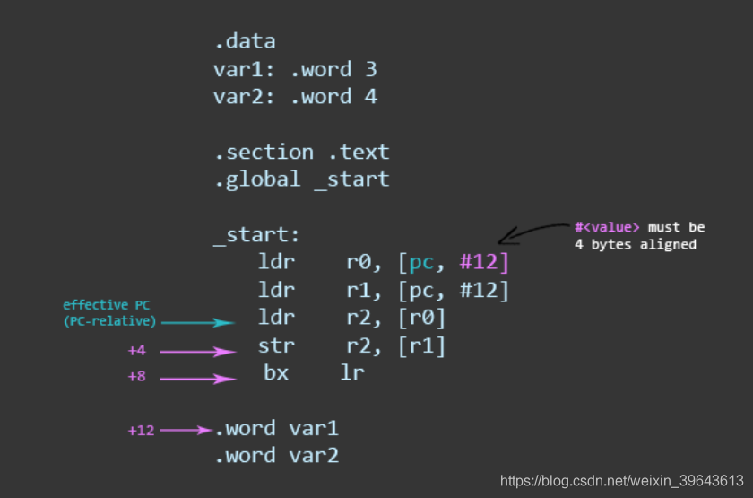

# ARM 汇编基础速成

src:https://www.anquanke.com/post/id/86383


# 1：ARM汇编以及汇编语言基础介绍
## 写在前面
欢迎来到ARM汇编基础教程，这套教程是为了让你可以在ARM架构下进行漏洞利用打基础的。在我们能开始写ARM的shellcode以及构建ROP链之前，我们需要先学习相关的ARM汇编基础知识。

这些基础知识包括：

**Part 1：ARM汇编介绍**

**Part 2：数据类型寄存器**

**Part 3: ARM指令集**

**Part 4: 内存相关指令：加载以及存储**

**Part 5：重复性加载及存储**

**Part 6: 分支和条件执行**

**Part 7：栈以及函数**

为了能跟着这个系列教程动手实践，你可以准备一个ARM的运行环境。如果你没有ARM设备（比如说树莓派或者手机），你可以通过QEMU来创建一个，[教程在这](https://azeria-labs.com/emulate-raspberry-pi-with-qemu/)。如果你对于GDB调试的基础命令不熟悉的话，可以通过[这个]学习。在这篇教程中，我们的核心关注点为32位的ARM，相关的例子在ARMv6下编译。

## 为什么是ARM？
前面说过，本系列教程的核心目的，是为那些想学习在ARM架构下进行漏洞利用的人而准备。可以看看你身边，有多少设备是ARM架构的， 手机，路由器，以及IOT设备，很多都是ARM架构的。无疑ARM架构已经成为了全世界主流而广泛的CPU架构。所以我们面对的越来越多的安全问题，也都会是ARM架构下的，那么在这种架构下的开发以及漏洞利用，也会成为一种主流趋势。

我们在X86架构上进行了很多研究，而ARM可能是最简单的广泛使用的汇编语言。但是人们为什么不关注ARM呢？可能是在intel架构上可供漏洞利用的学习资料比ARM多得多吧。比如[Corelan Team](https://www.corelan.be/index.php/2009/07/19/exploit-writing-tutorial-part-1-stack-based-overflows/)写的很棒的intel X86漏洞利用教程，旨在帮助我们可以更准确更高效的学习到关键的漏洞利用基础知识。如果你对于x86漏洞利用很感兴趣，那我觉得Corelan Team的教程是一个不错的选择。但是在我们这个系列里，我们要创造一本高效的ARM架构下的漏洞利用新手手册。

## ARM VS. INTEL

ARM处理器Intel处理器有很多不同，但是最主要的不同怕是指令集了。Intel属于复杂指令集（CISC）处理器，有很多特性丰富的访问内存的复杂指令集。因此它拥有更多指令代码以及取址都是，但是寄存器比ARM的要少。复杂指令集处理器主要被应用在PC机，工作站以及服务器上。

ARM属于简单指令集（RISC）处理器，所以与复杂指令集先比，只有简单的差不多100条指令集，但会有更多的寄存器。与Intel不同，ARM的指令集仅仅操作寄存器或者是用于从内存的加载/储存过程，这也就是说，简单的加载/存储指令即可访问到内存。这意味着在ARM中，要对特定地址中存储的的32位值加一的话，仅仅需要从内存中加载到寄存器，加一，再从寄存器储存到内存即可。

简单的指令集既有好处也有坏处。一个好处就是代码的执行变得更快了。（RISC指令集允许通过缩短时钟周期来加速代码执行）。坏处就是更少的指令集也要求了编写代码时要更加注意指令间使用的关系以及约束。还有重要的一点，ARM架构有两种模式，ARM模式和Thumb模式。Thumb模式的代码只有2或者4字节。

ARM与X86的不同还体现在：

ARM中很多指令都可以用来做为条件执行的判断依据

X86与X64机器码使用小端格式

ARM机器码在版本3之前是小端。但是之后默认采用大端格式，但可以设置切换到小端。

除了以上这些ARM与Intel间的差异，ARM自身也有很多版本。本系列教程旨在尽力保持通用性的情况下来讲讲ARM的工作流程。而且当你懂得了这个形式，学习其他版本的也很容易了。在系列教程中使用的样例都是在32位的ARMv6下运行的，所以相关解释也是主要依赖这个版本的。

不同版本的ARM命名也是有些复杂：


## 写ARM汇编
在开始用ARM汇编做漏洞利用开发之前，还是需要先学习下基础的汇编语言知识的。为什么我们需要ARM汇编呢，用正常的变成语言写不够么？的确不够，因为如果我们想做逆向工程，或者理解相关二进制程序的执行流程，构建我们自己的ARM架构的shellcode，ROP链，以及调试ARM应用，这些都要求先懂得ARM汇编。当然你也不需要学习的太过深入，足够做逆向工作以及漏洞利用开发刚刚好。如果有些知识要求先了解一些背景知识，别担心，这些知识也会在本系列文章里面介绍到的。当然如果你想学习更多，也可以去本文末尾提供的相关链接学习。

ARM汇编，是一种更容易被人们接受的汇编语言。当然我们的计算机也不能直接运行汇编代码，还是需要编译成机器码的。通过编译工具链中as程序来将文件后缀为".s"的汇编代码编译成机器码。写完汇编代码后，一般保存后缀为".s"的文件，然后你需要用as编译以及用ld链接程序:

```c
$ as program.s -o program.o
$ ld program.o -o program
```

## 汇编语言本质
让我们来看看汇编语言的底层本质。在最底层，只有电路的电信号。信号被格式化成可以变化的高低电平0V(off)或者5V(on)。但是通过电压变化来表述电路状态是繁琐的，所以用0和1来代替高低电平，也就有了二进制格式。由二进制序列组成的组合便是最小的计算机处理器工作单元了，比如下面的这句机器码序列就是例子。

```c
1110 0001 1010 0000 0010 0000 0000 0001
```
看上去不错，但是我们还是不能记住这些组合的含义。所以，我们需要用助记符和缩写来帮助我们记住这些二进制组合。这些助记符一般是连续的三个字母，我们可以用这些助记符作为指令来编写程序。这种程序就叫做汇编语言程序。用以代表一种计算机的机器码的助记符集合就叫做这种计算机汇编语言。因此，汇编语言是人们用来编写程序的最底层语言。同时指令的操作符也有对应的助记符，比如：

```c
MOV R2, R1
```
现在我们知道了汇编程序是助记符的文本信息集合，我们需要将其转换成机器码。就像之前的，在[GNU Binutils](https://www.gnu.org/software/binutils/)工程中提供了叫做as的工具。使用汇编工具去将汇编语言转换成机器码的过程叫做汇编(assembling)。

总结一下，在这篇中我们学习了计算机是通过由0101代表高低电平的机器码序列来进行运算的。我们可以使用机器码去让计算机做我们想让它做的事情。不过因为我们不能记住机器码，我们使用了缩写助记符来代表有相关功能的机器码，这些助记符的集合就是汇编语言。最后我们使用汇编器将汇编语言转换成机器可以理解的机器码。当然，在更高级别的语言编译生成机器码过程中，核心原理也是这个。

## 拓展阅读


1. [Whirlwind Tour of ARM Assembly.](https://www.coranac.com/tonc/text/asm.htm)

2. [ARM assembler in Raspberry Pi.](http://thinkingeek.com/arm-assembler-raspberry-pi/)

3. Practical Reverse Engineering: x86, x64, ARM, Windows Kernel, Reversing Tools, and Obfuscation by Bruce Dang, Alexandre Gazet, Elias Bachaalany and Sebastien Josse.

4. [ARM Reference Manual.](http://infocenter.arm.com/help/topic/com.arm.doc.dui0068b/index.html)

5. [Assembler User Guide.](http://www.keil.com/support/man/docs/armasm/default.htm)

# 2：ARM汇编中的数据类型
## ARM汇编数据类型基础
与高级语言类似，ARM也支持操作不同的数据类型。


被加载或者存储的数据类型可以是无符号（有符号）的字(words，四字节)，半字(halfwords，两字节)，或者字节(bytes)。这些数据类型在汇编语言中的扩展后缀为-h或者-sh对应着半字，-b或者-sb对应着字节，但是对于字并没有对应的扩展。无符号类型与有符号类型的差别是：

符号数据类型可以包含正负数所以数值范围上更低些

无符号数据类型可以放得下很大的正数但是放不了负数

这有一些要求使用对应数据类型做存取操作的汇编指令示例：

```c
ldr = 加载字，宽度四字节
ldrh = 加载无符号的半字，宽度两字节
ldrsh = 加载有符号的半字，宽度两字节
ldrb = 加载无符号的字节
ldrsb = 加载有符号的字节
str = 存储字，宽度四字节
strh = 存储无符号的半字，宽度两字节
strsh = 存储有符号的半字，宽度两字节
strb = 存储无符号的字节
strsb = 存储有符号的字节
```

## 字节序

在内存中有两种字节排布顺序，大端序(BE)或者小端序(LE)。两者的主要不同是对象中的每个字节在内存中的存储顺序存在差异。一般X86中是小端序，最低的字节存储在最低的地址上。在大端机中最高的字节存储在最低的地址上。


在版本3之前，ARM使用的是小端序，但在这之后就都是使用大端序了，但也允许切换回小端序。在我们样例代码所在的ARMv6中，指令代码是以[小端序排列对齐](https://developer.arm.com/documentation/ddi0301/h/Cdfbbchb)。但是数据访问时采取大端序还是小端序使用程序状态寄存器(CPSR)的第9比特位来决定的。


## ARM寄存器

寄存器的数量由ARM版本决定。根据[ARM参考手册]，在ARMv6-M与ARMv7-M的处理器中有30个32bit位宽度的通用寄存器。前16个寄存器是用户层可访问控制的，其他的寄存器在高权限进程中可以访问（但ARMv6-M与ARMv7-M除外）。我们仅介绍可以在任何权限模式下访问的16个寄存器。这16个寄存器分为两组：通用寄存器与有特殊含义的寄存器。


下面这张表是ARM架构与寄存器与Intel架构寄存器的关系：
在这里插入图片描述

R0-R12：用来在通用操作中存储临时的值，指针等。R0被用来存储函数调用的返回值。R7经常被用作存储系统调用号，R11存放着帮助我们找到栈帧边界的指针（之后会讲）。以及，在ARM的函数调用约定中，前四个参数按顺序存放在R0-R3中。

R13：SP(栈指针）。栈指针寄存器用来指向当前的栈顶。栈是一片来存储函数调用中相关数据的内存，在函数返回时会被修改为对应的栈指针。栈指针用来帮助在栈上申请数据空间。比如说你要申请一个字的大小，就会将栈指针减4，再将数据放入之前所指向的位置。

R14：LR(链接寄存器)。当一个函数调用发生，链接寄存器就被用来记录函数调用发生所在位置的下一条指令的地址。这么做允许我们快速的从子函数返回到父函数。

R15：PC(程序计数器)。程序计数器是一个在程序指令执行时自增的计数器。它的大小在ARM模式下总是4字节对齐，在Thumb模式下总是两字节对齐。当执行一个分支指令时，PC存储目的地址。在程序执行中，ARM模式下的PC存储着当前指令加8(两条ARM指令后)的位置，Thumb(v1)模式下的PC存储着当前指令加4(两条Thumb指令后)的位置。这也是X86与ARM在PC上的主要不同之处。

我们可以通过调试来观察PC的行为。我们的程序中将PC的值存到R0中同时包含了两条其他指令，来看看会发生什么。

```c
.section .text
.global _start
_start:
 mov r0, pc
 mov r1, #2
 add r2, r1, r1
 bkpt
```

在GDB中，我们开始调试这段汇编代码：

```c
gef> br _start
Breakpoint 1 at 0x8054
gef> run
```
在开始执行触发断点后，首先会在GDB中看到:

```c
$r0 0x00000000   $r1 0x00000000   $r2 0x00000000   $r3 0x00000000 
$r4 0x00000000   $r5 0x00000000   $r6 0x00000000   $r7 0x00000000 
$r8 0x00000000   $r9 0x00000000   $r10 0x00000000  $r11 0x00000000 
$r12 0x00000000  $sp 0xbefff7e0   $lr 0x00000000   $pc 0x00008054 
$cpsr 0x00000010 
0x8054 <_start> mov r0, pc     <- $pc
0x8058 <_start+4> mov r0, #2
0x805c <_start+8> add r1, r0, r0
0x8060 <_start+12> bkpt 0x0000
0x8064 andeq r1, r0, r1, asr #10
0x8068 cmnvs r5, r0, lsl #2
0x806c tsteq r0, r2, ror #18
0x8070 andeq r0, r0, r11
0x8074 tsteq r8, r6, lsl #6
```
可以看到在程序的开始PC指向0x8054这个位置即第一条要被执行的指令，那么此时我们使用GDB命令si，执行下一条机器码。下一条指令是把PC的值放到R0寄存器中，所以应该是0x8054么？来看看调试器的结果。

```c
$r0 0x0000805c   $r1 0x00000000   $r2 0x00000000   $r3 0x00000000 
$r4 0x00000000   $r5 0x00000000   $r6 0x00000000   $r7 0x00000000 
$r8 0x00000000   $r9 0x00000000   $r10 0x00000000  $r11 0x00000000 
$r12 0x00000000  $sp 0xbefff7e0   $lr 0x00000000   $pc 0x00008058 
$cpsr 0x00000010
0x8058 <_start+4> mov r0, #2       <- $pc
0x805c <_start+8> add r1, r0, r0
0x8060 <_start+12> bkpt 0x0000
0x8064 andeq r1, r0, r1, asr #10
0x8068 cmnvs r5, r0, lsl #2
0x806c tsteq r0, r2, ror #18
0x8070 andeq r0, r0, r11
0x8074 tsteq r8, r6, lsl #6
0x8078 adfcssp f0, f0, #4.0
```

当然不是，在执行0x8054这条位置的机器码时，PC已经读到了两条指令后的位置也就是0x805c(见R0寄存器)。所以我们以为直接读取PC寄存器的值时，它指向的是下一条指令的位置。但是调试器告诉我们，PC指向当前指令向后两条机器码的位置。这是因为早期的ARM处理器总是会先获取当前位置后两条的机器码。这么做的原因也是确保与早期处理器的兼容性。

## 当前程序状态寄存器（CPSR）

当你用GDB调试ARM程序的的时候你能会可以看见Flags这一栏（GDB配置插件GEF后就可以看见了，或者直接在GDB里面输入flags也可以）。


图中寄存器“`$CSPR“`显示了当前状态寄存器的值，Flags里面出现的thumb，fast，interrupt，overflow，carry，zero，negative就是来源于CSPR寄存器中对应比特位的值。ARM架构的N，Z，C，V与X86架构EFLAG中的SF，ZF，CF，OF相对应。这些比特位在汇编级别的条件执行或者循环的跳出时，被用作判断的依据。


上图展示了32位的CPSR寄存器的比特位含义，左边是最大比特位，右边是最小比特位。每个单元代表一个比特。这一个个比特的含义都很丰富：


假设我们用CMP指令去比较1和2，结果会是一个负数因为1-2=-1。然而当我们反过来用2和1比较，C位将被设定，因为在一个较大的数上减了较小的数，没有发生借位。当我们比较两个相同的数比如2和2时，由于结果是0，Z标志位将被置一。注意CMP指令中被使用的寄存器的值并不会被修改，其计算结果仅仅影响到CPSR寄存器中的状态位。

在开了GEF插件的GDB中，计算结果如下图：在这里我们比较的两个寄存器是R1和R0，所以执行后的flag状态如下图。


Carry位Flag被设置的原因是CMP R1,R0会去拿4和2做比较。因为我们用以个较大的数字去减一个较少的数字，没有发生借位。Carry位便被置1。相反的，如果是CMP R0,R1那么Negative位会被置一。

# 3：ARM模式与THUMB模式
ARM处理器有两个主要的操作状态，ARM模式以及Thumb模式(Jazelle模式先不考虑)。这些模式与特权模式并不冲突。SVC模式既可以在ARM下调用也可以在Thumb下调用。只不过两种状态的主要不同是指令集的不同，ARM模式的指令集宽度是32位而Thumb是16位宽度(但也可以是32位)。知道何时以及如何使用Thumb模式对于ARM漏洞利用的开发尤其重要。当我们写ARM的shellcode时候，我们需要尽可能的少用NULL以及使用16位宽度的Thumb指令以精简代码。

不同版本ARM，其调用约定不完全相同，而且支持的Thumb指令集也是不完全相同。在某些版本山，ARM提出了扩展型Thumb指令集(也叫Thumbv2)，允许执行32位宽的Thumb指令以及之前版本不支持的条件执行。为了在Thumb模式下使用条件执行指令，Thumb提出了"IT"分支指令。然而，这条指令在之后的版本又被更改移除了，说是为了让一些事情变得更加简单方便。我并不清楚各个版本的ARM架构所支持的具体的ARM/Thumb指令集，而且我也的确不想知道。我觉得你也应该不用深究这个问题。因为你只需要知道你设备上的关键ARM版本所支持的Thumb指令集就可以了。以及ARM信息中心可以帮你弄清楚你的ARM版本到底是多少。

就像之前说到的，Thumb也有很多不同的版本。不过不同的名字仅仅是为了区分不同版本的Thumb指令集而已(也就是对于处理器来说，这些指令永远都是Thumb指令)。

**Thumb-1(16位宽指令集)**：在ARMv6以及更早期的版本上使用。

**Thumb-2(16位/32位宽指令集)**：在Thumb-1基础上扩展的更多的指令集(在ARMv6T2以及ARMv7即很多32位Android手机所支持的架构上使用)

**Thumb-EE**：包括一些改变以及对于动态生成代码的补充(即那些在设备上执行前或者运行时编译的代码)

## ARM与Thumb的不同之处

**对于条件执行指令（不是条件跳转指令）：** 所有的ARM状态指令都支持条件执行。一些版本的ARM处理器上允许在Thumb模式下通过IT汇编指令进行条件执行。条件执行减少了要被执行的指令数量，以及用来做分支跳转的语句，所以具有更高的代码密度。

**ARM模式与Thumb模式的32位指令：** Thumb的32位汇编指令都有类似于a.w的扩展后缀。

桶型移位是另一种独特的ARM模式特性。它可以被用来减少指令数量。比如说，为了减少使用乘法所需的两条指令(乘法操作需要先乘2然后再把结果用MOV存储到另一个寄存器中)，就可以使用在MOV中自带移位乘法操作的左移指令(Mov R1, R0, LSL #1)。

在ARM模式与Thumb模式间切换的话，以下两个条件之一必须满足：

我们可以在使用分支跳转指令BX(branch and exchange)或者分支链接跳转指令BLX(branch,link and exchange)时，将目的寄存器的最低位置为1。之后的代码执行就会在Thumb模式下进行。你也许会好奇这样做目标跳转地址不就有对齐问题了么，因为代码都是2字节或者4字节对齐的？但事实上这并不会造成问题，因为处理器会直接忽略最低比特位的标识。更多的细节我们会在第6篇中解释。

我们之前有说过，在CPSR当前程序状态寄存器中，T标志位用来代表当前程序是不是在Thumb模式下运行的。

## ARM指令集规律含义

这一节的目的是简要的介绍ARM的通用指令集。知道每一句汇编指令是怎么操作使用，相互关联，最终组成程序是很重要的。之前说过，汇编语言是由构建机器码块的指令组成。所以ARM指令通常由助记符外加一到两个跟在后面的操作符组成，如下面的模板所示：

```c
MNEMONIC{S}{condition} {Rd}, Operand1, Operand2
助记符{是否使用CPSR}{是否条件执行以及条件} {目的寄存器}, 操作符1, 操作符2
```
由于ARM指令的灵活性，不是全部的指令都满足这个模板，不过大部分都满足了。下面来说说模板中的含义:

```c
MNEMONIC     - 指令的助记符如ADD
{S}          - 可选的扩展位，如果指令后加了S，则需要依据计算结果更新CPSR寄存器中的条件跳转相关的FLAG
{condition}  - 如果机器码要被条件执行，那它需要满足的条件标示
{Rd}         - 存储结果的目的寄存器
Operand1     - 第一个操作数，寄存器或者是一个立即数
Operand2     - 第二个(可变的)操作数，可以是一个立即数或者寄存器或者有偏移量的寄存器
```
当助记符，S，目的寄存器以及第一个操作数都被声明的时候，条件执行以及第二操作数需要一些声明。因为条件执行是依赖于CPSR寄存器的值的，更精确的说是寄存器中的一些比特位。第二操作数是一个可变操作数，因为我们可以以各种形式来使用它，立即数，寄存器，或者有偏移量的寄存器。举例来说，第二操作数还有如下操作：

```c
#123                    - 立即数
Rx                      - 寄存器比如R1
Rx, ASR n               - 对寄存器中的值进行算术右移n位后的值
Rx, LSL n               - 对寄存器中的值进行逻辑左移n位后的值
Rx, LSR n               - 对寄存器中的值进行逻辑右移n位后的值
Rx, ROR n               - 对寄存器中的值进行循环右移n位后的值
Rx, RRX                 - 对寄存器中的值进行带扩展的循环右移1位后的值
```
在知道了这个机器码模板后，然我们试着去理解这些指令：

```c
ADD   R0, R1, R2         - 将第一操作数R1的内容与第二操作数R2的内容相加，将结果存储到R0中。
ADD   R0, R1, #2         - 将第一操作数R1的内容与第二操作数一个立即数相加，将结果存到R0中
MOVLE R0, #5             - 当满足条件LE(Less and Equal,小于等于0)将第二操作数立即数5移动到R0中,注意这条指令与MOVLE R0, R0, #5相同
MOV   R0, R1, LSL #1     - 将第二操作数R1寄存器中的值逻辑左移1位后存入R0
```
最后我们总结一下，满足这个模板的一些通用ARM指令集以及其含义:


# 4：ARM汇编内存访问相关指令

ARM使用加载-存储模式控制对内存的访问，这意味着只有加载/存储(LDR或者STR)才能访问内存。尽管X86中允许很多指令直接操作在内存中的数据，但ARM中依然要求在操作数据前，必须先从内存中将数据取出来。这就意味着如果要增加一个32位的在内存中的值，需要做三种类型的操作(加载，加一，存储)将数据从内存中取到寄存器，对寄存器中的值加一，再将结果放回到内存中。

为了解释ARM架构中的加载和存储机制，我们准备了一个基础的例子以及附加在这个基础例子上的三种不同的对内存地址的便宜访问形式。每个例子除了STR/LDR的偏移模式不同外，其余的都一样。而且这个例子很简单，最佳的实践方式是用GDB去调试这段汇编代码。

第一种偏移形式：立即数作为偏移

地址模式：用作偏移

地址模式：前向索引

地址模式：后向索引

第二种偏移形式：寄存器作为偏移

地址模式：用作偏移

地址模式：前向索引

地址模式：后向索引

第三种偏移形式：寄存器缩放值作为偏移

地址模式：用作偏移

地址模式：前向索引

地址模式：后向索引

## 基础样例代码

通常，LDR被用来从内存中加载数据到寄存器，STR被用作将寄存器的值存放到内存中。


```c
LDR R2, [R0]   @ [R0] - 数据源地址来自于R0指向的内存地址
@ LDR操作：从R0指向的地址中取值放到R2中
STR R2, [R1]   @ [R1] - 目的地址来自于R1在内存中指向的地址
@ STR操作：将R2中的值放到R1指向的地址中
```

样例程序的汇编代码及解释如下：

```c
.data          /* 数据段是在内存中动态创建的，所以它的在内存中的地址不可预测*/
var1: .word 3  /* 内存中的第一个变量 */
var2: .word 4  /* 内存中的第二个变量 */
.text          /* 代码段开始 */ 
.global _start
_start:
    ldr r0, adr_var1  @ 将存放var1值的地址adr_var1加载到寄存器R0中 
    ldr r1, adr_var2  @ 将存放var2值的地址adr_var2加载到寄存器R1中 
    ldr r2, [r0]      @ 将R0所指向地址中存放的0x3加载到寄存器R2中  
    str r2, [r1]      @ 将R2中的值0x3存放到R1做指向的地址 
    bkpt             
adr_var1: .word var1  /* var1的地址助记符 */
adr_var2: .word var2  /* var2的地址助记符 */
```
在底部我们有我们的文字标识池(在代码段中用来存储常量，字符串，或者偏移等的内存，可以通过位置无关的方式引用)，分别用adr_var1和adr_var2存储着变量var1和var2的内存地址(var1和var2的值在数据段定义)。第一条LDR指令将变量var1的地址加载到寄存器R0。第二条LDR指令同样将var2的地址加载到寄存器R1。之后我们将存储在R0指向的内存地址中的值加载到R2，最后将R2中的值存储到R1指向的内存地址中。

当我们加载数据到寄存器时，方括号“[]”意味着：将其中的值当做内存地址，并取这个内存地址中的值加载到对应寄存器。

当我们存储数据到内存时，方括号“[]”意味着：将其中的值当做内存地址，并向这个内存地址所指向的位置存入对应的值。

听者好像有些抽象，所以再来看看这个动画吧：


同样的再来看看的这段代码在调试器中的样子。

```c
gef> disassemble _start
Dump of assembler code for function _start:
 0x00008074 <+0>:      ldr  r0, [pc, #12]   ; 0x8088 <adr_var1>
 0x00008078 <+4>:      ldr  r1, [pc, #12]   ; 0x808c <adr_var2>
 0x0000807c <+8>:      ldr  r2, [r0]
 0x00008080 <+12>:     str  r2, [r1]
 0x00008084 <+16>:     bx   lr
End of assembler dump.
```
可以看到此时的反汇编代码和我们编写的汇编代码有出入了。前两个LDR操作的源寄存器被改成了[pc,#12]。这种操作叫做PC相对地址。因为我们在汇编代码中使用的只是数据的标签，所以在编译时候编译器帮我们计算出来了与我们想访问的文字标识池的相对便宜，即PC+12。你也可以看汇编代码中手动计算验证这个偏移是正确的，以adr_var1为例，执行到8074时，其当前有效PC与数据段还有三个四字节的距离，所以要加12。关于PC相对取址我们接下来还会接着介绍。

PS：如果你对这里的PC的地址有疑问，可以看外面第二篇关于程序执行时PC的值的说明，PC是指向当前执行指令之后第二条指令所在位置的，在32位ARM模式下是当前执行位置加偏移值8，在Thumb模式下是加偏移值4。这也是与X86架构PC的区别之所在。




## 第一种偏移形式：立即数作偏移

```c
STR    Ra, [Rb, imm]
LDR    Ra, [Rc, imm]
```

在这段汇编代码中，我们使用立即数作为偏移量。这个立即数被用来与一个寄存器中存放的地址做加减操作(下面例子中的R1)，以访问对应地址偏移处的数据。

```c
.data
var1: .word 3
var2: .word 4
.text
.global _start
_start:
    ldr r0, adr_var1  @ 将存放var1值的地址adr_var1加载到寄存器R0中 
    ldr r1, adr_var2  @ 将存放var2值的地址adr_var2加载到寄存器R1中 
    ldr r2, [r0]      @ 将R0所指向地址中存放的0x3加载到寄存器R2中  
    str r2, [r1, #2]  @ 取址模式：基于偏移量。R2寄存器中的值0x3被存放到R1寄存器的值加2所指向地址处。
    str r2, [r1, #4]! @ 取址模式：基于索引前置修改。R2寄存器中的值0x3被存放到R1寄存器的值加4所指向地址处，之后R1寄存器中存储的值加4,也就是R1=R1+4。
    ldr r3, [r1], #4  @ 取址模式：基于索引后置修改。R3寄存器中的值是从R1寄存器的值所指向的地址中加载的，加载之后R1寄存器中存储的值加4,也就是R1=R1+4。
    bkpt
adr_var1: .word var1
adr_var2: .word var2
```

让我们把上面的这段汇编代码编译一下，并用GDB调试起来看看真实情况。

```c
$ as ldr.s -o ldr.o
$ ld ldr.o -o ldr
$ gdb ldr
```

在GDB(使用GEF插件)中，我们对_start下一个断点并继续运行程序。

```c
gef> break _start
gef> run
...
gef> nexti 3     /* 向后执行三条指令 */
```
执行完上述GDB指令后，在我的系统的寄存器的值现在是这个样子(在你的系统里面可能不同)：

```c
$r0 : 0x00010098 -> 0x00000003
$r1 : 0x0001009c -> 0x00000004
$r2 : 0x00000003
$r3 : 0x00000000
$r4 : 0x00000000
$r5 : 0x00000000
$r6 : 0x00000000
$r7 : 0x00000000
$r8 : 0x00000000
$r9 : 0x00000000
$r10 : 0x00000000
$r11 : 0x00000000
$r12 : 0x00000000
$sp : 0xbefff7e0 -> 0x00000001
$lr : 0x00000000
$pc : 0x00010080 -> <_start+12> str r2, [r1]
$cpsr : 0x00000010
```
下面来分别调试这三条关键指令。首先执行基于地址偏移的取址模式的STR操作了。就会将R2(0x00000003)中的值存放到R1(0x0001009c)所指向地址偏移2的位置0x1009e。下面一段是执行完对应STR操作后对应内存位置的值。

```c
gef> nexti
gef> x/w 0x1009e 
0x1009e <var2+2>: 0x3
```
下一条STR操作使用了基于索引前置修改的取址模式。这种模式的识别特征是(!)。区别是在R2中的值被存放到对应地址后，R1的值也会被更新。这意味着，当我们将R2中的值0x3存储到R1(0x1009c)的偏移4之后的地址0x100A0后，R1的值也会被更新到为这个地址。下面一段是执行完对应STR操作后对应内存位置以及寄存器的值。

```c
gef> nexti
gef> x/w 0x100A0
0x100a0: 0x3
gef> info register r1
r1     0x100a0     65696
```
最后一个LDR操作使用了基于索引后置的取址模式。这意味着基础寄存器R1被用作加载的内存地址，之后R1的值被更新为R1+4。换句话说，加载的是R1所指向的地址而不是R1+4所指向的地址，也就是0x100A0中的值被加载到R3寄存器，然后R1寄存器的值被更新为0x100A0+0x4也就是0x100A4。下面一段是执行完对应LDR操作后对应内存位置以及寄存器的值。

```c
gef> info register r1
r1      0x100a4   65700
gef> info register r3
r3      0x3       3
```
下图是这个操作发生的动态示意图。


## 第二种偏移形式：寄存器作偏移

```c
STR    Ra, [Rb, Rc]
LDR    Ra, [Rb, Rc]
```
在这个偏移模式中，寄存器的值被用作偏移。下面的样例代码展示了当试着访问数组的时候是如何计算索引值的。

```c
.data
var1: .word 3
var2: .word 4
.text
.global _start
_start:
    ldr r0, adr_var1  @ 将存放var1值的地址adr_var1加载到寄存器R0中 
    ldr r1, adr_var2  @ 将存放var2值的地址adr_var2加载到寄存器R1中 
    ldr r2, [r0]      @ 将R0所指向地址中存放的0x3加载到寄存器R2中  
    str r2, [r1, r2]  @ 取址模式：基于偏移量。R2寄存器中的值0x3被存放到R1寄存器的值加R2寄存器的值所指向地址处。R1寄存器不会被修改。 
    str r2, [r1, r2]! @ 取址模式：基于索引前置修改。R2寄存器中的值0x3被存放到R1寄存器的值加R2寄存器的值所指向地址处，之后R1寄存器中的值被更新,也就是R1=R1+R2。
    ldr r3, [r1], r2  @ 取址模式：基于索引后置修改。R3寄存器中的值是从R1寄存器的值所指向的地址中加载的，加载之后R1寄存器中的值被更新也就是R1=R1+R2。
    bx lr
adr_var1: .word var1
adr_var2: .word var2
```
下面来分别调试这三条关键指令。在执行完基于偏移量的取址模式的STR操作后，R2的值被存在了地址0x1009c + 0x3 = 0x1009F处。下面一段是执行完对应STR操作后对应内存位置的值。

```c
gef> x/w 0x0001009F
 0x1009f <var2+3>: 0x00000003
```
下一条STR操作使用了基于索引前置修改的取址模式，R1的值被更新为R1+R2的值。下面一段是执行完对应STR操作后寄存器的值。

```c
gef> info register r1
 r1     0x1009f      65695
```
最后一个LDR操作使用了基于索引后置的取址模式。将R1指向的值加载到R2之后，更新了R1寄存器的值(R1+R2 = 0x1009f + 0x3 = 0x100a2)。下面一段是执行完对应LDR操作后对应内存位置以及寄存器的值。

```c
gef> info register r1
 r1      0x100a2     65698
gef> info register r3
 r3      0x3       3
```
下图是这个操作发生的动态示意图。

## 第三种偏移形式：寄存器缩放值作偏移

```c
LDR    Ra, [Rb, Rc, <shifter>]
STR    Ra, [Rb, Rc, <shifter>]
```

在这种偏移形式下，第三个偏移量还有一个寄存器做支持。Rb是基址寄存器，Rc中的值作为偏移量，或者是要被左移或右移的次的值。这意味着移位器shifter被用来用作缩放Rc寄存器中存放的偏移量。下面的样例代码展示了对一个数组的循环操作。同样的，我们也会用GDB调试这段代码。

```c
.data
var1: .word 3
var2: .word 4
.text
.global _start
_start:
    ldr r0, adr_var1         @ 将存放var1值的地址adr_var1加载到寄存器R0中 
    ldr r1, adr_var2         @ 将存放var2值的地址adr_var2加载到寄存器R1中 
    ldr r2, [r0]             @ 将R0所指向地址中存放的0x3加载到寄存器R2中  
    str r2, [r1, r2, LSL#2]  @ 取址模式：基于偏移量。R2寄存器中的值0x3被存放到R1寄存器的值加(左移两位后的R2寄存器的值)所指向地址处。R1寄存器不会被修改。
    str r2, [r1, r2, LSL#2]! @ 取址模式：基于索引前置修改。R2寄存器中的值0x3被存放到R1寄存器的值加(左移两位后的R2寄存器的值)所指向地址处，之后R1寄存器中的值被更新,也就R1 = R1 + R2<<2。
    ldr r3, [r1], r2, LSL#2  @ 取址模式：基于索引后置修改。R3寄存器中的值是从R1寄存器的值所指向的地址中加载的，加载之后R1寄存器中的值被更新也就是R1 = R1 + R2<<2。
    bkpt
adr_var1: .word var1
adr_var2: .word var2
```
下面来分别调试这三条关键指令。在执行完基于偏移量的取址模式的STR操作后，R2被存储到的位置是[r1,r2,LSL#2]，也就是说被存储到R1+(R2<<2)的位置了，如下图所示。

下一条STR操作使用了基于索引前置修改的取址模式，R1的值被更新为R1+(R2<<2)的值。下面一段是执行完对应STR操作后寄存器的值。

```c
gef> info register r1
r1      0x100a8      65704
```
最后一个LDR操作使用了基于索引后置的取址模式。将R1指向的值加载到R2之后，更新了R1寄存器的值(R1+R2 = 0x100a8 + (0x3<<2) = 0x100b4)。下面一段是执行完对应LDR操作后寄存器的值。

```c
gef> info register r1
r1      0x100b4      65716
```
## 小结
LDR/STR的三种偏移模式：

立即数作为偏移

```c
ldr   r3, [r1, #4]
```

寄存器作为偏移

```c
ldr   r3, [r1, r2]
```

寄存器缩放值作为偏移

```c
ldr   r3, [r1, r2, LSL#2]
```

如何区分取址模式：

如果有一个叹号!，那就是索引前置取址模式，即使用计算后的地址，之后更新基址寄存器。

```c
ldr   r3, [r1, #4]!
ldr   r3, [r1, r2]!
ldr   r3, [r1, r2, LSL#2]!
```

如果在[]外有一个寄存器，那就是索引后置取址模式，即使用原有基址寄存器重的地址，之后再更新基址寄存器


```c
ldr   r3, [r1], #4
ldr   r3, [r1], r2
ldr   r3, [r1], r2, LSL#2
```

除此之外，就都是偏移取址模式了


```c
ldr   r3, [r1, #4]
ldr   r3, [r1, r2]
ldr   r3, [r1, r2, LSL#2]
```

地址模式：用作偏移

地址模式：前向索引

地址模式：后向索引

## 关于PC相对取址的LDR指令

有时候LDR并不仅仅被用来从内存中加载数据。还有如下这操作:


```c
.section .text
.global _start
_start:
   ldr r0, =jump        /* 加载jump标签所在的内存位置到R0 */
   ldr r1, =0x68DB00AD  /* 加载立即数0x68DB00AD到R1 */
jump:
   ldr r2, =511         /* 加载立即数511到R2 */ 
   bkpt
```

这些指令学术上被称作伪指令。但我们在编写ARM汇编时可以用这种格式的指令去引用我们文字标识池中的数据。在上面的例子中我们用一条指令将一个32位的常量值放到了一个寄存器中。为什么我们会这么写是因为ARM每次仅仅能加载8位的值，原因倾听我解释立即数在ARM架构下的处理。

## 在ARM中使用立即数的规律

是的，在ARM中不能像X86那样直接将立即数加载到寄存器中。因为你使用的立即数是受限的。这些限制听上去有些无聊。但是听我说，这也是为了告诉你绕过这些限制的技巧(通过LDR)。

我们都知道每条ARM指令的宽度是32位，所有的指令都是可以条件执行的。我们有16中条件可以使用而且每个条件在机器码中的占位都是4位。之后我们需要2位来做为目的寄存器。2位作为第一操作寄存器，1位用作设置状态的标记位，再加上比如操作码(opcode)这些的占位。最后每条指令留给我们存放立即数的空间只有12位宽。也就是4096个不同的值。

这也就意味着ARM在使用MOV指令时所能操作的立即数值范围是有限的。那如果很大的话，只能拆分成多个部分外加移位操作拼接了。

所以这剩下的12位可以再次划分，8位用作加载0-255中的任意值，4位用作对这个值做0~30位的循环右移。这也就意味着这个立即数可以通过这个公式得到：v = n ror 2*r。换句话说，有效的立即数都可以通过循环右移来得到。这里有一个例子

有效值:

```c
#256        // 1 循环右移 24位 --> 256
#384        // 6 循环右移 26位 --> 384
#484        // 121 循环右移 30位 --> 484
#16384      // 1 循环右移 18位 --> 16384
#2030043136 // 121 循环右移 8位 --> 2030043136
#0x06000000 // 6 循环右移 8位 --> 100663296 (十六进制值0x06000000)
Invalid values:
#370        // 185 循环右移 31位 --> 31不在范围内 (0 – 30)
#511        // 1 1111 1111 --> 比特模型不符合
#0x06010000 // 1 1000 0001.. --> 比特模型不符合
```
看上去这样并不能一次性加载所有的32位值。不过我们可以通过以下的两个选项来解决这个问题：

用小部分去组成更大的值。

比如对于指令 MOV r0, #511

将511分成两部分：MOV r0, #256, and ADD r0, #255

用加载指令构造‘ldr r1,=value’的形式，编译器会帮你转换成MOV的形式，如果失败的话就转换成从数据段中通过PC相对偏移加载。

```c
LDR r1, =511
```
如果你尝试加载一个非法的值，编译器会报错并且告诉你 invalid constant。如果在遇到这个问题，你现在应该知道该怎么解决了吧。唉还是举个栗子，就比如你想把511加载到R0。

```c
.section .text
.global _start
_start:
    mov     r0, #511
    bkpt
```
这样做的结果就是编译报错:

```c
azeria@labs:~$ as test.s -o test.o
test.s: Assembler messages:
test.s:5: Error: invalid constant (1ff) after fixup
```
你需要将511分成多部分，或者直接用LDR指令。

```c
.section .text
.global _start
_start:
 mov r0, #256   /* 1 ror 24 = 256, so it's valid */
 add r0, #255   /* 255 ror 0 = 255, valid. r0 = 256 + 255 = 511 */
 ldr r1, =511   /* load 511 from the literal pool using LDR */
 bkpt
```
如果你想知道你能用的立即数的有效值，你不需要自己计算。我这有个小脚本，看你骨骼惊奇，传给你呦 [rotator.py](https://raw.githubusercontent.com/azeria-labs/rotator/master/rotator.py)。用法如下。

```c
azeria@labs:~$ python rotator.py
Enter the value you want to check: 511
Sorry, 511 cannot be used as an immediate number and has to be split.
azeria@labs:~$ python rotator.py
Enter the value you want to check: 256
The number 256 can be used as a valid immediate number.
1 ror 24 --> 256
```

# 5：连续存取

连续加载/存储

有时连续加载(存储)会显得更加高效。因为我们可以使用LDM(load multiple)以及STM(store multiple)。这些指令基于起始地址的不同，有不同的形式。下面是我们会在这一节用到的相关代码。在下文中会详细讲解。


```c
.data
array_buff:
 .word 0x00000000             /* array_buff[0] */
 .word 0x00000000             /* array_buff[1] */
 .word 0x00000000             /* array_buff[2]. 这一项存的是指向array_buff+8的指针 */
 .word 0x00000000             /* array_buff[3] */
 .word 0x00000000             /* array_buff[4] */
.text
.global main
main:
 adr r0, words+12             /* words[3]的地址 -> r0 */
 ldr r1, array_buff_bridge    /* array_buff[0]的地址 -> r1 */
 ldr r2, array_buff_bridge+4  /* array_buff[2]的地址 -> r2 */
 ldm r0, {r4,r5}              /* words[3] -> r4 = 0x03; words[4] -> r5 = 0x04 */
 stm r1, {r4,r5}              /* r4 -> array_buff[0] = 0x03; r5 -> array_buff[1] = 0x04 */
 ldmia r0, {r4-r6}            /* words[3] -> r4 = 0x03, words[4] -> r5 = 0x04; words[5] -> r6 = 0x05; */
 stmia r1, {r4-r6}            /* r4 -> array_buff[0] = 0x03; r5 -> array_buff[1] = 0x04; r6 -> array_buff[2] = 0x05 */
 ldmib r0, {r4-r6}            /* words[4] -> r4 = 0x04; words[5] -> r5 = 0x05; words[6] -> r6 = 0x06 */
 stmib r1, {r4-r6}            /* r4 -> array_buff[1] = 0x04; r5 -> array_buff[2] = 0x05; r6 -> array_buff[3] = 0x06 */
 ldmda r0, {r4-r6}            /* words[3] -> r6 = 0x03; words[2] -> r5 = 0x02; words[1] -> r4 = 0x01 */
 ldmdb r0, {r4-r6}            /* words[2] -> r6 = 0x02; words[1] -> r5 = 0x01; words[0] -> r4 = 0x00 */
 stmda r2, {r4-r6}            /* r6 -> array_buff[2] = 0x02; r5 -> array_buff[1] = 0x01; r4 -> array_buff[0] = 0x00 */
 stmdb r2, {r4-r5}            /* r5 -> array_buff[1] = 0x01; r4 -> array_buff[0] = 0x00; */
 bx lr
words:
 .word 0x00000000             /* words[0] */
 .word 0x00000001             /* words[1] */
 .word 0x00000002             /* words[2] */
 .word 0x00000003             /* words[3] */
 .word 0x00000004             /* words[4] */
 .word 0x00000005             /* words[5] */
 .word 0x00000006             /* words[6] */
array_buff_bridge:
 .word array_buff             /* array_buff的地址*/
 .word array_buff+8           /* array_buff[2]的地址 */
```

在开始前，再深化一个概念，就是.word标识是对内存中长度为32位的数据块作引用。这对于理解代码中的偏移量很重要。所以程序中由.data段组成的数据，内存中会申请一个长度为5的4字节数组array_buff。我们的所有内存存储操作，都是针对这段内存中的数据段做读写的。而.text端包含着我们对内存操作的代码以及只读的两个标签，一个标签是含有七个元素的数组，另一个是为了链接.text段和.data段所存在的对于array_buff的引用。下面就开始一行行的分析了！

```c
adr r0, words+12             /* words[3]的地址 -> r0 */
```

我们用ADR指令来获得words[3]的地址，并存到R0中。我们选了一个中间的位置是因为一会要做向前以及向后的操作。


```c
gef> break _start 
gef> run
gef> nexti
```

R0当前就存着words[3]的地址了，也就是0x80B8。也就是说，我们的数组word[0]的地址是:0x80AC(0x80B8-0XC)。


```c
gef> x/7w 0x00080AC
0x80ac <words>: 0x00000000 0x00000001 0x00000002 0x00000003
0x80bc <words+16>: 0x00000004 0x00000005 0x00000006
```

接下来我们把R1和R2指向array_buff[0]以及array_buff[2]。在获取了这些指针后，我们就可以操作这个数组了。


```c
ldr r1, array_buff_bridge    /* array_buff[0]的地址 -> r1 */
ldr r2, array_buff_bridge+4  /* array_buff[2]的地址 -> r2 */
```

执行完上面这两条指令后，R1和R2的变化。


```c
gef> info register r1 r2
r1      0x100d0     65744
r2      0x100d8     65752
```

下一条LDM指令从R0指向的内存中加载了两个字的数据。因为R0指向words[3]的起始处，所以words[3]的值赋给R4，words[4]的值赋给R5。

```c
ldm r0, {r4,r5}              /* words[3] -> r4 = 0x03; words[4] -> r5 = 0x04 */
```

所以我们用一条指令加载了两个数据块，并且放到了R4和R5中。


```c
gef> info registers r4 r5
r4      0x3      3
r5      0x4      4
```

看上去不错，再来看看STM指令。STM指令将R4与R5中的值0x3和0x4存储到R1指向的内存中。这里R1指向的是array_buff[0]，也就是说 array_buff[0] = 0x00000003以及array_buff[1] = 0x00000004。如不特定指定，LDM与STM指令操作的最小单位都是一个字(四字节)。

```c
stm r1, {r4,r5}              /* r4 -> array_buff[0] = 0x03; r5 -> array_buff[1] = 0x04 */
```

值0x3与0x4被存储到了R1指向的地方0x100D0以及0x100D4。


```c
gef> x/2w 0x000100D0
0x100d0 <array_buff>:  0x00000003   0x00000004
```

之前说过LDM和STM有多种形式。不同形式的扩展字符和含义都不同：


```c
IA(increase after)
IB(increase before)
DA(decrease after)
DB(decrease before)
```

这些扩展划分的主要依据是，作为源地址或者目的地址的指针是在访问内存前增减，还是访问内存后增减。以及，LDM与LDMIA功能相同，都是在加载操作完成后访问对地址增加的。通过这种方式，我们可以序列化的向前或者向后从一个指针指向的内存加载数据到寄存器，或者存放数据到内存。如下示意代码 。


```c
ldmia r0, {r4-r6} /* words[3] -> r4 = 0x03, words[4] -> r5 = 0x04; words[5] -> r6 = 0x05; */ 
stmia r1, {r4-r6} /* r4 -> array_buff[0] = 0x03; r5 -> array_buff[1] = 0x04; r6 -> array_buff[2] = 0x05 */
```

在执行完这两条代码后，R4到R6寄存器所访问的内存地址以及存取的值是0x000100D0，0x000100D4，以及0x000100D8，值对应是 0x3，0x4，以及0x5。


```c
gef> info registers r4 r5 r6
r4     0x3     3
r5     0x4     4
r6     0x5     5
gef> x/3w 0x000100D0
0x100d0 <array_buff>: 0x00000003  0x00000004  0x00000005
```

而LDMIB指令会首先对指向的地址先加4，然后再加载数据到寄存器中。所以第一次加载的时候也会对指针加4，所以存入寄存器的是0X4(words[4])而不是0x3(words[3])。


```c
dmib r0, {r4-r6}            /* words[4] -> r4 = 0x04; words[5] -> r5 = 0x05; words[6] -> r6 = 0x06 */
stmib r1, {r4-r6}            /* r4 -> array_buff[1] = 0x04; r5 -> array_buff[2] = 0x05; r6 -> array_buff[3] = 0x06 */
```

执行后的调试示意:


```c
gef> x/3w 0x100D4
0x100d4 <array_buff+4>: 0x00000004  0x00000005  0x00000006
gef> info register r4 r5 r6
r4     0x4    4
r5     0x5    5
r6     0x6    6
```

当用LDMDA指令时，执行的就是反向操作了。R0指向words[3]，当加载数据时数据的加载方向变成加载words[3]，words[2]，words[1]的值到R6，R5，R4中。这种加载流程发生的原因是我们LDM指令的后缀是DA，也就是在加载操作完成后，会将指针做递减的操作。注意在做减法模式下的寄存器的操作是反向的，这么设定的原因为了保持让编号大的寄存器访问高地址的内存的原则。

多次加载，后置减法：

```c
ldmda r0, {r4-r6} /* words[3] -> r6 = 0x03; words[2] -> r5 = 0x02; words[1] -> r4 = 0x01 */
```

执行之后，R4-R6的值：


```c
gef> info register r4 r5 r6
r4     0x1    1
r5     0x2    2
r6     0x3    3
```

多次加载，前置减法：

```c
ldmdb r0, {r4-r6} /* words[2] -> r6 = 0x02; words[1] -> r5 = 0x01; words[0] -> r4 = 0x00 */
```

执行之后，R4-R6的值：


```c
gef> info register r4 r5 r6
r4 0x0 0
r5 0x1 1
r6 0x2 2
```

多次存储，后置减法：


```c
stmda r2, {r4-r6} /* r6 -> array_buff[2] = 0x02; r5 -> array_buff[1] = 0x01; r4 -> array_buff[0] = 0x00 */
```

执行之后，array_buff[2]，array_buff[1]，以及array_buff[0]的值：

```c
gef> x/3w 0x100D0
0x100d0 <array_buff>: 0x00000000 0x00000001 0x00000002
```

多次存储，前置减法：

```c
stmdb r2, {r4-r5} /* r5 -> array_buff[1] = 0x01; r4 -> array_buff[0] = 0x00; */
```

执行之后，array_buff[1]，以及array_buff[0]的值：


```c
gef> x/2w 0x100D0
0x100d0 <array_buff>: 0x00000000 0x00000001
```

## PUSH和POP

在内存中存在一块进程相关的区域叫做栈。栈指针寄存器SP在正常情形下指向这篇区域。应用经常通过栈做临时的数据存储。X86使用PUSH和POP来访问存取栈上数据。在ARM中我们也可以用这两条指令：

当PUSH压栈时，会发生以下事情：

SP值减4。

存放信息到SP指向的位置。

当POP出栈时，会发生以下事情：

数据从SP指向位置被加载

SP值加4。

下面是我们使用PUSH/POP以及LDMIA/STMDB命令示例:


```c
.text
.global _start
_start:
   mov r0, #3
   mov r1, #4
   push {r0, r1}
   pop {r2, r3}
   stmdb sp!, {r0, r1}
   ldmia sp!, {r4, r5}
   bkpt
```

让我们来看看这段汇编的反汇编：


```c
azeria@labs:~$ as pushpop.s -o pushpop.o
azeria@labs:~$ ld pushpop.o -o pushpop
azeria@labs:~$ objdump -D pushpop
pushpop: file format elf32-littlearm
Disassembly of section .text:
00008054 <_start>:
 8054: e3a00003 mov r0, #3
 8058: e3a01004 mov r1, #4
 805c: e92d0003 push {r0, r1}
 8060: e8bd000c pop {r2, r3}
 8064: e92d0003 push {r0, r1}
 8068: e8bd0030 pop {r4, r5}
 806c: e1200070 bkpt 0x0000
```

可以看到，我们的LDMIA以及STMDB指令被编译器换为了PUSH和POP。因为PUSH和STMDB sp!是等效的。同样的还有POP和LDMIA sp!。让我们在GDB里面跑一下上面那段汇编代码。


```c
gef> break _start
gef> run
gef> nexti 2
[...]
gef> x/w $sp
0xbefff7e0: 0x00000001
```

在连续执行完前两条指令后，我们来看看SP，下一条PUSH指令会将其减8，并将R1和R0的值按序存放到栈上。


```c
gef> nexti
[...] ----- Stack -----
0xbefff7d8|+0x00: 0x3 <- $sp
0xbefff7dc|+0x04: 0x4
0xbefff7e0|+0x08: 0x1
[...] 
gef> x/w $sp
0xbefff7d8: 0x00000003
```

再之后，这两个值被出栈，按序存到寄存器R2和R3中，之后SP加8。


```c
gef> nexti
gef> info register r2 r3
r2     0x3    3
r3     0x4    4
gef> x/w $sp
0xbefff7e0: 0x00000001
```
# 6：条件执行与分支
## 条件执行

在之前讨论CPSR寄存器那部分时，我们大概提了一下条件执行这个词。条件执行用来控制程序执行跳转，或者满足条件下的特定指令的执行。相关条件在CPSR寄存器中描述。寄存器中的比特位的变化决定着不同的条件。比如说当我们比较两个数是否相同时，我们使用的Zero比特位(Z=1)，因为这种情况下发生的运算是a-b=0。在这种情况下我们就满足了EQual的条件。如果第一个数更大些，我们就满足了更大的条件Grater Than或者相反的较小Lower Than。条件缩写都是英文首字母缩写，比如小于等于Lower Than(LE)，大于等于Greater Equal(GE)等。

下面列表是各个条件的含义以及其检测的状态位(条件指令都是其英文含义的缩写，为了便于记忆不翻译了)：


我们使用如下代码来实践条件执行相加指令：

```c
.global main
main:
        mov     r0, #2     /* 初始化值 */
        cmp     r0, #3     /* 将R0和3相比做差，负数产生则N位置1 */
        addlt   r0, r0, #1 /* 如果小于等于3，则R0加一 */
        cmp     r0, #3     /* 将R0和3相比做差，零结果产生则Z位置一，N位置恢复为0 */
        addlt   r0, r0, #1 /* 如果小于等于3，则R0加一R0 IF it was determined that it is smaller (lower than) number 3 */
        bx      lr
```
上面代码段中的第一条CMP指令将N位置一同时也就指明了R0比3小。之后ADDLT指令在LT条件下执行，对应到CPSR寄存器的情况时V与N比特位不能相同。在执行第二条CMP前，R0=3。所以第二条置了Z位而消除了N位。所以ADDLT不会执行R0也不会被修改，最终程序结果是3。

## Thumb模式中的条件执行

在指令集那篇文章中我们谈到了不同的指令集，对于Thumb中，其实也有条件执的(Thumb-2中有)。有些ARM处理器版本支持IT指令，允许在Thumb模式下条件执行最多四条指令。

相关引用：http://infocenter.arm.com/help/index.jsp?topic=/com.arm.doc.dui0552a/BABIJDIC.html 

指令格式：Syntax: IT{x{y{z}}} cond

cond 代表在IT指令后第一条条件执行执行指令的需要满足的条件。

x 代表着第二条条件执行指令要满足的条件逻辑相同还是相反。

y 代表着第三条条件执行指令要满足的条件逻辑相同还是相反。

z 代表着第四条条件执行指令要满足的条件逻辑相同还是相反。

IT指令的含义是“IF-Then-(Else)”，跟这个形式类似的还有：

IT，If-Then，接下来的一条指令条件执行。

ITT，If-Then-Then，接下来的两条指令条件执行。

ITE，If-Then-Else，接下来的两条指令条件执行。

ITTE，If-Then-Then-Else，接下来的三条指令条件执行。

ITTEE，If-Then-Then-Else-Else，接下来的四条指令条件执行。

在IT块中的每一条条件执行指令必须是相同逻辑条件或者相反逻辑条件。比如说ITE指令，第一条和第二条指令必须使用相同的条件，而第三条必须是与前两条逻辑上相反的条件。这有一些ARM reference上的例子：

```c
ITTE   NE           ; 后三条指令条件执行
ANDNE  R0, R0, R1   ; ANDNE不更新条件执行相关flags
ADDSNE R2, R2, #1   ; ADDSNE更新条件执行相关flags
MOVEQ  R2, R3       ; 条件执行的move
ITE    GT           ; 后两条指令条件执行
ADDGT  R1, R0, #55  ; GT条件满足时执行加
ADDLE  R1, R0, #48  ; GT条件不满足时执行加
ITTEE  EQ           ; 后两条指令条件执行
MOVEQ  R0, R1       ; 条件执行MOV
ADDEQ  R2, R2, #10  ; 条件执行ADD
ANDNE  R3, R3, #1   ; 条件执行AND
BNE.W  dloop        ; 分支指令只能在IT块的最后一条指令中使用
```
错误的格式：

```c
IT     NE           ; 下一条指令条件执行
ADD    R0, R0, R1   ; 格式错误：没有条件指令
```
下图是条件指令后缀含义以及他们的逻辑相反指令：

让我们试试下面这段代码：

```c
.syntax unified    @ 这很重要！
.text
.global _start
_start:
    .code 32
    add r3, pc, #1   @ R3=pc+1
    bx r3            @ 分支跳转到R3并且切换到Thumb模式下由于最低比特位为1
    .code 16         @ Thumb模式
    cmp r0, #10      
    ite eq           @ if R0 == 10
    addeq r1, #2     @ then R1 = R1 + 2
    addne r1, #3     @ else R1 = R1 + 3
    bkpt
```
.code16是在Thumb模式下执行的代码。这段代码中的条件执行前提是R0等于10。ADDEQ指令代表了如果条件满足，那么就执行R1=R1+2，ADDNE代表了不满足时候的情况。

## 分支指令

分支指令(也叫分支跳转)允许我们在代码中跳转到别的段。当我们需要跳到一些函数上执行或者跳过一些代码块时很有用。这部分的最佳例子就是条件跳转IF以及循环。先来看看IF分支。

```c
.global main
main:
mov r1, #2 / 初始化 a /
mov r2, #3 / 初始化 b /
cmp r1, r2 / 比较谁更大些 /
blt r1_lower / 如果R2更大跳转到r1_lower /
mov r0, r1 / 如果分支跳转没有发生，将R1的值放到到R0 /
b end / 跳转到结束 /
r1_lower:
mov r0, r2 / 将R2的值放到R0 /
b end / 跳转到结束 /
end:
bx lr / THE END /
```
上面的汇编代码的含义就是找到较大的数，类似的C伪代码是这样的:

```c
int main() {
int max = 0;
int a = 2;
int b = 3;
if(a < b) {
max = b;
}
else {
max = a;
}
return max;
}
```
再来看看循环中的条件分支:

```c
.global main
main:
mov r0, #0 / 初始化 a /
loop:
cmp r0, #4 / 检查 a==4 /
beq end / 如果是则结束 /
add r0, r0, #1 / 如果不是则加1 /
b loop / 重复循环 /
end:
bx lr / THE END /
```
对应的C伪代码长这样子:

```c
int main() {
int a = 0;
while(a < 4) {
a= a+1;
}
return a;
}
```
## B/BX/BLX
有三种类型的分支指令:

Branch(B)

简单的跳转到一个函数

Branch link(BL)

将下一条指令的入口(PC+4)保存到LR，跳转到函数

Branch exchange(BX) 以及 Branch link exchange(BLX)

与B/BL相同，外加执行模式切换(ARM与Thumb)

需要寄存器类型作为第一操作数:BX/BLX reg

BX/BLX指令被用来从ARM模式切换到Thumb模式。

```c
.text
.global _start
_start:
.code 32 @ ARM模式
add r2, pc, #1 @ PC+1放到R2
bx r2 @ 分支切换到R2
.code 16          @ Thumb模式
 mov r0, #1
```
上面的代码将当前的PC值加1存放到了R2中(此时PC指向其后两条指令的偏移处)，通过BX跳转到了寄存器指向的位置，由于最低有效位为1，所以切换到Thumb模式执行。下面GDB调试的动图说明了这一切。


## 条件分支指令

条件分支指令是指在满足某种特定条件下的跳转指令。指令模式是跳转指令后加上条件后缀。我们用BEQ来举例吧。下面这段汇编代码对一些值做了操作，然后依据比较结果进行条件分支跳转。


对应汇编代码如下：

```c
.text
.global _start
_start:
mov r0, #2
mov r1, #2
add r0, r0, r1
cmp r0, #4
beq func1
add r1, #5
b func2
func1:
mov r1, r0
bx lr
func2:
mov r0, r1
bx lr
```
# 7：栈与函数
## 栈

一般来说，栈是一片在程序/进程中的内存区域。这部分内存是在进程创建的时候被创建的。我们利用栈来存储一些临时数据比如说函数的局部变量，环境变量等。在之前的文章中，我们讲了操作栈的相关指令PUSH和POP。

在我们开始之前，还是了解一下栈的相关知识以及其实现方式吧。首先谈谈栈的增长，即当我们把32位的数据放到栈上时候它的变化。栈可以向上增长(当栈的实现是负向增长时)，或者向下增长(当栈的实现是正向增长时)。具体的关于下一个32位的数据被放到哪里是由栈指针来决定的，更精确的说是由SP寄存器决定。不过这里面所指向的位置，可能是当前(也就是上一次)存储的数据，也可能是下一次存储时的位置。如果SP当前指向上一次存放的数据在栈中的位置(满栈实现)，SP将会递减(降序栈)或者递增(升序栈)，然后再对指向的内容进行操作。而如果SP指向的是下一次要操作的数据的空闲位置(空栈实现)，数据会先被存放，而后SP会被递减(降序栈)或递增(升序栈)。


不同的栈实现，可以用不同情形下的多次存取指令来表示(这里很绕…):


我们的例子中，使用的是满栈降序的栈实现。让我们看一个栈相关的例子。

```c
/* azeria@labs:~$ as stack.s -o stack.o && gcc stack.o -o stack && gdb stack */
.global main
main:
     mov   r0, #2  /* 设置R0 */
     push  {r0}    /* 将R0存在栈上 */
     mov   r0, #3  /* 修改R0 */
     pop   {r0}    /* 恢复R0为初始值 */
     bx    lr      /* 程序结束 */
```

在一开始，栈指针指向地址0xbefff6f8,代表着上一次入栈数据的位置。可以看到当前位置存储了一些值。

```c
gef> x/1x $sp
0xbefff6f8: 0xb6fc7000
```
在执行完第一条指令MOV后，栈没有改变。在只执行完下一条PUSH指令后，首先SP的值会被减4字节。之后存储在R0中的值会被存放到SP指向的位置中。现在我们在看看SP指向的位置以及其中的值。


```c
gef> x/x $sp
0xbefff6f4: 0x00000002
```

之后的指令将R0的值修改为3。然后我们执行POP指令将SP中的值存放到R0中，并且将SP的值加4，指向当前栈顶存放数据的位置。z最终R0的值是2。


```c
gef> info registers r0
r0       0x2          2
```
(下面的动图展示了低地址在顶部的栈的变化情况)


栈被用来存储局部变量，之前的寄存器状态。为了统一管理，函数使用了栈帧这个概念，栈帧是在栈内用于存储函数相关数据的特定区域。栈帧在函数开始时被创建。栈帧指针(FP)指向栈帧的底部元素，栈帧指针确定后，会在栈上申请栈帧所属的缓冲区。栈帧(从它的底部算起)一般包含着返回地址(之前说的LR)，上一层函数的栈帧指针，以及任何需要被保存的寄存器，函数参数(当函数需要4个以上参数时)，局部变量等。虽然栈帧包含着很多数据，但是这其中不少类型我们之前已经了解过了。最后，栈帧在函数结束时被销毁。

下图是关于栈帧的在栈中的位置的抽象描述(默认栈，满栈降序):


来一个例子来更具体的了解下栈帧吧:

```c
/* azeria@labs:~$ gcc func.c -o func && gdb func */
int main()
{
 int res = 0;
 int a = 1;
 int b = 2;
 res = max(a, b);
 return res;
}
int max(int a,int b)
{
 do_nothing();
 if(a<b)
 {
 return b;
 }
 else
 {
 return a;
 }
}
int do_nothing()
{
 return 0;
}
```
在下面的截图中我们可以看到GDB中栈帧的相关信息:

可以看到上面的图片中我们即将离开函数max(最下面的反汇编中可以看到)。在此时，FP(R11)寄存器指向的0xbefff254就是当前栈帧的底部。这个地址对应的栈上(绿色地址区域)位置存储着0x00010418这个返回地址(LR)。再往上看4字节是0xbefff26c。可以看到这个值是上层函数的栈帧指针。在0xbefff24c和0xbefff248的0x1和0x2是函数max执行时产生的局部变量。所以栈帧包含着我们之前说过的LR，FP以及两个局部变量。

## 函数

在开始学习ARM下的函数前，我们需要先明白一个函数的结构:

序言准备(Prologue)

函数体

结束收尾(Epilogue)

序言的目的是为了保存之前程序的执行状态(通过存储LR以及R11到栈上)以及设定栈以及局部函数变量。这些的步骤的实现可能根据编译器的不同有差异。通常来说是用PUSH/ADD/SUB这些指令。举个例子:

```c
push   {r11, lr}    /* 保存R11与LR */
add    r11, sp, #4  /* 设置栈帧底部,PUSH两个寄存器,SP加4后指向栈帧底部元素 */
sub    sp, sp, #16  /* 在栈上申请相应空间 */
```
函数体部分就是函数本身要完成的任务了。这部分包括了函数自身的指令，或者跳转到其它函数等。下面这个是函数体的例子。


```c
mov    r0, #1       /* 设置局部变量(a=1),同时也是为函数max准备参数a */
mov    r1, #2       /* 设置局部变量(b=2),同时也是为函数max准备参数b */
bl     max          /* 分支跳转调用函数max */
```

上面的代码也展示了调用函数前需要如何准备局部变量，以为函数调用设定参数。一般情况下，前四个参数通过R0-R3来传递，而多出来的参数则需要通过栈来传递了。函数调用结束后，返回值存放在R0寄存器中。所以不管max函数如何运作，我们都可以通过R0来得知返回值。而且当返回值位64位值时，使用的是R0与R1寄存器一同存储64位的值。

函数的最后一部分即结束收尾，这一部分主要是用来恢复程序寄存器以及回到函数调用发生之前的状态。我们需要先恢复SP栈指针，这个可以通过之前保存的栈帧指针寄存器外加一些加减操作做到(保证回到FP,LR的出栈位置)。而当我们重新调整了栈指针后，我们就可以通过出栈操作恢复之前保存的寄存器的值。基于函数类型的不同，POP指令有可能是结束收尾的最后一条指令。然而，在恢复后我们可能还需要通过BX指令离开函数。一个收尾的样例代码是这样的。


```c
sub    sp, r11, #4  /* 收尾操作开始，调整栈指针，有两个寄存器要POP，所以从栈帧底部元素再减4 */
pop    {r11, pc}    /* 收尾操作结束。恢复之前函数的栈帧指针，以及通过之前保存的LR来恢复PC。 */
```

总结一下：

序言设定函数环境

函数体实现函数逻辑功能，将结果存到R0

收尾恢复程序状态，回到调用发生的地方。

关于函数，有一个关键点我们要知道，函数的类型分为叶函数以及非叶函数。叶函数是指函数中没有分支跳转到其他函数指令的函数。非叶函数指包含有跳转到其他函数的分支跳转指令的函数。这两种函数的实现都很类似，当然也有一些小不同。这里我们举个例子来分析一下:


```c
/* azeria@labs:~$ as func.s -o func.o && gcc func.o -o func && gdb func */
.global main
main:
    push   {r11, lr}    /* Start of the prologue. Saving Frame Pointer and LR onto the stack */
    add    r11, sp, #4  /* Setting up the bottom of the stack frame */
    sub    sp, sp, #16  /* End of the prologue. Allocating some buffer on the stack */
    mov    r0, #1       /* setting up local variables (a=1). This also serves as setting up the first parameter for the max function */
    mov    r1, #2       /* setting up local variables (b=2). This also serves as setting up the second parameter for the max function */
    bl     max          /* Calling/branching to function max */
    sub    sp, r11, #4  /* Start of the epilogue. Readjusting the Stack Pointer */
    pop    {r11, pc}    /* End of the epilogue. Restoring Frame pointer from the stack, jumping to previously saved LR via direct load into PC */
max:
    push   {r11}        /* Start of the prologue. Saving Frame Pointer onto the stack */
    add    r11, sp, #0  /* 设置栈帧底部,PUSH一个寄存器,SP加0后指向栈帧底部元素 */
    sub    sp, sp, #12  /* End of the prologue. Allocating some buffer on the stack */
    cmp    r0, r1       /* Implementation of if(a<b) */
    movlt  r0, r1       /* if r0 was lower than r1, store r1 into r0 */
    add    sp, r11, #0  /* 收尾操作开始，调整栈指针，有一个寄存器要POP，所以从栈帧底部元素再减0 */
    pop    {r11}        /* restoring frame pointer */
    bx     lr           /* End of the epilogue. Jumping back to main via LR register */
```

上面的函数main以及max函数，一个是非叶函数另一个是叶函数。就像之前说的非叶函数中有分支跳转到其他函数的逻辑，函数max中没有在函数体逻辑中包含有这类代码，所以是叶函数。

除此之外还有一点不同是两类函数序言与收尾的实现是有差异的。来看看下面这段代码，是关于叶函数与非叶函数的序言部分的差异的:


```c
/* A prologue of a non-leaf function */
push   {r11, lr}    /* Start of the prologue. Saving Frame Pointer and LR onto the stack */
add    r11, sp, #4  /* Setting up the bottom of the stack frame */
sub    sp, sp, #16  /* End of the prologue. Allocating some buffer on the stack */
/* A prologue of a leaf function */
push   {r11}        /* Start of the prologue. Saving Frame Pointer onto the stack */
add    r11, sp, #0  /* Setting up the bottom of the stack frame */
sub    sp, sp, #12  /* End of the prologue. Allocating some buffer on the stack */
```

一个主要的差异是，非叶函数需要在栈上保存更多的寄存器，这是由于非叶函数的本质决定的，因为在执行时LR寄存器会被修改，所以需要保存LR寄存器以便之后恢复。当然如果有必要也可以在序言期保存更多的寄存器。

下面这段代码可以看到，叶函数与非叶函数在收尾时的差异主要是在于，叶函数的结尾直接通过LR中的值跳转回去就好，而非叶函数需要先通过POP恢复LR寄存器，再进行分支跳转。


```c
/* An epilogue of a leaf function */
add    sp, r11, #0  /* Start of the epilogue. Readjusting the Stack Pointer */
pop    {r11}        /* restoring frame pointer */
bx     lr           /* End of the epilogue. Jumping back to main via LR register */
/* An epilogue of a non-leaf function */
sub    sp, r11, #4  /* Start of the epilogue. Readjusting the Stack Pointer */
pop    {r11, pc}    /* End of the epilogue. Restoring Frame pointer from the stack, jumping to previously saved LR via direct load into PC */
```

最后，我们要再次强调一下在函数中BL和BX指令的使用。在我们的示例中，通过使用BL指令跳转到叶函数中。在汇编代码中我们使用了标签，在编译过程中，标签被转换为对应的内存地址。在跳转到对应位置之前，BL会将下一条指令的地址存储到LR寄存器中这样我们就能在函数max完成的时候返回了。

BX指令在被用在我们离开一个叶函数时，使用LR作为寄存器参数。刚刚说了LR存放着函数调用返回后下一条指令的地址。由于叶函数不会在执行时修改LR寄存器，所以就可以通过LR寄存器跳转返回到main函数了。同样BX指令还会帮助我们切换ARM/Thumb模式。同样这也通过LR寄存器的最低比特位来完成，0代表ARM模式，1代表Thumb模式。

最后，这张动图阐述了非叶函数调用叶函数时候的内部寄存器的工作状态。

原作者在后续叶函数和非叶函数相关样例代码中将设置与恢复栈帧指针时的偏移写错了，根据栈帧设置的逻辑已经修复。

