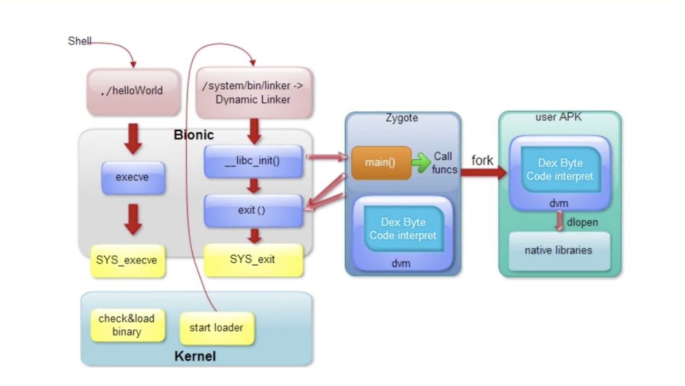
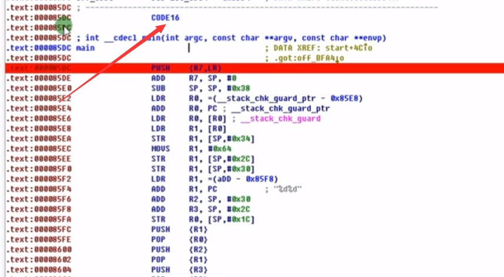
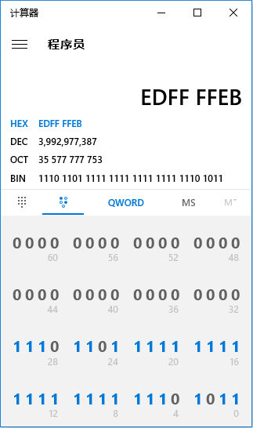
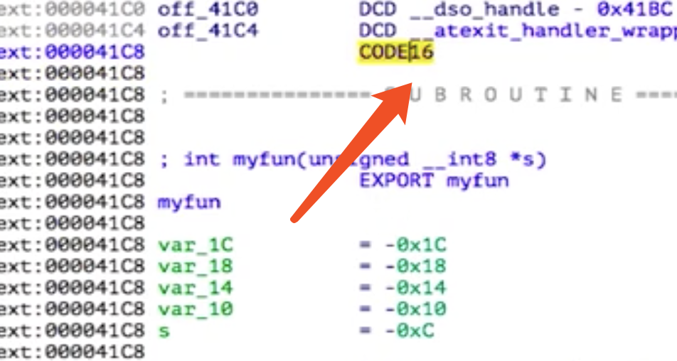

# arm汇编学习（一）

url：https://eternalsakura13.com/2018/01/18/arm1/


# arm汇编

## Android Native 进程启动流程

[](https://sakura-1252236262.cos.ap-beijing.myqcloud.com/blog/180115/8ek7b9Jk2K.png?imageslim)

[](https://sakura-1252236262.cos.ap-beijing.myqcloud.com/blog/180115/mJkdiFL95I.png?imageslim)

ARM传参，R0-R3传递前四个参数

### 1. Thumb 指令集特点

- Thumb 指令集指令长度：16或32，16为为主
- Thumb-16 大部分只能访问前8个寄存器 R0-R7（少数可以访问R8-R15）
- Thumb-32 可以访问所有的ARM core 寄存器 R0-R15

更小、更加灵活

[](https://sakura-1252236262.cos.ap-beijing.myqcloud.com/blog/180115/3F7Kh72CcJ.png?imageslim)

### 2. ARM指令集特点

- 指令长度32位，4字节对齐
- 功能更加完善

#### 对比

| Thumb              | ARM          |
| :----------------- | :----------- |
| 2字节对齐          | 4字节对齐    |
| 占用空间少、密度高 | 占用空间较多 |
| 功能不齐全         | 功能齐全     |

ARM和Thumb指令集各有自己的优点，取长补短往往会得到最好的性能

### 3. Opcod 中判断指令集

- Opcode[15:13]== 111 && Opcode[12:11]!= 00 满足则为32bit 的ARM
- bl #0x80000fbc
- 0xed 0xff 0xff 0xeb
- [](https://sakura-1252236262.cos.ap-beijing.myqcloud.com/blog/180115/HefgcabdgD.png?imageslim)

### 4. IDA 中识别与切换指令集

- Edit->segments->change segment register value(快捷键ALT+G)
- 请看操作。

这有一段指令，判断出目前是thumb指令集的

[](https://sakura-1252236262.cos.ap-beijing.myqcloud.com/blog/180118/bDfa164Gm2.png?imageslim)

[](https://sakura-1252236262.cos.ap-beijing.myqcloud.com/blog/180118/L44GbeBb0g.png?imageslim)

按下ALT+G,把0x1改成0x0，就是指定为ARM指令集

[](https://sakura-1252236262.cos.ap-beijing.myqcloud.com/blog/180118/m6cmAKf7f1.png?imageslim)

然后按下P键定义函数，函数参数就都分析出来了（

### 5. ARM切换指令集原理

- 处理器无论在ARM还是Thumb状态下都可以通过BX/BLX/LDR/LDM切换不同的指令集。
- 状态切换是由寄存器Rn的最低位来指定的，如果操作数寄存器的状态位Bit0=0，则进入ARM状态，如果Bit0=1，则进入Thumb状态。

### ARM 中对于字节、字、双字的定义

[](https://sakura-1252236262.cos.ap-beijing.myqcloud.com/blog/180118/42LgAImG8C.png?imageslim)

注意和intel汇编的区别，一个word(字)这里是4个字节

[](https://sakura-1252236262.cos.ap-beijing.myqcloud.com/blog/180118/k6BCjcgdHD.png?imageslim)

**但是注意一下，在IDA中依然延续着老的传统，一个DCW(word)代表两个字节**

- **DCB 定义1字节数据**
- **DCW 定义2字节数据**
- **DCD 定义4字节数据**
- **在IDA中，在上面这些数据定义上按下D键可以切换定义的类型**
- **Array 定义数组，右键或\*号键**

数组最常见的就在数组，

## IDA中的自定义数据类型

**Structures 窗口中可以创建一个自定义结构体。按下I或者Ins键即可创建。**

[](https://sakura-1252236262.cos.ap-beijing.myqcloud.com/blog/180118/JGdKAA9LFK.png?imageslim)

[](https://sakura-1252236262.cos.ap-beijing.myqcloud.com/blog/180118/6BhFchfIi3.png?imageslim)

创建了一个名为test的结构体

[](https://sakura-1252236262.cos.ap-beijing.myqcloud.com/blog/180118/dK8d27jgfb.png?imageslim)

因为没有定义字段，所以现在都还是空的，结构体长度为0（相当于空结构体，没有任何内容）

所以去定义字段。

### 为自定义数据类型添加字段

创建完结构体后，长这样：

[](https://sakura-1252236262.cos.ap-beijing.myqcloud.com/blog/180118/GmCIi75chL.png?imageslim)

在ends处按下D键就可以定义一个字段了，在字段上按D可以改变长度1/2/4

其他按键：

[](https://sakura-1252236262.cos.ap-beijing.myqcloud.com/blog/180118/fJeKmkHmL6.png?imageslim)

[](https://sakura-1252236262.cos.ap-beijing.myqcloud.com/blog/180118/Hl91i5EjJE.png?imageslim)

[](https://sakura-1252236262.cos.ap-beijing.myqcloud.com/blog/180118/F9JfJKKKBG.png?imageslim)

这样就可以给一个变量转成自己的结构体类型

[](https://sakura-1252236262.cos.ap-beijing.myqcloud.com/blog/180118/6llGaFG7k6.png?imageslim)

### 应用自定义数据类型

**在起始数据处右键->Structure->自定义的数据类型**

[](https://sakura-1252236262.cos.ap-beijing.myqcloud.com/blog/180118/e5bagIfbfD.png?imageslim)

## ARM汇编中的标志寄存器与条件代码

### 跳转指令

- **b指令**：跳转
- **bl指令**：跳转且保存返回地址
- **blx/bx指令**：带x，可以切换指令集

**分支指令例子：**

**beq**=b+eq（equal)=b指令+条件助记符（参考下面的cond）

**ben**

### 条件执行

**ARM中大部分的指令都支持带条件执行。**

[](https://sakura-1252236262.cos.ap-beijing.myqcloud.com/blog/180118/aFcH160afA.png?imageslim)

cond:前四位保存条件码

[](https://sakura-1252236262.cos.ap-beijing.myqcloud.com/blog/180118/8ecida68KH.png?imageslim)

### 比较指令的大用处

**Compare 指令：cmp r0,#1**

**完成操作:**

1. 减法运算(不保存结果)
2. 根据结果更新标志位

### 标志寄存器

#### APSR 寄存器

[](https://sakura-1252236262.cos.ap-beijing.myqcloud.com/blog/180118/I6IjBIEGhG.png?imageslim)

**标志寄存器是条件执行的基础。**
N、Z、C、V用于条件标志位
N - 负数标志位
Z - 零标志位
C - 进位标志位
V - 溢出标志位

比如，若减法运算之后为负数，则N为1；为0，则Z=1；

##### 一些会修改标志位的指令

**1. 指令后缀带S的指令，例如(MOVS)**

**2. TST(and)、TEQ(or)、CMN(add)、CMP(sub)**

例如MOVS之后的到的值为0，那么Z就被置位（为1）

**完整一点的例子**
[](https://sakura-1252236262.cos.ap-beijing.myqcloud.com/blog/180118/debffk3A60.png?imageslim)

> 这里if有两种可能，一种是a<=10，一种是a>10；
>
> 在汇编中**先cmp a,#10**
>
> 然后**选择if括号内相反的选项** bgt next1 (大于则跳转出去)
>
> 然后在这**中间填入if代码块中的内容**

## 实例分析

**打开程序**

[](https://sakura-1252236262.cos.ap-beijing.myqcloud.com/blog/180118/eAf963eelJ.png?imageslim)

**导出表**

[](https://sakura-1252236262.cos.ap-beijing.myqcloud.com/blog/180118/65Ab19GkKH.png?imageslim)

http://blog.csdn.net/hgy413/article/details/6598043

[](https://sakura-1252236262.cos.ap-beijing.myqcloud.com/blog/180118/ijeK017DDJ.png?imageslim)

**libc**init的第三个参数（R2）是main函数的地址

[](https://sakura-1252236262.cos.ap-beijing.myqcloud.com/blog/180118/kljAI65kFj.png?imageslim)

跳入main函数之后发现IDA未能把ARM指令集识别正确。需要手动（ALT+G)

[](https://sakura-1252236262.cos.ap-beijing.myqcloud.com/blog/180118/DLeG0i8IIb.png?imageslim)

[](https://sakura-1252236262.cos.ap-beijing.myqcloud.com/blog/180118/dmfLIFbgC6.png?imageslim)

随便输入一个不等于0x0的数

全部改好之后就识别出来了

[](https://sakura-1252236262.cos.ap-beijing.myqcloud.com/blog/180118/2JFelgFi6a.png?imageslim)

**程序源码**

```
#include<stdio.h>

int main()
{
	int a = 0,b = 0;
	printf("This is condition statements re test!\nPlease input two number:");
	scanf("%d%d",&a,&b);
	if(a + b == 10)
	{
		printf("[if]a+b=10\b");
	}
	
	if(a > b){
		printf("[if-else-1]a > b\n");
	}else if(a == b){
		printf("[if-else-if] a==b\n");
	}else{
		printf("[if-else] a<b \n");
	}
	
	if(a > 10)
	{
		if(a <= 20)
		{
			printf("[nest if]\n");
		}
		printf("a > 10\n");
	}
	return 0;
}
```

自己调试一下

[](https://sakura-1252236262.cos.ap-beijing.myqcloud.com/blog/180118/I58CbF6A6C.png?imageslim)

## 生成thumb代码

[](https://sakura-1252236262.cos.ap-beijing.myqcloud.com/blog/180118/jkcGKL7fbH.png?imageslim)
BL的下一条指令的地址被保存在LR寄存器中

调用gcc的内建函数，R0作为参数

[](https://sakura-1252236262.cos.ap-beijing.myqcloud.com/blog/180118/7EilLlHJfE.png?imageslim)

==R1=LR=57C（待调试）==

==R1=R1+2=57E（待调试）==

**地址做移位是为了对齐（如这里的R1），而数移位是为了做乘除法（如这里的R0）**

LSRS: R1=R1右移两位

LSLS：R0=R0左移两位=R0*4

LSLS：R1=R1左移两位 //**先右移再左移，清除R1原来的最低位，用于对齐，**==得到0x580（待调试）==

LDR：R0=[R1+R0] =[580+原来的R0*4] //假设原来的R0=1，则R0=[580+原来R0*4]=[580+4]=[0x584]=**loc_59C-0x580**

ADDS: R0=R0+R1=loc_59C

MOV: LR=loc_59C

POP: 恢复寄存器R0，R1

MOV: PC=loc_59C;函数结束，跳转到case：选中的代码块

[](https://sakura-1252236262.cos.ap-beijing.myqcloud.com/blog/180118/7dha4ei960.png?imageslim)

这些不是代码，是长为4字节的数据项，每一项都是偏移值，**这个偏移值+0x580就能找到真正的代码**

## 生成ARM代码

[](https://sakura-1252236262.cos.ap-beijing.myqcloud.com/blog/180118/e64JgLd8gc.png?imageslim)

ADDLS：PC=PC+（R3*4）

PC的PC寄存器指向的不是下条指令，是下下条指令（也就是当前指令地址+8）

###### CEMU测试

###### bl funl //把LR设置为BL指令的下一条地址

###### fun1:

###### mov r0,pc

###### mov r1,lr

[](https://sakura-1252236262.cos.ap-beijing.myqcloud.com/blog/180118/KKmHecaK8C.png?imageslim)

[](https://sakura-1252236262.cos.ap-beijing.myqcloud.com/blog/180118/D69cGmkeCF.png?imageslim)

[](https://sakura-1252236262.cos.ap-beijing.myqcloud.com/blog/180118/G319AEKc61.png?imageslim)

[](https://sakura-1252236262.cos.ap-beijing.myqcloud.com/blog/180118/k7eHK6CLmf.png?imageslim)

[](https://sakura-1252236262.cos.ap-beijing.myqcloud.com/blog/180118/4FgIA8aDcm.png?imageslim)

差了8个字节

## 关于ARM中的寄存器PC

http://blog.csdn.net/tigerjibo/article/details/6050649

http://blog.csdn.net/lee244868149/article/details/49488575

[](https://sakura-1252236262.cos.ap-beijing.myqcloud.com/blog/180118/8Fg5394hJj.png?imageslim)

从图中可以看出，一条汇编指令的运行有三个步骤，取指、译码、执行，当第一条汇编指令取指完成后，紧接着就是第二条指令的取指，然后第三条…如此嵌套

其实很容易看出，第一条指令：

add r0, r1,$5

取指完成后，PC就指向了第二条指令，此时PC=PC+4

当第一条指令译码完成以后，此时PC=PC+8

所以第一条指令开始执行时，PC值已经加了8

所以必须记住这个前提，在arm中，每次该指令执行时，其实这时的PC值是PC=PC+8

而且这个前提也同样适合多级流水线，原因就不解释了