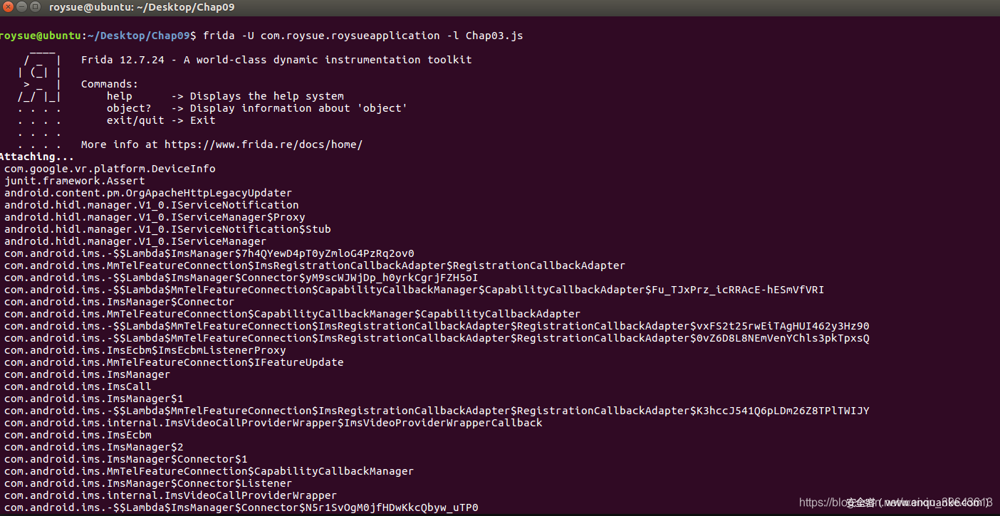

# FRIDA-API使用篇

src:https://www.anquanke.com/post/id/195869#h2-1


# 前言

大家好，窝又来写文章了，咱们现在在这篇文章中，我们来对其官方的一些非常常用的`API`进行学习。所谓工欲善其事，必先利其器。想要好好学习`FRIDA`我们就必须对`FRIDA API`深入的学习以对其有更深的了解和使用，通常大部分核心原理也在官方API中写着，我们学会来使用一些案例来结合API的使用。

注意，运行以下任何代码时都需要提前启动手机中的`frida-server`文件。

系列文章目录搬新“家”了，地址：<https://github.com/r0ysue/AndroidSecurityStudy> ，接下来窝会努力写更多喔 ~

# rpc、Process、Module、Memory使用方法及示例


## 1.1 FRIDA输出打印

### 1.1.1 console输出

不论是什么语言都好，第一个要学习总是如何输出和打印，那我们就来学习在`FRIDA`打印值。在官方`API`有两种打印的方式，分别是`console`、`send`，我们先来学习非常的简单的`console`，这里我创建一个js文件，代码示例如下。

```javascript
function hello_printf() {
    Java.perform(function () {
        console.log("");
        console.log("hello-log");
        console.warn("hello-warn");
        console.error("hello-error");
    });
}
setImmediate(hello_printf,0);
```

当文件创建好之后，我们需要运行在手机中安装的`frida-server`文件，在上一章我们学过了如何安装在`android`手机安装`frida-server`，现在来使用它，我们在`ubuntu`中开启一个终端，运行以下代码，启动我们安装好的`frida-server`文件。

```shell
roysue@ubuntu:~$ adb shell
sailfish:/ $ su
sailfish:/ $ ./data/local/tmp/frida-server
```

然后执行以下代码，对目标应用`app`的进程`com.roysue.roysueapplication`使用`-l`命令注入`Chap03.js`中的代码`1-1`以及执行脚本之后的效果图`1-1`！

```shell
frida -U com.roysue.roysueapplication -l Chap03.js
```


<center>图1-1 终端执行</center>

可以到终点已经成功注入了脚本并且打印了`hello`，但是颜色不同，这是`log`的级别的原因，在`FRIDA`的`console`中有三个级别分别是`log`、`warn`、`error`。

| 级别  | 含义 |
| ----- | ---- |
| log   | 正常 |
| warn  | 警告 |
| error | 错误 |

### 1.1.2 console之hexdump

`error`级别最为严重其次`warn`，但是一般在使用中我们只会使用`log`来输出想看的值；然后我们继续学习`console`的好兄弟，`hexdump`，其含义:打印内存中的地址，`target`参数可以是`ArrayBuffer`或者`NativePointer`,而`options`参数则是自定义输出格式可以填这几个参数`offset`、`lengt`、`header`、`ansi`。

`hexdump`代码示例以及执行效果如下。

```javascript
var libc = Module.findBaseAddress('libc.so');
console.log(hexdump(libc, {
  offset: 0,
  length: 64,
  header: true,
  ansi: true
}));
           0  1  2  3  4  5  6  7  8  9  A  B  C  D  E  F  0123456789ABCDEF
00000000  7f 45 4c 46 01 01 01 00 00 00 00 00 00 00 00 00  .ELF............
00000010  03 00 28 00 01 00 00 00 00 00 00 00 34 00 00 00  ..(.........4...
00000020  34 a8 04 00 00 00 00 05 34 00 20 00 08 00 28 00  4.......4. ...(.
00000030  1e 00 1d 00 06 00 00 00 34 00 00 00 34 00 00 00  ........4...4...
```

### 1.1.3 send

`send`是在`python`层定义的`on_message`回调函数，`jscode`内所有的信息都被监控`script.on('message', on_message)`，当输出信息的时候`on_message`函数会拿到其数据再通过`format`转换， 其最重要的功能也是最核心的是能够直接将数据以`json`格式输出，当然数据是二进制的时候也依然是可以使用`send`，十分方便，我们来看代码`1-2示`例以及执行效果。

```javascript
# -*- coding: utf-8 -*-
import frida
import sys

def on_message(message, data):
    if message['type'] == 'send':
        print("[*] {0}".format(message['payload']))
    else:
        print(message)

jscode = """
    Java.perform(function () 
    {
        var jni_env = Java.vm.getEnv();
        console.log(jni_env);
        send(jni_env);
    });
 """

process = frida.get_usb_device().attach('com.roysue.roysueapplication')
script = process.create_script(jscode)
script.on('message', on_message)
script.load()
sys.stdin.read()

运行脚本效果如下：

roysue@ubuntu:~/Desktop/Chap09$ python Chap03.py 
[object Object]
[*] {'handle': '0xdf4f8000', 'vm': {}}
```

可以看出这里两种方式输出的不同的效果，`console`直接输出了`[object Object]`，无法输出其正常的内容，因为`jni_env`实际上是一个对象，但是使用`send`的时候会自动将对象转`json`格式输出。通过对比，我们就知道send的好处啦~

## 1.2 FRIDA变量类型

学完输出之后我们来学习如何声明变量类型。

| 索引 | API                  | 含义                                                         |
| ---- | -------------------- | ------------------------------------------------------------ |
| 1    | new Int64(v)         | 定义一个有符号Int64类型的变量值为v，参数v可以是字符串或者以0x开头的的十六进制值 |
| 2    | new UInt64(v)        | 定义一个无符号Int64类型的变量值为v，参数v可以是字符串或者以0x开头的的十六进制值 |
| 3    | new NativePointer(s) | 定义一个指针，指针地址为s                                    |
| 4    | ptr(“0”)             | 同上                                                         |

代码示例以及效果

```javascript
Java.perform(function () {
    console.log("");
    console.log("new Int64(1):"+new Int64(1));
    console.log("new UInt64(1):"+new UInt64(1));
    console.log("new NativePointer(0xEC644071):"+new NativePointer(0xEC644071));
    console.log("new ptr('0xEC644071'):"+new ptr(0xEC644071));
});
    输出效果如下：
    new Int64(1):1
    new UInt64(1):1
    new NativePointer(0xEC644071):0xec644071
    new ptr('0xEC644071'):0xec644071
```

`frida`也为`Int64(v)`提供了一些相关的`API`：


| 索引 | API                                             | 含义                             |
| ---- | ----------------------------------------------- | -------------------------------- |
| 1    | add(rhs)、sub(rhs)、and(rhs)、or(rhs)、xor(rhs) | 加、减、逻辑运算                 |
| 2    | shr(N)、shl(n)                                  | 向右/向左移位n位生成新的Int64    |
| 3    | Compare(Rhs)                                    | 返回整数比较结果                 |
| 4    | toNumber()                                      | 转换为数字                       |
| 5    | toString([radix=10])                            | 转换为可选基数的字符串(默认为10) |

我也写了一些使用案例，代码如下。

```javascript
function hello_type() {
    Java.perform(function () {
        console.log("");
        //8888 + 1 = 8889
        console.log("8888 + 1:"+new Int64("8888").add(1));
        //8888 - 1 = 8887
        console.log("8888 - 1:"+new Int64("8888").sub(1));
        //8888 << 1 = 4444
        console.log("8888 << 1:"+new Int64("8888").shr(1));
        //8888 == 22 = 1 1是false
        console.log("8888 == 22:"+new Int64("8888").compare(22));
        //转string
        console.log("8888 toString:"+new Int64("8888").toString());
    });
}
```

代码执行效果如图1-2。


<center>图1-2 Int64 API</center>

## 1.3 RPC远程调用

可以替换或插入的空对象，以向应用程序公开`RPC`样式的`API`。该键指定方法名称，该值是导出的函数。此函数可以返回一个纯值以立即返回给调用方，或者承诺异步返回。也就是说可以通过rpc的导出的功能使用在`python`层，使`python`层与`js`交互，官方示例代码有`Node.js`版本与`python`版本，我们在这里使用`python`版本，代码如下。


### 1.3.1 远程调用代码示例

```javascript
import frida

def on_message(message, data):
    if message['type'] == 'send':
        print(message['payload'])
    elif message['type'] == 'error':
        print(message['stack'])

session = frida.get_usb_device().attach('com.roysue.roysueapplication')

source = """
    rpc.exports = {
    add: function (a, b) {
        return a + b;
    },
    sub: function (a, b) {
        return new Promise(function (resolve) {
        setTimeout(function () {
            resolve(a - b);
        }, 100);
        });
    }
    };
"""

script = session.create_script(source)
script.on('message', on_message)
script.load()
print(script.exports.add(2, 3))
print(script.exports.sub(5, 3))
session.detach()
```

### 1.3.2 远程调用代码示例详解

官方源码示例是附加在目标进程为`iTunes`，再通过将`rpc`的`./agent.js`文件读取到`source`，进行使用。我这里修改了附加的目标的进程以及直接将`rpc`的代码定义在`source`中。我们来看看这段是咋运行的，仍然先对目标进程附加，然后在写js中代码，也是`source`变量，通过`rpc.exports`关键字定义需要导出的两个函数，上面定义了`add`函数和`sub`函数，两个的函数写作方式不一样，大家以后写按照`add`方法写就好了，`sub`稍微有点复杂。声明完函数之后创建了一个脚本并且注入进程，加载了脚本之后可以到`print(script.exports.add(2, 3))`以及`print(script.exports.sub(5, 3))`，在`python`层直接调用。`add`的返回的结果为`5`，`sub`则是`2`，下见下图`1-3`。


<center>图1-3 执行python脚本</center>

## 1.4 Process对象

我们现在来介绍以及使用一些`Process`对象中比较常用的`api`~

### 1.4.1 Process.id

`Process.id`：返回附加目标进程的`PID`

### 1.4.2 Process.isDebuggerAttached()

`Process.isDebuggerAttached()`：检测当前是否对目标程序已经附加

### 1.4.3 Process.enumerateModules()

枚举当前加载的模块，返回模块对象的数组。
`Process.enumerateModules()`会枚举当前所有已加载的`so`模块，并且返回了数组`Module`对象，`Module`对象下一节我们来详细说，在这里我们暂时只使用`Module`对象的`name`属性。

```javascript
function frida_Process() {
    Java.perform(function () {
        var process_Obj_Module_Arr = Process.enumerateModules();
        for(var i = 0; i < process_Obj_Module_Arr.length; i++) {
            console.log("",process_Obj_Module_Arr[i].name);
        }
    });
}
setImmediate(frida_Process,0);
```

我来们开看看这段`js`代码写了啥：在js中能够直接使用`Process`对象的所有`api`，调用了`Process.enumerateModules()`方法之后会返回一个数组，数组中存储`N`个叫`Module`的对象，既然已经知道返回了的是一个数组，很简单我们就来`for`循环它便是，这里我使用下标的方式调用了`Module`对象的`name`属性，`name`是`so`模块的名称。见下图`1-4`。


<center>图1-4 终端输出了所有已加载的so</center>

### 1.4.4 Process.enumerateThreads()

`Process.enumerateThreads()`：枚举当前所有的线程，返回包含以下属性的对象数组：

索引	| 属性		|含义
---	|---	|---
1	|	id	|	线程id
2	|	state	|	当前运行状态有running, stopped, waiting, uninterruptible or halted
3		|context		|带有键pc和sp的对象，它们是分别为ia32/x64/arm指定EIP/RIP/PC和ESP/RSP/SP的NativePointer对象。也可以使用其他处理器特定的密钥，例如eax、rax、r0、x0等。

使用代码示例如下：

```javascript
function frida_Process() {
    Java.perform(function () {
       var enumerateThreads =  Process.enumerateThreads();
       for(var i = 0; i < enumerateThreads.length; i++) {
        console.log("");
        console.log("id:",enumerateThreads[i].id);
        console.log("state:",enumerateThreads[i].state);
        console.log("context:",JSON.stringify(enumerateThreads[i].context));
        }
    });
}
setImmediate(frida_Process,0);
```

获取当前是所有线程之后返回了一个数组，然后循环输出它的值，如下图`1-5`。


<center>图1-4 终端执行</center>

### 1.4.5 Process.getCurrentThreadId()

`Process.getCurrentThreadId()`：获取此线程的操作系统特定 ID 作为数字

## 1.5 Module对象

3.4章节中`Process.EnumererateModules()`方法返回了就是一个`Module`对象，咱们这里来详细说说`Module`对象，先来瞧瞧它都有哪些属性。

### 1.5.1 Module对象的属性

| 索引 | 属性 | 含义                                |
| ---- | ---- | ----------------------------------- |
| 1    | name | 模块名称                            |
| 2    | base | 模块地址，其变量类型为NativePointer |
| 3    | size | 大小                                |
| 4    | path | 完整文件系统路径                    |

除了属性我们再来看看它有什么方法。

### 1.5.2 Module对象的API

| 索引 | API                                                          | 含义                                     |
| ---- | ------------------------------------------------------------ | ---------------------------------------- |
| 1    | Module.load()                                                | 加载指定so文件，返回一个Module对象       |
| 2    | enumerateImports()                                           | 枚举所有Import库函数，返回Module数组对象 |
| 3    | enumerateExports()                                           | 枚举所有Export库函数，返回Module数组对象 |
| 4    | enumerateSymbols()                                           | 枚举所有Symbol库函数，返回Module数组对象 |
| 5    | Module.findExportByName(exportName)、Module.getExportByName(exportName) | 寻找指定so中export库中的函数地址         |
| 6    | Module.findBaseAddress(name)、Module.getBaseAddress(name)    | 返回so的基地址                           |

### 1.5.3 Module.load()

在`frida-12-5`版本中更新了该`API`，主要用于加载指定`so`文件，返回一个`Module`对象。

使用代码示例如下：

```javascript
function frida_Module() {
    Java.perform(function () {
         //参数为so的名称 返回一个Module对象
         const hooks = Module.load('libhello.so');
         //输出
         console.log("模块名称:",hooks.name);
         console.log("模块地址:",hooks.base);
         console.log("大小:",hooks.size);
         console.log("文件系统路径",hooks.path);
    });
}
setImmediate(frida_Module,0);

输出如下：
模块名称: libhello.so
模块地址: 0xdf2d3000
大小: 24576
文件系统路径 /data/app/com.roysue.roysueapplication-7adQZoYIyp5t3G5Ef5wevQ==/lib/arm/libhello.so
```

这边如果去除判断的话会打印所有加载的`so`的信息，这里我们就知道了哪些方法返回了`Module`对象了，然后我们再继续深入学习`Module`对象自带的`API`。

### 1.5.5 enumerateImports()

该API会枚举模块中所有中的所有Import函数，示例代码如下。

```javascript
function frida_Module() {
    Java.perform(function () {
        const hooks = Module.load('libhello.so');
        var Imports = hooks.enumerateImports();
        for(var i = 0; i < Imports.length; i++) {
            //函数类型
            console.log("type:",Imports[i].type);
            //函数名称
            console.log("name:",Imports[i].name);
            //属于的模块
            console.log("module:",Imports[i].module);
            //函数地址
            console.log("address:",Imports[i].address);
         }
    });
}
setImmediate(frida_Module,0);

输出如下：
[Google Pixel::com.roysue.roysueapplication]-> type: function
name: __cxa_atexit
module: /system/lib/libc.so
address: 0xf58f4521
type: function
name: __cxa_finalize
module: /system/lib/libc.so
address: 0xf58f462d                                                                                                                                           
type: function
name: __stack_chk_fail
module: /system/lib/libc.so
address: 0xf58e2681
...
```

### 1.5.6 enumerateExports()

该API会枚举模块中所有中的所有Export函数，示例代码如下。

```javascript
function frida_Module() {
    Java.perform(function () {
        const hooks = Module.load('libhello.so');
        var Exports = hooks.enumerateExports();
        for(var i = 0; i < Exports.length; i++) {
            //函数类型
            console.log("type:",Exports[i].type);
            //函数名称
            console.log("name:",Exports[i].name);
            //函数地址
            console.log("address:",Exports[i].address);
         }
    });
}
setImmediate(frida_Module,0);

输出如下：
[Google Pixel::com.roysue.roysueapplication]-> type: function
name: Java_com_roysue_roysueapplication_hellojni_getSum
address: 0xdf2d411b
type: function
name: unw_save_vfp_as_X
address: 0xdf2d4c43
type: function
address: 0xdf2d4209
type: function
...
```

### 1.5.7 enumerateSymbols()

代码示例如下。

```javascript
function frida_Module() {
    Java.perform(function () {
        const hooks = Module.load('libc.so');
        var Symbol = hooks.enumerateSymbols();
        for(var i = 0; i < Symbol.length; i++) {
            console.log("isGlobal:",Symbol[i].isGlobal);
            console.log("type:",Symbol[i].type);
            console.log("section:",JSON.stringify(Symbol[i].section));
            console.log("name:",Symbol[i].name);
            console.log("address:",Symbol[i].address);
         }
    });
}
setImmediate(frida_Module,0);

输出如下：
isGlobal: true
type: function
section: {"id":"13.text","protection":"r-x"}
name: _Unwind_GetRegionStart
address: 0xf591c798
isGlobal: true
type: function
section: {"id":"13.text","protection":"r-x"}
name: _Unwind_GetTextRelBase
address: 0xf591c7cc
...
```

### 1.5.8 Module.findExportByName(exportName), Module.getExportByName(exportName)

返回`so`文件中`Export`函数库中函数名称为`exportName`函数的绝对地址。

代码示例如下。

```javascript
function frida_Module() {
    Java.perform(function () {
        Module.getExportByName('libhello.so', 'c_getStr')
        console.log("Java_com_roysue_roysueapplication_hellojni_getStr address:",Module.findExportByName('libhello.so', 'Java_com_roysue_roysueapplication_hellojni_getStr'));
        console.log("Java_com_roysue_roysueapplication_hellojni_getStr address:",Module.getExportByName('libhello.so', 'Java_com_roysue_roysueapplication_hellojni_getStr'));
    });
}
setImmediate(frida_Module,0);

输出如下：
Java_com_roysue_roysueapplication_hellojni_getStr address: 0xdf2d413d
Java_com_roysue_roysueapplication_hellojni_getStr address: 0xdf2d413d
```

### 1.5.9 Module.findBaseAddress(name)、Module.getBaseAddress(name)

返回name模块的基地址。

代码示例如下。

```javascript
function frida_Module() {
    Java.perform(function () {
        var name = "libhello.so";
        console.log("so address:",Module.findBaseAddress(name));
        console.log("so address:",Module.getBaseAddress(name));
    });
}
setImmediate(frida_Module,0);

输出如下：
so address: 0xdf2d3000
so address: 0xdf2d3000
```

## 1.6 Memory对象

`Memory`的一些`API`通常是对内存处理，譬如`Memory.copy()`复制内存，又如`writeByteArray`写入字节到指定内存中，那我们这章中就是学习使用`Memory API`向内存中写入数据、读取数据。

### 1.6.1 Memory.scan搜索内存数据

其主要功能是搜索内存中以`address`地址开始，搜索长度为`size`，需要搜是条件 是`pattern`，`callbacks`搜索之后的回调函数；此函数相当于搜索内存的功能。

我们来直接看例子，然后结合例子讲解，如下图`1-5`。


<center>图1-5 IDA中so文件某处数据</center>

如果我想搜索在内存中`112A`地址的起始数据要怎么做，代码示例如下。

```javascript
function frida_Memory() {
    Java.perform(function () {
        //先获取so的module对象
        var module = Process.findModuleByName("libhello.so"); 
        //??是通配符
        var pattern = "03 49 ?? 50 20 44";
        //基址
        console.log("base:"+module.base)
        //从so的基址开始搜索，搜索大小为so文件的大小，搜指定条件03 49 ?? 50 20 44的数据
        var res = Memory.scan(module.base, module.size, pattern, {
            onMatch: function(address, size){
                //搜索成功
                console.log('搜索到 ' +pattern +" 地址是:"+ address.toString());  
            }, 
            onError: function(reason){
                //搜索失败
                console.log('搜索失败');
            },
            onComplete: function()
            {
                //搜索完毕
                console.log("搜索完毕")
            }
          });
    });
}
setImmediate(frida_Memory,0);
```

先来看看回调函数的含义，`onMatch：function(address，size)`：使用包含作为`NativePointer`的实例地址的`address`和指定大小为数字的`size`调用，此函数可能会返回字符串`STOP`以提前取消内存扫描。`onError：Function(Reason)`：当扫描时出现内存访问错误时使用原因调用。`onComplete：function()`：当内存范围已完全扫描时调用。

我们来来说上面这段代码做了什么事情：搜索`libhello.so`文件在内存中的数据，搜索以`pattern`条件的在内存中能匹配的数据。搜索到之后根据回调函数返回数据。

我们来看看执行之后的效果图`1-6`。


<center>图1-6 终端执行</center>

我们要如何验证搜索到底是不是图`1-5`中`112A`地址，其实很简单。`so`的基址是`0xdf2d3000`，而搜到的地址是`0xdf2d412a`，我们只要`df2d412a-df2d3000=112A`。就是说我们已经搜索到了！

### 1.6.2 搜索内存数据Memory.scanSync

功能与`Memory.scan`一样，只不过它是返回多个匹配到条件的数据。
代码示例如下。

```javascript
function frida_Memory() {
    Java.perform(function () {
        var module = Process.findModuleByName("libhello.so"); 
        var pattern = "03 49 ?? 50 20 44";
        var scanSync = Memory.scanSync(module.base, module.size, pattern);
        console.log("scanSync:"+JSON.stringify(scanSync));
    });
}
setImmediate(frida_Memory,0);

输出如下，可以看到地址搜索出来是一样的
scanSync:[{"address":"0xdf2d412a","size":6}]
```

### 1.6.3 内存分配Memory.alloc

在目标进程中的堆上申请`size`大小的内存，并且会按照`Process.pageSize`对齐，返回一个`NativePointer`，并且申请的内存如果在`JavaScript`里面没有对这个内存的使用的时候会自动释放的。也就是说，如果你不想要这个内存被释放，你需要自己保存一份对这个内存块的引用。

使用案例如下

```javascript
function frida_Memory() {
    Java.perform(function () {
        const r = Memory.alloc(10);
        console.log(hexdump(r, {
            offset: 0,
            length: 10,
            header: true,
            ansi: false
        }));
    });
}
setImmediate(frida_Memory,0);
```

以上代码在目标进程中申请了`10`字节的空间~我们来看执行脚本的效果图`1-7`。


<center>图1-7 内存分配


可以看到在`0xdfe4cd40`处申请了`10`个字节内存空间~

也可以使用：
`Memory.allocUtf8String(str) `分配`utf`字符串
`Memory.allocUtf16String`分配`utf16`字符串
`Memory.allocAnsiString`分配`ansi`字符串

### 1.6.4 内存复制Memory.copy

如同`c api memcp`一样调用，使用案例如下。

```javascript
function frida_Memory() {
    Java.perform(function () {
        //获取so模块的Module对象
        var module = Process.findModuleByName("libhello.so"); 
        //条件
        var pattern = "03 49 ?? 50 20 44";
        //搜字符串 只是为了将so的内存数据复制出来 方便演示~
        var scanSync = Memory.scanSync(module.base, module.size, pattern);
        //申请一个内存空间大小为10个字节
        const r = Memory.alloc(10);
        //复制以module.base地址开始的10个字节 那肯定会是7F 45 4C 46...因为一个ELF文件的Magic属性如此。
        Memory.copy(r,module.base,10);
        console.log(hexdump(r, {
            offset: 0,
            length: 10,
            header: true,
            ansi: false
        }));
    });
}
setImmediate(frida_Memory,0);


输出如下。
           0  1  2  3  4  5  6  7  8  9  A  B  C  D  E  F  0123456789ABCDEF
e8142070  7f 45 4c 46 01 01 01 00 00 00                    .ELF......
```

从`module.base`中复制`10`个字节的内存到新申请的`r`内。


### 1.6.5 写入内存Memory.writeByteArray

将字节数组写入一个指定内存，代码示例如下:

```javascript
function frida_Memory() {     
    Java.perform(function () {
        //定义需要写入的字节数组 这个字节数组是字符串"roysue"的十六进制
        var arr = [ 0x72, 0x6F, 0x79, 0x73, 0x75, 0x65];
        //申请一个新的内存空间 返回指针 大小是arr.length
        const r = Memory.alloc(arr.length);
        //将arr数组写入R地址中
        Memory.writeByteArray(r,arr);
        //输出
        console.log(hexdump(r, {
            offset: 0,
            length: arr.length,
            header: true,
            ansi: false
        }));  
    });
}
setImmediate(frida_Memory,0);


输出如下。
           0  1  2  3  4  5  6  7  8  9  A  B  C  D  E  F  0123456789ABCDEF
00000000  72 6f 79 73 75 65                                roysue
```

### 1.6.6 读取内存Memory.readByteArray

将一个指定地址的数据，代码示例如下:

```javascript
function frida_Memory() {     
    Java.perform(function () {
        //定义需要写入的字节数组 这个字节数组是字符串"roysue"的十六进制
        var arr = [ 0x72, 0x6F, 0x79, 0x73, 0x75, 0x65];
        //申请一个新的内存空间 返回指针 大小是arr.length
        const r = Memory.alloc(arr.length);
        //将arr数组写入R地址中
        Memory.writeByteArray(r,arr);
        //读取r指针，长度是arr.length 也就是会打印上面一样的值
        var buffer = Memory.readByteArray(r, arr.length);
        //输出
        console.log("Memory.readByteArray:");
        console.log(hexdump(buffer, {
            offset: 0,
            length: arr.length,
            header: true,
            ansi: false
        }));
      });  
    });
}
setImmediate(frida_Memory,0);

输出如下。
[Google Pixel::com.roysue.roysueapplication]-> Memory.readByteArray:
           0  1  2  3  4  5  6  7  8  9  A  B  C  D  E  F  0123456789ABCDEF
00000000  72 6f 79 73 75 65                                roysue
```

## 结语

在这篇中我们学会了在`FRIDACLI`中如何输出想要输出格式，也学会如何声明变量，一步步的学习。在逐步的学习的过程，总是会遇到不同的问题。歌曲<奇迹再现>我相信你一定听过吧~，新的风暴已经出现,怎么能够停止不前..遇到问题不要怕，总会解决的。

咱们会在下一篇中来学会如何使用`FRIDA`中的`Java`对象、`Interceptor`对象、`NativePointer`对象`NativeFunction`对象、`NativeCallback`对象咱们拭目以待吧~

# Java、Interceptor、NativePointer(Function/Callback)使用方法及示例

## 1.1 Java对象

`Java`是十分哦不，应该说是极其重要的`API`，无论是想对`so`层亦或`java`层进行拦截，都必须编写`Java.perform`，在使用上面这些`API`时，应该都已经发现了吧~这章我们就来详细看看`Java`对象都有哪些`API`~

### 1.1.1 Java.available

该函数一般用来判断当前进程是否加载了`JavaVM`，`Dalvik`或`ART虚拟机，咱们来看代码示例！

```javascript
function frida_Java() {
    Java.perform(function () {
        //作为判断用
        if(Java.available)
        {
            //注入的逻辑代码
            console.log("hello java vm");
        }else{
            //未能正常加载JAVA VM
            console.log("error");
        }
    });
}       
setImmediate(frida_Java,0);

输出如下。
hello java vm
```

核心注入的逻辑代码写在<注入的逻辑代码>内会非常的安全万无一失~

### 1.1.2 Java.androidVersion

显示android系统版本号

```javascript
function frida_Java() {
    Java.perform(function () {
        //作为判断用
        if(Java.available)
        {
            //注入的逻辑代码
            console.log("",Java.androidVersion);
        }else{
            //未能正常加载JAVA VM
            console.log("error");
        }
    });
}       
setImmediate(frida_Java,0);

输出如下。
9
因为我的系统版本是9版本~
```

### 1.1.3 枚举类Java.enumerateLoadedClasses

该API枚举当前加载的所有类信息，它有一个回调函数分别是`onMatch`、`onComplete`函数，我们来看看代码示例以及效果！

```javascript
function frida_Java() {
    Java.perform(function () {
        if(Java.available)
        {
            //console.log("",Java.androidVersion);
            //枚举当前加载的所有类
            Java.enumerateLoadedClasses({
                //每一次回调此函数时其参数className就是类的信息
                onMatch: function (className)
                {
                    //输出类字符串
                    console.log("",className);
                },
                //枚举完毕所有类之后的回调函数
                onComplete: function ()
                {
                    //输出类字符串
                    console.log("输出完毕");
                }
            });
        }else{
            console.log("error");
        }
    });
}       
setImmediate(frida_Java,0);
```

咱们来看执行的效果图1-7。



<center>图1-7 终端执行</center>

它还有一个好兄弟 `Java.enumerateLoadedClassesSync()`，它返回的是一个数组。

### 1.1.4 枚举类加载器Java.enumerateLoadeders

该`api`枚举`Java VM`中存在的类加载器，其有一个回调函数，分别是`onMatch: function (loader)`与`onComplete: function ()`，接着我们来看代码示例。

```javascript
function frida_Java() {
    Java.perform(function () {
        if(Java.available)
        {
            //枚举当前加载的Java VM类加载器
            Java.enumerateClassLoaders({
                //回调函数，参数loader是类加载的信息
                onMatch: function (loader)
                {
                    console.log("",loader);
                },
                //枚举完毕所有类加载器之后的回调函数
                onComplete: function ()
                {
                    console.log("end");
                }
            });
        }else{
            console.log("error");
        }
    });
}       
setImmediate(frida_Java,0);
```

执行的效果图1-8。


<center>图1-8 终端执行</center>

它也有一个好兄弟叫`Java.enumerateClassLoadersSync()`也是返回的数组。

### 1.1.5 附加调用Java.perform

该`API`极其重要，`Java.perform（fn）`主要用于当前线程附加到`Java VM`并且调用`fn`方法。我们来看看示例代码及其含义。

```javascript
function frida_Java() {
    //运行当前js脚本时会对当前线程附加到Java VM虚拟机，并且执行function方法
    Java.perform(function () {
        //判断是否Java VM正常运行
        if(Java.available)
        {
            //如不意外会直接输出 hello
            console.log("hello");
        }else{
            console.log("error");
        }
    });
}       
setImmediate(frida_Java,0);

输出如下。
[Google Pixel::com.roysue.roysueapplication]-> hello
```

没错你猜对了，它也有一个好兄弟。`Java.performNow(fn)`~

### 1.1.6 获取类Java.use

`Java.use(className)`，动态获取`className`的类定义，通过对其调用`$new()`来调用构造函数，可以从中实例化对象。当想要回收类时可以调用`$Dispose()`方法显式释放，当然也可以等待`JavaScript`的垃圾回收机制，当实例化一个对象之后，可以通过其实例对象调用类中的静态或非静态的方法，官方代码示例定义如下。

```javascript
Java.perform(function () {
  //获取android.app.Activity类
  var Activity = Java.use('android.app.Activity');
  //获取java.lang.Exception类
  var Exception = Java.use('java.lang.Exception');
  //拦截Activity类的onResume方法
  Activity.onResume.implementation = function () {
    //调用onResume方法的时候，会在此处被拦截并且调用以下代码抛出异常！
    throw Exception.$new('Oh noes!');
  };
});
```

### 1.1.7 扫描实例类Java.choose

在堆上查找实例化的对象，示例代码如下！

```javascript
Java.perform(function () {
    //查找android.view.View类在堆上的实例化对象
    Java.choose("android.view.View", {
        //枚举时调用
        onMatch:function(instance){
            //打印实例
            console.log(instance);
        },
        //枚举完成后调用
        onComplete:function() {
            console.log("end")
        }});
});

输出如下：
android.view.View{2292774 V.ED..... ......ID 0,1794-1080,1920 #1020030 android:id/navigationBarBackground}
android.view.View{d43549d V.ED..... ......ID 0,0-1080,63 #102002f android:id/statusBarBackground}
end
```

### 1.1.8 类型转换器Java.cast

`Java.cast(handle, klass)`，就是将指定变量或者数据强制转换成你所有需要的类型；创建一个 `JavaScript` 包装器，给定从 `Java.use（）` 返回的给定类`klas`的句柄的现有实例。此类包装器还具有用于获取其类的包装器的类属性，以及用于获取其类名的字符串表示的`$className`属性，通常在拦截`so`层时会使用此函数将`jstring`、`jarray`等等转换之后查看其值。

### 1.1.9 定义任意数组类型Java.array

`frida`提供了在`js`代码中定义`java`数组的`api`，该数组可以用于传递给`java API`，我们来看看如何定义，代码示例如下。

```javascript
Java.perform(function () {
        //定义一个int数组、值是1003, 1005, 1007
        var intarr = Java.array('int', [ 1003, 1005, 1007 ]);
        //定义一个byte数组、值是0x48, 0x65, 0x69
        var bytearr = Java.array('byte', [ 0x48, 0x65, 0x69 ]);
        for(var i=0;i<bytearr.length;i++)
        {
            //输出每个byte元素
            console.log(bytearr[i])
        }
});
```

我们通过上面定义`int`数组和`byte`的例子可以知道其定义格式为`Java.array('type',[value1,value2,....]);`那它都支持`type`呢？我们来看看~


| 索引 | type | 含义    |
| ---- | ---- | ------- |
| 1    | Z    | boolean |
| 2    | B    | byte    |
| 3    | C    | char    |
| 4    | S    | short   |
| 5    | I    | int     |
| 6    | J    | long    |
| 7    | F    | float   |
| 8    | D    | double  |
| 9    | V    | void    |

### 1.1.10 注册类Java.registerClass(spec)

`Java.registerClass`：创建一个新的Java类并返回一个包装器，其中规范是一个包含：
`name`：指定类名称的字符串。
`superClass`：（可选）父类。要从 `java.lang.Object` 继承的省略。
`implements`：（可选）由此类实现的接口数组。
`fields`：（可选）对象，指定要公开的每个字段的名称和类型。
`methods`：（可选）对象，指定要实现的方法。

注册一个类，返回类的实例，下面我贴一个基本的用法~实例化目标类对象并且调用类中的方法

```javascript
Java.perform(function () {
          //注册一个目标进程中的类，返回的是一个类对象
          var hellojni = Java.registerClass({
            name: 'com.roysue.roysueapplication.hellojni'
          });
          console.log(hellojni.addInt(1,2));
});
```

我们再深入看看官方怎么来玩的：

```javascript
//获取目标进程的SomeBaseClass类
var SomeBaseClass = Java.use('com.example.SomeBaseClass');
//获取目标进程的X509TrustManager类
var X509TrustManager = Java.use('javax.net.ssl.X509TrustManager');

var MyWeirdTrustManager = Java.registerClass({
  //注册一个类是进程中的MyWeirdTrustManager类
  name: 'com.example.MyWeirdTrustManager',
  //父类是SomeBaseClass类
  superClass: SomeBaseClass,
  //实现了MyWeirdTrustManager接口类
  implements: [X509TrustManager],
  //类中的属性
  fields: {
    description: 'java.lang.String',
    limit: 'int',
  },
  //定义的方法
  methods: {
    //类的构造函数
    $init: function () {
      console.log('Constructor called');
    },
    //X509TrustManager接口中方法之一，该方法作用是检查客户端的证书
    checkClientTrusted: function (chain, authType) {
      console.log('checkClientTrusted');
    },
    //该方法检查服务器的证书，不信任时。在这里通过自己实现该方法，可以使之信任我们指定的任何证书。在实现该方法时，也可以简单的不做任何处理，即一个空的函数体，由于不会抛出异常，它就会信任任何证书。
    checkServerTrusted: [{
      //返回值类型
      returnType: 'void',
      //参数列表
      argumentTypes: ['[Ljava.security.cert.X509Certificate;', 'java.lang.String'],
      //实现方法
      implementation: function (chain, authType) {
         //输出
        console.log('checkServerTrusted A');
      }
    }, {
      returnType: 'java.util.List',
      argumentTypes: ['[Ljava.security.cert.X509Certificate;', 'java.lang.String', 'java.lang.String'],
      implementation: function (chain, authType, host) {
        console.log('checkServerTrusted B');
        //返回null会信任所有证书
        return null;
      }
    }],
    //　返回受信任的X509证书数组。
    getAcceptedIssuers: function () {
      console.log('getAcceptedIssuers');
      return [];
    },
  }
});
```

我们来看看上面的示例都做了啥?实现了证书类的`javax.net.ssl.X509TrustManager`类，，这里就是相当于自己在目标进程中重新创建了一个类，实现了自己想要实现的类构造，重构造了其中的三个接口函数、从而绕过证书校验。

1.1.11 Java.vm对象
`Java.vm`对象十分常用，比如想要拿到`JNI`层的`JNIEnv`对象，可以使用`getEnv()`；我们来看看具体的使用和基本小实例。~

```javascript
function frida_Java() {     
    Java.perform(function () {
         //拦截getStr函数
         Interceptor.attach(Module.findExportByName("libhello.so" , "Java_com_roysue_roysueapplication_hellojni_getStr"), {
            onEnter: function(args) {
                console.log("getStr");
            },
            onLeave:function(retval){
                //它的返回值的是retval 在jni层getStr的返回值的jstring 
                //我们在这里做的事情就是替换掉结果
                //先获取一个Env对象
                var env = Java.vm.getEnv();
                //通过newStringUtf方法构建一个jstirng字符串
                var jstring = env.newStringUtf('roysue');
                //replace替换掉结果
                retval.replace(jstring);
                console.log("getSum方法返回值为:roysue")
            }
    });
}
setImmediate(frida_Java,0);
```

## 1.2 Interceptor对象

该对象功能十分强大，函数原型是`Interceptor.attach(target, callbacks)`:参数`target`是需要拦截的位置的函数地址，也就是填某个so层函数的地址即可对其拦截，`target`是一个`NativePointer`参数，用来指定你想要拦截的函数的地址，`NativePointer`我们也学过是一个指针。需要注意的是对于`Thumb`函数需要对函数地址+1，`callbacks`则是它的回调函数，分别是以下两个回调函数：

### 1.2.1 Interceptor.attach

`onEnter`：函数（`args`）：回调函数，给定一个参数args，可用于读取或写入参数作为 `NativePointer `对象的数组。

`onLeave`：函数（`retval`）：回调函数给定一个参数 `retval`，该参数是包含原始返回值的 `NativePointer` 派生对象。可以调用 `retval.replace（1337） 以整数 1337 替换返回值，或者调用 retval.replace（ptr（"0x1234"））`以替换为指针。请注意，此对象在`OnLeave` 调用中回收，因此不要将其存储在回调之外并使用它。如果需要存储包含的值，请制作深副本，例如：`ptr（retval.toString())`。

我们来看看示例代码~

```javascript
//使用Module对象getExportByNameAPI直接获取libc.so中的导出函数read的地址，对read函数进行附加拦截
Interceptor.attach(Module.getExportByName('libc.so', 'read'), {
  //每次read函数调用的时候会执行onEnter回调函数
  onEnter: function (args) {
    this.fileDescriptor = args[0].toInt32();
  },
  //read函数执行完成之后会执行onLeave回调函数
  onLeave: function (retval) {
    if (retval.toInt32() > 0) {
      /* do something with this.fileDescriptor */
    }
  }
});
```

通过我们对`Interceptor.attach`函数有一些基本了解了~它还包含一些属性。


| 索引 | 属性          | 含义                                                         |
| ---- | ------------- | ------------------------------------------------------------ |
| 1    | returnAddress | 返回地址，类型是NativePointer                                |
| 2    | context       | 上下文：具有键pc和sp的对象，它们是分别为ia32/x64/arm指定EIP/RIP/PC和ESP/RSP/SP的NativePointer对象。其他处理器特定的键也可用，例如eax、rax、r0、x0等。也可以通过分配给这些键来更新寄存器值。 |
| 3    | errno         | 当前errno值                                                  |
| 4    | lastError     | 当前操作系统错误值                                           |
| 5    | threadId      | 操作系统线程ID                                               |
| 6    | depth         | 相对于其他调用的调用深度                                     |

我们来看看示例代码。

```javascript
function frida_Interceptor() {
    Java.perform(function () {
        //对So层的导出函数getSum进行拦截
        Interceptor.attach(Module.findExportByName("libhello.so" , "Java_com_roysue_roysueapplication_hellojni_getSum"), {
            onEnter: function(args) {
                //输出
                console.log('Context information:');
                //输出上下文因其是一个Objection对象，需要它进行接送、转换才能正常看到值
                console.log('Context  : ' + JSON.stringify(this.context));
                //输出返回地址
                console.log('Return   : ' + this.returnAddress);
                //输出线程id
                console.log('ThreadId : ' + this.threadId);
                console.log('Depth    : ' + this.depth);
                console.log('Errornr  : ' + this.err);
            },
            onLeave:function(retval){
            }
        });
    });
}
setImmediate(frida_Interceptor,0);
```

我们注入脚本之后来看看执行之后的效果以及输出的这些都是啥，执行的效果图`1-9`。


<center>图1-9 终端执行</center>

### 1.2.2 Interceptor.detachAll

简单来说这个的函数的作用就是让之前所有的`Interceptor.attach`附加拦截的回调函数失效。

### 1.2.3 Interceptor.replace

相当于替换掉原本的函数，用替换时的实现替换目标处的函数。如果想要完全或部分替换现有函数的实现，则通常使用此函数。，我们也看例子，例子是最直观的！代码如下。

```javascript
function frida_Interceptor() {
    Java.perform(function () {
       //这个c_getSum方法有两个int参数、返回结果为两个参数相加
       //这里用NativeFunction函数自己定义了一个c_getSum函数
       var add_method = new NativeFunction(Module.findExportByName('libhello.so', 'c_getSum'), 
       'int',['int','int']);
       //输出结果 那结果肯定就是 3
       console.log("result:",add_method(1,2));
       //这里对原函数的功能进行替换实现
       Interceptor.replace(add_method, new NativeCallback(function (a, b) {
           //h不论是什么参数都返回123
            return 123;
       }, 'int', ['int', 'int']));
       //再次调用 则返回123
       console.log("result:",add_method(1,2));
    });
}
```

我来看注入脚本之后的终端是是不是显示了`3`和`123`见下图`1-10`。


<center>图1-10 终端执行</center>

## 1.3 NativePointer对象

同等与C语言中的指针

### 1.3.1 new NativePointer(s)

声明定义NativePointer类型

```javascript
function frida_NativePointer() {
    Java.perform(function () {
        //第一种字符串定义方式 十进制的100 输出为十六进制0x64
        const ptr1 = new NativePointer("100");
        console.log("ptr1:",ptr1);
        //第二种字符串定义方式 直接定义0x64 同等与定义十六进制的64
        const ptr2 = new NativePointer("0x64");
        console.log("ptr2:",ptr2);        
        //第三种定数值义方式 定义数字int类型 十进制的100 是0x64
        const ptr3 = new NativePointer(100);
        console.log("ptr3:",ptr3);
    });
}     
setImmediate(frida_NativePointer,0);

输出如下，都会自动转为十六进制的0x64
ptr1: 0x64
ptr2: 0x64
ptr3: 0x64
```

### 1.3.2 运算符以及指针读写API

它也能调用以下运算符


看完`API`含义之后，我们来使用他们，下面该脚本是`readByteArray()`示例~

```javascript
function frida_NativePointer() {
    Java.perform(function () {
       console.log("");
        //拿到libc.so在内存中的地址
        var pointer = Process.findModuleByName("libc.so").base;
        //读取从pointer地址开始的16个字节
        console.log(pointer.readByteArray(0x10));
    });
}     
setImmediate(frida_NativePointer,0);
输出如下：
           0  1  2  3  4  5  6  7  8  9  A  B  C  D  E  F  0123456789ABCDEF
00000000  7f 45 4c 46 01 01 01 00 00 00 00 00 00 00 00 00  .ELF............
```

首先我先来用`readByteArray`函数来读取`libc.so`文件在内存中的数据，这样我们方便测试，我们从`libc`文件读取`0x10`个字节的长度，肯定会是`7F 45 4C 46...`因为`ELF`文件头部信息中的`Magic`属性。

### 1.3.3 readPointer()

咱们直接从`API`索引11开始玩`readPointer()`，定义是从此内存位置读取`NativePointer`，示例代码如下。省略`function`以及`Java.perform`~

```javascript
    var pointer = Process.findModuleByName("libc.so").base;
    console.log(pointer.readByteArray(0x10));
    console.log("readPointer():"+pointer.readPointer());
    输出如下。
    readPointer():0x464c457f
```

也就是将`readPointer`的前四个字节的内容转成地址产生一个新的`NativePointer`。

### 1.3.4 writePointer(ptr)

读取ptr指针地址到当前指针

```javascript
        //先打印pointer指针地址
        console.log("pointer :"+pointer);
        //分配四个字节的空间地址
        const r = Memory.alloc(4);
        //将pointer指针写入刚刚申请的r内
        r.writePointer(pointer);
        //读取r指针的数据
        var buffer = Memory.readByteArray(r, 4);
        //r指针内放的pointer指针地址
        console.log(buffer);

输出如下。
//console.log("pointer :"+pointer); 这句打印的地址 也就是libc的地址
pointer :0xf588f000
//console.log(buffer); 输出buffer 0xf588f000在内存数据会以00 f0 88 f5方式显示
           0  1  2  3  4  5  6  7  8  9  A  B  C  D  E  F  0123456789ABCDEF
00000000  00 f0 88 f5                                      ....
```


### 1.3.5 readS32()、readU32()

从该内存位置读取有符号或无符号`8/16/32/etc`或浮点数/双精度值，并将其作为数字返回。这里拿`readS32()`、`readU32()`作为演示.

```javascript
    //从pointer地址读4个字节 有符号
    console.log(pointer.readS32());
    //从pointer地址读4个字节 无符号
    console.log(pointer.readU32());


输出如下。
           0  1  2  3  4  5  6  7  8  9  A  B  C  D  E  F  0123456789ABCDEF
00000000  7f 45 4c 46 01 01 01 00 00 00 00 00 00 00 00 00  .ELF............
1179403647 == 0x464c457f
1179403647 == 0x464c457f
```

### 1.3.6 writeS32()、writeU32()

将有符号或无符号`8/16/32/`等或浮点数/双精度值写入此内存位置。

```javascript
    //申请四个字节的内存空间
    const r = Memory.alloc(4);
    //将0x12345678写入r地址中
    r.writeS32(0x12345678);
    //输出
    console.log(r.readByteArray(0x10));
// writeS32()、writeU32()输出的也是一样的，只是区别是有符号和无符号
输出如下。
           0  1  2  3  4  5  6  7  8  9  A  B  C  D  E  F  0123456789ABCDEF
00000000  78 56 34 12 00 00 00 00 00 00 00 00 00 00 00 00  xV4.............
```

### 1.3.7 readByteArray(length))、writeByteArray(bytes)

`readByteArray(length))`连续读取内存`length`个字节，`writeByteArray`连续写入内存`bytes`。

```javascript
       //先定义一个需要写入的字节数组
       var arr = [ 0x72, 0x6F, 0x79, 0x73, 0x75, 0x65];
       //这里申请以arr大小的内存空间
       const r = Memory.alloc(arr.length);
       //将arr数组字节写入r
       Memory.writeByteArray(r,arr);
       //读取arr.length大小的数组
       var buffer = Memory.readByteArray(r, arr.length);
       console.log("Memory.readByteArray:");
       console.log(hexdump(buffer, {
            offset: 0,
            length: arr.length,
            header: true,
            ansi: false
        }));

输出如下。       
Memory.readByteArray:
           0  1  2  3  4  5  6  7  8  9  A  B  C  D  E  F  0123456789ABCDEF
00000000  72 6f 79 73 75 65                                roysue
```

### 1.3.8 readCString([size = -1])、writeUtf8String(str)

`readCString`功能是读取指针地址位置的字节字符串，对应的`writeUtf8String`是写入指针地址位置的字符串处。（这里的r是接着上面的代码的变量）。

```javascript
        //在这里直接使用readCString读取会把上面的'roysue'字符串读取出来
        console.log("readCString():"+r.readCString());
        //这里是写入字符串 也就是 roysue起始位置开始被替换为haha
        const newPtrstr = r.writeUtf8String("haha");
        //替换完了之后再继续输出 必然是haha
        console.log("readCString():"+newPtrstr.readCString());
```

咱们来看看执行的效果~~见下图1-11。


<center>图1-11 终端执行</center>

## 1.4 NativeFunction对象

创建新的`NativeFunction`以调用`address`处的函数(用`NativePointer`指定)，其中`rereturn Type`指定返回类型，`argTypes`数组指定参数类型。如果不是系统默认值，还可以选择指定`ABI`。对于可变函数，添加一个‘.’固定参数和可变参数之间的`argTypes`条目，我们来看看官方的例子。

```javascript
// LargeObject HandyClass::friendlyFunctionName();
//创建friendlyFunctionPtr地址的函数
var friendlyFunctionName = new NativeFunction(friendlyFunctionPtr,
    'void', ['pointer', 'pointer']);
//申请内存空间    
var returnValue = Memory.alloc(sizeOfLargeObject);
//调用friendlyFunctionName函数
friendlyFunctionName(returnValue, thisPtr);
```

我来看看它的格式，函数定义格式为`new NativeFunction(address, returnType, argTypes[, options])`，参照这个格式能够创建函数并且调用`！returnType`和`argTypes[，]`分别可以填`void、pointer、int、uint、long、ulong、char、uchar、float、double、int8、uint8、int16、uint16、int32、uint32、int64、uint64`这些类型，根据函数的所需要的`type`来定义即可。

在定义的时候必须要将参数类型个数和参数类型以及返回值完全匹配，假设有三个参数都是`int`，则`new NativeFunction(address, returnType, ['int', 'int', 'int'])`，而返回值是`int`则`new NativeFunction(address, 'int', argTypes[, options])`，必须要全部匹配，并且第一个参数一定要是函数地址指针。

## 1.5 NativeCallback对象

`new NativeCallback(func，rereturn Type，argTypes[，ABI])`：创建一个由`JavaScript`函数`func`实现的新`NativeCallback`，其中`rereturn Type`指定返回类型，`argTypes`数组指定参数类型。您还可以指定`ABI`(如果不是系统默认值)。有关支持的类型和Abis的详细信息，请参见`NativeFunction`。注意，返回的对象也是一个`NativePointer`，因此可以传递给`Interceptor#replace`。当将产生的回调与`Interceptor.replace()`一起使用时，将调用`func`，并将其绑定到具有一些有用属性的对象，就像`Interceptor.Attach()`中的那样。我们来看一个例子。如下，利用`NativeCallback`做一个函数替换。

```javascript
    Java.perform(function () {
       var add_method = new NativeFunction(Module.findExportByName('libhello.so', 'c_getSum'), 
       'int',['int','int']);
       console.log("result:",add_method(1,2));
       //在这里new一个新的函数，但是参数的个数和返回值必须对应
       Interceptor.replace(add_method, new NativeCallback(function (a, b) {
            return 123;
       }, 'int', ['int', 'int']));
       console.log("result:",add_method(1,2));
    });
```

## 结语

本篇咱们学习了非常实用的`API`，如`Interceptor`对象对`so`层导出库函数拦截、`NativePointer`对象的指针操作、`NativeFunction`对象的实例化`so`函数的使用等都是当前灰常好用的函数~建议童鞋了多多尝试~