# IDA调试 android so文件的10个技巧 
>
> 在android调试过程中，经常会遇到一些小问题以及解决的方法分享给大家，抛砖引玉。。。
>
> ​    
>
> 1、使用模拟器调试可能经常遇到异常，然后就进行不下去了，最好换成手机。
>
> 
>
> 2、即使用手机时，也可能会遇到异常造成单步或RUN卡死在一条指令上的问题。这样可以手动的执行这条指令，然后将PC指针设置成为下一条指令位置，开始执行。
>
> 
>
> 
>
> 3、IDA多线程调试方法
>
> 在IDA中如果已经启动了多个线程，并且设置在多个线程设置断点后，此时单步执行时，经常会线程乱跳，造成调试非常不方便。可以采用的方法是比如当前从主线程跳到某个其他线程，在主线程下一条指令设置断点，然后在线程窗口中将主线程supend，这时就不会再跳回到主线程了。如果想回到主线程，RUN后就会断点之前设置的断点。
>
> 
>
> 
>
> 4、IDA调试界面配置保存
>
> 配置好的调试界面，可以通过如下方法保存起来：点击windows—>save destop..，下次启动后直接点击windows—>load destop..即可。
>
> 
>
> 
>
> 5、arm指令集分为arm指令和thumb指令等，在IDA中对于一个函数或地址判断是否是ARM还是thrumb看调用的地址是否为奇数，如果为奇数则为thrumb指令，如果是4字节对齐则为ARM指令。
>
> 将代码设置为thumb指令方法如下，按alt+G,然后让value=1 为thumb指令，= 0为arm指令。
>
> 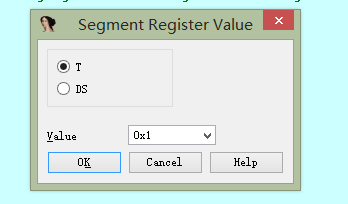
>
> 
>
> 
>
> 
>
> 
>
> 
>
> 
>
> 6、出现异常，经常手动bypass, 可以采用下面方法，一劳永逸：
>
> 打开IDA安装目录\cfg\exceptions.cfg，并在liunux条目下面按照如下方式修改：
>
> 
>
> 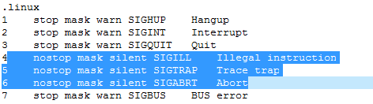
>
> 
>
> 7、如何定位到执行so文件的init或init_array函数
>
> 1）从手机或虚拟机中pull出来linker
>
> 2）搜索字符串” [ Calling %s @ %p for '%s' ]”,见下图：
>
> 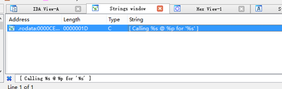
>
> 3)查找引用此字符串的地址：
>
> 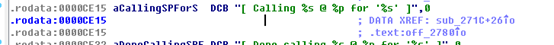
>
> 4)到sub_271C处，见下图 ：
>
> 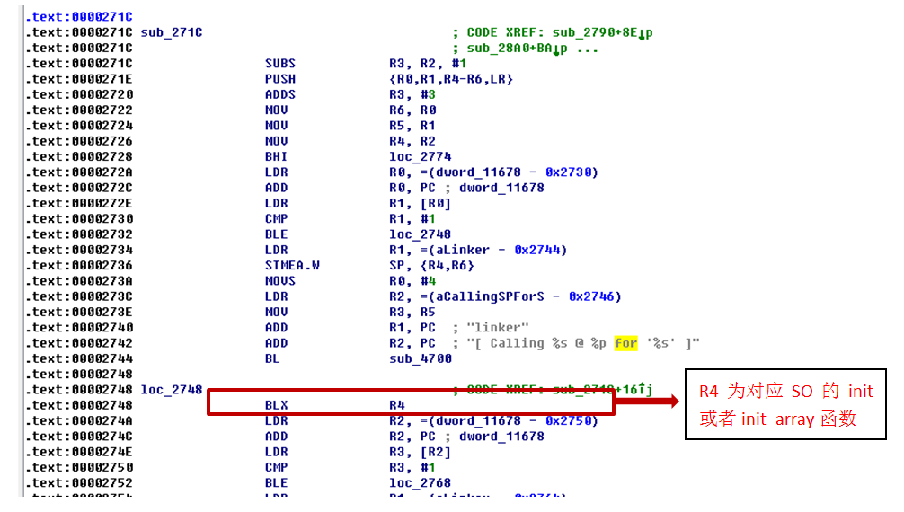
>
> 
>
> 8 如何定位到jni_load
>
> 1)直接在SO文件中查找jni_load设置断点的弊端：
>
> 
>
> a) 如果SO文件被处理了，可能是找不到的
>
> b) 如果对应jni_onload被加密了，直接设置断点，会引起解密失败
>
> 
>
> 2) 从手机或虚拟机中pull出来libdvm.so
>
> 3) 查找函数dvmLoadNativeCode
>
> 见下图：
>
> 
>
> 
>
> 
>
> 
>
> 
>
> 往下看，其中调用dlopen为加载so，返回时so已经加载，同时已经执行了init等初始化函数。 
>
> 
>
> 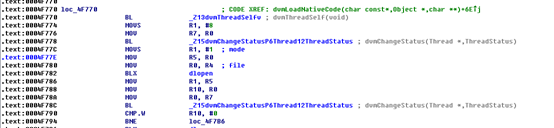
>
> 
>
> 再往下看：
>
> 
>
> 
>
> 
>
> 9 如何定位到RegisterNatives函数
>
> 1）从手机或虚拟机中pull出来libdvm.so
>
> 2）搜索字符串“Registering JNI native methods for class %s”见下图
>
> 
>
> 
>
> 3）查看引用“Registering JNI native methods for class %s”地址
>
> 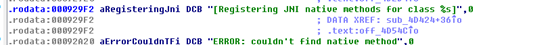
>
> 4）到sub_4D424函数看看如下图:
>
> 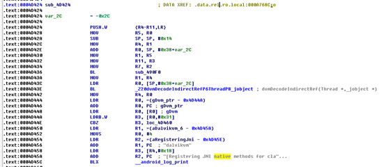
>
> sub_4D424即为RegisterNatives函数地址 
>
> 10 如何定位加载到内存中的dex/jar等的地址
>
> 
>
> 方法一：直接在IDA中按ctrl+S 从已加载中查找，但是可能找不到（对应动态加载）。
>
> 方法二：直接在加载dex/jar的返回结构体中获取
>
> 1) 当dex/jar加载时调用的libdvm.so中的函数openDexFileNative。此函数源码(android4.4)见下图：
>
> 
>
> 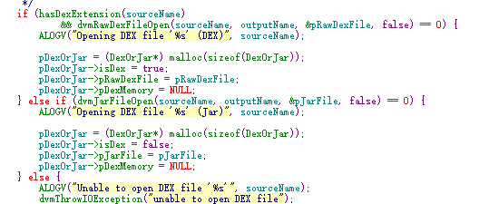
>
> 
>
> 对于dex文件调用dvmRawDexFileOpen(sourceName, outputName, &pRawDexFile, false)，并将加载的信息放入到pRawDexFile中。
>
> 对于jar文件调用dvmJarFileOpen(sourceName, outputName, &pJarFile, false)，并将加载后的信息放入pJarFile中。
>
> 2) 定位openDexFileNative ：搜索字符串“Refusing to reopen boot DEX '%s'”查看引用地址就可以定位，看下图：
>
> 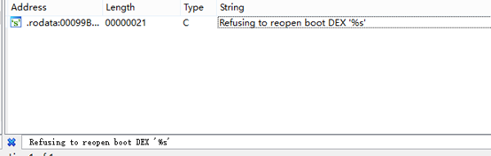
>
> 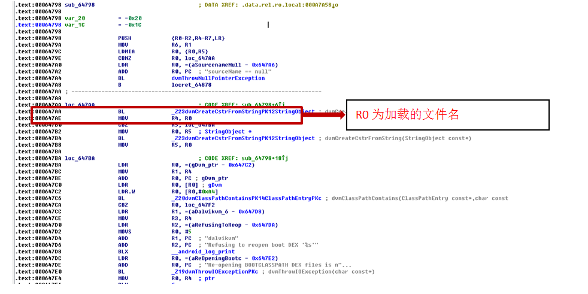
>
> sub_64798即为函数openDexFileNative地址。
>
> 3）对于apk/jar等类型 在下图位置下断点。其中堆栈sp的内容对应的就是JarFile* pJarFile
>
> 
>
> 
>
> 
>
> 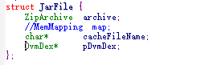
>
> 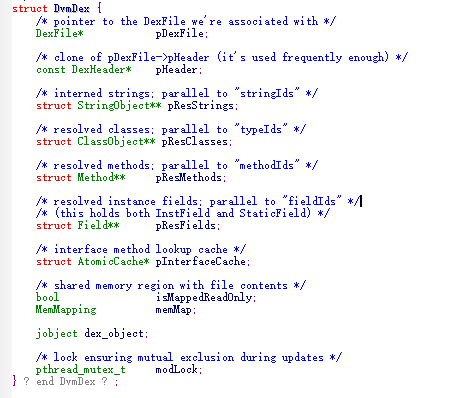
>
> 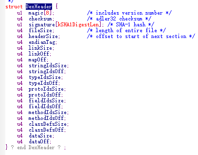
>
> 
>
> 通过上面的结构，获取DEX对应公式如下：Dex addr = [[[sp]+0x28]+4]
>
> 4）对于dex类型文件断在如下位置：
>
> 
>
> 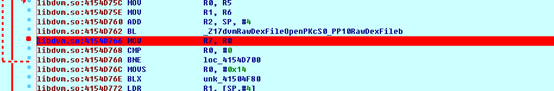
>
> 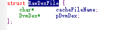
>
> 
>
> 通过上面的结构，获取DEX对应公式如下：Dex addr = [[[sp]+0x4]+4]（此方面暂时没找到dex测试，没有验证哦，不过大体方法类似）。

> 楼主你好，我有个问题
> 如果手机使用的是ART加载，没有libdvm，那么应该使用哪个下函数下断？
> 如果要换系统进行调试的话，应该是刷到哪个版本的系统才有dvm?

对于art模式（以5.1源码为例）对应函数为：

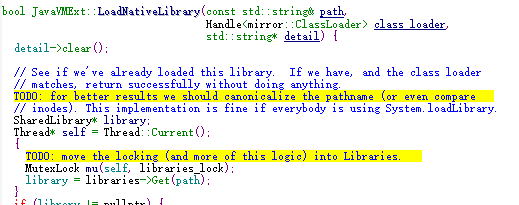

   在libart.so中查找函数 LoadNativeLibrary：、

​           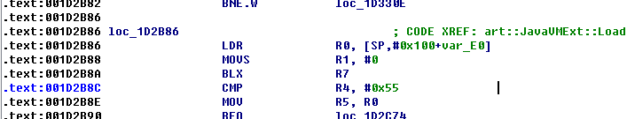

​          BLX  R7  就是调用 SO文件的jni_onload函数位置。

