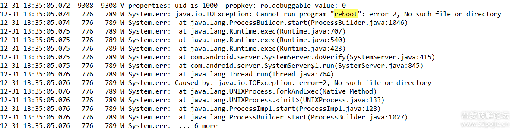
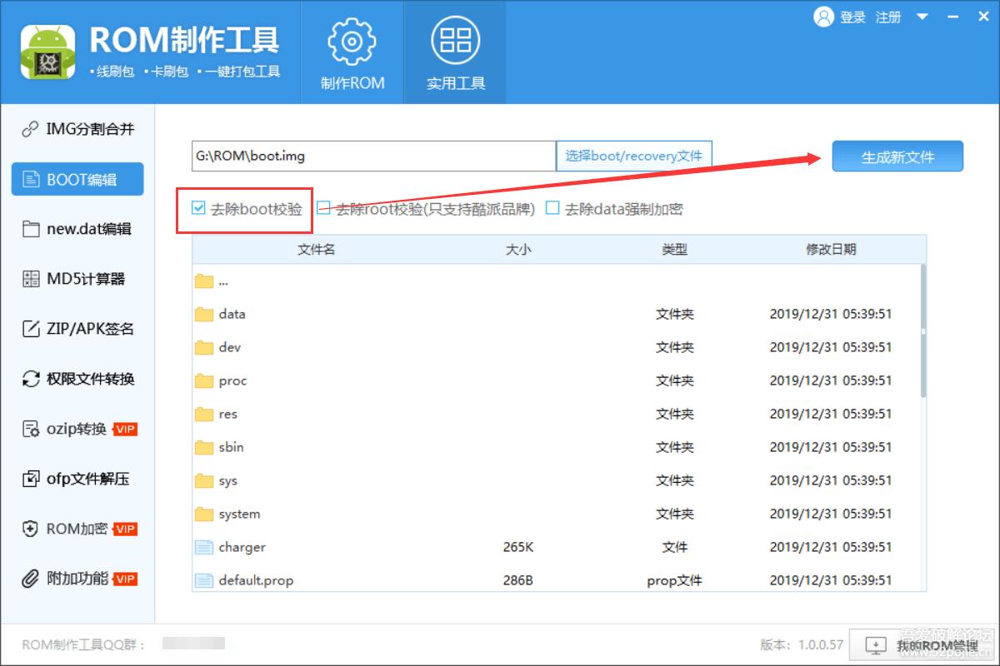

# 绕过rom校验

最近拿到一个ROM，刷入手机后，在联网情况下，手机在几分钟内就会自动重启，不联网就不会重启，猜想这个ROM应该在某处做了验证。看到这，瞬间来了兴致，抓包看看吧，刷入Magisk，获取ROOT权限，把tcpdump推入手机执行，但是并没有抓到什么有用的东西。仔细想想，好像抓包确实不是一个很好的切入点，即使抓到了又如何，也不能知道它在哪里触发重启。思来想去，想来思去，最后想到了一个切入点，把/system/bin/reboot改成其他的名称：` *复制代码* *隐藏代码 *adb shell mv /system/bin/reboot /system/bin/rebeet`好，重启手机` *复制代码* *隐藏代码 *adb reboot`重启后，在联网状态下，等了许久，发现它不自动重启了，大功告成了？结束了？然而我们不满足于此。翻一下logcat，看到了敏感的日志：看到doVerify方法，这可能就是验证的地方。为了寻找com.android.server.SystemServer类在哪个系统库里，在Android源码的frameworks目录下搜索`class SystemServer`寻找这个类所属的Android.mk好了，现在知道它生成时会编译进services.jar,查看一下：` *复制代码* *隐藏代码 *adb shell ls -lh /system/framework/services.jar`` *复制代码* *隐藏代码 *-rw-r--r--. 1 root root 310 8月  6 14:19 /system/framework/services.jar`什么？它才几b？原来这个jar在生成的时候，被优化成odex文件了，它的所有逻辑代码都在它对应的odex里面，具体文件在`/system/framework/oat/arm64/services.odex`把它pull出来，转换成dex，转换成dex需要以下几步：（1）将odex反编译成smali` *复制代码* *隐藏代码 *java -jar baksmali.jar x services.odex`反编译odex的过程中会报很多错误，原因都是缺少依赖，缺少什么依赖，我们就将它从手机pull出来，并放在 services.odex同级目录下，等到不缺依赖的时候，反编译也就能完成了。（2）将smali转换成dex` *复制代码* *隐藏代码 *java -jar smali.jar as out/ -a 28 -o services.dex`好了，把生成的dex拖进jadx反编译，转到`com.android.server.SystemServer`类，搜索上面报错日志中出现的`doVerify`方法，果不其然，找到了我们想要的东西：注：打码的地方是服务器的链接它的校验逻辑是从/proc/cmdline读取serialno，然后将serialno和当前的时间（精确到小时）的格式化形式传入encrypt方法加密得到的字节数组通过hexByteToString方法转成16进制字符串取得到的16进制的字符串，通过Http Get方式去服务器校验服务器传来一个16进制字符串，通过hexStringToByteArray方法将服务器返回的转换成字节数组字节数组又和时间传入上面的encrypt方法，解密得到结果。如果解密结果为pass，说明你的机子验证通过了，很荣幸，你的机子不用重启。如果解密结果为refuse，那就麻烦了，你的机子验证不通过，接受重启的制裁吧！分析到这里也差不多了。在SystemServer类里，调用doVerify方法的就一个地方，我们在smali代码中把它注释掉那么问题来了，修改了生成了dex，要怎么把dex转换成odex？原来我们上面所看到的services.odex属于oat格式，我们可以通过Android自带的dex2oat工具将dex转换成odex，命令如下：

```
adb push services.dex /data/local/tmp/services.dex
adb shell 
export ANDROID_DATA=/data
export ANDROID_ROOT=/system
dex2oat --dex-file=/data/local/tmp/services.dex --oat-file=/data/local/tmp/services.odex  --instruction-set=arm64 --runtime-arg -Xms64m --runtime-arg -Xmx128m
```


成功后，会在/data/local/tmp目录下生成services.odex。odex生成了，把它替换到system镜像吧

```
simg2img system.img system_raw.img
mkdir -p mysystem&&sudo mount -o loop system_raw.img mysystem
cp -f services.odex mysystem/framework/oat/arm64/services.odex
sudo umount mysystem
img2simg system_raw.img system_new.img
```


生成的system_new.img就是我们新打包好的镜像了，把它刷进手机

```
adb reboot bootloader
fastboot flash system system_new.img
fastboot reboot
```


刷好了，重启手机，开机后几分钟，手机还是重启了，怎么回事？明明doVerify方法的调用已经去掉了啊。校对了一下手机里的`/system/framework/oat/arm64/services.odex`，不是我们编译出来的那个。懂了，原来是被系统还原了。找了一番，这种机制叫做dm-verify，开机前会校验系统的完整性。那得想办法去掉它。去掉它一个很简单的办法是借助ROM修改工具处理boot.img，处理时勾选`去除boot校验`处理后，把boot.img刷入手机` *复制代码* *隐藏代码 *fastboot flash boot boot.img`刷入后重启，开机，过了许久发现我们的手机也没有重启，这次真的是大功告成了。**总结：** 这个ROM的验证逻辑还是很简单的，只是在操作的时候要编译来编译去有点麻烦。根据这个案例，让我懂得，如果作为一个ROM的改造者，并且采用重启的方式来限制非注册用户，那么重启的时候，不要采用reboot命令来重启，也不要使用这种简单的加密算法。

- 

  