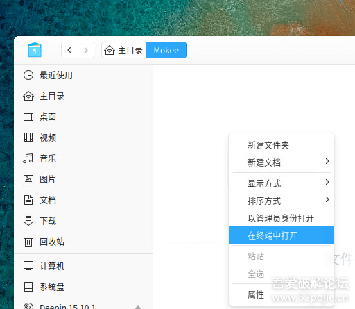
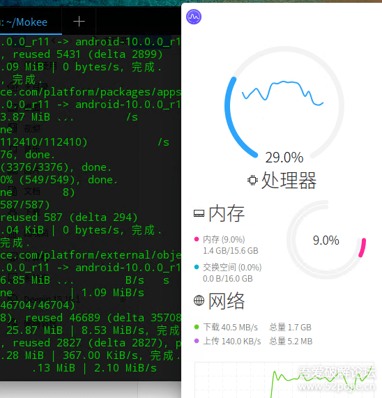
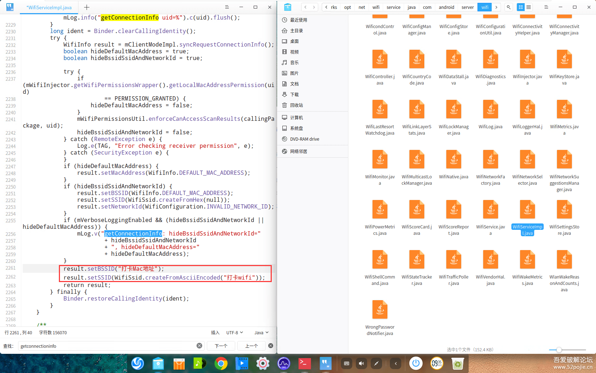
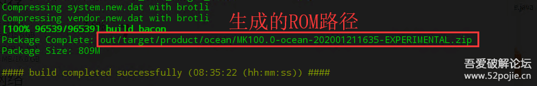

# 自编译ROM：两行代码搞定钉钉打卡 免ROOT永久防封


本文以坚果Pro2s为例，通过自编译ROM，实现免root永久防封的钉钉远程wifi打卡。
定位打卡也可以通过相同方式实现。
**手机：坚果Pro2s（已解锁Bootloader并刷入TWRP）**
**1.**   **环境搭建**
安装**深度15.11或Ubuntu 18.0.4**，并保证200g以上空余硬盘。
然后执行以下命令，安装编译安卓的依赖库：

[Shell] *纯文本查看* *复制代码*

[?](https://www.52pojie.cn/#)

```
sudo` `apt-get ``install` `curl python m4 git ``make` `gcc libssl-dev openssl repo schedtool ccache
```


**2.**   **下载ROM源码（以魔趣为例，其他ROM也一样）**
**注意：必须保证网络良好！否则后续步骤将出现各种报错！只要网络没问题，100%编译成功！**
新建一个文件夹，用于保存ROM源码。


在该文件夹下打开终端




输入以下命令，同步ROM源码（必须保证完全下载，否则后续错误无穷。代码共30多g）：

[Shell] *纯文本查看* *复制代码*

[?](https://www.52pojie.cn/#)

```
repo init -u https:``//github``.com``/MoKee/android` `-b mkq``repo ``sync` `-c -j$(nproc --all) --force-``sync` `--no-clone-bundle --no-tags
```





下载完成后，就可以修改代码然后编译了。
**3.**   **两行代码实现钉钉wifi打卡**
到Mokee/frameworks/opt/net/wifi/service/java/com/android/server/wifi目录，找到WifiServiceImpl.java文件，修改public WifiInfogetConnectionInfo(String callingPackage)方法，在returnresult前加入以下代码即可，如图。

[Java] *纯文本查看* *复制代码*

[?](https://www.52pojie.cn/#)

```
result.setBSSID(``"Mac地址"``);``result.setSSID(WifiSsid.createFromAsciiEncoded(``"打卡wifi名称"``));
```





**4.**   **编译ROM**
执行以下命令进行编译，其中ocean为坚果pro2s的机型代码。
其他设备的机型代码可以在这里查看：https://download.mokeedev.com/

[Shell] *纯文本查看* *复制代码*

[?](https://www.52pojie.cn/#)

```
. build``/envsetup``.sh``lunch mokee_ocean-userdebug``mka bacon -j16
```


编译成功后，会在out目录生成zip刷机包。




**5.**   **将生成的刷机包通过TWRP刷入手机即可**


**其他**
**1.定位打卡**
修改gnsslocationprovider.java，直接reportLocation即可。
**2.移除位置模拟权限，实现免权限任意修改定位**
修改LocationManagerService.java，
找到private boolean canCallerAccessMockLocation(String opPackageName)
返回值改为return true即可
**2.将模拟位置变成真实位置（移除位置模拟标记）**
修改Location.java，
找到public boolean isFromMockProvider()
返回值改为return false即可

**原理说明**
通过定制ROM的方式，直接修改获取wifi或者定位信息的相关接口，实现wifi信息修改、模拟定位。
此方式可以免root，同时未使用xposed等api拦截的方式，从而达到防封的目的。