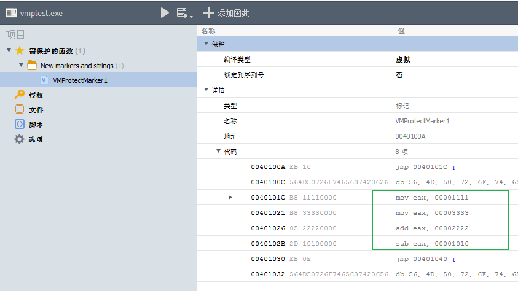
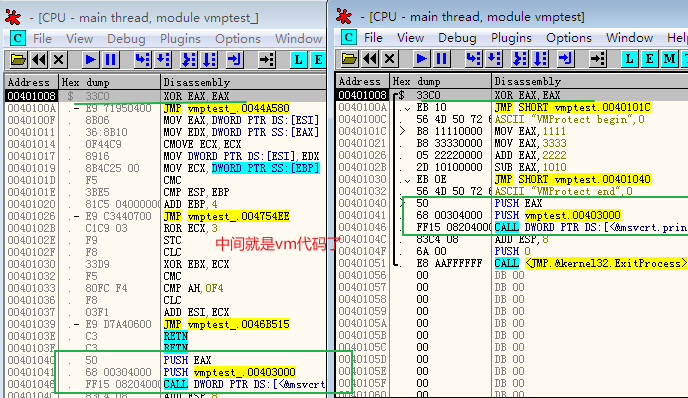
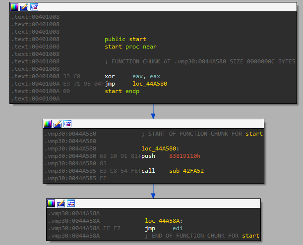
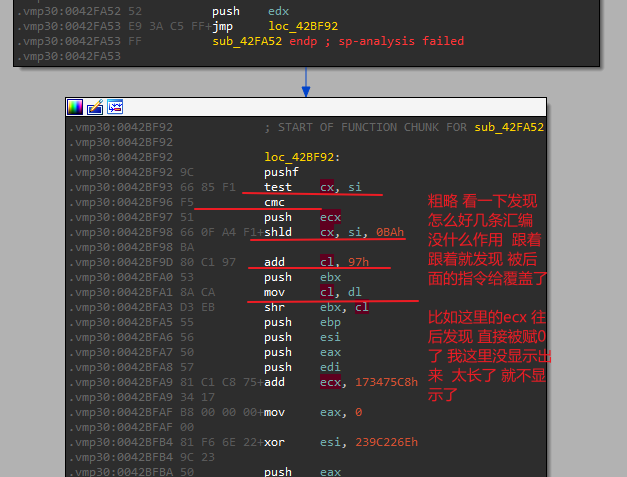
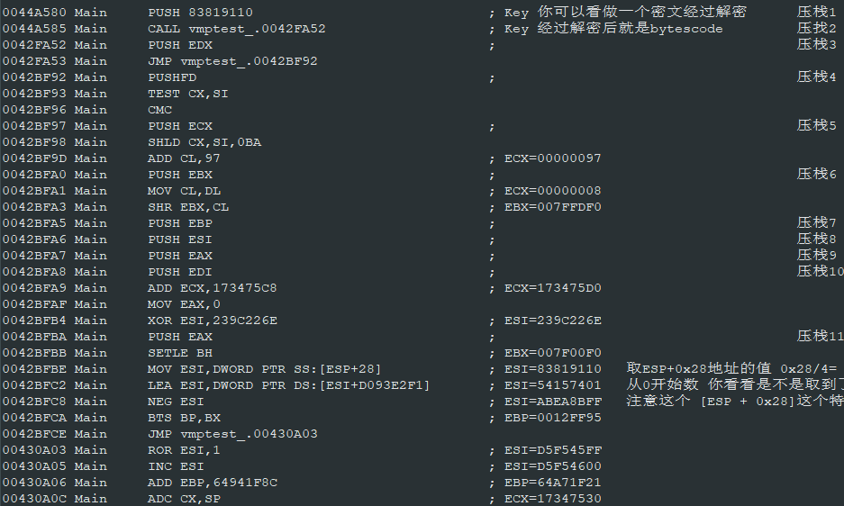
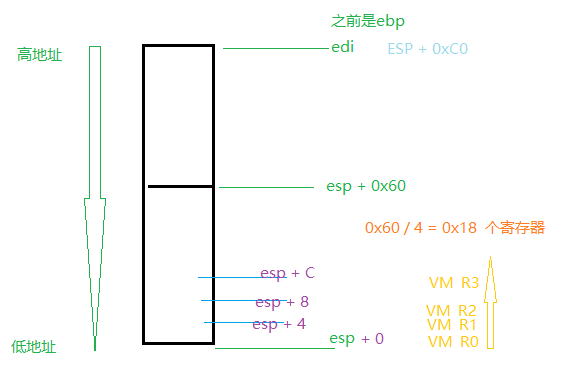
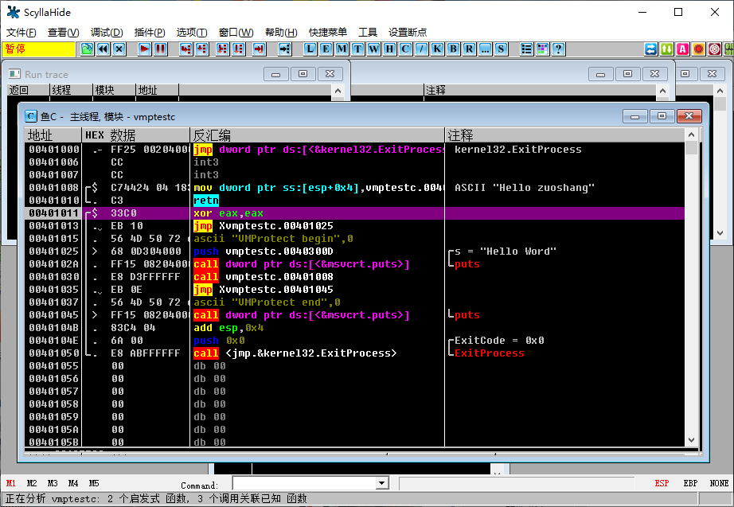
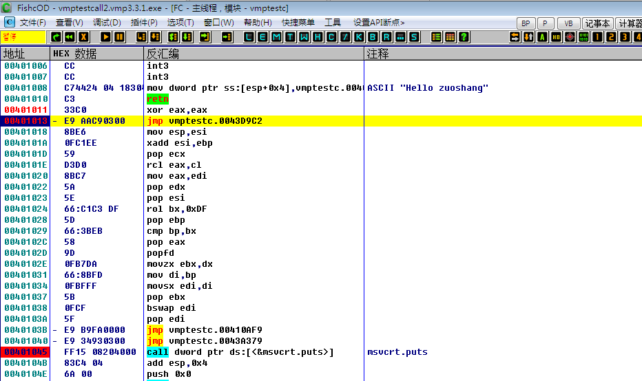

# VMP3逆向分析虚拟机指令 浅析 

URL:https://bbs.pediy.com/thread-266206.htm

#### 分析环境:

windows 10 + OD + IDA7.2 + Win7x32vmware + vmp3.3.1 pro

## 一、初步认识与环境搭建

 看了网上大神们写了好多的vmp 虚拟代码的分析 ,但是在对实在项目时，插件总是提示不对或者未知版本,一直对vm代码的还原有质疑，于是就萌发了具体分析这个vm代码是怎么回事,若有错误,欢迎指出,能力有限只能分析皮毛，只谈vm的代码。首先我们写一下一个简单的demo,主要代码如下,然后输出eax的值,我是用win32asm环境写的，其他部分我就不写出来了，就是常规的框架，这里主要是把下面这4句汇编vm然后分析虚拟机是怎么处理的,如果你没有masm32汇编环境你也可以用vs内联汇编代替:

```
mov eax, 1111H
mov eax, 3333H
add eax, 2222H
sub eax, 1010H
```

然后我们在看看OD上是怎么显示的


 

但是在汇编上是怎么加入这个vm标志的呢我是这样处理的 首先他主要就是加这个jmp xxxx和vmp start等这样的汇编和字符串是吧 但是在汇编层面上我们家这个字符串他就编译不了 我是吧他们都用NOP代替 数数是几个字节 然后写几个NOP 然后编译生成exe后 在用16进制编辑器打开他 修改就可以了。


```
EB 10 56 4D 50 72 6F 74 65 63 74 20 62 65 67 69 6E 00 vmpbegin
EB 0E 56 4D 50 72 6F 74 65 63 74 20 65 6E 64 00 vmpend
```

然后我们用加一下vmp 只做vm代码操作


 

然后其他无关vm代码的我们就关闭了


 

OK 生成 我们打开OD对比一下加壳前和加壳后的代码样子


 

很明显左边被vm了 ，代码很乱是吧 右边的看着很舒服
我们在用IDA打开看看


 

图也是没逻辑 不过看到 push 和call 的组合 与jmp reg 如果之前我们分析过或看过分析vmp的文章的话
这不就是vm的入口吗 进入vm虚拟机的入口 进入sub_42FA52函数 又是很乱的代码


 

我们手工去除一下这些指令 : [patch_byte(here()+i,0x90) for i in range(3)] 我们用0x90(NOP)这个值去去除 那些无用的指令 然后后面那个range(3)中的3用我们自己的肉眼去看是多少个字节 鼠标移动到我们要去除的指令 python命令这里打上上面的脚本语句 修改这个多少个byte 回车即可

```
Python>[patch_byte(here()+i,0x90) for i in range(3)]
[True, True, True]
```

经过我们手工处理后 他大概成下面这个样子 push reg 和 pushf 是环境快照 保存未入虚拟机时的环境

```
.vmp30:0042FA52 52            push    edx   
.vmp30:0042BF92 9C            pushf
.vmp30:0042BF97 51            push    ecx
.vmp30:0042BFA0 53            push    ebx
.vmp30:0042BFA5 55            push    ebp
.vmp30:0042BFA6 56            push    esi
.vmp30:0042BFA7 50            push    eax
.vmp30:0042BFA8 57            push    edi
.vmp30:0042BFAF B8 00 00 00+  mov     eax, 0
.vmp30:0042BFBA 50            push    eax
.vmp30:0042BFBE 8B 74 24 28   mov     esi, [esp+24h+arg_0] ; 这个应该是bytescode地址
.vmp30:0042BFC2 8D B6 F1 E2+  lea     esi, [esi-2F6C1D0Fh] ; ESI 代表了bytescode地址
.vmp30:0042BFC8 F7 DE         neg     esi
.vmp30:00430A03 D1 CE         ror     esi, 1
.vmp30:00430A05 46            inc     esi
.vmp30:00430A13 0F CE         bswap   esi
.vmp30:00430A1D 03 F0         add     esi, eax
.vmp30:00430A1F 8B EC         mov     ebp, esp              ; ebp 为压环境后esp的值
.vmp30:00430A21 81 EC C0 00+  sub     esp, 0C0h             ; esp下移 0xC0
.vmp30:00430A27 8B DE         mov     ebx, esi              ; 注意这里 esp代表vm_context
.vmp30:00430A29 B9 00 00 00+  mov     ecx, 0
.vmp30:00430A30 2B D9         sub     ebx, ecx
.vmp30:00430A35 8D 3D 35 0A+  lea     edi, loc_430A35       ; 跳转base值
.vmp30:00430A45 8B 0E         mov     ecx, [esi]            ; 获取跳转间隔密文
.vmp30:00430A47 81 C6 04 00+  add     esi, 4
.vmp30:00430A4F 33 CB         xor     ecx, ebx
.vmp30:00439FEC 8D 89 D9 95+  lea     ecx, [ecx-21016A27h]
.vmp30:00439FF9 F7 D1         not     ecx
.vmp30:0043A003 F7 D9         neg     ecx
.vmp30:0043A005 8D 89 71 E2+  lea     ecx, [ecx-5AFB1D8Fh]
.vmp30:00416562 0F C9         bswap   ecx
.vmp30:00416564 33 D9         xor     ebx, ecx
.vmp30:0041656B 03 F9         add     edi, ecx              ; 解密跳转间隔
.vmp30:0045F2B5 57            push    edi                   ; 压栈反弹进入vm指令
.vmp30:0045F2B6 C3            retn
```

看着没什么复杂的，就是压入寄存器保存未进入虚拟机时的环境状态,然后给虚拟机的栈和寄存器开辟空间，esi指向bytescode 中间那里取了一个4byte值然后指针+4 取的值是密文经过 解密得出正在的值 这个值是要跳转的长度,从哪里跳转相对谁,edi给出了答案 (汇编代码这么乱 而且无用的指令一大堆 时隔多年后 我们才知道这个叫混淆)

 

那么到这里我们得到了什么信息:
1.未进入虚拟机时,环境状态的压入
2.虚拟机初始化,栈(EBP)、寄存器组(ESP)、跳转base(EDI)、字节码(ESI)、解密因子(EBX)
我给的这个名字名称可能是和别人分析的名字不一样 不过内容是一样的 本质没什么区别

 

那么这个时候我们就问了，我们怎么知道EBP是虚拟机的栈、ESP是寄存器组(或者说vm_context)和ESI是字节码(Bytescode)呢 当然我们可以看前人分析的结果是吧 但是我们应该说的是一个无到有的过程 而不是直接就说他是了 然后我们在回过头了 假如我们不知道vm中esp是什么 ebp是什么，但是esi 这个应该可以看出来了 他肯定是保存了一串数据的 那么这一串数据是什么 我们暂且不清楚 但是我们看到有个取值 然后解析这个存在 有点像eip 是不 虚拟机是不是就是执行模拟 翻译 你看看这个有没有点对上的意思 然后在看看edi 他明显是赋值一个地址 然后 +解密后的间隔 运行下去


 

现在我们脑子应该是有一个印象了 这里我先写一个类似OD的界面 看看当然有的我还没给出怎么识别 我们后面会给出 差不多就是这个样子

## 二、VM代码的提取

 承接上文，我们写了个例子，然后用vmp3.3.1加壳程序把那4句汇编代码给VM了，那么VM的代码是哪里到哪里，我们用OD的run trace去跟踪提取。操作如下:

- 1.首先下2个断点 在准备进入VM代码和退出VM代码执行未VM代码位置下断点
  

od view(查看)菜单里面有 run trace 我们 点击进去 然后右键记录到文件 方便我们后面好静态分析
*如果你的run trace记录的文件没有汇编 参数等 请百度设置一下trace选项*

- 2.然后我们按F9到达我们第一个断点 在按快捷键Ctrl+F11 跟踪步入 然后到我们的第二个断点，这个时候 我们查看我们run trace查看追踪出的信息 然后右键关闭记录文件 下图是记录的跟踪信息
  

然后看看保存的跟踪文件大概是这个样子 我有处理过


 

那么到现在我们就把vm后的代码给扒下来了 之后我们只要好好分析这个文件就OK了
下面我们先搜索一下我们之前vm的汇编中的常量 我们先搜索第一个 1111 为什么是00001111就不多解释了

```
0041DB98 Main     BSWAP ECX                                    ; ECX=00001111
0041DB9A Main     RCR AH,CL
0041DB9C Main     OR EAX,EBP                                   ; EAX=0041DBFF
0041DB9E Main     NEG AX                                       ; EAX=00412401
0041DBA1 Main     XOR EBX,ECX                                  ; EBX=0046B588
0041DBA3 Main     BSR EAX,ESP                                  ; EAX=00000014
0041DBA6 Main     SUB EDI,4                                    ; EDI=0012FF88
0041DBAC Main     LAHF                                         ; EAX=00000614
0041DBAD Main     MOV DWORD PTR DS:[EDI],ECX
```

我们去一下混淆

```
0041DB98 Main     BSWAP ECX                                    ; ECX=00001111
0041DBA6 Main     SUB EDI,4                                    ; EDI=0012FF88
0041DBAD Main     MOV DWORD PTR DS:[EDI],ECX
```

就这3句有用的 得到00001111 怎么来的我们先不深究 EDI-=4 然后在向 [EDI]=ECX 这个像不像是压栈的操作，栈的增长方向是向下的是吧 栈顶减小就是压栈 (思考一下 那有没有栈顶减小的是出栈呢)。回到上文(一、认识与环境搭建)中我们说了ebp是代表栈，EDI是跳转基址(JumpBase)，怎么现在又说这个EDI是代表栈了。莫急我们在往下看看

```
0041DBBF Main     MOV EAX,DWORD PTR DS:[ESI]                ; EAX=1AB34C77
0041DBC1 Main     CMP EDX,EDX
0041DBC3 Main     XOR EAX,EBX                               ; EAX=1AF5F9FF
0041DBC5 Main     JMP vmptest_.0046A2FF
0046A2FF Main     BSWAP EAX                                 ; EAX=FFF9F51A
0046A301 Main     JMP vmptest_.00476E95
00476E95 Main     DEC EAX                                   ; EAX=FFF9F519
00476E96 Main     NOT EAX                                   ; EAX=00060AE6
00476E98 Main     JMP vmptest_.0044E862
0044E862 Main     DEC EAX                                   ; EAX=00060AE5
0044E863 Main     XOR EBX,EAX                               ; EBX=0040BF6D
0044E865 Main     JMP vmptest_.0041F316
0041F316 Main     ADD EBP,EAX                               ; EBP=0047E65C
0041F318 Main     JMP vmptest_.00472E41
00472E41 Main     LEA EDX,DWORD PTR SS:[ESP+60]             ; EDX=0012FF00
00472E45 Main     TEST DH,AL
00472E47 Main     CLC
00472E48 Main     CMP EDI,EDX
00472E4A Main     JMP vmptest_.0046EE86
0046EE86 Main     JA vmptest_.00480A05
00480A05 Main     JMP EBP
```

很乱我们去混淆一下

```
0041DBBF Main     MOV EAX,DWORD PTR DS:[ESI]                ; EAX=1AB34C77
0041DBC3 Main     XOR EAX,EBX
0046A2FF Main     BSWAP EAX                                 ; EAX=FFF9F51A
00476E95 Main     DEC EAX                                   ; EAX=FFF9F519
00476E96 Main     NOT EAX                                   ; EAX=00060AE6
0044E862 Main     DEC EAX                                   ; EAX=00060AE5
0041F316 Main     ADD EBP,EAX                               ; EBP=0047E65C
00472E41 Main     LEA EDX,DWORD PTR SS:[ESP+60]             ; EDX=0012FF00
00472E48 Main     CMP EDI,EDX
0046EE86 Main     JA vmptest_.00480A05
00480A05 Main     JMP EBP
```

我们看到esi 还是bytescode 他这里是得到了跳转间隔密文， 我们往的话发现之前的00001111值也是从esi中得到密文解密出来的，那么说明esi里面不仅存在数据常量也有跳转间隔， 而且他们都是密文 然后回到这里 我们又发现 ebp变为了跳转base(JumpBase)。看到00472E41 这条指令 给edx赋值 esp + 0x60 你还记得最开始虚拟机入口时 那两句汇编吗

```
.vmp30:00430A1F 8B EC         mov     ebp, esp              ; ebp 为压环境后esp的值
.vmp30:00430A21 81 EC C0 00+  sub     esp, 0C0h             ; esp下移 0xC0
```

然后我们之前说了 edi是栈， 因为上面那个语句是edi-=4 然后把00001111赋值给这个EDI指向的地址(其实这里我们截取了VM_PushImm32指令分析的) 是吧， 然后edi就是栈 然后edi这里又与这个esp + 0x60比教， 这里的结果是大于的结果(因为是追踪出来的所以只有一个分支)我们结合这3个块 分析出一个图


 

那么这个图到底正确不正确或者完善了没呢? 到目前我们分析的我觉得应该是没问题的，目前只是我们的初略分析。

## 三、详细分析

 我们先分析一下头和尾，那我们怎么知道哪里才是一个VM指令的开始和结束呢？记得jmp reg 和 push + ret 没，我们就由这两个去确定一个VM指令的范围

- A、分析一下VM进入的操作

```
VM_Entry
----------------------------------------------------------------
0044A580 Main     PUSH 83819110                             ; Key 你可以看做一个密文经过解密    压栈1  Key
0044A585 Main     CALL vmptest_.0042FA52                    ; Key 经过解密后就是bytescode 压找2  压返回地址
0042FA52 Main     PUSH EDX                                  ; 压栈3  EDX
0042FA53 Main     JMP vmptest_.0042BF92
0042BF92 Main     PUSHFD                                    ; 压栈4  eflags符号寄存器
0042BF93 Main     TEST CX,SI
0042BF96 Main     CMC
0042BF97 Main     PUSH ECX                                  ; 压栈5  ECX
0042BF98 Main     SHLD CX,SI,0BA
0042BF9D Main     ADD CL,97                                 ; ECX=00000097
0042BFA0 Main     PUSH EBX                                 ;  压栈6  EBX
0042BFA1 Main     MOV CL,DL                                 ; ECX=00000008
0042BFA3 Main     SHR EBX,CL                                ; EBX=007FFDF0
0042BFA5 Main     PUSH EBP                                 ; 压栈7  EBP
0042BFA6 Main     PUSH ESI                                  ; 压栈8  ESI
0042BFA7 Main     PUSH EAX                                 ; 压栈9  EAX
0042BFA8 Main     PUSH EDI                                  ; 压栈10 EDI
0042BFA9 Main     ADD ECX,173475C8                          ; ECX=173475D0
0042BFAF Main     MOV EAX,0
0042BFB4 Main     XOR ESI,239C226E                          ; ESI=239C226E
0042BFBA Main     PUSH EAX                                  ; 压栈11 0x00000000
0042BFBB Main     SETLE BH                                  ; EBX=007F00F0
0042BFBE Main     MOV ESI,DWORD PTR SS:[ESP+28]             ; ESI=83819110   取ESP+0x28地址的值 0x28/4= 10 往上数第10个
0042BFC2 Main     LEA ESI,DWORD PTR DS:[ESI+D093E2F1]       ; ESI=54157401   从0开始数 你看看是不是取到了Key的值 注意
0042BFC8 Main     NEG ESI                                   ; ESI=ABEA8BFF   注意这个 [ESP + 0x28]这个特征 现在赋值给ESI
0042BFCA Main     BTS BP,BX                                 ; EBP=0012FF95
0042BFCE Main     JMP vmptest_.00430A03
00430A03 Main     ROR ESI,1                                 ; ESI=D5F545FF
00430A05 Main     INC ESI                                   ; ESI=D5F54600
00430A06 Main     ADD EBP,64941F8C                          ; EBP=64A71F21
00430A0C Main     ADC CX,SP                                 ; ECX=17347530
00430A0F Main     BTR EDI,73
00430A13 Main     BSWAP ESI                                 ; ESI=0046F5D5
00430A15 Main     CMOVPE EBX,ESI                            ; EBX=0046F5D5
00430A18 Main     BTC BP,8C                                 ; EBP=64A70F21
00430A1D Main     ADD ESI,EAX
00430A1F Main     MOV EBP,ESP                               ; EBP=0012FF60  ;注意这里EBP的赋值 记住这里现在ebp是上面压的栈顶
00430A21 Main     SUB ESP,0C0                              ; 和这里esp的开栈 其实这里是给vm_context开空间
00430A27 Main     MOV EBX,ESI                                               ;和给vm_ss开空间
00430A29 Main     MOV ECX,0                                 ; ECX=00000000  ;注意这里有个mov ebx,esi 解密因子 我接下来就不
00430A2E Main     OR EDI,EBP                                ; EDI=0012FF60  ;会去多提他 如果你要运行程序你就要注意他 这个解密因子 往上看是不是Key解密而来的
00430A30 Main     SUB EBX,ECX                             ;分析好几个vm 分析ebx一直指向这个vm_decryptfactor
00430A32 Main     ROL CX,CL                                 ;我不知道这样叫他对不对 不过这不是重点
00430A35 Main     LEA EDI,DWORD PTR DS:[430A35]             ; EDI=00430A35  ;知道他是干什么的就可以了
00430A3B Main     SUB CX,SI                                 ; ECX=00000A2B ;看到这里的LEA 本身这个指令上一个地址 没错他就是vm_JumpBase 相对谁去跳到下一个地址 肯定是当前
00430A3E Main     OR CL,0D5                                 ; ECX=00000AFF
00430A41 Main     ROL CX,23                                 ; ECX=000057F8
00430A45 Main     MOV ECX,DWORD PTR DS:[ESI]                ; ECX=B0D37F60 ;到这里 经过解密之后ESI才是真正的vm_bytescode
00430A47 Main     ADD ESI,4                                 ; ESI=0046F5D9 ;你或者叫他(ESI)为跳转间隔 好像也没什么错
00430A4D Main     TEST EDI,EBX                              ; 取值后 ESI +=4 往后移
00430A4F Main     XOR ECX,EBX                               ; ECX=B0958AB5
00430A51 Main     JMP vmptest_.00439FEC
00439FEC Main     LEA ECX,DWORD PTR DS:[ECX+DEFE95D9]       ; ECX=8F94208E
00439FF2 Main     CMP AX,25AD
00439FF6 Main     TEST BH,90
00439FF9 Main     NOT ECX                                   ; ECX=706BDF71
00439FFB Main     TEST AL,DL
00439FFD Main     CMC
00439FFE Main     CMP SP,7CB8
0043A003 Main     NEG ECX                                   ; ECX=8F94208F
0043A005 Main     LEA ECX,DWORD PTR DS:[ECX+A504E271]       ; ECX=34990300
0043A00B Main     JMP vmptest_.00416562
00416562 Main     BSWAP ECX                                 ; ECX=00039934
00416564 Main     XOR EBX,ECX                               ; EBX=00456CE1
00416566 Main     CMP SI,130B
0041656B Main     ADD EDI,ECX                               ; EDI=0046A369 ;上面说到了取bytescode链上的值
0041656D Main     JMP vmptest_.0045F2B5                     ; 经过解密后 与JumpBase相加得到下一个指令的地址
0045F2B5 Main     PUSH EDI                                 ; 然后把这个地址压栈 RET反弹给物理机EIP
0045F2B6 Main     RETN                                     ;或者这里你可能也会遇到jmp edi 他们是一样的功能
---------------------------------------------------------------------------------------------
```

上面这个我们没有去混淆，我们直接分析了。那么肯定是有技巧的是吧，从上往下看，push 和pushfd肯定要保留，这个是重要的，然后从下往上分析，EDI是重要的，然后看到谁影响了EDI一直这样往上找去，有关的提取出来。另外关于ESP寄存器的要保留下来，主要是ESP减0xC0这个开VM栈空间和VM_REG空间，还有ESP在减0xC0之前把值给了谁，谁就是VM_ESP即vm栈顶(栈底)，当然给的这个寄存器不在传递给其他寄存器的话才行，但目前我并没有遇到还在传递的情况。我们是看了开始,我们在看看紧跟着的VM指令:

```
VM_PopReg32  vm_context->0x10
---------------------------------------------------------------------------------------------
0046A369 Main     MOV EAX,DWORD PTR SS:[EBP]                ;返回上面看看我们说EBP是上面压的物理环境的栈顶
0046A36D Main     STC                                                       ;
0046A36E Main     ROR DL,CL                                 ; EDX=00401080
0046A370 Main     LEA EBP,DWORD PTR SS:[EBP+4]              ; EBP=0012FF64 ;这里EBP = EBP + 4 栈回缩是不 那不就是出栈的意思
0046A376 Main     MOVZX EDX,BYTE PTR DS:[ESI]               ; EDX=0000008D ;注意这种取1byte的指令类似这个
0046A379 Main     CMP CX,BP
0046A37C Main     ADD ESI,1                                 ; ESI=0046F5DA ;ESI+1  刚刚说了esi是bytescode 他也保存了寄存器
0046A382 Main     CMP CX,4F65                                              ;编号  我们不是之前叫他跳转间隔吗 噢见鬼了
0046A387 Main     CMP ECX,EBX                                              ;反正我们知道他有这样的能力就可以  这里ESI+=1
0046A389 Main     XOR DL,BL                                 ; EDX=0000006C ;有可能他不是正向走 可能是-1 那上面的也对应-4
0046A38B Main     TEST DI,5D07                                             ;这没什么好争论的不是吗  具体看汇编就出来了
0046A390 Main     STC                                                      ;为什么会这么说 是以为我之前有遇到是反向增长
0046A391 Main     NOT DL                                    ; EDX=00000093 ;看到上面的 xor dl,bl  记得我说的EBX是解密因子了没
0046A393 Main     CMP DI,2768
0046A398 Main     JMP vmptest_.0043EDAF
0043EDAF Main     SUB DL,8B                                 ; EDX=00000008
0043EDB2 Main     CMC
0043EDB3 Main     ROR DL,1                                  ; EDX=00000004
0043EDB5 Main     DEC DL                                    ; EDX=00000003
0043EDB7 Main     JMP vmptest_.00413DC1
00413DC1 Main     NOT DL                                    ; EDX=000000FC
00413DC3 Main     CMP SP,6B29
00413DC8 Main     JMP vmptest_.00416D48
00416D48 Main     ADD DL,14                                 ; EDX=00000010
00416D4B Main     STC
00416D4C Main     XOR BL,DL                                 ; EBX=00456CF1;而这里我们主要关心EDX的值不是吗 这里是0x10
00416D4E Main     MOV DWORD PTR SS:[ESP+EDX],EAX            ; 发现EDX是从上面去esi地址1byte值经过变化而来的
00416D51 Main     AND DH,0F7                                ; 而我们之前说的什么ESP指向的是vm_context是吧
00416D54 Main     NEG DX                                    ; EDX=0000FFF0;在结合我们上面的分析 这应该是一个出栈的操作
00416D57 Main     MOV EDX,DWORD PTR DS:[ESI]                ; EDX=E45184BF;在次取ESI (bytescode)的值 关键 这个是跳转间隔密文
00416D59 Main     CMP ESI,EDI
00416D5B Main     CMC
00416D5C Main     JMP vmptest_.00419F08
00419F08 Main     ADD ESI,4                                 ; ESI=0046F5DE;ESI += 4
00419F0E Main     STC
00419F0F Main     XOR EDX,EBX                               ; EDX=E414E84E
00419F11 Main     TEST DH,36
00419F14 Main     XOR EDX,29474E33                          ; EDX=CD53A67D
00419F1A Main     TEST ESP,EDX
00419F1C Main     ADD EDX,64682765                          ; EDX=31BBCDE2
00419F22 Main     JMP vmptest_.00472890
00472890 Main     NEG EDX                                   ; EDX=CE44321E
00472892 Main     TEST SI,BX
00472895 Main     STC
00472896 Main     ADD EDX,44017C67                          ; EDX=1245AE85
0047289C Main     JMP vmptest_.00463068
00463068 Main     ROR EDX,1                                 ; EDX=8922D742
0046306A Main     CMP CX,DI
0046306D Main     STC
0046306E Main     CMP DI,358A
00463073 Main     NEG EDX                                   ; EDX=76DD28BE
00463075 Main     JMP vmptest_.0047F903
0047F903 Main     BSWAP EDX                                 ; EDX=BE28DD76
0047F905 Main     INC EDX                                   ; EDX=BE28DD77
0047F906 Main     STC
0047F907 Main     XOR EDX,41D507D0                          ; EDX=FFFDDAA7
0047F90D Main     XOR EBX,EDX                               ; EBX=FFB8B656;注意这里解密因子 ebx 改变 每一个vm指令都有这个
0047F90F Main     CMP SP,BP
0047F912 Main     TEST EDX,29E10AB5                         ;解密因子的参与  接下来我就不多提他了 记得每个指令都有
0047F918 Main     STC                                     ;而且每运行一个vm指令 他都会变
0047F919 Main     ADD EDI,EDX                             ; EDI=00447E10;跳转间隔经过解密后 与JumpBase相加
0047F91B Main     JMP vmptest_.00420B9F
00420B9F Main     PUSH EDI
00420BA0 Main     RETN                                      ;跳转到下一条指令地址
-------------------------------------------------------------------------------------------------
```

然后针对VM指令非入口和出口的分析，也有方法，当然可能这些方法这是适用我们当前遇到的指令(即目前这个demo)。看到第一条指令是取VM_ESP位置的uint32_t值 ，然后VM_ESP回缩4byte，第一反应就是这个应该是pop操作，在往下看看，能不能看到MOV [ESP + REG1],REG2 这个样子的汇编，OK能找到，那么明显就是栈中弹数据到VM_REG中了。在往下看是取VM_Bytescode中的值然后解密与VM_JumpBase相加。无疑是VM_PopReg32了，但是那个寄存器呢？看到

```
00416D4E Main     MOV DWORD PTR SS:[ESP+EDX],EAX            ;往上看到EDX的值 看右边的追踪结果 EDX=0x10
```

所以我们这里应该翻译为VM_PopReg32 vm_context->0x10 或者 VM_PopReg32 DwReg4 (0x10/4=4) 可能名字和别人不一样，差不多就是这个意思。注意看看这个EDX的值也是从VM_Bytescode中得到解密出来的。然后紧跟着的几条重要的VM指令我就不一一分析了，和上面是同理的，我直接贴分析出的VM指令

```
[---------VM_Init--------]  这里我们可以又把这几条vm指令解释为VM_Init 主要是把物理环境反弹到虚拟机里面
/----------------------------------------------------------------------
VM_PopReg32  vm_context->0x10   0x00000000
 
VM_PopReg32  vm_context->0x2C  
 
VM_PopReg32  vm_context->0x18
 
VM_PopReg32  vm_context->0x28
 
VM_PopReg32  vm_context->0x20   0x0012FF94
 
VM_PopReg32  vm_context->0x08   0x7FFDF000
 
VM_PopReg32  vm_context->0x24   0x00000000
 
VM_PopReg32  vm_context->0x3C   0x00000246
 
VM_PopReg32  vm_context->0x30   0x00401008
 
VM_PopReg32  vm_context->0x14   0x0044A58A           那我们很早之前说的上面压栈是保存物理机环境就不太对了
 
VM_PopReg32  vm_context->0x0C   0x83819110           应该说是 物理机环境映射到虚拟机的一个过渡
\-------------------------------------------------------------------------
```

把物理环境弹入VM寄存器环境后,重新调整vm_bytescode的指向和之前的VM_REG乱序，就比如上面这个vm_context->0x14是push + call 中call的下一个地址 ，经过调整后vm_context->0x14也就不是这个地址了(这个地址并不是退出VM后仅跟着的执行真实汇编的地址)，再比如EBP是vm_bytescode，变换后EBP可能就不是了，可能是EBX或者EAX等。我就不贴代码了，之后会有整理。

- B、分析一下VM退出的操作

```
VM_Exit
/------------------------------------------------------------------------------
0047A839 Main     MOV ESP,EDI                               ;虚拟机栈给物理机esp栈 没错了这里应该是要
0047A83B Main     OR AX,CX                                  ; EAX=0000EFEA;返回物理机了
0047A83E Main     POP ECX                                   ; ECX=00000000;弹栈  ECX
0047A83F Main     ROR DX,CL                                 ;看到这么多pop 看来是真的要还原到物理机了
0047A842 Main     CMP DH,DL                                 ;在看看我们的进度条 也到底了 终于分析完了
0047A844 Main     POP EBP                                   ; EBP=0012FF94;弹栈  EBP
0047A845 Main     POP EAX                                   ; EAX=00004545;弹栈  EAX
0047A846 Main     POP EBX                                   ; EBX=7FFDF000;弹栈  EBX
0047A847 Main     OR DI,73E7                                ; EDI=0012FFEF
0047A84C Main     ADC DI,6287                               ; EDI=00126276
0047A851 Main     CMOVO SI,DI
0047A855 Main     POP EDI                                   ; EDI=00000000;弹栈  EDI
0047A856 Main     CWD                                       ; EDX=00120000
0047A858 Main     POPFD                                                   ;弹栈  EFLAGS  符号寄存器
0047A859 Main     POP ESI                                   ; ESI=00000000;弹栈  ESI
0047A85A Main     POP EDX                                   ; EDX=00401008;弹栈  EDX
0047A85B Main     RETN                                                    ;返回物理机
    Breakpoint at vmptest_.00401040
 
00401040 Main     PUSH EAX                                  ; <%04X> = 4545 返回物理机第一条汇编
    Run trace closed
```

我们可以看到ESP寄存器的值被EDI赋值了，然后从栈中弹出值到物理机(真实环境)的寄存器中。那么这个EDI应该是被安排了真实环境的值，很可能他就是VM_ESP是吧。我们在往上分析一下看看，我直接贴关键的VM指令

```
[---------VM_Destroy----------] 下面的这几句你可以各类为新的vm指令 他其实就是准备退出虚拟机时把 处理后的物理环境压栈
/----------------------------------------------------------------------------------------
VM_PushImm32 0x00401040        retAddr
 
VM_PushReg32 vm_context->0x14  0x00401008
 
VM_PushReg32 vm_context->0x30  0x00000000
 
VM_PushReg32 vm_context->0x18  0x00000202
 
VM_PushReg32 vm_context->0x24  0x00000000
 
VM_PushReg32 vm_context->0x04  0x7FFDF000
 
VM_PushReg32 vm_context->0x10  0x00004545  我们要的最终值
 
VM_PushReg32 vm_context->0x3C  0x0012FF94
 
VM_PushReg32 vm_context->0x28  0x00000000
\-------------------------------------------------------------------------------------------
```

这里我就不展示EDI是VM_ESP了，我可以告诉你他是的。看看这个返回地址他是由VM_Bytescode中得到的，还记得我们VM_Entry进来时压的那个push + call 中 call指令后面的地址吗，不是返回仅跟着CALL后面地址的位置，所以我们往往在那个地方下断点就没作用。

## 四、分析那4条汇编被VM的VM指令

 其他无关的我就不贴上来了，我直接贴上分析出的VM指令，怎么分析出的，和上面的分析VM指令同理

```
\----------------------------------------------------------------
 
                                                  >>>>>>>>>>>>>>>>>>>>>>>>vm的汇编解析
VM_PushImm32 0x00001111
 
VM_PopReg32  vm_context->0x1C   0x00001111
 
VM_PushImm32 0x00003333
 
VM_PopReg32  vm_context->0x00   0x00003333
 
VM_PushImm32 0x00002222                       执行下面的VM_Add后  | dwResult 0x00005555
 
VM_PushReg32 vm_context->0x00   0x00003333                        | eflags   0x00000206
 
VM_Add
 
VM_PopReg32  vm_context->0x1C   0x00000206 EFLAGS
 
VM_PopReg32  vm_context->0x1C   0x00005555
 
VM_PushImm32 0x00001010
 
VM_PushReg32 vm_context->0x1C   0x00005555 dwResult 上一次Add的结果
 
VM_PushReg32 vm_context->0x1C   0x00005555
 
VM_Nand                         执行后 [ESP] = EFLAGS = 0x286  [ESP+4]=0xFFFFAAAA
 
VM_PopReg32  vm_context->0x00   0x286 弹出这个后 现在栈上应该是[ESP]=0xFFFFAAAA [ESP+4]=0x0x00001010
 
VM_Add                          执行这个这里后  [ESP] = EFLAGS = 0x282    [ESP+4]=0xFFFFBABA
 
VM_PopReg32  vm_context->0x0C   0x282 eflags
 
VM_PushReg32 vm_esp             现在[ESP] = ESP+4 即保存这个地址 这个地址对应的值是 0xFFFFBABA 没问题吧
 
VM_SSReadMemSS                  把栈顶的值当mem读 值返回到自身 [ESP]=[[ESP]] = [ESP + 4] = 0xFFFFBABA
 
VM_Nand                         还没运行这个指令时[ESP]=0xFFFFBABA [ESP+4]=0xFFFFBABA
 
VM_PopReg32  vm_context->0x20   0x202  eflags
 
VM_PopReg32  vm_context->0x10   0x00004545  到这里 可以说这4句汇编已经运行完毕了
 
VM_PushReg32 vm_context->0x0C   0282        但是还要处理这个符号寄存器的值应该是多少
 
VM_PushImm32 0x815              因为我们是用其他方式去解析这个解法 是吧 那么每一步的eflags的变化
 
VM_Nor                          dwResult = 0xFFFFFFFF
 
VM_PopReg32  vm_context->0x00   0x286 eflags        那么这些每一步eflags的变化怎么转化为减法时产生的eflags一致呢
 
VM_PushReg32 vm_esp           
 
VM_SSReadMemSS                 看到很多vm指令可以合为一个我们认识的指令是吧 比如这里的 压esp 直接读[[esp]]值反回[ESP]
 
VM_Nand                        其实就是 VM_Nand(0xFFFFFFFF,0xFFFFFFFF) -> dwResult = 0x00000000
 
VM_PopReg32  vm_context->0x1C  0x246 eflags
 
VM_PushReg32 vm_context->0x20  0x202
 
VM_PushReg32 vm_context->0x20  0x202
 
VM_Nor                         ~0x202 & ~0x202 =  0xfffffdfd
 
VM_PopReg32  vm_context->0x18  0x282
 
VM_PushImm32 0x815             ----------  这里应该是提取 OF、ZF 标志 -------------
 
VM_Nand                        ----------------------------------------------------
 
VM_PopReg32  vm_context->0x1C  eflags 这里说的是 VM_Nand(0x282,0x815)的eflags
 
VM_Add                         0x202 dwResult
 
VM_PopReg32  vm_context->0x1C  eflags 这里也是一样 不管是VM_Add还是VM_Nor等 都是读[ESP]和[ESP+4]值运算
 
VM_PopReg32  vm_context->0x00  0x202  接上句 结果放[ESP+4]  影响的符号(或者说运算后符号寄存器)放[ESP]
 
                                                >>>>>>>>>>>>>>>>>vm的代码解析完毕
```

然后我们总结简化一下是这样:

```
VM_Add (0x00003333,0x00002222)   0x00005555
VM_Nand(0x00005555,0x00005555)   0xFFFFAAAA
VM_Add (0xFFFFAAAA,0x00001010)   0xFFFFBABA
VM_Nand(0xFFFFBABA,0xFFFFBABA)   0x00004545
```

哦豁！有点东西了是不，与非门。vmp中大名鼎鼎的与非门，传说中的化简为繁............

> 我们把上面的4句vm指令翻译成数学表达
>
> /- A = 0x3333 + 0x2222
> | A = ~A 因为这里VM_Nand 中and 两边的值是一样的我就不写成~A & ~A 了
> | B = A + 0x1010
> \- B = ~B
>
> 我们知道 int32的X 的 ~X = 0xFFFFFFFF - X 是吧
> 所以我们在化解
>
> / A = ~0x5555 --> B = 0xFFFFFFFF - (0xFFFFFFFF - 0x5555 + 0x1010) ---> B=0x5555-0x1010 = 0x4545
> \ B = ~(A + 0x1010)
>
> 这个是数学上的东西是吧 当然了 这些规律我们都是可以总结的

 

我们简单总结一下这个与非门变换出的几种算术推导

```
1.NOT(A):      NAND(A,A)
2.AND(A,B):    NAND(NAND(A,A),NAND(B,B))
3.OR（A,B):    NAND(NAND(A,B),NAND(A,B))
4.XOR(A,B):    NAND(NAND(NAND(A,A),NAND(B,B)),NAND(A,B))
5.SUB(A,B):    NAND(NAND(A,A)+B)
 
6.AND(A,B):       NAND(NOR(A,B),NOR(A,B)) 注意这个推导
```

很明显，我们上面的 0x5555-0x1010用到了 推导5
到这里我们差不多分析完毕了，但是我们还差一个符号位的变化，看看他是怎么搞的，分析下

```
VM_Add (0x00003333,0x00002222)   0x00005555  eflags 0x206 丢弃
VM_Nand(0x00005555,0x00005555)   0xFFFFAAAA  eflags 0x286 vm_context->0x00
VM_Add (0xFFFFAAAA,0x00001010)   0xFFFFBABA  eflags 0x282 vm_context->0x0c  --有效的eflags
VM_Nand(0xFFFFBABA,0xFFFFBABA)   0x00004545  eflags 0x202 vm_context->0x20  --有效的eflags
 
看到上面 SUB(A,B)-> NAND(NAND(A,A)+B) 而这里有的代码是先加0x2222 在减0x1010
所以我们 加0x2222得到的符号eflags我们丢弃了 看到下面可以看出是用了之后的进行处理的
也就是说只要模拟出减时的符号变化即可 (我们知道加和减的符号影响是一样的 在计算机中
加减有什么区别呢 是吧)
 
imm32 0x815 -> SF、AF、PF、CF
----------------------------------------------------------
VM_Nor (0x282, 0x815)           -> dwResult = 0xffffffff---->| 
VM_Nand(0xffffffff, 0xffffffff) -> dwResult = 0x00000000-----|- 0x282 & 0x815 
VM_Nor (0x202, 0x202)           -> dwResult = 0xfffffdfd---->| 
VM_Nand(0xfffffdfd, 0x815)      -> dwResult = 0x202--------->|- 0x202 & 0xffff7ea  - > (0x202 & ~0x815)
VM_Add (0x00000000, 0x202)      -> dwResult = 0x202----------|- (0x282 & 0x815) + (0x202 & 0xffff7ea)
```

所以我们只是对两个eflags的变换就完成了真正的sub影响的符号位。我们知道sub影响的标志位为: 0F SF ZF AF PF CF

```
-> 公式应该是 : (0x282 & 0x815) + (0x202 & 0xffff7ea)
注意0x815指的是 SF、AF、PF、CF ， 而0xffff7ea正好是0x815的反
-> 所以应该是第一个eflagsA 取 OF、AF、PF、CF 。 第二个eflagsB取其他值，
当然这里有意义的就是AF和ZF。
 
1.eflagsA = 0x282 是 VM_Add (0xFFFFAAAA,0x00001010)来的， 而我们知道add影响的标志位和sub是一样的，说明这一步后
其实我们就得到了0F SF ZF AF PF CF那么说明我们是不是只要这个eflagsA就可以了呢，但是你别忘了了后面还有个VM_Nand
2.eflagsB = 0x202 是紧跟着的VM_Nand来的,而我们知道and影响的标志位为: 清空OF、CF,设置SF、ZF和PF，AF不影响
 
我们回过头来分析
eflagsA ->  0x282 & 0x815   提取的是      OF、AF、PF、CF
eflagsB ->  0x202 & ~0x815  提取的是      SF、ZF
当然标志位的值不只是这些，但是我们只关心目前的sub影响的标志位，其他的我们先不考虑，其他我不知道是什么用的，没深入分析。
这样最后 相加(加 或者 或 都可以) 就得到了 0F SF ZF AF PF CF 6个标志位
 
1.疑问 : 为什么对于eflagsB我们只是提取了SF、ZF 没有提取OF、CF。首先SUB的计算其实在ADD中就做完了，关于标志的部分(与结果无关只与过程)，
所以eflagsB VM_Nand生成的 and影响清空OF、CF，我们不提eflagsB中的OF、CF做结果是因为OF、CF是计算的过程中影响的符号，而用了SF、ZF是因
为SF是结果符号标志(即负数或者正数)，ZF也是结果符号标志(结果是0就激活ZF)。所以用的最后的eflagsB的影响的这两个标志位，也是VM_Nand后才得
到最后的结果。
2.那在VM_Nand中我们要考虑Not操作影响的符号标志位吗? 不需要，因为他不影响标志位
```

------

## 五、分析VM的一些细节

 我们差不多讲完基础分析是吧，基本上可以说是可以动手分析了，但是在那之前我们有些东西好像还没讲清楚，一些细节。

- 1、VM的栈问题
  有个地方我们还没讲 ，就是如果压栈时 ， 如果超出了栈大小 (就目前我们看到的还没有超栈的情况)，占用到了vm_context怎么办下面是我截取的汇编， 所以你看到地址有时候很奇怪 。我们来分析一下如果压栈超出了栈空间怎么办

  ```
  00433391    8D4424 60       lea eax,dword ptr ss:[esp+0x60]
  00433395    F6C5 65         test ch,0x65
  00433398    3BC9            cmp ecx,ecx
  0043339A    66:81FD EA79    cmp bp,0x79EA
  0043339F    3BE8            cmp ebp,eax
  004333A1    E9 0F3A0000     jmp vmptest_.00436DB5
  00436DB5   /0F87 F2C80200   ja vmptest_.004636AD ;看到这里我们之前都是跳了 我们追踪代码
  00436DBB   |8BC4            mov eax,esp          ;的时候下面的代码就被跳过了，直接到了
  00436DBD   |8ACB            mov cl,bl            ;vmtest_.004636AD 接下来我们重点讲没跳
  00436DBF   |B9 40000000     mov ecx,0x40         ;过的这部分代码
  00436DC4   |0FC0F6          xadd dh,dh
  00436DC7   |8D5425 80       lea edx,dword ptr ss:[ebp-0x80]
  00436DCB   |3BFF            cmp edi,edi
  00436DCD  ^|E9 101CFEFF     jmp vmptest_.004189E2
  004189E2    81E2 FCFFFFFF   and edx,0xFFFFFFFC
  004189E8    F9              stc
  004189E9    66:F7C7 8465    test di,0x6584
  004189EE    2BD1            sub edx,ecx
  004189F0  ^ E9 38D1FFFF     jmp vmptest_.00415B2D
  00415B2D    8BE2            mov esp,edx
  00415B2F    57              push edi
  00415B30    66:BF CD59      mov di,0x59CD
  00415B34    0FBFF8          movsx edi,ax
  00415B37    E9 FA590400     jmp vmptest_.0045B536
  0045B536    56              push esi
  0045B537  ^ E9 058AFEFF     jmp vmptest_.00443F41
  00443F41    9C              pushfd
  00443F42    66:0FCE         bswap si
  00443F45    8BF0            mov esi,eax
  00443F47    66:0F46FB       cmovbe di,bx
  00443F4B    8BFA            mov edi,edx
  00443F4D    E9 490E0400     jmp vmptest_.00484D9B
  00484D9B    FC              cld
  00484D9C  ^ E9 9513F9FF     jmp vmptest_.00416136
  00416136    F3:A4           rep movs byte ptr es:[edi],byte ptr ds:[esi]
  00416138    C1E6 B0         shl esi,0xB0
  0041613B    C1C7 FA         rol edi,0xFA
  0041613E    66:0FBAFF 16    btc di,0x16
  00416143    9D              popfd
  00416144    5E              pop esi
  00416145    66:0FCF         bswap di
  00416148    8BFB            mov edi,ebx
  0041614A    5F              pop edi
  0041614B    E9 5DD50400     jmp vmptest_.004636AD
  004636AD    FFE7            jmp edi
  ```

  

  我们先去混淆一下看看，按之前的方法

```
00433391    8D4424 60       lea eax,dword ptr ss:[esp+0x60]
0043339F    3BE8            cmp ebp,eax                     ;比较栈顶 与vm_context末尾位置
00436DB5   /0F87 F2C80200   ja vmptest_.004636AD            ;如果栈顶 大于 vm_context最末尾位置 证明栈还没有顶到vm_context
00436DBB   |8BC4            mov eax,esp                     ;eax记录一下vm_context位置
00436DBF   |B9 40000000     mov ecx,0x40
00436DC7   |8D5425 80       lea edx,dword ptr ss:[ebp-0x80]
004189E2    81E2 FCFFFFFF   and edx,0xFFFFFFFC              ;让后2位为0 地址对齐
004189EE    2BD1            sub edx,ecx                     ;其实就是栈顶 -0xC0
00415B2D    8BE2            mov esp,edx                     ;把vm_context 与栈底 拉高0xC0个字节 主要是栈底不动 vm_context动
00415B2F    57              push edi                        ;这一方面也是看出来为什么每次都要和esp+0x60比较
0045B536    56              push esi                        -------------------------------------
00443F41    9C              pushfd                          ;备份 edi 、esi、和eflags值
00443F45    8BF0            mov esi,eax
00443F4B    8BFA            mov edi,edx
00416136    F3:A4           rep movs byte ptr es:[edi],byte ptr ds:[esi] ;然后把旧vm_context线上值 拷贝到新vm_context上
00416143    9D              popfd                           ---------------------------------------
00416144    5E              pop esi                         ;还原 edi、esi、和eflags值
0041614A    5F              pop edi                         
004636AD    FFE7            jmp edi
```

然后你发现了什么问题， 在最后的rep movs中， 我们是拷贝byte为单位， 拷贝的长度是由ecx决定的，但是ecx=0x40， 而我们之前很早之前说 esp+0x60我们推出寄存器有 0x60/4=0x18 个， 芜湖！！！！！！！那么我们现在怎么解释呢？ 这里我们应该可以看出来 vm_context应该只有16个寄存器。 即0x10个寄存器而多出来的 0x20个byte(8 int32) 应该是给压栈时缓冲用的， 比如像这里他是先压栈， 在判断栈是否报栈了 ，那么如果爆栈了， 假如vm_context是0x18个寄存器， 他就会覆盖到第0x17编号寄存器，那么他就没办法回缩 还原vm_context上被感染的寄存器值(如果要能还原 带价太大) 所以这里多出的8 int32 应该是缓冲用的。

 

*所以说分析问题 往往都是 ，从假设开始 ，你之前看到的可能 会被后面的又重新定义 ，然后你会发现
你之前的好像不太严谨 ，往后看这个就严谨了 ，好像一切 就 豁然开朗了*。

- 2、寄存器轮转机制

  ```
  VM_PushImm32 0x00002222         ;执行下面的VM_Add后  | dwResult 0x00005555
  VM_PushReg32 vm_context->0x00   ;0x00003333          | eflags   0x00000206
  VM_Add
  VM_PopReg32  vm_context->0x1C   ;0x00000206 EFLAGS
  VM_PopReg32  vm_context->0x1C   ;0x00005555
  VM_PushImm32 0x00001010
  VM_PushReg32 vm_context->0x1C   ;0x00005555 dwResult 上一次Add的结果
  VM_PushReg32 vm_context->0x1C   ;0x00005555
  VM_Nand                         ;执行后 [ESP] = EFLAGS = 0x286  [ESP+4]=0xFFFFAAAA
  VM_PopReg32  vm_context->0x00   ;0x286 弹出这个后 现在栈上应该是[ESP]=0xFFFFAAAA [ESP+4]=0x0x00001010
  VM_Add                          ;执行这个这里后  [ESP] = EFLAGS = 0x282    [ESP+4]=0xFFFFBABA
  VM_PopReg32  vm_context->0x0C   ;0x282 eflags
  VM_PushReg32 vm_esp             ;现在[ESP] = ESP+4 即保存这个地址 这个地址对应的值是 0xFFFFBABA 没问题吧
  VM_SSReadMemSS                  ;把栈顶的值当mem读 值返回到自身 [ESP]=[[ESP]] = [ESP + 4] = 0xFFFFBABA
  VM_Nand                         ;还没运行这个指令时[ESP]=0xFFFFBABA [ESP+4]=0xFFFFBABA
  VM_PopReg32  vm_context->0x20   ;0x202  eflags
  VM_PopReg32  vm_context->0x10   ;0x00004545  到这里 可以说这4句汇编已经运行完毕了
  ```

  

  我们可以看到 0x2222 + 0x3333 = 0x5555 如果按我们的那4句汇编来的话， 这个0x5555应该是在eax寄存器上，如果说vm_context 的某个偏移值与我们物理机的寄存器是绝对对应关系的话， 那么往下走得到的最终结果应该也是在 0x5555所在的这个寄存器上即 vm_context->0x1C， 但是我们发现不是了， 而是vm_context + 0x10上。这就是VMP所谓的寄存器轮转机制， 这个轮转是在程序编译期间有一张表， 所以现在你是无法看到这个对应关系的转变。

- 3、同一条指令的不同比较

```
-------------------------------------------------------------------------------------------
VM_PushReg32  vm_context->0x1C                      VM_PushReg32  vm_context->0x1C     
/------------------------------------------------------------------------------------------
0042E1A7  LEA ESI,DWORD PTR DS:[ESI-1]              0043B877  SUB ESI,1                  
0042E1AD  MOVZX EAX,BYTE PTR DS:[ESI]              0043B87D  ROL EAX,CL                  
0042E1B0  SHR DX,CL                                0043B87F  MOVSX ECX,DX                
0042E1B3  MOVZX EDX,BX                             0043B882  MOVZX EAX,BYTE PTR DS:[ESI] 
0042E1B6  CDQ                                      0043B885  BTC CX,BX                    
0042E1B7  XOR AL,BL                                0043B889  BTS ECX,EBX
0042E1B9  ADD ECX,605116AB                         0043B88C  OR DH,64
0042E1BF  CMP DH,87                                0043B88F  XOR AL,BL                    
0042E1C2  ADD AL,19                                0043B891  ADD AL,19                    
0042E1C4  ROR AL,1                                 0043B893  MOVZX CX,DH                  
0042E1C6  CMOVNB EDX,ESI                           0043B897  ROR AL,1                    
0042E1C9  XCHG CX,DX                               0043B899  JMP vmptest_.0045256F
0042E1CC  MOV EDX,EBP                              0045256F  INC AL                     
0042E1CE  INC AL                                   00452571  XOR AL,49                    
0042E1D0  AND DX,53E2                              00452573  ROR DH,CL
0042E1D5  XOR AL,49                                00452575  XOR BL,AL                    
0042E1D7  BSF CX,BX                                00452577  MOVSX EDX,SP                
0042E1DB  SBB ECX,EBP                              0045257A  BTR ECX,ESP                  
0042E1DD  XOR BL,AL                                0045257D  SUB EDX,1D2A7287            
0042E1DF  SAR DX,CL                                00452583  MOV EDX,DWORD PTR SS:[ESP+EAX]
0042E1E2  MOV EDX,DWORD PTR SS:[ESP+EA             00452586  NOT ECX                      
0042E1E5  MOV CL,1A                                00452588  LEA EDI,DWORD PTR DS:[EDI-4]  
0042E1E7  RCR CH,CL                                0045258E  MOV DWORD PTR DS:[EDI],EDX
0042E1E9  MOVSX ECX,CX                             00452590  SUB ESI,4                    
0042E1EC  LEA EDI,DWORD PTR DS:[EDI-4]             00452596  DEC CX                        
0042E1F2  MOV DWORD PTR DS:[EDI],EDX               00452599  JMP vmptest_.00410D3E
0042E1F4  XOR CH,0A4                               00410D3E  MOV ECX,DWORD PTR DS:[ESI]    
0042E1F7  BTS ECX,EBX                              00410D40  CMC
0042E1FA  SUB ESI,4                                00410D41  STC
0042E200  MOV ECX,DWORD PTR DS:[ESI]               00410D42  CLC
0042E202  STC                                      00410D43  XOR ECX,EBX                  
0042E203  TEST DH,DH                               00410D45  CMP EDI,ESP
0042E205  XOR ECX,EBX                              00410D47  NOT ECX                      
0042E207  CLC                                      00410D49  CMP DL,0F7
0042E208  CMC                                      00410D4C  STC
0042E209  NOT ECX                                  00410D4D  ADD ECX,1B2352AE              
0042E20B  CLC                                      00410D53  BSWAP ECX                    
0042E20C  ADD ECX,1B2352AE                         00410D55  TEST ESP,4D941F4C
0042E212  CMC                                      00410D5B  XOR ECX,26A7DD4              
0042E213  CLC                                      00410D61  STC
0042E214  BSWAP ECX                                00410D62  XOR EBX,ECX                  
0042E216  TEST EDI,EDI                             00410D64  CLC
0042E218  STC                                      00410D65  CMP BP,11E1
0042E219  XOR ECX,26A7DD4                          00410D6A  CMC
0042E21F  CMP CX,BX                                00410D6B  ADD EBP,ECX                  
0042E222  XOR EBX,ECX                              00410D6D  JMP vmptest_.0047F0F3
0042E224  STC                                      0047F0F3  JMP vmptest_.00472E41
0042E225  TEST ECX,ESI                             00472E41  LEA EDX,DWORD PTR SS:[ESP+60]
0042E227  ADD EBP,ECX                              00472E45  TEST DH,AL
0042E229  JMP vmptest_.00409E73                    00472E47  CLC
00409E73  JMP vmptest_.00472E41                    00472E48  CMP EDI,EDX
00472E41  LEA EDX,DWORD PTR SS:[ESP+60]            00472E4A  JMP vmptest_.0046EE86
00472E45  TEST DH,AL                               0046EE86  JA vmptest_.00480A05
00472E47  CLC                                      00480A05  JMP EBP
00472E48  CMP EDI,EDX
00472E4A  JMP vmptest_.0046EE86
0046EE86  JA vmptest_.00480A05
00480A05  JMP EBP
\---------------------------------------------------------------------------------
```

指令与压哪个寄存器无关，我这里只是恰巧找了两个压了相同VM寄存器的。 你看他们的主要代码是不是一样的， 去混淆一下， 就发现是一模一样的， 解密都一样，不过可能存在乱序(在不影响经结果的情况下)， 而每次vmp加壳同一个程序这些同vm指令解密都不一样。去混淆我就不去了， 很简单 1-2min的事情 从vm的环境去提取关键汇编就可以了。不过我相信现在你用肉眼就已经看出来了。那么我们上面分析的东西材料我都放在demo文件夹下了。

## 六、简单总结一下过程

总结就是 :

 

1.VM_Entry 进入虚拟机
2.VM_Init 物理环境映射虚拟机
3.VM_Init_bytescode vm的代码解析环境初始化
4.执行VM的代码
5.VM_Destroy 虚拟机环境压栈
6.VM_Exit 物理环境从栈上弹出

 

在整个过程中我们并没有看到有一个大循环， 心脏去驱动 去取指令， 然后解析指令是吧。 这个就是vmp3与vmp1和vmp2的最大区别，解析bytescode不在由VMDispatcher 分发下一个指令执行什么了(每个指令记为一个handle) 而是有vm_bytescode掌管，执行上一个指令才能得到下一个指令地址 这样一来代码的膨胀可想而知。在VM_Instruct内部应该是没有CALL指令的。

## 七、附加 分析如果VM的指令中包含了函数调用

 材料文件在vmptestcall2文件夹中，不知道为什么我这个vm后的exe总报毒，之前上面那个没报。追踪时一样是按Ctrl+F11记录，我们先看一下原来的汇编是什么样:


 

然后VMP3后我们下的trace断点:


 

经过trace 我们得到记录文件。我们接下来截取vm汇编简单分析
首先进入虚拟机:

```
0043D9C2    主    push 0x7EBD5487    ESP=0012FF88                    ; 进入虚拟机前兆 VM_Entry
0043D9C7    主    call vmptestc.0041258D    ESP=0012FF84
0041258D    主    push edi    ESP=0012FF80
0041258E    主    mov di,0x7063    EDI=00007063
00412592    主    pushfd    ESP=0012FF7C
00412593    主    push ebx    ESP=0012FF78
00412594    主    clc
00412595    主    neg bx    FL=CPS, EBX=7FFD9000
```

我们直接搜索puts字符串，得到所在位置如下:

```
00414248    主    jmp vmptestc.0047DE97
0047DE97    主    retn    ESP=0012FF84                             ; 退出虚拟机环境 进入函数调用内部
puts    主    push 0xC    ESP=0012FF80 -----------------------------------------------------------puts
75A68D06    主    push msvcrt.75A68E80    ESP=0012FF7C
75A68D0B    主    call msvcrt.759F9836    FL=0, EAX=0012FF70, ESP=0012FF54, EBP=0012FF80
75A68D10    主    or ebx,0xFFFFFFFF    FL=PS, EBX=FFFFFFFF
75A68D13    主    mov dword ptr ss:[ebp-0x1C],ebx
75A68D16    主    xor eax,eax    FL=PZ, EAX=00000000
```

而我们往上看，看出上面是退出虚拟机的代码，特征不要我多说了吧，很多pop，然后只有一个VM_Exit。在往下看看退出puts后紧跟着的是什么:

```
75A68E4E    主    mov dword ptr ss:[ebp-0x4],-0x2
75A68E55    主    call msvcrt.75A68E6D
75A68E5A    主    mov eax,dword ptr ss:[ebp-0x1C]
75A68E5D    主    call msvcrt.759F987B    ECX=75A68E62, EBX=7FFD7000, ESP=0012FF84, EBP=0012FF94, ESI=00000000, EDI=00000000
75A68E62    主    retn    ESP=0012FF88                        ; 退出puts
0042AB41    主    push 0x7EB991DF    ESP=0012FF84                 ; 重新进入虚拟机
0042AB46    主    call vmptestc.0041258D    ESP=0012FF80
0041258D    主    push edi    ESP=0012FF7C
0041258E    主    mov di,0x7063    EDI=00007063
00412592    主    pushfd    ESP=0012FF78
00412593    主    push ebx    ESP=0012FF74
00412594    主    clc
```

这里我们看到我们退出puts后，紧跟着并没有看到调用我们的EspArg1函数，而是又进入虚拟机，难道我们的EspArg1内部被VM了，然后我们继续往下分析，找下VM_Exit看看。我们直接搜索特征: 提示我们可以搜索popfd，当然仅限这里，为什么?

```
00461852    主    popfd    FL=PZ, ESP=0012FF7C
00461853    主    cmovne edi,esi
00461856    主    movsx edi,sp    EDI=FFFFFF7C
00461859    主    pop edi    ESP=0012FF80, EDI=00000000
0046185A    主    jmp vmptestc.004266A6
004266A6    主    retn    ESP=0012FF84                        ;退出虚拟机
00401008    主    mov dword ptr ss:[esp+0x4],vmptestc.00403018 ---------------------------EspArg1 function
00401010    主    retn    ESP=0012FF88
0045AAE7    主    push 0x7EB42BBF    ESP=0012FF84                 ;进入虚拟机
0045AAEC    主    call vmptestc.0041258D    ESP=0012FF80
0041258D    主    push edi    ESP=0012FF7C
0041258E    主    mov di,0x7063    EDI=00007063
```

嗯什么情况，我们看到退出虚拟机，然后下一条就是我们的EspArg1 function里面的内容("原画")，然后又进入虚拟机。
我们其实VM的就这3句:

```
ush offset HelloWord
call crt_puts
call EspArg1
```

然后我们可以分析一下有多少次退出虚拟机的操作，我们可以搜索特征去分析，经过分析:

```
1.VM_Entery
............
2.VM_Exit
3.Call puts
4.VM_Entery
...........
5.VM_Exit
6.Call EspArg1
7.VM_Entery
...........
8.VM_Exit
```

我们主要分析的是被VM代码中存在调用函数时的问题，所以其他我们不多管，只管这个是怎么处理调用函数的，现在应该可以大致知道是什么调用的了吧。所以知道为什么有的代码被VM了，我们还能东扣西扣的了没。看到源码 call puts 与call EspArg1中间可是没有代码的 ，但还是要重新进入虚拟机。

 

水平有限，不足之处望见谅，欢迎指正。

 

 时间: 2021年2月28日 15:05:54
​ By: zuoshang