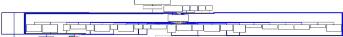
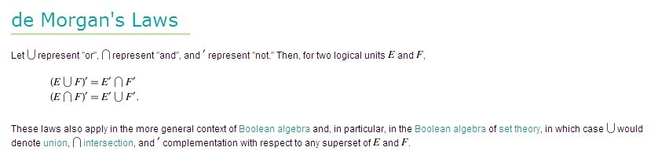
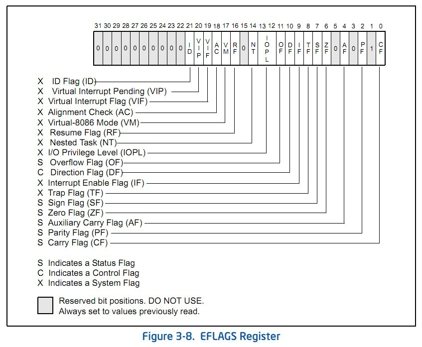

# VMProtect2.04加壳程序从入门到精通

url:https://bbs.pediy.com/thread-121412.htm

VMProtect2.04加壳程序从入门到精通
---------自由、探索、共享---------
作者：000bInarYstAr[MaTrix]

两年来，我一直在思索：
人为什么而存在？
生命的意义究竟是什么？
什么样的人生才是真正的人生？
我应该以什么样的方式去度过我的人生旅程？
直到那一刻我忽然顿悟，不再犹豫的重新继续学习计算机，并决定调试VMP。
我想说的是：2年了，我回来了，我的心充满了光明。。。
我无法抑制住自己，我想自己总要去追寻着我的梦想才能让我满足。这久我猛然发现自己老了，真的老了，一切都是沧桑的，2年的时光，回首过去，才发现自己已经不再年轻了。梦想依然年轻，它挥之不去，萦绕在我的肉体中，渗透进我的思想、我的精神，折磨着我的灵魂，我只有去追寻它，才能让我不再思索，才能满足自己。
以此为序，愿我不再忘记这段探索的旅程。。。
bInarYstAr
2010.10.16 8:44

此文章是我学习VMProtect2.04加壳程序的心得。在调试的过程中，尤其是初期，参考和查阅了N多的网络资料，在此一并表示感谢。在计算机书中，最著名的两类书名当属：XXXX从入门到精通和21天学会XXXX，我在仔细思考，最终觉得还是前者比较有吸引力。OD的UDD文件的使用，在D:盘下新建文件夹Unpack，把加壳记事本放入文件夹内，把UDD文件放入OD的UDD文件夹内。OD打开加壳记事本后，UDD文件会自动生效。
声明：本文在非盈利性用途可自由传播，转载时请注意保持文章的完整性和作者。
软件：正版VMProtect2.04加密的Win98记事本
加密选项：除了 编译--调试模式与水印 以外，全部打钩；虚拟计算机--数量为默认值1；编译类型：超级（变异+虚拟）
调试器：官网下载的OllyDbg2.0
加壳程序下载：[ NOTEPAD.rar](https://bbs.pediy.com/attach-download-49401.htm)
UDD文件：[ NOTEPAD-udd.rar](https://bbs.pediy.com/attach-download-49402.htm)（这是是整理了伪指令的UDD文件，后续还会更新）
本文的结构：
**序言
文章简介
1.基础知识
1.1.VMProtect虚拟机简介
1.2.VM堆栈
1.3.伪指令汇总
2.综合运用
2.1.常见伪指令组合
2.2.NAND（与非门）
2.3.EFLAGS标志位检测+跳转
3.NOTEPAD全程跟踪
3.1.TLS
3.2.VMP外壳函数获取
3.3.虚拟执行环境与调试器检测
3.4.HASH值分块检测与API获取
3.5.重点解密循环
4.实验室（暂定）
尾声**

# 1.基础知识
## 1.1.VMProtect虚拟机简介

虚拟机加密，是指像VMP这样的保护程序，它会把源程序的X86指令变成自定义的伪指令，等到执行的时候，VMP内置在保护程序中的VM就会启动，读取伪指令，然后解析执行。
VMP是一个堆栈虚拟机，它的一切操作都是基于堆栈传递的。在VMP中，每一个伪指令就是一个handler，VM中有一个核心的Dispatch部分，它通过读取程序的bytecode，然后在DispatchiTable里面定位到不同的handler中执行。绝大多数情况下，在一个handler中执行完成后，程序将回到Dispatch部分，然后到next handler中执行。

在上面的框架中，核心的部件就是Dispatch部分，下面并列的部件就是handlers。
经过VMP加密的X86指令，一条简单的指令被分解成数条VMP的伪指令，它按照自己的伪指令排列去实现原指令的功能，在加上其他的花指令混乱等等，你将完全看不到源程序指令。VMP自带的各种机制都不再是以X86指令的形式去实现，而是用自己的伪指令去测试。
在VMP的VM运行过程中，各个寄存器的基本用途是：EBP和EDI是VM堆栈指针（不是常规的堆栈）；ESI是伪指令指针（相当于常规的EIP）；EAX是VM解密数据的主运算寄存器；EBX是VM解密数据的辅运算寄存器；ECX是常规的循环计数器；ESP是常规的堆栈栈顶指针。EDX是读取伪指令表数据；
EDI、EBP分别指向VM堆栈的上下限位置，EBP指向堆栈的下限并向上发展，EDI指向堆栈的上限并使用[EDI+EAX]的方式向下发展；ESI指向的内存块里包括要执行的伪指令序列，而不同的是，当VM要是使用到立即数时，也是从ESI读取。可见ESI内存块里面是精心构建的数据块，只有VM自身执行过程中，才能知道下一个数据是代表伪指令还是立即数；在VM运算中EAX寄存器很多时候通常只有AL参与运算然后在存取时再以AX或EAX得方式存取；EBX在很多加密数据运算中，都会参与到EAX值的计算中，协助运算中正确的值。而每次EAX的值运算结束后，反过来会计算好下一次运算中EBX的值。所以EBX的数据一旦出错，下一个数据解密必然错误；在VM运行中，通常一切操作都是在VM堆栈内完成的，所以绝大多数情况下对ESP的操作都是花指令或junk code。在一些虚拟与现实（比如说调用系统函数）交接的地方，系统并不知道VM堆栈的存在，这就需要把数据（比如系统函数的调用参数）移动到常规ESP栈顶。EDX是一个较少使用的寄存器，只在一些解密循环里面参与运算。而它的一个主要的运用是在DISPATCH部件里，根据ESI的值来获取DispatchTable的数据，让VM执行下一条伪指令。

## 1.2.VM堆栈

VMP的VM是基于堆栈的虚拟家，理解好VM的堆栈空间划分和操作，是理解整个VM运行的基础。
VMProtect2.04加壳程序是从TLS开始运行的，我们首先点击OD的options菜单，修改Startup and exit选项，让OD中断在TLS callback里。加壳程序运行后，VMP初始化VM，并进入DISPATCH部分。这里我们就以初始化后的堆栈为例。
VM的堆栈一共使用61个DWORD，上下分别有2个堆栈指针，下面为EBP指针，上面为EDI指针。下面是VM初始化时，给EDI和EBP指针赋值后的堆栈。
EDI=0013F8BC
EBP=0013F9B0
CPU Stack
Locked  Value    ASCII Comments
0013F8BC  009539E8 9.                    ；这里是EDI指向
0013F8C0  00950000 ...
0013F8C4  00150000 ...
0013F8C8  00000080 ...
0013F8CC  019314D6 
0013F8D0  0013F8A8 .
0013F8D4  7C92E920  |
0013F8D8  00000000 ....
0013F8DC  00000000 ....
0013F8E0  00000000 ....
0013F8E4  FFFFFFFF
0013F8E8  7C98FEFF |   
0013F8EC  7C00ADE7 .|
0013F8F0  00000000 ....
0013F8F4  00150000 ...
0013F8F8  0013F6F0 .
0013F8FC  0013F940 @.
0013F900  0013F944 D.
0013F904  7C92E920  |
0013F908  7C9301E0 |
0013F90C  FFFFFFFF
0013F910  7C9301DB |  
0013F914  7C9314D6 |  
0013F918  7C931514 |  
0013F91C  7C99E120  |
0013F920  7C9314EA |  
0013F924  5ADF1158 XZ
0013F928  00000001 ...
0013F92C  00000000 ....
0013F930  7FFDA000 .
0013F934  7FFDF000 .
0013F938  00158070 p.
0013F93C  0013F890 .
0013F940  00000000 ....
0013F944  0043D759 YC.  
0013F948  0000E9ED ..
0013F94C  409B0002 .@
0013F950  00000020  ...
0013F954  0013F9CC .
0013F958  0013F96C l.
0013F95C  0043E9ED C.  
0013F960  000359F4 Y.
0013F964  00000020  ...
0013F968  004253CD SB.  
0013F96C  409B0000 ..@
0013F970  00000020  ...
0013F974  0013F9CC .
0013F978  0013F98C .
0013F97C  00000000 ....                    ；这里是EBP指向
0013F980  00000000 ....                    ；这里是VM初始化保存的各个寄存器
0013F984  00000246 F..
0013F988  000359F4 Y.
0013F98C  00000020  ...
0013F990  00000000 ....
0013F994  0013F9CC .
0013F998  004253CD SB.  
0013F99C  000359F4 Y.
0013F9A0  00400000 ..@. 
0013F9A4  0013F9C0 .
0013F9A8  C456C619 V                    ；这里是VMP的2个加密数据
0013F9AC  2EF6420A .B.
0013F9B0  7C92118A |  ; RETURN to ntdll.7C92118A    ；这里是TLS进来时的栈顶
关于2个加密数据和初始化的过程我们后续来说，这里我们主要关注VM的堆栈划分。
我把上面的EDI指向的堆栈称为EDISTACK，把EBP指向的堆栈称为EBPSTACK。在VM中，EBPSTACK是运算区，各类数据的运算操作在这里完成；EDISTACK是存储区包括长期存储数据和临时存储EBPSTACK的运算数。
下面我们来看一条数据移动伪指令：
命名：
VM_MOVdw_EDISTACKdw_EBPSTACKdw
代码：
0043DC19 |. F6D8      NEG AL                       ; *
0043DC26 |. C0C8 07    ROR AL,7                      ; *
0043DC34 |. 2C 20      SUB AL,20                     ; *
0043DC41 |. 24 3C      AND AL,3C                     ; *

0043E080 |$ 8B55 00    MOV EDX,DWORD PTR SS:[EBP]          ; *
0043E086 |. 83C5 04    ADD EBP,4                     ; *

0043D3D7 /> /891438     MOV DWORD PTR DS:[EDI+EAX],EDX       ; *
功能：
把1个dword的数据从EBPSTAK栈顶移动到EDISTACK，使用EAX作为偏移量

在EDISTACK的数据移动中，使用[EDI+EAX]的方式来存储与获取各个值。通过计算不同的EAX的值，可以到达EDISTACK中不同位置。在计算EAX值时，实际真正计算的是AL的值，我们来考虑一下AL的最小值和最大值，AL=00时[EDI+EAX]=[0013F8BC+00000000]=0013F8BC,AL=FF时[EDI+EAX]=[0013F8BC+000000FF]=0013F9BB，这是使用[EDI+EAX]可以读取的上下限。但是，在VM的AL值计算过程中，最后有一条AND AL,0x3C指令，0x3C=00111100bit由于这条指令的限制，无论AL为任何值（从00000000bit到11111111bit），通过AND操作，只能有1111bit的活动空间大小，1111bit相当于16，所以EDISTACK最多可以读取16个dword；由于00111100bit最后两个00位的限制，任何数字与它AND后，后两位都必然为0，变成与4对齐的值，说明VM都是按照0013F8BC 0013F8C0 0013F8C4 0013F8C8这样的4对齐来读取。在读取时，VM可以读取byte word dword，但是VM将不会去读取0013F8BE。
由于EDISTACK堆栈向下发展，EBPSTACK堆栈向上发展，EDISTACK有0x3C控制着范围，而EBPSTACK是操作区，没有硬性的范围控制。为了预防两个空间相撞，在每次往EBPSTACK移动数据后，VM都有相应的边界检测指令如下：
0043CE5A |. 8D47 50    LEA EAX,[EDI+50]                ; *
0043EE5D |. 39C5      CMP EBP,EAX                    ; *
0043F08C |.^\0F87 29F6FFFF JA 0043E6BB                    ; *
比较结果 大于 ，这个正常的情况，在这个VM跟踪过程中，我没有发现一次小于的情况。如果小于，也就是EBPSTACK栈顶已经到达[EDI+50]位置，VM将会重新分配堆栈空间。0x50的偏移量比0x3C的偏移量多5个dword的缓冲区。我们来手动修改EBP指针，看看VM的对于两个堆栈空间即将相撞的处理情况：
CPU Disasm
Address  Hex dump      Command                      Comments
0043F092 |. 52        PUSH EDX                      ;
0043D6C1 |. 8D5424 08   LEA EDX,[ARG.2]                 ; *EDX获得的是原来EDI指针地址0013F8BC
0043DF38 |. 8D4F 40    LEA ECX,[EDI+40]                ; *0x40的偏移量是0x3C的偏移量数据1个dword结束后的位置
0043DF46 |. 29D1      SUB ECX,EDX                    ; *减法计算出数据存储量
0043DF4B |. 8D45 80    LEA EAX,[EBP-80]                ; *增加0x80的空间
0043DF5C |. 24 FC      AND AL,FC                     ; *按4对齐
0043DF68 |. 29C8      SUB EAX,ECX                    ; *在增加原来数据大小的堆栈空间
0043DF6E |. 89C4      MOV ESP,EAX                    ; *
0043DF7E |. 56        PUSH ESI                      ; |Arg1 = NOTEPAD.425748, *
0043DF87 |. 89D6      MOV ESI,EDX                    ; |*
0043DB3A /$ 8D7C01 C0   LEA EDI,[EAX+ECX-40]              ; *
0043EC1E  . 89C7      MOV EDI,EAX                    ; *
0043EEED |. F3:A4      REP MOVS BYTE PTR ES:[EDI],BYTE PTR DS:[ ; *移动原来EDISTACK中存储的数据
0043EEF7 |. 8B7C24 10   MOV EDI,DWORD PTR SS:[ESP+10]        ; *
0043EEFF |. 8B7424 10   MOV ESI,DWORD PTR SS:[ESP+10]        ; *
这里我们可以看到，每次发现两个堆栈空间即将相撞，VM都重新给EBP分配堆栈，并把原来EDISTACK存储的数据移动到新的空间内。
下面是使用OD跟踪VM堆栈的几个小技巧：
在OD中跟踪VM数据移动时，双击0013F8BC地址，OD将会以0013F8BC为基址，显示上下各个地址与它的偏移量，如图：
CPU Stack
Locked  Value    ASCII Comments
$-C     759D0000 ..u
$-8     00000001 ...
$-4     0013F8FC .
$ ==>    009539E8 9.                    ；这里是0013F8BC，双击后的效果
$+4     00950000 ...
$+8     00150000 ...
$+C     00000080 ...
$+10    019314D6 
在跟踪VM时，在数据移动伪指令中的AND AL,0x3C的下一条指令下断点，这样每次进行数据移动，你都可以在这个断点看到，数据的去向和来源，这是极其有用的。在很多复杂的运算地方，你需要在草稿纸上记下，EDISTACK中一些空间的数据时来自于什么时候？比如标志位ZF检测+跳转是VM的一个重要操作，而EFLAGS标志数都是相差不多或类似的00000286 00000246等等，如果你不能准确知道[EDI+EAX]存储或读取的位置，你将无法理解VM的操作。这非常的重要，请牢记！必要时连OD得数据窗口也一起配合显示VM堆栈

把OD里的堆栈窗口拉高，让它竟可能多的显示数据，在高分辨率的电脑上，最好是能够显示出整个VM的堆栈。默认情况下，堆栈窗口是随着ESP指针的变化而自动显示的，这对于我们要时刻盯着VM堆栈的需求不相符，在堆栈窗口-->右键-->Lock address 打钩，这样OD就会锁定堆栈窗口。
到这里，关于堆栈空间的介绍就结束了。对堆栈的理解是本文的根基。

## 1.3.伪指令汇总

调试VMP前期的一个重要的体力活是，识别出所有的伪指令，并根据它的用途给它相应的命名。以后就可以在DISPATCH部件的最后跳转地址：
0043E11F |. C2 5000    RETN 50
下断点，再盯着VM堆栈就可以知道VM的所有操作。
我们先来了解所有伪指令的DISPATCH（调遣）部件：
0043E6BF |. 8A46 FF    MOV AL,BYTE PTR DS:[ESI-1]          ; *
0043E6C4 |. 30D8      XOR AL,BL                     ; *
0043E6CE |. F6D0      NOT AL                       ; *
0043E6D6 |. FEC8      DEC AL                       ; *
0043E6DA |. C0C8 07    ROR AL,7                      ; *
0043E6E1 |. 83EE 01    SUB ESI,1                     ; *
0043E6ED |. 30C3      XOR BL,AL                     ; *
0043D02F |. 0FB6C0     MOVZX EAX,AL                   ; *

0043F124 |. 8B1485 DBE143 MOV EDX,DWORD PTR DS:[EAX*4+43E1DB]    ; *
0043E100 |> /81C2 6B197FB6 ADD EDX,B67F196B                ; *

0043E10A |. 895424 3C   MOV DWORD PTR SS:[ESP+3C],EDX        ; *
0043E11B |. FF7424 4C   PUSH DWORD PTR SS:[ESP+4C]          ; *
0043E11F |. C2 5000    RETN 50
首先从ESI中解密获得下一条伪指令在DispatchTable（调遣表）中的偏移量，使用[EAX*4+43E1DB]来读取出伪指令地址，简单的ADD解密后，把真正的伪指令地址压入ESP栈顶，最后用RETN 50跳转到相应的伪指令。
MOV EDX,DWORD PTR DS:[EAX*4+43E1DB]给我们提供的信息：DispatchTable的起始地址是0043E1DB，最后一个dword的开始地址是以AL的最大值FF作为偏移量[FF*4+43E1DB]=0043E5D7。我们把记事本0043E1DB--0043E5D7的数据粘贴：
CPU Dump
Address  Hex dump                           ASCII
0043E1D0                       09|BA C4 49 D0|        .I
0043E1E0 BA C4 49 1E|B7 C4 49 E6|C4 C4 49 53|D1 C4 49 05| IIISI
0043E1F0 BE C4 49 75|D1 C4 49 D4|CE C4 49 0C|D6 C4 49 C3| IuII.I
0043E200 BD C4 49 7B|CE C4 49 67|BE C4 49 26|BF C4 49 EB| I{IgI&I
0043E210 C2 C4 49 82|D0 C4 49 3A|BA C4 49 1E|B5 C4 49 A8| II:II
0043E220 C4 C4 49 1E|B5 C4 49 2E|C8 C4 49 B9|BB C4 49 E9| II.II
0043E230 C3 C4 49 2D|B8 C4 49 95|C1 C4 49 82|D0 C4 49 75| I-IIIu
0043E240 D1 C4 49 C3|BE C4 49 16|B6 C4 49 2D|B8 C4 49 75| I镁II-Iu
0043E250 D1 C4 49 95|C1 C4 49 EB|C2 C4 49 52|BF C4 49 B4| IIIRI
0043E260 D3 C4 49 8B|D3 C4 49 05|CE C4 49 52|BF C4 49 D4| IIIRI
0043E270 CE C4 49 E8|B8 C4 49 C3|BD C4 49 C3|BE C4 49 5E| II媒I镁I^
0043E280 B4 C4 49 B1|B8 C4 49 61|BD C4 49 5D|BF C4 49 E9| IIaI]I
0043E290 C3 C4 49 26|BF C4 49 5F|D0 C4 49 B4|D3 C4 49 E6| I&I_II
0043E2A0 C4 C4 49 EC|B7 C4 49 1E|B5 C4 49 0D|C0 C4 49 0D| III.I.
0043E2B0 C0 C4 49 C3|BD C4 49 5D|BF C4 49 7B|CE C4 49 C3| I媒I]I{I
0043E2C0 BD C4 49 1E|B5 C4 49 82|D0 C4 49 8A|B9 C4 49 A6| IIII
0043E2D0 D1 C4 49 EB|C2 C4 49 D4|CE C4 49 61|BD C4 49 09| IIIaI.
0043E2E0 BA C4 49 53|D1 C4 49 61|BD C4 49 3A|BA C4 49 3A| ISIaI:I:
0043E2F0 D0 C4 49 0C|D6 C4 49 3A|BA C4 49 1E|B7 C4 49 05| I.I:II
0043E300 CE C4 49 0D|C0 C4 49 82|D0 C4 49 27|D2 C4 49 7C| I.II'I|
0043E310 BD C4 49 E8|B8 C4 49 41|C2 C4 49 E9|C3 C4 49 25| IIAII%
0043E320 CE C4 49 53|C6 C4 49 61|BD C4 49 53|C6 C4 49 83| ISIaISI
0043E330 D6 C4 49 53|C6 C4 49 5D|BF C4 49 53|C6 C4 49 A8| ISI]ISI
0043E340 C4 C4 49 53|C6 C4 49 5F|D0 C4 49 53|C6 C4 49 E6| ISI_ISI
0043E350 C4 C4 49 53|C6 C4 49 3A|BA C4 49 53|C6 C4 49 00| ISI:ISI.
0043E360 C7 C4 49 53|C6 C4 49 2D|B8 C4 49 53|C6 C4 49 25| ISI-ISI%
0043E370 CE C4 49 53|C6 C4 49 83|D6 C4 49 53|C6 C4 49 1E| ISIISI
0043E380 B7 C4 49 53|C6 C4 49 C3|BD C4 49 53|C6 C4 49 62| ISI媒ISIb
0043E390 CF C4 49 53|C6 C4 49 12|D3 C4 49 53|C6 C4 49 E8| ISIISI
0043E3A0 B8 C4 49 05|CE C4 49 1E|B7 C4 49 8A|B9 C4 49 B4| IIII
0043E3B0 D3 C4 49 B9|BB C4 49 A6|D1 C4 49 E8|B8 C4 49 FE| IIII
0043E3C0 C0 C4 49 82|D0 C4 49 53|D1 C4 49 2D|B8 C4 49 52| IISI-IR
0043E3D0 BF C4 49 3A|D0 C4 49 C3|BE C4 49 A6|C1 C4 49 C3| I:I镁II
0043E3E0 BE C4 49 5E|B4 C4 49 82|D0 C4 49 7C|BD C4 49 C3| I^II|I
0043E3F0 BD C4 49 C3|BE C4 49 1E|B7 C4 49 61|BD C4 49 A6| I镁IIaI
0043E400 C1 C4 49 82|D0 C4 49 12|D3 C4 49 FE|C0 C4 49 25| IIII%
0043E410 CE C4 49 0C|D6 C4 49 09|BA C4 49 2E|C8 C4 49 67| I.I.I.Ig
0043E420 BE C4 49 8A|B9 C4 49 EB|C2 C4 49 D4|CE C4 49 95| IIII
0043E430 C1 C4 49 D1|C7 C4 49 09|BA C4 49 00|C7 C4 49 B9| II.I.I
0043E440 BB C4 49 D1|C7 C4 49 B4|D3 C4 49 5E|B4 C4 49 D1| III^I
0043E450 C7 C4 49 A8|C4 C4 49 A6|C1 C4 49 12|D3 C4 49 B4| IIII
0043E460 D3 C4 49 D0|BA C4 49 41|C2 C4 49 82|D0 C4 49 B1| I泻IAII
0043E470 B8 C4 49 1E|B5 C4 49 27|D2 C4 49 82|D0 C4 49 75| II'IIu
0043E480 D1 C4 49 5E|B4 C4 49 25|CE C4 49 16|B6 C4 49 7B| I^I%II{
0043E490 CE C4 49 7C|BD C4 49 EB|C2 C4 49 27|D2 C4 49 83| I|II'I
0043E4A0 D6 C4 49 12|D3 C4 49 2E|C8 C4 49 1E|B5 C4 49 E6| II.II
0043E4B0 C4 C4 49 C3|BD C4 49 95|C1 C4 49 1E|B5 C4 49 EC| I媒III
0043E4C0 B7 C4 49 B9|BB C4 49 5F|D0 C4 49 83|D6 C4 49 8A| II_II
0043E4D0 B9 C4 49 A6|C1 C4 49 D4|CE C4 49 8B|D3 C4 49 0D| IIII.
0043E4E0 C0 C4 49 E8|B8 C4 49 2D|B8 C4 49 61|BD C4 49 82| II-IaI
0043E4F0 D0 C4 49 12|D3 C4 49 1E|B5 C4 49 7C|BD C4 49 D1| III|I
0043E500 C7 C4 49 7C|BD C4 49 05|CE C4 49 A6|C1 C4 49 5F| I|III_
0043E510 D0 C4 49 1E|B7 C4 49 7B|CE C4 49 0C|D6 C4 49 05| II{I.I
0043E520 BE C4 49 9F|C2 C4 49 B9|BB C4 49 9F|C2 C4 49 D4| IIII
0043E530 CE C4 49 9F|C2 C4 49 EC|B7 C4 49 9F|C2 C4 49 62| IIIIb
0043E540 CF C4 49 9F|C2 C4 49 2D|B8 C4 49 9F|C2 C4 49 0C| II-II.
0043E550 D6 C4 49 9F|C2 C4 49 0D|C0 C4 49 9F|C2 C4 49 05| II.II
0043E560 BE C4 49 9F|C2 C4 49 C3|BD C4 49 9F|C2 C4 49 53| II媒IIS
0043E570 D1 C4 49 9F|C2 C4 49 75|D1 C4 49 9F|C2 C4 49 05| IIuII
0043E580 CE C4 49 9F|C2 C4 49 75|D1 C4 49 9F|C2 C4 49 27| IIuII'
0043E590 D2 C4 49 9F|C2 C4 49 09|BA C4 49 9F|C2 C4 49 B9| II.II
0043E5A0 B5 C4 49 E6|C4 C4 49 09|BA C4 49 8B|D3 C4 49 25| II.II%
0043E5B0 CE C4 49 0D|C0 C4 49 B9|B5 C4 49 E9|C3 C4 49 12| I.III
0043E5C0 D3 C4 49 FE|C0 C4 49 05|CE C4 49 83|D6 C4 49 0D| IIII.
0043E5D0 C0 C4 49 EC|B7 C4 49 D0|BA C4 49           II泻I
虽然DispatchTable的数据很多，但是很多不同的偏移量指向的相同的数据，这是一种保护方式。我们反过来想，如果DispatchTable中每个dword指向的是不同的伪指令，这就意味着每个EAX偏移量指向着唯一的一条伪指令，进一步的来说就是每个ESI值代表着唯一的一条伪指令。那么，如果有人逆向这个算法，就可以知道每个ESI值对应的是哪个伪指令，这样就可以直接读取ESI值而了解VMP的执行伪指令，基本等于半自动识别VMP。一名对VMP经验丰富的人，只要看着VM执行的伪指令盯着EBPSTACK堆栈，就可以理解VM的情况。现在，由于多个ESI值指向相同的伪指令，还有动态EBX解码，将会艰难的多。
我们在OD中寻找一个空间，写一段循环代码，把DispatchTable的数据全部解密出来：
原来的代码：
0043F11F  \38F5        CMP CH,DH
0043F121  66:FFC2      INC DX
0043F124  8B1485 DBE14300 MOV EDX,DWORD PTR DS:[EAX*4+43E1DB]    ; *
0043F12B  F9         STC
0043F12C  84F4        TEST AH,DH
0043F12E  60         PUSHAD
0043F12F ^ E9 CC5EFCFF   JMP 0043E100
把最后一条指令修改为：
0043F12F ^\E9 CC5EFCFF   JMP 00405000
在00405000添加循环代码：
CPU Disasm
Address  Hex dump      Command                      Comments
00405000  60         PUSHAD
00405001  BE DBE14300   MOV ESI,0043E1DB                ; DispatchTable地址
00405006  BF 00514000   MOV EDI,00405100                ; 解密循环地址
0040500B  B9 00010000   MOV ECX,100
00405010  31DB        XOR EBX,EBX
00405012  8B0433      MOV EAX,DWORD PTR DS:[ESI+EBX]
00405015  05 6B197FB6   ADD EAX,B67F196B                ; 解密指令只有1条ADD
0040501A  89043B      MOV DWORD PTR DS:[EDI+EBX],EAX
0040501D  83C3 04      ADD EBX,4
00405020  49         DEC ECX
00405021 ^ 75 EF       JNE SHORT 00405012
00405023  61         POPAD
00405024  E9 8E900200   JMP 0043E100
循环结束后，在00405100中就还原了整个DispatchTable：
CPU Dump
Address  Hex dump                           ASCII
00405100 74 D3 43 00|3B D4 43 00|89 D0 43 00|51 DE 43 00| tC.;C.C.QC.
00405110 BE EA 43 00|70 D7 43 00|E0 EA 43 00|3F E8 43 00| C.pC.C.?C.
00405120 77 EF 43 00|2E D7 43 00|E6 E7 43 00|D2 D7 43 00| wC..C.C.C.
00405130 91 D8 43 00|56 DC 43 00|ED E9 43 00|A5 D3 43 00| C.VC.C.C.
00405140 89 CE 43 00|13 DE 43 00|89 CE 43 00|99 E1 43 00| C.C.C.C.
00405150 24 D5 43 00|54 DD 43 00|98 D1 43 00|00 DB 43 00| $C.TC.C..C.
00405160 ED E9 43 00|E0 EA 43 00|2E D8 43 00|81 CF 43 00| C.C..C.C.
00405170 98 D1 43 00|E0 EA 43 00|00 DB 43 00|56 DC 43 00| C.C..C.VC.
00405180 BD D8 43 00|1F ED 43 00|F6 EC 43 00|70 E7 43 00| C.C.C.pC.
00405190 BD D8 43 00|3F E8 43 00|53 D2 43 00|2E D7 43 00| C.?C.SC..C.
004051A0 2E D8 43 00|C9 CD 43 00|1C D2 43 00|CC D6 43 00| .C.C.C.C.
004051B0 C8 D8 43 00|54 DD 43 00|91 D8 43 00|CA E9 43 00| C.TC.C.C.
004051C0 1F ED 43 00|51 DE 43 00|57 D1 43 00|89 CE 43 00| C.QC.WC.C.
004051D0 78 D9 43 00|78 D9 43 00|2E D7 43 00|C8 D8 43 00| xC.xC..C.C.
004051E0 E6 E7 43 00|2E D7 43 00|89 CE 43 00|ED E9 43 00| C..C.C.C.
004051F0 F5 D2 43 00|11 EB 43 00|56 DC 43 00|3F E8 43 00| C.C.VC.?C.
00405200 CC D6 43 00|74 D3 43 00|BE EA 43 00|CC D6 43 00| C.tC.C.C.
00405210 A5 D3 43 00|A5 E9 43 00|77 EF 43 00|A5 D3 43 00| C.C.wC.C.
00405220 89 D0 43 00|70 E7 43 00|78 D9 43 00|ED E9 43 00| C.pC.xC.C.
00405230 92 EB 43 00|E7 D6 43 00|53 D2 43 00|AC DB 43 00| C.C.SC.C.
00405240 54 DD 43 00|90 E7 43 00|BE DF 43 00|CC D6 43 00| TC.C.C.C.
00405250 BE DF 43 00|EE EF 43 00|BE DF 43 00|C8 D8 43 00| C.C.C.C.
00405260 BE DF 43 00|13 DE 43 00|BE DF 43 00|CA E9 43 00| C.C.C.C.
00405270 BE DF 43 00|51 DE 43 00|BE DF 43 00|A5 D3 43 00| C.QC.C.C.
00405280 BE DF 43 00|6B E0 43 00|BE DF 43 00|98 D1 43 00| C.kC.C.C.
00405290 BE DF 43 00|90 E7 43 00|BE DF 43 00|EE EF 43 00| C.C.C.C.
004052A0 BE DF 43 00|89 D0 43 00|BE DF 43 00|2E D7 43 00| C.C.C..C.
004052B0 BE DF 43 00|CD E8 43 00|BE DF 43 00|7D EC 43 00| C.C.C.}C.
004052C0 BE DF 43 00|53 D2 43 00|70 E7 43 00|89 D0 43 00| C.SC.pC.C.
004052D0 F5 D2 43 00|1F ED 43 00|24 D5 43 00|11 EB 43 00| C.C.$C.C.
004052E0 53 D2 43 00|69 DA 43 00|ED E9 43 00|BE EA 43 00| SC.iC.C.C.
004052F0 98 D1 43 00|BD D8 43 00|A5 E9 43 00|2E D8 43 00| C.C.C..C.
00405300 11 DB 43 00|2E D8 43 00|C9 CD 43 00|ED E9 43 00| C..C.C.C.
00405310 E7 D6 43 00|2E D7 43 00|2E D8 43 00|89 D0 43 00| C..C..C.C.
00405320 CC D6 43 00|11 DB 43 00|ED E9 43 00|7D EC 43 00| C.C.C.}C.
00405330 69 DA 43 00|90 E7 43 00|77 EF 43 00|74 D3 43 00| iC.C.wC.tC.
00405340 99 E1 43 00|D2 D7 43 00|F5 D2 43 00|56 DC 43 00| C.C.C.VC.
00405350 3F E8 43 00|00 DB 43 00|3C E1 43 00|74 D3 43 00| ?C..C.<C.tC.
00405360 6B E0 43 00|24 D5 43 00|3C E1 43 00|1F ED 43 00| kC.$C.<C.C.
00405370 C9 CD 43 00|3C E1 43 00|13 DE 43 00|11 DB 43 00| C.<C.C.C.
00405380 7D EC 43 00|1F ED 43 00|3B D4 43 00|AC DB 43 00| }C.C.;C.C.
00405390 ED E9 43 00|1C D2 43 00|89 CE 43 00|92 EB 43 00| C.C.C.C.
004053A0 ED E9 43 00|E0 EA 43 00|C9 CD 43 00|90 E7 43 00| C.C.C.C.
004053B0 81 CF 43 00|E6 E7 43 00|E7 D6 43 00|56 DC 43 00| C.C.C.VC.
004053C0 92 EB 43 00|EE EF 43 00|7D EC 43 00|99 E1 43 00| C.C.}C.C.
004053D0 89 CE 43 00|51 DE 43 00|2E D7 43 00|00 DB 43 00| C.QC..C..C.
004053E0 89 CE 43 00|57 D1 43 00|24 D5 43 00|CA E9 43 00| C.WC.$C.C.
004053F0 EE EF 43 00|F5 D2 43 00|11 DB 43 00|3F E8 43 00| C.C.C.?C.
00405400 F6 EC 43 00|78 D9 43 00|53 D2 43 00|98 D1 43 00| C.xC.SC.C.
00405410 CC D6 43 00|ED E9 43 00|7D EC 43 00|89 CE 43 00| C.C.}C.C.
00405420 E7 D6 43 00|3C E1 43 00|E7 D6 43 00|70 E7 43 00| C.<C.C.pC.
00405430 11 DB 43 00|CA E9 43 00|89 D0 43 00|E6 E7 43 00| C.C.C.C.
00405440 77 EF 43 00|70 D7 43 00|0A DC 43 00|24 D5 43 00| wC.pC..C.$C.
00405450 0A DC 43 00|3F E8 43 00|0A DC 43 00|57 D1 43 00| .C.?C..C.WC.
00405460 0A DC 43 00|CD E8 43 00|0A DC 43 00|98 D1 43 00| .C.C..C.C.
00405470 0A DC 43 00|77 EF 43 00|0A DC 43 00|78 D9 43 00| .C.wC..C.xC.
00405480 0A DC 43 00|70 D7 43 00|0A DC 43 00|2E D7 43 00| .C.pC..C..C.
00405490 0A DC 43 00|BE EA 43 00|0A DC 43 00|E0 EA 43 00| .C.C..C.C.
004054A0 0A DC 43 00|70 E7 43 00|0A DC 43 00|E0 EA 43 00| .C.pC..C.C.
004054B0 0A DC 43 00|92 EB 43 00|0A DC 43 00|74 D3 43 00| .C.C..C.tC.
004054C0 0A DC 43 00|24 CF 43 00|51 DE 43 00|74 D3 43 00| .C.$C.QC.tC.
004054D0 F6 EC 43 00|90 E7 43 00|78 D9 43 00|24 CF 43 00| C.C.xC.$C.
004054E0 54 DD 43 00|7D EC 43 00|69 DA 43 00|70 E7 43 00| TC.}C.iC.pC.
004054F0 EE EF 43 00|78 D9 43 00|57 D1 43 00|3B D4 43 00| C.xC.WC.;C.
Intel的Little Endian（小尾）方式存储让我们看的非常的别扭。在OD的主窗口（CPU窗口）中来到00405000 .data段，看一下00405100的显示：
004050F2  0000        ADD BYTE PTR DS:[EAX],AL
004050F4  0000        ADD BYTE PTR DS:[EAX],AL
004050F6  0000        ADD BYTE PTR DS:[EAX],AL
004050F8  0000        ADD BYTE PTR DS:[EAX],AL
004050FA  0000        ADD BYTE PTR DS:[EAX],AL
004050FC  0000        ADD BYTE PTR DS:[EAX],AL
004050FE  0000        ADD BYTE PTR DS:[EAX],AL
00405100 ^ 74 D3       JE SHORT 004050D5
00405102  43         INC EBX
00405103  003B        ADD BYTE PTR DS:[EBX],BH
00405105  D4 43       AAM 43
00405110  BE EA430070   MOV ESI,700043EA
OD把我们的数据当做代码来显示了。点击右键-->Analysis-->Analyse code Ctrl + A ，弹出对话框是否分析，点击确定。显示如下：
004050FB    00        DB 00
004050FC    00        DB 00
004050FD    00        DB 00
004050FE    00        DB 00
004050FF    00        DB 00
00405100  . 74D34300    DD 0043D374
00405104  . 3BD44300    DD 0043D43B
00405108  . 89D04300    DD 0043D089
0040510C  . 51DE4300    DD 0043DE51
00405110  . BEEA4300    DD 0043EABE
00405114  . 70D74300    DD 0043D770
00405118  . E0EA4300    DD 0043EAE0
0040511C  . 3FE84300    DD 0043E83F
00405120  . 77EF4300    DD 0043EF77
00405124  . 2ED74300    DD 0043D72E
00405128  . E6E74300    DD 0043E7E6
0040512C  . D2D74300    DD 0043D7D2
OD正确的以数据方式显示，并且已经按照我们日常的习惯把数据按照Big Endian（大尾）方式显示。
对于DispatchTable中重复的数据，我们也要把他清除，在刚才00405000的汇编代码下面继续：
CPU Disasm
Address  Hex dump      Command                      Comments
00405000  60         PUSHAD
00405001  BE DBE14300   MOV ESI,0043E1DB                ; DispatchTable地址
00405006  BF 00514000   MOV EDI,00405100                ; 解密循环地址
0040500B  B9 00010000   MOV ECX,100
00405010  31DB        XOR EBX,EBX
00405012  8B0433      MOV EAX,DWORD PTR DS:[ESI+EBX]
00405015  05 6B197FB6   ADD EAX,B67F196B                ; 解密指令只有1条ADD
0040501A  89043B      MOV DWORD PTR DS:[EDI+EBX],EAX
0040501D  83C3 04      ADD EBX,4
00405020  49         DEC ECX
00405021 ^ 75 EF       JNE SHORT 00405012
00405023  61         POPAD
00405024  EB 03       JMP SHORT 00405029
00405026  90         NOP
00405027  90         NOP
00405028  90         NOP
00405029  60         PUSHAD
0040502A  BE 00514000   MOV ESI,00405100                ; TispatchTable
0040502F  BF 005A4000   MOV EDI,00405A00                ; new DispatchTable
00405034  B9 00010000   MOV ECX,100
00405039  BA 00000000   MOV EDX,0
0040503E  8D1C8D 00000000 LEA EBX,[ECX*4]
00405045  8B06        MOV EAX,DWORD PTR DS:[ESI]
00405047  83F8 00      CMP EAX,0
0040504A  74 1A       JE SHORT 00405066
0040504C  8907        MOV DWORD PTR DS:[EDI],EAX
0040504E  83C7 04      ADD EDI,4
00405051  83C2 04      ADD EDX,4
00405054  39DA        CMP EDX,EBX
00405056  74 0E       JE SHORT 00405066
00405058  3B0432      CMP EAX,DWORD PTR DS:[ESI+EDX]
0040505B ^ 75 F4       JNE SHORT 00405051
0040505D  C70432 00000000 MOV DWORD PTR DS:[ESI+EDX],0
00405064 ^ EB EB       JMP SHORT 00405051
00405066  83C6 04      ADD ESI,4
00405069  49         DEC ECX
0040506A ^ 75 CD       JNE SHORT 00405039
0040506C  61         POPAD
0040506D  E9 8E900200   JMP 0043E100
第一部分是前面解密代码，第二部分是分别比较00405100中的数据，把相同的全部放00000000，同时把非0的数据存入00405A00中。
执行完这些代码后，00405A00中生成了VM中所有的伪指令，在通过OD把它按照数据显示出来如下：
CPU Disasm
Address  Hex dump      Command                      Comments
00405A00  . \74D34300    DD 0043D374
00405A04  . 3BD44300    DD 0043D43B
00405A08  . 89D04300    DD 0043D089
00405A0C  . 51DE4300    DD 0043DE51
00405A10  . BEEA4300    DD 0043EABE
00405A14  . 70D74300    DD 0043D770
00405A18  . E0EA4300    DD 0043EAE0
00405A1C  . 3FE84300    DD 0043E83F
00405A20  . 77EF4300    DD 0043EF77
00405A24  . 2ED74300    DD 0043D72E
00405A28  . E6E74300    DD 0043E7E6
00405A2C  . D2D74300    DD 0043D7D2
00405A30  . 91D84300    DD 0043D891
00405A34  . 56DC4300    DD 0043DC56
00405A38  . EDE94300    DD 0043E9ED
00405A3C  . A5D34300    DD 0043D3A5
00405A40  . 89CE4300    DD 0043CE89
00405A44  . 13DE4300    DD 0043DE13
00405A48  . 99E14300    DD 0043E199
00405A4C  . 24D54300    DD 0043D524
00405A50  . 54DD4300    DD 0043DD54
00405A54  . 98D14300    DD 0043D198
00405A58  . 00DB4300    DD 0043DB00
00405A5C  . 2ED84300    DD 0043D82E
00405A60  . 81CF4300    DD 0043CF81
00405A64  . BDD84300    DD 0043D8BD
00405A68  . 1FED4300    DD 0043ED1F
00405A6C  . F6EC4300    DD 0043ECF6
00405A70  . 70E74300    DD 0043E770
00405A74  . 53D24300    DD 0043D253
00405A78  . C9CD4300    DD 0043CDC9
00405A7C  . 1CD24300    DD 0043D21C
00405A80  . CCD64300    DD 0043D6CC
00405A84  . C8D84300    DD 0043D8C8
00405A88  . CAE94300    DD 0043E9CA
00405A8C  . 57D14300    DD 0043D157
00405A90  . 78D94300    DD 0043D978
00405A94  . F5D24300    DD 0043D2F5
00405A98  . 11EB4300    DD 0043EB11
00405A9C  . A5E94300    DD 0043E9A5
00405AA0  . 92EB4300    DD 0043EB92
00405AA4  . E7D64300    DD 0043D6E7
00405AA8  . ACDB4300    DD 0043DBAC
00405AAC  . 90E74300    DD 0043E790
00405AB0  . BEDF4300    DD 0043DFBE
00405AB4  . EEEF4300    DD 0043EFEE
00405AB8  . 6BE04300    DD 0043E06B
00405ABC  . CDE84300    DD 0043E8CD
00405AC0  . 7DEC4300    DD 0043EC7D
00405AC4  . 69DA4300    DD 0043DA69
00405AC8  . 11DB4300    DD 0043DB11
00405ACC  . 3CE14300    DD 0043E13C
00405AD0  . 0ADC4300    DD 0043DC0A
00405AD4  . 24CF4300    DD 0043CF24
这个VM一共有52条伪指令，在本节中我将一一列出这52条伪指令。每个分析VMP的人都有自己对伪指令的命名方式。
移动到EBPSTACK的数据使用PUSH指令，移动到EDISTACK的数据使用MOV指令。在VM中，对数据的操作包括byte和dword，而存储的方式是word和dword，当遇到byte和word交织在一起的时候，可以就把数据作为word操作来看。
下面我以:VM_PUSHw_MEMORYb为例说明我的命名规则：
伪指令的命名统一使用VM_开头；并接上直观的助记符PUSH；EBPSTACK是移动的目的地；MEMORY是移动的来源地；w代表word、b代表byte、dw代表dword；这条指令的表示：这是一条移动指令，把1个byte的数据从内存块移动到EBPSTACK，存储时是按照word来存储。
在VMP的伪指令中包含有大量的花指令和junk code，在本文列出的伪指令都是去除了这些无用代码。
0043DC0A命名：
VM_MOVdw_EDISTACKdw_EBPSTACKdw
代码：
0043DC19 |. F6D8      NEG AL                       ; *
0043DC26 |. C0C8 07    ROR AL,7                      ; *
0043DC34 |. 2C 20      SUB AL,20                     ; *
0043DC41 |. 24 3C      AND AL,3C                     ; *
0043E080 |$ 8B55 00    MOV EDX,DWORD PTR SS:[EBP]          ; *
0043E086 |. 83C5 04    ADD EBP,4                     ; *
0043D3D7 /> /891438     MOV DWORD PTR DS:[EDI+EAX],EDX       ; *
功能：
把EBPSTACK栈顶1个dword的数据存储到EDISTACK

0043E7E6命名：
VM_MOVw_EDISTACKw_EBPSTACKw
代码：
0043E7EC  0FB646 FF    MOVZX EAX,BYTE PTR DS:[ESI-1]        ; *
0043E7F6  28D8        SUB AL,BL                     ; *
0043E7FE  C0C8 05      ROR AL,5                      ; *
0043E80C  F6D8        NEG AL                       ; *
0043E816  34 0E       XOR AL,0E                     ; *
0043E822  28C3        SUB BL,AL                     ; *
0043E82E  66:8B55 00    MOV DX,WORD PTR SS:[EBP]           ; *
0043E835  83C5 02      ADD EBP,2                     ; *
0043F03F  4E         DEC ESI                      ; *
0043F045  66:891438    MOV WORD PTR DS:[EDI+EAX],DX        ; *
功能：
把EBPSTACK栈顶1个word的数据存储到EDISTACK

0043D374命名：
VM_MOVb_EDISTACKb_EBPSTACKw
代码：
0043D377 |. 8A46 FF    MOV AL,BYTE PTR DS:[ESI-1]          ; *
0043F148 /> \30D8      XOR AL,BL                     ; *
0043D460 |. FEC0      INC AL                       ; |*
0043D469 |. C0C8 07    ROR AL,7                      ; |*
0043D473 |. FEC0      INC AL                       ; |*
0043D215 |. 30C3      XOR BL,AL                     ; *
0043EA9C |. 4E        DEC ESI                      ; *
0043EAA0 |. 66:8B55 00  MOV DX,WORD PTR SS:[EBP]           ; *
0043EAAC |. 83C5 02    ADD EBP,2                     ; *
0043DBDA /> /881438     MOV BYTE PTR DS:[EDI+EAX],DL        ; *
把EBPSTACK栈顶1个word的数据按照byte的方式存储到EDISTACK

0043D21C命名：
VM_PUSHw_IMMEDIATEw
代码：
0043D21F  66:8B46 FE    MOV AX,WORD PTR DS:[ESI-2]          ; *
0043D22D  86E0        XCHG AL,AH                    ; *
0043E01A  66:29D8      SUB AX,BX                     ; *
0043E022  66:05 71F2    ADD AX,0F271                   ; *
0043E036  66:F7D8      NEG AX                       ; *
0043E03D  66:35 A61C    XOR AX,1CA6                    ; *
0043E054  66:29C3      SUB BX,AX                     ; *
0043E054  66:29C3      SUB BX,AX                     ; *
0043E976  8D76 FE      LEA ESI,[ESI-2]                 ; *
0043D094  /66:8945 00    MOV WORD PTR SS:[EBP],AX           ; *
功能：
从ESI数据中取得1个word的立即数压入EBPSTACK

0043E83F命名：
VM_PUSHdw_IMMEDIATEdw
代码：
0043E845  . 8B46 FC    MOV EAX,DWORD PTR DS:[ESI-4]        ; *
0043E84D  . 0FC8      BSWAP EAX                     ; *
0043E852  . 01D8      ADD EAX,EBX                    ; *
0043E857  . C1C8 04    ROR EAX,4                     ; *
0043D952  . 8D76 FC    LEA ESI,[ESI-4]                 ; *
0043D956  . 2D E131FF38  SUB EAX,38FF31E1                ; *
0043D967  . C1C0 0A    ROL EAX,0A                    ; |*
0043D96C  . 01C3      ADD EBX,EAX                    ; |*
0043D970  . 83ED 04    SUB EBP,4                     ; |*
0043D710 |$ 8945 00    MOV DWORD PTR SS:[EBP],EAX          ; *
功能：
从ESI数据中获得1个dword的立即数，压入EBPSTACK

0043DB11命名：
VM_PUSHdw_IMMEDIATEw
代码：
0043DB1E  66:8B46 FE    MOV AX,WORD PTR DS:[ESI-2]          ; *
0043D171  /86E0        XCHG AL,AH                    ; *
0043E948  66:29D8      SUB AX,BX                     ; *
0043E951  66:05 71F2    ADD AX,0F271                   ; *
0043E95C  66:F7D8      NEG AX                       ; *
0043E969  8D76 FE      LEA ESI,[ESI-2]                 ; *
0043D62C  66:35 A61C    XOR AX,1CA6                    ; *
0043D640  \66:29C3      SUB BX,AX                     ; *
0043D648  98         CWDE                        ; *
0043D190  83ED 04      SUB EBP,4                     ; *
0043D933  8945 00      MOV DWORD PTR SS:[EBP],EAX          ; *
功能：
从ESI数据中获得1个word的立即数，按照dword的方式压入EBPSTACK

0043D978命名:
VM_PUSHw_IMMEDIATEb
代码：
0043D979  . 0FB646 FF   MOVZX EAX,BYTE PTR DS:[ESI-1]        ; *
0043D97E  . 30D8      XOR AL,BL                     ; *
0043D1ED  . FEC8      DEC AL                       ; *
0043D1F0  . F6D8      NEG AL                       ; *
0043D1F7  . F6D0      NOT AL                       ; *
0043D1FD  . 30C3      XOR BL,AL                     ; *
0043CEE8  > /83ED 02    SUB EBP,2                     ; *
0043DD79 |. 66:8945 00  MOV WORD PTR SS:[EBP],AX           ; |*
0043DD62 /$ 4E        DEC ESI                      ; *
功能：
从ESI数据中获得1个byte的立即数，按照word的方式压入EBPSTACK

0043D3A5命名：
VM_PUSHdw_IMMEDIATEb
代码：
0043D3A7  0FB646 FF    MOVZX EAX,BYTE PTR DS:[ESI-1]        ; *
0043D3AC  30D8        XOR AL,BL                     ; *
0043D848  FEC8        DEC AL                       ; *
0043D855  F6D8        NEG AL                       ; *
0043D866  F6D0        NOT AL                       ; *
0043D86D  30C3        XOR BL,AL                     ; *
0043ED8C  66:98       CBW                         ; *
0043CF7B  98         CWDE                        ; *
0043EC00  8D76 FF      LEA ESI,[ESI-1]                 ; *
0043DB94  83ED 04      SUB EBP,4                     ; *
0043DB9F  8945 00      MOV DWORD PTR SS:[EBP],EAX          ; *
功能：
从ESI数据中获得1个byte的立即数，按照dword的方式压入EBPSTACK

0043CF24命名：
VM_ADDdw_EBPSTACK
代码：
0043CF2F |. 8B45 00    MOV EAX,DWORD PTR SS:[EBP]          ; *
0043EED3 |. 0145 04    ADD DWORD PTR SS:[EBP+4],EAX        ; *
0043CE4F |. 9C        PUSHFD                       ; *
0043CE50 |. 8F4424 3C   POP DWORD PTR SS:[ESP+3C]          ; *
0043D1BF /> \FF7424 3C   PUSH DWORD PTR SS:[ESP+3C]          ; *
0043D1C3 |. 8F45 00    POP DWORD PTR SS:[EBP]            ; *
功能：
把EBPSTACK栈顶的2个dword数据相加，结果存储在[EBP+4]，EFLAGS标志存储在栈顶。
例：
    0013F97C  8021D2F0 !
    0013F980  00000000 ....
VM_ADDdw_EBPSTACK
    0013F97C  00000286 ..
    0013F980  8021D2F0 !

0043D43B命名：
VM_PUSHdw_MEMORYdw
代码：
0043D43F  8B45 00      MOV EAX,DWORD PTR SS:[EBP]          ; *
0043D10A  8B00        MOV EAX,DWORD PTR DS:[EAX]          ; *
0043D447  8945 00      MOV DWORD PTR SS:[EBP],EAX          ; *
功能：
把EBPSTACK栈顶数据作为内存地址，从中读取1个dword的数据压入EBPSTACK

0043E9CA命名：
VM_PUSHw_MEMORYw
代码：
0043E9D0  8B45 00      MOV EAX,DWORD PTR SS:[EBP]          ; *
0043E9D9  83C5 02      ADD EBP,2                     ; *
0043DEBB  66:36:8B00    MOV AX,WORD PTR SS:[EAX]           ; *
0043DDC4  66:8945 00    MOV WORD PTR SS:[EBP],AX           ; *
功能：
把EBPSTACK栈顶数据作为内存地址，从中读取1个word的数据压入EBPSTACK

0043D8BD命名：
VM_PUSHw_MEMORYb
代码：
0043D57B |. 8B55 00    MOV EDX,DWORD PTR SS:[EBP]
0043D589 |. 83C5 02    ADD EBP,2                     ; *
0043D591 |. 8A02      MOV AL,BYTE PTR DS:[EDX]           ; *
0043E70B |. 66:8945 00  MOV WORD PTR SS:[EBP],AX           ; *
功能：
把EBPSTACK栈顶数据作为内存地址，从中读取1个byte的数据，按照word的方式压入EBPSTACK

0043DC56命名：
VM_PUSHw_EDISTACKw
代码：
0043DC5C  8A46 FF      MOV AL,BYTE PTR DS:[ESI-1]          ; *
0043DC66  28D8        SUB AL,BL                     ; *
0043DC6D  C0C8 05      ROR AL,5                      ; *
0043EADA  4E         DEC ESI                      ; *
0043EE2E  \F6D8        NEG AL                       ; *
0043EE34  34 0E       XOR AL,0E                     ; *
0043E740  28C3        SUB BL,AL                     ; *
0043E746  66:8B0438    MOV AX,WORD PTR DS:[EDI+EAX]        ; *
0043D9E4  83ED 02      SUB EBP,2                     ; *
0043EE44  66:8945 00    MOV WORD PTR SS:[EBP],AX           ; *
功能：
从EDISTACK中读取1个word数据压入EBPSTACK

0043CF81命名：
VM_PUSHw_EDISTACKb
代码：
0043CF84  8A46 FF      MOV AL,BYTE PTR DS:[ESI-1]          ; *
0043CF8E  30D8        XOR AL,BL                     ; *
0043EE0A  \FEC0        INC AL                       ; *
0043EE11  C0C8 07      ROR AL,7                      ; *
0043EE1E  FEC0        INC AL                       ; *
0043D59C  30C3        XOR BL,AL                     ; *
0043D2CE  4E         DEC ESI                      ; *
0043D2D7  8A0438      MOV AL,BYTE PTR DS:[EDI+EAX]        ; *
0043D2E6  83ED 02      SUB EBP,2                     ; *
0043D075  66:8945 00    MOV WORD PTR SS:[EBP],AX           ; *
功能：
从EDISTACK中读取1个byte数据,按照word方式压入EBPSTACK

0043D72E命名：
VM_PUSHdw_EBP
代码：
0043D72F /. 89E8      MOV EAX,EBP                    ; *
0043E613 /$ 83ED 04    SUB EBP,4                     ; *
0043E61C |. 8945 00    MOV DWORD PTR SS:[EBP],EAX          ; *
功能：
复制EBP指针到EBPSTACK栈顶
例：
    EBP 0013F9AC
    0013F9AC  00000000 ....
VM_PUSHdw_EBP
    0013F9A8  0013F9AC .
    0013F9AC  00000000 ....

0043EABE命名：
VM_COPYdw_EBPSTACK
代码：
0043EACC  8B45 00      MOV EAX,DWORD PTR SS:[EBP]          ; *
0043DE1B  36:8B00      MOV EAX,DWORD PTR SS:[EAX]          ; *
0043DE25  8945 00      MOV DWORD PTR SS:[EBP],EAX          ; *
功能：
把EBPSTACK栈顶数据作为堆栈地址，从中读取一个dword的数据压入EBPSTACK
例：
    0013F998  F99E
    0013F99C  02460013 .F
    0013F9A0    0000 ...
VM_COPYdw_EBPSTACK
    0013F998  0246
    0013F99C  02460000 ..F
    0013F9A0    0000 ...

0043E790命名：
VM_COPYw_EBPSTACK
代码：
0043E79C |. 8B55 00    MOV EDX,DWORD PTR SS:[EBP]          ; *
0043E7A7 |. 83C5 02    ADD EBP,2                     ; *
0043E7AE |. 36:8A02    MOV AL,BYTE PTR SS:[EDX]           ; *
0043D01B |. 66:8945 00  MOV WORD PTR SS:[EBP],AX           ; *
功能：
把EBPSTACK栈顶数据作为堆栈地址，从中读取一个byte的数据，按照word的方式压入EBPSTACK
例：
    0013F9A8  0013F9AC .
    0013F9AC    0000 ....
VM_COPYw_EBPSTACK
    0013F9A8  0000
    0013F9AC    0000 ....

0043D198命名：
VM_NANDdw
代码：
0043D1A3  8B45 00      MOV EAX,DWORD PTR SS:[EBP]          ; *
0043D1AD  8B55 04      MOV EDX,DWORD PTR SS:[EBP+4]        ; *
0043DEAE  F7D0        NOT EAX                      ; *
0043DDE1  /F7D2        NOT EDX                      ; *
0043CDC2  21D0        AND EAX,EDX                    ; *
0043E0F8  8945 04      MOV DWORD PTR SS:[EBP+4],EAX        ; *
0043D0FB  /9C         PUSHFD                       ; *
0043D0FC  8F4424 2C    POP DWORD PTR SS:[ESP+2C]          ; *
0043EC46  FF7424 34    PUSH DWORD PTR SS:[ESP+34]          ; *
0043EC4A  8F45 00      POP DWORD PTR SS:[EBP]            ; *
功能：
dword版的与非门，从EBPSTACK的栈顶读取2个dword作为操作数，结果存储在第二个操作数位置，EFLAGS标志存储在栈顶。
例：
    0013F9A8  00000286 ..
    0013F9AC  00000286 ..
VM_NANDdw
    0013F9A8  00000282 ..
    0013F9AC  FFFFFD79 y

0043EB92命名：
VM_NANDw
代码：
0043EB94 |. 66:8B45 00  MOV AX,WORD PTR SS:[EBP]           ; *
0043EBA5 |. 66:8B55 02  MOV DX,WORD PTR SS:[EBP+2]          ; *
0043EBB3 |. F6D0      NOT AL                       ; *
0043EBBB |. F6D2      NOT DL                       ; *
0043EBC1 |. 83ED 02    SUB EBP,2                     ; *
0043EBC5 |. 20D0      AND AL,DL                     ; *
0043EBCD |. 66:8945 04  MOV WORD PTR SS:[EBP+4],AX          ; *
0043EBD5 |. 9C        PUSHFD                       ; *
0043D26F |$ FF7424 28   PUSH DWORD PTR SS:[ESP+28]          ; *
0043D273 |. 8F45 00    POP DWORD PTR SS:[EBP]            ; *
功能：
word版的与非门，从EBPSTACK的栈顶读取2个word作为操作数，结果存储在第二个操作数位置，EFLAGS标志存储在栈顶。
例：
    EBP 0013F9AA
    0013F9A8  0000
    0013F9AC    0000 ....
VM_NANDw
    0013F9A8  00000286 ..
    0013F9AC    00FF ...

0043EB11命名：
VM_ADDw_EBPSTACK
代码：
0043EB14 |. 8A45 00    MOV AL,BYTE PTR SS:[EBP]           ; *
0043EB1C |. 83ED 02    SUB EBP,2                     ; *
0043EB21 |. 0045 04    ADD BYTE PTR SS:[EBP+4],AL          ; *
0043EB26 |. 9C        PUSHFD                       ; *
0043EB27 |. 8F4424 20   POP DWORD PTR SS:[ESP+20]          ; *
0043E8F9 |> /FF7424 40   PUSH DWORD PTR SS:[ESP+40]          ; *
0043E8FD |. |8F45 00    POP DWORD PTR SS:[EBP]            ; *
功能：
把EBPSTACK栈顶的2个word数据中的低byte相加，结果存储在第二个操作数位置，EFLAGS标志存储在栈顶。
例：
    0013F9AC  000000FF ...
VM_ADDw_EBPSTACK
    0013F9A8  0286
    0013F9AC  00FF0000 ...

0043DFBE命名：
VM_PUSHdw_EDISTACKdw
代码：
0043DFC1  F6D8        NEG AL                       ; *
0043DFCD  C0C8 07      ROR AL,7                      ; *
0043DFDA  2C 20       SUB AL,20                     ; *
0043DFDD  24 3C       AND AL,3C                     ; *
0043CE6C  8B1438      MOV EDX,DWORD PTR DS:[EDI+EAX]       ; *
0043CE71  83ED 04      SUB EBP,4                     ; *
0043CE79  8955 00      MOV DWORD PTR SS:[EBP],EDX          ; *
功能：
把1个dword的数据从EDISTACK压入EBPSTACK

0043D7D2命名：
VM_SHRdw_EBPSTACK
代码：
0043D7DA  8B45 00      MOV EAX,DWORD PTR SS:[EBP]          ; *
0043D7E6  8A4D 04      MOV CL,BYTE PTR SS:[EBP+4]          ; *
0043D4F8  83ED 02      SUB EBP,2                     ; *
0043D504  D3E8        SHR EAX,CL                    ; *
0043F17D  \8945 04      MOV DWORD PTR SS:[EBP+4],EAX        ; *
0043EA2E  9C         PUSHFD                       ; *
0043EA30  FF7424 20    PUSH DWORD PTR SS:[ESP+20]          ; *
0043EA34  8F45 00      POP DWORD PTR SS:[EBP]            ; *
功能：
把EBPSTACK栈顶1个dword作为操作数，[EBP+4]作为移动位数，逻辑右移。结果dword存储在第二个操作数和第一个操作数的高byte,EFLAGS标志存储在栈顶。
例：
    0013F99C  0040
    0013F9A0  00040000 ...
VM_SHRdw_EBPSTACK
    0013F99C  00000202 ..
    0013F9A0  00000004 ...

0043E9A5命名：
VM_SHLdw_EBPSTACK
代码：
0043E9A9  8B45 00      MOV EAX,DWORD PTR SS:[EBP]          ; *
0043E9B5  8A4D 04      MOV CL,BYTE PTR SS:[EBP+4]          ; *
0043E0B2  >83ED 02      SUB EBP,2                     ; *
0043E0BC  D3E0        SHL EAX,CL                    ; *
0043CDEA  8945 04      MOV DWORD PTR SS:[EBP+4],EAX        ; *
0043DD1A  \9C         PUSHFD
0043DD1B  8F4424 28    POP DWORD PTR SS:[ESP+28]
0043DD24  FF7424 2C    PUSH DWORD PTR SS:[ESP+2C]          ; *
0043DD28  8F45 00      POP DWORD PTR SS:[EBP]            ; *
功能：
把EBPSTACK栈顶1个dword作为操作数，[EBP+4]作为移动位数，逻辑左移。结果dword存储在第二个操作数和第一个操作数的高byte,EFLAGS标志存储在栈顶。

0043DE51命名：
VM_SHRDdw_EBPSTACK
代码：
0043DE5D  8B45 00      MOV EAX,DWORD PTR SS:[EBP]          ; *
0043DE69  8B55 04      MOV EDX,DWORD PTR SS:[EBP+4]        ; *
0043DE6E  8A4D 08      MOV CL,BYTE PTR SS:[EBP+8]          ; *
0043DE73  83C5 02      ADD EBP,2                     ; *
0043DE7A  0FADD0      SHRD EAX,EDX,CL                 ; *
0043D38F  8945 04      MOV DWORD PTR SS:[EBP+4],EAX        ; *
0043D66C  9C         PUSHFD                       ; *
0043D66D  8F4424 34    POP DWORD PTR SS:[ESP+34]          ; *
0043D67F  FF7424 40    PUSH DWORD PTR SS:[ESP+40]          ; *
0043D683  8F45 00      POP DWORD PTR SS:[EBP]            ; *
功能：
EBPSTACK双精度右移指令，执行完毕后，结果和EFLAGS存储到EBPSTACK

0043D524命名：
VM_SHLDdw_EBPSTACK
代码：
0043D529  8B45 00      MOV EAX,DWORD PTR SS:[EBP]          ; *
0043D537  8B55 04      MOV EDX,DWORD PTR SS:[EBP+4]        ; *
0043D545  8A4D 08      MOV CL,BYTE PTR SS:[EBP+8]          ; *
0043D550  83C5 02      ADD EBP,2                     ; *
0043D558  0FA5D0      SHLD EAX,EDX,CL                 ; *
0043D637  8945 04      MOV DWORD PTR SS:[EBP+4],EAX        ; *
0043CED3  9C         PUSHFD
0043D8F4  \FF7424 34    PUSH DWORD PTR SS:[ESP+34]          ; *
0043D8F8  8F45 00      POP DWORD PTR SS:[EBP]            ; *
功能：
EBPSTACK双精度左移指令，执行完毕后，结果和EFLAGS存储到EBPSTACK

0043D089命名：
VM_JMP
代码：
0043D722  8B75 00      MOV ESI,DWORD PTR SS:[EBP]          ; *
0043EF1F  \83C5 04      ADD EBP,4                     ; *
    0043E6A9  89F3        MOV EBX,ESI                    ; *
    0043E6B8  0375 00      ADD ESI,DWORD PTR SS:[EBP]          ; *
功能：
把EBPSTACK栈顶地址移动到ESI，重新初始化EBX和ESI。

0043EF77命名：
VM_EBPSTACK_CALL
代码：
0043EF7B  0FB646 FF    MOVZX EAX,BYTE PTR DS:[ESI-1]        ; *
0043EF82  30D8        XOR AL,BL                     ; *
0043EF8D  FEC8        DEC AL                       ; *
0043EF99  F6D8        NEG AL                       ; *
0043EFAF  8D76 FF      LEA ESI,[ESI-1]                 ; *
0043EFB3  F6D0        NOT AL                       ; *
0043EFC4  30C3        XOR BL,AL                     ; *
0043EFCD  0FB6C8      MOVZX ECX,AL                   ; *
0043EFDC  894D FC      MOV DWORD PTR SS:[EBP-4],ECX        ; *

0043ECEA  31C0        XOR EAX,EAX                    ; *
0043E0C6  87448D 00    XCHG DWORD PTR SS:[ECX*4+EBP],EAX     ; * parameter
0043E0CD  894424 24    MOV DWORD PTR SS:[ESP+24],EAX        ; *
0043EE89  83E9 01      SUB ECX,1                     ; *
0043EE9C ^\0F85 3FFEFFFF  JNE 0043ECE1                   ; *
0043CF5B  29C0        SUB EAX,EAX                    ; *
0043CF6A  C74424 04 B7EE4 MOV DWORD PTR SS:[ESP+4],0043EEB7     ; *
0043CF60  8745 00      XCHG DWORD PTR SS:[EBP],EAX         ; *
0043DDF9  894424 08    MOV DWORD PTR SS:[ESP+8],EAX        ; *
0043DDFD  FF7424 04    PUSH DWORD PTR SS:[ESP+4]          ; *
0043DE0C  FF7424 34    PUSH DWORD PTR SS:[ESP+34]          ; *
0043DE10  C2 3800      RETN 38                      ; VM_APICALL
功能：
VM中最复杂的伪指令，用于系统API调用和程序过程调用。ESI数据中取得参数的个数，EAX循环取得参数，压入ESP指针指向的常规堆栈。大量使用[ESP+X]的方式调用，掺杂着废压栈操作，静态看代码难以看出。返回地址是常量压入的0043EEB7。这条伪指令涉及内容众多，分支庞大，系统API调用和程序过程调用的走向都是不同的，在后面章节详述。我这里列举的是一次只有1个参数的系统API调用

0043D891命名：
VM_MOVdw_MEMORYdw_EBPSTACKdw
代码：
0043D897  8B45 00      MOV EAX,DWORD PTR SS:[EBP]          ; *
0043D8A1  8B55 04      MOV EDX,DWORD PTR SS:[EBP+4]        ; *
0043D8A6  83C5 08      ADD EBP,8                     ; *
0043D8AA  8910        MOV DWORD PTR DS:[EAX],EDX          ; *
功能：
EBPSTACK栈顶数据作为地址，把栈顶的第二个dword存储到地址内

0043EFEE命名：
VM_MOVdw_MEMORYdw_EBPSTACKdw
代码：
0043EFF3  8B45 00      MOV EAX,DWORD PTR SS:[EBP]          ; *
0043F005  8B55 04      MOV EDX,DWORD PTR SS:[EBP+4]        ; *
0043F010  83C5 08      ADD EBP,8                     ; *
0043D335  36:8910      MOV DWORD PTR SS:[EAX],EDX          ; *
功能：
EBPSTACK栈顶数据作为地址，把栈顶的第二个dword存储到地址内。与上一条伪指令完全相同

0043D157命名：
VM_MOVdw_MEMORYdw_EBPSTACKdw
代码：
0043D159  8B45 00      MOV EAX,DWORD PTR SS:[EBP]          ; *
0043D169  8B55 04      MOV EDX,DWORD PTR SS:[EBP+4]        ; *
0043CDF7  83C5 08      ADD EBP,8                     ; *
0043CE09  26:8910      MOV DWORD PTR ES:[EAX],EDX          ; *
EBPSTACK栈顶数据作为地址，把栈顶的第二个dword存储到地址内。与上两条伪指令完全相同

0043E9ED命名：
VM_MOVw_MEMORYw_EBPSTACKw
代码：
0043E9F7  8B45 00      MOV EAX,DWORD PTR SS:[EBP]          ; *
0043E9FD  66:8B55 04    MOV DX,WORD PTR SS:[EBP+4]          ; *
0043EA02  83C5 06      ADD EBP,6                     ; *
0043EA0D  66:8910      MOV WORD PTR DS:[EAX],DX           ; *
功能：
EBPSTACK栈顶数据作为地址，把栈顶的第二个word存储到地址内

0043D6CC命名：
VM_MOVb_MEMORYb_EBPSTACKb
代码：
0043D6D3  8B45 00      MOV EAX,DWORD PTR SS:[EBP]          ; *
0043D6DB  8A55 04      MOV DL,BYTE PTR SS:[EBP+4]          ; *
0043EC6C  83C5 06      ADD EBP,6                     ; *
0043D495  36:8810      MOV BYTE PTR SS:[EAX],DL           ; *
功能：
EBPSTACK栈顶数据作为地址，把栈顶的第二个byte存储到地址内

0043CE89命名：
VM_HASH
代码：
0043CE98  8B55 00      MOV EDX,DWORD PTR SS:[EBP]          ; *
0043CEA0  83C5 04      ADD EBP,4                     ; *
0043CEA6  31C0        XOR EAX,EAX                    ; *
0043DCC0  89C1        MOV ECX,EAX                    ; *
0043E6FA  C1E0 07      SHL EAX,7                     ; *
0043E701  C1E9 19      SHR ECX,19                    ; *
0043D2BD  /09C8        OR EAX,ECX                    ; *
0043D7EF  \3202        XOR AL,BYTE PTR DS:[EDX]           ; *
0043D7F2  42         INC EDX                      ; *
0043DD12  FF4D 00      DEC DWORD PTR SS:[EBP]            ; *
0043F023 ^\0F85 7FDEFFFF  JNE 0043CEA8                   ; *
0043D9FA  8945 00      MOV DWORD PTR SS:[EBP],EAX          ; *
功能：
计算一段数据的HASH值，EBPSTACK栈顶第一个dword是数据地址，第二个dword是数据大小

0043DE13命名：
VM_MOVdw_EBPreg_EBPSTACK
代码：
0043F134  \8B6D 00      MOV EBP,DWORD PTR SS:[EBP]          ; *
功能：
给EBP寄存器赋值EBPSTACK栈顶数据

0043DD54命名：
VM_FS:[EBPSTACK]
代码：
0043DD5A  8B45 00      MOV EAX,DWORD PTR SS:[EBP]          ; *
0043F10E  64:8B00      MOV EAX,DWORD PTR FS:[EAX]          ; *
0043F112  8945 00      MOV DWORD PTR SS:[EBP],EAX          ; *
功能：
读取FS[X]数据，X=EBPSTACK栈顶数据

0043D8C8命名：
VM_SEH
代码：
0043D8CF  8B45 00      MOV EAX,DWORD PTR SS:[EBP]          ; *
0043D8DE  8B55 04      MOV EDX,DWORD PTR SS:[EBP+4]        ; *
0043D8E7  83C5 08      ADD EBP,8                     ; *
0043D243  64:8910      MOV DWORD PTR FS:[EAX],EDX          ; *
功能：
给FS[X]传递Y数据，X=EBPSTACK栈顶数据，Y=EBPSTACK栈顶第2个数据。在实践中都是用于给FS[0]赋值，构建SEH

0043DA69命名：
VM_EXIT
代码：
0043DA6F  89EC        MOV ESP,EBP                    ; *
0043DA73  58         POP EAX                      ; *
0043DA7E  59         POP ECX                      ; *
0043DA87  9D         POPFD                        ; *
0043DA8D  5D         POP EBP                      ; *
0043CDB1  /59         POP ECX                      ; *
0043CDB8  8B5C24 08    MOV EBX,DWORD PTR SS:[ESP+8]        ; *
0043F068  8B6C24 14    MOV EBP,DWORD PTR SS:[ESP+14]        ; *
0043F06D  8B4424 38    MOV EAX,DWORD PTR SS:[ESP+38]        ; *
0043F06D  8B4424 38    MOV EAX,DWORD PTR SS:[ESP+38]        ; *
0043DC99  8B7C24 44    MOV EDI,DWORD PTR SS:[ESP+44]        ; *
0043DCA7  5E         POP ESI                      ; *
0043DCB6  FF7424 04    PUSH DWORD PTR SS:[ESP+4]          ; *
0043DCBA  C2 0800      RETN 8                       ; *
功能：
给各个寄存器赋值EBPSTACK中的数据，EBPSTACK中的最后一个数据是跳转地址

0043EC7D命名：
VM_MOVdw_EFLreg_EBPSTACK
代码：
0043EC80  FF75 00      PUSH DWORD PTR SS:[EBP]            ; *
0043EC83  8F4424 08    POP DWORD PTR SS:[ESP+8]           ; *
0043EC8E  FF7424 28    PUSH DWORD PTR SS:[ESP+28]          ; *
0043EC92  9D         POPFD                        ; *
功能：
给EFLAGE寄存器赋值EBPSTACK栈顶数据

在F7跟踪加壳记事本的过程中，并不是所有的伪指令都使用到了，以下是没有被执行到的伪指令：
00405A14  . 70D74300    DD 0043D770
00405A18  . E0EA4300    DD 0043EAE0
00405A48  . 99E14300    DD 0043E199
00405A58  . 00DB4300    DD 0043DB00
00405A5C  . 2ED84300    DD 0043D82E
00405A68  . 1FED4300    DD 0043ED1F
00405A6C  . F6EC4300    DD 0043ECF6
00405A70  . 70E74300    DD 0043E770
00405A74  . 53D24300    DD 0043D253
00405A78  . C9CD4300    DD 0043CDC9
00405A94  . F5D24300    DD 0043D2F5
00405AA4  . E7D64300    DD 0043D6E7
00405AA8  . ACDB4300    DD 0043DBAC
00405AB8  . 6BE04300    DD 0043E06B
00405ABC  . CDE84300    DD 0043E8CD
00405ACC  . 3CE14300    DD 0043E13C
由于没有实际的走过这些伪指令，静态分析后觉得，有个别伪指令的代码怕提取错了。把这些指令写成简介模式：
0043D770
EBPSTACK的byte逻辑右移指令
0043EAE0
VM_JMP跳转指令，重新给ESI赋值EBPSTACK栈顶数据
0043E199
复制EBPSTACK栈顶1个word的数据
0043DB00
把EBPSTACK栈顶数据作为地址，读取其中1个word的数据压入EBPSTACK
0043D82E
VM_DIV除法指令
0043ED1F
CPUID指令，结果压入EBPSTACK。
0043ECF6
把EBPSTACK数据1个byte移动到栈顶内存地址内
0043E770
给EBP寄存器的低word位赋值栈顶数据
0043D253
把SS段寄存器压入EBPSTACK栈顶
0043CDC9
另一种方式的word版NAND，不过这个是在EBPSTACK堆栈内完成运算过程
0043D2F5
EBPSTACK的byte逻辑左移指令
0043D6E7
EBPSTACK的word逻辑左移指令
0043DBAC
EBPSTACK的word逻辑右移指令
0043E06B
EBPSTACK的word加法
0043E8CD
把EAX和EDX压入EBPSTACK
0043E13C
把EBPSTACK数据1个word移动到栈顶内存地址内

到这里，所有的伪指令都罗列完毕，真的是体力活呀！

# 2.综合运用

## 2.1.常见伪指令组合

在VMP的伪指令的执行中有一些常见的组合套路，熟悉它们能让我们在跟踪VMP时更加的得心应手。这些组合与操作数的长度是无关的，下面的伪指令将去掉b w dw等标记。在例子部分，我将使用dword操作数来举例，直观明了。

### 2.1.1.

VM_PUSH_EBP                ；复制EBP指针到EBPSTACK栈顶
VM_COPY_EBPSTACK            ；把EBPSTACK栈顶数据作为堆栈地址，从中读取一个数据压入EBPSTACK
这两条指令是VMP中结合的极其紧密的组合，它们几乎总是一起出现的，用于把EBPSTACK堆栈中的数据复制起来到EBPSTACK。而很多情况下它们复制的就是原来的栈顶数据。在使用NAND来完成NOT(A)的运算中，它们是必备的前奏。凡是需要把操作数一个变两个的地方都有它们的身影。
例：
    EBP 0013F9AC
    0013F9AC  00000000 ....
    0013F9B0  7C92118A |  ; RETURN to ntdll.7C92118A
VM_PUSH_EBP
    EBP 0013F9A8
    0013F9A8  0013F9AC .
    0013F9AC  00000000 ....
    0013F9B0  7C92118A |  ; RETURN to ntdll.7C92118A
VM_COPY_EBPSTACK
    EBP 0013F9A8
    0013F9A8  00000000 ....
    0013F9AC  00000000 ....
    0013F9B0  7C92118A |  ; RETURN to ntdll.7C92118A

### 2.1.2.

VM_NAND|VM_ADD_EBPSTACK|VM_SHLD_EBPSTACK|VM_SHR_EBPSTACK等等
VM_MOV_EDISTACK_EBPSTACK        ；把1个数据从EBPSTAK栈顶移动到EDISTACK，使用EAX作为偏移量
在VMP所有的运算伪指令中都是统一的模式，运算后的EFLAGS寄存器值位于EBPSTACK栈顶，运算结果位于紧接栈顶的[EBP+4]。在运算结束后，跟上一条VM_MOV_EDISTACK_EBPSTACK把运算后的标志位移动到EDISTACK，在很多时候，这都是一条废指令操作，纯粹是为去掉栈顶数据，以便继续操作运算结果。
如果接下来VM进行检测标志位的相关操作，这条指令就变得异常重要。例如：在对系统函数的CC码int3断点检测中，取出系统函数开头的第一个byte数据XX，把它与CC相减，再跟上一个ZF标志位检测+跳转。在这个时候反过来，运算结果完全无用，而我们一定要在移动指令的EAX偏移量哪里下好断点，观察好EFLAGS寄存器值的走向与来源。

### 2.1.3.

在进行跳转时，围绕VM_JMP的前后，有大量无价值的数据移动操作。假设现在我们刚进行了一次条件判断，VM刚刚把要跳转的地址确定并解密出来：
    EBP 0013F9A8
    0013F9A8  00000202 ..    ；最后一次解密运算得到的EFLAGS
    0013F9AC  0043651A eC.    ；跳转地址
    0013F9B0  7C92118A |  ; RETURN to ntdll.7C92118A
VM_MOVdw_EDISTACKdw_EBPSTACKdw
VM_MOVdw_EDISTACKdw_EBPSTACKdw
    EBP 0013F9B0
    0013F9B0  7C92118A |  ; RETURN to ntdll.7C92118A
VM_PUSHdw_EDISTACKdw
VM_PUSHdw_EDISTACKdw
VM_PUSHdw_EDISTACKdw
VM_PUSHdw_EDISTACKdw
VM_PUSHdw_EDISTACKdw
VM_PUSHdw_EDISTACKdw
VM_PUSHdw_EDISTACKdw
VM_PUSHdw_EDISTACKdw
VM_PUSHdw_EDISTACKdw
VM_PUSHdw_EDISTACKdw
VM_PUSHdw_EDISTACKdw
VM_PUSHdw_EDISTACKdw
    EBP 0013F980
    0013F980  8021D2F0 !
    0013F984  0013F9C0 .
    0013F988  00000246 F..
    0013F98C  00000020  ...
    0013F990  000359F4 Y.
    0013F994  0013F9CC .
    0013F998  00400000 ..@. ; OFFSET NOTEPAD
    0013F99C  00000000 ....
    0013F9A0  004253CD SB.  ; RETURN from NOTEPAD.004255DB to NOTEPAD.004253CD
    0013F9A4  000359F4 Y.
    0013F9A8  00400000 ..@. ; 该带着走的数据都要在EBPSTACK里面带着走，到这里还没有完毕的。
    0013F9AC  0043651A eC. ；还有其他的数据要放入，8021D2F0要隐藏一下
    0013F9B0  7C92118A |  ; RETURN to ntdll.7C92118A
VM_PUSHdw_IMMEDIATEdw
    0013F97C  7FDE2D10 -
    0013F980  8021D2F0 !
    0013F984  0013F9C0 
VM_ADDdw_EBPSTACK
    0013F97C  00000247 G..
    0013F980  00000000 ....
    0013F984  0013F9C0 
VM_MOVdw_EDISTACKdw_EBPSTACKdw
    0013F980  00000000 ....
    0013F984  0013F9C0 
VM_PUSHdw_EDISTACKdw
VM_PUSHdw_EDISTACKdw
    0013F978  0043651A eC.
    0013F97C  00000000 ....
    0013F980  00000000 ....
    0013F984  0013F9C0 .
    0013F988  00000246  F..
    0013F98C  00000020  ...
    0013F990  000359F4  Y.
    0013F994  0013F9CC  .
    0013F998  00400000  ..@. ; OFFSET NOTEPAD
    0013F99C  00000000  ....
    0013F9A0  004253CD  SB.  ; RETURN from NOTEPAD.004255DB to NOTEPAD.004253CD
    0013F9A4  000359F4  Y.
    0013F9A8  00400000  ..@. ; OFFSET NOTEPAD.B
    0013F9AC  0043651A  eC.
    0013F9B0  7C92118A  |  ; RETURN to ntdll.7C92118A

VM_JMP                    ；带着14个数据，VM终于跳转，除了栈顶0043651A放入ESI，其他13个数据要重新保存

VM_MOVdw_EDISTACKdw_EBPSTACKdw
    0013F980  00000000 ....
    0013F984  0013F9C0 .
VM_PUSHdw_IMMEDIATEdw
    0013F97C  8021D2F0  !
    0013F980  00000000  ....
    0013F984  0013F9C0  .
VM_ADDdw_EBPSTACK
    0013F97C  00000286  ..
    0013F980  8021D2F0  !
    0013F984  0013F9C0  .    ；重新恢复出来
VM_MOVdw_EDISTACKdw_EBPSTACKdw
VM_MOVdw_EDISTACKdw_EBPSTACKdw
VM_MOVdw_EDISTACKdw_EBPSTACKdw
VM_MOVdw_EDISTACKdw_EBPSTACKdw
VM_MOVdw_EDISTACKdw_EBPSTACKdw        ；到这里停一下，搞个小运算，原EDX=000359F4 XOR 4DFD2FC2
    0013F990  000359F4  Y.
    0013F994  0013F9CC  .
    0013F998  00400000  ..@. ; OFFSET NOTEPAD.B
    0013F99C  00000000  ....
    0013F9A0  004253CD  SB.  ; RETURN from NOTEPAD.004255DB to NOTEPAD.004253CD
    0013F9A4  000359F4  Y.
    0013F9A8  00400000  ..@. ; OFFSET NOTEPAD.B
    0013F9AC  0043651A  eC.
    0013F9B0  7C92118A  |  ; RETURN to ntdll.7C92118A
VM_PUSHdw_EBP
    0013F98C  0013F990  .
    0013F990  000359F4  Y.
    0013F994  0013F9CC  .
VM_COPYdw_EBPSTACK
    0013F98C  000359F4  Y.
    0013F990  000359F4  Y.
    0013F994  0013F9CC  .
VM_MOVdw_EDISTACKdw_EBPSTACKdw
    0013F990  000359F4  Y.
    0013F994  0013F9CC  .
VM_PUSHdw_EBP
    0013F98C  0013F990  .
    0013F990  000359F4  Y.
    0013F994  0013F9CC  .
VM_COPYdw_EBPSTACK
    0013F98C  000359F4  Y.
    0013F990  000359F4  Y.
    0013F994  0013F9CC  .
VM_NANDdw
    0013F98C  00000282  ..
    0013F990  FFFCA60B  
    0013F994  0013F9CC  .
VM_MOVdw_EDISTACKdw_EBPSTACKdw
    0013F990  FFFCA60B  
    0013F994  0013F9CC  .
VM_PUSHdw_IMMEDIATEdw
    0013F98C  B202D03D  =
    0013F990  FFFCA60B  
    0013F994  0013F9CC  .
VM_NANDdw
    0013F98C  00000206  ..
    0013F990  000109C0  ..
    0013F994  0013F9CC  .
VM_MOVdw_EDISTACKdw_EBPSTACKdw
    0013F990  000109C0  ..
    0013F994  0013F9CC  .
VM_PUSHdw_IMMEDIATEdw
    0013F98C  4DFD2FC2  /M
    0013F990  000109C0  ..
    0013F994  0013F9CC  .
VM_PUSHdw_EDISTACKdw
    0013F988  000359F4  Y.
    0013F98C  4DFD2FC2  /M
    0013F990  000109C0  ..
    0013F994  0013F9CC  .
VM_NANDdw
    0013F988  00000286  ..
    0013F98C  B2008009  ..
    0013F990  000109C0  ..
    0013F994  0013F9CC  .
VM_MOVdw_EDISTACKdw_EBPSTACKdw
    0013F98C  B2008009  ..
    0013F990  000109C0  ..
    0013F994  0013F9CC  .
VM_NANDdw
    0013F98C  00000206  ..
    0013F990  4DFE7636  6vM
    0013F994  0013F9CC  .
VM_MOVdw_EDISTACKdw_EBPSTACKdw
VM_MOVdw_EDISTACKdw_EBPSTACKdw
VM_MOVdw_EDISTACKdw_EBPSTACKdw
VM_MOVdw_EDISTACKdw_EBPSTACKdw
VM_MOVdw_EDISTACKdw_EBPSTACKdw
VM_MOVdw_EDISTACKdw_EBPSTACKdw
VM_MOVdw_EDISTACKdw_EBPSTACKdw
VM_MOVdw_EDISTACKdw_EBPSTACKdw
VM_MOVdw_EDISTACKdw_EBPSTACKdw
    EBP 0013F9B0
    0013F9B0  7C92118A  |  ; RETURN to ntdll.7C92118A
每一次VM_JMP跳转，都要带着14个数据转，而其中呢VM还要搞上一点暗码转移。以后看到是VM_JMP跳转的状况，就是看着EBP指针，哗哗哗的让它执行，完毕了才停下来。中间的操作完全可以无视，我也是为了完整的表达才把它粘贴出了代码，实际看的时候，不用管。整个过程：要带着走的数据移到EBPSTACK-->VM_JMP跳转-->重新把数据保存到EDISTACK。关于其中000359F4 XOR 4DFD2FC2的过程，请参考下一节2.2.NAND。
由于其他的组合都和NAND或标志位检测+跳转相关，放在下两节中。这一节中的3个组合熟悉后，已经可以无视掉一部分VM的操作。

## 2.2.NAND（与非门）

本文的两节重头戏来了，NAND（与非门）与EFLAGS标志位检测+跳转，理解完了这两节后，对于VM就可以无视了，一切伪指令在你眼里都是正常的指令。跟踪VMP就和跟踪普通程序一样，想看API获取就看API获取，想看看程序的anti方式就看anti方式。一切都回到了正常，你可以看穿VM（虚拟机）这个吓人的外衣。

### 2.2.1.NAND起源

NAND（与非门）和NOR（或非门）来源于de Morgan's Laws（德·摩根定律），运用于逻辑、数字电路等方面，本节专注于它与and or xor not 之间的联系。
德·摩根定律是属于逻辑学的定律。 德·摩根定律(或称德·摩根定理)是形式逻辑中有关否定所描述的系统方式中的逻辑运算符对偶对的一系列法则。由此引出的关系也就被称为“德·摩根二重性”。
奥古斯都·德·摩根首先发现了在命题逻辑中存在着下面这些关系：
非(P 且 Q)＝(非 P)或(非 Q)
非(P 或 Q)＝(非 P)且(非 Q)
德·摩根的发现影响了乔治·布尔从事的逻辑问题代数解法的研究，这巩固了德·摩根作为该规律的发现者的地位，尽管亚里士多德也曾注意到类似现象、且这也为古希腊与中世纪的逻辑学家熟知(引自Bocheński《形式逻辑历史》)。（引自维基百科，关键字：德·摩根定律）
我们再来看它在数学逻辑中的表示：

（引自：MathWorld，关键字：de Morgan's Laws）
由于不是用我们熟悉的计算机方式来表达，上面的两段解说比较抽象，请看2.2.2.

### 2.2.2.NAND与逻辑运算

在加壳记事本中使用的是NAND，下面部分将专注于NAND。对于NOR，理论都是一样的，只是不用NAND来实现。
NAND（A,B)：
    NOT(A)
    NOT(B)
    AND(A,B)
这就是NAND的操作方式。NAND的价值在于：使用NAND可以实现NOT AND OR XOR这4个逻辑运算。
NOT(A):
    NAND(A,A)
AND(A,B):
    NAND(NAND(A,A),NAND(B,B))
OR（A,B):
    NAND(NAND(A,B),NAND(A,B))
XOR(A,B):
    NAND(NAND(NAND(A,A),NAND(B,B)),NAND(A,B))

### 2.2.3.VMP伪指令执行过程

#### NOT(4DBE4AD8）:

​    0013F9AC  4DBE4AD8 JM
​    0013F9B0  7C92118A |  ; RETURN to ntdll.7C92118A
VM_PUSHdw_EBP
​    0013F9A8  0013F9AC .
​    0013F9AC  4DBE4AD8 JM
​    0013F9B0  7C92118A |  ; RETURN to ntdll.7C92118A
VM_COPYdw_EBPSTACK
​    0013F9A8  4DBE4AD8 JM
​    0013F9AC  4DBE4AD8 JM
​    0013F9B0  7C92118A |  ; RETURN to ntdll.7C92118A
VM_NANDdw
​    0013F9A8  00000286 ..
​    0013F9AC  B241B527 'A
​    0013F9B0  7C92118A |  ; RETURN to ntdll.7C92118A    ；**NAND(A,A)**
VM_MOVdw_EDISTACKdw_EBPSTACKdw
​    0013F9AC  B241B527 'A
​    0013F9B0  7C92118A |  ; RETURN to ntdll.7C92118A
NOT(4DBE4AD8)=B241B527

#### AND(4DBE4AD8,4DFD2FC2):

​    0013F9AC  4DBE4AD8 JM
​    0013F9B0  7C92118A |  ; RETURN to ntdll.7C92118A
VM_PUSHdw_EBP
​    0013F9A8  0013F9AC .
​    0013F9AC  4DBE4AD8 JM
​    0013F9B0  7C92118A |  ; RETURN to ntdll.7C92118A
VM_COPYdw_EBPSTACK
​    0013F9A8  4DBE4AD8 JM
​    0013F9AC  4DBE4AD8 JM
​    0013F9B0  7C92118A |  ; RETURN to ntdll.7C92118A
VM_NANDdw
​    0013F9A8  00000286 ..
​    0013F9AC  B241B527 'A
​    0013F9B0  7C92118A |  ; RETURN to ntdll.7C92118A    ;NAND(**NAND(A,A)**,NAND(B,B))
VM_MOVdw_EDISTACKdw_EBPSTACKdw
​    0013F9AC  B241B527 'A
​    0013F9B0  7C92118A |  ; RETURN to ntdll.7C92118A    
VM_PUSHdw_IMMEDIATEdw
​    0013F9A8  B202D03D =
​    0013F9AC  B241B527 'A
​    0013F9B0  7C92118A |  ; RETURN to ntdll.7C92118A    ;NAND(NAND(A,A),**NAND(B,B)**)**B202D03D=NAND(B,B)**
VM_NANDdw
​    0013F9A8  00000206 ..
​    0013F9AC  4DBC0AC0 .M
​    0013F9B0  7C92118A |  ; RETURN to ntdll.7C92118A    ;**NAND(**NAND(A,A),NAND(B,B)**)**
VM_MOVdw_EDISTACKdw_EBPSTACKdw
​    0013F9AC  4DBC0AC0 .M
​    0013F9B0  7C92118A |  ; RETURN to ntdll.7C92118A
VMP的B数据是直接传递它的相反数B202D03D给VM，相当于隐藏了一次NAND(B,B)的过程。AND(4DBE4AD8,4DFD2FC2)=4DBC0AC0

#### OR (00000293,00000100):

​    0013F780  00000293 ..
​    0013F784  00000100 ...
VM_NANDdw                            ;NAND(**NAND(A,B)**,NAND(A,B))
​    0013F784  FFFFFC6C l
VM_PUSHdw_EBP
VM_COPYdw_EBPSTACK                        ;复制结果，就相当于NAND(**NAND(A,B),NAND(A,B)**)
​    0013F780  FFFFFC6C l
​    0013F784  FFFFFC6C l
VM_NANDdw                            ;**NAND(**NAND(A,B),NAND(A,B)**)**
​    0013F784  00000393 ..
OR (00000293,00000100)=00000393

#### XOR(4DBE4AD8,4DFD2FC2):

​    0013F9AC  4DBE4AD8 JM
​    0013F9B0  7C92118A |  ; RETURN to ntdll.7C92118A
VM_PUSHdw_EBP
​    0013F9A8  0013F9AC .
​    0013F9AC  4DBE4AD8 JM
​    0013F9B0  7C92118A |  ; RETURN to ntdll.7C92118A
VM_COPYdw_EBPSTACK
​    0013F9A8  4DBE4AD8 JM
​    0013F9AC  4DBE4AD8 JM
​    0013F9B0  7C92118A |  ; RETURN to ntdll.7C92118A
VM_NANDdw
​    0013F9A8  00000286 ..
​    0013F9AC  B241B527 'A
​    0013F9B0  7C92118A |  ; RETURN to ntdll.7C92118A    ;NAND(NAND(**NAND(A,A)**,NAND(B,B)),NAND(A,B))
VM_MOVdw_EDISTACKdw_EBPSTACKdw
​    0013F9AC  B241B527 'A
​    0013F9B0  7C92118A |  ; RETURN to ntdll.7C92118A    
VM_PUSHdw_IMMEDIATEdw
​    0013F9A8  B202D03D =
​    0013F9AC  B241B527 'A
​    0013F9B0  7C92118A |  ; RETURN to ntdll.7C92118A    ;NAND(NAND(NAND(A,A),**NAND(B,B)**),NAND(A,B))**B202D03D=NAND(B,B)**
VM_NANDdw
​    0013F9A8  00000206 ..
​    0013F9AC  4DBC0AC0 .M
​    0013F9B0  7C92118A |  ; RETURN to ntdll.7C92118A    ;NAND(**NAND(**NAND(A,A),NAND(B,B)**)**,NAND(A,B))
VM_MOVdw_EDISTACKdw_EBPSTACKdw
​    0013F9AC  4DBC0AC0 .M
​    0013F9B0  7C92118A |  ; RETURN to ntdll.7C92118A
VM_PUSHdw_EDISTACKdw
​    0013F9A8  4DBE4AD8 JM
​    0013F9AC  4DBC0AC0 .M
​    0013F9B0  7C92118A |  ; RETURN to ntdll.7C92118A
VM_PUSHdw_IMMEDIATEdw
​    0013F9A4  4DFD2FC2 /M
​    0013F9A8  4DBE4AD8 JM
​    0013F9AC  4DBC0AC0 .M
​    0013F9B0  7C92118A |  ; RETURN to ntdll.7C92118A
VM_NANDdw
​    0013F9A4  00000282 ..
​    0013F9A8  B2009025 %.
​    0013F9AC  4DBC0AC0 .M
​    0013F9B0  7C92118A |  ; RETURN to ntdll.7C92118A    ;NAND(NAND(NAND(A,A),NAND(B,B)),**NAND(A,B)**)
VM_MOVdw_EDISTACKdw_EBPSTACKdw
​    0013F9A8  B2009025 %.
​    0013F9AC  4DBC0AC0 .M
​    0013F9B0  7C92118A |  ; RETURN to ntdll.7C92118A    
VM_NANDdw
​    0013F9A8  00000202 ..
​    0013F9AC  0043651A eC.
​    0013F9B0  7C92118A |  ; RETURN to ntdll.7C92118A    ;**NAND(**NAND(NAND(A,A),NAND(B,B)),NAND(A,B)**)**
VM_MOVdw_EDISTACKdw_EBPSTACKdw
​    0013F9AC  0043651A eC.
​    0013F9B0  7C92118A |  ; RETURN to ntdll.7C92118A
上面这条XOR指令，就是VM在确定跳转地址后的解密指令。加密地址是A数据4DBE4AD8，XOR运算后得到ESI跳转地址0043651A。

在VMP中，减法是采用迂回的方式实现的：
A-B:
    NOT(A)
    A=A+B
    NOT(A)
而NOT运算又要使用NAND来完成
A-B:
    NAND(A,A)
    A=A+B
    NAND(A,A)

### 2.3.EFLAGS标志位检测+跳转

这一节看完后，就可以畅通无阻的浏览VMP的伪指令了。

#### 2.3.1.判断两个数是否相同

举例数据：
把立即数0000和内存00427D51中的1个word数据比较，检测是否为0。
整个过程分为两个阶段：
第一阶段：执行减法运算
A-B:
    NAND(A,A)    ；这里的标志位是无用的
    A=A+B        ；获得标志位A
    NAND(A,A)    ；获得标志位B
第二阶段：合并两个标志位
    A=AND(A,00000815)
    B=AND(B,FFFFF7EA)
    A=A+B
第三阶段：检测ZF位+跳转
    构建跳转地址结构
    检测ZF位
    获得加密跳转地址
    解密跳转地址
    调用VM_JMP
在开始这个部分前，把所有VM_MOV_EDISTACK_EBPSTACK伪指令中的AND AL,3C指令的下一条指令处下好断点，我们要记录下各个标志位的走向！000000286-->14（表示EFL存储到偏移量14的[EDI+EAX]位置）
第一阶段：
    0013F9B0  7C92118A |  ; RETURN to ntdll.7C92118A
VM_PUSHw_IMMEDIATEb
    0013F9AC  0000
    0013F9B0  7C92118A |  ; RETURN to ntdll.7C92118A    ；立即数IMM0000
VM_PUSHdw_IMMEDIATEdw
    0013F9A8  7D51
    0013F9AC  00000042 B...
    0013F9B0  7C92118A |  ; RETURN to ntdll.7C92118A
VM_PUSHw_MEMORYb
    0013F9AC  00000000
    0013F9B0  7C92118A |  ; RETURN to ntdll.7C92118A    ；内存数MEM0000。很明显，我们看到两个数是相同的
VM_PUSHdw_EBP
    0013F9A8  0013F9AC .
    0013F9AC  00000000 ....
    0013F9B0  7C92118A |  ; RETURN to ntdll.7C92118A
VM_COPYw_EBPSTACK
    0013F9A8  0000
    0013F9AC  00000000 ....
    0013F9B0  7C92118A |  ; RETURN to ntdll.7C92118A    ；复制内存数MEM0000
VM_NANDw
    0013F9A8  00000286 ..
    0013F9AC  000000FF ...
    0013F9B0  7C92118A |  ; RETURN to ntdll.7C92118A    ；NOT(MEM0000)=MEM00FF
VM_MOVdw_EDISTACKdw_EBPSTACKdw
    0013F9AC  000000FF ...
    0013F9B0  7C92118A |  ; RETURN to ntdll.7C92118A    ；000000286-->14（表示EFL存储到偏移量14的[EDI+EAX]位置）
VM_ADDb_EBPSTACK
    0013F9A8  0286
    0013F9AC  00FF0000 ...
    0013F9B0  7C92118A |  ; RETURN to ntdll.7C92118A    ；00FF=IMM0000+MEM00FF
VM_MOVdw_EDISTACKdw_EBPSTACKdw
    0013F9AC  00FF
    0013F9B0  7C92118A |  ; RETURN to ntdll.7C92118A    ；**标志位A 000000286-->04**
VM_PUSHdw_EBP
    0013F9A8  F9AE
    0013F9AC  00FF0013 ..
    0013F9B0  7C92118A |  ; RETURN to ntdll.7C92118A
VM_COPYw_EBPSTACK
    0013F9AC  00FF00FF ..
    0013F9B0  7C92118A |  ; RETURN to ntdll.7C92118A
VM_NANDw
    0013F9A8  0246
    0013F9AC  00000000 ....
    0013F9B0  7C92118A |  ; RETURN to ntdll.7C92118A    ；NOT（00FF）
VM_MOVdw_EDISTACKdw_EBPSTACKdw
    0013F9AC  0000
    0013F9B0  7C92118A |  ; RETURN to ntdll.7C92118A    ；**标志位B 00000246-->3C**
VM_MOVw_EDISTACKb_EBPSTACKw
    0013F9B0  7C92118A |  ; RETURN to ntdll.7C92118A    ；
第一阶段结束。
两个操作数都是0000，很明显这次判断将是两个数相同，减法后的ZF位置1。
运算的结果都是无用的，关键在于它的标志位，继续看标志位ZF的检测+跳转
第二阶段：
VM_PUSHdw_EDISTACKdw
    0013F9AC  00000286 ..                
    0013F9B0  7C92118A |  ; RETURN to ntdll.7C92118A    ；**标志位A 000000286<--04**
VM_PUSHdw_EDISTACKdw
    0013F9A8  00000286 ..
    0013F9AC  00000286 ..
    0013F9B0  7C92118A |  ; RETURN to ntdll.7C92118A    ；再来一次标志位A
VM_NANDdw
    0013F9A8  00000282 ..
    0013F9AC  FFFFFD79 y
    0013F9B0  7C92118A |  ; RETURN to ntdll.7C92118A    ；**NAND(A,A)**=NOT(A)=FFFFFD79
VM_MOVdw_EDISTACKdw_EBPSTACKdw
    0013F9AC  FFFFFD79 y
    0013F9B0  7C92118A |  ; RETURN to ntdll.7C92118A
VM_PUSHdw_IMMEDIATEw
    0013F9A8  FFFFF7EA
    0013F9AC  FFFFFD79 y
    0013F9B0  7C92118A |  ; RETURN to ntdll.7C92118A    ；**NAND(X,X)**=NOT(00000815)=FFFFF7EA 传递相反数，隐藏NOT(00000815)
VM_NANDdw
    0013F9A8  00000202 ..
    0013F9AC  00000004 ...
    0013F9B0  7C92118A |  ; RETURN to ntdll.7C92118A    ；**NAND(**NAND（A,A),NAND(X,X)**)**=标志位A 00000286 AND 00000815
VM_MOVdw_EDISTACKdw_EBPSTACKdw
    0013F9AC  00000004 ...
    0013F9B0  7C92118A |  ; RETURN to ntdll.7C92118A
VM_PUSHdw_EDISTACKdw
    0013F9A8  00000246 F..
    0013F9AC  00000004 ...
    0013F9B0  7C92118A |  ; RETURN to ntdll.7C92118A    ；**标志位B 00000246<--3C**
VM_PUSHdw_EDISTACKdw
    0013F9A4  00000246 F..
    0013F9A8  00000246 F..
    0013F9AC  00000004 ...
    0013F9B0  7C92118A |  ; RETURN to ntdll.7C92118A    ；再来一次标志位B
VM_NANDdw
    0013F9A4  00000282 ..
    0013F9A8  FFFFFDB9
    0013F9AC  00000004 ...
    0013F9B0  7C92118A |  ; RETURN to ntdll.7C92118A    ；**NAND(B,B)**=NOT(B)=FFFFFDB9
VM_MOVdw_EDISTACKdw_EBPSTACKdw
    0013F9A8  FFFFFDB9
    0013F9AC  00000004 ...
    0013F9B0  7C92118A |  ; RETURN to ntdll.7C92118A
VM_PUSHdw_IMMEDIATEw
    0013F9A4  00000815 ..
    0013F9A8  FFFFFDB9
    0013F9AC  00000004 ...
    0013F9B0  7C92118A |  ; RETURN to ntdll.7C92118A    ；**NAND(Y,Y)**=NOT(FFFFF7EA)=00000815 传递相反数，隐藏NOT(FFFFF7EA)
VM_NANDdw
    0013F9A4  00000206 ..
    0013F9A8  00000242 B..
    0013F9AC  00000004 ...
    0013F9B0  7C92118A |  ; RETURN to ntdll.7C92118A    ；**NAND(**NAND(B,B),NAND(Y,Y)**)**=标志位B 00000246 AND FFFFF7EA
VM_MOVdw_EDISTACKdw_EBPSTACKdw
    0013F9A8  00000242 B..
    0013F9AC  00000004 ...
    0013F9B0  7C92118A |  ; RETURN to ntdll.7C92118A
VM_ADDdw_EBPSTACK
    0013F9A8  00000202 ..
    0013F9AC  00000246 F..
    0013F9B0  7C92118A |  ; RETURN to ntdll.7C92118A    ；两个AND后的标志位相加
VM_MOVdw_EDISTACKdw_EBPSTACKdw
    0013F9AC  00000246 F..
    0013F9B0  7C92118A |  ; RETURN to ntdll.7C92118A
VM_MOVdw_EDISTACKdw_EBPSTACKdw
    0013F9B0  7C92118A |  ; RETURN to ntdll.7C92118A    ；**00000246-->00** 暂存结果
第二阶段结束
现在VMP已经把两个标志位合并成了一个，关于标志位合并的解析结束后再来看。继续看第三阶段：检测ZF+跳转，注意看好堆栈数据的构造，堆栈虚拟机的跳转判断有他独特的地方！同时它巧妙的运用了ZF位在EFLAGS中的位置。
第三阶段：
VM_PUSHdw_IMMEDIATEdw
    0013F9AC  4DBE4AD8 JM
    0013F9B0  7C92118A |  ; RETURN to ntdll.7C92118A    ；跳转地址1
VM_PUSHdw_IMMEDIATEdw
    0013F9A8  4DBE49D5 IM
    0013F9AC  4DBE4AD8 JM
    0013F9B0  7C92118A |  ; RETURN to ntdll.7C92118A    ；跳转地址2
VM_PUSHdw_EBP
    0013F9A4  0013F9A8 .
    0013F9A8  4DBE49D5 IM
    0013F9AC  4DBE4AD8 JM
    0013F9B0  7C92118A |  ; RETURN to ntdll.7C92118A    ；跳转地址指针
VM_PUSHw_IMMEDIATEb
    **0013F9A0  0004
    0013F9A4  0013F9A8 .
    0013F9A8  4DBE49D5 IM
    0013F9AC  4DBE4AD8 JM**    
0013F9B0  7C92118A |  ; RETURN to ntdll.7C92118A    ；传递4，看好堆栈的构造，下面的几个操作是独立的
VM_PUSHdw_EDISTACKdw
    0013F99C  0246
    0013F9A0  00040000 ...
    0013F9A4  0013F9A8 .
    0013F9A8  4DBE49D5 IM
    0013F9AC  4DBE4AD8 JM
    0013F9B0  7C92118A |  ; RETURN to ntdll.7C92118A    ；第二阶段结果**00000246<--00**
VM_PUSHdw_EBP
    0013F998  F99E
    0013F99C  02460013 .F
    0013F9A0  00040000 ...
    0013F9A4  0013F9A8 .
    0013F9A8  4DBE49D5 IM
    0013F9AC  4DBE4AD8 JM
    0013F9B0  7C92118A |  ; RETURN to ntdll.7C92118A
VM_COPYdw_EBPSTACK
    0013F998  0246
    0013F99C  02460000 ..F
    0013F9A0  00040000 ...
    0013F9A4  0013F9A8 .
    0013F9A8  4DBE49D5 IM
    0013F9AC  4DBE4AD8 JM
    0013F9B0  7C92118A |  ; RETURN to ntdll.7C92118A    ；复制标志位
VM_NANDdw
    0013F998  0282
    0013F99C  FDB90000 ..
    0013F9A0  0004FFFF .
    0013F9A4  0013F9A8 .
    0013F9A8  4DBE49D5 IM
    0013F9AC  4DBE4AD8 JM
    0013F9B0  7C92118A |  ; RETURN to ntdll.7C92118A    ；**NAND(A,A)**=NOT(A)=NOT(00000246)=FFFFFDB9
VM_MOVdw_EDISTACKdw_EBPSTACKdw
    0013F99C  FDB9
    0013F9A0  0004FFFF .
    0013F9A4  0013F9A8 .
    0013F9A8  4DBE49D5 IM
    0013F9AC  4DBE4AD8 JM
    0013F9B0  7C92118A |  ; RETURN to ntdll.7C92118A
VM_PUSHdw_IMMEDIATEb
    0013F998  FFBF
    0013F99C  FDB9FFFF
    0013F9A0  0004FFFF .
    0013F9A4  0013F9A8 .
    0013F9A8  4DBE49D5 IM
    0013F9AC  4DBE4AD8 JM
    0013F9B0  7C92118A |  ; RETURN to ntdll.7C92118A    ；**NAND(B,B)**=NOT(00000040)=FFFFFFBF 传递相反数，隐藏NOT(000000040)
VM_NANDdw
    0013F998  0202
    0013F99C  00400000 ..@. ; OFFSET NOTEPAD.B
    0013F9A0  00040000 ...
    0013F9A4  0013F9A8 .
    0013F9A8  4DBE49D5 IM
    0013F9AC  4DBE4AD8 JM
    0013F9B0  7C92118A |  ; RETURN to ntdll.7C92118A    ；**NAND(**NAND(B,B),NAND(B,B)**)**=标志位 00000246 AND 00000040
VM_MOVdw_EDISTACKdw_EBPSTACKdw
    0013F99C  0040
    0013F9A0  00040000 ...
    0013F9A4  0013F9A8 .
    0013F9A8  4DBE49D5 IM
    0013F9AC  4DBE4AD8 JM
    0013F9B0  7C92118A |  ; RETURN to ntdll.7C92118A    ；AND结果是00000040，说明ZF位是1，两个数相等；想想如果不相等，结果是00000000
VM_SHRdw_EBPSTACKb
    0013F99C  00000202 ..
    0013F9A0  00000004 ...
    0013F9A4  0013F9A8 .
    0013F9A8  4DBE49D5 IM
    0013F9AC  4DBE4AD8 JM    
    0013F9B0  7C92118A |  ; RETURN to ntdll.7C92118A    ；右移4位刚好把00000040移动成00000004；如果不相等，右移后是00000000
VM_MOVdw_EDISTACKdw_EBPSTACKdw
    0013F9A0  00000004 ...
    0013F9A4  0013F9A8 .
    0013F9A8  4DBE49D5 IM
    0013F9AC  4DBE4AD8 JM
    0013F9B0  7C92118A |  ; RETURN to ntdll.7C92118A    
VM_ADDdw_EBPSTACK
    0013F9A0  00000206 ..
    0013F9A4  0013F9AC .
    0013F9A8  4DBE49D5 IM
    0013F9AC  4DBE4AD8 JM
    0013F9B0  7C92118A |  ; RETURN to ntdll.7C92118A    ；00000004+0013F9A8=0013F9AC；如果不相等，00000000+0013F9A8=0013F9A8
VM_MOVdw_EDISTACKdw_EBPSTACKdw
    0013F9A4  0013F9AC .
    0013F9A8  4DBE49D5 IM
    0013F9AC  4DBE4AD8 JM
    0013F9B0  7C92118A |  ; RETURN to ntdll.7C92118A    ；跳转地址指针指向的就是判断后的跳转地址
VM_COPYdw_EBPSTACK
    0013F9A4  4DBE4AD8 JM
    0013F9A8  4DBE49D5 IM
    0013F9AC  4DBE4AD8 JM
    0013F9B0  7C92118A |  ; RETURN to ntdll.7C92118A    ；跳转地址指针指向的跳转地址复制出来
VM_MOVdw_EDISTACKdw_EBPSTACKdw
    0013F9A8  4DBE49D5 IM
    0013F9AC  4DBE4AD8 JM
    0013F9B0  7C92118A |  ; RETURN to ntdll.7C92118A    ；把最终的跳转地址暂存到EDISTACK，4DBE4AD8-->18
VM_MOVdw_EDISTACKdw_EBPSTACKdw
    0013F9AC  4DBE4AD8 JM
    0013F9B0  7C92118A |  ; RETURN to ntdll.7C92118A    ；扫尾工作，释放EBPSTACK
VM_MOVdw_EDISTACKdw_EBPSTACKdw
    0013F9B0  7C92118A |  ; RETURN to ntdll.7C92118A    ；扫尾工作，释放EBPSTACK
VM_PUSHdw_EDISTACKdw
    0013F9AC  4DBE4AD8 JM
    0013F9B0  7C92118A |  ; RETURN to ntdll.7C92118A    ；压入判断的跳转地址4DBE4AD8<--18
第三阶段结束
接下来VM将使用一次XOR运算解密4DBE4AD8数据（详见2.2.3.XOR举例），然后是VM_JMP指令调用的组合（详见2.1.3.举例），全过程结束。
两个操作数都是0000，1个来自内存空间，一个来自ESI的编译数据，同时这段代码是在VM刚刚启动就进行的了，都是定量。但是VM还要进行检测，说明两个数据是不确定的，VM在运行过程中要知道它是不是0，可以把它猜测为VMP内部的一个信号。VM一开始就要知道到底应该走向哪个分支。到后面我们会进行测试，如果这个信号比较结果不为0，VM的走向是怎样的。
下面我们来详解上面的操作过程，从第二阶段合并标志位来看
第一阶段：执行减法运算
IMM0000-MEM0000:
    NAND(IMM0000,IMM0000)    ；这里的标志位是无用的
    00FF=IMM00FF+MEM0000    ；获得标志位A 000000286
    NAND(00FF,00FF)        ；获得标志位B 000000246
第二阶段：合并两个标志位
    00000004=AND(00000286,00000815)
    00000242=AND(00000246,FFFFF7EA)
    00000246=00000004+00000242
把两个标志位分别AND后相加，AND操作时用于保留想要的标志位，加法把它合并起来。
关于EFLAGS标志位，Intel的资料显示：

各个标志位的详细说明，请查阅Intel 64 and IA-32 Architectures Software Developer's Mannual(Intel 64位与IA-32体系结构软件开发者指南）中卷1的3.4.3 EFLAGS Register
关于ADD指令，Intel的资料显示：
ADD—Add
Operation

DEST    DEST    SRC;

Flags Affected

The OF, SF, ZF, AF, CF, and PF flags are set according to the result.

把00000286 AND 00000815使用二进制表示：
    0000 0000 0000 0000 0000 0010 1000 0110
AND    0000 0000 0000 0000 0000 1000 0001 0101
我们现在就可以看到，VM要保留的是 OF AF PF CF 位。那么，SF和ZF位为什么不在这里保留呢？我们要想到，由于这里并不是A-B的最后结果，SF 和 ZF位要等到最后的运算完成才能知道。在标志位A中，PF位为1，PF位被保留。
第一个AND数00000815与第二个AND数FFFFF7EA之间是有内在联系的。00000815+FFFFF7EA=FFFFFFFF，也就是说，这两个这两个AND操作时可以把所有的标志位都保留下来的，不会出现遗漏。而把它分开的话，是由于变换了减法的运算方式不进行保留对应的保留。
最后的NAND(A,A)：
    NOT A        ；第一个操作数
    NOT A        ；第二个操作数
    AND A,A        ；最终标志位B 00000246是来自这里
关于AND逻辑运算，Intel的资料显示：
AND—Logical AND
Operation

DEST    DEST AND SRC;

Flags Affected

The OF and CF flags are cleared; the SF, ZF, and PF flags are set according to the
result. The state of the AF flag is undefined.

把00000246 AND FFFFF7EA使用二进制表示：
    0000 0000 0000 0000 0000 0010 0**1**00 0110
AND    1111 1111 1111 1111 1111 0111 1**1**10 1010
VM要把除了上面00000815保留了的 OF AF PF CF 以外的标志位都保留了下来。在标志位B中，IF ZF PF 和第二位是Intel的保留位默认为1 这4个标志位为1，所以IF ZF PF被保留。
两个标志位相加后，最终合并成为两个操作数SUB指令后的标志位00000246
下面我们来看第三阶段：
构建跳转结构：
    0013F9A0  0004
    0013F9A4  0013F9A8 .
    0013F9A8  4DBE49D5 IM
    0013F9AC  4DBE4AD8 JM
把两个跳转地址4DBE49D5与4DBE4AD8压入堆栈。0013F9A8成为跳转地址指针，指向第一个跳转地址。如果0013F9A8指针+4，它就会指向第二个指针。最后还有1个0004，它并不是用于给指针+4的操作数，它要参与到巧妙判断ZF位的运算中。
接下来，VM用NAND执行一次AND操作，操作数是：标志位00000246与00000040 （在NAND操作中，VM不意外的隐藏了一次NAND(B,B)操作，直接传递00000040的相反数FFFFFFBF）
    0013F998  FFBF
    0013F99C  FDB9FFFF
    0013F9A0    FFFF .
    0013F9A0  0004                ；为了清晰变现，把它分开显示
    0013F9A4  0013F9A8 .
    0013F9A8  4DBE49D5 IM
    0013F9AC  4DBE4AD8 JM
VM_NANDdw
    0013F99C  0040                ；运算结果为00000040
    0013F9A0  00040000 ...
    0013F9A4  0013F9A8 .
    0013F9A8  4DBE49D5 IM
    0013F9AC  4DBE4AD8 JM
NAND操作是：
    NOT(A)
    NOT(B)
    AND(A,B)
所以，在这条伪指令的内部，00000246 AND 0000040
把00000246 AND 00000040使用二进制表示：
    0000 0000 0000 0000 0000 0010 0100 0110
AND    0000 0000 0000 0000 0000 0000 0100 0000
唯一的检测ZF位，如果ZF位为1，那么结果将是00000040，否则是00000000。由于ZF位刚好是在byte的4的位置，把它和前面的跳转地址指针相加，0013F9A8+0则是不变，指向第一个地址，+4就指向第二个地址，所以刚好可以让AND后的结果与指针0013F9A8进行1次加法运算，如果ZF位是1,0013F9A8+4将指向4DBE4AD8完成判断跳转。由于ZF位的前面还有1个byte的数据0，就是00000040中最后的1个byte0，如果直接和0013F9A8相加，就变成+40，所以要先进行1次4个bit的右移，00000040变为00000004,这样才正确。
[LEFT]ZF位为1,AND 00000040后：                ZF位为0，AND 00000040后：
    00000040                        00000000
SHR(4)    00000004                    SHR(4)    00000000
ADD    0013F9A8                    ADD    0012F9A8
结果    0013F9AC                    结果    0013F9A8
0013F9A4  0013F9AC .                    0013F9A4  0013F9A8 .    
0013F9A8  4DBE49D5 IM                    0013F9A8  4DBE49D5 IM
0013F9AC  4DBE4AD8 JM                    0013F9AC  4DBE4AD8 JM[/LEFT]
ZF位的不同带来跳转地址的不同，把相应的跳转地址解密后，使用VM_JMP给VM的指令指针ESI赋值，全程结束。
进行ZF位比较的话，只需要比较最后的标志位B就可以了，而且可以进行直接的比较，不需要这样截取+拼接，那么为什么VMP还需要在整个过程中截取了所有的标志位呢？我想，可以这么来考虑，在VMP中标志位的截取+拼接在代码中是属于一个模块，不管VMP要检测哪个标志位，它都是先调用这个模块然后再进行标志位检测。虽然在单纯的ZF位检测中，有了很多的不必要的操作，但是它增加了通用性，只要调用了这个模块，VMP在后面可以接上任意标志位的检测。

# 3.NOTEPAD全程跟踪
在这一章里，我们将全过程浏览NOTEPAD.EXE文件。本章显示的代码，外壳的花指令将全部跳过，VM的伪指令则部份跳过。
**3.1.TLS
3.1.1.到达Dispatch部份**
VMProtect2.04加壳程序是从TLS开始运行的，我们首先点击OD的options菜单，修改Startup and exit选项，让OD中断在TLS callback里。载入NOTOPAD.EXE后，程序停在这里：
004253CD  $ 68 9AA597B7  PUSH B797A59A                  ; TLS callback function
当前的寄存器值：
EAX 004253CD NOTEPAD.004253CD
ECX 00000020
EDX 000359F4
EBX 00000000
ESP 0013F9B0
EBP 0013F9CC
ESI 0013F9C0
EDI 00400000 NOTEPAD.
进入VM之前，VMP要保存当前的各个寄存器值，VM堆栈要分配，同时给伪指令指针寄存器ESI赋值等等，初始化结束后，进入Dispatch部份VM开始运行。F7单步下去：
0043BD02  . C74424 40 0A4 MOV DWORD PTR SS:[ESP+40],2EF6420A    ; |*
00429088 |> \C74424 44 19C MOV DWORD PTR SS:[ARG.17],C456C619    ; *
；压入VM的两个定量。
0043DCD2 |. 893424     MOV DWORD PTR SS:[ESP],ESI          ; *
0043CF0D  . 57        PUSH EDI                      ; *
0043CF17  . 891424     MOV DWORD PTR SS:[ESP],EDX          ; *
0043CF1D  . 50        PUSH EAX                      ; *
0043E17A |. 896C24 04   MOV DWORD PTR SS:[ARG.1],EBP        ; *
0043D741 |> /871C24     XCHG DWORD PTR SS:[ESP],EBX         ; *
0043D746 |. 894C24 20   MOV DWORD PTR SS:[ESP+20],ECX        ; *
；7个寄存器保存完毕
0043D750 |. 875424 40   XCHG DWORD PTR SS:[ESP+40],EDX       ; |Arg17, *
0043E62E /$ 9C        PUSHFD                       ; *
0043E62F |. 8F4424 40   POP DWORD PTR SS:[ESP+40]          ; *
0043E636 |. FF35 89D24300 PUSH DWORD PTR DS:[43D289]          ; *
0043E63C |. 8F4424 3C   POP DWORD PTR SS:[ESP+3C]          ; *
0043E646 |. C74424 38 000 MOV DWORD PTR SS:[ESP+38],0         ; *
；多保存1个寄存器，由于ESP是动态的，这个位置相当于是ESP寄存器的位置；EFLAGS；内存地址[43D289]；常量0；一共保存13个数据
    0013F97C  00000000 .... ;常量0            20
    0013F980  00000000 .... ;[43D289]            24    8121D2F0相加            
    0013F984  00000246 F.. ;EFLAGS            0C
    0013F988  000359F4 Y.  ;EDX(给ESP寄存器的位置）    00
    0013F98C  00000020  ... ;ECX                08
    0013F990  00000000 .... ;EBX                1C
    0013F994  0013F9CC .  ;EBP                28
    0013F998  004253CD SB.  ;EAX                10
    0013F99C  000359F4 Y.  ;EDX                2C
    0013F9A0  00400000 ..@. ;EDI                30
    0013F9A4  0013F9C0 .  ;ESI                38
    0013F9A8  C456C619 V  ;常量B            3C
    0013F9AC  2EF6420A .B.  ;常量A            18
    0013F9B0  7C92118A |  ; RETURN to ntdll.7C92118A
0043E65B |. 8B7424 68   MOV ESI,DWORD PTR SS:[ESP+68]        ; *
；这里读取的是常量A=2EF6420A，以下是解密2EF6420A的过程：
0043E665 |. 0FCE      BSWAP ESI                     ; *
0043E66E |. 4E        DEC ESI                      ; *
0043E67D |. 81F6 63A1000A XOR ESI,0A00A163                ; *
；结束，ESI=0042574E，这里就是VM的指令序列
0043E68C |. 8D6C24 34   LEA EBP,[ESP+34]
0043E692 |. 81EC 8C000000 SUB ESP,8C                    ; *
0043E69C |. 89E7      MOV EDI,ESP                    ; *
；第一条指令EBP取得的地址是0013F97C的位置，也就是13个保存数据的结束地址，要在这个的基础上分配VM堆栈
；保存的13个dword=34byte，ESP在执行减法前，位于0013F9FC的34个byte位置，减法分配8Cbyte；34+34+8C=F4byte=61dword
；VM堆栈的详细分析请查阅1.2.VM堆栈
0043E6A9 |. 89F3      MOV EBX,ESI                    ; *
；EBX是VM解密数据的辅运算寄存器，初始化为VM的指令序列地址0042574E
0043E6B8 |. 0375 00    ADD ESI,DWORD PTR SS:[EBP]          ; *
；ESI的地址还要和常量0相加，相加会改变VM指令序列的地址，决定VM第一次运行后要执行的指令
；常量0可以看作是VM内部的一个修正量，在NOTEPAD里它是0
  到这里，一切初始化完成，程序已经到达Dispatch（调遣）部份。整个过程概括为：保存数据、分配VM堆栈、给ESI赋值。下一条指令就是所有伪指令执行完成后的返回地址0043E6BB。
0043E6BB |> >66:0FA5FA   SHLD DX,DI,CL                  ; Dispatch        花指令，没有什么意义
**3.1.2.Dispatch部份解析**
  下面是第1条伪指令的获取过程：
0043E6BF |. 8A46 FF    MOV AL,BYTE PTR DS:[ESI-1]          ; *
；开始读取伪指令序列号，以下是解密伪指令序列号C0的过程：
0043E6C4 |. 30D8      XOR AL,BL
0043E6CE |. F6D0      NOT AL                       ; *
0043E6D6 |. FEC8      DEC AL                       ; *
0043E6DA |. C0C8 07    ROR AL,7                      ; *
；结束，AL=E0，它将用于在DispatchTable（调遣表）中定位出伪指令地址。
0043E6E1 |. 83EE 01    SUB ESI,1                     ; *
0043E6ED |. 30C3      XOR BL,AL                     ; *
；指令序列减1，计算好下一次BL的值
0043D02F |. 0FB6C0     MOVZX EAX,AL                   ; *
0043F124 |. 8B1485 DBE143 MOV EDX,DWORD PTR DS:[EAX*4+43E1DB]    ; *
；取出伪指令地址49C4C29F，以下是解密49C4C29F的过程：
；DispatchTable的详细分析请查阅1.3.伪指令汇总
0043E100 |> /81C2 6B197FB6 ADD EDX,B67F196B                ; *
；只有1条解密指令，加上常量B67F196B，EDX=0043DC0A
0043E10A |. 895424 3C   MOV DWORD PTR SS:[ESP+3C],EDX        ; *
0043E11B |. FF7424 4C   PUSH DWORD PTR SS:[ESP+4C]          ; *
0043E11F |. C2 5000    RETN 50                      ; Enter
；由于是使用RET指令来跳转，需要使用到真实堆栈指针ESP，在暂存EDX地址时，VM使用的空间是EDISTACK的上一个位置：
    0013F8B8  0043DC0A .C.  ; RETURN from NOTEPAD.0043D5C7 to NOTEPAD.0043DC0A
    0013F8BC  00953F38 8?.                    ；这里是EDISTACK的上限

​    到这里，VM将进入执行第一条伪指令。整个过程：初始化、从ESI指针获得伪指令序列号、从DispatchTable获得伪指令地址、跳转执行伪指令。Dispatch部份是VM中将会不断重复重复再重复的执行，所有的伪指令完毕后，都是返回到这里获得下一条伪指令。
**3.1.3.anti方式初现**
  通过前面章节的介绍，在这一节里，我将对NOTEPAD从TLS回调函数到TLS退出进行一次概论。这个过程将不再出现任何的x86指令代码，前面介绍的伪指令组合和相关内容将会被缩短和链接后跳过。
1.初始化（请查阅3.1.初始化）
  NOTEPAD在TLS回调函数中断后，经过初始化过程后，开始执行伪指令。VM将会把所有EBPSTACK中带过来的13个初始化保留数据暂存至EDISTACK。
2.ESI数据0000与[00427D51]=0000进行比较+跳转（请查阅2.3.1.判断相同）
3.VMP将根据PE文件结构读取出程序入口的第一个字节进行CC码检测。VM会去到另外的堆栈空间操作整个过程，把ESP指针从0013F994-40=0013F954，在开头构建2个0013F954进行NAND(A,A)中，和前面稍有不同，这里不再详述。过程：
0013F994-40=0013F954
MOV EBP,0013F954
​    0013F988  0013F994 .
​    0013F98C  0013F994 .
​    0013F990  00000040 @...
​    0013F994  0013F9C0 .            ；计算前的EBP指针
VM_NANDdw
​    0013F98C  FFEC066B k
​    0013F990  00000040 @...
​    0013F994  0013F9C0 .
VM_ADDdw_EBPSTACK
​    0013F990  FFEC06AB 
​    0013F994  0013F9C0 .
VM_PUSHdw_EBP
VM_COPYw_EBPSTACK
​    0013F98C  FFEC06AB 
​    0013F990  FFEC06AB 
​    0013F994  0013F9C0 .
VM_NANDdw
​    0013F990  0013F954 T.
​    0013F994  0013F9C0 .
VM_MOVdw_EBPreg_EBPSTACK
​    EBP 0013F954
堆栈移动到0013F954后，
VM_PUSHdw_IMMEDIATEdw                ；压入00427D51
开始从程序的入口地址根据PE文件格式定位：
VM_PUSHdw_IMMEDIATEdw                ；压入00400000，NOTEPAD程序的文件头地址，OD数据窗口跟踪
00400000 4D 5A 90 00|03 00 00 00|04 00 00 00|FF FF 00 00| MZ.........
00400010 B8 00 00 00|00 00 00 00|40 00 00 00|00 00 00 00| .......@.......
00400020 00 00 00 00|00 00 00 00|00 00 00 00|00 00 00 00| ................
00400030 00 00 00 00|00 00 00 00|00 00 00 00|80 00 00 00| ...............
00400040 0E 1F BA 0E|00 B4 09 CD|21 B8 01 4C|CD 21 54 68| ..!L!Th
00400050 69 73 20 70|72 6F 67 72|61 6D 20 63|61 6E 6E 6F| is program canno
00400060 74 20 62 65|20 72 75 6E|20 69 6E 20|44 4F 53 20| t be run in DOS
00400070 6D 6F 64 65|2E 0D 0D 0A|24 00 00 00|00 00 00 00| mode....$.......
00400080 50 45 00 00|4C 01 09 00|65 91 46 35|00 00 00 00| PE..L..eF5....
00400090 00 00 00 00|E0 00 0F 01|0B 01 03 0A|00 F0 03 00| .....
004000A0 00 74 00 00|00 00 00 00|17 78 03 00|00 10 00 00| .t......x....
004000B0 00 50 00 00|00 00 40 00|00 10 00 00|00 10 00 00| .P....@.......
004000C0 04 00 00 00|00 00 00 00|04 00 00 00|00 00 00 00| ..............
004000D0 00 50 04 00|00 04 00 00|CE 59 03 00|02 00 00 00| .P....Y....
004000E0 00 00 10 00|00 10 00 00|00 00 10 00|00 10 00 00| ............
004000F0 00 00 00 00|10 00 00 00|FC 1D 02 00|50 0C 00 00| ........P...
00400100 18 66 03 00|A0 00 00 00|00 00 04 00|00 50 00 00| f........P..
00400110 00 00 00 00|00 00 00 00|00 00 00 00|00 00 00 00| ................
00400120 00 00 00 00|00 00 00 00|00 00 00 00|00 00 00 00| ................
00400130 00 00 00 00|00 00 00 00|00 00 00 00|00 00 00 00| ................
00400140 F4 59 03 00|20 00 00 00|00 00 00 00|00 00 00 00| Y. ...........
00400150 00 00 00 00|00 00 00 00|B0 7D 03 00|4C 00 00 00| ........}.L...
00400160 00 00 00 00|00 00 00 00|00 00 00 00|00 00 00 00| ................
00400170 00 00 00 00|00 00 00 00|2E 74 65 78|74 00 00 00| .........text...
00400180 9C 3E 00 00|00 10 00 00|00 00 00 00|00 00 00 00| >.............
00400190 00 00 00 00|00 00 00 00|00 00 00 00|20 00 00 60| ............ ..`
004001A0 2E 64 61 74|61 00 00 00|4C 08 00 00|00 50 00 00| .data...L...P..
004001B0 00 00 00 00|00 00 00 00|00 00 00 00|00 00 00 00| ................
004001C0 00 00 00 00|40 00 00 C0|2E 69 64 61|74 61 00 00| ....@...idata..
004001D0 E8 0D 00 00|00 60 00 00|00 00 00 00|00 00 00 00| ....`..........
004001E0 00 00 00 00|00 00 00 00|00 00 00 00|40 00 00 40| ............@..@
004001F0 2E 76 6D 70|31 00 00 00|B8 4F 00 00|00 70 00 00| .vmp1...O...p..
00400200 00 50 00 00|00 10 00 00|00 00 00 00|00 00 00 00| .P.............
00400210 00 00 00 00|60 00 00 60|2E 76 6D 70|30 00 00 00| ....`..`.vmp0...
00400220 9C 0A 00 00|00 C0 00 00|00 00 00 00|00 00 00 00| ..............
00400230 00 00 00 00|00 00 00 00|00 00 00 00|60 00 00 60| ............`..`
00400240 2E 76 6D 70|32 00 00 00|A0 FD 00 00|00 D0 00 00| .vmp2........
00400250 00 00 00 00|00 00 00 00|00 00 00 00|00 00 00 00| ................
00400260 00 00 00 00|20 00 00 20|2E 74 6C 73|00 00 00 00| .... .. .tls....
00400270 18 00 00 00|00 D0 01 00|00 10 00 00|00 60 00 00| .........`..
00400280 00 00 00 00|00 00 00 00|00 00 00 00|00 00 00 C0| ...............
00400290 2E 76 6D 70|33 00 00 00|85 11 02 00|00 E0 01 00| .vmp3......
004002A0 00 20 02 00|00 70 00 00|00 00 00 00|00 00 00 00| . ..p..........
004002B0 00 00 00 00|20 00 00 E2|2E 72 73 72|63 00 00 00| .... ...rsrc...
004002C0 B0 4F 00 00|00 00 04 00|00 50 00 00|00 90 02 00| O......P....
004002D0 00 00 00 00|00 00 00 00|00 00 00 00|40 00 00 40| ............@..@
004002E0 00 00 00 00|00 00 00 00|00 00 00 00|00 00 00 00| ................
004002F0 00 00 00 00|00 00 00 00|00 00 00 00|00 00 00 00| ................
00400300 00 00 00 00|00 00 00 00|00 00 00 00|00 00 00 00| ................
00400310 00 00 00 00|00 00 00 00|00 00 00 00|00 00 00 00| ................
00400320 00 00 00 00|00 00 00 00|00 00 00 00|00 00 00 00| ................
00400330 00 00 00 00|00 00 00 00|00 00 00 00|00 00 00 00| ................
00400340 00 00 00 00|00 00 00 00|00 00 00 00|00 00 00 00| ................
..........................................................................

​    0013F94C  0000003C <...
​    0013F950  00400000 ..@. ; OFFSET NOTEPAD.        ；DOS_header_addr
VM_ADDdw_EBPSTACK
​    0013F950  0040003C <.@.                ；e_magic
VM_PUSHdw_MEMORYdw
​    0013F950  00000080 ...
取得e_magic的数值，获取PE文件头位置
​    0013F94C  00000080 ...
​    0013F950  00400000 ..@. ; OFFSET NOTEPAD
VM_ADDdw_EBPSTACK
​    0013F950  00400080 .@.  ; ASCII "PE"            ；IMAGE_NT_HEADERS

​    0013F94C  00400080 .@.  ; ASCII "PE"
​    0013F950  00000028 (...
VM_ADDdw_EBPSTACK
​    0013F950  004000A8 .@.                ；AddressOfEntryPoint
VM_PUSHdw_MEMORYdw
​    0013F950  00037817 x.
PE文件头28偏移量的位置是属于IMAGE_OPTIONAL_HEADER32结构的AddressOfEntryPoint字段，程序执行入口RVA00037817
​    0013F94C  00037817 x.
​    0013F950  00400000 ..@. ; OFFSET NOTEPAD
VM_ADDdw_EBPSTACK
​    0013F950  00437817 xC. ; NOTEPAD.<ModuleEntryPoint>
现在已经获得NOTEPAD的程序执行入口地址
VM_PUSHw_IMMEDIATEb
​    0013F950  00CC

​    0013F94C  7817
​    0013F950  00CC0043 C..
VM_PUSHw_MEMORYb
​    0013F950  00CC0068 h..
从执行入口地址读取字节和CC进行比较，我没有在入口地址下INT3断点，取得的字节是68，接下来VMP进行减法和标志位ZF检测，这里不再复述，在VM_JMP组合执行完毕后，恢复EBPSTACK重新回到0013F994。
4.IF标志位置1
VM使用NAND进行1次AND操作，AND操作数的一个是700，截取的是DF,IF,TF位，另一个操作数是246，这样保留的就是Interrupt Enable Flag(IF)位。最后通过伪指令VM_MOVdw_EFLreg_EBPSTACK把结果压入EFlags寄存器。
​    0013F9A8  00000246 F..
​    0013F9AC  00000246 F..
​    0013F9B0  7C92118A |  ; RETURN to ntdll.7C92118A
VM_NANDdw
​    0013F9AC  FFFFFDB9
​    0013F9B0  7C92118A |  ; RETURN to ntdll.7C92118A
VM_PUSHdw_IMMEDIATEw
​    0013F9A8  000008FF ..
​    0013F9AC  FFFFFDB9
​    0013F9B0  7C92118A |  ; RETURN to ntdll.7C92118A
VM_NANDdw
​    0013F9AC  00000200 ...
​    0013F9B0  7C92118A |  ; RETURN to ntdll.7C92118A
VM_MOVdw_EFLreg_EBPSTACK
**3.1.4.TLS退出**
​    0013F990  8021D2F0 !
​    0013F994  8021D2F0 !
​    0013F998  00000246 F..
​    0013F99C  F6F93A39 9:
​    0013F9A0  00000020  ...
​    0013F9A4  00000000 ....
​    0013F9A8  0013F994 .
​    0013F9AC  004253CD SB.  ; RETURN from NOTEPAD.004255DB to NOTEPAD.004253CD
​    0013F9B0  000359F4 Y.
​    0013F9B4  00400000 ..@. ; OFFSET NOTEPAD.B
​    0013F9B8  0013F9C0 .
​    0013F9BC  7C92118A |  ; RETURN to ntdll.7C92118A
VM_EXIT
程序返回进入7C92118A，程序要从TLS中返回，我们去开始地址00437817地址下断点，在程序执行地址拦截下程序。
​    7C92118A  8BE6        MOV ESP,ESI
​    7C92118C  5B         POP EBX
​    7C92118D  5F         POP EDI
​    7C92118E  5E         POP ESI
​    7C92118F  5D         POP EBP
​    7C921190  C2 1000      RETN 10

**3.2.VMP外壳函数获取**
00437817  . 68 B59DF9FC  PUSH FCF99DB5
在00437817把程序拦截下来后，和TLS相似，VMP开始初始化VM等等操作，这里不再复述。VM运行后还是先进行0000与[00427D51]中的0000进行比较+跳转。接下来把VM堆栈重新分配和TLS里的相似：
    0013FF8C  0013FF98
    0013FF90  0013FF98
VM_NANDdw
    0013FF90  FFEC0067 g.
    0013FF94  00000800 ...
VM_ADDdw_EBPSTACK
    0013FF94  FFEC0867 g
VM_PUSHdw_EBP
    0013FF90  0013FF94 .
    0013FF94  FFEC0867 g
VM_COPYdw_EBPSTACK
    0013FF90  FFEC0867 g
    0013FF94  FFEC0867 g
VM_NANDdw
    0013FF94  0013F798 .  ; UNICODE "er"
VM_MOVdw_EBPreg_EBPSTACK
伪指令进行了一次减法操作0013FF98-800=0013F798，最终把0013F798赋值给EBPSTACK，在这条指令里进行的边界检查中，将触发这个VM堆栈的重新分配（详情请查阅1.2.VM堆栈）
来到新的VM堆栈0013F798中，EF标志位也将再次的置1，一切都和TLS里相同。
**3.2.1.动态链接库**
接下来就要进入大规模的anti检测了，在进入之前还有一个准备工作，在接下来的使用中，需要使用到一个buffer（缓冲区）用于存储API函数的返回值，动态链接库名字等等内容，VM采用的方式是0013FF98-10=0013FF88，这样就在0013FF88----0013FF98之间分配好了buffer，4个dword：
    0013FF88  00000212 ..
    0013FF8C  00000282 ..
    0013FF90  00000202 ..
    0013FF94  0013F798 .  ; UNICODE "er"
    0013FF98  
在后面的anti检测中，很多都会使用到这个buffer空间。接下来就开始往buffer内写入常量数据：
    0013F790  0013FF88 .
    0013F794  6E72656B kern
VM_MOVdw_MEMORYdw_EBPSTACKdw                    ；写入kern
VM_PUSHdw_IMMEDIATEdw
    0013F78C  0013FF88 .
    0013F790  00000004 ...
    0013F794  32336C65 el32
VM_ADDdw_EBPSTACK                        ；buffer存储地址+4
    0013F790  0013FF8C .
    0013F794  32336C65 el32
VM_MOVdw_MEMORYdw_EBPSTACKdw                    ；写入el32
VM_PUSHdw_IMMEDIATEdw
    0013F78C  00000008 ...
    0013F790  0013FF88 .
    0013F794  6C6C642E .dll
VM_ADDdw_EBPSTACK                        ；buffer存储地址+8
    0013F790  0013FF90 .
    0013F794  6C6C642E .dll
VM_MOVdw_MEMORYdw_EBPSTACKdw                    ；写入.dll
VM_PUSHdw_IMMEDIATEdw
    0013F78C  0000000C ....
    0013F790  0013FF88 .
    0013F794  00000000 ....
VM_ADDdw_EBPSTACK                        ；buffer存储地址+C
    0013F790  0013FF94 .
    0013F794  00000000 ....
VM_MOVdw_MEMORYdw_EBPSTACKdw                    ；写入00000000
现在我们来看看buffer中整体写入的数据：
    0013FF88  6E72656B kern
    0013FF8C  32336C65 el32
    0013FF90  6C6C642E .dll
    0013FF94  00000000 ....
kernel32.dll链接库，多么熟悉的字眼呀，VM写入这个数据后，会开始进行一次VM_JMP的相关操作，准备跳转到新的地方继续，下面是VM_JMP伪指令的数据：
    0013F75C  0042816C lB.
    0013F760  00000000 ....
    0013F764  7FF224A8 $
    0013F768  7C92E514 |  ; ntdll.KiFastSystemCallRet
    0013F76C  7FFD8000 .
    0013F770  00000202 ..
    0013F774  00000000 ....
    0013F778  0013FFB0 .
    0013F77C  00000202 ..
    0013F780  0013FF98 .
    0013F784  0013FF88 .  ; ASCII "kernel32.dll"
    0013F788  7FF224A8 $
    0013F78C  0013FF88 .  ; ASCII "kernel32.dll"
    0013F790  00000282 ..
    0013F794  004389FB C.  ; Entry point of procedure
VM_JMP
最终VM终于来到ANTI检测和VM后期将要不断调用的伪指令VM_EBPSTACK_CALL，用于API函数和程序自身过程调用，两者的操作都是离开虚拟机环境的。API函数调用将进入系统空间，必然需要离开虚拟机环境，而这里的过程调用也是离开虚拟机环境的。离开虚拟机环境其实很简单，只需要堆栈上变换一下，本来都是在VM堆栈的数据参数需要移动到ESP指针的堆栈空间内，正常的程序执行它是使用ESP指针的，不懂得到VM堆栈内取数据。
    0013F78C  00428275 uB.  ; RETURN from NOTEPAD.00436E08 to NOTEPAD.00428275
    0013F790  0013FF88 .  ; ASCII "kernel32.dll"
    0013F794  004389FB C.  ; Entry point of procedure
VM_EBPSTACK_CALL
关于这条伪指令，我再来详细解说一下，首先它通过VM的ESI数据获得这次函数调用的参数个数。这次它的参数是1个，然后把1给ECX，下面是这条伪指令内部获取参数的指令：
0043E0C6  87448D 00    XCHG DWORD PTR SS:[ECX*4+EBP],EAX     ; *
0043E0CD  894424 24    MOV DWORD PTR SS:[ESP+24],EAX        ; *
EBP=0013F78C，在循环里面通过[ECX*4+EBP]的方式，ECX的值就决定了要取出多少个参数，取出的参数压入ESP指向的堆栈，在这里显示的是[ESP+24]，24的偏移是因为有花指令，不用考虑。一切准备好后，就跳转到00428275。最后的跳转指令数据截取：
    $ ==>    00428275 uB.  ; RETURN from NOTEPAD.00436E08 to NOTEPAD.00428275
    $+4     9AF17581 u
    $+8     14415549 IUA
    $+C     0013F6D8 .
    $+10    00428137 7B.
    $+14    0013F78C .
    $+18    0013F6C0 .
    $+1C    80A6D7DB 爪
    $+20    0043EF77 wC.
    $+24    00000000 ....
    $+28    00428275 uB.  ; RETURN from NOTEPAD.00436E08 to NOTEPAD.00428275
    $+2C    0043EED7 C.
    $+30    00000246 F..
    $+34    0043EED7 C.
    $+38    00428275 uB.  ; RETURN from NOTEPAD.00436E08 to NOTEPAD.00428275
    $+3C    0043EEB7 C.  ; RETURN from NOTEPAD.0043D111 to NOTEPAD.0043EEB7    ；执行这条指令，去除38垃圾数据后跳转数据
    $+40    0013FF88 .  ; ASCII "kernel32.dll"
0043DE10  C2 3800      RETN 38                      ; Call Enter
既然是跳转到00428275，我们来看看00428275处是什么样的代码，那里只有一条跳转指令：
00428275 -/FF25 E47D4300  JMP DWORD PTR DS:[<&KERNEL32.LoadLibrary
现在就很清晰了，这次call是使用LoadLibrary函数来获取Kernel32.dll链接库句柄。我们在call return address处0043EEB7处下断，然后就可以F9运行，直接拦截下系统调用结束后返回的结果EAX=7C800000。现在又要回到虚拟机中了，反过来就需要把数据放回到VM堆栈中，按照VM运行方式让它在VM堆栈中操作。
在返回VM的过程中，首先是把原来EBPSTACK中的参数占据的位置释放：
0043ED41  8B4D FC      MOV ECX,DWORD PTR SS:[EBP-4]        ; *这里是保存的本次call的参数个数
0043ED46  8D6C8D 00    LEA EBP,[ECX*4+EBP]              ; *释放掉对应的空间
把EAX中的结果保存到EBPSTACK
    EAX=7C800000
0043ED50  8945 00      MOV DWORD PTR SS:[EBP],EAX          ; *
    0013F790  7C800000 ..|
返回VM后，进行一次VM_JMP调用

**3.2.2.循环**
分配新的buffer空间，0013FF88-10=0013FF78再分配4个dword的空间出来，使用上面的方式往新的buffer空间写入数据。4个dword写入完成后buffer空间的数据如下：
    0013FF78  8D7E029C ~    
    0013FF7C  8F81160C .
    0013FF80  048DFF7E ~
    0013FF84  00C78D05 .
    0013FF88  6E72656B kern
    0013FF8C  32336C65 el32
    0013FF90  6C6C642E .dll
    0013FF94  00000000 ....
调用VM_JMP跳转到新的地方，接下来毫无疑问的是继续进行call调用
    0013F788  00421C48 HB. ; Entry point of procedure
    0013F78C  7C800000 ..|
    0013F790  0013FF78 x.
    0013F794  00427C45 E|B.
VM_EBPSTACK_CALL
这次是带着kernel32.dll的句柄7C800000和0013FF78两个参数调用00421C48，这次是一个过程调用，我们下面来看00421C48的代码：
    00421C4E  55         PUSH EBP                      ; *
    00421C58  8D6C24 04    LEA EBP,[ESP+4]                 ; *下面要使用EBP来读取参数，先保存后定位
    00421C76  56         PUSH ESI                      ; *
    00421C80  893C24      MOV DWORD PTR SS:[ESP],EDI          ; *
    00421C85  53         PUSH EBX                      ; *
    00421C8C  52         PUSH EDX                      ; *
该保存的保存起来
    00421C92  8B45 08      MOV EAX,DWORD PTR SS:[EBP+8]        ; *读取第一个参数kernel32.dll句柄7C800000
接下来的部分和TLS中的PE文件头定位相似，不过TLS是使用伪指令实现的，这里用常规指令实现。
00436B42  8B70 3C      MOV ESI,DWORD PTR DS:[EAX+3C]        ; *
00436B4E  01C6        ADD ESI,EAX                    ; *
00436B5C  8B56 78      MOV EDX,DWORD PTR DS:[ESI+78]        ; * 78偏移是导出表结构位置，kernel32.dll的导出表RVA
0043A773  01C2        ADD EDX,EAX                    ; * 获得导出表开始位置7C80262C
0043A77D  8B4E 7C      MOV ECX,DWORD PTR DS:[ESI+7C]        ; * 78偏移是导出表结构位置，kernel32.dll的导出表大小
00435CB9  01D1        ADD ECX,EDX                    ; * 获得导出表结束位置7C809345
00435CBE  894D F0      MOV DWORD PTR SS:[EBP-10],ECX        ; * 保存起来
00435CCB  8B4D 0C      MOV ECX,DWORD PTR SS:[EBP+0C]        ; * 这里获取的是第二个参数0013FF78
0041EE80  8B7A 24      MOV EDI,DWORD PTR DS:[EDX+24]        ; * 导出表24偏移的是AddressOfNamesOrdinals 指向输入序列号数组
0041EE8B  01C7        ADD EDI,EAX                    ; * 输入序列号数组地址7C804424
0041EE8F  8B5A 20      MOV EBX,DWORD PTR DS:[EDX+20]        ; * 导出表20偏移的是AddressOfNames 函数名字的指针的地址
0041EE9B  01C3        ADD EBX,EAX                    ; * 函数名字的指针地址7C80353C
0041EEB1  8B4A 18      MOV ECX,DWORD PTR DS:[EDX+18]        ; * 导出表18偏移的是NumberOfNames AddressOfNames数组的项数
一切准备就绪开始读取导出表函数比较
0041EED5  83E9 01      SUB ECX,1                     ; * 计数器第1个word减去
0041EEDF  894D FC      MOV DWORD PTR SS:[EBP-4],ECX        ; *
0041EEF0  8B4D F8      MOV ECX,DWORD PTR SS:[EBP-8]        ; * 整个程序的载入偏移量
00428D66  034D FC      ADD ECX,DWORD PTR SS:[EBP-4]        ; *
00428D6B  D1E9        SHR ECX,1                     ; * 计数器除以2，按照word方式
00428D72  8B3C8B      MOV EDI,DWORD PTR DS:[ECX*4+EBX]      ; *
00428514  /01C7        ADD EDI,EAX                    ; *
EDI 7C806FB2 ASCII "GetVDMCurrentDirectories"，到这里就得到API函数名了
0042851E  8B75 0C      MOV ESI,DWORD PTR SS:[EBP+0C]        ; * 0013FF78
0043A156  AC         LODS BYTE PTR DS:[ESI]            ; *
0043A159  F6D0        NOT AL                       ; *
0043A165  F6D8        NEG AL                       ; *
00435255  /FEC0        INC AL                       ; *
0043525C  34 37       XOR AL,37                     ; *
0043552A  FEC0        INC AL                       ; *
00435530  D0C0        ROL AL,1                      ; *
0041E634  FEC0        INC AL                       ; *
接下来就是比较
004388E1  3A07        CMP AL,BYTE PTR DS:[EDI]           ; *
004388E7 ^\0F8C 35EAFFFF  JL 00437322                    ; *
004388ED  8D7F 01      LEA EDI,[EDI+1]                 ; *
004219F2  /0F87 9A6B0100  JA 00438592                    ; *
00425FB3  3B4D FC      CMP ECX,DWORD PTR SS:[EBP-4]        ; *
00425FC4  83C1 01      ADD ECX,1                     ; *
00425FCD  894D F8      MOV DWORD PTR SS:[EBP-8],ECX        ; *
注意好它的跳转方式是通过JL和JA方式一起实现，上面的是比较失败后的循环。如果相同的话，JL和JA这里都不能跳转，我们去JA的下一条指令拦截比较相同的情况：
004219F2  /0F87 9A6B0100  JA 00438592                    ; *
004219F8  |E8 2B480000   CALL 00426228                ；F4这里
现在我们就找到第一个字母比较相同的函数是VirtualAlloc
0042968E  807F FF 00    CMP BYTE PTR DS:[EDI-1],0          ; *
0043712D ^\0F85 F213FFFF  JNE 00428525                   ; *
出来到外循环看是不是已经比较到尾部，还没有就回去比较第2个字节，我们直接跳出循环看结果
0043712D ^\0F85 F213FFFF  JNE 00428525                   ; *
00437133  0FBAEF 16    BTS EDI,16                    ；F4这里，所有字节都相同的函数是VirtualProtect
到这里比较完毕，要找的函数是VirtualProtect
0043C9C1  8B7A 24      MOV EDI,DWORD PTR DS:[EDX+24]        ; * AddressOfNamesOrdinals
0043C9C7  01C7        ADD EDI,EAX                    ; *
0043C9CC  0FB70C4F     MOVZX ECX,WORD PTR DS:[ECX*2+EDI]     ; *
0043C9D6  29CF        SUB EDI,ECX                    ; *
0043C9DB  8B7A 1C      MOV EDI,DWORD PTR DS:[EDX+1C]        ; * AddressOfFunctions
0043C9E3  01C7        ADD EDI,EAX                    ; *
0042862B  /8B3C8F      MOV EDI,DWORD PTR DS:[ECX*4+EDI]      ; *
00438A9F  \01F8        ADD EAX,EDI                    ; *
解说不过来了，大家不明白的去复习PE文件格式的导出表部分吧，上面的指令结束后，得到了VirtualProtect的系统地址7C801AD4
0043EEB7  89D1        MOV ECX,EDX                    ; call return address
回到call返回地址，数据压入EBPSTACK这里等于0013F790
    0013F790  7C801AD4 |  ; kernel32.VirtualProtect
    0013F794  00427C45 E|B.
我们在平时的代码中也经常可以看到，call调用完毕后检测一下是不是0，VMP也是一样的，只是用伪指令来实现
    0013F78C  7C801AD4 |  ; kernel32.VirtualProtect
    0013F790  7C801AD4 |  ; kernel32.VirtualProtect
    0013F794  00427C45 E|B.
VM_NANDdw
    0013F790  837FE52B +
    0013F794  00427C45 E|B.
VM_PUSHdw_EBP
VM_COPYdw_EBPSTACK
    0013F78C  837FE52B +
    0013F790  837FE52B +
    0013F794  00427C45 E|B.
VM_NANDdw
    0013F790  7C801AD4 |  ; kernel32.VirtualProtect
    0013F794  00427C45 E|B.
两个NOT指令为的就是要它的标志位来进行ZF位检测+跳转VM_JMP指令
接下来VM将会进行一次CC码检测，看看VirtualProtect函数开始地址有没有下断点，此部分不再复述，记录关键数据：
    0013F78C  1AD4
    0013F790  00CC7C80 |.
    0013F794  00427C45 E|B.
读取出7C801AD4函数的首字节，与CC码进行一次减法操作，获取其中的标志位，进行ZF位检测+跳转
在前面的EBPSTACK中一直附带着00427C45这个数据而没有动静，现在在确定一切安全没有问题，VM再次调用VM_JMP控制VM跳转到00427C45位置，下面我们就来看看00427C45是干什么操作的
    0013F790  C9058E9B 
    0013F794  7C801AD4 |  ; kernel32.VirtualProtect
VM_ADDdw_EBPSTACK
    0013F794  4585A96F oE

​    0013F78C  0013F798
​    0013F790  00000020
​    0013F794  4585A96F oE
VM_ADDdw_EBPSTACK
​    0013F790  0013F7B8 .
​    0013F794  4585A96F oE
VM_MOVb_MEMORYb_EBPSTACKb
现在我们看清楚，00427C45这个VM子程序过程是把得到的系统地址加密起来存放，不让它按照明码的方式存储。到这里完成了一个系统函数获取到存储的全过程，接下来程序回到 3.2.2.循环 的开头，开始新的函数获取，从往0013FF78压入4个dword开始，接着就退出00427C45这个VM子程序过程。当kernel32.dll结束后又进入下一个DLL文件，程序回到 3.2.1.动态链接库 这一部分不再复述，接下来直接粘贴获取的函数汇总
kernel32.dll：
0013F780  7C801AD4 |  ; kernel32.VirtualProtect            ；加密后0013F7B8  4585A96F oE
0013F790  7C809AF1 |   ; kernel32.VirtualAlloc            ；加密后0013F7C0  7ED1C93F ?~
0013F790  7C801A28 (|  ; kernel32.CreateFileA            ；加密后0013F7DC  45E78F5A ZE
0013F778  7C809BE7 鐩€|  ; kernel32.CloseHandle            ；加密后0013F7D8  877DBA31 1}
0013F790  7C810B17 |  ; kernel32.GetFileSize            ；加密后0013F7E4  05F84F8C O
0013F790  7C80950A .|  ; kernel32.CreateFileMappingA        ；加密后0013F7F4  8B5A496C lIZ
0013F790  7C80B9A5 |   ; kernel32.MapViewOfFile            ；加密后0013F7C4  C2DC4B94 K
0013F790  7C80BA14 |  ; kernel32.UnmapViewOfFile            ；加密后0013F798  230A53C4 S.#
0013F790  7C80B741 A|  ; kernel32.GetModuleHandleA            ；加密后0013F7CC  058C4D40 @M
0013F794  7C813133 31|  ; kernel32.IsDebuggerPresent            ；加密后0013F7EC  9C056A3F ?j
0013F794  7C85AAF2 |   ; kernel32.CheckRemoteDebuggerPresent    ；加密后0013F7F8  77ED7C33 3|w
0013F790  7C863FCA ?|  ; kernel32.UnhandledExceptionFilter        ；加密后0013F7D0  35B5E8D3 5
ntdll.dll：
0013F794  7C92D7FE 讙|  ; ntdll.ZwQueryInformationProcess        ；加密后0013F7B0  D324C5FE $
0013F794  7C92DCAE 軖|  ; ntdll.NtSetInformationThread        ；加密后0013F7A8  E42D06B3 -
0013F794  7C92D92E .賿|  ; ntdll.NtQuerySystemInformation        ；明码存储00425E60  7C92D92E到这里所有的外壳函数获取结束，VM执行VM_JMP跳转走，由于最后的1条系统函数地址是存储在内存中，00425E60进行加法操作，不让他以明码出现，同时VM作为堆栈虚拟机，还是喜欢堆栈的存储方式，所以再找一个堆栈空间0013F7E8，把暗码地址放进去：
​    0013F790  03DDEA1E 
​    0013F794  00425E64 d^B.
VM_ADDdw_EBPSTACK
​    0013F794  04204882 H

​    0013F78C  00000050 P...
​    0013F790  0013F798 .
​    0013F794  04204882 H
VM_ADDdw_EBPSTACK
​    0013F790  0013F7E8 .
​    0013F794  04204882 H
VM_MOVdw_MEMORYdw_EBPSTACKdw

**3.3.虚拟执行环境与调试器检测**
在前面所有的节里面的内容全部都是贯穿的，没有一个地方遗漏下来的在解析，但是这一节和上一节的结尾并没有连接在一起，不是我想藏着捏着搞流水账脱文出来，实在是没有精力一条一条的去说。我已经想吐了，没有心情继续写下去了，越是想着全盘托出，有些地方老是更有压力害怕遗漏了东西。还有一个是想赶快结稿的心理也有一些。再说，VMP的ANTI检测是很有趣的一个部分，当你知道下面有一节很有趣，而一直绕在上面的基础地方，实在也有点心急。总之，如果你发现我有遗漏了没有解说的地方就自己去看好了。下面我们就直接来到ANTI部分：
**3.3.1.VMware**    
    0013F78C  00000000 ....
    0013F790  0043B7B2 C.  ; RETURN from NOTEPAD.00435E6A to NOTEPAD.0043B7B2
    0013F794  0013FF98 .
VM_FS:[EBPSTACK]                            ；读取FS:[0]的数据
    0013F78C |0013FFE0 .
    0013F790 \0043B7B2 C.  ; RETURN from NOTEPAD.00435E6A to NOTEPAD.0043B7B2
    0013F794  0013FF98 .

​    0013F784  00000000 ....
​    0013F788  0013F78C .
​    0013F78C  0013FFE0 .
​    0013F790  0043B7B2 C.  ; RETURN from NOTEPAD.00435E6A to NOTEPAD.0043B7B2
​    0013F794  0013FF98 .
VM_SEH
​    0013F78C |0013FFE0 .  ; Pointer to next SEH record
​    0013F790 \0043B7B2 C.  ; SE handler
​    0013F794  0013FF98 .
这是VM构建新的SEH。读取FS:[0]的原来的SEH地址，然后放入新的进去VM_SEH伪指令里实现的，不明白的自己去看SEH相关资料。构建好SEH后程序调用VM_EXIT，
​    0013F770  00000000 ....
​    0013F774  0013FF98 .
​    0013F778  564D5868 hXMV
​    0013F77C  00005658 XV..
​    0013F780 [0042536C lSB. ; RETURN from NOTEPAD.00426E8B to NOTEPAD.0042536C
​    0013F784  31921C56 V1
​    0013F788  0042536C lSB. ; RETURN from NOTEPAD.00426E8B to NOTEPAD.0042536C
​    0013F78C  0013FFE0 .  ; Pointer to next SEH record
​    0013F790  0043B7B2 C.  ; SE handler
​    0013F794  0013FF98 .
VM_EXIT
接下来程序在
0042536C  . ED        IN EAX,DX                     ; I/O command
这条指令这里就卡死了。为什么呢？因为VM_EXIT中有着给各个寄存器赋值的操作，其中这里他就构建了一个VMware的后门指令检测。在这里算是VMP的第一个正规的ANTI来了。执行这条指令时候的CPU状态和VMware后门检测的源码：
CPU - main thread, module NOTEPAD
EAX 564D5868
ECX 0000000A
EDX 00005658
EBX 00000000
ESP 0013F78C
EBP 0013FF98
ESI 0013FF8C ASCII "ntdll.dll"
EDI 0013FF70
EIP 0042536C NOTEPAD.0042536C
VMware的后门指令检测。这个么不用问为什么。这个就是后门
　　 mov eax, 564D5868h
　　 mov ebx, 00000000h
　　 mov ecx, 0000000Ah
　　 mov edx, 00005658h
　　 in eax, dx
这个检测很普通，由于只有在VMware下这条指令才有返回值，否则就是一次异常。而我们是在真实环境下的。这个太普通了。我根本没有用什么虚拟机。想深入了解的自己google资料看。
我是没有在VMware调试VMP，所以它必定异常出错，现在就可以看到刚才构建的SEH的作用了。去SEH地址下断，然后忽略异常继续调试。
0043B7B2  .^\E9 7DD2FFFF  JMP 00438A34                   ; VMware SEH
我们来到了这里继续调试，在SEH中，将保存当前的结构，重新初始化一个VM，并在这个VM里面修改掉context结构中EIP指针。要看懂修改的伪指令，还是复习一下SEH回调函数：
首先看好SEH回调函数的参数，它一共有4个参数：
SEH_Handler proc _lpExceptionRecord,_lpSEH,_lpContext,_lpDispatcherContext
对应VMP里的SEH地址看看具体数据
​    0013F3C4 [7C9232A8 2|  ; RETURN to ntdll.7C9232A8
​    0013F3C8  0013F4AC .                    ；第一个参数：ExceptionRecord指针
​    0013F3CC  0013F78C .                    ；第二个参数：SEH指针
​    0013F3D0  0013F4C0 .                    ；第三个参数：Context指针
​    0013F3D4  0013F480 .                    ；第四个参数：DispatcherContext指针

​    附CONTEXT结构环境：
​    代码:typedefstruct_CONTEXT{
​    /*000*/DWORD ContextFlags;
​    /*004*/DWORD Dr0;
​    /*008*/DWORD Dr1;
​    /*00C*/DWORD Dr2;
​    /*010*/DWORD Dr3;
​    /*014*/DWORD Dr6;
​    /*018*/DWORD Dr7;
​    /*01C*/FLOATING_SAVE_AREAFloatSave;
​    /*08C*/DWORD SegGs;
​    /*090*/DWORD SegFs;
​    /*094*/DWORD SegEs;
​    /*098*/DWORD SegDs;
​    /*09C*/DWORD Edi;
​    /*0A0*/DWORD Esi;
​    /*0A4*/DWORD Ebx;
​    /*0A8*/DWORD Edx;
​    /*0AC*/DWORD Ecx;
​    /*0B0*/DWORD Eax;
​    /*0B4*/DWORD Ebp;
​    /*0B8*/DWORD Eip;                     ；B8的偏移量位置是Eip
​    /*0BC*/DWORD SegCs;
​    /*0C0*/DWORD EFlags;
​    /*0C4*/DWORD Esp;
​    /*0C8*/DWORD SegSs;
​    /*0CC*/ BYTE ExtendedRegisters[MAXIMUM_SUPPORTED_EXTENSION];
​    /*2CC*/}CONTEXT;
先用理论来说一下：
1）第三个参数得到context结构地址0013F4C0。
2）context结构基地址+B8得到Eip存储地址。
3）把安全的返回地址放入Eip位置。
4）SEH异常返回，程序从新的Eip地址开始执行。
下面来看伪指令的操作过程：
​    0013F3C4  7C9232A8 2|  ; RETURN to ntdll.7C9232A8
VM_PUSHdw_IMMEDIATEb
​    0013F3C0  0000000C ....
​    0013F3C4  7C9232A8 2|  ; RETURN to ntdll.7C9232A8
VM_PUSHdw_IMMEDIATEb
​    0013F3BC  00000008 ...
​    0013F3C0  0000000C ....
​    0013F3C4  7C9232A8 2|  ; RETURN to ntdll.7C9232A8
VM_PUSHdw_EBP
​    0013F3B8  0013F3BC .
​    0013F3BC  00000008 ...
​    0013F3C0  0000000C ....
​    0013F3C4  7C9232A8 2|  ; RETURN to ntdll.7C9232A8
VM_ADDdw_EBPSTACK
​    0013F3BC  0013F3C4 .
​    0013F3C0  0000000C ....
​    0013F3C4  7C9232A8 2|  ; RETURN to ntdll.7C9232A8
VM_ADDdw_EBPSTACK
​    0013F3C0  0013F3D0 .
​    0013F3C4  7C9232A8 2|  ; RETURN to ntdll.7C9232A8
这是1）阶段，加8获得参数的位置，加C获得第三个参数：
​    0013F3C0  0013F3D0 .
​    0013F3C4  7C9232A8 2|  ; RETURN to ntdll.7C9232A8
​    0013F3C8  0013F4AC .
​    0013F3CC  0013F78C .
​    0013F3D0  0013F4C0 .
​    0013F3D4  0013F480 .
VM_COPYdw_EBPSTACK
​    0013F3C0  0013F4C0 .
​    0013F3C4  7C9232A8 2|  ; RETURN to ntdll.7C9232A8
这是1）阶段，获得context结构地址0013F4C0
​    0013F3B8  0013F4C0 .
​    0013F3BC  000000B8 ...
​    0013F3C0  00436C7D }lC.
​    0013F3C4  7C9232A8 2|  ; RETURN to ntdll.7C9232A8
VM_ADDdw_EBPSTACK
​    0013F3BC  0013F578 x.  ; ASCII "lSB"
​    0013F3C0  00436C7D }lC.
​    0013F3C4  7C9232A8 2|  ; RETURN to ntdll.7C9232A8
这是2）阶段，context结构B8偏移量位置是Eip位置
VM_MOVdw_MEMORYdw_EBPSTACKdw
这是3）阶段，本来Eip位置是发生异常的指令地址：
0013F578  0042536C lSB. ; RETURN from NOTEPAD.00426E8B to NOTEPAD.0042536C
经过修改后，放入了返回后的执行地址：
0013F578  00436C7D }lC.

​    0013F398  F32B430A .C+
​    0013F39C  00000000 ....
​    0013F3A0  00000246 F..
​    0013F3A4  7C9232BC 2|
​    0013F3A8  0013F4C0 .
​    0013F3AC  00000000 ....
​    0013F3B0  0013F3E4 .
​    0013F3B4  00000000 ....
​    0013F3B8  7C9232BC 2|
​    0013F3BC  00000000 ....
​    0013F3C0  00000000 ....
​    0013F3C4  7C9232A8 2|  ; RETURN to ntdll.7C9232A8
VM_EXIT
这是4）阶段。最后调用VM_EXIT返回，里面给寄存器赋值，让系统从SEH返回，而返回后eip指针被修改，我们就需要从新放入的地址00436C7D拦截程序跟踪。接下来重新初始化VM。我们继续走起了。现在前面放置的SEH已经无用了，释放掉恢复原来的SEH，直接放伪指令的实现过程了，不明白的查SEH资料：
​    0013F788  00000000 ....    
VM_FS:[EBPSTACK]                        ；FS:[O]的值取出来，得到当前的SEH结构存储地址
​    0013F788  0013F78C .
VM_MOVdw_EBPreg_EBPSTACK                    ；移动EBP指针下去，到达SEH结构存执地址
​    0013F788  00000000 ....
​    0013F78C  0013FFE0 .  ; Pointer to next SEH record
​    0013F790  0043B7B2 C.  ; SE handler
VM_SEH                                ；恢复原来的SEH，0013FFE0放入FS:[0]

**3.3.2.单步模式**
这个检测方法用伪指令来实现可以说是非常非常的猥琐。这招对于一般的人来说毫无意义，因为都是直接运行或者从来不进伪指令里面去，很容易就过了，反倒是碰到我这样F7单步走VM的人来说，不小心就中招了。总之十分猥琐的方法。
    0013F78C  00000000 ....
    0013F790  0041F070 pA.  ; RETURN from NOTEPAD.00423165 to NOTEPAD.0041F070
    0013F794  0013FF98 .
VM_FS:[EBPSTACK]                        ；读取FS:[0]的值当前SEH结构
    0013F78C |0013FFE0 .
    0013F790 \0041F070 pA.  ; RETURN from NOTEPAD.00423165 to NOTEPAD.0041F070
    0013F794  0013FF98 .

​    0013F784  00000000 ....
​    0013F788  0013F78C .
​    0013F78C  0013FFE0 .
​    0013F790  0041F070 pA.  ; RETURN from NOTEPAD.00423165 to NOTEPAD.0041F070
​    0013F794  0013FF98 .
VM_SEH
​    0013F78C |0013FFE0 .  ; Pointer to next SEH record
​    0013F790 \0041F070 pA.  ; SE handler
​    0013F794  0013FF98 .
构建新的SEH结构，现在的异常处理程序地址是0041F070

下面VM会进行一次OR操作，标志位00000293 OR 00000100=00000393并把结果压入EFLAGS寄存器，伪指令过程如下：
    0013F77C  0013F780 .
    0013F780  00000008 ...
    0013F784  00000100 ...
    0013F788  00000293 ..
    0013F78C  0013FFE0 .  ; Pointer to next SEH record
    0013F790  0041F070 pA.  ; SE handler
    0013F794  0013FF98 .
VM_ADDdw_EBPSTACK
    0013F780  0013F788 .
    0013F784  00000100 ...
    0013F788  00000293 ..
VM_COPYdw_EBPSTACK
    0013F780  00000293 ..
    0013F784  00000100 ...
    0013F788  00000293 ..
VM_NANDdw
    0013F784  FFFFFC6C l
    0013F788  00000293 ..
VM_PUSHdw_EBP
VM_COPYdw_EBPSTACK
    0013F780  FFFFFC6C l
    0013F784  FFFFFC6C l
    0013F788  00000293 ..
VM_NANDdw
    0013F784  00000393 ..
    0013F788  00000293 ..
VM_PUSHdw_EBP
    0013F780  0013F784 .
    0013F784  00000393 ..
    0013F788  00000293 ..
VM_PUSHdw_IMMEDIATEb
    0013F77C  00000004 ...
    0013F780  0013F784 .
    0013F784  00000393 ..
    0013F788  00000293 ..
VM_ADDdw_EBPSTACK
    0013F780  0013F788 .
    0013F784  00000393 ..
    0013F788  00000293 ..
VM_MOVdw_MEMORYdw_EBPSTACKdw
    0013F788  00000393 ..

​    0013F758  00000286 ..
​    0013F75C  0013FF8C .  ; ASCII "ntdll.dll"
​    0013F760  00000206 ..
​    0013F764  00426C00 .lB.
​    0013F768  0000000A ....
​    0013F76C  00000000 ....
​    0013F770  0013FF98 .
​    0013F774  00000000 ....
​    0013F778  00005658 XV..
​    0013F77C  0013FF70 p.
​    0013F780  0013FF8C .  ; ASCII "ntdll.dll"
​    0013F784  00428173 sB.
​    0013F788  00000393 ..
VM_EXIT
在VM_EXIT中，最后一个数据00000393是
00428173  9D         POPFD                        ; *
被压入了EFLAGS寄存器，现在我们可以看看00000100这个OR操作数影响的是Trap Flag（TF）位，这个过程就是把标志位的TF位置1。根据Intel资料：
TF (bit 8)         Trap flag — Set to enable single-step mode for debugging;
​                clear to disable single-step mode.
也就是VM设置单步模式(single-step mode)。下面我们来回头进好好看看00428173这个过程的详细代码：
00428173 |. 9D        POPFD                        ; *
00428174 |. 0F31      RDTSC
00428176 |. 90        NOP
00428177 |. 9C        PUSHFD
00428178 |. C70424 0A429C MOV DWORD PTR SS:[ESP],489C420A
0042817F |. 9C        PUSHFD
00428180 \. E9 58030100  JMP 004384DD
这段代码你要是一条一条的F7走下去，完全没有问题。能够一直走到JMP 004384DD这里，然后程序就开始初始化VM，看不到任何的问题。而事实上你已经中招了。接下来就等着看被VMP发现的提示框吧。
而如果你直接在进入这个00428173的过程前来一个F9，比如说VM_EXIT伪指令处。你就会发现程序被拦截下来了
00428173 |. 9D        POPFD                        ; * single-step mode
00428174 |. 0F31      RDTSC
**00428176 |. 90        NOP**                    ；*************************
00428177 |. 9C        PUSHFD
00428178 |. C70424 0A429C MOV DWORD PTR SS:[ESP],489C420A
0042817F |. 9C        PUSHFD
00428180 \. E9 58030100  JMP 004384DD
在NOP指令这里，程序就被拦截下来了。看一下OD下角的提示框显示：
Break on single-step trap set by application - Shift+Run/Step to pass exception to the program
来说说原理，由于OD这样的Ring3调试器，F7单步靠的就是TF标志位，所以如果你单步走这段代码。VM程序设置的TF位就会和OD调试器的TF位相同，OD以为是自己的单步调试，就不会触发这个异常，而一旦你F9运行程序，OD才会发现：哦，原来这里调试的程序自己设置一个TF单步异常！注意看OD给的提示消息：中断在应用程序设置的单步陷阱-Shift+Run/Step跳过程序异常