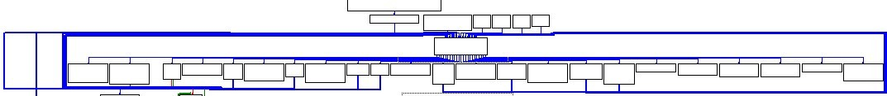
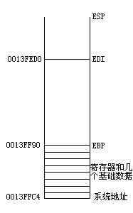

此文章是我学习VMProtect虚拟机加密程序的心得，关于VMProtect宏观理论，参考了N多的网络文章和资料，做个笔记，以后好回顾，O(∩_∩)O哈哈~

软件：正版VMProtect2.04加密的Win98记事本
加密选项：除了 编译--调试模式与水印 以外，全部打钩；虚拟计算机--数量为默认值1；编译类型：超级（变异+虚拟）
说明：即使是同一个程序，VMProtect每次加密出来的代码都是不同的，所以如果你也去加密一个Win98记事本，是不会得到我下面的代码的。
一、VMProtect虚拟机概述
虚拟机加密，就是说像VMP这样的保护程序，它会把源程序的X86指令变成自定义的伪指令，等到执行的时候，VMP内置在保护程序中的VM就会启动，读取伪指令，然后解析执行。

VMP是一个堆栈虚拟机，它的一切操作都是基于堆栈传递的。在VMP中，伪指令就是一个个的handler，VM中有一个核心的Dispatch部分，它通过读取程序的bytecode，然后在DispatchiTable里面定位到不同的handler中执行。绝大多数情况下，在一个handler中执行完成后，程序将回到Dispatch部分，然后到next handler中执行。

在上面的框架中，核心的部件就是Dispatch部分，下面并列的部件就是handlers。
经过VMP加密的X86指令，一条简单的指令被分解成数条VMP的伪指令，它按照自己的伪指令排列去实现原指令的功能，在加上其他的花指令混乱等等，你将完全看不到源程序指令。VMP自带的各种机制都不再是以X86指令的形式去实现，而是用自己的伪指令去测试。
二、VMProtect虚拟机具体解析

1）到达VM的Dispatch部分

VMP要保存程序当前的context状况，然后进入虚拟代码执行
以下的代码完整粘贴自OD。有*标记的是程序的流程代码。其他的是junk code
CPU Disasm
Address  Hex dump      Command                      Comments
00437817  . 68 B59DF9FC  PUSH FCF99DB5                  
0043781C  .^ E9 F320FFFF  JMP 00429914

00429914  > /C70424 0A4142 MOV DWORD PTR SS:[ESP],E342410A      ; *
0042991B  . |56        PUSH ESI
0042991C  . |E8 E3C50000  CALL 00435F04  
;开头放入了1个数字，这是基本数据。当然它现在是加密的。第一个push的数据并没有用，因为第二个push就覆盖掉了它，在动态调试中比较容易看出。

00435F04  $ E8 60160000  CALL 00437569                  ; \NOTEPAD.00437569

00437569 /$ C64424 04 87 MOV BYTE PTR SS:[ARG.1],87          ; NOTEPAD.00437569(guessed Arg1,Arg2,Arg3,Arg4,Arg5,Arg6,Arg7,Arg8,Arg9,Arg10,Arg11,Arg12,Arg13,Arg14,Arg15,Arg16,Arg17,Arg18,Arg19,Arg20)
0043756E |. C74424 08 D3A MOV DWORD PTR SS:[ARG.2],B433AFD3     ; *
00437576 |. 60        PUSHAD
00437577 |. 9C        PUSHFD
00437578 |. 8D6424 2C   LEA ESP,[ESP+2C] ；压入再多的数据都没用，这条指令直接修改了ESP指针
0043757C \. E9 015C0000  JMP 0043D182

；又放入了一个数据，当然它依然是加密的
；当前堆栈情况：
；0013FFBC  B433AFD3 ӯ3
；0013FFC0  E342410A .AB
；0013FFC4  7C817077 wp|  ; RETURN to kernel32.7C817077

0043D182 \> /E9 31020000  JMP 0043D3B8

0043D3B8 /> \60        PUSHAD
0043D3B9 |. 9C        PUSHFD
0043D3BA |. 68 82589578  PUSH 78955882
0043D3BF |. 897424 24   MOV DWORD PTR SS:[ESP+24],ESI        ; *
0043D3C3 |. 68 07421102  PUSH 2114207
0043D3C8 |. 68 8098AB76  PUSH 76AB9880
0043D3CD |. 57        PUSH EDI
0043D3CE |. 8D6424 30   LEA ESP,[ESP+30]
0043D3D2 \. E9 6C040000  JMP 0043D843
；我们现在可以来认识一点VMP的伎俩：
；1、虽然有很多的push指令，但是通过使用lea esp,[esp+xx]这样的指令，前面的所有的push都将作废
；2、为了跳过前面的junk push指令，在真正需要往堆栈放入数据的时候就使用mov dword ptr ss:[esp+xx],esi这样的指令，跳过了堆栈的xx空间来存储
；保存esi寄存器

0043D843 |> >E8 B6F6FFFF  CALL 0043CEFE                  ; \NOTEPAD.0043CEFE

0043CEFE  $ BE 054674C6  MOV ESI,C6744605                ; NOTEPAD.0043CEFE(guessed Arg1,Arg2,Arg3,Arg4,Arg5,Arg6,Arg7,Arg8,Arg9,Arg10,Arg11,Arg12,Arg13,Arg14,Arg15,Arg16,Arg17,Arg18,Arg19,Arg20)
0043CF03  . 8D6424 04   LEA ESP,[ESP+4]
0043CF07  . 0F80 D5050000 JO 0043D4E2
0043CF0D  . 57        PUSH EDI                      ; *
0043CF0E  . 68 EF0D9B40  PUSH 409B0DEF
0043CF13  . 0FCF      BSWAP EDI
0043CF15  . 5F        POP EDI
0043CF16  . 53        PUSH EBX
0043CF17  . 891424     MOV DWORD PTR SS:[ESP],EDX          ; *
0043CF1A  . 0FB6F1     MOVZX ESI,CL
0043CF1D  . 50        PUSH EAX                      ; *
0043CF1E  . 9C        PUSHFD                     
0043CF1F  . E9 C41A0000  JMP 0043E9E8
；保存edi edx eax

0043E9E8 |> \E8 8AF7FFFF  CALL 0043E177                  ; \NOTEPAD.0043E177
0043E177 /$ 66:0FCF    BSWAP DI                      ; Undocumented instruction or encoding
0043E17A |. 896C24 04   MOV DWORD PTR SS:[ARG.1],EBP        ; *
0043E17E \.^ E9 BEF5FFFF  JMP 0043D741
；保存ebp

0043D741 |> /871C24     XCHG DWORD PTR SS:[ESP],EBX         ; *
0043D744 |. |9C        PUSHFD
0043D745 |. |60        PUSHAD
0043D746 |. |894C24 20   MOV DWORD PTR SS:[ESP+20],ECX        ; *
0043D74A |. |60        PUSHAD
0043D74B |. |9C        PUSHFD
0043D74C |. |66:891C24   MOV WORD PTR SS:[ESP],BX           ; |Arg1
0043D750 |. |875424 40   XCHG DWORD PTR SS:[ESP+40],EDX       ; *
0043D754 |. |E8 D50E0000  CALL 0043E62E                  ; \NOTEPAD.0043E62E
；保存ebx ecx 再次的保存edx

0043E62E /$ 9C        PUSHFD                       ; *
0043E62F |. 8F4424 40   POP DWORD PTR SS:[ESP+40]          ; *
0043E633 |. 66:89C6    MOV SI,AX
0043E636 |. FF35 89D24300 PUSH DWORD PTR DS:[43D289]          ; *
0043E63C |. 8F4424 3C   POP DWORD PTR SS:[ESP+3C]          ; *
；保存eflags。和读取了一个数字0保存，这个0非常重要
0043E640 |. 0FCD      BSWAP EBP
0043E642 |. 66:FFC7    INC DI
0043E645 |. 47        INC EDI
0043E646 |. C74424 38 000 MOV DWORD PTR SS:[ESP+38],0         ; *
；再次放入了一个0
；我们必须要在这里停顿一下了。由于是静态的看文章，O__O"…，让我们来看一下堆栈：
0013FF90  00000000 .... ; 0
0013FF94  00000000 .... ; 数字0
0013FF98  00000246 F.. ; eflags
0013FF9C  7C92E514 |  ; edx
0013FFA0  0013FFB0 .  ; ecx
0013FFA4  7FFDF000 .0  ; ebx
0013FFA8  0013FFF0 .  ; ebp
0013FFAC  00000000 ....  ；eax
0013FFB0  7C92E514 |  ;edx
0013FFB4  00500065 e.P.  ；edi
0013FFB8  00640061 a.d.  ；esi
0013FFBC  B433AFD3 ӯ3   ；最开始的2个基础加密数据
0013FFC0  E342410A .AB
0013FFC4  7C817077 wp|  ; RETURN to kernel32.7C817077
；除了动态的esp寄存器，其他的寄存器已经保存完毕了，

0043E64E |. 0FCD      BSWAP EBP
0043E650 |. 66:87D5    XCHG BP,DX
0043E653 |. 66:897C24 08 MOV WORD PTR SS:[ESP+8],DI
0043E658 |. 66:F7D3    NOT BX
0043E65B |. 8B7424 68   MOV ESI,DWORD PTR SS:[ESP+68]        ; *
；它读取的是第一个基础数据
0013FFC0  E342410A .AB  ；*
0013FFC4  7C817077 wp|  ; RETURN to kernel32.7C817077

0043E65F |. 66:0FCD    BSWAP BP                      ; Undocumented instruction or encoding
0043E662 |. 0F98C6     SETS DH
0043E665 |. 0FCE      BSWAP ESI                     ; *
0043E667 |. 66:F7D2    NOT DX
0043E66A |. 66:0FBEEB   MOVSX BP,BL
0043E66E |. 4E        DEC ESI                      ; *
0043E66F |. 66:FFC5    INC BP
0043E672 |. 20F6      AND DH,DH
0043E674 |. 66:C1D2 0E  RCL DX,0E
0043E678 |. 66:81FE 3214 CMP SI,1432                    ; *
0043E67D |. 81F6 63A1000A XOR ESI,0A00A163                ; *

；到这里esi的计算完成，esi==0041E381，在VMP里，esi都是指向bytecode的，看来马上就要开始读取了，然后跳转到handler了，哈哈。。还有一些准备工作的，就是要划分堆栈空间的，理解好VMP的堆栈空间划分是至关重要的。
0043E683 |. 45        INC EBP
0043E684 |. 80FD EF    CMP CH,0EF
0043E687 |. 66:0FB3D5   BTR BP,DX
0043E68B |. 5A        POP EDX
0043E68C |. 8D6C24 34   LEA EBP,[ESP+34]                ; *
；这里给ebp传递0013FF90，切下第一刀
0043E690 |. 86F8      XCHG AL,BH
0043E692 |. 81EC 8C000000 SUB ESP,8C                    ; *
；分配大段的堆栈空间
0043E698 |. 66:0FBEFA   MOVSX DI,DL
0043E69C |. 89E7      MOV EDI,ESP                    ; *
；这里给edi传递0013FED0，切下第二刀

0043E69E |> C0FE 04    SAR DH,4
0043E6A1 |. 0F9FC3     SETG BL
0043E6A4 |. FEC8      DEC AL
0043E6A6 |. C0C0 02    ROL AL,2
0043E6A9 |. 89F3      MOV EBX,ESI                    ; *
；在ebx中备份一下esi的0041e381
0043E6AB |. 0FBAF2 05   BTR EDX,5
0043E6AF |. F7DA      NEG EDX
0043E6B1 |. 0FCA      BSWAP EDX
0043E6B3 |. 66:0FBAEA 0E BTS DX,0E
0043E6B8 |. 0375 00    ADD ESI,DWORD PTR SS:[EBP]          ; *
；[ebp]中的是堆栈0013FF90里面的0，看来这是一个偏移量，用来修正bytecode地址
0043E6BB |> 66:0FA5FA   SHLD DX,DI,CL                  ; Dispatch
0043E6BF |. 8A46 FF    MOV AL,BYTE PTR DS:[ESI-1]          ; *

；开始读取bytecode，看来准备工作完成。它没有读取[esi]，而是[esi-1]
0043E6C2 |. 88FA      MOV DL,BH
0043E6C4 |. 30D8      XOR AL,BL                     ; * 在ebx中备份bytecode地址；原来是要地址参与到计算中
0043E6C6 |. FECA      DEC DL                      

0043E6C8 |. 8D95 88EB93F7 LEA EDX,[EBP+F793EB88]
0043E6CE |. F6D0      NOT AL                       ; *
0043E6D0 |. 42        INC EDX
0043E6D1 |. F7D2      NOT EDX
0043E6D3 |. 0F9FC2     SETG DL
0043E6D6 |. FEC8      DEC AL                       ; *
0043E6D8 |. D0CA      ROR DL,1
0043E6DA |. C0C8 07    ROR AL,7                      ; * 一直在计算al值，算好了
0043E6DD |. F5        CMC
0043E6DE |. C0E6 06    SHL DH,6
0043E6E1 |. 83EE 01    SUB ESI,1                     ; * 指针减1，
0043E6E4 |. D0D2      RCL DL,1
0043E6E6 |. 66:0FB6D1   MOVZX DX,CL
0043E6EA |. 66:D1DA    RCR DX,1
0043E6ED |. 30C3      XOR BL,AL                     ; * bl可是参与到计算的，bl帮al算完了，现在al来帮bl算好下一次的值
0043E6EF |. 60        PUSHAD
0043E6F0 |. 66:0FBAE1 06 BT CX,6
0043E6F5 |.^ E9 32E9FFFF  JMP 0043D02C

0043D02C |> /C0DE 07    RCR DH,7
0043D02F |. |0FB6C0     MOVZX EAX,AL                   ; *
0043D032 |. |F5        CMC
0043D033 |. |E9 E7200000  JMP 0043F11F

0043F11F |> \38F5      CMP CH,DH
0043F121 |. 66:FFC2    INC DX
0043F124 |. 8B1485 DBE143 MOV EDX,DWORD PTR DS:[EAX*4+43E1DB]    ; *等你等到我心痛呀
；终于开始，DispatchTable原来是在43E1DB,获得的是加密的地址，如：49C4C29F，数据窗口去43E1DB看看，茫茫多的地址呀，有200多个，不过这个不代表着有200多个handler洒，应该有一些是指向相同的handler。
0043F12B |. F9        STC
0043F12C |. 84F4      TEST AH,DH
0043F12E |. 60        PUSHAD
0043F12F |.^ E9 CCEFFFFF  JMP 0043E100

0043E100 |> /81C2 6B197FB6 ADD EDX,B67F196B                ; *原来只用一条ADD指令就解出来了，上面的49C4C29F=》0043DC0A，很简单的解密，自己可以去DispatchTable计算出所有的
0043E106 |. |C60424 46   MOV BYTE PTR SS:[ESP],46
0043E10A |. |895424 3C   MOV DWORD PTR SS:[ESP+3C],EDX        ; * handler地址存一下，存到哪里呢？看看堆栈吧
；0013FECC  0043DC0A .C.  ; 存到这里
；0013FED0  E5064000 .@  ;这里是EDI指向的空间，看一下前面的堆栈划分图

0043E10E |. |9C        PUSHFD
0043E10F |. |68 A42795AD  PUSH AD9527A4
0043E114 |. |FF7424 0C   PUSH DWORD PTR SS:[ESP+0C]
0043E118 |. |FF3424     PUSH DWORD PTR SS:[ESP]
0043E11B |. |FF7424 4C   PUSH DWORD PTR SS:[ESP+4C]          ; *
0043E11F |. |C2 5000    RETN 50                      ; *
；这两条*指令要一起看，第一条push的就是0013FECC  0043DC0A这个handler地址，第二条就跑去找handler

2）handlers解析

紧接着上文，第一个进入的handler

1

;bytecode:[0041E380]=0C ; dispatchtable:[0043E563]=49C4C29F handleraddr:0043DC0A

;功能（按照流程应该放在handler后面，但为了方便，把它放到这里）：把ebpstack中，ebp指向的当前数据，移动到edistack，具体位置则根据eax值变动；移动到[edi+eax]的位置

0043DC0A |. 66:D3D2    RCL DX,CL
0043DC0D |. 66:F7DA    NEG DX
0043DC10 |. 8D14A5 BD3F7D LEA EDX,[FA7D3FBD]
0043DC17 |. 39F0      CMP EAX,ESI
0043DC19 |. F6D8      NEG AL                       ; *
0043DC1B |. 8D96 834403BB LEA EDX,[ESI+BB034483]
0043DC21 |. 9C        PUSHFD
0043DC22 |. F8        CLC
0043DC23 |. 66:0FCA    BSWAP DX                      ; Undocumented instruction or encoding
0043DC26 |. C0C8 07    ROR AL,7                      ; *
0043DC29 |. 66:F7DA    NEG DX
0043DC2C |. 8D92 915411CF LEA EDX,[EDX+CF115491]
0043DC32 |. FECA      DEC DL
0043DC34 |. 2C 20      SUB AL,20                     ; *
0043DC36 |. 81E2 37007496 AND EDX,96740037
0043DC3C |. C0D2 05    RCL DL,5
0043DC3F |. 52        PUSH EDX
0043DC40 |. F9        STC
0043DC41 |. 24 3C      AND AL,3C                     ; *
0043DC43 |. 8D6424 08   LEA ESP,[ESP+8]
0043DC47 |. 0F8F E90E0000 JG 0043EB36
；计算eax中的值

0043EB36 /> \0FBDD4     BSR EDX,ESP
0043EB39 |. 66:81D2 A36F ADC DX,6FA3
0043EB3E |. E8 3DF5FFFF  CALL 0043E080                  ; \NOTEPAD.0043E080

0043E080 |$ 8B55 00    MOV EDX,DWORD PTR SS:[EBP]          ; *
0043E083 |. F6C6 E4    TEST DH,E4
0043E086 |. 83C5 04    ADD EBP,4                     ; *
0043E089 |. 60        PUSHAD
0043E08A |. 60        PUSHAD
0043E08B \.^ E9 47F3FFFF  JMP 0043D3D7
；获取[ebp]数据，指针地址+4

0043D3D7 /> /891438     MOV DWORD PTR DS:[EDI+EAX],EDX       ; *
0043D3DA |. |FF3424     PUSH DWORD PTR SS:[ESP]
0043D3DD |. |68 7334B716  PUSH 16B73473
0043D3E2 |. |8D6424 4C   LEA ESP,[ESP+4C]
0043D3E6 \. |E9 D0120000  JMP 0043E6BB
;移动到[edi+eax]位置

;ebpstack的值是那些呢，就是context和几个基础数据

;handler结束，回到Dispatch部分

0043E6BB |> >66:0FA5FA   SHLD DX,DI,CL                  ; Dispatch
0043E6BF |. |8A46 FF    MOV AL,BYTE PTR DS:[ESI-1]          ; *
0043E6C2 |. |88FA      MOV DL,BH
0043E6C4 |. |30D8      XOR AL,BL                     ; *
0043E6C6 |. |FECA      DEC DL
0043E6C8 |. |8D95 88EB93F7 LEA EDX,[EBP+F793EB88]
0043E6CE |. |F6D0      NOT AL                       ; *
0043E6D0 |. |42        INC EDX
0043E6D1 |. |F7D2      NOT EDX
0043E6D3 |. |0F9FC2     SETG DL
0043E6D6 |. |FEC8      DEC AL                       ; *
0043E6D8 |. |D0CA      ROR DL,1
0043E6DA |. |C0C8 07    ROR AL,7                      ; *
0043E6DD |. |F5        CMC
0043E6DE |. |C0E6 06    SHL DH,6
0043E6E1 |. |83EE 01    SUB ESI,1                     ; *
0043E6E4 |. |D0D2      RCL DL,1
0043E6E6 |. |66:0FB6D1   MOVZX DX,CL
0043E6EA |. |66:D1DA    RCR DX,1
0043E6ED |. |30C3      XOR BL,AL                     ; *
0043E6EF |. |60        PUSHAD
0043E6F0 |. |66:0FBAE1 06 BT CX,6
0043E6F5 |.^|E9 32E9FFFF  JMP 0043D02C

0043D02C |> /C0DE 07    RCR DH,7
0043D02F |. |0FB6C0     MOVZX EAX,AL                   ; *
0043D032 |. |F5        CMC
0043D033 |. |E9 E7200000  JMP 0043F11F

0043F11F |> \38F5      CMP CH,DH
0043F121 |. 66:FFC2    INC DX
0043F124 |. 8B1485 DBE143 MOV EDX,DWORD PTR DS:[EAX*4+43E1DB]    ; *
0043F12B |. F9        STC
0043F12C |. 84F4      TEST AH,DH
0043F12E |. 60        PUSHAD
0043F12F |.^ E9 CCEFFFFF  JMP 0043E100

0043E100 |> /81C2 6B197FB6 ADD EDX,B67F196B                ; *
0043E106 |. |C60424 46   MOV BYTE PTR SS:[ESP],46
0043E10A |. |895424 3C   MOV DWORD PTR SS:[ESP+3C],EDX        ; *
0043E10E |. |9C        PUSHFD
0043E10F |. |68 A42795AD  PUSH AD9527A4
0043E114 |. |FF7424 0C   PUSH DWORD PTR SS:[ESP+0C]
0043E118 |. |FF3424     PUSH DWORD PTR SS:[ESP]
0043E11B |. |FF7424 4C   PUSH DWORD PTR SS:[ESP+4C]          ; *
0043E11F |. |C2 5000    RETN 50                      ; *
；我们要开始进入下一个handler，以上的dispatch部分代码，在后面的文章中将不再出现

2

;bytecode:[0041E37F]=18 ; dispatchtable:[0043E1F7]=49C4CED4 handleraddr:0043E83F

;功能：读取[esi-4]的dword，经过运算后，存入[ebp-4]
0043E83F  . F6D8      NEG AL
0043E841  . 80CC EA    OR AH,EA
0043E844  . 3F        AAS
0043E845  . 8B46 FC    MOV EAX,DWORD PTR DS:[ESI-4]        ; *
0043E848  . F8        CLC
0043E849  . 80FE 1A    CMP DH,1A
0043E84C  . F9        STC
0043E84D  . 0FC8      BSWAP EAX                     ; *
0043E84F  . 66:39F5    CMP BP,SI
0043E852  . 01D8      ADD EAX,EBX                    ; *
0043E854  . F8        CLC
0043E855  . 60        PUSHAD
0043E856  . F8        CLC
0043E857  . C1C8 04    ROR EAX,4                     ; *
0043E85A  .^ E9 E6F0FFFF  JMP 0043D945

;读取esi指向的bytecode数据中的下一个dword，并进行运算
0043D945  > /C70424 164993 MOV DWORD PTR SS:[ESP],89934916
0043D94C  . |C64424 04 47 MOV BYTE PTR SS:[ESP+4],47
0043D951  . |F8        CLC
0043D952  . |8D76 FC    LEA ESI,[ESI-4]                 ; *
0043D955  . |F5        CMC
0043D956  . |2D E131FF38  SUB EAX,38FF31E1                ; *
0043D95B  . |9C        PUSHFD                       ; |Arg2
0043D95C  . |F9        STC                         ; |
0043D95D  . |68 71811105  PUSH 5118171                   ; |Arg1 = 5118171
0043D962  . |66:0FBAE7 02 BT DI,2                      ; |
0043D967  . |C1C0 0A    ROL EAX,0A                    ; |*
0043D96A  . |84C1      TEST CL,AL                    ; |
0043D96C  . |01C3      ADD EBX,EAX                    ; |
0043D96E  . |F9        STC                         ; |
0043D96F  . |F5        CMC                         ; |
0043D970  . |83ED 04    SUB EBP,4                     ; |*
0043D973  . |E8 98FDFFFF  CALL 0043D710                  ; \NOTEPAD.0043D710
；既然读出一个dword，相应的就要修正esi指针[esi-4]，并继续运算eax中取出的dword

；最后有一条SUB EBP,4指令，如果我们结合上一个handler一起来看的话，前面把ebp+4，这里重新让ebp回到了0013FF90，继续指向ebpstack空间

0043D710 |$ 8945 00    MOV DWORD PTR SS:[EBP],EAX          ; *
0043D713 |. 9C        PUSHFD
0043D714 |. 51        PUSH ECX
0043D715 |. FF3424     PUSH DWORD PTR SS:[ESP]
0043D718 |. 9C        PUSHFD
0043D719 |. 8D6424 3C   LEA ESP,[ESP+3C]
0043D71D \.^ E9 37F7FFFF  JMP 0043CE59
；eax中的运算结果8021D2F0，存入[ebp]

0043CE59 |> /98        CWDE
0043CE5A |. |8D47 50    LEA EAX,[EDI+50]
0043CE5D |. |F7C2 2BCFEA55 TEST EDX,55EACF2B
0043CE63 |. |E9 F01F0000  JMP 0043EE58

0043EE58 |> \60        PUSHAD
0043EE59 |. 66:0FA3F0   BT AX,SI
0043EE5D |. 39C5      CMP EBP,EAX
0043EE5F |. E9 CDE5FFFF  JMP 0043D431

0043D431  > /E9 521C0000  JMP 0043F088

0043F088 /> \8D6424 20   LEA ESP,[ESP+20]
0043F08C |.^ 0F87 29F6FFFF JA 0043E6BB
；handler结束，返回dispatch

3

;bytecode:[0041E37A]=52 ; dispatchtable:[0043E59F]=49C4B5B9 handleraddr:0043CF24

;功能：取出[ebp]数据，与[ebp-4]相加，保存在eax中，并清除[ebp]中的数据
0043CF24 /. D2E4      SHL AH,CL
0043CF26 |. F6D4      NOT AH
0043CF28 |. 8D0455 D1E8E1 LEA EAX,[EDX*2+E0E1E8D1]
0043CF2F |. 8B45 00    MOV EAX,DWORD PTR SS:[EBP]          ; *
0043CF32 |. 66:0FA3F4   BT SP,SI
0043CF36 \. E9 961F0000  JMP 0043EED1
；取出[EBP]数据，现在0013FF90中可不再是0了，而是上个handler中得到的数据8021D2F0

0043EED1 |> \84C5      TEST CH,AL
0043EED3 |. 0145 04    ADD DWORD PTR SS:[EBP+4],EAX        ; *
0043EED6 |. 52        PUSH EDX
0043EED7 |. C60424 83   MOV BYTE PTR SS:[LOCAL.0],83
0043EEDB |. 8D6424 04   LEA ESP,[ARG.RETADDR]
0043EEDF |.^ 0F83 68DFFFFF JNB 0043CE4D
;取出的数据还要和[ebp+4]相加。

；[0013FF94]=0,还记得这个0是怎么来的，是VMP初始化部分是从内存中读出来的

0043CE4D |> /60        PUSHAD
0043CE4E |. |60        PUSHAD
0043CE4F |. |9C        PUSHFD
0043CE50 |. |8F4424 3C   POP DWORD PTR SS:[ESP+3C]
0043CE54 |. |E9 66030000  JMP 0043D1BF

0043D1BF /> \FF7424 3C   PUSH DWORD PTR SS:[ESP+3C]          ; *
0043D1C3 |. 8F45 00    POP DWORD PTR SS:[EBP]            ; *
0043D1C6 |. C70424 1D2D04 MOV DWORD PTR SS:[ESP],FC042D1D
0043D1CD |. 9C        PUSHFD
0043D1CE |. 9C        PUSHFD
0043D1CF |. 9C        PUSHFD
0043D1D0 |. 8D6424 4C   LEA ESP,[ESP+4C]
0043D1D4 \. E9 E2140000  JMP 0043E6BB
；重新填充数据到[ebp]中，不留痕迹，现在已经不能再堆栈中找到刚才的操作数了

；返回dispatch

4

和1相同

;bytecode:[0041E379]=34 ; dispatchtable:[0043E543]=49C4C29F handleraddr:0043DC0A

;功能：把ebpstack中，ebp指向的当前数据，移动到edistack，具体位置则根据eax值变动；移动到[edi+eax]的位置

；[0013FEFC]=edx=ebp=00000286

5

和1相同

;bytecode:[0041E378]=F5 ; dispatchtable:[0043E57B]=49C4C29F handleraddr:0043DC0A

;功能：把ebpstack中，ebp指向的当前数据，移动到edistack，具体位置则根据eax值变动；移动到[edi+eax]的位置

；[0013FEE0]=edx=ebp=8021D2F0

6

和1相同

;bytecode:[0041E377]=07 ; dispatchtable:[0043E54B]=49C4C29F handleraddr:0043DC0A

;功能：把ebpstack中，ebp指向的当前数据，移动到edistack，具体位置则根据eax值变动；移动到[edi+eax]的位置

；[0013FEF8]=edx=ebp=00000246

7

和1大致相同

;bytecode:[0041E376]=CD ; dispatchtable:[0043E59B]=49C4C29F handleraddr:0043DC0A

;功能：把ebpstack中，ebp指向的当前数据，移动到edistack，具体位置则根据eax值变动；移动到[edi+eax]的位置

；[0013FED0]=edx=ebp=7C92E514

0043DC0A |. 66:D3D2    RCL DX,CL
0043DC0D |. 66:F7DA    NEG DX
0043DC10 |. 8D14A5 BD3F7D LEA EDX,[FA7D3FBD]
0043DC17 |. 39F0      CMP EAX,ESI
0043DC19 |. F6D8      NEG AL                       ; *
0043DC1B |. 8D96 834403BB LEA EDX,[ESI+BB034483]
0043DC21 |. 9C        PUSHFD
0043DC22 |. F8        CLC
0043DC23 |. 66:0FCA    BSWAP DX                      ; Undocumented instruction or encoding
0043DC26 |. C0C8 07    ROR AL,7                      ; *
0043DC29 |. 66:F7DA    NEG DX
0043DC2C |. 8D92 915411CF LEA EDX,[EDX+CF115491]
0043DC32 |. FECA      DEC DL
0043DC34 |. 2C 20      SUB AL,20                     ; *
0043DC36 |. 81E2 37007496 AND EDX,96740037
0043DC3C |. C0D2 05    RCL DL,5
0043DC3F |. 52        PUSH EDX
0043DC40 |. F9        STC
0043DC41 |. 24 3C      AND AL,3C                     ; *
0043DC43 |. 8D6424 08   LEA ESP,[ESP+8]
0043DC47 |. 0F8F E90E0000 JG 0043EB36

；在前面的handler中，程序到这里就跳了。。但是这个不是。。程序流向下了。eax出现了0
0043DC4D |. 60        PUSHAD
0043DC4E |. 8B55 00    MOV EDX,DWORD PTR SS:[EBP]          ; *
0043DC51 \. E9 86010000  JMP 0043DDDC

0043DDDC  > /E9 E4000000  JMP 0043DEC5

0043DEC5 |> \881424     MOV BYTE PTR SS:[ESP],DL
0043DEC8 |. 0FBAE6 05   BT ESI,5
0043DECC |. 83C5 04    ADD EBP,4                     ; *
0043DECF |. 9C        PUSHFD
0043DED0 |. 68 FA794941  PUSH 414979FA                  ; |Arg1 = 414979FA
0043DED5 |. C64424 04 65 MOV BYTE PTR SS:[ESP+4],65          ; |Arg2 => 65
0043DEDA |. E8 87F6FFFF  CALL 0043D566                  ; \NOTEPAD.0043D566

0043D566 /$ 891438     MOV DWORD PTR DS:[EDI+EAX],EDX       ; *
0043D569 |. 9C        PUSHFD
0043D56A |. C60424 2E   MOV BYTE PTR SS:[ESP],2E
0043D56E |. FF3424     PUSH DWORD PTR SS:[ESP]
0043D571 |. 8D6424 34   LEA ESP,[ESP+34]
0043D575 \. E9 41110000  JMP 0043E6BB

经过这几天的VMP跟踪，在做了紧张的思想斗争后，本人决定放弃原来的想法，不再去记录所有的handlers了，我放弃了，我give up了。。。
我决定从宏观上去看VMP，对于handlers也是一样，还是提供一些精品handlers吧，有时间就来更新这个帖子，没时间就不来了。。
要看这个还是要对vmp的堆栈划分有明确的理解，我把ebp指向的堆栈部分叫ebpstack，把edi指向的堆栈部分叫edistack，把esp指向的堆栈部分叫espstack
第一次很重要，所以我决定不是放一个，而是放两个handlers，特别突出这个first的重要性，^_^。
the first:
handleraddr:0043DC0A
源代码：
CPU Disasm
Address  Hex dump      Command                      Comments
0043DC0A  66:D3D2      RCL DX,CL
0043DC0D  66:F7DA      NEG DX
0043DC10  8D14A5 BD3F7DFA LEA EDX,[FA7D3FBD]
0043DC17  39F0         CMP EAX,ESI
0043DC19  F6D8         NEG AL                       ; *
0043DC1B  8D96 834403BB  LEA EDX,[ESI+BB034483]
0043DC21  9C            PUSHFD
0043DC22  F8            CLC
0043DC23  66:0FCA      BSWAP DX                      ; Undocumented instruction or encoding
0043DC26  C0C8 07      ROR AL,7                      ; *
0043DC29  66:F7DA      NEG DX
0043DC2C  8D92 915411CF  LEA EDX,[EDX+CF115491]
0043DC32  FECA         DEC DL
0043DC34  2C 20        SUB AL,20                     ; *
0043DC36  81E2 37007496  AND EDX,96740037
0043DC3C  C0D2 05      RCL DL,5
0043DC3F  52            PUSH EDX
0043DC40  F9            STC
0043DC41  24 3C         AND AL,3C                     ; *
0043DC43  8D6424 08    LEA ESP,[ESP+8]
0043DC47  0F8F E90E0000  JG 0043EB36   ；这里有一个分支，但是两个分支都是一样的，除了有一次走过另一个分支，其他都是跳走了，所以下面的代码我也就不发了，发跳转部分。

0043EB36  0FBDD4        BSR EDX,ESP
0043EB39  66:81D2 A36F  ADC DX,6FA3
0043EB3E  E8 3DF5FFFF   CALL 0043E080

0043E080  8B55 00      MOV EDX,DWORD PTR SS:[EBP]          ; *
0043E083  F6C6 E4      TEST DH,E4
0043E086  83C5 04      ADD EBP,4                     ; *
0043E089  60         PUSHAD
0043E08A  60         PUSHAD
0043E08B ^ E9 47F3FFFF   JMP 0043D3D7

0043D3D7  891438      MOV DWORD PTR DS:[EDI+EAX],EDX       ; *
0043D3DA  FF3424      PUSH DWORD PTR SS:[ESP]
0043D3DD  68 7334B716   PUSH 16B73473
0043D3E2  8D6424 4C    LEA ESP,[ESP+4C]
0043D3E6  E9 D0120000   JMP 0043E6BB ；到这里就结束了，下面就回到Dispatch部分了

估计没有人有兴趣去静态分析和好好的看上面的代码，我还是再贴个去除了junk code的好了
0043DC19  F6D8        NEG AL                       ; *
0043DC26  C0C8 07    ROR AL,7                      ; *
0043DC34  2C 20       SUB AL,20                     ; *
0043DC41  24 3C       AND AL,3C                     ; *

0043E080  8B55 00      MOV EDX,DWORD PTR SS:[EBP]          ; *
0043E086  83C5 04      ADD EBP,4                     ; *

0043D3D7  891438      MOV DWORD PTR DS:[EDI+EAX],EDX       ; *

计算al，以al为索引，mov [edi+eax],[ebp]，al是从bytecode里读出来的，vmp的bytecode压力应该是很大的，首先是在Dispatchi里计算出来al，然后通过[EAX*4+43E1DB] 得到handleraddress，这样了还不不能休息，进入这样的handler里面，还要继续参与计算。
这就是一个移动数据，VMP不断的使用这个handler，把数据从ebpstack移动到edistack，感觉vmp挺无聊的，有事的时候调用一下这个，没事的时候也调用一下这个，把数据挪去挪去的。
挪去还要挪来，这久有了一个和它相对应的handler。
handleraddress:0043DFBE
CPU Disasm
Address  Hex dump      Command                      Comments
0043DFBE  0FBED3      MOVSX EDX,BL
0043DFC1  F6D8        NEG AL                       ; *
0043DFC3  66:0FB6D2    MOVZX DX,DL
0043DFC7  66:0FABDA    BTS DX,BX
0043DFCB  0FCA        BSWAP EDX
0043DFCD  C0C8 07      ROR AL,7                      ; *
0043DFD0  66:0FABD2    BTS DX,DX
0043DFD4  9C         PUSHFD
0043DFD5  66:89EA      MOV DX,BP
0043DFD8  00FA        ADD DL,BH
0043DFDA  2C 20       SUB AL,20                     ; *
0043DFDC  F5         CMC
0043DFDD  24 3C       AND AL,3C                     ; *
0043DFDF  E8 84EEFFFF   CALL 0043CE68

0043CE68  D2E2        SHL DL,CL
0043CE6A  28FA        SUB DL,BH
0043CE6C  8B1438      MOV EDX,DWORD PTR DS:[EDI+EAX]       ; *
0043CE6F  F5         CMC
0043CE70  9C         PUSHFD
0043CE71  83ED 04      SUB EBP,4                     ; *
0043CE74  E8 00000000   CALL 0043CE79

0043CE79  8955 00      MOV DWORD PTR SS:[EBP],EDX          ; *
0043CE7C  9C         PUSHFD
0043CE7D  FF3424      PUSH DWORD PTR SS:[ESP]
0043CE80  8D6424 18    LEA ESP,[ESP+18]
0043CE84 ^ E9 D0FFFFFF   JMP 0043CE59

0043CE59  /98         CWDE
0043CE5A  |8D47 50      LEA EAX,[EDI+50]
0043CE5D  |F7C2 2BCFEA55  TEST EDX,55EACF2B
0043CE63  |E9 F01F0000   JMP 0043EE58

0043EE58  \60         PUSHAD
0043EE59  66:0FA3F0    BT AX,SI
0043EE5D  39C5        CMP EBP,EAX
0043EE5F ^ E9 CDE5FFFF   JMP 0043D431

0043D431  /E9 521C0000   JMP 0043F088

0043F088  \8D6424 20    LEA ESP,[ESP+20]
0043F08C ^ 0F87 29F6FFFF  JA 0043E6BB
以上代码完整粘贴自OD，简化后的代码如下：
0043DFC1  F6D8        NEG AL                       ; *
0043DFCD  C0C8 07      ROR AL,7                      ; *
0043DFDA  2C 20       SUB AL,20                     ; *
0043DFDD  24 3C       AND AL,3C                     ; *

0043CE6C  8B1438      MOV EDX,DWORD PTR DS:[EDI+EAX]       ; *

0043CE71  83ED 04      SUB EBP,4                     ; *
0043CE79  8955 00      MOV DWORD PTR SS:[EBP],EDX          ; *
这个handler和上一个是对应的，这个是计算al，以al为索引，把数据从[edi+eax]移动到[ebp]，也就是把数据从edistack移动到ebpstack
通过这2个handlers，VMP把数据动来动去，动来动去的，有事时候动一下，没事时候动一下，无聊时候动一下。

the second：
handleraddress:0043D198
0043D198  98         CWDE
0043D199  66:0FBCD2    BSF DX,DX
0043D19D  10EA        ADC DL,CH
0043D19F  66:0FB6C2    MOVZX AX,DL
0043D1A3  8B45 00      MOV EAX,DWORD PTR SS:[EBP]          ; *
0043D1A6  66:F7C3 3739  TEST BX,3937
0043D1AB  D0D2        RCL DL,1
0043D1AD  8B55 04      MOV EDX,DWORD PTR SS:[EBP+4]        ; *
0043D1B0  66:0FBAE5 05  BT BP,5
0043D1B5  68 3B4E2623   PUSH 23264E3B
0043D1BA  E9 EA0C0000   JMP 0043DEA9

0043DEA9  \66:0FBAE5 06  BT BP,6
0043DEAE  F7D0        NOT EAX                      ; *
0043DEB0 ^ E9 2CFFFFFF   JMP 0043DDE1

0043DDE1  /F7D2        NOT EDX                      ; *
0043DDE3  |F8         CLC
0043DDE4  |E8 D8EFFFFF   CALL 0043CDC1

0043CDC1  F8         CLC                         ; NOTEPAD.0043CDC1(guessed Arg1,Arg2,Arg3,Arg4,Arg5,Arg6,Arg7,Arg8,Arg9,Arg10,Arg11,Arg12,Arg13,Arg14,Arg15,Arg16,Arg17,Arg18,Arg19,Arg20)
0043CDC2  21D0        AND EAX,EDX                    ; *
0043CDC4  E9 28130000   JMP 0043E0F1

0043E0F1  \9C         PUSHFD
0043E0F2  60         PUSHAD
0043E0F3  68 E0E4B3D7   PUSH D7B3E4E0
0043E0F8  8945 04      MOV DWORD PTR SS:[EBP+4],EAX        ; *
0043E0FB ^ E9 FBEFFFFF   JMP 0043D0FB

0043D0FB  /9C          PUSHFD                                    ; *
0043D0FC  |8F4424 2C    POP DWORD PTR SS:[ESP+2C]        ; *
0043D100  |E9 371B0000   JMP 0043EC3C

0043EC3C  \C64424 04 8D  MOV BYTE PTR SS:[ESP+4],8D
0043EC41  55            PUSH EBP
0043EC42  FF7424 0C    PUSH DWORD PTR SS:[ESP+0C]
0043EC46  FF7424 34    PUSH DWORD PTR SS:[ESP+34]          ; *
0043EC4A  8F45 00      POP DWORD PTR SS:[EBP]            ; *
0043EC4D  9C           PUSHFD
0043EC4E  8D6424 3C    LEA ESP,[ESP+3C]
0043EC52 ^ E9 64FAFFFF   JMP 0043E6BB
简化后：

0043D1A3  8B45 00      MOV EAX,DWORD PTR SS:[EBP]          ; *
0043D1AD  8B55 04      MOV EDX,DWORD PTR SS:[EBP+4]        ; *
0043DEAE  F7D0        NOT EAX                      ; *
0043DDE1  /F7D2        NOT EDX                      ; *
0043CDC2  21D0        AND EAX,EDX                    ; *
0043E0F8  8945 04      MOV DWORD PTR SS:[EBP+4],EAX        ; *

0043D0FB  /9C         PUSHFD                                    ; *
0043D0FC  |8F4424 2C    POP DWORD PTR SS:[ESP+2C]       ; *

0043EC46  FF7424 34    PUSH DWORD PTR SS:[ESP+34]          ; *
0043EC4A  8F45 00      POP DWORD PTR SS:[EBP]            ; *
这个handler可是很重要的东西，先来看它上半部分，我们再简化一下
a=[ebp]    b=[ebp+4]
not a
not b
and a,b
mov [ebp+4],a
最后的a放到原来的b位置，都是在ebpstack中

下半部分这个也经常可以看到，关键在于它第二个push的数据的位置，这个位置就在edi指针的上一个位置，edi=0013FFD0，而这个push的位置是0013FFCC，这就是第一个PUSH放进去的数据，
现在我们可以知道，当上面的计算完成后，结果 是放到原来的b位置,而a位置是被当前的标志位覆盖掉。

这个handler这么著名，原因在于哪里呢？这个我就不班门弄斧了，直接贴一段别人的劳动成果：
以下内容粘贴自：http://hi.baidu.com/depteicn/blog/item/4941f6b73c8036f331add189.html
vmp里面只有1个逻辑运算指令 not_not_and 设这条指令为P
P(a,b) = ~a & ~b

这条指令的神奇之处就是能模拟 not and or xor 4条常规的逻辑运算指令
怕忘记了，直接给出公式，后面的数字指需要几次P运算

not(a)  = P(a,a)  1
and(a,b) = P(P(a,a),P(b,b))  3
or(a,b)  = P(P(a,b),P(a,b))  2
xor(a,b) = P(P(P(a,a),P(b,b)),P(a,b)) 5

上面的次数应该是最少需要的次数了，当然也可以展开，那样就更加复杂了
vmp用1条指令模拟了4条指令，因此逆向起来比较复杂，如果中间夹杂垃圾运算，那么工程量非同小可
下面来证明一下上面4条等式

not(a) = ~a = ~a & ~a = P(a,a)
and(a,b) = a & b = ~(~a) & ~(~b) = P(not(a),not(b)) = P(P(a,a),P(b,b))
or(a,b) = a | b = ~(~(a|b)) = ~(~a & ~b) = ~P(a,b) = P(P(a,b),P(a,b))
xor(a,b) = ~a & b | a & ~b = ~(~(~a & b | a & ~b)) = ~(~(~a & b) & ~(a & ~b)) = ~((a | ~b) & (~a | b)) = ~(1 | 1 | a & b | ~a & ~b) = ~(a & b) & ~(~a & ~b) = P(and(a,b),P(a,b)) = P(P(P(a,a),P(b,b)),P(a,b))

上面的xor是最复杂的，不过简化后也只需要5次运算就可以实现了

至于eflag，eflag是根据结果来定的，由于都是逻辑运算，所以最后取一下eflag即可

在某修改版的vm中，还可以看到另一个强大的指令 not_not_or 设这条指令为Q
Q(a,b) = ~a | ~b

同样，这一条指令可以模拟4条常规的逻辑运算指令
怕忘记了，直接给出公式，后面数字表示需要几次Q运算

not(a)  = Q(a,a)  1
and(a,b) = Q(Q(a,b),Q(a,b))  2
or(a,b)  = Q(Q(a,a),Q(b,b))  3
xor(a,b) = Q(Q(Q(a,a),b),Q(a,Q(b,b))) 5

基本和上面P指令相同，效率没什么变化
只对最复杂的xor证明一下，以防忘记

xor(a,b) = ~a & b | a & ~b = ~(~(~a & b | a & ~b)) = ~(~(~a & b) & ~(a & ~b)) = ~((~(~a) | ~b) & (~a | ~(~b))) = ~(~(~a) | ~b) | ~(~a | ~(~b)) = Q(Q(not(a),b),Q(a,not(b))) = Q(Q(Q(a,a),b),Q(a,Q(b,b)))

实在太难了，完全搞不定啊

写得太好了，不用解释了
还是说一下，只用一句话的讲么：就是说，通过上面一个handler的不断调用，VMP可以实现not and or xor 这4个逻辑运算。（真的只用一句话就解释了(⊙o⊙)哦。。哈哈哈哈）
12楼yingyue还有说明

