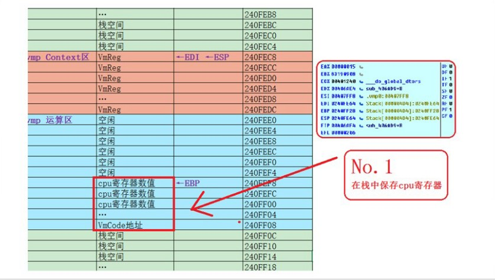
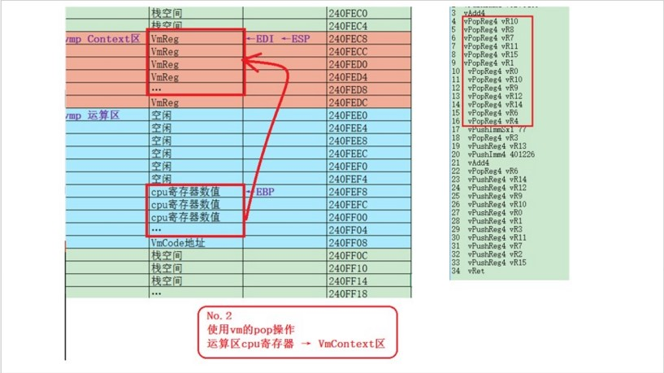
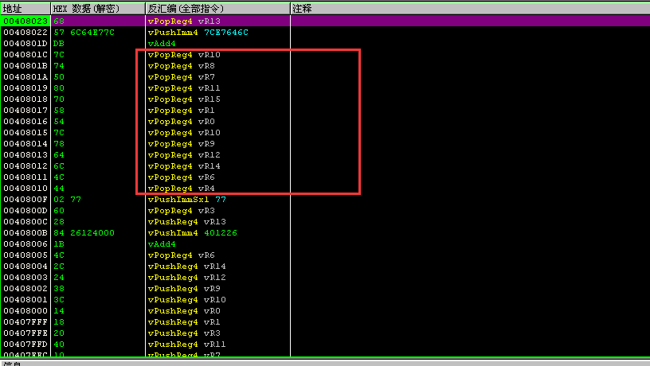
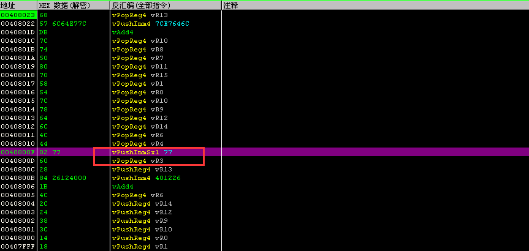
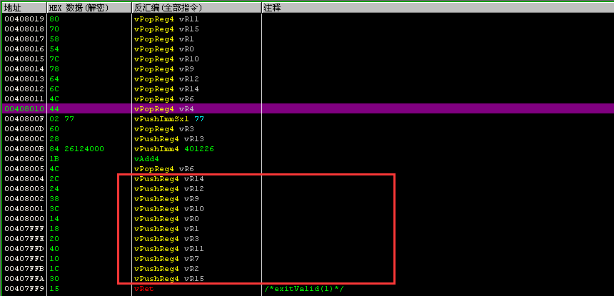
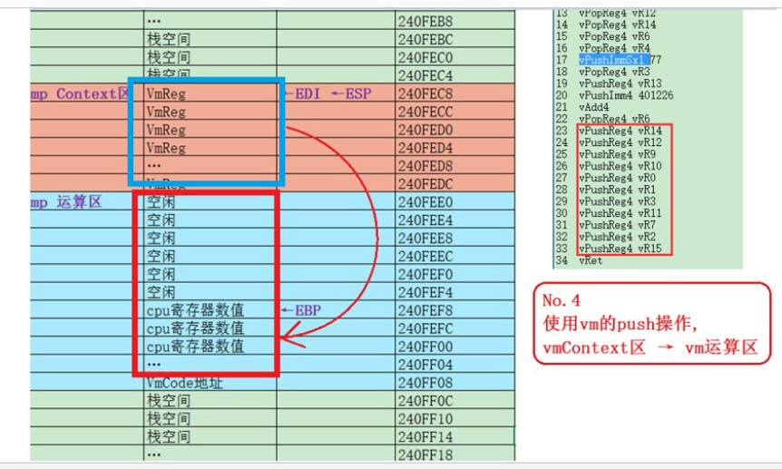
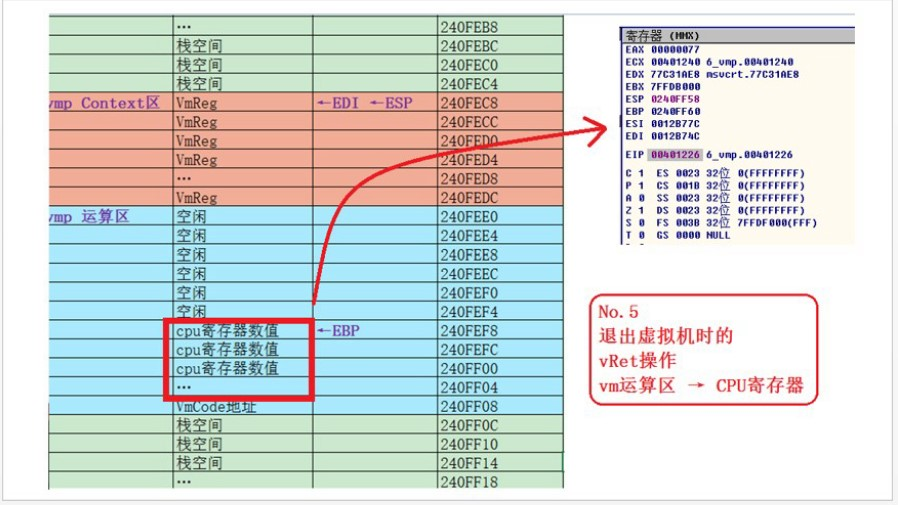

# 人肉跟踪VMProtect入口至出口运行全过程(1) 

url:https://bbs.pediy.com/thread-220689.htm

# 一 、前言

跟vmp正面刚的起因是想自己实现一个ARM VMProtect的保护软件，
作者在查阅了大量资料以后还是不太理解 VMProtect 到底是怎么实现的，
·
·
·
·
终于意识到没有扎实分析过 VMProtect ，
只停留在看别人分析的臆想阶段，
是不可能理解VMProtect的。
所以下定决心耐心分析，
追随大佬们的脚印前行，
也开始自己为技术疯狂的年月。
·
·
·
·

# 二 、分析的样本：

是使用vmp v2.04 虚拟难度下的最快速度(所有都不勾选)设置，
对一条mov eax,0x77指令加保护的最简单样本，
从头到尾跟踪完这个样本，就理解 VMProtect的入口出口，虚拟寄存器、虚拟栈。
分析记录无视了一些并非新手最应该关注的细节，
分析过程不保证完全准确，甚至有一些错误，希望大家能理解。
·
·
·
·

# 三 、附件的内容：

pdf和rar中是本菜跟vmp初次正面交锋全过程记录，
逐条人肉记录了指令执行的每一次堆栈和寄存器变化，
争取追究每个细节，过程写的详细而罗嗦，比较费时间，
不适合高手看，不适合没时间的人看，适合想写出vmp的新手看。
·
·
·
·

# 四 、没精力的同学：

可以看贴子中提炼后的重点内容和附件.xlsx。
希望对写vmp感兴趣但一知半解的人有所帮助。
·
·
·
·

# 五 、另外：

建议动手调试vmp样本前，
最好看过其他一些几篇文章，对vmp有一个初步的认识。-_-!!

### 1 虚拟机保护技术浅谈

https://bbs.pediy.com/thread-139586.htm

### 2 VMP虚拟机加壳的原理学习

https://www.tuicool.com/articles/bIFrMz

### 3 动手实现代码虚拟机

http://www.mottoin.com/87374.html

### 4 VMProtect2.04加壳程序从入门到精通

https://bbs.pediy.com/thread-121412.htm
·
·
·
·
————————————————————————————————————————————————————————

# 六 、提炼了下重点内容，没时间的同学直接看这个过程：

### 首先打开附件

" 用Excel颜色标记出_VMProtect样本Trace的内容的结构.xlsx ",

### 1 表格中我标出四中颜色,紫色、蓝色、橙色、黄色,

### 2 大概的规律是，紫色部分只出现了一次,后面全都是蓝橙黄的组合.

### 3 所以代码分为两个部分:(1)紫色(2)蓝橙黄。

·
·
·
·

## 1 最开始紫色部分作用（vmp指令执行前的准备）

(1)向正常栈push所有真实寄存器。
·
(2)意图在正常栈中构建出一个给vmp使用的空间。
·
(3)此空间原则上一分为二，
上部分称为context区，16个4字节空间，每1个代表一个vmp虚拟寄存器,EDI记录着它的上边界。
下部分称为运算区(或者叫vmp运算栈)，是vmp指令执行用的栈，使用EBP记录该vmp运算栈的栈顶。
·
(4)第一步的push所有真实寄存器操作完成后，这些寄存器值正位于vmp运算栈中。
·
(5)给ESI一个指向，后面会用这个指向去加载vmp的字节码。

·
·
·
·

## 2 蓝-橙-黄部分作用（一条vmp指令的执行）

每一个蓝橙黄组合，代表执行完一条vmp指令。
1 蓝色：加载并解密字节码。
2 橙色：根据字节码数值计算出handler地址。
3 黄色：执行该handler逻辑。
·
·
·
·

## 3 前十几个蓝橙黄：

前十几个蓝橙黄都是一种handler，
是一种类似pop的操作，
我们称之它为vPop。

 

这十几个vPop在做什么呢？
是将紫色部分向vmp运算栈存放的一堆真实寄存器值，
移动到vm context区，
一个vPop移动一个值。

·
每一个蓝橙黄组合，代表执行完一条vmp指令，
这十几个蓝橙黄，全是同样的vPop操作。
在专门的VMProtect调试器中，就是这样的。
相应的蓝橙黄handler汇编代码，这里就不列出了。

·
·
·
·

## 4 对被保护代码"mov eax,0x77"的模拟：

为什么说VMProtect是栈式虚拟机呢？
实现一条mov操作也要通过VMProtect运算栈完成，77 --> vmp栈 --> eax

 

所以mov eax,0x77对应的vmp代码是
vPush 0x77
vPop vR13

·
·
·
·

## 5 最后十几个蓝橙黄：

全是同样的vPush操作

·
将context区的vmp虚拟寄存器值，移动到vmp运算栈中。

·
·
·
·

## 6 最后一个vRet的作用

将压入vmp运算栈中vmp虚拟寄存器值，更新到真实cpu寄存器中，
至此，退出虚拟机。

------

## 更新：

9月份第二次正面刚，完整还原了一个迷你程序的所有vmp过程。
[人肉跟踪VMProtect入口至出口运行全过程(2)迷你代码还原](https://bbs.pediy.com/thread-247197.htm)