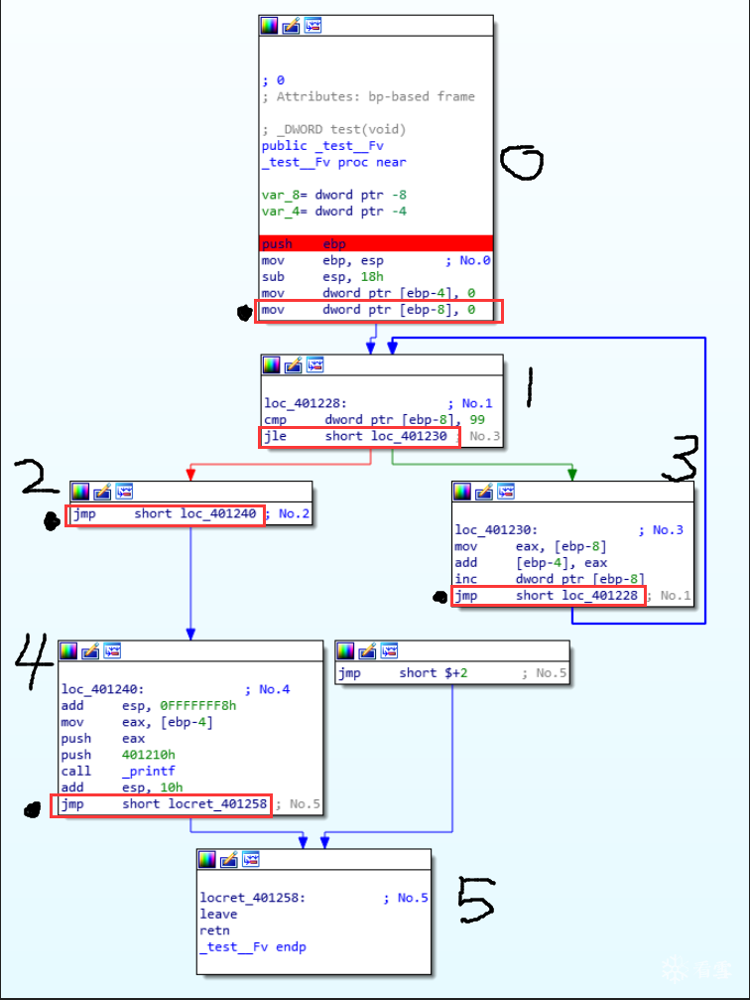
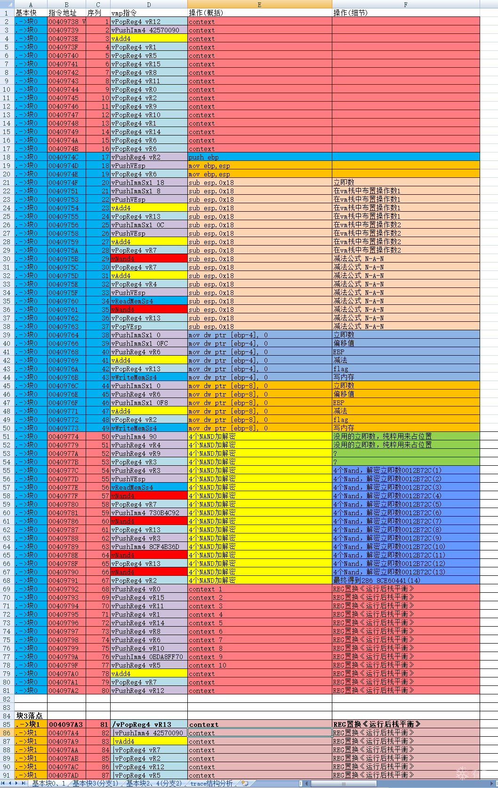

最近好多分析vmp的贴，跟风把以前的分析心得发出来(内容在excel附件中)，

难度承接上一篇： [人肉跟踪VMProtect入口至出口运行全过程(1)](https://bbs.pediy.com/thread-220689.htm)

这一篇将整个完整的VmCode过程,通过表格显现出来，

先占个坑，详细内容 稍后编辑。

1 源代码：

```
void test()
{
    int sum=0;
    for(int i=0;i<100;i++)
    {
        sum=sum+i;
    }
    printf("%d",sum);
}
 
 
int main(int argc, char *argv[])
{
    test();
    return 0;
}
```

2 汇编码&&基本块：


# 3 VMCODE <————> X86ASM对照表格

