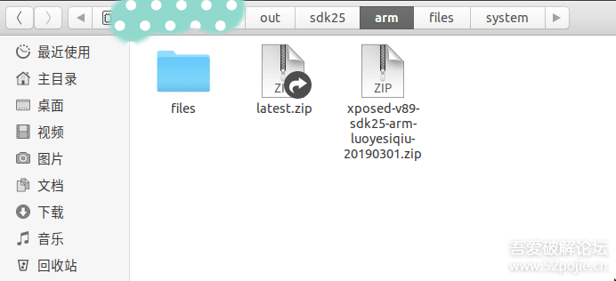

# 教你编译Xposed

Xposed是Android平台上的有名的Hook工具，用它可以修改函数参数，函数返回值和类字段值等等，也可以用它来进行调试。Xposed有几个部分组成：

- 修改过的android_art,这个项目修改部分art代码，使Hook成为可能
- Xposed native部分，该部分主要提供给XposedBridge可调用api和调用修改过的android_art的api,还有生成可替换的app_process程序
- XposedBridge,该项目是主要功能是提供给Xposed的模块开发者api，它将编译成XposedBridge.jar
- XposedInstaller,该项目是Xposed安装器，使得普通用户在使用Xposed更方便，同时，它还可以管理手机上已经安装的Xposed模块，它编译完成后将生成apk文件，本文不讨论如何编译它。

为什么要自己编译Xposed?

现在，Xposed成为了许多app检查的对象，比如某些app有Xposed就不给用某些功能。为了避免这个问题，我们可以自定义Xposed源码，使他们检测不到Xposed的存在

## 准备

- Ubuntu系统，推荐16.04及以上，本文用的18.04
- Android Studio
- Android源码(下载链接，请百度)
- 修改过的android_art:https://github.com/rovo89/android_art
- Xposed native部分：https://github.com/rovo89/Xposed
- XposedBridge:https://github.com/rovo89/XposedBridge
- Xposed构建工具，XposedTools:https://github.com/rovo89/XposedTools

## 配置

### Android ART

将Android源码下的art目录移动到其他路径备份，比如Android源码的上层路径。在Android源码目录执行`git clone https://github.com/rovo89/android_art -b xposed-nougat-mr2 art`,将修改过的android art下载到Android源码根目录。

> 注：请注意上面选择的分支是`xposed-nougat-mr2`,我使用的是 Android7.1.2的源码，所以选择该分支。请根据Android源码版本选择分支。

### Xposed Native

转到`frameworks/base/cmds`目录,执行`git clone https://github.com/rovo89/Xposed xposed`，将Xposed Native部分的源码下载。

### XposedBridge

在任意目录执行`git clone https://github.com/rovo89/XposedBridge -b art`，然后导入Android Studio中，点Build->Rebuild Project，会在`app/build/intermediates/transform/preDex/release`目录下生成.jar文件，将生成的jar文件重命名为`XposedBridge.jar`，放入Android源码目录下的`out/java/`下

> 注：如果想生成供Xposed模块调用的XposedBridge.jar，则在Android Studio的右侧打开Gradle Project，双击`jarStubs`就会在`app/build/api`生成api.jar

### XposedTools

在任意目录执行`git clone https://github.com/rovo89/XposedTools`,将XposedTools目录下的`build.conf.sample`复制一份，并将它重命名为`build.conf`，build.conf文件用于配置构建环境，我们来看他的内容：

```
 复制代码 隐藏代码[General]
outdir = /android/out
javadir = /android/XposedBridge

[Build]
# Please keep the base version number and add your custom suffix
version = 65 (custom build by xyz / %s)
# makeflags = -j4

[GPG]
sign = release
user = 852109AA!

# Root directories of the AOSP source tree per SDK version
[AospDir]
19 = /android/aosp/440
21 = /android/aosp/500

# SDKs to be used for compiling BusyBox
# Needs https://github.com/rovo89/android_external_busybox
[BusyBox]
arm = 21
x86 = 21
armv5 = 17
```

- outdir:指定Android源码中的out目录
- javadir:指定XposedBridge目录，如果你不需要编译XposedBridge.jar可以不指定
- version:Xposed版本，这个版本号将显示在XposedInstaller上
- ApospDir下的数字:设置sdk版本对应的Android源码
- [BusyBox]标签:busybox，可以不指定

配置完成后，就可以执行build.pl编译了,以下有几个例子：

```
./build.pl -a java`
编译XposedBridge.jar，需要在`build.conf`里指定`javadir
```

`./build.pl -t arm:25`
编译生成供cpu架构为arm，sdk为25平台使用的Xposed

编译完成后，将在`Android源码目录/out/sdk25/arm`生成可刷入手机的zip文件




## 常见问题

1.执行build.pl的时候提示找不到函数，比如提示找不到`Config::IniFiles`.

可以通过下面的方式来寻找并安装依赖：
（1）执行`apt-cache search Config::IniFiles`寻找Config::IniFiles所依赖的库文件：

> libconfig-inifiles-perl - Read .ini-style configuration files

（2）执行`sudo apt install libconfig-inifiles-perl`安装所依赖的库