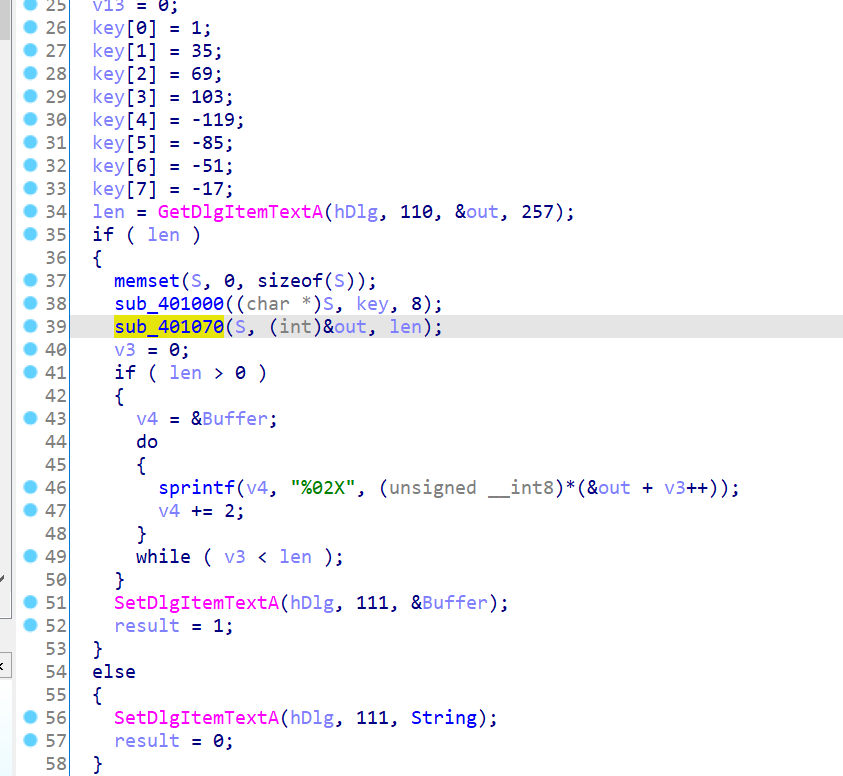
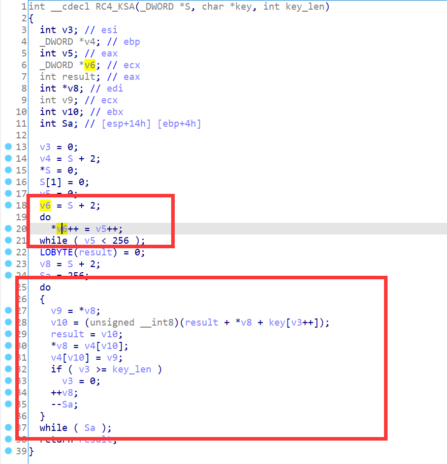
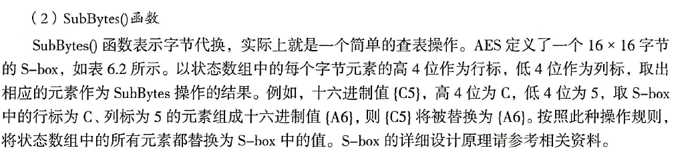

# 逆向中常见的Hash算法和对称加密算法的分析

url:https://bbs.pediy.com/thread-265939.htm#msg_header_h1_8

逆向中常常出现一些加密算法，如果我们能对这些加密算法进行快速识别则会大大减少我们逆向的难度，虽然IDA已有密码分析神器Findcrypt，但掌握手动分析方法能帮助我们应对更多的情况。这篇文章将介绍逆向中常见的单项散列算法和对称加密算法的识别方法。

# 0xFF. 前言

在很长一段时间里我经常发现自己面对复杂的加密算法无从下手，可能是因为还没有系统学过密码学吧orz，总之这个问题困扰了我很久。于是最近我花了一些时间来解决自己在密码学这块的薄弱点，写下这篇文章的目的之一也是为了巩固所学知识。
加密算法的部分没有涉及公钥加密算法（因为我不会hh）。每个算法都有一个例子，这些例子出自《加密与解密（第4版）》第6章的随书附带文件和各大比赛中的题目。

# 0x00. 目录

**单向散列算法：**

1. [MD5](https://bbs.pediy.com/thread-265939.htm#msg_header_h1_2)
2. [SHA](https://bbs.pediy.com/thread-265939.htm#msg_header_h1_3)

**对称加密算法：**

1. [RC4](https://bbs.pediy.com/thread-265939.htm#msg_header_h1_4)
2. [TEA](https://bbs.pediy.com/thread-265939.htm#msg_header_h1_5)
3. [DES](https://bbs.pediy.com/thread-265939.htm#msg_header_h1_6)
4. [AES](https://bbs.pediy.com/thread-265939.htm#msg_header_h1_7)
5. [SM4](https://bbs.pediy.com/thread-265939.htm#msg_header_h1_8)
6. [ChaCha20](https://bbs.pediy.com/thread-265939.htm#msg_header_h1_9)

# 0X01. MD5

MD5（Message Digest Algorithm）消息摘要算法对输入的任意长度的消息进行运算，产生一个128位的消息摘要。
MD5的特征是会出现下图中 **A,B,C,D** 这四个常量。

这里我们直接用《加密与解密（第4版）》随书文件**MD5KeyGenMe.exe**来分析。

在导入表中找到**GetDlgItemTextA**函数定位关键代码，两次GetDlgItemTextA函数读取的应该分别是Name和Serial Number：

sub_4012B0函数我们点进去看看发现了MD5的几个特征常量：

还原一下符号，需要注意的一点是连续调用两次**MD5_Update**相当于把两次的输入拼接后调用一次**MD5_Update**的结果：

写出注册机：

```
from` `hashlib ``import` `md5` `name ``=` `b``'pediy'``digest ``=` `md5(name ``+` `b``'www.pediy.com'``).digest()``a2345 ``=` `'23456789ABCDEFGHJKLMNPQRSTUVWXYZ'``serial_number ``=` `''``for` `b ``in` `digest:``  ``serial_number ``+``=` `a2345[b ``%` `32``]``print``(f``'Serial Number('``{name}``')={serial_number[0:4]}-{serial_number[4:8]}-{serial_number[8:12]}-{serial_number[12:16]}'``)
```


Findcrypt插件能帮助我们快速找到这些常量，不过这里还是着重讲手动分析的方法。

# 0x02. SHA

安全散列算法（Secure Hash Algorithm，SHA）包括SHA-1、SHA-256、SHA-384和SHA-512，分别产生160位、256位、384位和512位的散列值。
类似于MD5，SHA算法使用了一系列的常数：


还是用随书文件**SHA1KeyGenMe.exe**来分析。
还是先通过导入表定位关键代码：

发现**sub_401000**函数中出现了SHA1算法用到的常量：

还原下符号：

写出注册机：

```
from` `hashlib ``import` `sha1` `name ``=` `b``'pediy'``digest ``=` `sha1(name).digest()``aPEDIY ``=` `b``'PEDIY Forum'``apediy ``=` `b``'pediy.com'``key ``=` `bytearray(digest)``for` `i ``in` `range``(``11``):``  ``key[i] ^``=` `aPEDIY[i]``for` `i ``in` `range``(``12``,``17``):``  ``key[i] ^``=` `key[i ``-` `12``]``for` `i ``in` `range``(``17``,``20``):``  ``key[i] ^``=` `apediy[i ``-` `17``]``serial_number ``=` `''``for` `i ``in` `range``(``10``):``  ``serial_number ``+``=` `hex``(key[i] ^ key[i ``+` `10``])[``2``:].zfill(``2``).upper()``print``(serial_number)
```

# 0x03. RC4

RC4是一种比较简单的流密码，该算法虽然没有用到特征常量，但是特征也比较容易识别。

分析**RC4 Sample.exe**文件。
还是通过导入表找到关键代码：

**sub_401000**函数明显具有RC4密钥调度算法（KSA）的特征：

**sub_401070**函数是RC4算法的第二步：


# 0x04. TEA

TEA算法是分组密码，分组长度为64位，密钥长度为128位，采用Feistel网络。
其加密过程也非常简单，下面的代码摘自Wikipedia：

```
#include <stdint.h>` `void encrypt (uint32_t v[``2``], const uint32_t k[``4``]) {``  ``uint32_t v0``=``v[``0``], v1``=``v[``1``], ``sum``=``0``, i;      ``/``*` `set` `up ``*``/``  ``uint32_t delta``=``0x9E3779B9``;           ``/``*` `a key schedule constant ``*``/``  ``uint32_t k0``=``k[``0``], k1``=``k[``1``], k2``=``k[``2``], k3``=``k[``3``];  ``/``*` `cache key ``*``/``  ``for` `(i``=``0``; i<``32``; i``+``+``) {             ``/``*` `basic cycle start ``*``/``    ``sum` `+``=` `delta;``    ``v0 ``+``=` `((v1<<``4``) ``+` `k0) ^ (v1 ``+` `sum``) ^ ((v1>>``5``) ``+` `k1);``    ``v1 ``+``=` `((v0<<``4``) ``+` `k2) ^ (v0 ``+` `sum``) ^ ((v0>>``5``) ``+` `k3);``  ``}                       ``/``*` `end cycle ``*``/``  ``v[``0``]``=``v0; v[``1``]``=``v1;``}
```

其中特征常量delta是由黄金分割点得来的，delta = 0x9E377989。TEA的变体XTEA和XXTEA都用到了这个常量，但是加密过程不同，在识别算法时需要注意。
在加密轮数方面，作者推荐的加密轮数是64轮，即循环32次，也可以采用其他加密轮数，比如32轮或者128轮，在分析的时候也需要注意。
补充Wikipedia上的一些资料：

- [Tiny Encryption Algorithm](https://en.wikipedia.org/wiki/Tiny_Encryption_Algorithm)
- [XTEA](https://en.wikipedia.org/wiki/XTEA)
- [XXTEA](https://en.wikipedia.org/wiki/XXTEA)

分析**TEAKeyGenMe.exe**：

**sub_401380**函数中出现了MD5特征常量：

**sub_401000**函数中出现了TEA特征常量，明显为TEA算法：

整个加密过程是先取MD5(name)的前8个字节作为密钥对序列号进行TEA加密，加密的结果再与与MD5(name)的前8个字节异或，异或的结果与MD5的后8个字节比较。
写出注册机：

```
from` `hashlib ``import` `md5``from` `binascii ``import` `b2a_hex``from` `pytea ``import` `TEA` `name ``=` `b``'pediy'``md5_digest ``=` `md5(name).digest()``buf ``=` `bytearray(md5_digest[``0``:``8``])``for` `i ``in` `range``(``8``):``  ``buf[i] ^``=` `md5_digest[i ``+` `8``]``tea ``=` `TEA(md5_digest)``print``(f``'Serial Number("{name.decode()}"): {b2a_hex(tea.Decrypt(buf)).decode().upper()}'``)
```

我在网上找了半天也没找到个好用的TEA的Python实现，干脆自己写了个：[已上传GitHub](https://github.com/bluesadi/PyTEA)

# 0x05. DES

DES全称为Data Encryption Standard，即数据加密标准，是一种使用密钥加密的分组算法。
DES同前面的TEA一样，都采用了[Feistel网络](https://en.wikipedia.org/wiki/Feistel_cipher)，其加密过程可以用以下两个图表示：
**Figure 1— The overall Feistel structure of DES**

**Figure 2—The Feistel function (F-function) of DES**

图一中的**IP**和**FP**分别代表初始置换（Initial Permutation）和末尾置换（Final Permutation），图二中的**S1**到**S8**是8个置换盒（Substitution-Box），这些都可以作为识别DES算法的特征。
随便在GitHub上扒一份源码，就能找到这些常量：

```
int` `S1[] ``=` `{``14``, ``4``, ``13``, ``1``, ``2``, ``15``, ``11``, ``8``, ``3``, ``10``, ``6``, ``12``, ``5``, ``9``, ``0``, ``7``,``       ``0``, ``15``, ``7``, ``4``, ``14``, ``2``, ``13``, ``1``, ``10``, ``6``, ``12``, ``11``, ``9``, ``5``, ``3``, ``8``,``       ``4``, ``1``, ``14``, ``8``, ``13``, ``6``, ``2``, ``11``, ``15``, ``12``, ``9``, ``7``, ``3``, ``10``, ``5``, ``0``,``      ``15``, ``12``, ``8``, ``2``, ``4``, ``9``, ``1``, ``7``, ``5``, ``11``, ``3``, ``14``, ``10``, ``0``, ``6``, ``13``};` `int` `S2[] ``=` `{``15``, ``1``, ``8``, ``14``, ``6``, ``11``, ``3``, ``4``, ``9``, ``7``, ``2``, ``13``, ``12``, ``0``, ``5``, ``10``,``       ``3``, ``13``, ``4``, ``7``, ``15``, ``2``, ``8``, ``14``, ``12``, ``0``, ``1``, ``10``, ``6``, ``9``, ``11``, ``5``,``       ``0``, ``14``, ``7``, ``11``, ``10``, ``4``, ``13``, ``1``, ``5``, ``8``, ``12``, ``6``, ``9``, ``3``, ``2``, ``15``,``      ``13``, ``8``, ``10``, ``1``, ``3``, ``15``, ``4``, ``2``, ``11``, ``6``, ``7``, ``12``, ``0``, ``5``, ``14``, ``9``};` `int` `S3[] ``=` `{``10``, ``0``, ``9``, ``14``, ``6``, ``3``, ``15``, ``5``, ``1``, ``13``, ``12``, ``7``, ``11``, ``4``, ``2``, ``8``,``      ``13``, ``7``, ``0``, ``9``, ``3``, ``4``, ``6``, ``10``, ``2``, ``8``, ``5``, ``14``, ``12``, ``11``, ``15``, ``1``,``      ``13``, ``6``, ``4``, ``9``, ``8``, ``15``, ``3``, ``0``, ``11``, ``1``, ``2``, ``12``, ``5``, ``10``, ``14``, ``7``,``       ``1``, ``10``, ``13``, ``0``, ``6``, ``9``, ``8``, ``7``, ``4``, ``15``, ``14``, ``3``, ``11``, ``5``, ``2``, ``12``};` `int` `S4[] ``=` `{ ``7``, ``13``, ``14``, ``3``, ``0``, ``6``, ``9``, ``10``, ``1``, ``2``, ``8``, ``5``, ``11``, ``12``, ``4``, ``15``,``      ``13``, ``8``, ``11``, ``5``, ``6``, ``15``, ``0``, ``3``, ``4``, ``7``, ``2``, ``12``, ``1``, ``10``, ``14``, ``9``,``      ``10``, ``6``, ``9``, ``0``, ``12``, ``11``, ``7``, ``13``, ``15``, ``1``, ``3``, ``14``, ``5``, ``2``, ``8``, ``4``,``       ``3``, ``15``, ``0``, ``6``, ``10``, ``1``, ``13``, ``8``, ``9``, ``4``, ``5``, ``11``, ``12``, ``7``, ``2``, ``14``};` `int` `S5[] ``=` `{ ``2``, ``12``, ``4``, ``1``, ``7``, ``10``, ``11``, ``6``, ``8``, ``5``, ``3``, ``15``, ``13``, ``0``, ``14``, ``9``,``      ``14``, ``11``, ``2``, ``12``, ``4``, ``7``, ``13``, ``1``, ``5``, ``0``, ``15``, ``10``, ``3``, ``9``, ``8``, ``6``,``       ``4``, ``2``, ``1``, ``11``, ``10``, ``13``, ``7``, ``8``, ``15``, ``9``, ``12``, ``5``, ``6``, ``3``, ``0``, ``14``,``      ``11``, ``8``, ``12``, ``7``, ``1``, ``14``, ``2``, ``13``, ``6``, ``15``, ``0``, ``9``, ``10``, ``4``, ``5``, ``3``};` `int` `S6[] ``=` `{``12``, ``1``, ``10``, ``15``, ``9``, ``2``, ``6``, ``8``, ``0``, ``13``, ``3``, ``4``, ``14``, ``7``, ``5``, ``11``,``      ``10``, ``15``, ``4``, ``2``, ``7``, ``12``, ``9``, ``5``, ``6``, ``1``, ``13``, ``14``, ``0``, ``11``, ``3``, ``8``,``       ``9``, ``14``, ``15``, ``5``, ``2``, ``8``, ``12``, ``3``, ``7``, ``0``, ``4``, ``10``, ``1``, ``13``, ``11``, ``6``,``       ``4``, ``3``, ``2``, ``12``, ``9``, ``5``, ``15``, ``10``, ``11``, ``14``, ``1``, ``7``, ``6``, ``0``, ``8``, ``13``};` `int` `S7[] ``=` `{ ``4``, ``11``, ``2``, ``14``, ``15``, ``0``, ``8``, ``13``, ``3``, ``12``, ``9``, ``7``, ``5``, ``10``, ``6``, ``1``,``      ``13``, ``0``, ``11``, ``7``, ``4``, ``9``, ``1``, ``10``, ``14``, ``3``, ``5``, ``12``, ``2``, ``15``, ``8``, ``6``,``       ``1``, ``4``, ``11``, ``13``, ``12``, ``3``, ``7``, ``14``, ``10``, ``15``, ``6``, ``8``, ``0``, ``5``, ``9``, ``2``,``       ``6``, ``11``, ``13``, ``8``, ``1``, ``4``, ``10``, ``7``, ``9``, ``5``, ``0``, ``15``, ``14``, ``2``, ``3``, ``12``};` `int` `S8[] ``=` `{``13``, ``2``, ``8``, ``4``, ``6``, ``15``, ``11``, ``1``, ``10``, ``9``, ``3``, ``14``, ``5``, ``0``, ``12``, ``7``,``       ``1``, ``15``, ``13``, ``8``, ``10``, ``3``, ``7``, ``4``, ``12``, ``5``, ``6``, ``11``, ``0``, ``14``, ``9``, ``2``,``       ``7``, ``11``, ``4``, ``1``, ``9``, ``12``, ``14``, ``2``, ``0``, ``6``, ``10``, ``13``, ``15``, ``3``, ``5``, ``8``,``       ``2``, ``1``, ``14``, ``7``, ``4``, ``10``, ``8``, ``13``, ``15``, ``12``, ``9``, ``0``, ``3``, ``5``, ``6``, ``11``};
```

在2020祥云杯的某道APK逆向里，Findcrypt插件失效（可能是Findcrypt分析不了ARM框架下的文件），所以我们只能靠手动分析找到DES的特征（以下是S1到S8）：

还有一些别的特征，都可以帮助我们快速识别DES算法：


# 0x06. AES

AES（Advanced Encryption Standard，高级加密标准）是用于代替DES的新一代加密标准。AES具有128比特的分组长度，支持128比特、192比特和256比特的密钥长度。
AES的加密过程：

SubBytes函数：

我们识别AES的方法就是找到AES的SubBytes函数中使用的这个S-box。
在GitHub上扒一份源码：

```
/``*`` ``*` `S``-``box transformation table`` ``*``/``static uint8_t s_box[``256``] ``=` `{``  ``/``/` `0`   `1`   `2`   `3`   `4`   `5`   `6`   `7`   `8`   `9`   `a   b   c   d   e   f``  ``0x63``, ``0x7c``, ``0x77``, ``0x7b``, ``0xf2``, ``0x6b``, ``0x6f``, ``0xc5``, ``0x30``, ``0x01``, ``0x67``, ``0x2b``, ``0xfe``, ``0xd7``, ``0xab``, ``0x76``, ``/``/` `0``  ``0xca``, ``0x82``, ``0xc9``, ``0x7d``, ``0xfa``, ``0x59``, ``0x47``, ``0xf0``, ``0xad``, ``0xd4``, ``0xa2``, ``0xaf``, ``0x9c``, ``0xa4``, ``0x72``, ``0xc0``, ``/``/` `1``  ``0xb7``, ``0xfd``, ``0x93``, ``0x26``, ``0x36``, ``0x3f``, ``0xf7``, ``0xcc``, ``0x34``, ``0xa5``, ``0xe5``, ``0xf1``, ``0x71``, ``0xd8``, ``0x31``, ``0x15``, ``/``/` `2``  ``0x04``, ``0xc7``, ``0x23``, ``0xc3``, ``0x18``, ``0x96``, ``0x05``, ``0x9a``, ``0x07``, ``0x12``, ``0x80``, ``0xe2``, ``0xeb``, ``0x27``, ``0xb2``, ``0x75``, ``/``/` `3``  ``0x09``, ``0x83``, ``0x2c``, ``0x1a``, ``0x1b``, ``0x6e``, ``0x5a``, ``0xa0``, ``0x52``, ``0x3b``, ``0xd6``, ``0xb3``, ``0x29``, ``0xe3``, ``0x2f``, ``0x84``, ``/``/` `4``  ``0x53``, ``0xd1``, ``0x00``, ``0xed``, ``0x20``, ``0xfc``, ``0xb1``, ``0x5b``, ``0x6a``, ``0xcb``, ``0xbe``, ``0x39``, ``0x4a``, ``0x4c``, ``0x58``, ``0xcf``, ``/``/` `5``  ``0xd0``, ``0xef``, ``0xaa``, ``0xfb``, ``0x43``, ``0x4d``, ``0x33``, ``0x85``, ``0x45``, ``0xf9``, ``0x02``, ``0x7f``, ``0x50``, ``0x3c``, ``0x9f``, ``0xa8``, ``/``/` `6``  ``0x51``, ``0xa3``, ``0x40``, ``0x8f``, ``0x92``, ``0x9d``, ``0x38``, ``0xf5``, ``0xbc``, ``0xb6``, ``0xda``, ``0x21``, ``0x10``, ``0xff``, ``0xf3``, ``0xd2``, ``/``/` `7``  ``0xcd``, ``0x0c``, ``0x13``, ``0xec``, ``0x5f``, ``0x97``, ``0x44``, ``0x17``, ``0xc4``, ``0xa7``, ``0x7e``, ``0x3d``, ``0x64``, ``0x5d``, ``0x19``, ``0x73``, ``/``/` `8``  ``0x60``, ``0x81``, ``0x4f``, ``0xdc``, ``0x22``, ``0x2a``, ``0x90``, ``0x88``, ``0x46``, ``0xee``, ``0xb8``, ``0x14``, ``0xde``, ``0x5e``, ``0x0b``, ``0xdb``, ``/``/` `9``  ``0xe0``, ``0x32``, ``0x3a``, ``0x0a``, ``0x49``, ``0x06``, ``0x24``, ``0x5c``, ``0xc2``, ``0xd3``, ``0xac``, ``0x62``, ``0x91``, ``0x95``, ``0xe4``, ``0x79``, ``/``/` `a``  ``0xe7``, ``0xc8``, ``0x37``, ``0x6d``, ``0x8d``, ``0xd5``, ``0x4e``, ``0xa9``, ``0x6c``, ``0x56``, ``0xf4``, ``0xea``, ``0x65``, ``0x7a``, ``0xae``, ``0x08``, ``/``/` `b``  ``0xba``, ``0x78``, ``0x25``, ``0x2e``, ``0x1c``, ``0xa6``, ``0xb4``, ``0xc6``, ``0xe8``, ``0xdd``, ``0x74``, ``0x1f``, ``0x4b``, ``0xbd``, ``0x8b``, ``0x8a``, ``/``/` `c``  ``0x70``, ``0x3e``, ``0xb5``, ``0x66``, ``0x48``, ``0x03``, ``0xf6``, ``0x0e``, ``0x61``, ``0x35``, ``0x57``, ``0xb9``, ``0x86``, ``0xc1``, ``0x1d``, ``0x9e``, ``/``/` `d``  ``0xe1``, ``0xf8``, ``0x98``, ``0x11``, ``0x69``, ``0xd9``, ``0x8e``, ``0x94``, ``0x9b``, ``0x1e``, ``0x87``, ``0xe9``, ``0xce``, ``0x55``, ``0x28``, ``0xdf``, ``/``/` `e``  ``0x8c``, ``0xa1``, ``0x89``, ``0x0d``, ``0xbf``, ``0xe6``, ``0x42``, ``0x68``, ``0x41``, ``0x99``, ``0x2d``, ``0x0f``, ``0xb0``, ``0x54``, ``0xbb``, ``0x16``};``/``/` `f` `/``*`` ``*` `Inverse S``-``box transformation table`` ``*``/``static uint8_t inv_s_box[``256``] ``=` `{``  ``/``/` `0`   `1`   `2`   `3`   `4`   `5`   `6`   `7`   `8`   `9`   `a   b   c   d   e   f``  ``0x52``, ``0x09``, ``0x6a``, ``0xd5``, ``0x30``, ``0x36``, ``0xa5``, ``0x38``, ``0xbf``, ``0x40``, ``0xa3``, ``0x9e``, ``0x81``, ``0xf3``, ``0xd7``, ``0xfb``, ``/``/` `0``  ``0x7c``, ``0xe3``, ``0x39``, ``0x82``, ``0x9b``, ``0x2f``, ``0xff``, ``0x87``, ``0x34``, ``0x8e``, ``0x43``, ``0x44``, ``0xc4``, ``0xde``, ``0xe9``, ``0xcb``, ``/``/` `1``  ``0x54``, ``0x7b``, ``0x94``, ``0x32``, ``0xa6``, ``0xc2``, ``0x23``, ``0x3d``, ``0xee``, ``0x4c``, ``0x95``, ``0x0b``, ``0x42``, ``0xfa``, ``0xc3``, ``0x4e``, ``/``/` `2``  ``0x08``, ``0x2e``, ``0xa1``, ``0x66``, ``0x28``, ``0xd9``, ``0x24``, ``0xb2``, ``0x76``, ``0x5b``, ``0xa2``, ``0x49``, ``0x6d``, ``0x8b``, ``0xd1``, ``0x25``, ``/``/` `3``  ``0x72``, ``0xf8``, ``0xf6``, ``0x64``, ``0x86``, ``0x68``, ``0x98``, ``0x16``, ``0xd4``, ``0xa4``, ``0x5c``, ``0xcc``, ``0x5d``, ``0x65``, ``0xb6``, ``0x92``, ``/``/` `4``  ``0x6c``, ``0x70``, ``0x48``, ``0x50``, ``0xfd``, ``0xed``, ``0xb9``, ``0xda``, ``0x5e``, ``0x15``, ``0x46``, ``0x57``, ``0xa7``, ``0x8d``, ``0x9d``, ``0x84``, ``/``/` `5``  ``0x90``, ``0xd8``, ``0xab``, ``0x00``, ``0x8c``, ``0xbc``, ``0xd3``, ``0x0a``, ``0xf7``, ``0xe4``, ``0x58``, ``0x05``, ``0xb8``, ``0xb3``, ``0x45``, ``0x06``, ``/``/` `6``  ``0xd0``, ``0x2c``, ``0x1e``, ``0x8f``, ``0xca``, ``0x3f``, ``0x0f``, ``0x02``, ``0xc1``, ``0xaf``, ``0xbd``, ``0x03``, ``0x01``, ``0x13``, ``0x8a``, ``0x6b``, ``/``/` `7``  ``0x3a``, ``0x91``, ``0x11``, ``0x41``, ``0x4f``, ``0x67``, ``0xdc``, ``0xea``, ``0x97``, ``0xf2``, ``0xcf``, ``0xce``, ``0xf0``, ``0xb4``, ``0xe6``, ``0x73``, ``/``/` `8``  ``0x96``, ``0xac``, ``0x74``, ``0x22``, ``0xe7``, ``0xad``, ``0x35``, ``0x85``, ``0xe2``, ``0xf9``, ``0x37``, ``0xe8``, ``0x1c``, ``0x75``, ``0xdf``, ``0x6e``, ``/``/` `9``  ``0x47``, ``0xf1``, ``0x1a``, ``0x71``, ``0x1d``, ``0x29``, ``0xc5``, ``0x89``, ``0x6f``, ``0xb7``, ``0x62``, ``0x0e``, ``0xaa``, ``0x18``, ``0xbe``, ``0x1b``, ``/``/` `a``  ``0xfc``, ``0x56``, ``0x3e``, ``0x4b``, ``0xc6``, ``0xd2``, ``0x79``, ``0x20``, ``0x9a``, ``0xdb``, ``0xc0``, ``0xfe``, ``0x78``, ``0xcd``, ``0x5a``, ``0xf4``, ``/``/` `b``  ``0x1f``, ``0xdd``, ``0xa8``, ``0x33``, ``0x88``, ``0x07``, ``0xc7``, ``0x31``, ``0xb1``, ``0x12``, ``0x10``, ``0x59``, ``0x27``, ``0x80``, ``0xec``, ``0x5f``, ``/``/` `c``  ``0x60``, ``0x51``, ``0x7f``, ``0xa9``, ``0x19``, ``0xb5``, ``0x4a``, ``0x0d``, ``0x2d``, ``0xe5``, ``0x7a``, ``0x9f``, ``0x93``, ``0xc9``, ``0x9c``, ``0xef``, ``/``/` `d``  ``0xa0``, ``0xe0``, ``0x3b``, ``0x4d``, ``0xae``, ``0x2a``, ``0xf5``, ``0xb0``, ``0xc8``, ``0xeb``, ``0xbb``, ``0x3c``, ``0x83``, ``0x53``, ``0x99``, ``0x61``, ``/``/` `e``  ``0x17``, ``0x2b``, ``0x04``, ``0x7e``, ``0xba``, ``0x77``, ``0xd6``, ``0x26``, ``0xe1``, ``0x69``, ``0x14``, ``0x63``, ``0x55``, ``0x21``, ``0x0c``, ``0x7d``};``/``/` `f
```

下面分析**AESKeyGenMe.exe**文件。
初步分析关键代码：

在sub_401EC0函数中找到AES的S_box和S_box的逆，基本确定是AES加密，没有找到iv，推测是ECB模式：

密钥：

写出注册机：

```
from` `hashlib ``import` `md5``from` `Crypto.Cipher ``import` `AES``from` `binascii ``import` `b2a_hex` `name ``=` `b``'pediy'``md5_digest ``=` `md5(name).digest()``aes ``=` `AES.new(key``=``b``'\x2B\x7E\x15\x16\x28\xAE\xD2\xA6\xAB\xF7\x15\x88\x09\xCF\x4F\x3C'``,mode``=``AES.MODE_ECB)``dec ``=` `aes.decrypt(md5_digest)``print``(f``'Serial Number("{name.decode()}")={b2a_hex(dec).decode().upper()}'``)
```

# 0x07. SM4

SM4是国密算法，由国家密码局发布。SM4是一个分组算法，分组长度为128比特，密钥长度为128比特，其结构是Fesitel网络的一个变体。
我们识别SM4算法的方法同样是找到SM4的S-box（在GitHub上找的源码）：

```
static const unsigned char SboxTable[``16``][``16``] ``=``{``  ``{``0xd6``, ``0x90``, ``0xe9``, ``0xfe``, ``0xcc``, ``0xe1``, ``0x3d``, ``0xb7``, ``0x16``, ``0xb6``, ``0x14``, ``0xc2``, ``0x28``, ``0xfb``, ``0x2c``, ``0x05``},``  ``{``0x2b``, ``0x67``, ``0x9a``, ``0x76``, ``0x2a``, ``0xbe``, ``0x04``, ``0xc3``, ``0xaa``, ``0x44``, ``0x13``, ``0x26``, ``0x49``, ``0x86``, ``0x06``, ``0x99``},``  ``{``0x9c``, ``0x42``, ``0x50``, ``0xf4``, ``0x91``, ``0xef``, ``0x98``, ``0x7a``, ``0x33``, ``0x54``, ``0x0b``, ``0x43``, ``0xed``, ``0xcf``, ``0xac``, ``0x62``},``  ``{``0xe4``, ``0xb3``, ``0x1c``, ``0xa9``, ``0xc9``, ``0x08``, ``0xe8``, ``0x95``, ``0x80``, ``0xdf``, ``0x94``, ``0xfa``, ``0x75``, ``0x8f``, ``0x3f``, ``0xa6``},``  ``{``0x47``, ``0x07``, ``0xa7``, ``0xfc``, ``0xf3``, ``0x73``, ``0x17``, ``0xba``, ``0x83``, ``0x59``, ``0x3c``, ``0x19``, ``0xe6``, ``0x85``, ``0x4f``, ``0xa8``},``  ``{``0x68``, ``0x6b``, ``0x81``, ``0xb2``, ``0x71``, ``0x64``, ``0xda``, ``0x8b``, ``0xf8``, ``0xeb``, ``0x0f``, ``0x4b``, ``0x70``, ``0x56``, ``0x9d``, ``0x35``},``  ``{``0x1e``, ``0x24``, ``0x0e``, ``0x5e``, ``0x63``, ``0x58``, ``0xd1``, ``0xa2``, ``0x25``, ``0x22``, ``0x7c``, ``0x3b``, ``0x01``, ``0x21``, ``0x78``, ``0x87``},``  ``{``0xd4``, ``0x00``, ``0x46``, ``0x57``, ``0x9f``, ``0xd3``, ``0x27``, ``0x52``, ``0x4c``, ``0x36``, ``0x02``, ``0xe7``, ``0xa0``, ``0xc4``, ``0xc8``, ``0x9e``},``  ``{``0xea``, ``0xbf``, ``0x8a``, ``0xd2``, ``0x40``, ``0xc7``, ``0x38``, ``0xb5``, ``0xa3``, ``0xf7``, ``0xf2``, ``0xce``, ``0xf9``, ``0x61``, ``0x15``, ``0xa1``},``  ``{``0xe0``, ``0xae``, ``0x5d``, ``0xa4``, ``0x9b``, ``0x34``, ``0x1a``, ``0x55``, ``0xad``, ``0x93``, ``0x32``, ``0x30``, ``0xf5``, ``0x8c``, ``0xb1``, ``0xe3``},``  ``{``0x1d``, ``0xf6``, ``0xe2``, ``0x2e``, ``0x82``, ``0x66``, ``0xca``, ``0x60``, ``0xc0``, ``0x29``, ``0x23``, ``0xab``, ``0x0d``, ``0x53``, ``0x4e``, ``0x6f``},``  ``{``0xd5``, ``0xdb``, ``0x37``, ``0x45``, ``0xde``, ``0xfd``, ``0x8e``, ``0x2f``, ``0x03``, ``0xff``, ``0x6a``, ``0x72``, ``0x6d``, ``0x6c``, ``0x5b``, ``0x51``},``  ``{``0x8d``, ``0x1b``, ``0xaf``, ``0x92``, ``0xbb``, ``0xdd``, ``0xbc``, ``0x7f``, ``0x11``, ``0xd9``, ``0x5c``, ``0x41``, ``0x1f``, ``0x10``, ``0x5a``, ``0xd8``},``  ``{``0x0a``, ``0xc1``, ``0x31``, ``0x88``, ``0xa5``, ``0xcd``, ``0x7b``, ``0xbd``, ``0x2d``, ``0x74``, ``0xd0``, ``0x12``, ``0xb8``, ``0xe5``, ``0xb4``, ``0xb0``},``  ``{``0x89``, ``0x69``, ``0x97``, ``0x4a``, ``0x0c``, ``0x96``, ``0x77``, ``0x7e``, ``0x65``, ``0xb9``, ``0xf1``, ``0x09``, ``0xc5``, ``0x6e``, ``0xc6``, ``0x84``},``  ``{``0x18``, ``0xf0``, ``0x7d``, ``0xec``, ``0x3a``, ``0xdc``, ``0x4d``, ``0x20``, ``0x79``, ``0xee``, ``0x5f``, ``0x3e``, ``0xd7``, ``0xcb``, ``0x39``, ``0x48``}``};
```

拿2020纵横杯的第一道逆向题**friendlyRE**举例。
我们直接找到关键代码，这里是比较了Str1和Str2，通过交叉引用可以确定Str2加密过程，Str2为"2NI5JKCBI5Hyva+8AZa3mq!!"：

再去找Str1的加密过程，发现有个地方用到了Base64表：

并且表是变换过的，第一次是大小写互换，第二次相当于是把表的前32位和后32位互换：


继续找找到了SM4的S-box：

找到key：

整个过程大概就是把输入经过SM4加密之后再经过一个变表的BASE64再与"2NI5JKCBI5Hyva+8AZa3mq!!"比较，写出exp：

```
import base64
from binascii import b2a_hex, a2b_hex
from gmssl.sm4 import CryptSM4, SM4_DECRYPT
 
BASE64 = 'ABCDEFGHIJKLMNOPQRSTUVWXYZabcdefghijklmnopqrstuvwxyz0123456789+/'
BASE64_change = (BASE64[32:] + BASE64[:32]).swapcase()
table = str.maketrans(BASE64_change,BASE64)
Str2 = 'N25IKJBC5IyHav8+ZA3aqm!!'
target = ''
for i in range(0,len(Str2),2):
    target += Str2[i + 1]
    target += Str2[i]
target = target.translate(table).replace('!','=')
base64_decode = base64.b64decode(target)
print(b2a_hex(base64_decode))
crypt_sm4 = CryptSM4()
crypt_sm4.set_key(b'Thisisinsteresth',SM4_DECRYPT)
flag = crypt_sm4.crypt_ecb(base64_decode)
print(b2a_hex(flag))
```

理论上是可以这么写，但是gmssl库的SM4的padding方式跟题目里SM4的padding方式不一致，导致无法解密。
所以换工具解密：

Hex2Str，得到最后的flag为：DoyouKnowVEHSEH!

# 0x08. ChaCha20

ChaCha系列**流密码**，作为Salsa密码的改良版，具有更强的抵抗密码分析攻击的特性，“20”表示该算法有20轮的加密计算。
ChaCha20有一个初始矩阵，矩阵的输入为一个256位的密钥、64位随机数、64位计数器值以及4×32位的常数，它们均填充在32位整型数组中作为初始矩阵。排列方式如下：

四个常数**0x61707865 0x3320646e 0x79622d32 0x6b206574**按小端存储转为ASCII字符是**"expand 32-byte k"**，这是我们用来识别ChaCha20算法的主要特征。
分析今年年初*CTF的一道题**Favourite Architecure flag0**，riscv架构的文件只能用Ghirda分析。由于未知原因main函数的反汇编失效了，只能手撸汇编。

我们直接从打印错误的代码开始分析，有两个大跳转跳到了这里，往回看能找到能找到两个地方调用的是同一个函数，估计是对加密结果进行比较：


从第一次比较分析，先把用来比较的数据dump下来：

```
	
enc1 = b'\x88\xE7\x03\xB4\x36\xCD\x97\xAB\x5A\xA5\xA6\x0B\xDF\xCE\x08\x3B\x9D\x90\x32\x3C\x4E\x15\x14\xBD\x8D\x38\x38\xB0\xEE\x2A\xBC\x4B\xF9\xAA\x24\x26\x76\xA3\xA5\x75\x5E'
```

从比较函数往前找，找到了这个很诡异的地方：

百度搜索关键词**expand 32-byte k**找到了GitHub上的一处代码：

一比对发现是**几乎**一模一样（实际上并不一样），锁定第一个加密算法是ChaCha20：

顺藤摸瓜找到密钥：

然而用了各种Python库和在线网站都解密不了，一度怀疑人生...
后来分析发现了题目里用到的ChaCha20算法貌似跟正常的ChaCha20算法不太一样，一般来说ChaCha20算法输入的Nonce（随机数）是8字节，题目中的ChaCha20算法却给了12个字节的Nonce，于是改变思路去GitHub上翻了几个ChaCha20的C语言实现，找到了题目用到的源码：


比对下来发现是完全一样，依葫芦画瓢写出exp的第一部分：

```
#include "chacha20.h"
#include <stdio.h>
#include <stdlib.h>
 
int main(){
    char enc[100] = "\x88\xE7\x03\xB4\x36\xCD\x97\xAB\x5A\xA5\xA6\x0B\xDF\xCE\x08\x3B\x9D\x90\x32\x3C\x4E\x15\x14\xBD\x8D\x38\x38\xB0\xEE\x2A\xBC\x4B\xF9\xAA\x24\x26\x76\xA3\xA5\x75\x5E";
    char key[100] = "tzgkwukglbslrmfjsrwimtwyyrkejqzo";
    char nonce[100] = "oaeqjfhclrqk";
    struct chacha20_context *ctx = (struct chacha20_context*)malloc(sizeof(struct chacha20_context));
    chacha20_init_context(ctx,(uint8_t*)key,(uint8_t*)nonce,0x80);
    chacha20_xor(ctx,(uint8_t*)enc,41);
    printf(enc);
}
```

> flag{have_you_tried_ghidra9.2_decompiler_

 

其实更好的方法是直接动态调试dump密钥流异或，无奈riscv的动态调试环境没搭起来。
然而这种ChaCha20实现到底是变体还是翻车就不知道了...
第二部分则是一个很明显的TEA：

写出第二部分的exp：

```
from pytea import TEA
 
key = b'\xBB\xA0\x68\x13\x1E\xCE\x0A\x19\x57\xA3\xD8\x35\x61\x2C\xBF\x26'
enc = b'\xF9\x87\x50\xC4\xB2\xF2\x03\x07\x3C\xF4\x74\x69\x59\xBB\xB4\xED\x2A\xB0\xF0\x0F\xF2\x20\x85\x00\xDD\x23\xCD\xFD\x75\x48\x02\x35\xD3\xB6\xD7\xF1\xE1\x1B\xF2\x74\x12\xBF\x2D\xCB\xF6\x53\xB4\xA4'
cipher = TEA(key)
print(cipher.Decrypt(enc,16).decode())
```

> if_you_have_hexriscv_plz_share_it_with_me_thx:P}

 

完整的flag：

> flag{have_you_tried_ghidra9.2_decompiler_if_you_have_hexriscv_plz_share_it_with_me_thx:P}

# 0x09. 总结

最后再总结一下识别单向散列算法和对称加密算法的方法：

1. 直接用IDA的插件Findcrpyt
2. RC4、TEA这些流程比较简单的算法可以直接通过加密过程识别
3. 一些用到了常量的算法，可以通过它的特征常量识别。比如TEA的delta、ChaCha20的sigma、DES和AES以及SM4的S-Box等等
4. 善用GitHub，作为老程序员，这种复杂的加密算法一般都是在GitHub上抄的（至少我不会自己写hh）