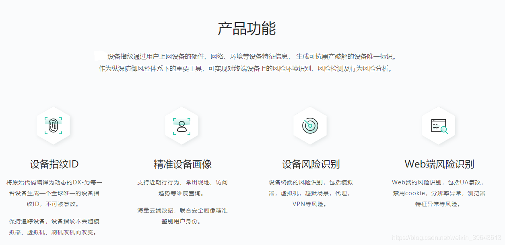
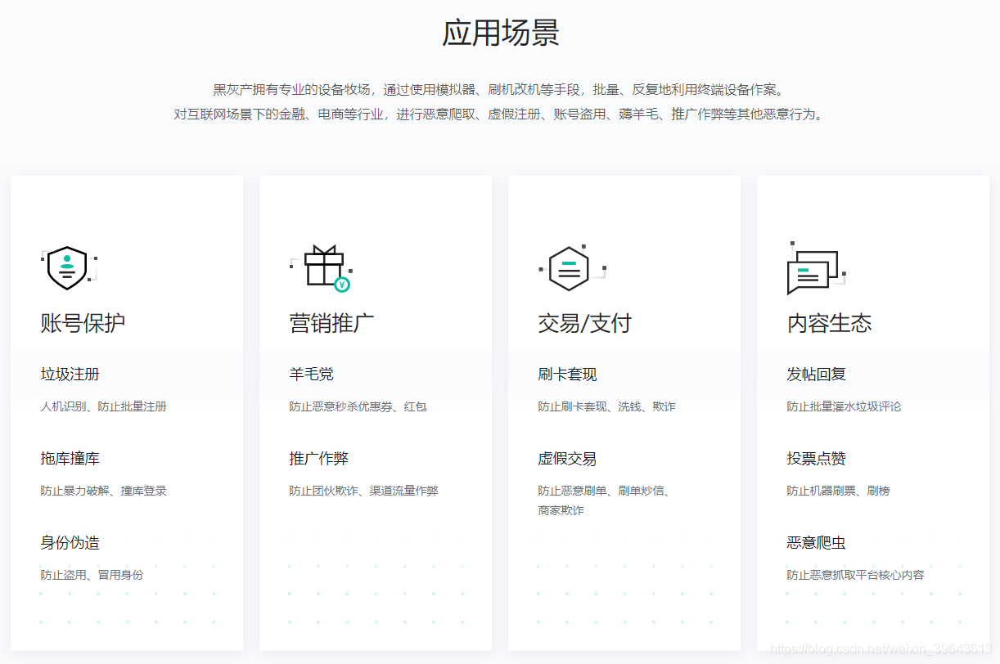
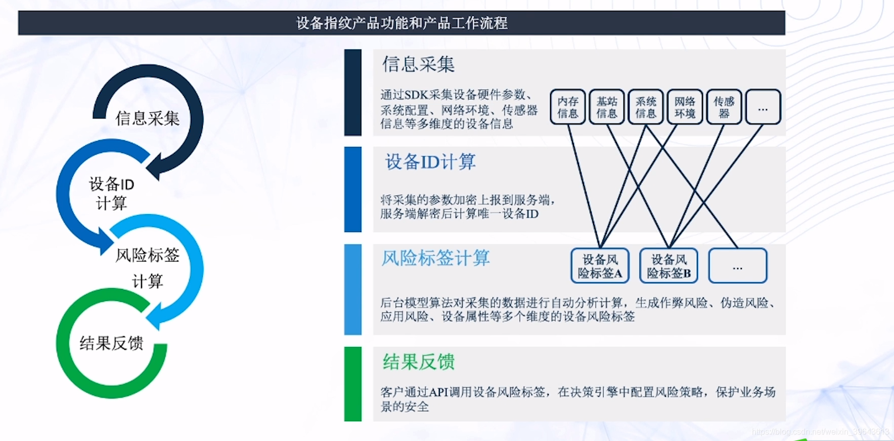
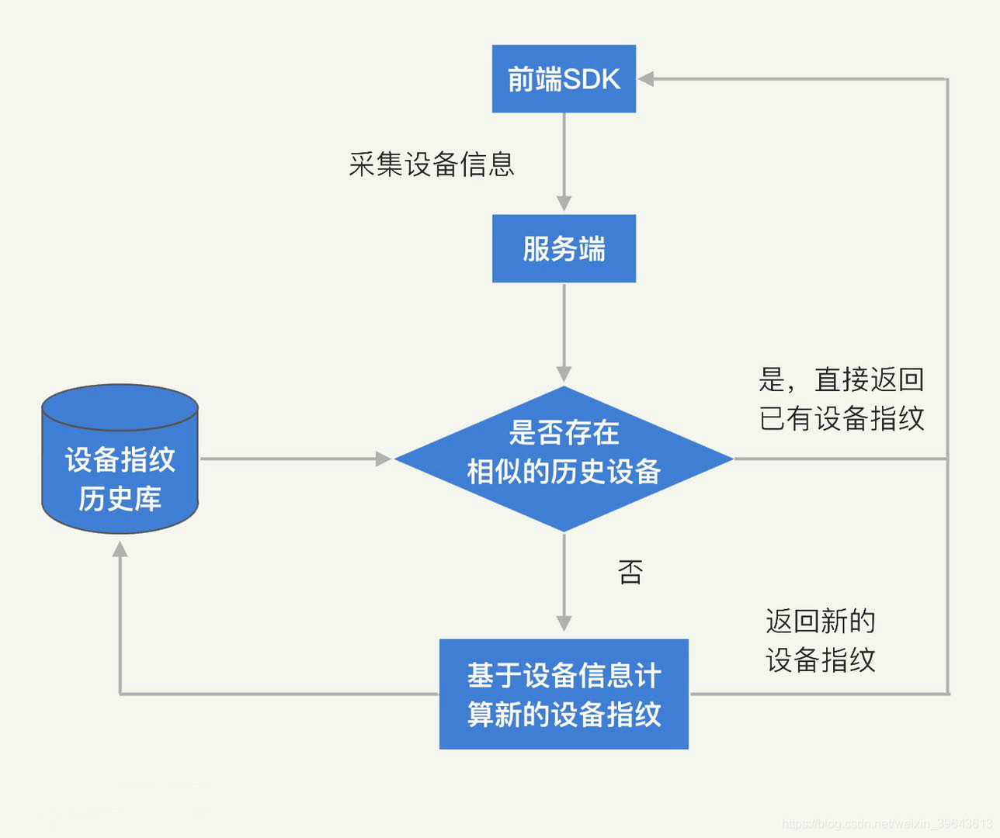
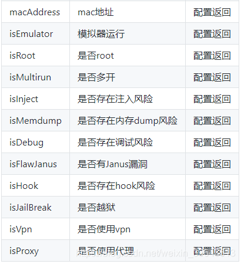
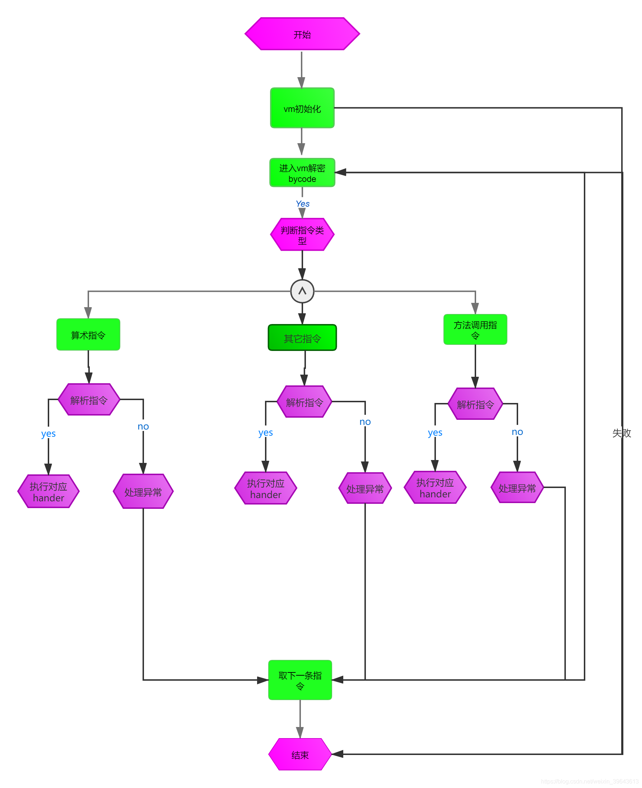
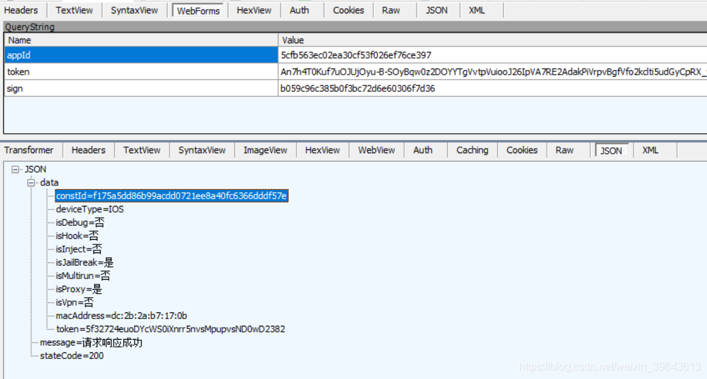
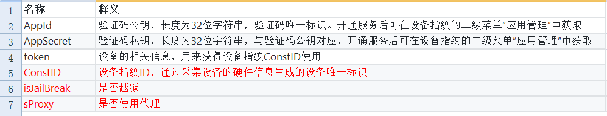
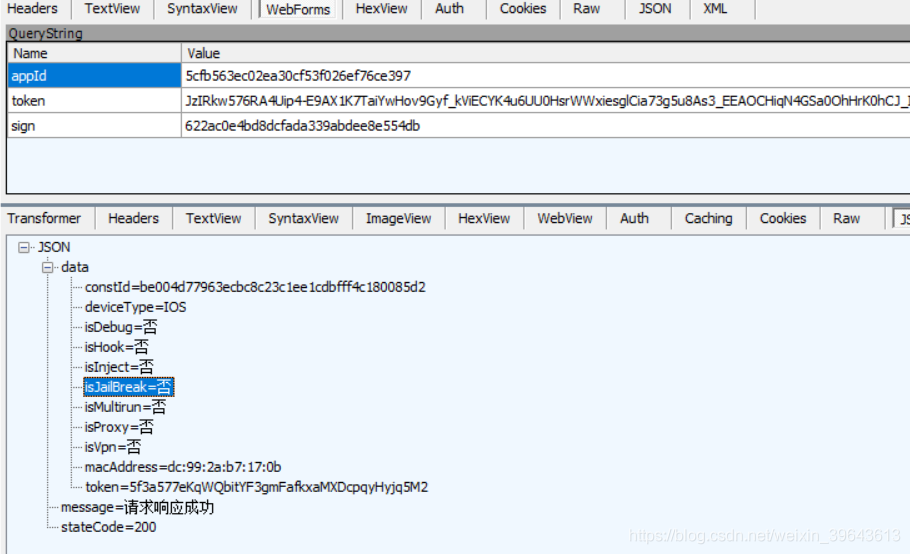

# 以攻击者角度学习某风控设备指纹产品

src:https://www.cnblogs.com/2014asm/p/13548445.html


# 一、产品特点

## 1.1 优点：

该产品在安全防破解方面个人认为算是业 内做到了比较高标准的安全保护机制，主要表现在以下几点:

安全虚拟机中实现加解密过程
将算法代码转换为安全虚拟机指令，将换后指令解释执行在虚拟机之中，无法被反编译还原回可读的源代码，指数级增长了代码逻辑复杂度，极大提升了黑客破解和篡改的时间成本与人力成本。

运行时系统环境安全识别
对本身做了完整性检验、调试器监测、检测当前运行设备是否处于越狱状态、检测当前进程是否被代码注入、检测当前进程API是否被hook。

## 1.2 缺点：

架构设计不具备高内聚低耦合
在我逆向过程中发现了很多分散重复相关联的代码逻辑未进行抽象整合，不够精炼，这也是使得包体过大的原因之一。
太过于注重安全，并没有权衡性能与安全的中间点，但是 从用户体验角度上来看，在某些要求高性能的APP上可能会损失掉部分用户体验。

## 1.3、产品功能

产品主要功能官方介绍如图1所示：



<center>图1</center>

## 2.1、设备指纹

设备设备指纹，简单来说就是一串符号（或者数字），映射现实中硬件设备。如果这些符号和设备是一一对应的，可称之为“唯一设备ID(Unique Device Identifier)"
设备指纹是登录网页或者APP时后台记录的登录设备的指纹，可以准确识别该设备是否曾经登录过。
通过在网站或者移动端嵌入设备指纹SDK/JS，可以获取操作设备的多重属性，为每一个操作设备建立一个全球唯一的设备ID。该设备ID就相当于这个设备的指纹，不论这个设备使用何种浏览器、何种应用或是在何地，都能够唯一标识该设备，设备系统升级变更，设备指纹不会发生变更。

# 三、设备指纹的应用场景

## 3.1、数据统计

在一般的数据统计分析领域，常常需要基于用户设备的维度来统计常规的pv，uv，点击数，用户留存等，这就都需要一个稳定且唯一的设备ID来保证。

## 3.2、风控安全

产品安全相关能力及应用场景官方介绍如图2所示：


<center>图2</center>

## 3.3、应用举例

**邀请返利**
互联网营销中为了吸引新用户注册、会推出注册领取礼品、礼券、红包等活动的方式鼓励推广新会员，这样便给羊毛党机会，可通过使用改机工具伪造新设备或者伪造某些系统底层参数(比如地理位置，imei号等等)的方式来绕过业务的限制获取更多礼品，在这种场景下用指纹识别设备的唯一性非常必要，所以一个好的设备指纹产品应该具有确保设备指纹生成的唯一性、防篡改、对系统环境异常识别的能力。

# 四、设备指纹原理分析

## 4.1、设备指纹具备特性

**唯一性高-稳定性强：**
对比于传统的 IP、手机号等ID，设备指纹具有唯一性高、稳定性强和信息丰富这三个优势。
简单来说，唯一性高是指一人一设备，因为使用者不同，每个智能设备上的使用痕迹和特征也具有唯一性。稳定性强也很好理解，就是智能设备的硬件不常更新，它们对应稳定不变的ID。

**第一，设备重置之后，保持设备指纹不变。**
恢复出厂设置是所有智能设备的标配功能，设备重置之后，系统自带的设备 ID 必然会发生变化，理论上来说就是“新设备”了。 所以，如果只是使用系统自带的设备ID，黑产完全可以通过不断恢复出厂设置模拟大量的设备，来绕过风控系统的检测。因此，如何在恢复出厂设置的情况下，仍然保持设备指纹的稳定不变，是设备指纹技术的主要挑战之一。

**第二，设备更新之后，保持设备指纹不变。**
既然无法直接使用自带的设备ID，那我们就必须基于各类设备信息综合计算出设备指纹。但是，我们平时在使用智能设备的时候，不仅会有意或无意地变更设备名称、网络环境、位置等信息，还会更新操作系统，系统版本、应用版本等特征也会随之改变。这都会影响到设备指纹的计算。
知道了设备更新能影响设备指纹的计算，黑产在进行欺诈行为的时候会更加极端，它们会更换部分硬件去尝试伪造新的设备，比如，摄像头、音响等相对容易拆卸安装的部分。因此，如何在一定程度上兼容设备的变动和更新，也是设备指纹需要考虑的问题之一。
总之，黑产总是会尝试去修改虚拟设备的各类配置，将其伪造成新的设备，从而绕过风控系统的检测。因此，一个稳定的设备指纹可以帮助风控系统对抗黑产的虚拟设备。
上面说的这两个挑战都属于设备指纹对稳定性的要求。最后，我们还要保证设备指纹的唯一性，避免两个不同的设备产生相同的设备指纹，比如，如何准确地区分同型号的设备，也是设备指纹需要满足的要求之一。所以，唯一性是避免误伤真实用户的关键维度。

## 4.2、设备指纹生成方式

**设备指纹整体生成流程如图3所示 :**


<center>图3</center>

**信息采集：**
想要获得准确且稳定的设备指纹，必须从多个维度采集不同的信息。通过逆向从内存截取了部分采集设备加密前信息如下：

```
00000001010C6E00  0A 17 0A 02 4B 31 12 11  64 63 3A 32 62 3A 32 61  ....K1..dc:2b:2a
00000001010C6E10  3A 62 37 3A 31 37 3A 30  62 0A 08 0A 03 4B 31 30  :b7:17:0b....K10
00000001010C6E20  12 01 32 0A 12 0A 03 4B  31 31 12 0B 31 32 30 37  ..2....K11..1207
00000001010C6E30  35 39 35 34 31 37 36 0A  11 0A 03 4B 31 32 12 0A  5954176....K12..
00000001010C6E40  39 33 33 34 38 30 30 33  38 34 0A 11 0A 03 4B 31  9334800384....K1
00000001010C6E50  33 12 0A 31 30 33 37 30  34 31 36 36 34 0A 0F 0A  3..1037041664...
00000001010C6E60  03 4B 31 34 12 08 37 35  30 58 31 33 33 34 0A 0B  .K14..750X1334..
00000001010C6E70  0A 03 4B 31 35 12 04 57  69 66 69 0A 14 0A 03 4B  ..K15..Wifi....K
00000001010C6E80  31 37 12 0D 63 68 61 72  67 69 6E 67 2F 31 30 30  17..charging/100
00000001010C6E90  25 0A 0D 0A 03 4B 31 38  12 06 44 61 72 77 69 6E  %....K18..Darwin
00000001010C6EA0  0A 10 0A 03 4B 31 39 12  09 69 50 68 6F 6E 65 2D  ....K19..iPhone-
00000001010C6EB0  76 76 0A 0A 0A 02 4B 32  12 04 6E 6F 6E 65 0A 0D  vv....K2..none..
00000001010C6EC0  0A 03 4B 32 30 12 06 31  36 2E 31 2E 30 0A 6B 0A  ..K20..16.1.0.k.
00000001010C6ED0  03 4B 32 31 12 64 44 61  72 77 69 6E 20 4B 65 72  .K21.dDarwin Ker
00000001010C6FC0  03 4B 33 31 12 0A 7A 68  2D 48 61 6E 73 2D 43 4E  .K31..zh-Hans-CN
00000001010C6FD0  0A 0D 0A 03 4B 33 32 12  06 31 30 2E 31 2E 31 0A  ....K32..10.1.1.
00000001010C6FE0  13 0A 03 4B 33 33 12 0C  E4 B8 AD E5 9B BD E8 81  ...K33..中  国  ..
00000001010C6FF0  94 E9 80 9A 0A 09 0A 03  4B 33 37 12 02 43 4E 0A  .通  ....K37..CN.
00000001010C7000  18 0A 03 4B 33 38 12 11  34 63 3A 65 39 3A 65 34  ...K38..4c:e9:e4
00000001010C7010  3A 38 34 3A 64 38 3A 38  30 0A 13 0A 03 4B 33 39  :84:d8:80
```

这些信息可以大致分为：设备ID、软件特征、硬件静态特征和硬件动态特征几个维度。

**设备ID：**
设备ID主要包括iOS设备的 IDFA、IDFV，Android 设备的 IMEI、MAC 等。这些ID本身就是苹果和Google为了给APP厂商提供追踪能力设计的标识，具备较好的唯一性和稳定性。
但是，操作系统为了保障用户隐私，对APP的权限做了较多的限制。比如，用户可以自主选择禁止APP获取到这些ID，重置手机也会同时重置这些ID等。
而黑产也会利用这一特性，绕过APP厂商的识别策略。比如，黑产可以在苹果系统中直接设置不允许获取IDFA。这样一来，APP 厂商的风控系统就没有办法通过设备维度关联黑产行为了，也就无法识别单一设备批量操作的攻击行为。

**软件特征：**
软件静态特征主要是操作系统和APP本身的各类基本信息，比如操作系统版本、手机名称、APP版本等。这些信息基本都可以通过更新或者手动配置的方式修改，因此在稳定性上表现较差。但是，这些信息能够反映出用户的个人特征，因此，它们能够对设备指纹的唯一性产生有一定的帮助。
比如，下图是我手机的部分状态信息，其中的每一项都能够直接或间接地代表我的部分信息。比如，我使用了一张移动卡和联通卡，我的手机型号是小米 9，我开着蓝牙等。

**硬件静态特征：**
硬件静态特征主要是设备的各类硬件信息，比如，主板、CPU、摄像头等相关型号信息。正常用户基本不会去替换设备上的各个硬件，因此硬件静态特征具备较高的稳定性。
但同一型号手机的硬件配置是一致的，所以，硬件静态特征在唯一性上相对欠缺。因此，通过硬件静态特征，我们无法很好地区分同型号的设备。

**硬件动态特征：**
硬件动态特征基本原理是基于硬件的一些动态执行层产生的特征（如：加速度传感器的偏差）来识别虚拟设备。
举个例子，因为加速度传感器校准结果的不精确性，其产生的最终结果会存在一定的偏差。通过多次快速地查询加速度传感器，我们就可以模拟出同一时刻，加速度传感器返回的结果值。又因为存在机械偏差，所以这些结果值是不同的，那通过这些值，我们就可以计算出该传感器的线性偏差。
利用这样的原理，我们可以采集任何一个传感器硬件的偏差特征。因此，从稳定性上来说，硬件动态特征的表现还是不错的。不过由于特征区间比较窄，唯一性稍差一些，更多被用来辅助区分同型号的不同设备及设备使用行为情况。

**设备指纹生成:**
采集信息之后，将基于这些信息计算出一个正确的设备指纹，是设备指纹技术的核心。由于业内相同产品数据的维度和数据量的大小都各有不同，因此，各个公司生成设备指纹的算法略有不同。

设备指纹生成需要解决的一个核心问题就是给出多组信息，如何判定它们是不是来自同一个设备或来自不同的设备。

最基本的判定过程其实就是计算两组数据的相似度，相似度越高、差异度越低，就越有可能是同一个设备。

当服务器收到新采集上来一组设备信息，我们要计算它和已有设备信息的相似度。比较简单流行的算法包括欧式距离、马氏距离、联合概率分布等，相对复杂的包括马尔科夫网络、置信度传播算法等。

通过算法计算后，判断是否到达设定的一个阈值，当新采集的数据与已有的相似度达到这个值之后，就可以判定这两组设备数据本质上都是同一台设备产生的。如果判定新采集数据属于己有设备，我们就分配相同的设备指纹。如果属于不同的设备，我们就为新采集的数据生成新的设备指纹，生成设备指纹简单流程如图4所示：


<center>图4</center>

# 五、设备风险识别原理分析

## 5.1、设备有什么风险？

模拟器、修改设备信息、WiFi信息、传感器、媒体和存储、应用模拟、系统设置模拟、越狱、hook、调试、注入等都是黑产作案过程中常见的手段。

该产品能识别的风险如图5所示：



<center>图5</center>

## 5.2、如何识别设备风险？

检测设备是否越狱代码如下：

```
__text:0000000100040AFC             ; bool __cdecl -[UIDevice stee_isJailbreak_5](UIDevice *self, SEL)
__text:0000000100040AFC             __UIDevice_stee_isJailbreak_5_
__text:0000000100040AFC
__text:0000000100040AFC             var_20          = -0x20
__text:0000000100040AFC             var_10          = -0x10
__text:0000000100040AFC             var_s0          =  0
__text:0000000100040AFC
__text:0000000100040AFC F6 57 BD A9                 STP             X22, X21, [SP,#-0x10+var_20]!
__text:0000000100040B00 F4 4F 01 A9                 STP             X20, X19, [SP,#0x20+var_10]
__text:0000000100040B04 FD 7B 02 A9                 STP             X29, X30, [SP,#0x20+var_s0]
__text:0000000100040B08 FD 83 00 91                 ADD             X29, SP, #0x20
__text:0000000100040B0C F3 03 01 AA                 MOV             X19, X1
__text:0000000100040B10 F4 03 00 AA                 MOV             X20, X0
__text:0000000100040B14 D6 83 00 94                 BL              _stee_vm_get
__text:0000000100040B18 F5 03 00 AA                 MOV             X21, X0
__text:0000000100040B1C E1 03 14 AA                 MOV             X1, X20
__text:0000000100040B20 CE 83 00 94                 BL              _stee.add.i64
__text:0000000100040B24 E0 03 15 AA                 MOV             X0, X21
__text:0000000100040B28 E1 03 13 AA                 MOV             X1, X19
__text:0000000100040B2C CB 83 00 94                 BL              _stee.add.i64
__text:0000000100040B30 E1 45 80 52                 MOV             W1, #0x22F ; a2
__text:0000000100040B34 E0 03 15 AA                 MOV             X0, X21 ; vcstack
__text:0000000100040B38 AF 83 00 94                 BL              _stee.interp4.DXRiskStatic
__text:0000000100040B3C E0 03 15 AA                 MOV             X0, X21
__text:0000000100040B40 B8 83 00 94                 BL              _stee.ret.i32
__text:0000000100040B44 00 00 00 12                 AND             W0, W0, #1
__text:0000000100040B48 FD 7B 42 A9                 LDP             X29, X30, [SP,#0x20+var_s0]
__text:0000000100040B4C F4 4F 41 A9                 LDP             X20, X19, [SP,#0x20+var_10]
__text:0000000100040B50 F6 57 C3 A8                 LDP             X22, X21, [SP+0x20+var_20],#0x30
__text:0000000100040B54 C0 03 5F D6                 RET
```

上面代码配合特征来检测设备是否越狱，如果是越狱返回true，但是代码被虚拟机保护了，越狱特征如下：

```
"/Applications/Cydia.app"
"/Applications/FakeCarrier.app"
"/Applications/Icy.app"
"/Applications/IntelliScreen.app"
"/Applications/MxTube.app"
"/Applications/RockApp.app"
"/Applications/SBSettings.app"
"/Applications/WinterBoard.app"
"/Applications/blackra1n.app"
"/Library/MobileSubstrate/DynamicLibrari"...
"/Library/MobileSubstrate/DynamicLibrari"...
"/Library/MobileSubstrate/MobileSubstrat"...
"/System/Library/LaunchDaemons/com.ikey."...
"/System/Library/LaunchDaemons/com.sauri"...
```

检测设备是否有代理流程如下：

```
__text:00000001000DAE6C             get_network_info   
__text:00000001000DAE6C
__text:00000001000DAE6C FF 43 04 D1 SUB             SP, SP, #0x110
__text:00000001000DAE70 FC 6F 0B A9 STP             X28, X27, [SP,#0x100+var_50]
__text:00000001000DAE74 FA 67 0C A9 STP             X26, X25, [SP,#0x100+var_40]
__text:00000001000DAE78 F8 5F 0D A9 STP             X24, X23, [SP,#0x100+var_30]
__text:00000001000DAE7C F6 57 0E A9 STP             X22, X21, [SP,#0x100+var_20]
__text:00000001000DAE80 F4 4F 0F A9 STP             X20, X19, [SP,#0x100+var_10]
__text:00000001000DAE84 FD 7B 10 A9 STP             X29, X30, [SP,#0x100+var_s0]
__text:00000001000DAE88 FD 03 04 91 ADD             X29, SP, #0x100
__text:00000001000DAE8C F4 03 00 AA MOV             X20, X0
__text:00000001000DAE90 1F 20 03 D5 NOP
__text:00000001000DAE94 E8 B3 4A 58 LDR             X8, =___stack_chk_guard
__text:00000001000DAE98 08 01 40 F9 LDR             X8, [X8]
__text:00000001000DAE9C A8 83 1A F8 STUR            X8, [X29,#var_58]
__text:00000001000DAEA0 E0 E3 01 91 ADD             X0, SP, #0x100+var_88   ; this
__text:00000001000DAEA4 2E 5C 00 94 BL              __ZN14dx_risk_json114JsonC1Ev ; dx_risk_json11::Json::Json(void)
__text:00000001000DAEA8 4E 05 01 94 BL              _CFNetworkCopySystemProxySettings
__text:00000001000DAEAC F3 03 00 AA MOV             X19, X0
__text:00000001000DAEB0 53 02 00 B4 CBZ             X19, loc_1000DAEF8
__text:00000001000DAEB4 1F 20 03 D5 NOP
__text:00000001000DAEB8 40 77 56 58 LDR             X0, =_OBJC_CLASS_$_NSNull ; void *
__text:00000001000DAEBC 1F 20 03 D5 NOP
__text:00000001000DAEC0 41 FD 55 58 LDR             X1, =unk_189D7DF07      ; char *
__text:00000001000DAEC4 52 06 01 94 BL              _objc_msgSend
__text:00000001000DAEC8 FD 03 1D AA MOV             X29, X29
__text:00000001000DAECC 65 06 01 94 BL              _objc_retainAutoreleasedReturnValue
__text:00000001000DAED0 F5 03 00 AA MOV             X21, X0
__text:00000001000DAED4 1F 20 03 D5 NOP
__text:00000001000DAED8 C1 FC 55 58 LDR             X1, =unk_189D7EBF6      ; char *
__text:00000001000DAEDC E0 03 13 AA MOV             X0, X19                 ; void *
__text:00000001000DAEE0 E2 03 15 AA MOV             X2, X21
__text:00000001000DAEE4 4A 06 01 94 BL              _objc_msgSend           ; isEqual:返回1跳过代理检测
```

isEqual:判断是否有代理，返回1就可以跳过代理检测

# 六、破解虚拟机保护

## 6.1、什么是虚拟机保护？

虚拟机保护是一种基于虚拟机的代码保护技术。它将基于汇编系统中的可执行代码转换为字节码指令系统的代码，来达到不被轻易逆向和篡改的目的。简单点说就是将程序的代码转换自定义的操作码(opcode)，然后在程序执行时再通过解释这些操作码，选择对应的函数执行，一条指令对应N多函数，从而实现程序原有的功能。

## 6.2、虚拟机流程分析

**虚拟机主入口：**
每个函数基本都被虚拟保护，入口代码如下：

```
__text:00000001000DAE20
__text:00000001000DAE20 F6 57 BD A9 STP             X22, X21, [SP,#-0x10+var_20]!
__text:00000001000DAE24 F4 4F 01 A9 STP             X20, X19, [SP,#0x20+var_10]
__text:00000001000DAE28 FD 7B 02 A9 STP             X29, X30, [SP,#0x20+var_s0]
__text:00000001000DAE2C FD 83 00 91 ADD             X29, SP, #0x20
__text:00000001000DAE30 F3 03 01 AA MOV             X19, X1
__text:00000001000DAE34 F4 03 00 AA MOV             X20, X0
__text:00000001000DAE38 0D FB 00 94 BL              _stee_vm_get
__text:00000001000DAE3C F5 03 00 AA MOV             X21, X0
__text:00000001000DAE40 E1 03 14 AA MOV             X1, X20
__text:00000001000DAE44 05 FB 00 94 BL              _stee.add.i64
__text:00000001000DAE48 E0 03 15 AA MOV             X0, X21
__text:00000001000DAE4C E1 03 13 AA MOV             X1, X19
__text:00000001000DAE50 02 FB 00 94 BL              _stee.add.i64
__text:00000001000DAE54 61 70 80 52 MOV             W1, #0x383
__text:00000001000DAE58 E0 03 15 AA MOV             X0, X21
__text:00000001000DAE5C FD 7B 42 A9 LDP             X29, X30, [SP,#0x20+var_s0]
__text:00000001000DAE60 F4 4F 41 A9 LDP             X20, X19, [SP,#0x20+var_10]
__text:00000001000DAE64 F6 57 C3 A8 LDP             X22, X21, [SP+0x20+var_20],#0x30
__text:00000001000DAE68 E3 FA 00 14 B               _stee.interp4.DXRiskStatic
```

每一个被保护的函数虚拟机入口基本相同，获取虚拟堆栈，传入方法代号找到对应的opcode码
获取opcode码:

```c
__int64 __fastcall stee_interp4_DXRiskStatic(__int64 vcstack, int Funcindex, double a3)
{
  return vm_dispatcher_hander(
           vcstack,
           (__int64)&unk_10011F160,
           (__int64)off_10011E690,
           &byte_1000D1F70[dword_100114150[Funcindex]],
           a3);//取opcode码
}
```

解密opcode并解释执行,代码流程如下：

```c
__int64 __fastcall vm_dispatcher_hander(signed __int64 vcstack, __int64 a2, __int64 hander, unsigned __int8 *bycode, double ret)
    {
unsigned __int8 *m_bycode; // x23
__int64 m_hander; // [xsp+8h] [xbp-58h]
m_bycode = bycode;
m_hander = hander;
v6 = a2;
m_vmstack = vcstack;
m_vmstack_1 = (double **)(m_vmstack + 8);
m_vmstack_2 = *(_QWORD *)(m_vmstack + 8);
opcode1 = (signed __int64)(m_bycode + 4);
Operands = (_QWORD *)(m_vmstack_2 - 4 * (*m_bycode | ((unsigned __int64)m_bycode[1] << 8)));
    *(_QWORD *)(m_vmstack + 8) = m_vmstack_2 + 4 * (m_bycode[2] | ((unsigned __int64)m_bycode[3] << 8));
++opcode1;
switch ( *opcode2 )
    {
case 7u:
    v19 = *(_DWORD *)(opcode2 + 1);
opcode1 = (signed __int64)(opcode2 + 5);
if ( v19 >= 2 )
    goto LABEL_17;
goto LABEL_192;
case 0xAu:
    v166 = opcode2[1] | (opcode2[2] << 8);
opcode1 = (signed __int64)(opcode2 + 3);
if ( v166 < 2 )
    goto LABEL_382;
goto LABEL_216;
case 0xBu:
    v102 = *m_vmstack_1;
v103 = *m_vmstack_1 - 1;
v104 = *(_DWORD *)v103;
*m_vmstack_1 -= 2;
v105 = v104 & 0x3F;
if ( !v105 )
{
    *m_vmstack_1 = v103;
    continue;
}
v106 = *((_QWORD *)v102 - 2);
LOBYTE(v105) = 64 - v105;
LABEL_288:
    *(_QWORD *)&v208 = __ROR8__(v106, v105);
goto LABEL_302;
case 0xCu:
    v107 = *((_DWORD *)*m_vmstack_1 - 1);
v108 = (double *)((char *)*m_vmstack_1 - 12);
    *m_vmstack_1 = v108;
v109 = *v108;
goto LABEL_136;
case 0xDu:
    v110 = opcode2[1];
opcode1 = (signed __int64)(opcode2 + 2);
if ( v110 >= 2 )
{
    v111 = *(__int64 (**)(void))(v6 + 8 * v110);
    goto LABEL_322;
}
v237 = (_DWORD)v110 == 1;
goto LABEL_396;
case 0xEu:
    v31 = *m_vmstack_1;
ret = *(*m_vmstack_1 - 2);
v32 = (signed __int64)*m_vmstack_1 - 12;
v33 = ret >= *(*m_vmstack_1 - 1);
goto LABEL_394;
case 0xFu:
    v57 = *m_vmstack_1;
ret = -3.59538627e308/*NaN*/;
case 0x11u:
    v21 = *m_vmstack_1;
v22 = (signed __int64)*m_vmstack_1 - 4;
cmdata = **((signed __int16 **)*m_vmstack_1 - 1);
goto LABEL_282;
v27 = &opcode2[2 * v25 + 3];
goto LABEL_275;
case 0x13u:
    v15 = (double *)((char *)*m_vmstack_1 - 4);
v16 = *((_DWORD *)*m_vmstack_1 - 2) >= *(_DWORD *)v15;
goto LABEL_7;
case 0x14u:
    v28 = *m_vmstack_1;
v29 = -1;
goto LABEL_424;
case 0x15u:
    LODWORD(v186) = (char)opcode2[1];
opcode1 = (signed __int64)(opcode2 + 2);
v187 = *m_vmstack_1;
LODWORD(v188) = (signed int)v186 >> 7;
goto LABEL_421;
case 0x16u:
    v68 = opcode2[1] | (opcode2[2] << 8);
opcode1 = (signed __int64)(opcode2 + 3);
if ( v68 >= 2 )
    goto LABEL_67;
goto LABEL_199;
case 0x17u:
    v15 = (double *)((char *)*m_vmstack_1 - 4);
LODWORD(ret) = *(_DWORD *)v15;
v16 = *((float *)*m_vmstack_1 - 2) > *(float *)v15;
goto LABEL_7;
case 0x18u:
    v30 = *m_vmstack_1;
*(_DWORD *)v30 = 0;
*m_vmstack_1 = (double *)((char *)v30 + 4);
        continue;
case 0x1Au:
    v79 = *m_vmstack_1;
v80 = (signed __int64)*m_vmstack_1 - 12;
v81 = *((_QWORD *)*m_vmstack_1 - 2) > *((_QWORD *)*m_vmstack_1 - 1);
goto LABEL_392;
case 0x1Cu:
    v36 = *m_vmstack_1 - 1;
v48 = *((_QWORD *)*m_vmstack_1 - 2) << (*(_DWORD *)v36 & 0x3F);
goto LABEL_326;
case 0x1Du:
    v36 = *m_vmstack_1 - 1;
ret = *(*m_vmstack_1 - 2) - *v36;
goto LABEL_325;
case 0x1Eu:
    v226 = *m_vmstack_1;
--*m_vmstack_1;
*((_DWORD *)v226 - 2) = **((unsigned __int8 **)v226 - 1) | (*(unsigned __int8 *)(*((_QWORD *)v226 - 1) + 1LL) << 8);
    *m_vmstack_1 = (double *)((char *)v226 - 4);
        continue;
case 0x1Fu:
    v21 = *m_vmstack_1;
--*m_vmstack_1;
v22 = (signed __int64)v21 - 4;
cmdata = **((char **)v21 - 1);
goto LABEL_282;
case 0x20u:
    v15 = (double *)((char *)*m_vmstack_1 - 4);
v16 = *((_DWORD *)*m_vmstack_1 - 2) <= *(_DWORD *)v15;
goto LABEL_7;
case 0x21u:
    v44 = (float *)((char *)*m_vmstack_1 - 4);
v160 = *(unsigned int *)v44;
v42 = v44 - 1;
--*m_vmstack_1;
v161 = *((unsigned int *)v44 - 1);
if ( v161 <= 0xFF800000 )
    v227 = (v161 > 0x7F800000 && (v161 & 0x80000000) == 0) == 0;
else
    v227 = 0;
if ( !v227 )
    goto LABEL_430;
if ( v160 > 0xFF800000 || v160 > 0x7F800000 && (v160 & 0x80000000) == 0 )
    goto LABEL_432;
v163 = v161 ^ v160;
LODWORD(ret) = v160;
if ( *(float *)&v161 > *(float *)&v160 )
    *(float *)&ret = *(v44 - 1);
v164 = *(float *)&ret;
if ( v161 <= v160 )
    v160 = *((unsigned int *)v44 - 1);
goto LABEL_339;
case 0x22u:
    v36 = *m_vmstack_1;
ret = *(*m_vmstack_1 - 1);
v48 = (unsigned __int64)ret;
goto LABEL_326;
case 0x23u:
    v40 = (float *)((char *)*m_vmstack_1 - 4);
    *(float *)&ret = *v40 + *((float *)*m_vmstack_1 - 2);
goto LABEL_316;
case 0x24u:
    v100 = opcode2[1];
opcode1 = (signed __int64)(opcode2 + 2);
goto LABEL_344;
case 0x26u:
    v79 = *m_vmstack_1;
v80 = (signed __int64)*m_vmstack_1 - 12;
v81 = *((_QWORD *)*m_vmstack_1 - 2) <= *((_QWORD *)*m_vmstack_1 - 1);
goto LABEL_392;
case 0x27u:
    v40 = (float *)((char *)*m_vmstack_1 - 4);
    *(float *)&ret = *((float *)*m_vmstack_1 - 2) - *v40;
goto LABEL_316;
v29 = v51 - v51 / v50 * v50;
LABEL_424:
    *(_DWORD *)v28 = v29;
*m_vmstack_1 = (double *)((char *)v28 + 4);
        continue;
case 0x65u:
    Operands_1 = ((unsigned __int16)(opcode2[1] | (unsigned __int16)(opcode2[2] << 8)) | ((unsigned __int64)opcode2[3] << 16)) & 0xFFFFFFFF00FFFFFFLL | ((unsigned __int64)opcode2[4] << 24);
opcode1 = (signed __int64)(opcode2 + 5);
goto LABEL_252;
case 0x67u:
    v15 = (double *)((char *)*m_vmstack_1 - 4);
v16 = *(_DWORD *)(*m_vmstack_1 - 1) & *(_DWORD *)v15;// 加密数据
goto LABEL_7;
case 0x69u:
    v229 = opcode2[1] | ((unsigned __int64)opcode2[2] << 8);
opcode1 = (signed __int64)(opcode2 + 3);

case 0x93u:
    v57 = *m_vmstack_1;
*(_QWORD *)&ret = 1LL;
LABEL_369:
    *v57 = ret;
*m_vmstack_1 = v57 + 1;
        continue;
case 0x94u:
    Operands_1 = opcode2[1];
opcode1 = (signed __int64)(opcode2 + 2);
LABEL_252:
    (*(void (__fastcall **)(signed __int64))(m_hander + 8 * Operands_1))(m_vmstack + 8);// 执行出口hander,调用外面方法
        continue;
case 0x95u:
    v204 = *m_vmstack_1;
*m_vmstack_1 = (double *)((char *)*m_vmstack_1 - 4);
v205 = *((_DWORD *)v204 - 1);
if ( v205 >= (opcode2[1] | ((unsigned int)opcode2[2] << 8)) )
    {
v206 = objc_msgSend(&OBJC_CLASS___NSString, (const char *)&unk_189D7DBA4, "VM Error: impossible", ret);
NSLog(v206);
}
opcode1 = (signed __int64)&opcode2[*(signed int *)&opcode2[4 * v205 + 3]];
        continue;
case 0x96u:
    opcode1 = (signed __int64)(opcode2 + 3);
v113 = &opcode2[opcode2[1] | (unsigned __int16)(opcode2[2] << 8)];
LABEL_148:
    vm_dispatcher_hander(m_vmstack, v6, m_hander, v113, ret);
        continue;
case 0x97u:
    v79 = *m_vmstack_1;
v80 = (signed __int64)*m_vmstack_1 - 12;
v81 = *((_QWORD *)*m_vmstack_1 - 2) >= *((_QWORD *)*m_vmstack_1 - 1);

continue;
case 0xFFu:
v34 = *m_vmstack_1;
v82 = *((_QWORD *)*m_vmstack_1 - 1);
LABEL_250:
*((_DWORD *)v34 - 2) = __clz(v82);
LABEL_268:
*((_DWORD *)v34 - 1) = 0;
*m_vmstack_1 = v34;
continue;
default:
continue;
        }
    }    
}
```

上面就是虚拟机最核心的解释器代码片断，逻辑也注释清楚，主要功能就是解密opcode、模拟执行opcode、常见的逻辑运算都被模拟了，所以加解 密算法也是在虚拟中完成的，要还原算法还是难度比较高的，但是如果opcode是调用外部系统方法就跳出虚拟机。代码如下：

```C
LABEL_252:
    (*(void (__fastcall **)(signed __int64))(m_hander + 8 * Operands_1))(m_vmstack + 8);// 执行出口hander,调用外面方法
        continue;
```

所以opcode为0xFC表示call xxx调用外部方法，其实只要守在这个地方，基本逻辑功能也能逆向出来。整体流程如图6所示：


<center>图6</center>

# 七、破解设备指纹与风险识别

## 7.1、抓包分析

通过抓包可以看来请求参数数据与返回数据，如图7所示： 


<center>图7</center>

各参数解释，如图8所示：


<center>图8</center>

上面标红的参数就是我们要攻击目标。
ConstID攻击：如果是同一台设备永远不会变化，攻击方式是用同一台设备返回不同的ConstID就算攻击成功。

风险识别攻击：在设备越狱且使用代理的情况下返回"否"就算攻击成功。

## 7.2、破解设备指纹与风险识别

通过前面对虚拟机保护的分析，知道它最终于会走外部方法时跳出虚拟机，我们只要在该出口守住即可。然后在详细分析各外部方法功能，代码逻辑如下：

```
__text:00000001000C23D4 F4 4F BE A9 STP             X20, X19, [SP,#-0x10+var_10]!
__text:00000001000C23D8 FD 7B 01 A9 STP             X29, X30, [SP,#0x10+var_s0]
__text:00000001000C23DC F3 03 00 AA MOV             X19, X0
__text:00000001000C23E0 74 02 40 F9 LDR             X20, [X19]
__text:00000001000C23E4 FD 43 00 91 ADD             X29, SP, #0x10
__text:00000001000C23E8 88 8E 5E F8 LDR             X8, [X20,#-0x18]!
__text:00000001000C23EC 80 86 40 A9 LDP             X0, X1, [X20,#8]
__text:00000001000C23F0 00 01 3F D6 BLR             X8
__text:00000001000C23F4 74 02 00 F9 STR             X20, [X19]
__text:00000001000C23F8 FD 7B 41 A9 LDP             X29, X30, [SP,#0x10+var_s0]
__text:00000001000C23FC F4 4F C2 A8 LDP             X20, X19, [SP+0x10+var_10],#0x20
__text:00000001000C2400 C0 03 5F D6 RET
```

get_network_info：检测设备是否正在使用代理。
_UIDevice_stee_isJailbreak_1 ：检测设备是否越狱。
最后通过key:value的方式组合压缩加密上报组报给服务器，服务器做出相应的回应，对外部方法的分析，整理出如下字段对应关系，如果要做协议刷接口的方式就全部还原出来。

```
K23:是否越狱 (true:越狱, false:非越狱)
K3:是否代理(true:代理, false:非代理)
k1:mac地址
k5:idfv
k6:idfa
```

基于以上分析逻辑关系，破解的方法有如下几种：
第一种、篡改函数返回值：直接篡改检测设备状态后的返回值，改成false，非越狱、非代理、非调试等
第二种、篡改组合后的key:value值：将内存中组好的值进行修改为我们想要的，但是前提是须要对组合逻辑与对应的key关系分析清楚。
第三种、协议直接刷接口：分析完整个产品的逻辑、加解密算法、字段对应关系即可脱离产品本身代码，自实现有服务器交互的逻辑模拟请求，由于加解密算法都被虚拟机保护，要全部还原花费时间成本太高。
我选择的攻击方法是第二种在内存中修其组合好的参数，最终在同一台越狱设备上成功攻击，如图9所示：


<center>图9</center>

与上面对比，constId设备id是一个新的，设备风险全为否，攻击成功。

# 八、总结

通过攻击视角对设备指纹技术进行基本原理性的学习了解。设备指纹是风控系统中对设备实现长期追踪和异常识别的一种关键技术。与黑产的对抗中会起到一定的作用，但它不是银弹，黑产也会用各种方式破解攻击设备指纹，生成或收集生成好的设备指纹，因此设备指纹也须要时效性。 

从整体来看该产品与业内同产品相比较安全方面做得还是比较高水准的，通过虚拟机保护真正的做到了加解密逻辑的隐藏，防止被还原直接刷接口，但是百密一疏终有一漏，因此不断升级更新算法补漏与设置一定的策略来识别被攻破的行为还是很有必要的。


