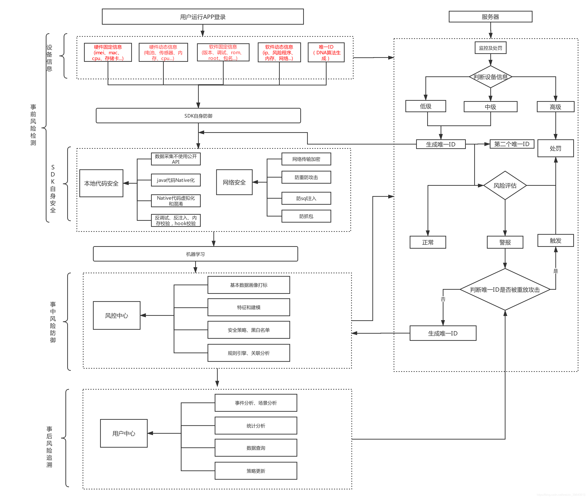
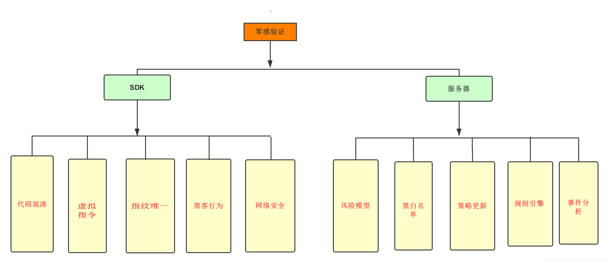
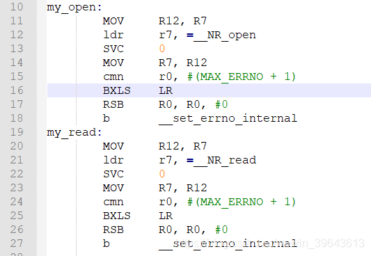
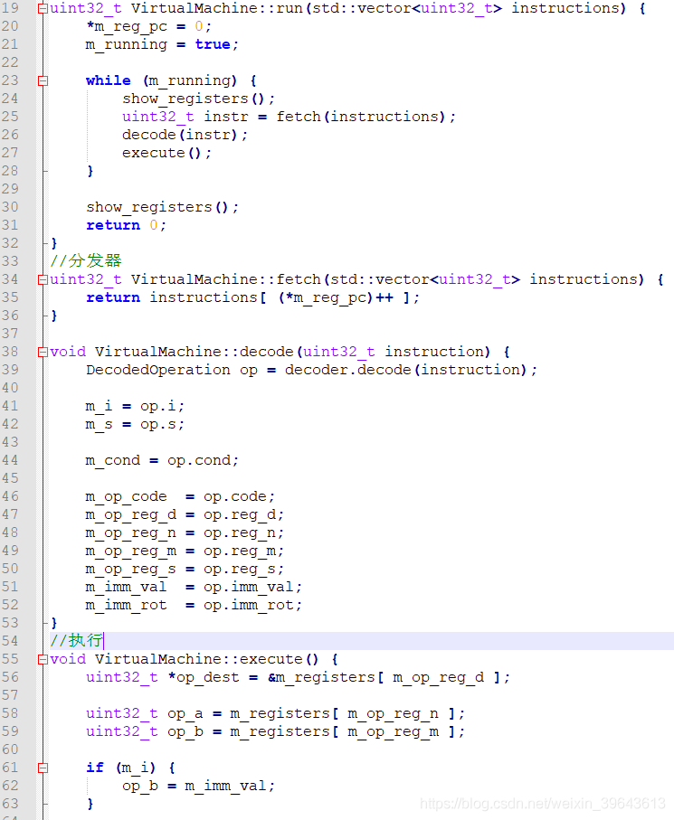
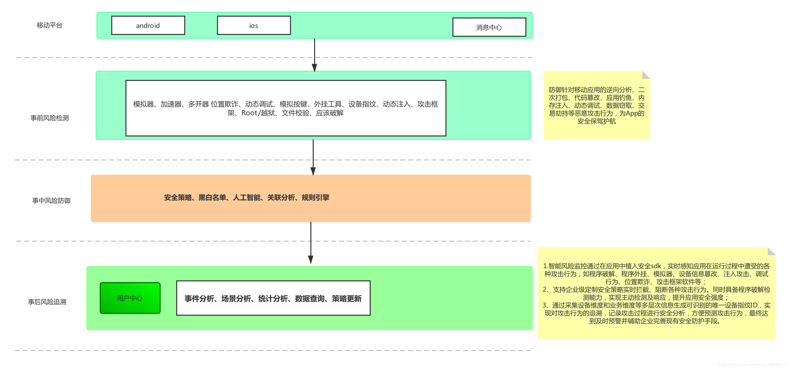
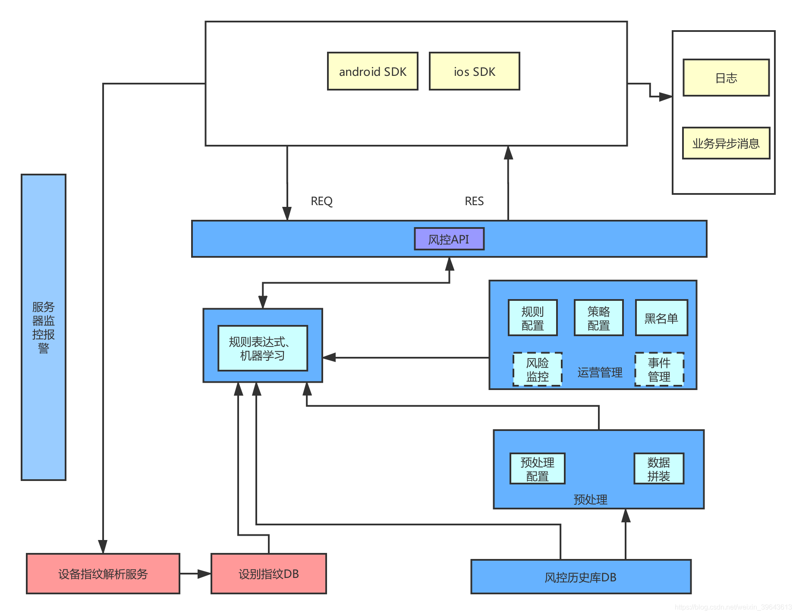
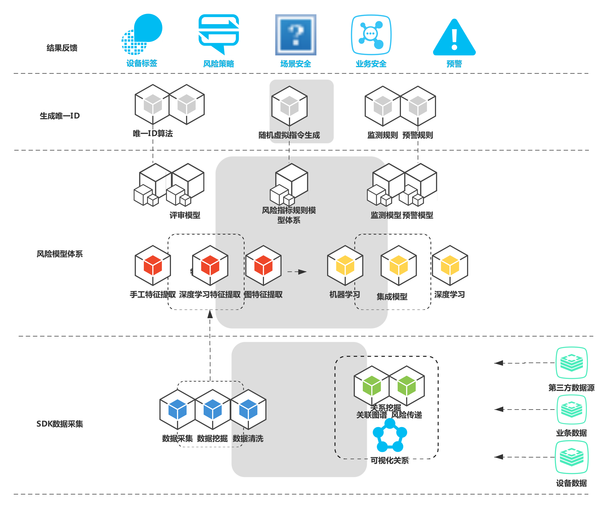

# 基于设备指纹零感验证系统


src:https://www.cnblogs.com/2014asm/p/11601353.html


工具环境: android 4.4.4、IDA Pro 7.0、jeb3、sklearn机器学习库


# 0x00:为什么是零感验证？验证码的发展史。

## 为什么须要零感验证?

为什么叫零感验证:零的起源是来自于印度，它深受佛教大乘空宗的影响，意为“空”，它表示“没有”这个量，代表起点亦是终点。

与较传统验证码相比，用户无需输入操作，只需按照正常逻辑登录就可进行验证，极大提升用户体验。

主要有三大优点，分别是用户体验，风险识别，风险拦截。下面举例说明。

先来看一个场景，在游戏业务中，为了降低用户体验门槛，在打开游戏时可以不要求用户注册，也就是说拿不到账户角度的用户信息。这时识别用户设备就很重要，否则在后端无法分辨哪些是同一个用户的数据。要在未登录状态时追踪用户。

### 用户体验：

零感验证型验证码针对大多数的用户能够无需思考，直接通过。不存在业务和流程的打断，体验流畅，对用户体验的提升毋庸质疑。

### 风险识别：

因为随着机器学习的发展让机器掌握人类具有的知识也不再是难点，无知识型验证码不再基于知识来挑战机器，而是基于人类的固有行为特征以及操作的环境信息综合进行风控决策，攻击者难以批量的模拟出可以欺骗风控引擎的正常人类的的操作。

### 风险拦截：

普通的验证码基于知识对机器发起挑战，无法做到对机器进行阻断。因为知识的挑战还需要兼顾人类的体验，机器通过的概率只能做到无限的降低而无法消除。而零感验证型验证码基于后端的风控决策，可以对不同风险的操作提出更高难度的验证码乃至阻断，有更大空间对风险进行消除和拦截。

## 验证码的发展史:

验证码是在2002年由提出者路易斯·冯·安(Luis von Ahn)和他的小伙伴在卡内基梅隆第一次提出了CAPTCHA(验证码)这个概念。该方式是指向请求的发起方提出问题，能正确回答的即是人类，反之则为机器。这个程序基于这样一个重要假设：提出的问题要容易被人类解答，并且让机器无法解答。

在当时机器计算能力弱小的的条件下，要识别扭曲的图形，对于机器来说还是一个很艰难的任务，而对于人来说，则相对可以接受。yahoo在当时第一个应用了图形化验证码这个产品，很快解决了yahoo邮箱上的垃圾邮件问题，因此图形类验证码一直使用至今。

随着图片识别技术的发展与打码平台的出现，图片验证码的开始没落。图片类验证码也越来越复杂，用户体验非常不友好

后来又出现了基于人类固有的生物特征以及操作的环境信息综合决策，来判断是人类还是机器。无知识型验证码最大特点即无需人类思考，从而不会打断用户操作，进而提供更好的用户体验。

# 0x02:实现原理与架构流程

零感验证主要通过采集设备指纹、行为特征、访问频率、用户登录行为、地理位置等信息进行模型分析与规类，有效的拦截恶意登录、批量注册，阻断机器操作，拦截非正常用户，较传统验证码相比，用户无需再经过思考或输入操作，只需点击登录即可进行验证。经过后台鉴别为正常的用户，既为企业提供了安全保障也让用户无感知通过，极大提升用户体验。

整体的框架流程如下:


# 0x03:技术细节分析

## 1.整体技术架构图

将围绕如下整体技术架构图来做分析:


## 2.刷单是怎么实现的：

目前大部分APP开发中常需要获取设备的硬件信息做为识别设备基础，以应对刷单，目前常用的几个设备识别码主要有IMEI、Android_id、IDFA、不过Android6.0之后需要权限才能获取，而且这些硬件信息很容易被Hook篡改，可能并不靠谱，另外也可以通过MAC地址或者蓝牙地址，序列号等，如下：

* IMEI : (International Mobile Equipment Identity) 、IDFA、MAC 或者蓝牙地址

* Serial Number（需要重新刷flash才能更新）

* AndroidId ANDROID_ID是设备第一次启动时产生和存储的64bit的一个数，手机升级，或者被wipe后该数重置

以上是常用的设备识别码，系统也提供了详情的接口让开发者获取，但是由于都是上层方法，很容易被Hook篡改，尤其是有些专门刷单的，在手机Root/越狱之后，利用HOOK框架里的一些插件很容易将获取的数据给篡改，达到刷单的目的。

所以为了能获取相对准确的设备信息我们需要采取相应的应对措施，可以采用一些系统底层隐藏的接口来获取设备信息，隐藏的接口不太容易被篡改，或者自定义一些相对安全的采集数据底层接口。

如下图自行封装的接中：


## 3.SDK自身安全:

作为一个安全类的sdk产品，自身的安全与防御能力也是很重要的，不然被分析逻辑然后hook接口篡改参数就可以做到一定程度的破解。

防逆向：通过上面介绍，采集数据主要通过自己封装接口来实现，然后再混淆关键逻辑代码，防止通过IDA，readelf等工具对so里面的逻辑进行分析。未经混淆的代码受到攻击后，易暴露程序中关键算法、核心业务逻辑、数据结构和模块的控制流布局等敏感内容，代码混淆方面主要功能如下：

### 控制流平坦化

在保证不改变源代码功能的前提下，将C、C++、Objective-C等语言中的if、while、for、do等控制语句转化为switch分支选择语句。

### 插入各种花指令与指令内联

插入各种不会被执行的无效字节码，使逆向分析工具进行字节码解析时出错。再将自己封装的接口代码指令内联分散，增加分析难度。

### 控制流变换

对于跳转控制条件和分支语句，在保持原程序逻辑关系的前提下，随机确定控制块的执行顺序，达到模糊程序控制逻辑、隐藏程序控制流的目的。

### 代码完整性校验

在混淆源码时植入crc校验，在程序执行时校验同因子映射对应的代码，保证代码执行时的完整性,防止被下软断点调试与被HOOK风险。

### 字符串加密

对程序中字符串加密处理，对抗静态逻辑分析。

## 4.环境与算法安全：

### 环境检测

模拟器与多开器因为易用可复制性在黑产刷单中被频繁使用，如何准确的识别模拟器与多开器也是SDK的一个重要模块。

#### 模拟器检测

系统属性与硬件信息，比如:IMEI是否全部为0000000000格式，系统库存是否有模拟器特征，文件系统差异的特征,获取cpu信息判断是x86还是ARM。

ARM与X86在架构上有很大区别，ARM采用的哈弗架构将指令存储跟数据存储分开，与之对应的，ARM的一级缓存分为I-Cache（指令缓存）与D-Cahce（数据缓存），而X86只有一块缓存，而模拟器采用的是模拟x86架构，如果我们将一段可执行代码动态映射到内存，在执行的时候，X86架构上动态修改这部分代码后，指令缓存会被同步修改，而ARM修改的却是D-Cahce中的内容，此时I-Cache中的指令并不一定被更新，这样，程序就会在ARM与x86上有不同的表现，根据计算结果便可以知道究竟是X86还在ARM平台上运行。

测试代码：主要就是将地址e2844001的指令add r4, r4,#1，在运行中动态替换为e2877001的指令add r7, r7, #1，在ARM-V7架构上测试，ARM采用的是三级流水，PC值=当前程序执行位置+8。

```c
8410:       e92d41f0        push    {r4, r5, r6, r7, r8, lr}
8414:       e3a07000        mov     r7, #0
8418:       e1a0800f        mov     r8, pc      // 本平台针对ARM7，三级流水  PC值=当前程序执行位置+8
841c:       e3a04000        mov     r4, #0
8420:       e2877001        add     r7, r7, #1
842c:       e1a0800f        mov     r8, pc
8430:       e248800c        sub     r8, r8, #12   // PC值=当前程序执行位置+8
8434:       e5885000        str     r5, [r8]
8438:       e354000a        cmp     r4, #10
843c:       aa000002        bge     844c <out>
```

如果是在ARM上运行，e2844001处指令无法被覆盖，最终执行的是`add r4,#1`，而在x86平台上，执行的是`add r7,#1`。

#### 多开检测

目前市面上的多开App的原理类似，都是以新进程运行被多开的App，并hook各类系统函数，使被多开的App认为自己是一个正常的App在运行。目前主流的多以开平行空间、VirtualApp等形式来做。

##### 检测files目录路径

我们知道App的私有目录是/data/data/包名/或/data/user/用户号/包名，通过Context.getFilesDir()方法可以拿到私有目录下的files目录。在多开环境下，获取到目录会变为/data/data/多开App的包名/xxxxxxxx或/data/user/用户号/多开App的包名/xxxxxxxx。

##### uid检测

在Android系统中会为每一个apk分配的一个应用的标志，每一个APP对应一个uid。因为虚拟化并没有真正的安装应用，因此uid必定是和宿主一致的。我们的检测方法就是如果满足同一uid下的两个进程对应的包名，在"/data/data"下有两个私有目录，则该应用被多开了。

##### 进程模块检测

读取/proc/self/maps，多开App会加载一些自己的so到内存空间，通过对各种多开App的包名的匹配，如果maps中有多开App的包名的东西或模块，那么当前就是运行在多开环境下。获取自身加载的模块路径。

### 算法安全

#### 算法代码虚拟化

虚拟算法指令随机化、非线性化操作，进行随机映射编码，隐藏相关内容，加强防御黑客对算的法攻击。比如我们SDK中的用户登录行为算法被逆向清楚就可能被模拟了。

##### 什么是代码虚拟化?

虚拟机的代码保护也可以算是代码混淆技术的一种。代码混淆的目的就是防止代码被逆向分析，但是所有的混淆技术都不是完全不能被分析出来，只是增加了分析的难度或者加长了分析的时间，虽然这些技术对保护代码很有效果，但是也存在着副作用，比如会或多或少的降低程序效率，这一点在基于虚拟机的保护中格外突出，所以大多基于虚拟机的保护都只是保护了其中比较重要的部分。所以我们对关键算法部分进行保护。

虚拟机的保护技术中，通常自定义的字节码与native指令都存在着映射关系，也就是说一条或多条字节码对应于一条native指令。至于为什么需要多条字节码对应同一条native指令，这样就可以做到每次都不能的算法指令，其实是为了增加虚拟机保护被破解的难度，这样在对被保护的代码进行转换的时候就可以随机生成出多套字节码不同，但执行效果相同的程序，导致逆向分析时的难度增加。

大致代码如下图:


### 用户登录行为

举一个简单的示例：比如算用户按键行为时间差，假设第i个按键按下与弹起的时间分别为Downi与UPi；第二步，计算第i个字符的按键时长Downi与间隔时长UPTi，计算方法为Downi＝UPi-Downi，即按下与弹起的时间之差。这只是行为的一小部分。

#### 设备唯一性

在移动互联网时代新零售、电商、游戏、获取设备可信的唯一id是一个常见的业务需求，但是在app推广拉新过程中，长期存在着新用户免费的业务逻辑。可观的利润使得大量的黑产蜂拥而至。刷机，hook篡改,设备农场等手段层出不穷，无所不用其极。所以上面我们做的各种反逆向手段就是为了保证SDK自身的安全性，这样才能更好地保证全获取设备唯一的方案安全。

零感验证产品工作流程大致如下，事前->事中->事后->结果反馈

通过SDK采集设备硬件参数、系统配置、网络环境、传感器、信号等多维度的设备信息，服务器后台模型算法对采集的数据进行自动分析计算、生成作弊风险、伪造风险、应用风险、设备属性等多个维度的风险标签。

如果对唯一ID感性趣可以阅读这篇文章:<https://www.cnblogs.com/2014asm/p/10884489.html>。


### 5.服务端风控与安全:

上面提到的唯一id的生成策略风控等所有的生成规则都是放到服务器处理的，这样反作弊的策略也可以最快时间响应。

服务器端整体架构如下图:

服务器端用Spring Boot框架开发的服务，服务器端会有须要实时计算的功能，要将任意维度的历史数据（可能半年或更久）实时统计出结果，由于数据的维度数量不固定的，选取统计的维度也是随意的，所以不能在关系数据库中建几个索引就能搞定的，需要利用空间换时间，来降低时间复杂度。目前采取的方案是redis加mongodb，redis中数据结构sortedset，是个有序的集合，集合中只会出现最新的唯一的值。利用sortedset的天然优势，做频数统计非常有利。mongodb本身的聚合函数统计维度，支持很多比如：max，min，sum，avg，first，last，标准差，采样标准差，复杂的统计方法可以在基础聚合函数上建立。redis性能优于mongodb，所以使用场景较多的频数计算默认在redis中运行，但是redis为了性能牺牲了很多空间，数据重复存储，会占用很多内存。基本代码如下：

```java
/**
     * @param event          事件
     * @param condDimensions 条件维度数组,注意顺序
     * @param enumTimePeriod 查询时间段
     * @param aggrDimension  聚合维度
     * @return
     */
    public int addQueryHabit(Event event, String[] condDimensions, EnumTimePeriod enumTimePeriod, String aggrDimension) {
        if (event == null || ArrayUtils.isEmpty(condDimensions) || enumTimePeriod == null || aggrDimension == null) {
            logger.error("参数错误");
            return 0;
        }
        Date operate = event.getOperateTime();
        String key1 = String.join(".", String.join(".", condDimensions), aggrDimension);
        String[] key2 = new String[condDimensions.length];
        for (int i = 0; i < condDimensions.length; i++) {
            Object value = getProperty(event, condDimensions[i]);
            if (value == null || "".equals(value)) {
                return 0;
            }
            key2[i] = value.toString();
        }
        String key = event.getScene() + "_sset_" + key1 + "_" + String.join(".", key2);

        Object value = getProperty(event, aggrDimension);
        if (value == null || "".equals(value)) {
            return 0;
        }

        int expire = 0;
        String remMaxScore = "0";
        if (!enumTimePeriod.equals(EnumTimePeriod.ALL)) {
            //如果需要过期，则保留7天数据,满足时间段计算
            expire = 7 * 24 * 3600;
            remMaxScore = dateScore(new Date(operate.getTime() - expire * 1000L));
        }

        Long ret = runSha(key, remMaxScore, String.valueOf(expire), dateScore(operate), value.toString(), dateScore(enumTimePeriod.getMinTime(operate)), dateScore(enumTimePeriod.getMaxTime(operate)));
        return ret == null ? 0 : ret.intValue();
    }


    /**
     * 计算sortedset的score
     *
     * @param date
     * @return
     */
    private String dateScore(Date date) {
        return new SimpleDateFormat("yyyyMMddHHmmss").format(date);
    }


    private Object getProperty(Event event, String field) {
        try {
            return PropertyUtils.getProperty(event, field);
        } catch (Exception e) {
            e.printStackTrace();
        }
        return null;
    }


    /**
     * 事件入库
     *
     * @param event
     */
    public void insertEvent(Event event) {
        mongoDao.insert(event.getScene(), Document.parse(JSON.toJSONString(event), new DocumentDecoder()));
    }

    /**
     * 可疑事件入库
     *
     * @param event 事件bean
     * @param rule  触发的规则详情
     */
    public void insertRiskEvent(Event event, String rule) {
        Document document = Document.parse(JSON.toJSONString(event), new DocumentDecoder());
        document.append("rule", rule);
        mongoDao.insert(riskEventCollection, document);
        logger.warn("可疑事件，event={},rule={}", JSON.toJSONString(event), rule);
    }

    public int count(Event event, String[] condDimensions, EnumTimePeriod enumTimePeriod) {
        if (event == null || ArrayUtils.isEmpty(condDimensions) || enumTimePeriod == null) {
            logger.error("参数错误");
            return 0;
        }

        Document query = new Document();
        for (String dimension : condDimensions) {
            Object value = getProperty(event, dimension);
            if (value == null || "".equals(value)) {
                return 0;
            }
            query.put(dimension, value);
        }

        query.put(Event.OPERATETIME, new Document("$gte", enumTimePeriod.getMinTime(event.getOperateTime())).append("$lte", enumTimePeriod.getMaxTime(event.getOperateTime())));

        return mongoDao.count(event.getScene(), query);
    }

    /**
     * db.applogin.aggregate(
     * [
     * {$match:{mobile:"13900009725", operateTime: { $gte: new Date(1467213873277) }}},
     * {$group:{_id:null,_array:{$addToSet: "$operateIp"}}},
     * {$project:{_num:{$size:"$_array"}}}
     * ]
     * )
     **/
    private int distinctCountWithMongo(Event event, String[] condDimensions, EnumTimePeriod enumTimePeriod, String aggrDimension) {
        if (event == null || ArrayUtils.isEmpty(condDimensions) || enumTimePeriod == null || aggrDimension == null) {
            logger.error("参数错误");
            return 0;
        }

        Document query = new Document();
        for (String weido : condDimensions) {
            Object value = getProperty(event, weido);
            if (value == null || "".equals(value)) {
                return 0;
            }
            query.put(weido, value);
        }

        query.put(Event.OPERATETIME, new Document("$gte", enumTimePeriod.getMinTime(event.getOperateTime())).append("$lte", enumTimePeriod.getMaxTime(event.getOperateTime())));

        return mongoDao.distinctCount(event.getScene(), query, aggrDimension);
    }

    private int distinctCountWithRedis(Event event, String[] condDimensions, EnumTimePeriod enumTimePeriod, String aggrDimension) {
        return addQueryHabit(event, condDimensions, enumTimePeriod, aggrDimension);
    }

    /**
     * 计算频数，有2种方式，这里考虑性能，采用redis方式
     *
     * @param event
     * @param condDimensions
     * @param enumTimePeriod
     * @param aggrDimension
     * @return
     */
    public int distinctCount(Event event, String[] condDimensions, EnumTimePeriod enumTimePeriod, String aggrDimension) {
        return distinctCountWithRedis(event, condDimensions, enumTimePeriod, aggrDimension);
    }

    public List distinct(Event event, String[] condDimensions, EnumTimePeriod enumTimePeriod, String aggrDimension) {
        if (event == null || ArrayUtils.isEmpty(condDimensions) || enumTimePeriod == null || aggrDimension == null) {
            logger.error("参数错误");
            return null;
        }

        Document query = new Document();
        for (String dimension : condDimensions) {
            Object value = getProperty(event, dimension);
            if (value == null || "".equals(value)) {
                return null;
            }
            query.put(dimension, value);
        }

        query.put(Event.OPERATETIME, new Document("$gte", enumTimePeriod.getMinTime(event.getOperateTime())).append("$lte", enumTimePeriod.getMaxTime(event.getOperateTime())));
        return mongoDao.distinct(event.getScene(), query, aggrDimension);
    }
```

初始密钥与虚拟机算法code

```java
@RequestMapping(value = "/initreq", method = RequestMethod.POST)
    public Result<String> initreq(@RequestBody String init) {
        String ret = null;
        String base64tmp = null;
        String tempaes = null;
        byte[] base64outbufer;
        String m_base64outbufer;
        byte[] aseout = {0x00};
        String aeskey = "tdf5df0kljhlnhbd";     //aeskey
        String pub_key ="-----BEGIN PUBLIC KEY-----\n" +
                "MIGfMA0GCSqGSIb3DQEBAQUAA4GNADCBiQKBgQCRwBcxeI0LTFJrBevaMSV2B5mj\n" +
                "WF51b/VAmAb76L1IVQJx1JjCSI25G3P5omdPzS7Mbe2rlyHwOWjS3A6V6YiEYtwh\n" +
                "JcAM7Z+gbwzCbjPSd/N+ONrmCwJcmj5xQky1prvtZhfxRRdd89fHm8yZ9JKO/kpX\n" +
                "R/v2BSDl+q89aQmxmwIDAQAB\n" +
                "-----END PUBLIC KEY-----";//rsa公钥
        String requestId = null;          //本次请求ID
        String m_data = null;
        String vcode = null;
        logger.info("init:"+init);
        base64tmp = init.replace("datainfo=", "");
        try {
            base64tmp = java.net.URLDecoder.decode(base64tmp, "UTF-8");
        } catch (UnsupportedEncodingException e) {
            e.printStackTrace();
        }
        //base64tmp = base64tmp.replace("%3D%3D", "==");
        //base64tmp = base64tmp.replace("\r", "");
        //base64tmp = base64tmp.replace("\n", "");
        logger.info("post:"+base64tmp);
        logger.info("post:"+base64tmp.length());
        Result r = Result.success();
        try {
            if (StringUtils.isEmpty(base64tmp)) {
                throw new RCRuntimeException(CodeMap.PARAM_ERROR);
            }
           /* Event event = EventFactory.build(tempaes);

            if ("ON".equals(configService.query("SWITCH_RC"))) {
                kieService.execute(event);
            }*/

            //base64解密
            base64outbufer = Base64.decode(base64tmp.getBytes());
            //去掉前后固定字符
            String strbase64 = new String(base64outbufer);
            logger.info("strbase64_1:"+strbase64);
            //返回算法随机bycode码，与密钥

            requestId = ParamAlgorithm.GetRequestId();
            logger.info("requestId:"+requestId);
            r.setrequestId(requestId);

            /*
            保证每一个手机生成算法都不一样，
            除了ID的安全外还有算法的安全来做保证，
            黑产大量收集了ID也是没用的，还须要把算法分析清楚才能进行攻击
            算法每一次都是不一样的，随机变化
             */
            vcode = ParamAlgorithm.GetVcode();
            logger.info("vcode:"+vcode);
            //r.setVcode(vcode);

            m_data = ParamAlgorithm.GetData(aeskey, pub_key, vcode);
            logger.info("m_data:"+m_data);
            r.setData(m_data);

        } catch (RCRuntimeException e) {
            r = Result.fail();
            r.setRetCode(e.getId());
        } catch (Exception e) {
            logger.error("业务风控初始化失败!", e);
            r = Result.fail();//清空数据
        }
        return r;
    }
```

生成唯一ID

```java
@RequestMapping(value = "/GenID", method = RequestMethod.POST)
    public Result<String> GenID(@RequestBody String devinfo) {
        String ret = null;
        String base64tmp = null;
        byte[] base64outbufer;
        String m_base64outbufer;
        String requestId = null;          //本次请求ID
        String deviceid = null;
        String m_data = null;
        String imei = null;
        String android = null;
        String mac = null;
        String disksn = null;
        byte[] aseout = {0x00};
        logger.info("post:"+base64tmp);
        base64tmp = devinfo.replace("datainfo=", "");
        base64tmp = base64tmp.replace("%3D%3D", "==");
        base64tmp = base64tmp.replace("\r", "");
        base64tmp = base64tmp.replace("\n", "");
        logger.info("post:"+base64tmp);
        logger.info("post:"+base64tmp.length());
        Result r = Result.success();
        try {
            if (StringUtils.isEmpty(base64tmp)) {
                throw new RCRuntimeException(CodeMap.PARAM_ERROR);
            }
            //解析参数,生成唯一ID
            //base64解密
            m_base64outbufer = Base64.sdecode(base64tmp);
            //去掉前后固定字符
            String strbase64 = new String(m_base64outbufer);
            strbase64 = new String(strbase64.getBytes(),"UTF-8");;
            logger.info("strbase64_1:"+strbase64);
            strbase64 = strbase64.replace("seid;","").trim();
            strbase64 = strbase64.replace("wdfw","").trim();
            logger.info("strbase64_2->"+strbase64);
            //逆转
            strbase64 = ParamAlgorithm.Reverse(strbase64.toCharArray(), strbase64.length());
            logger.info("Reverse->"+strbase64);
            base64outbufer = Base64.decode(strbase64.getBytes());
            String tempaes= new String(base64outbufer);
            logger.info("tempaes->"+tempaes);
            /*Event event = EventFactory.build(tempaes);
            if ("ON".equals(configService.query("SWITCH_RC"))) {
                kieService.execute(event);
            }*/
            requestId = ParamAlgorithm.GetRequestId();
```

部分风控使用规则，使用drools规则引擎管理风控规则，这样原则上可以动态配置规则。比如1分钟内某账号的登录次数，可以用来分析盗号等，频数统计，比如1小时内某ip上出现的账号，可以用来分析黄牛党等，某时间段，可以是多个维度组合，利用统计方法统计结果维度的值，以判断 ip为例，规则如下：

```java
rule "login_ip"
    salience 98
    lock-on-active true
    when
        event:LoginEvent()
    then
        int count  = dimensionService.distinctCount(event,new String[]{LoginEvent.OPERATEIP},EnumTimePeriod.LASTHOUR,LoginEvent.MOBILE);
        if(event.addScore(count,20,10,1)){
            dimensionService.insertRiskEvent(event,"近1小时内同ip出现多个mobile,count="+count);
        }
        count = dimensionService.count(event,new String[]{LoginEvent.OPERATEIP},EnumTimePeriod.LASTMIN);
        if(event.addScore(count,20,10,1)){
             dimensionService.insertRiskEvent(event,"近1分钟同ip登陆频次,count="+count);
        }
end
```

再总结下服务端流程:设备信息->黑白名单->风控规则->阈值预警->保存事件。

# 0x04:总结

最后再来总结下零感验证系统整体流程，如下图所示：

该方案能给业务方便的同时还能保证业务的相对安全，相比较于传统图形验证码,安全用户无感知通过，提升体验，降低流失。

在风控方面结合了设备指纹、行为特征、访问频率、登录行为等特征，有效的拦截恶意登录、批量注册，阻断机器操作，拦截非正常用户。

如果黑产对对手机的imei和mac等信息做了更改行为，但是通过其它维度的信息检测，还可以识别出是原来的用机，而不认为是一个新的设备。

提高作弊成本。世上没有完美产品与解决方案，攻防的本质是成本的较量，但是黑产行为一定是要讲投入产出比例的。其实我们没有办法从根本上屏蔽作弊行为，但是如果让想要作弊黑产提高不可接受的时间成本和资金成本，那我们就成功了。

目前主要以黑白名单，ip，设备指纹为主，行为、可以扩展更多维度信息，比如地域运营商，ip地域运营商，ip出口类型，征信等，维度越多，行为用户行为特征、可以建立规则越多，风控越精准；

扩展风控规则，针对需要解决的场景问题，用户行为特征、添加特定规则，分值也应根据自身场景来调整。

将用户的行为轨迹综合考虑，建立复合场景的规则条件。减少漏报和误报。这将是个漫长打磨的过程。给出一个demo样例。

