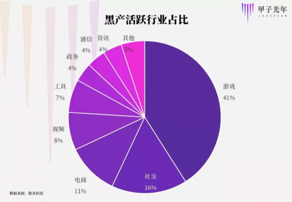
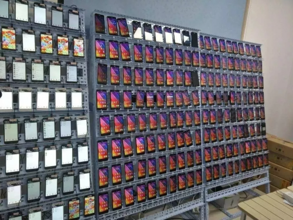
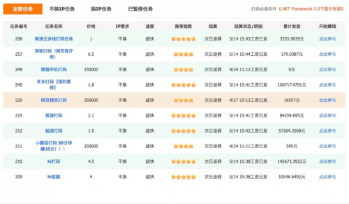
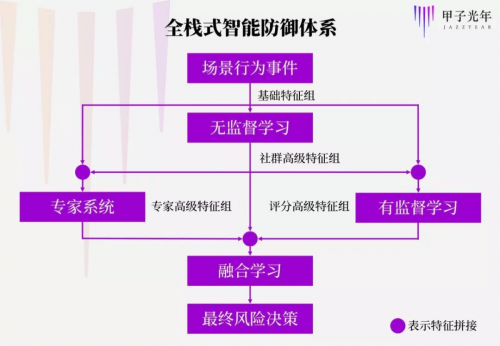

# 数美科技：为业务互联网化保驾护航的幕后英雄

url：https://baijiahao.baidu.com/s?id=1655034993139698384&wfr=spider&for=pc

“很久没有碰到这么大的漏洞了，你们继续，我睡了。”

2019年1月20日凌晨1点半，在某“羊毛党”聚集的电报（Telegram，一款社交APP）群里，一位圈内“大佬”发话道。

这天夜里，就在大佬睡前半小时，某电商平台上线了一张面额100元的全场通用优惠券，有效期1年。

对职业羊毛党来说，这简直在送钱。

他们立刻启动多个虚假账号领券，再在平台内购买Q币或给手机充值，券直接变成钱。

很快，这一漏洞便从半小时内就薅得盆满钵满的职业羊毛党，扩散到了大众群体。“整个羊毛党世界沸腾了”，一夜无眠。

第二天，该平台发表声明，数千万元优惠券被盗。

作为数美科技黑产研究院院长，潜伏在羊毛党电报群里的Sw0rdH01der（化名）又一次近距离目睹了一场黑产狂欢。

有利益的地方就有黑产。

据统计，国内黑产从业者规模超过百万；2018年，黑产造成的损失已高达千亿级——这些数字还在迅速增长。

此刻，黑产江湖已渗透进我们生活的角角落落，庞大的黑产攻防战正在一波三折地展开。偷袭者魔高一尺，狙击者道高一丈，先进的科技武器被逐一纳入应用，精彩程度不亚于一部斗智斗勇的激烈谍战片。

而Sw0rdH01der所在的数美科技，正是揭开这一幕的一个绝佳视角：

自2015年6月成立以来，数美一直战斗在对抗黑产的最前线。

从流量红利到流量吃紧，数美成立时恰逢移动互联网开启“下半场”，黑产对抗需求剧增。

典型欺诈风险包括支付盗刷、恶意退款、渠道流量作弊、虚假用户拉新、机器抢券、违法违规内容、欺诈广告导流、内容盗爬等；随着越来越多传统行业走向“互联网+”，数美与黑产的较量又进一步从社交、电商、游戏、视频、在线旅游、在线教育等延伸到了银行、保险、证券、地产、航旅、新零售等领域。

不到4年间，数美已服务了银联、中信银行、万达、华润、苏宁、OPPO、小米、爱奇艺、瑞幸咖啡、B站、小红书等千余家企业，每日拦截超过3000万次风险行为，累计保护了全球20亿以上的用户。

在这场关于贪念的持久战中，正反双方都遵循着同一个法则：

以持续变化的技术手段，应对不变的人性。

\1. “最赚钱的方法，都写在了刑法里”

几年前，Sw0rdH01der曾协助警方破获了一个华东地区黑产团伙。

团伙一共三人：一位19岁少年负责技术，另两人负责商务。他们的生意是“打码平台”——给黑产执行方提供一套SaaS，让他们能快速破解各平台和APP验证码。

仅仅1年间，这个平均年龄不到25岁的三人团伙获利数千万元，而全部成本只有他们在居民楼里攒出来的十余台服务器和一年的电费——总投入仅几十万元。这惊人的利润率，真是应了那个段子：所有最赚钱的方法，都写在了刑法里。

黑产的暴利，源于中国互联网经济的超大体量。黑产圈的行话：水大，速来。

水最大鱼最爽时，是2012年到2016年的移动互联网狂飙期，也是平台和黑产“相互利用”、相安无事的“暧昧期”。

那几年，李彦宏要“200亿砸出个O2O”；滴滴快滴，饿了么美团，摩拜ofo相继开战，狂撒补贴。

有人估计，这些补贴中，可能有一半都被“羊毛党”薅走了。但当时各平台大多睁一只眼闭一只眼，因为只要DAU（日活）、MAU（月活）、GMV（总交易额）增速好看，资本就能持续到位。

但从2017年开始，形势逆转了。

越来越贵的流量成为中国互联网“新常态”，各公司图腾也从DAU变成了ROI（投资回报率）：活动营销不能停，却也一分钱不能费。黑产便从昔日的“带量小甜甜”变成了今日的“拜金牛夫人”——不会再有公司对他们放任不管了。

数美的反欺诈业务，正是在2017年开始了爆发式增长。

2017年初至今，数美客户数从几十家扩展到千余家，旗下反欺诈产品的日访问量增长到30余亿次。

而战场另一侧，在数美这类专业黑产打击者的狙击下，本来躺着挣钱的黑产也翻身跃起，飞速进化，已由散兵游勇发展为“集团式作战”。

去年，数美曾遇到过一次效率惊人的黑产大协作——在针对一家互联网公司的薅羊毛中，短短几小时内，黑产从多个VPN代理商处调动了十几万个代理IP，从数十个接码平台调用了几十万手机号，注册的虚假账号遍布全国114个城市。

2018年，根据某头部接码平台（代接网站、APP验证码的平台）数据统计，游戏、社交和电商已成为黑产重灾区。

更纯熟、更工业化的黑产操作正席卷中国互联网，在数美这样的专业对抗者面前，一幅黑产众生相逐渐展开。

\2. 黑产江湖

目前，从上游到下游，黑产已形成了情报收集、资源工具、黑产执行、变现套利四大核心环节，诞生了线报小子、卡商、猫池、代理IP商、打码平台、设备农场、黑产实施者、变现师傅、羊头（众包黑产任务的发放人）等多种角色。

环节1-情报收集

挖掘线报是获利的第一步。

黑产团伙中会有专门角色负责线报收集，把哪家要做活动、时间范围、收益变现形式、反欺诈规则等信息准确及时传达清楚。

线报人员获取情报的来源通常是电报群（Telegram作为一个加密聊天软件，隐私保护做的十分极致，不受任何信息监管，同时群组最多可添加10万人，深受羊毛党从业人士喜爱）、黑灰产论坛、QQ群、微信群等。

信息获取后，会有专门的业务渗透人员和脚本小子分析清楚产品逻辑和必需资源——什么端的活动、新帐号首单还是老帐号拉活、是否有地域性、是否需绑卡，然后该充钱的充钱，该屯号的屯号，确保万事俱备。

黑产交换最新“行业信息”

这简直是最有“钱景”的“知识付费”。常见形态是情报头子会建一个微信/QQ/电报群，有需求者交钱入群。

据Sw0rdH01der介绍，一个情报群会费可达上千元——一个500人的群，就能为情报头子带来50万的收入，十个500人的群就是500万收入。

环节2-核心资源与工具准备

巧妇难为无米之炊，单个帐号能薅的羊毛通常有产品限制。为了批量获利，提前备好“资源”是黑产团伙的重中之重。

“资源”包括：设备、账号、手机号、IP等。

以设备为例，从虚拟机、改机设备、多开设备（在同一系统上，同时启动运行多个同一应用），再到大规模设备农场，黑产手段在光速升级。

设备农场的典型场景是，房间里竖着数排能挂数百台手机的机架，仿佛一个高科技的“蔬菜大棚”。黑产从业者通过群控软件、改机工具进行自动化大规模的设备篡改——数百物理机器，在短短24小时内就可以篡改出数十万个虚假设备。

挂满手机的设备农场

设备农场的运营者可以自己牟利，也可以将设备农场租赁给下游黑产实施方，以收取租金。

再如打码平台。目前，激烈的竞争逼迫他们不断给“客户”带来更好的体验，有竞争力的打码平台早已用上了AI。90%左右的请求由AI完成，对于AI没有判断准确的部分，系统会自动分发给人工打码平台，由码工完成，同时，码工的工作成果又会反馈给AI，不断迭代出更强大的模型，快速破解各种新型验证码。

快速切换多个打码平台的黑产交互界面

以Sw0rdH01der协助破获的那家打码平台来说，两年前，他们就用上了TensorFlow、Caffe等深度学习平台，与科研院所和科技巨头一同走在技术前沿。

正因如此，对专业黑产来说，现今的主流验证手段都没什么作用。

“秒破”，Sw0rdH01der多次提到了这个词。

在互联网领域之外，比如金融行业信用卡的申请欺诈上，还有成组织地贩卖公民四件套信息（身份证、手机号、银行卡、手持身份证照片）的商家。目前，单组四件套市价已达近千元。

环节3-黑产实施

黑产实施，即利用上游线报、资源、工具，对平台实施薅羊毛等欺诈行为。

这个环节没太多技术含量，只能赚到产业链上1/3的“辛苦钱”，充斥着技术背景一般的“脚本小子”。

他们大多使用“易语言”，这是一种不需要任何英文基础，完全以汉字编码的语言，深受黑灰产从业者的青睐。

黑产行业内还有完善的“培训体系”，推出了一周速成、一月包会的服务，编出了“接码平台加IG（一种改机工具），飞行模式切IP（打开再关闭飞行模式，可以快速变更移动设备的IP地址）”等朗朗上口的黑产教学顺口溜。

环节4-变现套利

黑产作恶的最终目的是变现套利，即通过提现和各种价值套利方式进行变现。由于很多羊毛党薅到的不是直接的现金，黑产中便演化出了一个不可或缺的角色——点物成金的“变现师傅”。

变现师傅的人脉、渠道资源和议价能力（能以多大的折扣“销赃”），直接决定了他们获取不法利润的丰厚程度。

试想一下，当你利用某银行和某线下便利店合作推出的信用卡支付促销漏洞，薅来一屋子方便面时，你如何变现？一般人能做到吗？变现师傅就能做到。

所以在黑产中，变现师傅是个很有门槛的角色。

“你要认识足够多的人，人家愿意给足够高的价买你的东西，能谈到七折还是八折，看你的本事。”Sw0rdH01der告诉「甲子光年」。

还有一种“卖苦力”的变现者——骡子。

这是金融欺诈中的常见角色。盗刷银行卡后，黑产需要一套严密的流程来避免资金被追踪。这些资金会被打到数十张乃至数百张银行卡上，骡子的职责就是骑着摩的到分散各地的ATM机中取出现金。

在上述四大环节、众多角色的参与中，整个黑产江湖已呈现出强烈的上下游敏捷响应能力和“互助精神”：

一旦某漏洞出现，庞大的黑产实施方会在第一时间尝试攻击；一旦手段不灵，“羊毛薅不到了”的烽火就会迅速燃遍各大QQ/电报群，打码平台等技术供应者随即快速跟进；一旦哪个打码平台率先突破，它就能在此次战役中大赚一笔；而经此一役，这种“先进”解决方案又会被争相复制，快速普及。

到2018年，随着数美服务的许多客户进入海外扩张阶段，数美又有了一个新发现：国内黑产出海了！

数美攻防团队在“搭讪”黑产时，已开始遇到同时发送中英文产品简介的客服。

没有对比就没有伤害，一个有些讽刺的现实是，国内黑产已领先全球。

3.魔高一尺道高一丈

国内黑产的快速升级，除了“有钱能使鬼推磨”的利益驱动外，更直接的刺激因素正是黑产对抗者的存在。

在自然界，类似的“竞争协同进化”已上演千百年：

昆虫进化出了啃食植物的口器，植物就会相应地进化出利刺或毒素——魔高一尺，道高一丈，螺旋上升，协同向前。

让我们快速回顾一下数美在过去几年经历的几轮攻防战：

黑产常见手法：从打接口、虚拟机到设备农场

数美先后与打接口、虚拟机和设备农场三种常见的黑产操作对阵，难度从低到高依次升级。

2015年公司刚成立时，数美面临的最普遍的黑产是打接口和虚拟机。

这两种手法比较相似，都是用电脑模拟手机等移动设备，以虚假设备信息和网站、APP的服务器端通信。

这种低成本手段是移动互联网水大鱼大时期的遗留物，铭刻着各平台未对黑产痛下杀手时的“美好记忆”，由于操作简便，不需额外资源，仍是目前主流的黑产手段之一。

识别打接口的主要方式是：引入设备标识判断逻辑，没有任何设备标识信息或信息不正确，就会被判断为打接口“假客户端”。

识别虚拟机的方法也不算困难——其中一种方法是看CPU、PC上虚拟机使用的CPU指令集架构和移动设备会有明显差别，如果发现指令集属于PC而非移动设备，则识别成功。

打接口、虚拟机，攻破。

此后，黑产不得不启用更高成本的新手段——用真实手机作恶，设备农场形态应运而生。

这里是数美与黑产对决的一个长期堡垒，攻防双方的手段交替进化，数美先后攻克了简单刷机（通过修改单个设备信息，如IMEI号，用一台手机模拟出多个移动设备）、复杂刷机（通过修改多维度设备信息模拟移动设备）、Hook改机（通过劫持系统函数、返还虚假信息模拟移动设备）和多开（通过劫持系统函数，同时在单台手机上打开几十个相同应用，如几十个微信，提高作恶效率），把黑产逼到了不得不启用“真机农场”的境地。

而真机农场，就是“老老实实”地把一台手机当做一个设备来用，相比用一台真实设计模拟数个虚假设备，其成本已十分高昂。

可很快，反欺诈工程师们也找到了应对真机农场的关键：即便不刷机、不Hook，群控却依然是黑产无法绕过的核心，所以在对群控多维痕迹进行专门检测后，真机农场也无所遁形。

设备农场，攻破。

2018年的黑产新动向：云手机、硬件插件和积分墙

从2018年起，数美又开始遇到齐头并进的3种黑产新趋势：云手机、硬件插件和积分墙。

2018年9月下旬，云手机横空出世。就像其名称所展示的，这是云计算在黑产界的最新应用。

和“云手机”的对决，让Sw0rdH01der记忆深刻。

当时，数美正在服务某直播平台，该平台推出了看内容返平台币和签到返人民币的推广优惠。

诱人的利益引得各路黑产纷纷来战，数美很快在其中发现了一种与虚拟机相似，但设备特征略有差异的新型黑产，且在快速起量，结合情报推测，这很有可能是当时刚兴起的云手机。

云手机和传统设备农场的最大区别是：它背后并不是一个真正的手机，而是一套搭载在云服务器上的虚拟手机。

在云手机加持的新型农场里，场景更加“科幻”——挂在墙上的不再是成百上千的手机，而是一片片装载了安卓的板卡，这些板卡可被电脑群控，模拟正常智能手机的注册、点击、分享等一系列用户行为。

数美团队随即加班加点，在发现异常的一天内收集了市面上全部11款云手机方案，在两天内实现了复现（即模拟黑产进行成功攻击）和环境检测，并具备了识别能力。

策略团队随后跟进，上线封堵方案——方兴未艾的云手机，被绞杀在了青春期。某视频平台因而避免了数千万元的潜在损失。

云手机，攻破。

在云计算之外，黑产也开始用起了硬件插件。

去年底，就在云手机的热潮刚刚平息时，一个新“网红”又在黑产圈流传，情报群里最火热的信息都关于它：买大牛了吗？用大牛了吗？

不过就像数美反欺诈产品“天网”的寓意：天网恢恢，疏而不漏。一周之内，大牛也被干掉了——原来大牛是一款可插装在苹果手机上的硬件，它最牛的功能是，是插上之后，能让苹果手机在不“越狱”（开放用户操作权限）的情形下实现改机和篡改GPS的目的。

搞清了这个原理后，只要识别出相关特征，大牛也就不牛了。

大牛，攻破。

最近半年，数美又遇到了目前这波黑产中最难搞定的Boss级手段——积分墙。

积分墙其实就是“人刷”，由羊头和羊群协作完成。

厉害的羊头能触及多达万级乃至十万级的职业、半职业羊毛党。一旦有大漏洞出现，羊头就会将消息层层放出，组织大家一起薅——在由各种信号、传输协议连接的“平静互联网”中，羊头引领这支大军，进行着“夺金不用刀”的无声“抢劫”。开篇电商平台今年初的优惠券漏洞，就可以理解成一次惊动全网的“积分墙”。

积分墙的攻防难点在于，背后是真人、真设备。

“很难识别，这也是我们近期对抗的重点，不过现在也快识别得差不多了。”Sw0rdH01der告诉「甲子光年」。

识别的方法也自成体系，主要通过团伙特征和行为时序异常等维度来综合判断，再结合通过大数据例行运营挖掘出的积分墙应用，一起做到风险可控。

在以上的具体攻防之外，Sw0rdH01der对黑产对抗有一个精到的认识：对抗黑产，其实是在与人斗，对抗的是人性，利用的也是人性。

在人性层面，一是要给对手创造“绝望感”。

“一定要做纵深防御，你的识别模型，要一上来就是一堵高不可攀的墙，不搞则已，一搞搞死，这种防才有意义，让黑产完全断了再试一试的念想。”

而更根本的，是要直击黑产的核心利益和软肋。

值得强调的是，黑产最在意、最痛的是“没得赚”。

因此，与黑产的对抗，本质是一场成本的对决。

轮番上演的“黑产战事”看似西西弗斯推石头，徒劳往复，但它却能持续提高黑产的成本，让他们真正肉痛。

比如，积分墙这种手段由来已久，但在过去不是主流，因为要组织真人，就要群分利益，对职业黑产来说成本太高。而随着数美这样的黑产对抗者通过轮轮攻防对黑产步步紧逼，越来越多的黑产不得不重启成本高昂的积分墙。

最后，“人性不仅在对手面”，最难的一场仗是自己。

当你凝视深渊时，深渊也在凝视你。

在与黑产的战事中，比业务和技术能力更重要的是这条“价值观底线”。

4.以一当百的法门

黑产数量如此庞大，而数美公司只有几百人。

如何以一当百？

这得益于数美形成的反欺诈整体逻辑——一个通用核心原则：打组合拳。

在经历了“简单规则”、“专家系统”、“机器学习引擎”等阶段后，数美将不同出击手法拧成一个拳头，提炼成了一个整体系统——“全栈式智能防御体系”。

数美还从近4年的实践中总结出了“反欺诈三定律”：

反欺诈定律一：“好人”是多种多样的“好”，“坏人”是类似的“坏”。

反欺诈定律二：“好人”行为表现出高度信息一致性，“坏人”存在潜在的信息矛盾。

反欺诈定律三：“好人”的朋友通常也是“好人”，“坏人”的朋友通常也是“坏人”。

从三定律出发，数美用数万基础特征、数千高级特征、数百组风险模型和专家系统构成了一套“智能模型策略体系”，其流程如下图所示：

“智能模型策略体系”之外，反黑产的另一要点是构建“纵深防御体系”，全面考虑了黑产全流程，在APP启动、账号注册、登录、关键业务行为（如支付、邀请、领券、下单、提现）等多个环节设下层层关卡，“一山放过一山拦”，最终实现“全局欺诈风险可控”。

复杂的全栈式智能防御，需要高效的协作，支撑数美做到这点的，是他们建立的一套反欺诈的全流程运营闭环：通过攻防、模型、数据挖掘等团队通力合作支持多个产品线和客户——攻防团队负责打前站，研究每个场景的对应风险；策略团队负责设计策略和查漏机制；模型团队负责调整或设计新模型；数据挖掘团队从海量数据里抽取建模特征；架构团队则负责维护整个系统的基础设施。

Sw0rdH01der把这套流程形容为“不停旋转的环”：

“反欺诈服务和一般SaaS不一样，我们提供给客户的风控解决方案同时包含全流程运营体系，从攻防到策略设计、策略验证、上线，再到效果监控，案例分析，最终又会回到攻防，这个环会不停地旋转，不停地旋转。”

以上各环节，数美深入使用了大数据、AI技术，以自动化的高效手段让团队得以精兵上阵。

5.进击的数美

在内部精兵的支撑下，成立近四年的数美每年保持着3倍以上的营收增速，已成为国内反欺诈领域头部公司。

目前，数美正着手推进行业、产品线和服务线的拓展。

数美创始人及CEO唐会军告诉「甲子光年」，从2018年开始，他明显感到直接面向C端的各类传统行业有了越来越强的反欺诈需求。

随着“互联网+”渗透进更多行业，传统龙头都在试图与消费者建立直接线上联系，而有线上运营的地方，就有黑产的可乘之机和数美的用武之地。

在行业上，数美的客户已从互联网公司扩展到银行、保险、证券、地产、航旅、新零售等行业。

在产品上，数美则开始围绕用户运营提供全生命周期服务。

数美打造了以欺诈账号识别为核心的天网产品系列，和以智能内容过滤为核心的天净产品系列，两大产品系列形成了完整的反欺诈产品矩阵，涵盖金融、直播、社交、电商、游戏等行业的解决方案。

在服务上，数美已从拉新环节的反欺诈，扩展到了留存运营和数据保护。

一般而言，一个互联网产品会经历三个生命周期：初创期关注流量；成长期关注留存；成熟期还关注数据保护。对此数美依次拆招：初创期防拉新活动的羊毛党；成长期防榜单生态和内容生态的恶意刷榜、养号和广告导流；成熟期防数据盗爬，为客户完整生命周期“保驾护航”。

可预见的是，凡有利可图、有洞可钻之处，黑产就不会绝迹。而且随着社会经济、生活进一步“互联网化”，黑产规模注定会持续扩大。

对数美来说，这意味着他们还有很多仗要打。

而在黑产对抗者最美好的奢望里，他们也许宁愿自己无事可做。就像Sw0rdH01der在某论坛一篇讲黑产的帖子里写的那样：

“Every cloud has a silver lining，好在，这个世界仍有数不清的你我他，致力于帮助这个世界重返光明。

愿天下无贼。”