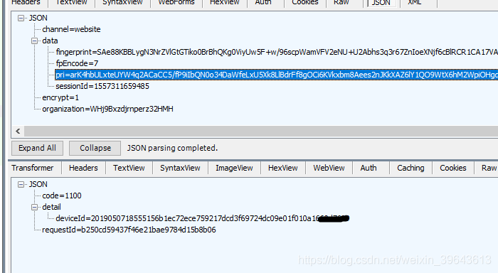

# 某移动端防作弊产品技术原理浅析与个人方案构想

src:https://www.cnblogs.com/2014asm/p/10884489.html


工具环境: android4.4.4、IDA Pro 7.0、jeb3、sklearn机器学习库


# 0x00：防作弊产品介绍

在移动互联网时代一个APP为了抢占市场，APP推广已经是必须的过程，然而真实用户的获客成本居高不下，在利益的驱动下引来羊毛党、刷量工作室对流量作弊造假利益链，如果只是做了简单根据IP和设备信息来防作弊，很难防住这些职业刷量人，假量造成了数据来源不真实，无法用于分析并支持App推广运营决策，最后也只能感叹“为什么用过很多防作弊产品，可依旧做不好防刷量”，最终会损害企业竞争力，给整个行业带来恶性发展。

有作弊就有反作弊，目前常见的识别作弊风险行为一般有各种硬件设备码、支付账号，ip地理位置等。市面上也有很多成熟的产品，今天我们主要分析学习其中一个防作弊产品。该产品官方介绍主要功能如下:

* 篡改设备识别
  主动式多维信息交叉对比、信息多采样点、对比数美海量设备库。

* 风险环境识别
  代理服务器检测、调试状态甄别、传感器状态评估、风险运行环境检测、高危风险软件检测。

* 行为风险识别
  异常移动速度检测、机身姿态稳定性检测、异常使用习惯检测、IP异常流量检测、设备聚集性检测。


# 0x01：SDK整体框架


该防作弊产品提供SDK形式给开发者调用，当开发者成功集成到APP后，APP启动时就会生成一个唯一的ID值。

SDK客户端整体流程如图1所示:


<center>图1</center>

服务器返回的ID会存放在系统中，这个ID值用通俗的话说，就是为每台设备注册一个身份证号，它代表了设备。这样一来，如果刷量者通过hook机制来修改imei、mac等设备模拟新用户就不起作用了。

# 0x02：技术细节分析

APP启动时会读取缓存判断是否有生成好的DeviceID，成功获取到DdeviceID就不走生成ID算法函数，如果系统没有缓存DeviceID那一般是第一次运行APP，接下来就会调用SO库中的z1函数生成一串随机的数当做第一次ID，关键代码如下：

```c
当前时间与获取的guid组合然后加密生成一串随机的数当做第一次ID
.text:7700CCAA EE F7 8C EF BLX             localtime_r             ; 获取当前时间
.text:7700CCAE             ; 56:       snprintf(
.text:7700CCAE             ; 57:         byte_2D134,
.text:7700CCAE             ; 58:         0x40u,
.text:7700CCAE             ; 59:         "%04d%02d%02d%02d%02d%02d",
.text:7700CCAE             ; 60:         (char *)&stru_764.st_size + tp.tm_year,
.text:7700CCAE             ; 61:         tp.tm_mon + 1,
.text:7700CCAE             ; 62:         tp.tm_mday,
.text:7700CCAE             ; 63:         tp.tm_hour,
.text:7700CCAE             ; 64:         tp.tm_min,
.text:7700CCAE             ; 65:         tp.tm_sec);
.text:7700CCAE F0 69       LDR             R0, [R6,#0x1C]
.text:7700CCB0 08 90       STR             R0, [SP,#0x180+var_160]
.text:7700CCB2 35 00       MOVS            R5, R6
.text:7700CCB4 20 35       ADDS            R5, #0x20 ; ' '
.text:7700CCB6 3E CD       LDMIA           R5, {R1-R5}
.text:7700CCB8 40 B4       PUSH            {R6}
.text:7700CCBA 01 BC       POP             {R0}
.text:7700CCBC 6E 46       MOV             R6, SP
.text:7700CCBE 01 34       ADDS            R4, #1
.text:7700CCC0 34 60       STR             R4, [R6,#0x180+var_180]
.text:7700CCC2 73 60       STR             R3, [R6,#0x180+var_17C]
.text:7700CCC4 B2 60       STR             R2, [R6,#0x180+var_178]
.text:7700CCC6 F1 60       STR             R1, [R6,#0x180+var_174]
.text:7700CCC8 08 99       LDR             R1, [SP,#0x180+var_160]
.text:7700CCCA 31 61       STR             R1, [R6,#0x180+var_170]
.text:7700CCCC             ; 55:       v5 = &v16;
.text:7700CCCC 01 B4       PUSH            {R0}
.text:7700CCCE 10 BC       POP             {R4}
.text:7700CCD0 E0 4E       LDR             R6, =(_GLOBAL_OFFSET_TABLE_ - 0x7700CCD6)
.text:7700CCD2 7E 44       ADD             R6, PC                  ; _GLOBAL_OFFSET_TABLE_
.text:7700CCD4 D0 48       LDR             R0, =(a04d02d02d02d02 - 0x77026E84)
.text:7700CCD6 82 19       ADDS            R2, R0, R6              ; format
.text:7700CCD8 D0 48       LDR             R0, =0x76C
.text:7700CCDA 2B 18       ADDS            R3, R5, R0
.text:7700CCDC 40 25       MOVS            R5, #0x40 ; '@'
.text:7700CCDE 0A 98       LDR             R0, [SP,#0x180+s]       ; s
.text:7700CCE0 20 B4       PUSH            {R5}
.text:7700CCE2 02 BC       POP             {R1}
.text:7700CCE4 EE F7 AE EE BLX             snprintf                ; 格式化当前时间
.text:7700CCE8             ; 66:       v18 = &v29;
.text:7700CCE8 4C A8       ADD             R0, SP, #0x180+var_50
.text:7700CCEA A0 60       STR             R0, [R4,#8]
.text:7700CCEC             ; 67:       _aeabi_memset(&v29);
.text:7700CCEC A0 68       LDR             R0, [R4,#8]
.text:7700CCEE A0 68       LDR             R0, [R4,#8]
.text:7700CCF0 20 B4       PUSH            {R5}
.text:7700CCF2 02 BC       POP             {R1}
.text:7700CCF4 0B 9A       LDR             R2, [SP,#0x180+var_154]
.text:7700CCF6 EE F7 40 EE BLX             __aeabi_memset
.text:7700CCFA             ; 68:       v25 = fopen("/proc/sys/kernel/random/uuid", "r");
.text:7700CCFA C9 48       LDR             R0, =(aProcSysKernelR - 0x77026E84)
.text:7700CCFC 80 19       ADDS            R0, R0, R6              ; filename
.text:7700CCFE C9 49       LDR             R1, =(aR - 0x77026E84)
.text:7700CD00 89 19       ADDS            R1, R1, R6              ; modes
.text:7700CD02 EE F7 64 EE BLX             fopen                   ; 读取/proc/sys/kernel/random/uuid获取guid
.text:7700CD06 E0 64       STR             R0, [R4,#0x4C]
.text:7700CD08             ; 69:       v6 = 1724308125;
.text:7700CD08 10 B4       PUSH            {R4}
.text:7700CD0A 20 BC       POP             {R5}
.text:7700CD0C C6 49       LDR             R1, =unk_66C6DA9D
.text:7700CD0E A9 E0       B               loc_7700CE64
.text:7700CD10
.text:7700CD10             loc_7700CD10
.text:7700CD10 AB 49       LDR             R1, =unk_763086D4
.text:7700CD12 88 42       CMP             R0, R1
.text:7700CD14 B6 D1       BNE             loc_7700CC84
.text:7700CD16             ; 39:         v21 = v14;
.text:7700CD16 0B 98       LDR             R0, [SP,#0x180+var_154]
.text:7700CD18 70 61       STR             R0, [R6,#0x14]
.text:7700CD1A             ; 40:         v4 = 939132170;
.text:7700CD1A B0 48       LDR             R0, =0x37FA050A
.text:7700CD1C             ; 41:         v7 = -1068245415;
.text:7700CD1C B2 49       LDR             R1, =0xC053DE59
.text:7700CD1E             ; 43:           goto LABEL_2;
.text:7700CD1E 72 69       LDR             R2, [R6,#0x14]
.text:7700CD20 10 2A       CMP             R2, #0x10               ; 判断是否结束
.text:7700CD22             ; 42:         if ( (signed int)v14 >= 16 )
.text:7700CD22 AF DB       BLT             loc_7700CC84
.text:7700CD24 AC E7       B               loc_7700CC80
.text:7700CD26
.text:7700CD26             loc_7700CD26
.text:7700CD26 A8 49       LDR             R1, =0xC053DE58
.text:7700CD28 88 42       CMP             R0, R1
.text:7700CD2A             ; 133:       break;
.text:7700CD2A 03 DC       BGT             loc_7700CD34
.text:7700CD2C             ; 202:   if ( v4 != -1729051653 )
.text:7700CD2C AF 49       LDR             R1, =0x98F0C3FB
.text:7700CD2E 88 42       CMP             R0, R1
.text:7700CD30             ; 203:     goto LABEL_3;
.text:7700CD30 A8 D1       BNE             loc_7700CC84
.text:7700CD32 22 E1       B               loc_7700CF7A
.text:7700CD34
.text:7700CD34             loc_7700CD34
.text:7700CD34 A5 49       LDR             R1, =0xD19A0AD9
.text:7700CD36 88 42       CMP             R0, R1
.text:7700CD38 60 DC       BGT             loc_7700CDFC
.text:7700CD3A             ; 184:     else if ( v4 == -1068245415 )
.text:7700CD3A AB 49       LDR             R1, =0xC053DE59
.text:7700CD3C 88 42       CMP             R0, R1
.text:7700CD3E A1 D1       BNE             loc_7700CC84
.text:7700CD40             ; 186:       snprintf((char *)&unk_2D162, 3u, "00", a4);
.text:7700CD40 C5 4D       LDR             R5, =(_GLOBAL_OFFSET_TABLE_ - 0x7700CD46)
.text:7700CD42 7D 44       ADD             R5, PC                  ; _GLOBAL_OFFSET_TABLE_
.text:7700CD44 AE 48       LDR             R0, =(a00 - 0x77026E84)
.text:7700CD46 42 19       ADDS            R2, R0, R5              ; format
.text:7700CD48 0A 98       LDR             R0, [SP,#0x180+s]
.text:7700CD4A 2E 30       ADDS            R0, #0x2E ; '.'         ; s
.text:7700CD4C 03 21       MOVS            R1, #3                  ; maxlen
.text:7700CD4E 08 91       STR             R1, [SP,#0x180+var_160]
.text:7700CD50 EE F7 78 EE BLX             snprintf
.text:7700CD54             ; 187:       sub_D6C0(v27);
.text:7700CD54 22 AC       ADD             R4, SP, #0x180+var_F8
.text:7700CD56 10 B4       PUSH            {R4}
.text:7700CD58 01 BC       POP             {R0}
.text:7700CD5A FA F7 B1 FC BL              md5init
.text:7700CD5E             ; 188:       sub_D6E8(v27, (unsigned int)"shumei", 6u);
.text:7700CD5E A9 48       LDR             R0, =(aShumei - 0x77026E84)
.text:7700CD60 41 19       ADDS            R1, R0, R5
.text:7700CD62 06 22       MOVS            R2, #6
.text:7700CD64 10 B4       PUSH            {R4}
.text:7700CD66 01 BC       POP             {R0}
.text:7700CD68 FA F7 BE FC BL              sub_770076E8
.text:7700CD6C             ; 189:       sub_D6E8(v27, (unsigned int)"_", 1u);
.text:7700CD6C A6 48       LDR             R0, =(asc_770229B2 - 0x77026E84) ; 与固定字符串组合加密
```

成功获取或生成DeviceID后调用Native函数z3判断该ID的类型，如果是上面函数新生成的为0，如果是服务器下发的为1。关键代码如下:

```c
//解密ID并判断是否为新的ID或是最终生成的ID
.text:7702D0F2 01 BC       POP             {R0}
.text:7702D0F4 FA F7 E4 FA BL              md5init                 ; 组合key解密
.text:7702D0F8 96 4C       LDR             R4, =(_GLOBAL_OFFSET_TABLE_ - 0x7702D0FE)
.text:7702D0FA 7C 44       ADD             R4, PC                  ; _GLOBAL_OFFSET_TABLE_
.text:7702D0FC 8F 48       LDR             R0, =(aShumei - 0x77046E84)
.text:7702D0FE 01 19       ADDS            R1, R0, R4
.text:7702D100 06 22       MOVS            R2, #6
.text:7702D102 40 B4       PUSH            {R6}
.text:7702D104 01 BC       POP             {R0}
.text:7702D106 FA F7 EF FA BL              sub_770276E8
.text:7702D10A 8D 48       LDR             R0, =(asc_770429B2 - 0x77046E84)
.text:7702D10C 01 19       ADDS            R1, R0, R4
.text:7702D10E 07 91       STR             R1, [SP,#0x108+var_EC]
.text:7702D110 01 22       MOVS            R2, #1
.text:7702D112 05 92       STR             R2, [SP,#0x108+var_F4]
.text:7702D114 40 B4       PUSH            {R6}
.text:7702D116 01 BC       POP             {R0}
.text:7702D118 02 B4       PUSH            {R1}
.text:7702D11A 20 BC       POP             {R5}
.text:7702D11C FA F7 E4 FA BL              sub_770276E8
.text:7702D120 88 48       LDR             R0, =(aAndroid - 0x77046E84)
.text:7702D122 01 19       ADDS            R1, R0, R4
.text:7702D124 07 22       MOVS            R2, #7
.text:7702D126 40 B4       PUSH            {R6}
.text:7702D128 01 BC       POP             {R0}
.text:7702D12A FA F7 DD FA BL              sub_770276E8
.text:7702D12E 40 B4       PUSH            {R6}
.text:7702D130 01 BC       POP             {R0}
.text:7702D132 20 B4       PUSH            {R5}
.text:7702D134 02 BC       POP             {R1}
.text:7702D136 05 9D       LDR             R5, [SP,#0x108+var_F4]
.text:7702D138 20 B4       PUSH            {R5}
.text:7702D13A 04 BC       POP             {R2}
.text:7702D13C FA F7 D4 FA BL              sub_770276E8
.text:7702D140 81 48       LDR             R0, =(aSec - 0x77046E84)
.text:7702D142 01 19       ADDS            R1, R0, R4
.text:7702D144 03 22       MOVS            R2, #3
.text:7702D146 04 92       STR             R2, [SP,#0x108+var_F8]
.text:7702D148 40 B4       PUSH            {R6}
.text:7702D14A 01 BC       POP             {R0}
.text:7702D14C FA F7 CC FA BL              sub_770276E8
.text:7702D150 40 B4       PUSH            {R6}
.text:7702D152 01 BC       POP             {R0}
.text:7702D154 07 99       LDR             R1, [SP,#0x108+var_EC]
.text:7702D156 20 B4       PUSH            {R5}
.text:7702D158 04 BC       POP             {R2}
.text:7702D15A FA F7 C5 FA BL              sub_770276E8
.text:7702D15E 7B 48       LDR             R0, =(aKey - 0x77046E84)
.text:7702D160 01 19       ADDS            R1, R0, R4
.text:7702D162 40 B4       PUSH            {R6}
.text:7702D164 01 BC       POP             {R0}
.text:7702D166 04 9A       LDR             R2, [SP,#0x108+var_F8]
.text:7702D168 03 9C       LDR             R4, [SP,#0x108+var_FC]
.text:7702D16A FA F7 BD FA BL              sub_770276E8
.text:7702D16E 40 B4       PUSH            {R6}
.text:7702D170 01 BC       POP             {R0}
.text:7702D172 07 99       LDR             R1, [SP,#0x108+var_EC]
.text:7702D174 20 B4       PUSH            {R5}
.text:7702D176 04 BC       POP             {R2}
.text:7702D178 FA F7 B6 FA BL              sub_770276E8
.text:7702D17C 21 68       LDR             R1, [R4]
.text:7702D17E 30 22       MOVS            R2, #0x30 ; '0'
.text:7702D180 40 B4       PUSH            {R6}
.text:7702D182 01 BC       POP             {R0}
.text:7702D184 FA F7 B0 FA BL              sub_770276E8
.text:7702D188 3A A8       ADD             R0, SP, #0x108+var_20
.text:7702D18A 40 B4       PUSH            {R6}
.text:7702D18C 02 BC       POP             {R1}
.text:7702D18E 06 9E       LDR             R6, [SP,#0x108+var_F0]
.text:7702D190 FC F7 F8 FA BL              sub_77029784
.text:7702D194 00 25       MOVS            R5, #0
.text:7702D196 61 49       LDR             R1, =0xF9DE6D01
.text:7702D198 83 E7       B               loc_7702D0A2
.text:7702D19A
.text:7702D19A             loc_7702D19A
.text:7702D19A 53 48       LDR             R0, =0xED276E4F
.text:7702D19C 81 42       CMP             R1, R0
.text:7702D19E 06 DC       BGT             loc_7702D1AE
.text:7702D1A0 61 48       LDR             R0, =0xCAA9363F
.text:7702D1A2 81 42       CMP             R1, R0
.text:7702D1A4 00 D0       BEQ             loc_7702D1A8
.text:7702D1A6 7C E7       B               loc_7702D0A2
.text:7702D1A8
.text:7702D1A8             loc_7702D1A8
.text:7702D1A8 58 49       LDR             R1, =0x25101393
.text:7702D1AA 02 9E       LDR             R6, [SP,#0x108+var_100]
.text:7702D1AC 79 E7       B               loc_7702D0A2
.text:7702D1AE
.text:7702D1AE             loc_7702D1AE
.text:7702D1AE 4F 48       LDR             R0, =0x2AFA5232
.text:7702D1B0 81 42       CMP             R1, R0
.text:7702D1B2 06 DC       BGT             loc_7702D1C2
.text:7702D1B4 4F 48       LDR             R0, =0xEE351ED3
.text:7702D1B6 81 42       CMP             R1, R0
.text:7702D1B8 1A DC       BGT             loc_7702D1F0
.text:7702D1BA 5A 48       LDR             R0, =0xED276E50
.text:7702D1BC 81 42       CMP             R1, R0
.text:7702D1BE 73 D0       BEQ             loc_7702D2A8
.text:7702D1C0 6F E7       B               loc_7702D0A2
.text:7702D1C2
.text:7702D1C2             loc_7702D1C2
.text:7702D1C2 4B 48       LDR             R0, =0x2AFA5233
.text:7702D1C4 81 42       CMP             R1, R0
.text:7702D1C6 00 D0       BEQ             loc_7702D1CA
.text:7702D1C8 6B E7       B               loc_7702D0A2
.text:7702D1CA
.text:7702D1CA             loc_7702D1CA
.text:7702D1CA 61 48       LDR             R0, =(_GLOBAL_OFFSET_TABLE_ - 0x7702D1D0)
.text:7702D1CC 78 44       ADD             R0, PC                  ; _GLOBAL_OFFSET_TABLE_
.text:7702D1CE 5A 49       LDR             R1, =(a02x - 0x77046E84)
.text:7702D1D0 0A 18       ADDS            R2, R1, R0              ; format
.text:7702D1D2 60 69       LDR             R0, [R4,#0x14]
.text:7702D1D4 40 00       LSLS            R0, R0, #1
.text:7702D1D6 E1 68       LDR             R1, [R4,#0xC]
.text:7702D1D8 08 18       ADDS            R0, R1, R0              ; s
.text:7702D1DA 3A A9       ADD             R1, SP, #0x108+var_20
.text:7702D1DC 63 69       LDR             R3, [R4,#0x14]
.text:7702D1DE C9 18       ADDS            R1, R1, R3
.text:7702D1E0 0B 78       LDRB            R3, [R1]
.text:7702D1E2 03 21       MOVS            R1, #3                  ; maxlen
.text:7702D1E4 EE F7 2E EC BLX             snprintf
.text:7702D1E8 60 69       LDR             R0, [R4,#0x14]
.text:7702D1EA 45 1C       ADDS            R5, R0, #1
.text:7702D1EC 4B 49       LDR             R1, =0xF9DE6D01
.text:7702D1EE 58 E7       B               loc_7702D0A2
.text:7702D1F0
.text:7702D1F0             loc_7702D1F0
.text:7702D1F0 41 48       LDR             R0, =0xF9DE6D00
.text:7702D1F2 81 42       CMP             R1, R0
.text:7702D1F4 10 DC       BGT             loc_7702D218
.text:7702D1F6 4A 48       LDR             R0, =0xEE351ED4
.text:7702D1F8 81 42       CMP             R1, R0
.text:7702D1FA 00 D0       BEQ             loc_7702D1FE
.text:7702D1FC 51 E7       B               loc_7702D0A2
.text:7702D1FE
.text:7702D1FE             loc_7702D1FE
.text:7702D1FE 21 68       LDR             R1, [R4]
.text:7702D200 E0 68       LDR             R0, [R4,#0xC]           ; s1
.text:7702D202 30 31       ADDS            R1, #0x30 ; '0'         ; s2
.text:7702D204 EE F7 F4 EB BLX             strcmp                  ; 比较是否相同,相同为0，不同为1
```

SDK本身的防护手段主是要为java层代码混淆与字符串加密，Native层(汇编)也是代码混淆与字符串加密。对应的解密函数如下:

Java层字符串解密代码:

```java
publicstaticbyte[] a(byte[] arg3) {
byte[] v1 = newbyte[arg3.length];
int v0;
for(v0 = 0; v0 < arg3.length; ++v0) {
            v1[v0] = ((byte)(arg3[v0] ^ -1));
        }

return v1;
    }

publicstaticbyte[] f(String arg7) {
byte[] v1 = arg7.getBytes();
int v2 = v1.length;
byte[] v3 = newbyte[v2 / 2];
int v0;
for(v0 = 0; v0 < v2; v0 += 2) {
            v3[v0 / 2] = ((byte)Integer.parseInt(new String(v1, v0, 2), 16));
        }

return v3;
    }
```

Native层字符串解密函数关键代码:

```c
//Native层字符串解密函数
.text:76F1E1D0 08 18                       ADDS            R0, R1, R0
.text:76F1E1D2 05 90                       STR             R0, [SP,#0x188+var_174]
.text:76F1E1D4 AB 69                       LDR             R3, [R5,#0x18]
.text:76F1E1D6 E9 69                       LDR             R1, [R5,#0x1C]
.text:76F1E1D8 2A 6A                       LDR             R2, [R5,#0x20]
.text:76F1E1DA 68 46                       MOV             R0, SP
.text:76F1E1DC 04 60                       STR             R4, [R0,#0x188+var_188]
.text:76F1E1DE 05 9C                       LDR             R4, [SP,#0x188+var_174]
.text:76F1E1E0 44 60                       STR             R4, [R0,#0x188+var_184]
.text:76F1E1E2 08 B4                       PUSH            {R3}
.text:76F1E1E4 01 BC                       POP             {R0}
.text:76F1E1E6 06 9B                       LDR             R3, [SP,#0x188+var_170]
.text:76F1E1E8 0D F0 CA FF                 BL              AesENC1 //解密
.text:76F1E1EC A8 69                       LDR             R0, [R5,#0x18] ; ptr
.text:76F1E1EE FF F7 CA EB                 BLX             free
.text:76F1E1F2 4E 48                       LDR             R0, =0x8F87E3E5
.text:76F1E1F4 2C 6A                       LDR             R4, [R5,#0x20]
.text:76F1E1F6 84 E7                       B               loc_76F1E102
```

当ID生成完后就开始请求服务器获取风险APP与文件名单，其中organization代表不同公司，如图2所示:


<center>图2</center>

服务器返回的data数据是被加密的，解密函数分为两层，第一层在java层解密，第二层在Native层解密代码如下:

JAVA层解密代码为DES,代码如下：

```c
publicstaticbyte[] b(String arg4, byte[] arg5, int arg6) throws IOException {
try {
            Cipher v0_1 = Cipher.getInstance("DES/ECB/NoPadding");
            v0_1.init(2, new SecretKeySpec(arg4.getBytes("utf-8"), "DES"));
byte[] v0_2 = v0_1.doFinal(arg5);
byte[] v1 = newbyte[arg6];
            System.arraycopy(v0_2, 0, v1, 0, arg6);
return v1;
        }
catch(Exception v0) {
thrownew IOException(((Throwable)v0));
        }
    }
```

Java层解密后数据形式如下：

```java
{
    "all_atamper":true,
    "core_atamper":true,
    "risk_apps":[//风险app
        {
            "xposed":{
                "pn":"de.robv.android.xposed.installer",
                "uri":""
            }
        },
        {
            "controllers":{
                "pn":"com.soft.controllers",
                "uri":""
            }
        },
        {
            "apk008v":{
                "pn":"com.soft.apk008v",
                "uri":""
            }
        },
        {
            "apk008Tool":{
                "pn":"com.soft.apk008Tool",
                "uri":""
            }
        },
        {
            "ig":{
                "pn":"com.doubee.ig",
                "uri":""
            }
        },
        {
            "anjian":{
                "pn":"com.cyjh.mobileanjian",
                "uri":""
            }
        },
        {
            "rktech":{
                "pn":"com.ruokuai.rktech",
                "uri":""
            }
        },
        {
            "magisk":{
                "pn":"com.topjohnwu.magisk",
                "uri":""
            }
        },
        {
            "kinguser":{
                "pn":"com.kingroot.kinguser",
                "uri":""
            }
        },
        {
            "substrate":{
                "pn":"com.saurik.substrate",
                "uri":""
            }
        },
        {
            "touchsprite":{
                "pn":"com.touchsprite.android",
                "uri":""
            }
        },
        {
            "scriptdroid":{
                "pn":"com.stardust.scriptdroid",
                "uri":""
            }
        },
        {
            "toolhero":{
                "pn":"com.mobileuncle.toolhero",
                "uri":""
            }
        },
        {
            "huluxia":{
                "pn":"com.huluxia.gametools",
                "uri":""
            }
        },
        {
            "apkeditor":{
                "pn":"com.gmail.heagoo.apkeditor.pro",
                "uri":""
            }
        },
        {
            "xposeddev":{
                "pn":"com.sollyu.xposed.hook.model.dev",
                "uri":""
            }
        },
        {
            "anywhere":{
                "pn":"com.txy.anywhere",
                "uri":""
            }
        },
        {
            "burgerzwsm":{
                "pn":"pro.burgerz.wsm.manager",
                "uri":""
            }
        },
        {
            "vdloc":{
                "pn":"com.virtualdroid.loc",
                "uri":""
            }
        },
        {
            "vdtxl":{
                "pn":"com.virtualdroid.txl",
                "uri":""
            }
        },
        {
            "vdwzs":{
                "pn":"com.virtualdroid.wzs",
                "uri":""
            }
        },
        {
            "vdkit":{
                "pn":"com.virtualdroid.kit",
                "uri":""
            }
        },
        {
            "vdwxg":{
                "pn":"com.virtualdroid.wxg",
                "uri":""
            }
        },
        {
            "vdgps":{
                "pn":"com.virtualdroid.gps",
                "uri":""
            }
        },
        {
            "a1024mloc":{
                "pn":"top.a1024bytes.mockloc.ca.pro",
                "uri":""
            }
        },
        {
            "drhgz":{
                "pn":"com.deruhai.guangzi.noroot2",
                "uri":""
            }
        },
        {
            "yggb":{
                "pn":"com.mcmonjmb.yggb",
                "uri":""
            }
        },
        {
            "xsrv":{
                "pn":"xiake.xserver",
                "uri":""
            }
        },
        {
            "fakeloc":{
                "pn":"com.dracrays.fakeloc",
                "uri":""
            }
        },
        {
            "ultra":{
                "pn":"net.anylocation.ultra",
                "uri":""
            }
        },
        {
            "locationcheater":{
                "pn":"com.wifi99.android.locationcheater",
                "uri":""
            }
        },
        {
            "dwzs":{
                "pn":"com.dingweizshou",
                "uri":""
            }
        },
        {
            "mockloc":{
                "pn":"top.a1024bytes.mockloc.ca.pro",
                "uri":""
            }
        },
        {
            "anywhereclone":{
                "pn":"com.txy.anywhere.clone",
                "uri":""
            }
        },
        {
            "fakelocc":{
                "pn":"com.dracrays.fakelocc",
                "uri":""
            }
        },
        {
            "mockwxlocation":{
                "pn":"com.tandy.android.mockwxlocation",
                "uri":""
            }
        },
        {
            "anylocation":{
                "pn":"net.anylocation",
                "uri":""
            }
        },
        {
            "totalcontrol":{
                "pn":"com.sigma_rt.totalcontrol",
                "uri":""
            }
        },
        {
            "ipjl2":{
                "pn":"com.chuangdian.ipjl2",
                "uri":""
            }
        }
    ],
    "risk_dirs":[
        {
            "008Mode":{
                "dir":".system/008Mode",
                "type":"sdcard"
            }
        },
        {
            "008OK":{
                "dir":".system/008OK",
                "type":"sdcard"
            }
        },
        {
            "008system":{
                "dir":".system/008system",
                "type":"sdcard"
            }
        },
        {
            "iGrimace":{
                "dir":"iGrimace",
                "type":"sdcard"
            }
        },
        {
            "touchelper":{
                "dir":"/data/data/net.aisence.Touchelper",
                "type":"absolute"
            }
        },
        {
            "elfscript":{
                "dir":"/mnt/sdcard/touchelf/scripts/",
                "type":"absolute"
            }
        },
        {
            "spritelua":{
                "dir":"/mnt/sdcard/TouchSprite/lua",
                "type":"absolute"
            }
        },
        {
            "spritelog":{
                "dir":"/mnt/sdcard/TouchSprite/log",
                "type":"absolute"
            }
        },
        {
            "assistant":{
                "dir":"/data/data/com.xxAssistant",
                "type":"absolute"
            }
        },
        {
            "assistantscript":{
                "dir":"/mnt/sdcard/com.xxAssistant/script",
                "type":"absolute"
            }
        },
        {
            "mobileanjian":{
                "dir":"/data/data/com.cyjh.mobileanjian",
                "type":"absolute"
            }
        }
    ],
    "risk_file_switch":true,  "risk_files":"UUNTKuZ2FkqjAACv32cnhokTpMQKyKsPcAdizg0dWcnjz2VsaZWaXVutOsepqx0tF4UzvwTYMEs/MidvfKDHFeEXd9cFXU9Nn6LfHRWAd/vTQHaR0Wpl6+zPW6GoF+3F/sEt+ISOU9r+AjFqqK6OtJDgJJdaT3yWrE945sev3b/zuYKXhv0LTQnLuRnUDvR4+DSfgYsRElEMVXFyaFU9I7Od20pxyB1p2qN+U6bD0LNEFiU4ZzqvDrCj48XoErqUOkYIz5ZsOf95ak9PQpaEoVFNJBd841tkQlREvc84u4Ck0i74Sq8kVXnhOQAYNQgmtBLFNImXb5e/LLg+/F94z2tixp/m265In2CS9966dgiNkSSYB7DzY4x56oqYbDVr3VRJD/r4eyNzxxU/XuYk5+l27n1UJoD8lZVJ1WFkAIye0zDk/BDwx0wagiTQh492MWnps/kmSXQAKXzJKJqF8xIT5acT9amMnIQVcChxtj6roeZlFFLH74+3rjbK5+2t39xvh1IeoUhdNhaEHTkDfZHeU62pMANSRLVmwb9rUQPQ6Rs2ShYnTc+DiKNwu/8hNCBpWulhv82Bqb45oMXbpu+fcISm/SNbBi3s+8BSEqK/iNKTCd+T+dCYwnNjMYc8IM+hmSnZLnZ4ZOhdnF7kPd+iobTpieOflMiO6/wcp8CHYsTWkKrCBRfxNsP+K196jAZ8c4MzmV04G5wH5fHZ9zTBVVpq3StLtqwYXeDFEMcv4id8TXgjrvi9XRHEG/0lHtkAkxp8yoM53GnfeUK8yx2oyzhIZ5NHBwgSw1t0NGcHFkawcRPp0Wu2GG9W0aGaFAG48+Ue7lR40shdnOgSxfwJ79o6Wtqwij2LzQPx2ETYn5Xb0sTzURn0IBxh1G9xs+QfpGdIJHQ1WZUmOe3hH17DUn9jFsxm0x5YS2K8rjO4O+xgW0CdALd6uQk7s9vSQr5fVlo24XKcBUM68Z97M8O9KKNDtiJFU/1/7EoA74LEEyVPjdRFCPx5el/qlQhEEZJJ65trohfor3mPrTkO0vYyhVyEUfu8d4sMFFThVZnovqbnGCfWvrdiVV1MZLy1iCbKnG0FXI166/wSF8/oIBuYF0Q5usOZi45LpXx+gLjeOAtxR/VHOfXfs1wUFvgrmO0q2mOhtIzsZhrPtjNjk2sNp9oM7r2FV0lJXD5pfXtwwlNS4W3FyzgY/rzAA+kBvvYlsQXLfWdhJVqd6/ArAf8FyYvw7mYMYifhOjNPJLGAfbsij2YAYPXk0m648SPkhBNLxWq5e6Ww/g2yCwRSzB07xrxuKq7wptjyjwU1lbk47qiR+XesuiG3p4/IvtLtLjuXzNFkMNfFs1SrAuAYUc0nmu7th0oWRfz+pMUtsLDAQ3shioIaNmy7S9wmqtozKfaHVCUMN+IvSWkrQaCtzRaQB73o0SMkgn5P3RpUfJiHjcWV5egBkHQoh3LX4pHivf1Bf5zJRH/evLXHYf8egmgxKAH4K6SnOFLGbhJyNdJfSS1qyOcvd8aHuai9Bgu16ZD7/yVvyqDbX6KPL90umNj8T6/dkM/4Puly5UbVA+7WdtAMoqEaZzhHXTg70XQQLIsoOH1vyhTlV5jBEtYI/5AOoglt43fHCom869gcLi4avImDYYdPwRLmdXcNBHI/yD0SwGI7gVxWOHCvzd3cYZ2fqkfquzm3OTk+W/YUTfh3q/pnffmuZossqROtjo5rUvyAQh86Y5sQdOUKzS6mWxnA3bJjkWc1su6EjHPjEjhwWPQI97XCqq+AM9zwe2536Vw7CqwdDvTjYaaoMf3wtM8wthIUyyIjN8OblN37H9G+Q/IbIViufH3D5MJWtEfUMEUMMsXNCj+HWP72tlFXwWVDFc2m+uvSXJmzgSGERdUi2LxRq1YA6PZKsBkVI6M+IWmYepBLMdP/JlMlqJBtqtqkt2JpF+CrW/6Pe+DnB71qltw3s8Bj4kNuPrehHk62zPFbK5qbgM9uwsui+fiqwd/gnAlXfbMVLB+pm7BPNt66TZ4UXWzB9s+3xzjZ5NW7bZjn1b8H6d44ibW3hL47jxW+jx5cvOxi2EeLIc+dp/gIowoSUTWymSYHZgTXcoJWA5/xpmR7BKsKnjlTcVnqDnjT3F4YUa28LYtYYRKfFK7BmwZmmR+NwRr4u7mGA0sqGRZM2XwYj2ir/Pk4agps9a6KZyw0zTC8LLibx9WlSbaZcD7vzyyD4JYSYo85O86rVZTe03kKzlE0xZ+8j2MaPNPDRtlJiXzVggf0LzIGahdI2ez6/ZL6Ftab5Gm2f9CRcK0MCKeZeaABeolfGqA7g3sJGQ8KI8ndcR6qALUtmZrvpW6bL8wO9HINg8iQspn3bTRZoGpMfPiFPFAzdfxh9HCgiQD0vsN/T76swvNrd2iAAoAwtGFMLN6T7t29NyFLxaUJh5+etpKi7CKSc+jiiYBUR3SF+PrzhcnUk+HQRLCQJAUfGAUKdnw9KXlkcBYCWB1qUMissDvSI4sfARgMe607LyQlknImNPHAs3ZTnOFN5DzHZxvO8NrvXvHqp8sfzOzUbwc9+5jQPsz4n1nOAQzWUWWITxBGtUaf4i++PDGi6hF8NprhRBmUB+tjlp1xPrzTZD/DQfKtvMSpldgAOBqHHODh0tHR/pp4+Y4Lh+nGDqn/+nnCNseLx2nfmx8P+7Y7ztHLFzHUtyvb+P8ryTxgzgaX8HeMKEmBImwn9otDLNpiUtCAr3Wxc5HT13STAFOFqX615nTV59ob+ohQnrRUsDO+60hRI2G56NMhZo5KqPwl+myIlVYVkLMtlOCMIQa4K6+UVuEwTPVElRngQ7nHMXd3LcP4Au0sR+WgnZ240yQ5aBQw1UrP+rS9YddCRXKfVFK+SEW+9o3U1bmM+DjRZ29Gu6kYtEwK32lH+FpE5Z6Amu61jFRcceDkb1mGkg1aDSnGaoETOnOkH9P6LoTQUjJGwdSKZIXkRTAYOCRWs90OPiuO3BFiU1j/YBvwjEXEe6TYvsTCda6E2YTIgMmxVWwDQZDI3TU05oMI1wYkpvndwESiEnB/9zty7u7QkMt+Lrd0RvnuXqc2ABKdxuHa7f2V9Ur/8LaFYeyhTl1d8dxFlkmI4ZLxTfnIq82kj7XcGWB5LcirzBif38gk/Ux30msrWuzeiy6xudpcysEGAsziedq8g6Xw0ReGGwNWCpP+GlJofqs0wrBa0jIxNXgmOePNIDBluscB8ow2HgfZVDvmJg+1nV2DBxCxfQITR4QOMER94D3lr6l0PjCm6fHsSK78CA6sZRur9F4gM1ccnHb1COjqJBR+WZjRyMOdrp+4baYgoEMbUnFp29c/deaZE0rbnvcGvOv1EUmmgfIJmS6Jn4TiUiAZTAKUgTWnA4S8qJ5Evgr1QGLdMnIjbGsSlC4+3QmorfDN6l/CuTKCXUIZAWEvxuHnvf0JAPfan81hxWWpii7fyJFdLMx9qW9Cd+60nt/ZtHQZDt9DjD0hmkLZZWn/J+rqvUDXHQDD4WLSGPHMr/oDLBOKYO9skwfXGcGGHR0994xT7tKIbLqaD5tdx1OjTxpOC+87xEARs/uOsGbZ0ZSRc2JEgRu6N9x4WJ14iMyhlANKSYZwuRTZQAeNB6CoqpuFRyp8DYkTc+Xj9WS82grr5Ig/6jO4Hz29n0DSjo+OPB9zhPBXE0QG/psFTbTfPA3j7ZDO3cxo3rM0BN/ZgCGKgTHzkuQ7MU+KvbMbWqrS64lwACO+6lPIdRs0yBqQUQeOjAPKlXeAugXgx+dim/HsV832EiOU6Hr0qJuLGGLXCdU1imG8PyJqEtoO+c4oHl3GLSdW8YN/m/G61Z2XRkWA/sEmTokHzK92np2DxJ18woRfS72qj27OTEuxMjltSdc15Kj79/NlsHtDtc4U+acq5TKshH+RSae9B2KvfxyKyejeczzyTTW7NRapJlK5bmwkxOSrnPJtlj5vDUivoC3+CtO0PsVIpsgSZmqDogHEXhcomQLNor2JzWCuM9+nK4cDyGlkIrBPFgWueptEDhh9jUkBRsew+uVy/NbCqqkQ4Q55yONS9fUOOaxXsAPSUq/MBzK1U3nlGNFd/fqH0d6JZ2ndw/KUOQ==",
    "sensitive.ainfo":true,
    "sensitive.apps":true,
    "sensitive.aps":true,
    "sensitive.bssid":true,
    "sensitive.camera":true,
    "sensitive.cell":true,
    "sensitive.gps":false,
    "sensitive.iccid":true,
    "sensitive.imsi":true,
    "sensitive.mac":true,
    "sensitive.ssid":true,
    "sensitive.tel":false,
    "white_apps":[

    ]
}
```

第二层risk_files在Native中解密，解密函数主要为AES与base64解密，AES的key为一个固定字符串的MD5值，解密后的值为风险名单文件，解密函数如图3所示：


<center>图3</center>

根据上面风险名单文件读取系统环境值，本地按照名单比较。黑名单包括一些常见的改机与分身软件，只要装风险app会被标记为高危设备。再将读取的风险文件值进行组合加密，加密后的值为第二次网络请求体中一个参数(ainfo)发送给服务器。组合后参数如图4所示：


<center>图4</center>

前面系统环境信息值获取组合加密后开始第二次网络请求。

组合好的请求体完整格式如下 ：

```c
{
    "cpuCount":4,
    "iccid":"",
    "apputm":"website",
    "xxid":"2019050718555156b1ec72ece759217dcd3f69724dc09e01f010a xxxxxxxx",
    "camcnt":2,
    "sensor":[
        "1,InvenSense",
        "2,AKM",
        "14,AKM",
        "4,InvenSense",
        "16,InvenSense",
        "8,Avago",
        "5,Avago",
        "6,BOSCH",
        "9,Qualcomm",
        "10,Qualcomm",
        "11,Qualcomm",
        "18,Qualcomm",
        "19,Qualcomm",
        "17,Qualcomm",
        "15,Qualcomm",
        "20,Qualcomm",
        "3,Qualcomm",
        "15,InvenSense"
    ],
    "band":"M8974A-2.0.50.1.16",
    "target_sdk":21,
    "ssid":""XXXX"",
    "campx":[
        7990272,
        1228800
    ],
    "os":"android",
    "screen":"1080,1776,480",
    "imei":"359250050800xxx",
    "cell":{
        "type":"gsm",
        "cid":"3904745",
        "lac":"40980"
    },
    "privacy":"none",
    "imei2":"",
    "imei1":"",
    "cpuModel":"ARMv7 Processor rev 0 (v7l)",
    "wifiip":"192.168.2.220",
    "bssid":"c4:b8:b4:23:xx:xx",
    "whiteapp":{

    },
    "signhash":-1850634906,
    "apps":[
        "1402643182000,com.android.providers.calendar,日历存储,0,19,4.4.4-1227136",
        "1402643182000,com.android.sharedstoragebackup,com.android.sharedstoragebackup,0,19,4.4.4-1227136",
        "1402643182000,com.android.vpndialogs,VpnDialogs,0,19,4.4.4-1227136",
        "1402643182000,com.android.providers.media,媒体存储,0,700,4.4.4-1227136",
        "1402643182000,com.google.android.marvin.talkback,TalkBack,0,107,3.5.1"
    ],
    "btmac":"ccfa0054e68d",
    "imsi":"",
    "ainfo":"miCRGdrPe7HbqMSmULEi5/jd+XKvI5+7hBVMspk3wafLMcyYm2L85fxtW0ovFB8IFdFGL1L7O4gVrqDh4APFLL25NJekXuaRGor8SRTa+ITZ+ORzFFWdtjSd4GztA6yBB0F2gj7lpnnqHaYBXzxCQ8HKyOjZuy2V+bFdO48McoecE/qVECGWdKWKp640nmLmu7V9V0tnt+ybRziWEW0EoW5P3FWkqIJfLoC9PALLe4XwxbAS70ogAtItvGh+/TFmbG4YVwC7LHOCwggZJ1CtoMo21wb8I2P6DhiLWV16cDyoKwhaB+d5FD20L8QkAQZY8rDmxqjJm7RLU/3j/ODRbFR639D/YCpVIq1NgsU4Ixts/8IJQYmCuSgKChxolzvmPBqxlpSj4LuByrkeK+KL8JHEGc6j5zVczS/1XE/okjSgY9/XwNPYI3cdd4cLVVyOUBAMtFOmEEloGr33ZhTPD7wO+Zr9N63s+lHLrDcEpEufwXtL8aBzsBTPpAYvDs6au/+MpctAxF1xREgPgJfGzErrO9KjFFhM7fXAnTp5DVax+tlisK3tHhbQi9K//lEEbT9Vi/UVawiME3c2yO7KT9MdaCPhKsDX8Zbu9nHuQTAH4/4o9EkTAaiKqH89htkPRln5QfDR6abrN1scMC09OBpyyrwJxcHenAZlvX/pGiixwJMoawLwsuBYUq+l7VtADWJ/hSqzWyVYh1/VIAI5UFKi7ztK02td/WCW2hFrZpUVtXIsdmTStK49r9+0MZg84sFQHgcPonu1gfL5aM8GBHgohpa/04MZTpaqNFkaol5PY06ZdR/rNlUjjVsHD+zyZYRVyABCAkT11/Z1+EJ5eib/m6xm+MjZapt/KiQ2xNkMmICWHcH+IpkJPFl6imGYUQh9p/wNO3X7NhP1HtbE3DfjuN5iCk/VyKTZtUEvldrf57C2yJgF/r6zQwUIBvYqszUiRoyqYSUcvBRSbrGYk/qFcgo/SCROQ0oJAmQRZI2XN8TVJz5WIfbQ8YShtkJxCWdw1bLSDonCXgkHqvbTnmanMY5Tnc0DF2jd8c2mHSVE4diN+FN9VqiMntcT6UjSzz6k11vkbj51DlnTcA/zsutALPLEIOdJDSDJjCDSWilLJ8kgVdT248zRg3WOR2nqZ/uHhPLo1p8eca7LlxtpP8Gi0OlITJjVLIW9D+zCOReo5rEBOdjFPJGbM4winiCXBQqp1MVE3skGu91pHKlDQl60enJ+CrAJwwXvj09cbuP81cj8iilQCR+S89TIKW6Ia5Cbzw3IvfOP26/BNO+PeVd/uIO8L+SEUjZmBufYOJQYsEhcVsmMTnsDW1WqBws166NnIN+pkk7ZwGlpdAte2bf+ojhG53qGF8jLZ9Fsg7T/2Wq+gnoITLiZJNoYhqSSJfAVM/R+gHofq1kXER99DYjOBD2RgaxCklojD10uKESTWMJKYqdjvBkaE4OyJMDrHVza5GYxKCIPf+/BHOqjLA8iyoLSrm+R5gzE+2Ifuj0rePXDILNo2CvhcR3qbFBGxLsb2ATBTSQd9KZ/QANBxN35xA6qY7T8az6IUp/U9AHJVc2ursFidT1T6PdOSKxA0HBo3KgiXYayLIReQNBFK0fmWdkTs9ZYgSzLLjagYqCZJTPnPd/dBd7iUc75jlfb2lfh+T3AtRGlux7PeNKZW6vFgatM7mrfgMGOI2w2KGljmOaEArZiC9eK0VsHM4yhUgkXXLeD3l8ctbkX8HycvQjsaExdZUdkWWbHihPSYYA7tKnPwZFBMV79cb7NhVTEPWCCkgebQHMarbdOvyr3jjkdFLYncVhiwEDpmYZ2+T2ytE6OhUfjERYauvFfLxoOtGyxar6WOaIEK0glaiWuaAOf2NiWlm/RSjl302pbdt1hUBYMZt5n5NeOs7ij2tPR9xYhG34Z2E1nPHLshoElYiW9a3bTdo8+Ez8Mw3x05S40w67bT9CLVSsroZ51+SGHzDYFwBky9R0QGiJLgpmmwhBZ0bF0k+RUtOJXm+75bvfi1vunJ8OR4F+z7IGYrE8sVbfSBA0Nkx3RnYqQ867EcNZMFA0rBVkUdNl9wz/j9JhoOvxVS/TsNdjjjAcZET7PUzB4hoX1Ix1JNmkcb2MNF+hbhF7pTuY+Yb2X98q4Q9Yu+2p7KimQgCjn2iMlWSIVf0sOAp2r3MMjqq4kKPLwGvr0NERGoHx0NVsMcq3y6O3eoyhB48+lhXQ0GCrLxy41zyGedt7P8PfrOT75ufEnt0UnHuU2QMXfy/zGJ5rwCGD9iQIf28WE3LzdTsaLmMd2gNYeK9eAcbmYsTg8C/gedM0PgV9ElUpBdcJb440nLnmfhPhlXZH97eZJtS4M8dy46oPd9hc7d/3sHACT/tbmFS0vxDR1U/ActcxhORg2nHW5x7Vbb39Az/cIMm7SF3eS5DFqYojSEDBhJIr2Ol6xfB8iR9x8z9hW5Q8v/Pj3II0dHTw/8N0balaYbm9HqcrjJPKzRyN/O9L2TkIgCx3i7I3hMlGg14XXZ7NZI8RFpXLTSJ/YpB5/zAs5M+dfFmbcK0OtN2olRR8QQ0Q2h3dy4CYdY7k5LZZB9uPUxSv0NYjDHLcobz4/mr7P1K7lm6ThP/OJO9i9fHcpayudIxODRJWsDeGhpSVNdlxX2fMlv4cVItMTwJarla5sfCIVvYDEBEQrZeRATIzbaTlPdMAnMh2zl6KwP6jAzTxTSwKhp4CvC6f+xRDlIb4YbwBvvNkx",
    "virtual":"0",
    "model":"Nexus 5",
    "appId":"",
    "sys":{
        "product":"hammerhead",
        "fingerprint":"google/hammerhead/hammerhead:4.4.4/KTU84P/1227136:user/release-keys",
        "model":"Nexus 5",
        "cpu_abi":"armeabi-v7a",
        "hardware":"hammerhead",
        "manufacturer":"LGE",
        "cpu_abi2":"armeabi",
        "device":"hammerhead",
        "brand":"google",
        "display":"KTU84P",
        "board":"hammerhead",
        "serial":"0664ea1a2298a3ed"
    },
    "rtype":"all",
    "emu":"0000000",
    "mac":"cc:fa:00:e7:xx:xx",
    "net":[
        "wlan0,192.168.2.220,ccfa00e7d459",
        "p2p0,,cefa00e7d459",
        "rev_rmnet1,,9e68a05298d8",
        "rev_rmnet0,,aecb6ed5bfa1",
        "rev_rmnet4,,524ffe7c04f8",
        "rev_rmnet2,,96663e928cd7",
        "rev_rmnet3,,96c2da995554",
        "rev_rmnet7,,9aeb16a09921",
        "rev_rmnet5,,f27a784e9bc8",
        "rev_rmnet6,,8a33b447aec4",
        "rev_rmnet8,,eec939f35364"
    ],
    "cpuVendor":"",
    "network":"wifi",
    "riskapp":{
        "de.robv.android.xposed.installer":1,
        "xposed":1
    },
    "brightness":82,
    "smseq":"627",
    "cpuFreq":2265600,
    "campermi":1,
    "camzoom":[
        3.99,
        3.99
    ],
    "smidstat":{
        "xxid":"2019050718555156b1ec72ece759217dcd3f69724dc09e01f010a1xxxxxxxx",
        "smidReads":{
            "setting":0,
            "sharedpref":1,
            "sdcard":0
        },
        "smidFrom":"read",
        "smidWrites":{

        }
    },
    "name":"程序名",
    "proxy":"",
    "mem":1945137152,
    "proc":"com.dongqiudi.news",
    "files":"/data/data/com.dongqiudi.news/files",
    "boot":1557392962748,
    "aps":[
        "6038e0c44622,-46",
        "6038e0c44623,-46",
        "c4b8b423cdc0,-57"
    ],
    "ccmd5":"f0b2cf9fed0588dedbf69d43c6a90001",
    "axposed":"true",
    "aenc":"4",
    "sdkver":"2.6.0",
    "osver":"4.4.4",
    "usrcnt":20,
    "appver":"7.1.2",
    "operator":"",
    "riskdir":{

    },
    "adid":"c7e3a19f41668xxx",
    "syscnt":10,
    "t":1557393397646,
    "maps":"Xposed",
    "appname":"com.dongqiudi.news",
    "camlight":1,
    "brand":"google",
    "ua":"",
    "sim":1,
    "abtmac":"CC:FA:00:54:xx:xx",
    "camflatten":[
        "0001111111",
        "0001111111"
    ],
    "signdn":"CN=chencong, OU=soccerdog, O=soccerdog, L=beijing, ST=beijing, C=cn",
    "first":"false",
    "props":{
        "sys.usb.state":"mtp,adb",
        "persist.sys.language":"zh",
        "ro.debuggable":"0",
        "ro.serialno":"0664ea1a2298axxx",
        "ro.boot.serialno":"0664ea1a2298axxx",
        "ro.build.date.utc":"1402643149",
        "gsm.sim.state":"ABSENT",
        "persist.sys.country":"CN",
        "gsm.network.type":"Unknown",
        "net.hostname":"android-c7e3a19f41668xxx",
        "ro.boot.hardware":"hammerhead",
        "net.dns1":"114.114.114.114",
        "ro.product.device":"hammerhead"
    }
}
```

java层生成一个随机的key，传到Native层加密请求体，然后再用RSA加密随机KEY发送给服务器(请求体中的pri)，在Native层x2函数加密请求体然后再发送给服务器，如图5、图6所示：


<center>图5</center>



<center>图6</center>

最后服务器返回一个DeviceID值作为唯一的ID。这就是整个ID生成的过程。

总结下都获取了什么信息，主要从硬件与软件两个方面：

硬件：imei、mac、cpu、传感器、屏幕、网络、电池等等。

软件：系统信息、安装的app信息、风险app、风险文件等

# 0x03：破解思路漫谈

通过上面的分析可以知道从代码层面来看SDk本身存在被patch的可能,可以内存中修改参数，安卓其开放式的系统，存在很多可能性，由于现在有唯一ID的存在，收集修改imei、MAC等系统等信息作用不大，但是生成的唯一ID是存放在系统中的，所以须要大量收集系统上生成的唯一ID也是可能的，只是增加了成本，比如通过Settings.System.getString(context.getContentResolver(), "com.xxxxxx.deviceid")来收集系统上生成的ID也是可行的。

由于SDK算法在本地且可分析，当我们有大量的真实设备信息后可以批量模拟生成唯一ID值。这样也免去了收集的麻烦。

# 0x04：基于机器学习分值方案构想

反作弊是一个长期作战过程，在各个层面须要都有一定的积累，并非单方面能够解决的。比如风险数据、风控能力。

由于产品业务的不同，反作弊方式也有一些区别，目的不同，监控方式也不同，任何反作弊方案都没有一招制胜的法门，采用任何单一的策略、模型或局部防御，都无法达到目的。反作弊是一个体系、多个维度的攻坚战。


基于分值等级的反作弊方案。主要分为收取数据，数据对应权重，升降规则，等级对应的分值需要计算，达到这个红色预警需要积累多少分值，就像台风，当达到某个风力值的时候，为黄色预警，整体的框架如图7所示：


<center>图7</center>

第一是判断设备本身、风险app、文件、以及工作环境识别，是否处于黑名单风险状态，当处于风险状态，进一步行为判断，最终确定是否为刷量的行为。

第二是聚合了多维度数据进行全面的审查判断与用户画像，行为分析，最终形成特征与打标。


建模与机器学习尝试。首先进行数据基本的画像和打标后再进行训练和学习，使用监督学习进行训练，采集的数据主要是四个方面80个维度数据。

硬件固定信息:     主板型号、imei、mac、cpu、存储卡......

硬件动态信息:     电池、传感器、内存、cpu......

软件固定信息:     版本、调试、rom、root、包名......

软件动态信息:    ip、风险程序、内存、网络......

本次测试数据共1万条。通过集合数据得到特征如下：

InstalledApp_info:工作环境安全值

system_info:系统信息安全值

DevInfo_info:设备指纹信息安全值

risk_Dev:设备是否在黑名单中

safe_dev:设备是否安全

使用sklearn模块中的决策树来完成分析。

```python
#读取数据
devdf = pd.read_csv('test.csv')
#取出特征和目标
X = df.drop('safe_dev', axis=1)
y = df.safe_dev
//训练
X_train, X_test, y_train, y_test = train_test_split(X_trans, y, random_state=1)
#训练数据分数获取
def getscore(clf):
    clf.fit(x_train, y_train)
    score = clf.score(x_test, y_test)
    return score
结果为: 0.6455600946033111
这只是一个简单的测试，结果有些不如人意，这样的模型无法投入实际生产环境，须要调整参数和优化特征。可能是数据特征不够建模的结果并不是很好，这里只是一个思路，在真实的应用场景中大多使用综合算法和模型。
```

可能有人会问上面提到提唯一ID是否可以被收集来做重放攻击？

该方案中主要是两个ID，一个是用来代表设备唯一性的，另一个是用来推导唯一设备是否被重放，这个ID只是有时效的，在服务器上有一个DNA算法，不定时跟新DNA指纹，保证不被重放攻击，每一次服务器通过算法加密下发到客户端，每一次都不一样，但是只有服务器能根据新ID推导出这个唯一ID是属于谁，这样如果我们的原始唯一ID被大量收集了也是没用的。如果发现客户端一直在使用最原始的ID就可能存在被攻击的可能。

最后总结下，主是要从信息收集、sdk本身的防御、机器学习三个方面的结合来实现整个方案。

信息收集主要从4个方面：硬件固定信息、硬件动态信息、软件固定信息、软件动态信息。

sdk本身的防御主要从代码安全与网络安全：数据采集不使用公开API、java代码Native化、Native代码虚拟化和混淆、反调试、反注入、内存校验，hook校验、网络传输加密、防重防攻击、防sql注入、防抓包

最后用机器学习做了一个简单尝试。

# 0x05：总结

SDK主要从硬件软件两方面来获取设备数据，相对于一些只简单使用了imei，mac、IP等容易被修改数据的防作弊产品，该防作弊唯一ID技术与风险识别确实能在一定程度上保证安全，使刷量者增加了成本。但是个人觉得不足的地方是SDK本身防护能力稍弱。