# 某陪玩软件协议加密算法分析（so层分析）

1.打开libsmsdk.so，找到JNI_Onload函数，导入jni.h文件，找到RegisterNatives函数。

```
if ( v11 == -2109534065 )
        {
          v20 = v9->functions->RegisterNatives(&v9->functions, v34, (const JNINativeMethod *)off_7283C, 6);
          v5 = -1802225456;
          v10 = 86439211;
          v11 = -(~(v20 >> 31) | 0x3253F2B3) - 581453431;
        }
```

2.off_7283C即为JNI动态注册的函数。

```
.data.rel.ro:0007283C off_7283C       DCD aZ1                 ; DATA XREF: JNI_OnLoad+2F0↑o
.data.rel.ro:0007283C                                         ; JNI_OnLoad+2F6↑o ...
.data.rel.ro:0007283C                                         ; "z1"
.data.rel.ro:00072840                 DCD aLandroidConten     ; "(Landroid/content/Context;)Ljava/lang/S"...
.data.rel.ro:00072844                 DCD sub_3F094+1
.data.rel.ro:00072848                 DCD aX2                 ; "x2"
.data.rel.ro:0007284C                 DCD aLjavaLangStrin_2   ; "(Ljava/lang/String;Ljava/lang/String;)L"...
.data.rel.ro:00072850                 DCD sub_3F098+1
.data.rel.ro:00072854                 DCD aX4                 ; "x4"
.data.rel.ro:00072858                 DCD aLjavaLangStrin_2   ; "(Ljava/lang/String;Ljava/lang/String;)L"...
.data.rel.ro:0007285C                 DCD sub_3F0A0+1
.data.rel.ro:00072860                 DCD aX6                 ; "x6"
.data.rel.ro:00072864                 DCD aLjavaLangStrin_2   ; "(Ljava/lang/String;Ljava/lang/String;)L"...
.data.rel.ro:00072868                 DCD sub_3F524+1
.data.rel.ro:0007286C                 DCD aZ3                 ; "z3"
.data.rel.ro:00072870                 DCD aLjavaLangStrin_3   ; "(Ljava/lang/String;)I"
.data.rel.ro:00072874                 DCD sub_3F634+1
.data.rel.ro:00072878                 DCD aY2_0               ; "y2"
.data.rel.ro:0007287C                 DCD aZljavaLangStri     ; "(ZLjava/lang/String;ZLjava/lang/String;"...
.data.rel.ro:00072880                 DCD sub_3F7AC+1

```

aX2，aX4，aX6，aZ3，aY2_0 的传参和返回值都是jstring类型。初步判断这些是加解密函数。

 

4.要分析的协议

```
{
    "data": {
        "pri": "......",
        "fingerprint": "......",
        "tn": ".....",
        "sessionId": "......",
        "fpEncode": xx
    },
    "encrypt": 1,
    "organization": "......",
    "channel": "......"
}
```

5.使用Frida hook java.net.SocketOutputStream.socketWrite函数，并打印调用栈

```
at java.net.SocketOutputStream.write(SocketOutputStream.java:153)
    at com.android.okhttp.okio.Okio$1.write(Okio.java:76)
    at com.android.okhttp.okio.AsyncTimeout$1.write(AsyncTimeout.java:155)
    at com.android.okhttp.okio.RealBufferedSink.emitCompleteSegments(RealBufferedSink.java:176)
    at com.android.okhttp.okio.RealBufferedSink.write(RealBufferedSink.java:46)
    at com.android.okhttp.internal.http.Http1xStream$FixedLengthSink.write(Http1xStream.java:288)
    at com.android.okhttp.okio.RealBufferedSink.emitCompleteSegments(RealBufferedSink.java:176)
    at com.android.okhttp.okio.RealBufferedSink$1.write(RealBufferedSink.java:198)
    at java.io.OutputStream.write(OutputStream.java:75)
    at com.ishumei.O000O0000O0oO.O000O00000OoO.a(Unknown Source:245)
    at com.ishumei.O000O0000O0oO.O000O00000OoO.a(Unknown Source:119)
    at com.ishumei.O0000O000000oO.O000O0000OoO$O0000O000000oO$1.run(Unknown Source:94)
    at android.os.Handler.handleCallback(Handler.java:790)
    at android.os.Handler.dispatchMessage(Handler.java:99)
    at android.os.Looper.loop(Looper.java:164)
    at android.os.HandlerThread.run(HandlerThread.java:65)

```

6.根据调用栈找到对应函数

```
public static String a(boolean z, String str, boolean z2, String str2) {
       try {
           return new SMSDK().y2(z, str, z2, str2);
       } catch (Throwable th) {
           throw new IOException(th);
       }
   }
```

7.打开IDA定位到y2 函数
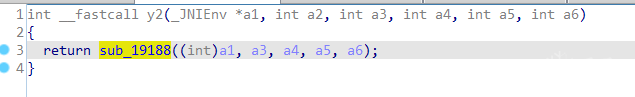

 

8.进入sub_19188() 函数
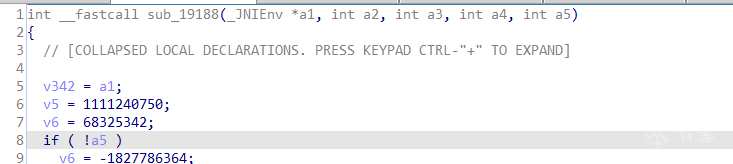
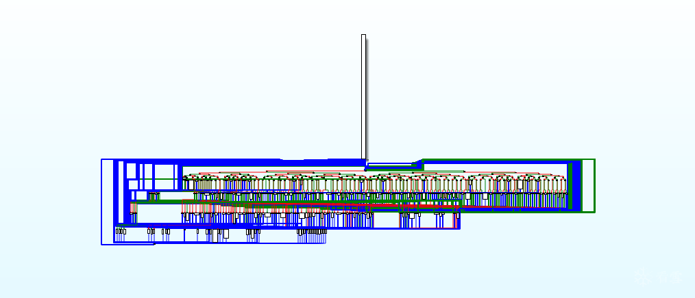
整个函数用了混淆，但影响不大，抓住关键点就行。

 

9.从返回值开始入手，返回值是jstring类型的指针
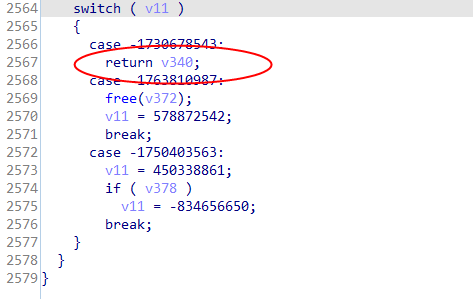
根据v340，查找引用定位到此处
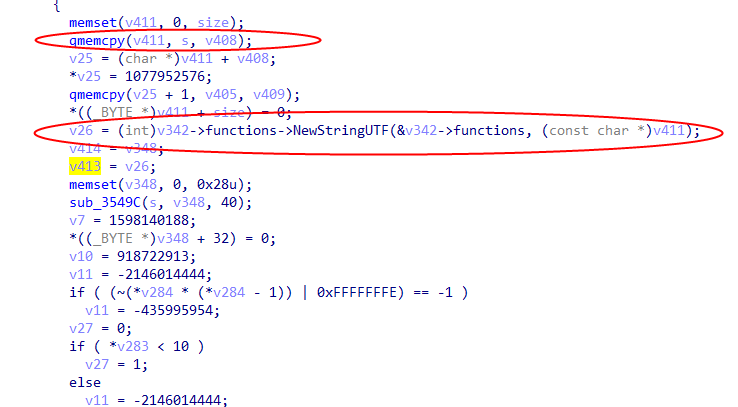
好家伙，s即为加密结果的字符串指针。继续查找引用定位到此处
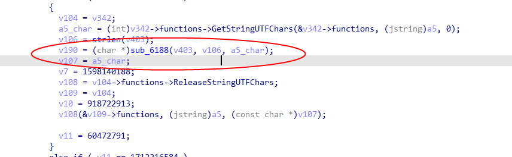

 

10.跟进此函数，查找a5_char的引用
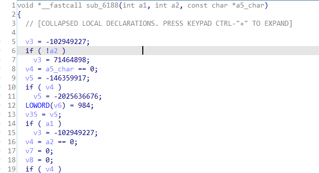
定位到此处
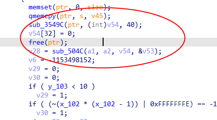
sub_3549C函数传入指针s,计算的结果在指针v54中，然后再传入sub_504c。

 

11.继续跟进sub_504C,查找a2的引用
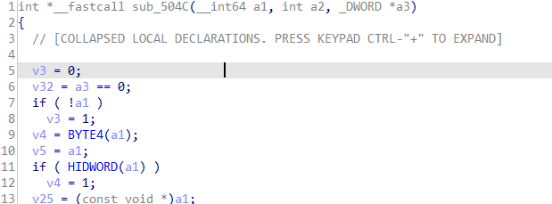
定位到此处
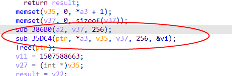
根据传参猜测为魔改AES加密。跟进sub_386B0函数确认一下,猜测此函数为扩展密钥函数，看看是否调用了sbox数组，进入子函数
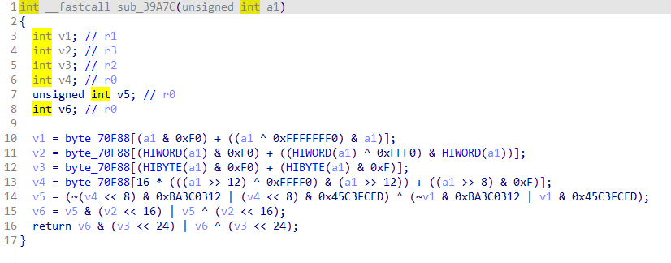
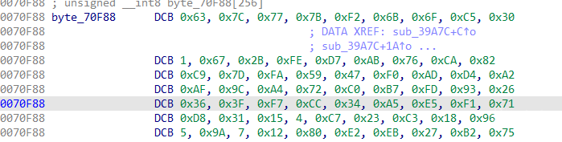
可以确定次函数为AES加密算法了。

 

12.ida 动态调试抠出算法代码，测试运行，传入参数
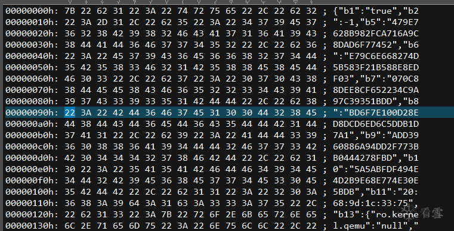
结果：
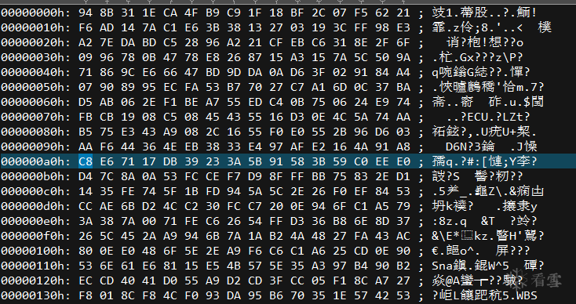
进行base64位加密
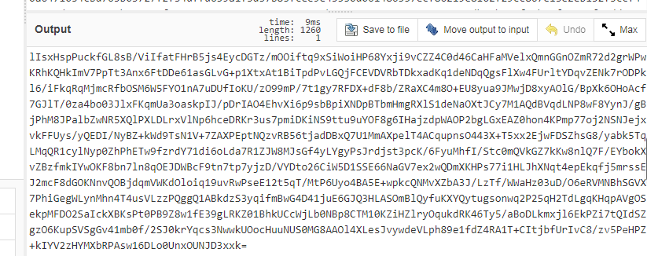
与原结果进行比较
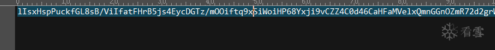
大功告成！