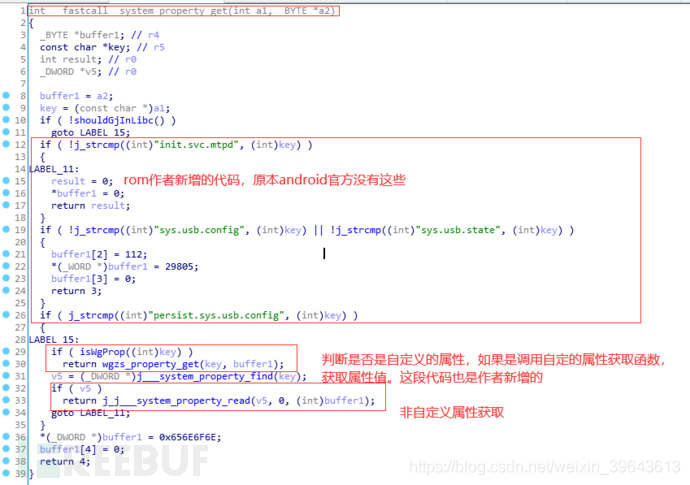
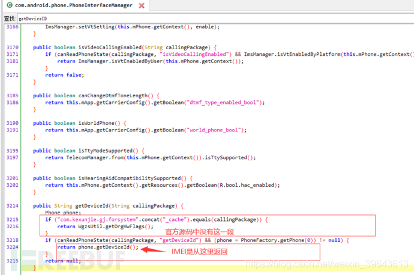
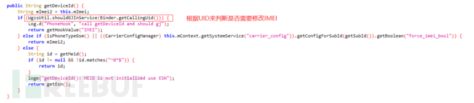
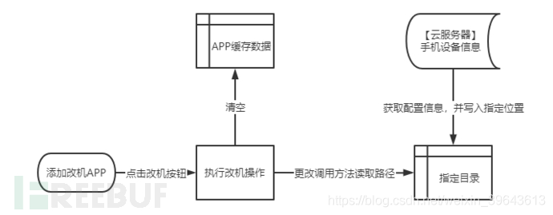
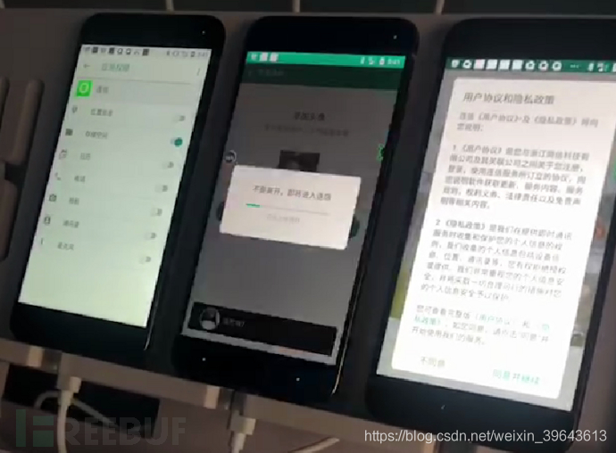

# 设备风控攻防新挑战：定制ROM改机

src:https://www.freebuf.com/articles/network/237821.html

# 一、背景

改机是黑产团伙大规模作恶所依赖的重要技术手段。通过改机，黑产可以批量伪造新设备，进而绕过甲方的业务风控。因此围绕改机展开的攻与防，是我们跟黑灰产对抗的重点研究工作之一。过去几年，黑产改机主要有以下几种手段：

## 1、安卓模拟器

大多数安卓模拟器都支持修改IMEI，机型等设备参数，因此可以伪造出多台设备。不过只要能检测出模拟器环境，这种改机便不攻自破；

## 2、改机工具

这类工具运行在真实设备上，基于Xposed、Substrate等框架，注入指定应用，并Hook getDeviceID、getMacAddress等函数，返回伪造的设备信息。针对这种改机，检测Hook框架，多种方式获取并比对设备信息等，都是识别改机的可行方案；

## 3、应用多开/分身

通过VirtualApp等技术在真实设备上模拟出多个沙盒环境，然后在沙盒环境中运行应用。由于每个沙盒环境的设备参数都是可控的，所以也可以达到改机的效果。不过由于沙盒环境和真实环境始终存在差异，因此可以检测沙盒环境来识别此类改机。

通过Karma业务情报监测平台，我们发现黑产团伙从去年开始使用一种新的手段，即定制ROM的方式来实现改机，这种改机技术更加底层，更加难以检测，目前技术也愈发成熟。经过一段时间的深入研究，我们在前段时间升级了设备风险SDK，全面支持检测定制ROM改机。

# 二、定制ROM改机的技术原理

我们以修改机型信息为例，获取机型信息大多会调用_system_property_get这个函数，位于/system/lib/libc.so这个系统库中。在定制rom该机的设备上，该函数代码如下：

可以看到定制rom的开发者对函数做了修改，添加了自己的代码逻辑。如果在改机工具中自定义了某个属性，则该属性值的获取不走系统默认的读取函数，转而执行工具定制的读取函数。同时，我们发现开发者对init进程做了深度定制，最终是在init中修改了机型信息。

## 修改IMEI

获取IMEI信息通常会调用getDeviceID函数。这是一个phone服务的IPC调用，响应代码位于：packages/services/Telephony/src/com/android/phone/PhoneInterfaceManager.java中，如下所示:

可以看到返回IMEI值，调用的是phone.getDeviceId函数，进一步跟进其代码，如下所示：

可以看到，根据IPC调用发起方的UID(可以看作一个用的唯一标识)，来判断是否需要修改IMEI。如果是，则调用getHookValue返回伪造的IMEI。为了方便使用，作者提供了设置接口，可以在使用前设置哪些应用需要修改IMEI。

# 三、定制ROM改机的使用

由于定制ROM改机直接修改Andorid源代码，改机的对象是真实设备，对应用本身也没有任何侵入行为，所以难以被检测，而且改机效果非常稳定。此外，定制ROM改机的使用也非常方便：

>1）可镜像备份机型数据环境至云服务器，方便账号对应的设备环境管理；
>2）打通系统调试接口，方便自动化脚本编写、降低开发成本；
>3）傻瓜式一键式操作，完成设备信息修改、设备数据恢复。

定制ROM改机运行流程如下图所示：

基于Karma业务情报监测平台的情报数据，引流是当前定制ROM主要的使用场景之一。黑产从业人员通过定制ROM改机，轻松实现了设备的重复利用，再结合定制脚本进行批量化自动化的引流操作。

# 四、定制ROM改机的检测

检测其他改机技术的攻防平面，很难应用到定制ROM改机。因此需要在深入分析定制ROM改机工具的基础上，结合工具的实际运行原理和运行过程，寻找到新的攻防平面。目前我们对于几款活跃的定制ROM改机工具，都找到了工具难以反制的攻防平面，并在之上定义了针对每款工具的检测逻辑。我们的设备风险SDK，也第一时间进行了升级。

当然，与黑产的攻防，始终是一个持续对抗的过程。如果仅仅依赖一成不变的防御机制，最终也会有被破解的一天。尤其在大多时刻，防守方相比于攻击方会更加被动，因此需要建立发现问题到快速解决问题的闭环，从而尽量降低业务遭受的损失。