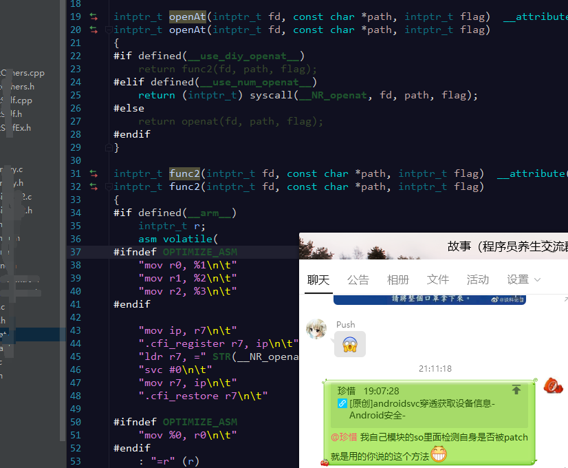

# Android svc获取设备信息

url：https://bbs.pediy.com/thread-264641.htm

# 前言：

现在市面上改机的软件很多，大部分都是通过Hook的方式去修改Java层的一些参数和变量，或者直接反射的方式去set成伪造数据。
如果通过正常的获取设备信息的API去获取的时候就很容易是假的

 

这时候我们可以通过读取文件的方式去获取设备信息，还需要加CRC对底层函数进行判断，很是麻烦
因为底层的IO函数一旦被Hook，比如openat函数，就算读取文件的方式去可能获取的设备也可能是被mock的。

## 这时候有没有一种相对稳定的方式去获取最真实的设备信息呢？

通过syscall 直接调用svc指令的方式让Linux切换到内核态，执行完毕以后去直接拿返回结果即可
（systcall是Linux内核的入口，切换到内核态以后，无法被Hook）

### 方案：

实现也很简单，提供两种方式：

- 1，直接调用libc.so里面的syscall
- 2，内联汇编，将Libc.so syscall里面的代码抠出来
  本质区别不大

### 实现：

- 方式1：
  直接调用syscall

  ```
  std::string FileUtils::getFileText(char *path,int BuffSize) {
   
    char buffer[BuffSize];
    memset(buffer, 0, BuffSize);
    std::string str;
    //int fd = open(path, O_RDONLY);
    long fd = syscall(__NR_open, path, O_RDONLY);
   
    //失败 -1；成功：>0 读出的字节数  =0文件读完了
    while (syscall(__NR_read,fd, buffer, 1) != 0) {
        //LOG(ERROR) << "读取文件内容  " <<buffer;
        str.append(buffer);
    }
    syscall(__NR_close,fd);
    return str;
  }
  ```

  

- 方式2
  通过内联汇编的方式调用Svc

```
std::string FileUtils::getRawFileText(char *path,int BuffSize) {
 
    char buffer[BuffSize];
    memset(buffer, 0, BuffSize);
    std::string str;
    //int fd = open(path, O_RDONLY);
    long fd = raw_syscall(__NR_open, path, O_RDONLY);
 
    //失败 -1；成功：>0 读出的字节数  =0文件读完了
    while (read(fd, buffer, 1) != 0) {
        //LOG(ERROR) << "读取文件内容  " <<buffer;
        str.append(buffer);
    }
    syscall(__NR_close,fd);
    return str;
}
```

重点看一下raw_syscall

 

内联汇编代码主要分32和64

- 32位实现

```
   .text
    .global raw_syscall
    .type raw_syscall,%function
 
raw_syscall:
        MOV             R12, SP
        STMFD           SP!, {R4-R7}
        MOV             R7, R0
        MOV             R0, R1
        MOV             R1, R2
        MOV             R2, R3
        LDMIA           R12, {R3-R6}
        SVC             0
        LDMFD           SP!, {R4-R7}
        mov             pc, lr
```

- 64位实现

```
    .text
    .global raw_syscall
    .type raw_syscall,@function
 
raw_syscall:
        MOV             X8, X0
        MOV             X0, X1
        MOV             X1, X2
        MOV             X2, X3
        MOV             X3, X4
        MOV             X4, X5
        MOV             X5, X6
        SVC             0
        RET
```

cmake里添加

```
enable_language(C ASM)
```

编译即可

 

比如获取网卡设备信息

```
LOG(ERROR) << "读取文件内容  " <<
            FileUtils::getFileText("/sys/class/net/p2p0/address",20);
```


## 这种方式一定是安全的么？

答案是否定的

 

目前主流的两种方法

- 可以通过Ptrace进行svc拦截，在使用前需要将Ptrace方法堵住
  （因为Ptrace作为Linux的调试函数，是可以调试svc指令的，很多游戏辅助也都是这么搞得）
  方法也很多，可以像一般壳子的方式提前占坑，或者读取调试状态，去判断是否被调试 都是不错的办法。
- 使用一些特殊的虚拟机，比如GS虚拟机之类的。
  底层原理相当于在安卓上面实现一个新的安卓，这个很复杂，用到了Google开源的一些东西
  比如gVisor（Google的gVisor则是linux上实现linux），需要重新实现一遍安卓内核 ，所以就算svc指令也可以去拦截。


帖子根据个人经验梳理，如有不足，及时告知。


评论：

sudami：


莫灰灰：这招在iOS上其实挺好用的；Android上的话，有些黑产用自编译内核，在内核层进行的过滤，这招就有局限了。


FIGHTING安：这种方式兼容性是个大问题。会有各种莫名奇妙的Crash。


Qira：以前测试arm64的时候，发现华为，小米，google 的系统调用号不一样，不知道这块怎么兼容