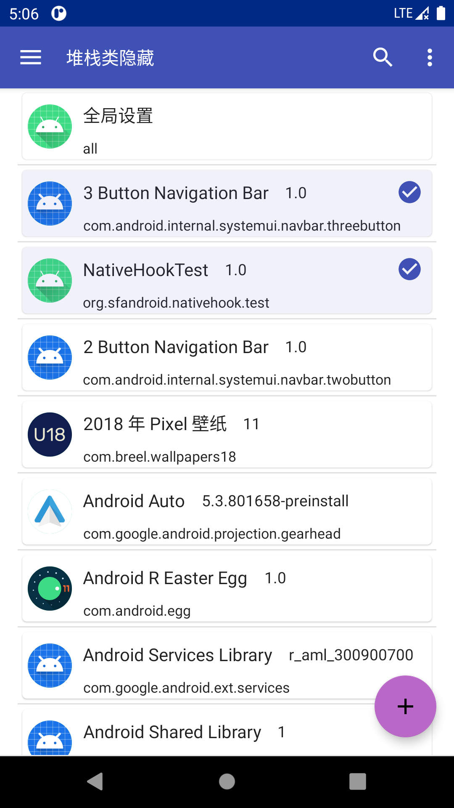
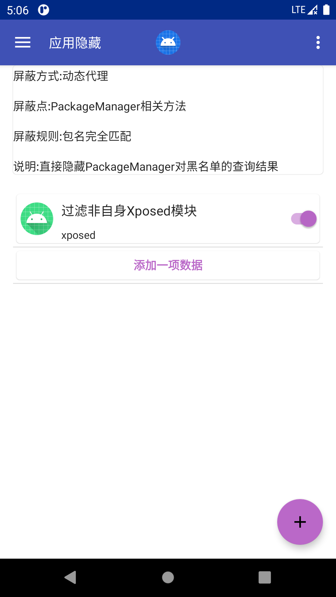
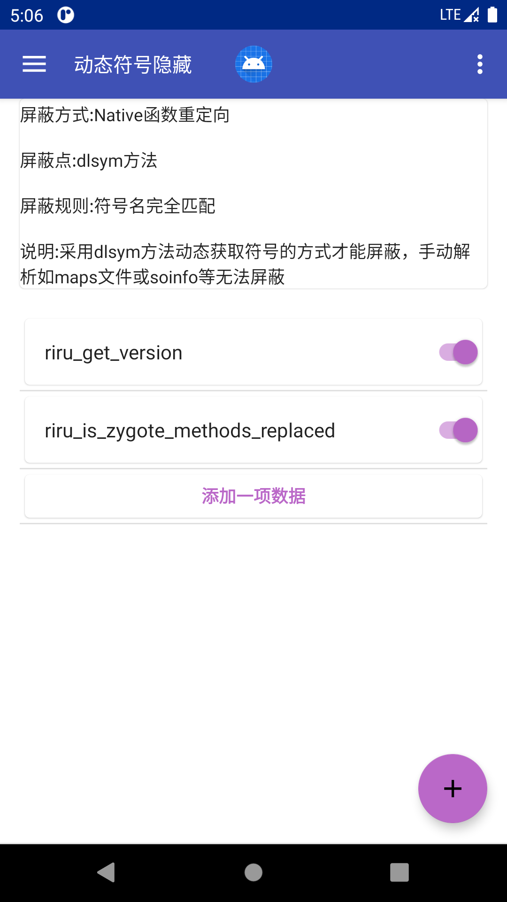

# FakeXposed原理分析

url：https://sanfengandroid.github.io/2021/02/20/fakexposed-principle-analyze/

## [FakeXposed](https://github.com/sanfengAndroid/FakeXposed)

一个通用多功能的 `Xposed` 隐藏器，采用 `Native` 与 `Java` 结合来做到双向屏蔽检测，提供高度自由化为每个应用配置不同属性。它不仅仅局限于屏蔽 `Xposed` 检测，还提供更多更加高级的功能，如 `maps` 文件自定义屏蔽各种检测、完整的文件重定向功能、访问权限控制、`JNI` 方法监控、动态符号查找屏蔽 `dlsym` 等等，还可以提供给其它模块在进程内动态添加或修改配置。开源地址 https://github.com/sanfengAndroid/FakeXposed


## 原理简要介绍

- `Native Hook` 使用我的另一开源项目 [fake-linker](https://github.com/sanfengAndroid/fake-linker)，`Java Hook` 使用 `Xposed` 框架，大部分功能都是由 `Native Hook` 来完成，`Xposed` 不限于原版 `Xposed`、`EdXposed`、`VirtualXposed`等等
- 内部提供 `类`、`堆栈类`、`应用`、`环境变量`、`全局系统属性`、`Android Global属性`、`Runtime.exec拦截`、`文件访问/重定向等`、`符号拦截`，各种属性的隐藏和修改，下面我将简单介绍一些原理，代码都是基于 Android 最新源码主分支，旧分支一些变化不是太大自行分析即可

## 类/堆栈类隐藏

- Hook `Class.forName()`、`ClassLoader.loadClass()`、`Throwable.getStackTrace()` 方法，判断隐藏类加载则抛出异常或删除该元素。目前我在测试 `EdXposed` 中只有部分情况会走该回调，可能框架处理了有关部分

## 应用/组件隐藏

- 使用动态代理 `PackageManager`、`ActivityManager`、`ActivityTaskManager`屏蔽常见会使用到获取其它应用属性的方法，如：`getInstalledPackages`、`getInstalledApplications`、`getRunningServices`、`getTasks`等等。应用进程本身就是通过 `Binder` 与 `system_server` 服务进程通信进程内只存在一个 `IBinger` 对象，因此非常适合使用动态代理，这里屏蔽掉几乎所有能够访问其它应用的方式，具体查看源码[HookSystemComponent](https://github.com/sanfengAndroid/FakeXposed/blob/main/app/src/main/java/com/sanfengandroid/xp/hooks/HookSystemComponent.java)。

- ```
  PackageManager
  ```

   

  源码在

   

  ActivityThread.getPackageManager

  ```
  static volatile IPackageManager sPackageManager;
  public static IPackageManager getPackageManager() {
    if (sPackageManager != null) {
        return sPackageManager;
    }
    final IBinder b = ServiceManager.getService("package");
    sPackageManager = IPackageManager.Stub.asInterface(b);
    return sPackageManager;
  }
  ```

  因此只需要使用反射修改

   

  ```
  sPackageManager
  ```

   

  静态变量即可

- ```
  ActivityManager
  ```

   

  源码

   

  ```
  AndroidO
  ```

   

  以上在

   

  ActivityManager.IActivityManagerSingleton

  ，

  ```
  AndroidO
  ```

   

  以下在

   

  ```
  ActivityManagerNative.gDefault
  ```

  ，都是一个单例对象

  ```
  private static final Singleton<IActivityManager> IActivityManagerSingleton =
    new Singleton<IActivityManager>() {
        @Override
        protected IActivityManager create() {
            final IBinder b = ServiceManager.getService(Context.ACTIVITY_SERVICE);
            final IActivityManager am = IActivityManager.Stub.asInterface(b);
            return am;
        }
    };
  ```

  同样反射修改

   

  ```
  Singleton
  ```

   

  里面的对象即可

- `ActivityTaskManager` 是 `AndroidQ` 以上新增的一个服务，修改方法同 `ActivityManager`

## 环境变量修改

- `Java` 调用 `System.getenv()`、`System.getenv(String)` 源码如下

  ```
  public static java.util.Map<String,String> getenv() {
    SecurityManager sm = getSecurityManager();
    if (sm != null) {
        sm.checkPermission(new RuntimePermission("getenv.*"));
    }
  
    return ProcessEnvironment.getenv();
  }
  public static String getenv(String name) {
    if (name == null) {
        throw new NullPointerException("name == null");
    }
  
    return Libcore.os.getenv(name);
  }
  ```

  其最终调用两个函数 `Libcore.os.environ()`、`Libcore.os.getenv(String)`

  ```
  public final class Libcore {
    private Libcore() { }
    public static final Os rawOs = new Linux();
    public static volatile Os os = new BlockGuardOs(rawOs);
    ...
  }
  
  public final class Linux implements Os {
    Linux() { }
    public native String getenv(String name);
    public native String[] environ();
    ...
  }
  ```

  不同版本 `Libcore.os` 的实现对象类名不一样，但是区别很小，而 `native` 中访问到是 libc 导出变量 `environ`、导出函数 `getenv`，因此通过 `Native Hook` 拦截 `getenv` 函数即可拦截对应 Java `System.getenv(String)`调用，而 `System.getenv()` 调用是直接使用 `environ` 变量，因此暂时采用`Java Hook`替换该`Map`对象，通常情况下应用是很少使用到 `System.getenv` 非系统环境变量的，一些软件检测才会使用，因此后续可能会直接修改 `environ` 变量中的值

## 全局属性 SystemProperties 修改

- `Java` 反射使用 `SystemProperties.get` 系列方法

  ```
  @NonNull
  @SystemApi
  public static String get(@NonNull String key, @Nullable String def) {
      if (TRACK_KEY_ACCESS) onKeyAccess(key);
      return native_get(key, def);
  }
  ...
  @FastNative
  @UnsupportedAppUsage(maxTargetSdk = Build.VERSION_CODES.P)
  private static native String native_get(String key, String def);
  ```

  调用 [android_os_SystemProperties.cpp](https://cs.android.com/android/platform/superproject/+/master:frameworks/base/core/jni/android_os_SystemProperties.cpp) 中的方法

  ```
  template<typename Functor>
  void ReadProperty(const prop_info* prop, Functor&& functor)
  {
  #if defined(__BIONIC__)
      auto thunk = [](void* cookie,
                      const char* /*name*/,
                      const char* value,
                      uint32_t /*serial*/) {
          std::forward<Functor>(*static_cast<Functor*>(cookie))(value);
      };
      __system_property_read_callback(prop, thunk, &functor);
  #else
      LOG(FATAL) << "fast property access supported only on device";
  #endif
  }
  
  template<typename Functor>
  void ReadProperty(JNIEnv* env, jstring keyJ, Functor&& functor)
  {
      ScopedUtfChars key(env, keyJ);
      if (!key.c_str()) {
          return;
      }
  #if defined(__BIONIC__)
      const prop_info* prop = __system_property_find(key.c_str());
      if (!prop) {
          return;
      }
      ReadProperty(prop, std::forward<Functor>(functor));
  #else
      std::forward<Functor>(functor)(
          android::base::GetProperty(key.c_str(), "").c_str());
  #endif
  }
  
  jstring SystemProperties_getSS(JNIEnv* env, jclass clazz, jstring keyJ,
                               jstring defJ)
  {
      jstring ret = defJ;
      ReadProperty(env, keyJ, [&](const char* value) {
          if (value[0]) {
              ret = env->NewStringUTF(value);
          }
      });
      if (ret == nullptr && !env->ExceptionCheck()) {
        ret = env->NewStringUTF("");  // Legacy behavior
      }
      return ret;
  }
  
  int register_android_os_SystemProperties(JNIEnv *env)
  {
      const JNINativeMethod method_table[] = {
          { "native_get",
            "(Ljava/lang/String;Ljava/lang/String;)Ljava/lang/String;",
            (void*) SystemProperties_getSS },
          { "native_get_int", "(Ljava/lang/String;I)I",
            (void*) SystemProperties_get_integral<jint> },
          { "native_get_long", "(Ljava/lang/String;J)J",
            (void*) SystemProperties_get_integral<jlong> },
          { "native_get_boolean", "(Ljava/lang/String;Z)Z",
            (void*) SystemProperties_get_boolean },
          { "native_find",
            "(Ljava/lang/String;)J",
            (void*) SystemProperties_find },
          { "native_get",
            "(J)Ljava/lang/String;",
            (void*) SystemProperties_getH },
          { "native_get_int", "(JI)I",
            (void*) SystemProperties_get_integralH<jint> },
          { "native_get_long", "(JJ)J",
            (void*) SystemProperties_get_integralH<jlong> },
          { "native_get_boolean", "(JZ)Z",
            (void*) SystemProperties_get_booleanH },
          { "native_set", "(Ljava/lang/String;Ljava/lang/String;)V",
            (void*) SystemProperties_set },
          { "native_add_change_callback", "()V",
            (void*) SystemProperties_add_change_callback },
          { "native_report_sysprop_change", "()V",
            (void*) SystemProperties_report_sysprop_change },
      };
      return RegisterMethodsOrDie(env, "android/os/SystemProperties",
                                  method_table, NELEM(method_table));
  }
  ```

  而它调用了 `libc.so` 中的 `__system_property_find`，`__system_property_read_callback`，在低版本中获取属性也使用到了 `__system_property_get` 方法，因此采用 `Native Hook` 以上这三个方法，这里也要注意不同版本在不同动态库中实现

## Android Global 属性修改

- 采用 Java Hook `Global.getString` 方法修改

## Runtime.exec 拦截

- 源码分析如下

  ```
  public class Runtime{
    public Process exec(String[] cmdarray, String[] envp, File dir)
      throws IOException {
      return new ProcessBuilder(cmdarray)
          .environment(envp)
          .directory(dir)
          .start();
    }
  }
  
  public final class ProcessBuilder{
    public Process start() throws IOException {
      ...
      try {
          return ProcessImpl.start(cmdarray,
                                    environment,
                                    dir,
                                    redirects,
                                    redirectErrorStream);
      } catch (IOException | IllegalArgumentException e) {
         ...
    }
  }
  final class ProcessImpl {
    static Process start(String[] cmdarray,
                         java.util.Map<String,String> environment,
                         String dir,
                         ProcessBuilder.Redirect[] redirects,
                         boolean redirectErrorStream)
        throws IOException
    {
        assert cmdarray != null && cmdarray.length > 0;
  
        // Convert arguments to a contiguous block; it's easier to do
        ...
        // 复制环境变量
  
        FileInputStream  f0 = null;
        FileOutputStream f1 = null;
        FileOutputStream f2 = null;
  
        try {
            if (redirects == null) {
                std_fds = new int[] { -1, -1, -1 };
            } else {
              // 重定向流
              ...
            }
  
        return new UNIXProcess
            (toCString(cmdarray[0]),
             argBlock, args.length,
             envBlock, envc[0],
             toCString(dir),
                 std_fds,
             redirectErrorStream);
        } finally {
            // In theory, close() can throw IOException
            // (although it is rather unlikely to happen here)
            try { if (f0 != null) f0.close(); }
            finally {
                try { if (f1 != null) f1.close(); }
                finally { if (f2 != null) f2.close(); }
            }
        }
  }
  
  final class UNIXProcess extends Process {
    private native int forkAndExec(byte[] prog,
                                   byte[] argBlock, int argc,
                                   byte[] envBlock, int envc,
                                   byte[] dir,
                                   int[] fds,
                                   boolean redirectErrorStream)
        throws IOException;
  
    UNIXProcess(final byte[] prog,
                final byte[] argBlock, final int argc,
                final byte[] envBlock, final int envc,
                final byte[] dir,
                final int[] fds,
                final boolean redirectErrorStream)
            throws IOException {
  
        pid = forkAndExec(prog,
                          argBlock, argc,
                          envBlock, envc,
                          dir,
                          fds,
                          redirectErrorStream);
  
        try {
            doPrivileged(new PrivilegedExceptionAction<Void>() {
                public Void run() throws IOException {
                    initStreams(fds);
                    return null;
                }});
        } catch (PrivilegedActionException ex) {
            throw (IOException) ex.getException();
        }
  }
  ```

  通过跟踪 `Runtime.exec()` -> `ProcessBuilder.start()` -> `ProcessImpl.start()` -> `new UNIXProcess()` -> `UNIXProcess.forkAndExec()` 最终执行 `UNIXProcess.forkAndExec` 产生子进程，继续跟踪 `native`

  ```
  JNIEXPORT jint JNICALL
  UNIXProcess_forkAndExec(JNIEnv *env,
                                        jobject process,
                                        jbyteArray prog,
                                        jbyteArray argBlock, jint argc,
                                        jbyteArray envBlock, jint envc,
                                        jbyteArray dir,
                                        jintArray std_fds,
                                        jboolean redirectErrorStream)
  {
      ...
      // 上面设置环境变量，重定向输入输出流
      // startChild关键函数启动子进程
      resultPid = startChild(c);
      assert(resultPid != 0);
  
      if (resultPid < 0) {
          throwIOException(env, errno, START_CHILD_SYSTEM_CALL " failed");
          goto Catch;
      }
  
      restartableClose(fail[1]); fail[1] = -1; /* See: WhyCantJohnnyExec */
  
      switch (readFully(fail[0], &errnum, sizeof(errnum))) {
      case 0: break; /* Exec succeeded */
      case sizeof(errnum):
          waitpid(resultPid, NULL, 0);
          throwIOException(env, errnum, "Exec failed");
          goto Catch;
      default:
          throwIOException(env, errno, "Read failed");
          goto Catch;
      }
  
      fds[0] = (in [1] != -1) ? in [1] : -1;
      fds[1] = (out[0] != -1) ? out[0] : -1;
      fds[2] = (err[0] != -1) ? err[0] : -1;
  
  Finally:
  #if START_CHILD_USE_CLONE
      free(c->clone_stack);
  #endif
  
      /* Always clean up the child's side of the pipes */
      closeSafely(in [0]);
      closeSafely(out[1]);
      closeSafely(err[1]);
  
      /* Always clean up fail descriptors */
      closeSafely(fail[0]);
      closeSafely(fail[1]);
  
      releaseBytes(env, prog,     pprog);
      releaseBytes(env, argBlock, pargBlock);
      releaseBytes(env, envBlock, penvBlock);
      releaseBytes(env, dir,      c->pdir);
  
      free(c->argv);
      free(c->envv);
      free(c);
  
      if (fds != NULL)
          (*env)->ReleaseIntArrayElements(env, std_fds, fds, 0);
  
      return resultPid;
  
  Catch:
      /* Clean up the parent's side of the pipes in case of failure only */
      closeSafely(in [1]);
      closeSafely(out[0]);
      closeSafely(err[0]);
      goto Finally;
  }
  ```

  最关键函数 `startChild` 继续跟踪

  ```
  static pid_t
  startChild(ChildStuff *c) {
  #if START_CHILD_USE_CLONE
  #define START_CHILD_CLONE_STACK_SIZE (64 * 1024)
      /*
      * See clone(2).
      * Instead of worrying about which direction the stack grows, just
      * allocate twice as much and start the stack in the middle.
      */
      if ((c->clone_stack = malloc(2 * START_CHILD_CLONE_STACK_SIZE)) == NULL)
          /* errno will be set to ENOMEM */
          return -1;
      return clone(childProcess,
                  c->clone_stack + START_CHILD_CLONE_STACK_SIZE,
                  CLONE_VFORK | CLONE_VM | SIGCHLD, c);
  #else
    #if START_CHILD_USE_VFORK
      /*
      * We separate the call to vfork into a separate function to make
      * very sure to keep stack of child from corrupting stack of parent,
      * as suggested by the scary gcc warning:
      *  warning: variable 'foo' might be clobbered by 'longjmp' or 'vfork'
      */
      volatile pid_t resultPid = vfork();
    #else
      /*
      * From Solaris fork(2): In Solaris 10, a call to fork() is
      * identical to a call to fork1(); only the calling thread is
      * replicated in the child process. This is the POSIX-specified
      * behavior for fork().
      */
      pid_t resultPid = fork();
    #endif
      if (resultPid == 0)
          // 子进程处理对应命令
          childProcess(c);
      assert(resultPid != 0);  /* childProcess never returns */
      return resultPid;
  #endif /* ! START_CHILD_USE_CLONE */
  }
  ```

  调用 `clone`、`vfork`、`fork` 函数产生子进程然后调用 `childProcess(c)` 处理命令，这里使用哪一个函数产生子进程不是重点，我们关心的是子进程如何执行命令

  ```
  static int
  childProcess(void *arg)
  {
      const ChildStuff* p = (const ChildStuff*) arg;
  
      /* Close the parent sides of the pipes.
        Closing pipe fds here is redundant, since closeDescriptors()
        would do it anyways, but a little paranoia is a good thing. */
      if ((closeSafely(p->in[1])   == -1) ||
          (closeSafely(p->out[0])  == -1) ||
          (closeSafely(p->err[0])  == -1) ||
          (closeSafely(p->fail[0]) == -1))
          goto WhyCantJohnnyExec;
  
      /* Give the child sides of the pipes the right fileno's. */
      /* Note: it is possible for in[0] == 0 */
      if ((moveDescriptor(p->in[0] != -1 ?  p->in[0] : p->fds[0],
                          STDIN_FILENO) == -1) ||
          (moveDescriptor(p->out[1]!= -1 ? p->out[1] : p->fds[1],
                          STDOUT_FILENO) == -1))
          goto WhyCantJohnnyExec;
  
      if (p->redirectErrorStream) {
          if ((closeSafely(p->err[1]) == -1) ||
              (restartableDup2(STDOUT_FILENO, STDERR_FILENO) == -1))
              goto WhyCantJohnnyExec;
      } else {
          if (moveDescriptor(p->err[1] != -1 ? p->err[1] : p->fds[2],
                            STDERR_FILENO) == -1)
              goto WhyCantJohnnyExec;
      }
  
      if (moveDescriptor(p->fail[1], FAIL_FILENO) == -1)
          goto WhyCantJohnnyExec;
  
      /* close everything */
      if (closeDescriptors() == 0) { /* failed,  close the old way */
          int max_fd = (int)sysconf(_SC_OPEN_MAX);
          int fd;
          for (fd = FAIL_FILENO + 1; fd < max_fd; fd++)
              if (restartableClose(fd) == -1 && errno != EBADF)
                  goto WhyCantJohnnyExec;
      }
  
      /* change to the new working directory */
      if (p->pdir != NULL && chdir(p->pdir) < 0)
          goto WhyCantJohnnyExec;
  
      if (fcntl(FAIL_FILENO, F_SETFD, FD_CLOEXEC) == -1)
          goto WhyCantJohnnyExec;
      // 最终调用 JDK_execvpe 执行命令
      JDK_execvpe(p->argv[0], p->argv, p->envv);
  
  WhyCantJohnnyExec:
      /* We used to go to an awful lot of trouble to predict whether the
      * child would fail, but there is no reliable way to predict the
      * success of an operation without *trying* it, and there's no way
      * to try a chdir or exec in the parent.  Instead, all we need is a
      * way to communicate any failure back to the parent.  Easy; we just
      * send the errno back to the parent over a pipe in case of failure.
      * The tricky thing is, how do we communicate the *success* of exec?
      * We use FD_CLOEXEC together with the fact that a read() on a pipe
      * yields EOF when the write ends (we have two of them!) are closed.
      */
      {
          int errnum = errno;
          restartableWrite(FAIL_FILENO, &errnum, sizeof(errnum));
      }
      restartableClose(FAIL_FILENO);
      _exit(-1);
      return 0;  /* Suppress warning "no return value from function" */
  }
  
  static void
  JDK_execvpe(const char *file,
              const char *argv[],
              const char *const envp[])
  {
      if (envp == NULL || (char **) envp == environ) {
          execvp(file, (char **) argv);
          return;
      }
  
      if (*file == '\0') {
          errno = ENOENT;
          return;
      }
  
      if (strchr(file, '/') != NULL) {
          execve_with_shell_fallback(file, argv, envp);
      } else {
          /* We must search PATH (parent's, not child's) */
          char expanded_file[PATH_MAX];
          int filelen = strlen(file);
          int sticky_errno = 0;
          const char * const * dirs;
          for (dirs = parentPathv; *dirs; dirs++) {
              const char * dir = *dirs;
              int dirlen = strlen(dir);
              if (filelen + dirlen + 1 >= PATH_MAX) {
                  errno = ENAMETOOLONG;
                  continue;
              }
              memcpy(expanded_file, dir, dirlen);
              memcpy(expanded_file + dirlen, file, filelen);
              expanded_file[dirlen + filelen] = '\0';
              execve_with_shell_fallback(expanded_file, argv, envp);
              /* There are 3 responses to various classes of errno:
              * return immediately, continue (especially for ENOENT),
              * or continue with "sticky" errno.
              *
              * From exec(3):
              *
              * If permission is denied for a file (the attempted
              * execve returned EACCES), these functions will continue
              * searching the rest of the search path.  If no other
              * file is found, however, they will return with the
              * global variable errno set to EACCES.
              */
              switch (errno) {
              case EACCES:
                  sticky_errno = errno;
                  /* FALLTHRU */
              case ENOENT:
              case ENOTDIR:
  #ifdef ELOOP
              case ELOOP:
  #endif
  #ifdef ESTALE
              case ESTALE:
  #endif
  #ifdef ENODEV
              case ENODEV:
  #endif
  #ifdef ETIMEDOUT
              case ETIMEDOUT:
  #endif
                  break; /* Try other directories in PATH */
              default:
                  return;
              }
          }
          if (sticky_errno != 0)
              errno = sticky_errno;
      }
  }
  
  static void
  execve_with_shell_fallback(const char *file,
                            const char *argv[],
                            const char *const envp[])
  {
  #if START_CHILD_USE_CLONE || START_CHILD_USE_VFORK
      /* shared address space; be very careful. */
      execve(file, (char **) argv, (char **) envp);
      if (errno == ENOEXEC)
          execve_as_traditional_shell_script(file, argv, envp);
  #else
      /* unshared address space; we can mutate environ. */
      environ = (char **) envp;
      execvp(file, (char **) argv);
  #endif
  }
  ```

  通过上面分析，最终调用 `JDK_execvpe` -> `execve_with_shell_fallback` -> `execve/execvp` 执行命令，实际测试执行 `Runtime.exec` 最终执行到 `execvp` 中。由于 `fork` 子进程后会继承父进程的环境，因此也可通过 `Native Hook` 来拦截该函数，但是实际测试中如果拦截 `execvp` 会导致子进程一直无法结束，从而导致卡住，这里原因暂时不明，有知道的可以留言告诉我。因此还是老实采用 `Java Hook` 更底层方法 `java.lang.UNIXProcess` 构造方法，对于低版本 Hook `java.lang.ProcessManager.exec` 方法。基于此提供命令，参数替换，以及固定输入、输出、错误流。具体源码查看 [HookRuntime](https://github.com/sanfengAndroid/FakeXposed/blob/main/app/src/main/java/com/sanfengandroid/xp/hooks/HookRuntime.java)

## 文件重定向/访问控制（核心）

- 文件重定向/黑名单：

  ```
  Native Hook
  ```

   

  与 IO 有关的方法，由于我们使用的

   

  ```
  PLT Hook
  ```

   

  因此要尽可能的包含全部函数

  - 如 `openat`、`__openat`、`open`、`fopen` 等 `libc` 函数，`Java` 中的 `File` 使用调用到 `Libcore.os` 中，这与上面分析环境变量类似，因此只需要 `Hook` libc 中的 IO 函数即可，查看代码[hook_io](https://github.com/sanfengAndroid/FakeXposed/blob/main/app/src/main/cpp/hook/hook_io.cpp)。
  - `syscall` 函数，自己实现 `软中断系统调用` 的无法拦截，其 `inline Hook` 框架也无法拦截，只能通过修改内核或动态查找 `软中断系统调用` 然后再 Hook，这种极个别情况忽略，查看代码 [hook_syscall](https://github.com/sanfengAndroid/FakeXposed/blob/main/app/src/main/cpp/hook/hook_syscall.cpp)
  - `exec` 簇执行函数，它会传入可执行文件路径，也需要重定向，查看代码 [hook_exec](https://github.com/sanfengAndroid/FakeXposed/blob/main/app/src/main/cpp/hook/hook_exec.cpp)
  - 与时间相关函数 `utimes`、`utime`、`lutimes`，查看代码 [hook_time](https://github.com/sanfengAndroid/FakeXposed/blob/main/app/src/main/cpp/hook/hook_time.cpp)
  - 与文件访问路径相关函数 `chdir`、`linkat`等，查看代码 [hook_unistd](https://github.com/sanfengAndroid/FakeXposed/blob/main/app/src/main/cpp/hook/hook_unistd.cpp)
  - 与文件状态相关函数 `fchmodat`、`fstatat`、`stat`等，查看代码 [hook_stat](https://github.com/sanfengAndroid/FakeXposed/blob/main/app/src/main/cpp/hook/hook_stat.cpp)
  - `maps` 文件过滤，基于文件重定向，当要访问 `maps` 文件时将修改掉需要过滤的数据然后将它重定向到缓存路径，查看代码 [io_redirect](https://github.com/sanfengAndroid/FakeXposed/blob/main/app/src/main/cpp/hook/io_redirect.cpp)
  - 动态加载函数 `dlopen`、`android_dlopen_ext`，查看代码 [hook_dlfcn](https://github.com/sanfengAndroid/FakeXposed/blob/main/app/src/main/cpp/hook/hook_dlfcn.cpp)

- 文件权限控制

  - `stat` `fstatat`、`access` 等函数，查看代码 [hook_stat](https://github.com/sanfengAndroid/FakeXposed/blob/main/app/src/main/cpp/hook/hook_stat.cpp)

## 符号隐藏

- Native Hook `dlsym` 函数，屏蔽一些符号查找和重定向 `libc` 库中的函数到 `Hook 模块` 中，查看代码 [hook_dlfcn](https://github.com/sanfengAndroid/FakeXposed/blob/main/app/src/main/cpp/hook/hook_dlfcn.cpp)

## 系统共享库查找

1. 上面 Hook 的 `native` 方法都是 `libc` 中的导出方法，要让 `Native Hook` 生效我们则需要重定位那些已经加载过的动态库，其中系统中最主要使用的 `Libcore` 库，我们通过查找 `Android.bp`(旧版本 `Android.mk`)来查找共享库名称，如果没找到名称则目录一级一级的向上继续查找，下面与最新版 `Libcore` 为例，其它版本类似

- 如上面频繁使用的 `libcore_io_Linux.cpp` 为例，源码路径在 `libcore/luni/src/main/native/libcore_io_Linux.cpp`，它所属的编译模块 `Android.bp(libcore/luni/src/main/native/Android.bp)`，有关配置如下

  ```
  package {
      // http://go/android-license-faq
      // A large-scale-change added 'default_applicable_licenses' to import
      // the below license kinds from "libcore_luni_license":
      //   SPDX-license-identifier-Apache-2.0
      default_applicable_licenses: ["libcore_luni_license"],
  }
  
  filegroup {
      name: "luni_native_srcs",
      visibility: [
          "//libcore",
      ],
      srcs: [
          "ExecStrings.cpp",
          "IcuUtilities.cpp",
          "JniConstants.cpp",
          "JniException.cpp",
          "NetworkUtilities.cpp",
          "Register.cpp",
          "ZipUtilities.cpp",
          "android_system_OsConstants.cpp",
          "cbigint.cpp",
          "java_lang_StringToReal.cpp",
          "java_lang_invoke_MethodHandle.cpp",
          "java_lang_invoke_VarHandle.cpp",
          "libcore_math_NativeBN.cpp",
          "libcore_icu_ICU.cpp",
          "libcore_io_AsynchronousCloseMonitor.cpp",
          // 这里包含我们需要拦截的源代码
          "libcore_io_Linux.cpp",
          "libcore_io_Memory.cpp",
          "libcore_util_NativeAllocationRegistry.cpp",
          "org_apache_harmony_xml_ExpatParser.cpp",
          "sun_misc_Unsafe.cpp",
          "valueOf.cpp",
      ],
  }
  
  filegroup {
      name: "libandroidio_srcs",
      visibility: [
          "//libcore",
      ],
      srcs: [
          "AsynchronousCloseMonitor.cpp",
      ],
  }
  ```

  这里没有找到模块名称，则继续向上级目录查找编译脚本，上层找到 `libcore/luni/Android.bp`，配置如下

  ```
  package {
    default_applicable_licenses: ["libcore_luni_license"],
  }
  
  // Added automatically by a large-scale-change
  // http://go/android-license-faq
  license {
      name: "libcore_luni_license",
      visibility: [":__subpackages__"],
      license_kinds: [
          "SPDX-license-identifier-Apache-2.0",
      ],
      license_text: [
          "license.html",
      ],
  }
  ```

  还是没找到名称继续往上查找 `libcore/Android.bp`

  ```
  license {
      name: "libcore_license",
      visibility: [":__subpackages__"],
      license_kinds: [
          "SPDX-license-identifier-Apache-2.0",
          "SPDX-license-identifier-BSD",
          "SPDX-license-identifier-GPL",
          "SPDX-license-identifier-GPL-2.0",
          "SPDX-license-identifier-LGPL",
          "SPDX-license-identifier-MIT",
          "SPDX-license-identifier-OpenSSL",
          "SPDX-license-identifier-Unicode-DFS",
          "SPDX-license-identifier-W3C",
          "legacy_unencumbered",
      ],
      license_text: [
          "LICENSE",
          "NOTICE",
      ],
  }
  
  build = [
      "JavaLibrary.bp",
      // 这里有两个编译脚本
      "NativeCode.bp",
  ]
  
  genrule {
      name: "notices-for-framework-stubs-gen",
      tool_files: [
          "NOTICE",
          "ojluni/NOTICE",
      ],
      cmd: "cp -f $(location NOTICE) $(genDir)/NOTICES/libcore-NOTICE && cp -f $(location ojluni/NOTICE) $(genDir)/NOTICES/ojluni-NOTICE",
      out: [
          "NOTICES/libcore-NOTICE",
          "NOTICES/ojluni-NOTICE",
      ],
  }
  
  java_library {
      name: "art-notices-for-framework-stubs-jar",
      visibility: [
          "//art/build/sdk",
          "//frameworks/base",
      ],
      java_resources: [
          ":notices-for-framework-stubs-gen",
      ],
      sdk_version: "core_current",
  }
  ```

  查看 `NativeCode.bp`

  ```
  cc_library_shared {
      name: "libjavacore",
      visibility: [
          "//art/build/apex",
      ],
      apex_available: [
          "com.android.art",
          "com.android.art.debug",
      ],
      defaults: [
          "core_native_default_flags",
          "core_native_default_libs",
      ],
      srcs: [
          ":luni_native_srcs",
      ],
      shared_libs: [
          "libandroidio",
          "libbase",
          "libcrypto",
          "libicu",
          "libexpat",
          "libnativehelper",
          "libz",
      ],
      static_libs: [
          "libziparchive",
      ],
  }
  ```

  最终找到该名称为 `libjavacore.so`

1. 根据代码位置猜测，或者直接在 `maps` 文件里面查找哪些已经加载的可疑的库，目前查找到系统有关的库包含如下几个
   - `libjavacore.so` 与文件重定向、文件状态、exec 执行有关
   - `libnativehelper.so` 与动态加载有关
   - `libnativeloader.so` Android 7 以上动态加载有关
   - `libart.so` 与文件重定向、动态加载有关
   - `libopenjdk.so` 与文件重定向、文件状态有关
   - `libopenjdkjvm.so` 与文件访问有关
   - `libandroid_runtime.so` 与文件访问有关
   - `libcutils.so` 与 SystemProperties 访问有关
2. 如果有遗漏的库可以调用 `NativeHook.relinkLibrary()` 重新重定位该库

## 其它模块调用

查看 [FakeXposed](https://github.com/sanfengAndroid/FakeXposed) 说明文档

## 软件使用截图

- 软件状态

  

  home

- 应用配置，长按开启/关闭

  

  package_configuration

- 对应功能配置

  

  package_hidden

  

  dlsym_hidden

### **注意：Native Hook 可能会存在兼容性问题，在 Hook 系统进程时请做好备份**

### **软件没有经过大量测试，有问题的可以到 github 反馈、文章留言、公众号留言均可**