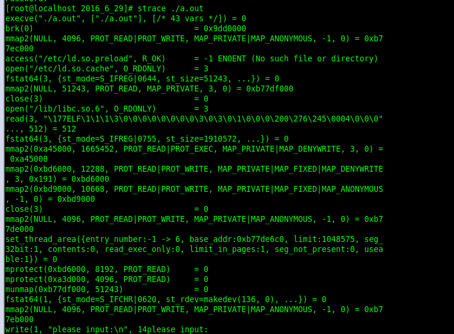
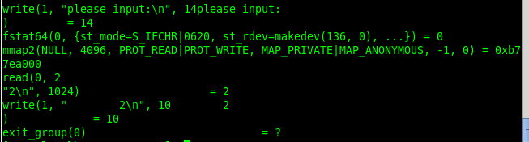
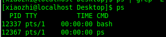
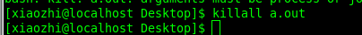
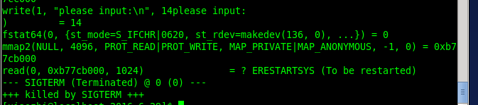
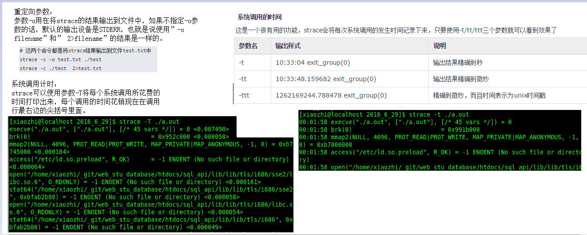
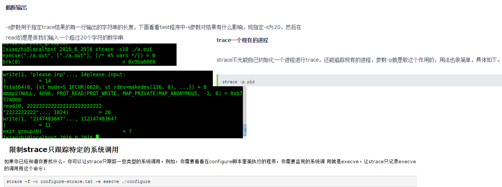

# strace命令详解


原文链接：https://www.cnblogs.com/machangwei-8/p/10388883.html


[基础命令学习目录首页](https://www.cnblogs.com/machangwei-8/p/9299013.html)

 

### strace是什么？

按照strace官网的描述, strace是一个可用于诊断、调试和教学的Linux用户空间跟踪器。我们用它来监控用户空间进程和内核的交互，比如系统调用、信号传递、进程状态变更等。

> strace底层使用内核的ptrace特性来实现其功能。

在运维的日常工作中，故障处理和问题诊断是个主要的内容，也是必备的技能。strace作为一种动态跟踪工具，能够帮助运维高效地定位进程和服务故障。它像是一个侦探，通过系统调用的蛛丝马迹，告诉你异常的真相。

### strace能做什么？

运维工程师都是实践派的人，我们还是先来个例子吧。

我们从别的机器copy了个叫做some_server的软件包过来，开发说直接启动就行，啥都不用改。可是尝试启动时却报错，根本起不来！

启动命令：

```
./some_server ../conf/some_server.conf
```

输出:

```
FATAL: InitLogFile failed iRet: -1!
Init error: -1655
```

为什么起不来呢？从日志看，似乎是初始化日志文件失败，真相到底怎样呢？我们用strace来看看。

```
strace -tt -f  ./some_server ../conf/some_server.conf
```

输出:

 

我们注意到，在输出InitLogFile failed错误的前一行，有个open系统调用:

```
23:14:24.448034 open("/usr/local/apps/some_server/log//server_agent.log", O_RDWR|O_CREAT|O_APPEND|O_LARGEFILE, 0666) = -1 ENOENT (No such file or directory)
```

它尝试打开文件/usr/local/apps/some_server/log//server_agent.log来写(不存在则创建)，可是却出错了，返回码是-1, 系统错误号errorno为ENOENT。 查下open系统调用的手册页：

man 2 open

搜索ENOENT这个错误号errno的解释

> ENOENT O_CREAT  is not set and the named file does not exist.  Or, a directory component in pathname does not exist or is a dangling symbolic link.

这里说得比较清楚，因为我们例子中的open选项指定了O_CREAT选项，这里errno为ENOENT的原因是日志路径中某个部分不存在或者是一个失效的符号链接。我们来一级一级看下路径中的哪部分不存在：

```
ls -l /usr/local/apps/some_server/log
ls: cannot access /usr/local/apps/some_server/log: No such file or directory
ls -l /usr/local/apps/some_server
total 8
drwxr-xr-x 2 root users 4096 May 14 23:13 bin
drwxr-xr-x 2 root users 4096 May 14 22:48 conf
```

**原来是log子目录不存在！上层目录都是存在的。手工创建log子目录后，服务就能正常启动了。**

**回过头来， strace究竟能做什么呢？**

> 它能够打开应用进程的这个黑盒，通过系统调用的线索，告诉你进程大概在干嘛。

### strace怎么用？

既然strace是用来跟踪用户空间进程的系统调用和信号的，在进入strace使用的主题之前，我们的先理解什么是系统调用。

关于系统调用：

按维基百科中的解释，在计算机中，系统调用（英语：system call），又称为系统呼叫，**指运行在用户空间的程序向操作系统内核请求需要更高权限运行的服务。**

系统调用提供用户程序与操作系统之间的接口。操作系统的进程空间分为用户空间和内核空间：

- 操作系统内核直接运行在硬件上，提供设备管理、内存管理、任务调度等功能。
- 用户空间通过API请求内核空间的服务来完成其功能——内核提供给用户空间的这些API, 就是系统调用。

在Linux系统上，应用代码通过glibc库封装的函数，间接使用系统调用。

Linux内核目前有300多个系统调用，详细的列表可以通过syscalls手册页查看。这些系统调用主要分为几类：

```
文件和设备访问类 比如open/close/read/write/chmod等
进程管理类 fork/clone/execve/exit/getpid等
信号类 signal/sigaction/kill 等
内存管理 brk/mmap/mlock等
进程间通信IPC shmget/semget * 信号量，共享内存，消息队列等
网络通信 socket/connect/sendto/sendmsg 等
其他
```

熟悉Linux系统调用/系统编程，能够让我们在使用strace时[得心应手](https://www.baidu.com/s?wd=得心应手&tn=24004469_oem_dg&rsv_dl=gh_pl_sl_csd)。不过，对于运维的问题定位来说，知道strace这个工具，会查系统调用手册，就差不多够了。

> 想要深入了解的同学，建议阅读[《Linux系统编程》](https://www.baidu.com/s?wd=《Linux系统编程》&tn=24004469_oem_dg&rsv_dl=gh_pl_sl_csd), [《Unix环境高级编程》](https://www.baidu.com/s?wd=《Unix环境高级编程》&tn=24004469_oem_dg&rsv_dl=gh_pl_sl_csd)等书籍。

我们回到strace的使用上来。strace有两种运行模式。

一种是通过它启动要跟踪的进程。用法很简单，在原本的命令前加上strace即可。比如我们要跟踪 "ls -lh /var/log/messages" 这个命令的执行，可以这样：

```
strace ls -lh /var/log/messages
```

另外一种运行模式，是跟踪已经在运行的进程，在不中断进程执行的情况下，理解它在干嘛。 这种情况，给strace传递个-p pid 选项即可。

比如，有个在运行的some_server服务，第一步，查看pid:

```
pidof some_server                      
17553
```

得到其pid 17553然后就可以用strace跟踪其执行:

```
strace -p 17553
```

完成跟踪时，按ctrl + C 结束strace即可。

strace有一些选项可以调整其行为，我们这里介绍下其中几个比较常用的，然后通过示例讲解其实际应用效果。

strace常用选项：

从一个示例命令来看：

```
strace -tt -T -v -f -e trace=file -o /data/log/strace.log -s 1024 -p 23489
```

> -tt 在每行输出的前面，显示毫秒级别的时间
> -T 显示每次系统调用所花费的时间
> -v 对于某些相关调用，把完整的环境变量，文件stat结构等打出来。
> -f 跟踪目标进程，以及目标进程创建的所有子进程
> -e 控制要跟踪的事件和跟踪行为,比如指定要跟踪的系统调用名称
> -o 把strace的输出单独写到指定的文件
> -s 当系统调用的某个参数是字符串时，最多输出指定长度的内容，默认是32个字节
> -p 指定要跟踪的进程pid, 要同时跟踪多个pid, 重复多次-p选项即可。

**实例：跟踪nginx, 看其启动时都访问了哪些文件**

```
strace -tt -T -f -e trace=file -o /data/log/strace.log -s 1024 ./nginx
```

部分输出:

 

输出中，第一列显示的是进程的pid, 接着是毫秒级别的时间，这个是-tt 选项的效果。

每一行的最后一列，显示了该调用所花的时间，是-T选项的结果。

这里的输出只显示和文件访问有关的内容，这是因为我们通过-e trace=file 选项指定了。

### strace问题定位案例

1、定位进程异常退出

问题：机器上有个叫做run.sh的常驻脚本，运行一分钟后会死掉。需要查出死因。

定位：进程还在运行时，通过ps命令获取其pid, 假设我们得到的pid是24298

```
strace -o strace.log -tt -p 24298
```

查看strace.log, 我们在最后2行看到如下内容:

```
22:47:42.803937 wait4(-1,  <unfinished ...>
22:47:43.228422 +++ killed by SIGKILL +++
```

这里可以看出，进程是被其他进程用KILL信号杀死的。

实际上，通过分析，我们发现机器上别的服务有个监控脚本，它监控一个也叫做run.sh的进程，当发现run.sh进程数大于2时，就会把它杀死重启。结果导致我们这个run.sh脚本被误杀。

进程被杀退出时，strace会输出killed by SIGX(SIGX代表发送给进程的信号)等，那么，进程自己退出时会输出什么呢？

这里有个叫做test_exit的程序，其代码如下:

```
#include <stdio.h>
#include <stdlib.h>

int main(int argc, char **argv) {
       exit(1);
}
```

我们strace看下它退出时strace上能看到什么痕迹。

```
strace -tt -e trace=process -f ./test_exit
```

说明: -e trace=process 表示只跟踪和进程管理相关的系统调用。

输出：

```
23:07:24.672849 execve("./test_exit", ["./test_exit"], [/* 35 vars */]) = 0
23:07:24.674665 arch_prctl(ARCH_SET_FS, 0x7f1c0eca7740) = 0
23:07:24.675108 exit_group(1)           = ?
23:07:24.675259 +++ exited with 1 +++
```

可以看出，进程自己退出时（调用exit函数，或者从main函数返回）, 最终调用的是exit_group系统调用， 并且strace会输出exited with X（X为退出码）。

可能有人会疑惑，代码里面明明调用的是exit, 怎么显示为exit_group?

> 这是因为这里的exit函数不是系统调用，而是glibc库提供的一个函数，exit函数的调用最终会转化为exit_group系统调用，它会退出当前进程的所有线程。实际上，有一个叫做_exit()的系统调用(注意exit前面的下划线), 线程退出时最终会调用它。

2、定位共享内存异常

有个服务启动时报错：

```
shmget 267264 30097568: Invalid argument
Can not get shm...exit!
```

错误日志大概告诉我们是获取共享内存出错，通过strace看下：

```
strace -tt -f -e trace=ipc ./a_mon_svr     ../conf/a_mon_svr.conf
```

输出：

```
22:46:36.351798 shmget(0x5feb, 12000, 0666) = 0
22:46:36.351939 shmat(0, 0, 0)          = ?
Process 21406 attached
22:46:36.355439 shmget(0x41400, 30097568, 0666) = -1 EINVAL (Invalid argument)
shmget 267264 30097568: Invalid argument
Can not get shm...exit!
```

这里，我们通过-e trace=ipc 选项，让strace只跟踪和进程通信相关的系统调用。

从strace输出，我们知道是shmget系统调用出错了，errno是EINVAL。同样， 查询下shmget手册页，搜索EINVAL的错误码的说明:

> EINVAL A new segment was to be created and size < SHMMIN or size > SHMMAX, or no new segment was to be created, a segment with given key existed, but size is greater than the size of that segment

翻译下，shmget设置EINVAL错误码的原因为下列之一：

- 要创建的共享内存段比 SHMMIN小 (一般是1个字节)
- 要创建的共享内存段比 SHMMAX 大 (内核参数kernel.shmmax配置)
- 指定key的共享内存段已存在，其大小和调用shmget时传递的值不同。

从strace输出看，我们要连的共享内存key 0x41400, 指定的大小是30097568字节，明显与第1、2种情况不匹配。那只剩下第三种情况。使用ipcs看下是否真的是大小不匹配：

```
ipcs  -m | grep 41400
key        shmid      owner      perms      bytes      nattch     status    
0x00041400 1015822    root       666        30095516   1
```

可以看到，已经0x41400这个key已经存在，并且其大小为30095516字节，和我们调用参数中的30097568不匹配，于是产生了这个错误。

在我们这个案例里面，导致共享内存大小不一致的原因，是一组程序中，其中一个编译为32位，另外一个编译为64位,代码里面使用了long这个变长int数据类型。

> 把两个程序都编译为64解决了这个问题。

**这里特别说下strace的-e trace选项。**

要跟踪某个具体的系统调用，-e trace=xxx即可。但有时候我们要跟踪一类系统调用，比如所有和文件名有关的调用、所有和内存分配有关的调用。

如果人工输入每一个具体的系统调用名称，可能容易遗漏。于是strace提供了几类常用的系统调用组合名字。

> -e trace=file   跟踪和文件访问相关的调用(参数中有文件名)
> -e trace=process  和进程管理相关的调用，比如fork/exec/exit_group
> -e trace=network  和网络通信相关的调用，比如socket/sendto/connect
> -e trace=signal   信号发送和处理相关，比如kill/sigaction
> -e trace=desc  和文件描述符相关，比如write/read/select/epoll等
> -e trace=ipc 进程见同学相关，比如shmget等

绝大多数情况，我们使用上面的组合名字就够了。实在需要跟踪具体的系统调用时，可能需要注意C库实现的差异。

> 比如我们知道创建进程使用的是fork系统调用，但在glibc里面，fork的调用实际上映射到了更底层的clone系统调用。使用strace时，得指定-e trace=clone, 指定-e trace=fork什么也匹配不上。

3、 性能分析

假如有个需求，统计Linux 4.5.4 版本内核中的代码行数(包含汇编和C代码)。这里提供两个Shell脚本实现：

poor_script.sh:

>  !/bin/bash
>  total_line=0
>  while read filename; do
>  line=$(wc -l $filename | awk ‘{print $1}’)
>  (( total_line += line ))
>  done < <( find linux-4.5.4 -type f  ( -iname ‘*.c’ -o -iname ‘*.h’ -o -iname ‘*.S’ ) )
>  echo “total line: $total_line”

good_script.sh:

> !/bin/bash
> find linux-4.5.4 -type f  ( -iname ‘*.c’ -o -iname ‘*.h’ -o -iname ‘*.S’ ) -print0 \
> | wc -l —files0-from - | tail -n 1

两段代码实现的目的是一样的。 我们通过strace的-c选项来分别统计两种版本的系统调用情况和其所花的时间(使用-f同时统计子进程的情况)

从两个输出可以看出，good_script.sh 只需要2秒就可以得到结果：19613114行。它大部分的调用(calls)开销是文件操作(read/open/write/close)等，统计代码行数本来就是干这些事情。

而poor_script.sh完成同样的任务则花了539秒。它大部分的调用开销都在进程和内存管理上(wait4/mmap/getpid…)。

实际上，从两个图中clone系统调用的次数,我们可以看出good_script.sh只需要启动3个进程，而poor_script.sh完成整个任务居然启动了126335个进程！

> 而进程创建和销毁的代价是相当高的，性能不差才怪。

### 总结

当发现进程或服务异常时，我们可以通过strace来跟踪其系统调用，“看看它在干啥”，进而找到异常的原因。熟悉常用系统调用，能够更好地理解和使用strace。

当然，万能的strace也不是真正的万能。当目标进程卡死在用户态时，strace就没有输出了。

这个时候我们需要其他的跟踪手段，比如gdb/perf/SystemTap等。

备注：

1、perf原因kernel支持

2、ftrace  kernel支持可编程

3、systemtap 功能强大，[RedHat](http://www.linuxidc.com/topicnews.aspx?tid=10)系统支持，对用户态，内核态逻辑都能探查，使用范围更广

本文永久更新链接地址：[http://www.linuxidc.com/Linux/2018-01/150654.htm](https://www.linuxidc.com/Linux/2018-01/150654.htm)

 

原文链接：http://blog.51cto.com/10541556/1793898

strace常用来跟踪进程执行时的系统调用和所接收的信号。 在Linux世界，进程不能直接访问硬件设备，当进程需要访问硬件设备(比如读取磁盘文件，接收网络数据等等)时，必须由用户态模式切换至内核态模式，通 过系统调用访问硬件设备。strace可以跟踪到一个进程产生的系统调用,包括参数，返回值，执行消耗的时间。

  strace命令是一个集诊断、调试、统计与一体的工具，我们可以使用strace对应用的系统调用和信号传递的跟踪结果来对应用进行分析，以达到解决问题或者是了解应用工作过程的目的。当然strace与专业的调试工具比如说gdb之类的是没法相比的，因为它不是一个专业的调试器。 strace的最简单的用法就是执行一个指定的命令，在指定的命令结束之后它也就退出了。在命令执行的过程中，strace会记录和解析命令进程的所有系统调用以及这个进程所接收到的所有的信号值。

 

```
root@ubuntu:/usr# strace cat /dev/ 
execve(, [, ], []) = 
brk()                                  = 
access(, F_OK)      = - ENOENT (No such file or directory)
mmap(NULL, , PROT_READ|PROT_WRITE, MAP_PRIVATE|MAP_ANONYMOUS, -, ) = 
access(, R_OK)      = - ENOENT (No such file or directory)
...
brk() = 
brk() = 
fstat(, {st_mode=S_IFCHR|, st_rdev=makedev(, ), ...}) = 
open(, O_RDONLY) = 
fstat(, {st_mode=S_IFCHR|, st_rdev=makedev(, ), ...}) = 
read(, , ) = 
close() = 
close() = 
close() = 
exit_group() = ?
```

每一行都是一条系统调用，等号左边是系统调用的函数名及其参数，右边是该调用的返回值。
strace 显示这些调用的参数并返回符号形式的值。strace 从内核接收信息，而且不需要以任何特殊的方式来构建内核。

**strace参数**

```
-c 统计每一系统调用的所执行的时间,次数和出错的次数等. 
-d 输出strace关于标准错误的调试信息. 
-f 跟踪由fork调用所产生的子进程. 
-ff 如果提供-o filename,则所有进程的跟踪结果输出到相应的filename.pid中,pid是各进程的进程号. 
-F 尝试跟踪vfork调用.在-f时,vfork不被跟踪. 
-h 输出简要的帮助信息. 
-i 输出系统调用的入口指针. 
-q 禁止输出关于脱离的消息. 
-r 打印出相对时间关于,,每一个系统调用. 
-t 在输出中的每一行前加上时间信息. 
-tt 在输出中的每一行前加上时间信息,微秒级. 
-ttt 微秒级输出,以秒了表示时间. 
-T 显示每一调用所耗的时间. 
-v 输出所有的系统调用.一些调用关于环境变量,状态,输入输出等调用由于使用频繁,默认不输出. 
-V 输出strace的版本信息. 
-x 以十六进制形式输出非标准字符串 
-xx 所有字符串以十六进制形式输出. 
-a column 
设置返回值的输出位置.默认 为40. 
-e expr 
指定一个表达式,用来控制如何跟踪.格式如下: 
[qualifier=][!]value1[,value2]... 
qualifier只能是 trace,abbrev,verbose,raw,signal,read,write其中之一.value是用来限定的符号或数字.默认的 qualifier是 trace.感叹号是否定符号.例如: 
-eopen等价于 -e trace=open,表示只跟踪open调用.而-etrace!=open表示跟踪除了open以外的其他调用.有两个特殊的符号 all 和 none. 
注意有些shell使用!来执行历史记录里的命令,所以要使用\\. 
-e trace= 
只跟踪指定的系统 调用.例如:-e trace=open,close,rean,write表示只跟踪这四个系统调用.默认的为set=all. 
-e trace=file 
只跟踪有关文件操作的系统调用. 
-e trace=process 
只跟踪有关进程控制的系统调用. 
-e trace=network 
跟踪与网络有关的所有系统调用. 
-e strace=signal 
跟踪所有与系统信号有关的 系统调用 
-e trace=ipc 
跟踪所有与进程通讯有关的系统调用 
-e abbrev= 
设定 strace输出的系统调用的结果集.-v 等与 abbrev=none.默认为abbrev=all. 
-e raw= 
将指 定的系统调用的参数以十六进制显示. 
-e signal= 
指定跟踪的系统信号.默认为all.如 signal=!SIGIO(或者signal=!io),表示不跟踪SIGIO信号. 
-e read= 
输出从指定文件中读出 的数据.例如: 
-e read=, 
-e write= 
输出写入到指定文件中的数据. 
-o filename 
将strace的输出写入文件filename 
-p pid 
跟踪指定的进程pid. 
-s strsize 
指定输出的字符串的最大长度.默认为32.文件名一直全部输出. 
-u username 
以username 的UID和GID执行被跟踪的命令
```

 

**通用的完整用法：**

```
strace -o output.txt -T -tt -e trace=all -p 28979
strace -o output.txt -T -tt -f -e trace=file -p 
```

上面的含义是 跟踪28979进程的所有系统调用（-e trace=all），并统计系统调用的花费时间，以及开始时间（并以可视化的时分秒格式显示），最后将记录结果存在output.txt文件里面。

语法

 strace [ -dffhiqrtttTvxx ] [ -acolumn ] [ -eexpr ] ... [ -ofile ] [-ppid ] ... [ -sstrsize ] [ -uusername ] [ -Evar=val ] ... [ -Evar ]... [ command [ arg ... ] ]

 strace -c [ -eexpr ] ... [ -Ooverhead ] [ -Ssortby ] [ command [ arg... ] ]

**追踪系统调用** 

  现在我们做一个很简单的程序来演示strace的基本用法。这个程序的C语言代码如下：

```
#include<stdio.h>
int main()
{
    int a=0;
    printf("please input:\n");
    scanf("%d",&a);
    printf("%9d\n",a);                                                      
    return 0;
}
```

 

 




从trace结构可以看到，系统首先调用execve开始一个新的进行，接着进行些环境的初始化操作，最后停顿在”read(0,”上面，这也就是执行到了我们的scanf函数，等待我们输入数字呢，在输入完99之后，在调用write函数将格式化后的数值"     2″输出到屏幕，最后调用exit_group退出进行，完成整个程序的执行过程。


跟踪信号传递

我们还是使用上面的那个test程序，来观察进程接收信号的情况。

 





系统调用统计

strace不光能追踪系统调用，通过使用参数-c，它还能将进程所有的系统调用做一个统计分析给你，下面就来看看strace的统计，这次我们执行带-c参数的strace：


这里很清楚的告诉你调用了那些系统函数，调用次数多少，消耗了多少时间等等这些信息，这个对我们分析一个程序来说是非常有用的。





