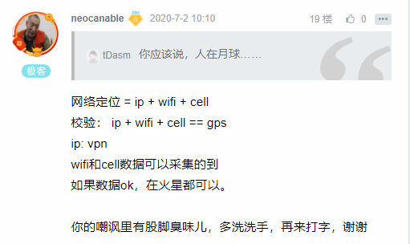

### 改机 - 从源码着手任意修改GPS地理位置

## 改机 - 从源码着手任意修改GPS地理位置

#### 需求：随意修改定位

android在改机过程中，经常会遇到随意修改位置GPS的需求。

 

修改GPS的方式有很多种：

1. xposed hook
2. MockLocation
3. 修改源码

以上三种方式都能修改gps随意修改gps坐标，各有优缺点：xposed隐藏不好，容易被发现；MockLocation容易在开发者模式和gps provider被识别；改源码，编译麻烦，而且不一定有源码；前两种方式具有普适性，改源码费时费力，局限性比较强；

 

秉承明知山有虎，偏向虎上行的心态，尝试阅读以下android的源码，并且修改gps部分的代码；

 

**具体原理：切断hal层和framework之间的通讯，模仿硬件向framework通知硬件信息**

 

样例：android 8.0

##### 1. gps jni callback

```
struct GnssCallback : public IGnssCallback {
    Return<void> gnssLocationCb(
          const android::hardware::gnss::V1_0::GnssLocation& location) override; // gps位置变化回调函数
    Return<void> gnssStatusCb(const IGnssCallback::GnssStatusValue status) override; // gps状态变化回调函数
    Return<void> gnssSvStatusCb(const IGnssCallback::GnssSvStatus& svStatus) override; // 卫星状态变化回调函数
    Return<void> gnssNmeaCb(int64_t timestamp, const android::hardware::hidl_string& nmea) override;
    Return<void> gnssSetCapabilitesCb(uint32_t capabilities) override;
    Return<void> gnssAcquireWakelockCb() override;
    Return<void> gnssReleaseWakelockCb() override;
    Return<void> gnssRequestTimeCb() override;
    Return<void> gnssSetSystemInfoCb(const IGnssCallback::GnssSystemInfo& info) override;
 
    static GnssSvInfo sGnssSvList[static_cast<uint32_t>(
            android::hardware::gnss::V1_0::GnssMax::SVS_COUNT)];
    static size_t sGnssSvListSize;
 
    static const char* sNmeaString;
    static size_t sNmeaStringLength;
};
// 省略......
Return<void> GnssCallback::gnssLocationCbImpl(const T& location) {
    JNIEnv* env = getJniEnv();
    jobject jLocation = translateGnssLocation(env, location);
    env->CallVoidMethod(mCallbacksObj,
                        method_reportLocation, // frameworks
                        boolToJbool(hasLatLong(location)),
                        jLocation);
    checkAndClearExceptionFromCallback(env, __FUNCTION__);
    env->DeleteLocalRef(jLocation);
    return Void();
}
 
// 省略......
 method_reportLocation = env->GetMethodID(clazz, "reportLocation",
            "(ZLandroid/location/Location;)V");
```

GnssCallback的作用就是在gps模块位置、状态、精度等信息变化后，通知上层应用的回调函数类。

##### 2. framework

可以发现，在gps硬件模块拿到新的位置时，通知framework调用java的函数是**reportLocation**, 源码如下：

```
/*
  * @hasLatLong: 地理位置是否合法
  * @loction: 地理位置
*/
private void reportLocation(boolean hasLatLong, Location location) {
     if (location.hasSpeed()) {
         mItarSpeedLimitExceeded = location.getSpeed() > ITAR_SPEED_LIMIT_METERS_PER_SECOND;
     }
 
     if (mItarSpeedLimitExceeded) {
         Log.i(TAG, "Hal reported a speed in excess of ITAR limit." +
                 "  GPS/GNSS Navigation output blocked.");
         mGnssMetrics.logReceivedLocationStatus(false);
         return;
     }
 
     if (VERBOSE) Log.v(TAG, "reportLocation " + location.toString());
 
     synchronized (mLocation) {
         mLocation = location;
         // It would be nice to push the elapsed real-time timestamp
         // further down the stack, but this is still useful
         mLocation.setElapsedRealtimeNanos(SystemClock.elapsedRealtimeNanos());
         mLocation.setExtras(mLocationExtras);
 
         try {
             mILocationManager.reportLocation(mLocation, false);
         } catch (RemoteException e) {
             Log.e(TAG, "RemoteException calling reportLocation");
         }
     }
 
     mGnssMetrics.logReceivedLocationStatus(hasLatLong);
     if (hasLatLong) {
         if (location.hasAccuracy()) {
             mGnssMetrics.logPositionAccuracyMeters(location.getAccuracy());
         }
         if (mTimeToFirstFix > 0) {
             int timeBetweenFixes = (int) (SystemClock.elapsedRealtime() - mLastFixTime);
             mGnssMetrics.logMissedReports(mFixInterval, timeBetweenFixes);
         }
     }
 
     mLastFixTime = SystemClock.elapsedRealtime();
     // report time to first fix
     if (mTimeToFirstFix == 0 && hasLatLong) {
         mTimeToFirstFix = (int)(mLastFixTime - mFixRequestTime);
         if (DEBUG) Log.d(TAG, "TTFF: " + mTimeToFirstFix);
         mGnssMetrics.logTimeToFirstFixMilliSecs(mTimeToFirstFix);
 
         // notify status listeners
         mListenerHelper.onFirstFix(mTimeToFirstFix);
     }
 
     if (mSingleShot) {
         stopNavigating();
     }
 
     if (mStarted && mStatus != LocationProvider.AVAILABLE) {
         // we want to time out if we do not receive a fix
         // within the time out and we are requesting infrequent fixes
         if (!hasCapability(GPS_CAPABILITY_SCHEDULING) && mFixInterval < NO_FIX_TIMEOUT) {
             mAlarmManager.cancel(mTimeoutIntent);
         }
 
         // send an intent to notify that the GPS is receiving fixes.
         Intent intent = new Intent(LocationManager.GPS_FIX_CHANGE_ACTION);
         intent.putExtra(LocationManager.EXTRA_GPS_ENABLED, true);
         mContext.sendBroadcastAsUser(intent, UserHandle.ALL);
         updateStatus(LocationProvider.AVAILABLE, mSvCount, mMeanCn0, mMaxCn0);
     }
 
    if (!hasCapability(GPS_CAPABILITY_SCHEDULING) && mStarted &&
            mFixInterval > GPS_POLLING_THRESHOLD_INTERVAL) {
         if (DEBUG) Log.d(TAG, "got fix, hibernating");
         hibernate();
     }
}
```

自此，刨除hal层，android系统就获取到了一个地理位置。原理了解后，就可以动手修改源码了。

##### 3. 切断hal层调用

**GnssLocationProvider.cpp**

```
#include <sys/system_properties.h>
// ....... 省略
Return<void> GnssCallback::gnssLocationCbImpl(const T& location) {
      // 定义一个系统开关，可以自由控制
      char property[PROP_VALUE_MAX];
      int len = __system_property_get("gps.location.custom", property);
      if(len > 0) {
      if(strcmp(property, "1") == 0) return Void();
    }
    // ...... 省略
}
```

##### 4. 在framework中添加一个public函数

**LocationManager.java**

```
// ...... 省略
public void reportCustomLocation(Location location) {
  mService.reportLocation(true, location);
}
```

##### 5. 编译rom

```
make update-api # 在LocationManager中添加了新的接口
make -j32       # 炫耀一下我32核的的机器
```

##### 5. 在APK中使用

**MainActivity.java**

```
// ...... 省略
Button btn = findViewById(R.id.test_btn);
btn.setOnClickListener(new View.OnClickListener() {
            public void onClick(View v) {
                try {
                    Location l = new Location("gps");
                    l.setLatitude(41.055962);
                    l.setLongitude(110.307711);
                    l.setAccuracy(2.0f);
                    l.setTime(System.currentTimeMillis());
                    l.setElapsedRealtimeNanos(System.currentTimeMillis());
                    l.setAccuracy(1.0f);
                      locationManager.reportCustomLocation(l);
                    Location lo = locationManager.getLastKnownLocation(provider);
                    Log.d(TAG, lo.toString());
                } catch (Exception e) {
                    e.printStackTrace();
                }
            }
        });
}
```





