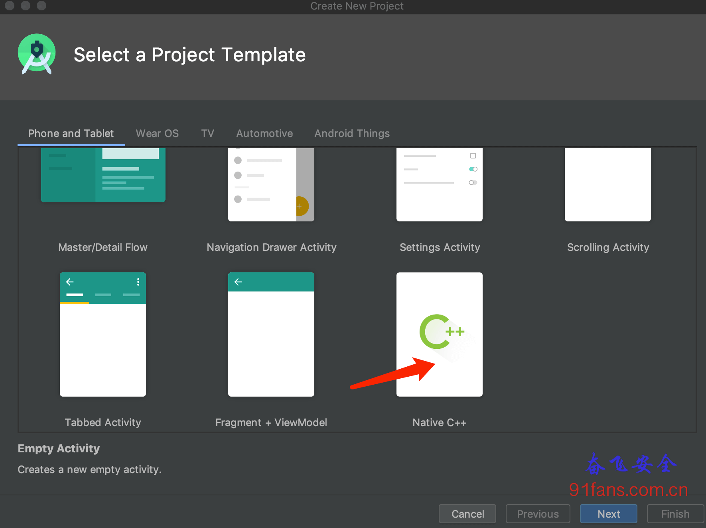

# AndroidNativeEmu使用指南

## 一、目标

我们之前介绍过 [Unicorn来执行Android原生的so](http://91fans.com.cn/post/unicornone/),Unicorn只是虚拟了cpu，执行纯算法的函数是足够用了，但是如果函数中含有系统调用之类的操作，Unicorn就无能为力了。本文介绍一个新朋友 AndroidNativeEmu 他模拟了 JNI调用API、内存分配、VFP和一些系统调用。大大的增强了我们模拟执行so的能力。

原始GitHub链接

https://github.com/AeonLucid/AndroidNativeEmu

本文使用的版本

https://github.com/maiyao1988/ExAndroidNativeEmu

## 二、步骤

### 我们先用Android Studio 4.0 来编译一个so

###### Tip:

现在用AS4创建so工程很简单了，不需要那么多手工操作，直接用向导创建一个 Native C++ 工程即可

1:Create Native C++

当执行java的native方法时，虚拟机怎么知道要调用so中那个方法呢？这个就需要注册，通过注册把java的方法和so的方法绑定在一起，这样就可以找到对应的方法了，有俩种注册的方式即 静态注册 和 动态注册:

我们自动生成的项目就是静态注册的，我们看下代码

```c++
extern "C" JNIEXPORT jstring JNICALL
Java_com_fenfei_myndk_MainActivity_stringFromJNI(
        JNIEnv* env,
        jobject /* this */) {
    std::string hello = "Hello from C++";
    return env->NewStringUTF(hello.c_str());
}
```

静态注册按照 **Java_包名_类名_方法名** 的规则生成了Native函数

动态注册需要我们增加JNI_OnLoad()函数来手动注册

```c++
// 获取数组的大小
# define NELEM(x) ((int) (sizeof(x) / sizeof((x)[0])))
// 指定要注册的类，对应完整的java类名
#define JNIREG_CLASS "com/fenfei/myndk/MainActivity"


// 返回字符串"hello load jni"
JNIEXPORT jstring JNICALL native_hello(JNIEnv *env, jclass clazz)
{
    return env->NewStringUTF("fenfei hello load jni.");
}

// Java和JNI函数的绑定表
static JNINativeMethod method_table[] = {
    { "HelloLoad", "()Ljava/lang/String;", (void*)native_hello },//绑定
};

// 注册native方法到java中
static int registerNativeMethods(JNIEnv* env, const char* className,
        JNINativeMethod* gMethods, int numMethods)
{
    jclass clazz;
    clazz = env->FindClass(className);
    if (clazz == NULL) {
        return JNI_FALSE;
    }
    if ( env->RegisterNatives(clazz, gMethods, numMethods) < 0) {
        return JNI_FALSE;
    }

    return JNI_TRUE;
}

int register_ndk_load(JNIEnv *env)
{
    // 调用注册方法
    return registerNativeMethods(env, JNIREG_CLASS,
            method_table, NELEM(method_table));
}

JNIEXPORT jint JNI_OnLoad(JavaVM* vm, void* reserved)
{
    JNIEnv* env = NULL;
    jint result = -1;

    if ( vm->GetEnv((void**) &env, JNI_VERSION_1_4) != JNI_OK) {
        return result;
    }

    register_ndk_load(env);

    // 返回jni的版本
    return JNI_VERSION_1_4;
```

编译成libnative-lib.so，这样我们这个so里面就拥有了stringFromJNI和HelloLoad这两个函数。

### 初始化AndroidNativeEmu来执行so中的函数

```python
filename = "./libnative-lib.so"

# Initialize emulator
emulator = Emulator(
    vfp_inst_set = True,
    vfs_root=posixpath.join(posixpath.dirname(__file__), "vfs")
)

# Register Java class.
emulator.java_classloader.add_class(MainActivity)
emulator.mu.hook_add(UC_HOOK_CODE, hook_code, emulator)

emulator.mu.hook_add(UC_HOOK_MEM_WRITE, hook_mem_write)
emulator.mu.hook_add(UC_HOOK_MEM_READ, hook_mem_read)

# Load all libraries.
lib_module = emulator.load_library(filename)
```

执行的方法分成两种，一种是用call_symbol直接调用，另一种是创建与java名称相同的类来调用Native成员函数

```python
# 第一种方法，直接调用
strRc = emulator.call_symbol(lib_module, 'Java_com_fenfei_myndk_MainActivity_stringFromJNI',emulator.java_vm.jni_env.address_ptr,0x00)
print("stringFromJNI result call: %s" % strRc)

# 第二种方法，通过类成员函数来调用
# Do native stuff.
main_activity = MainActivity()
logger.info("Response from JNI call: %s" % main_activity.hello_load(emulator))
```

执行结果:

```bash
stringFromJNI result call: Hello from C++
...
__main__ | Response from JNI call: fenfei hello load jni.
```

## 三、总结

AndroidNativeEmu提高了so模拟执行的成功率，为我们调试和分析so提供了强大的支持，后面我们继续用AndroidNativeEmu来分析和还原OLLVM混淆后的算法。