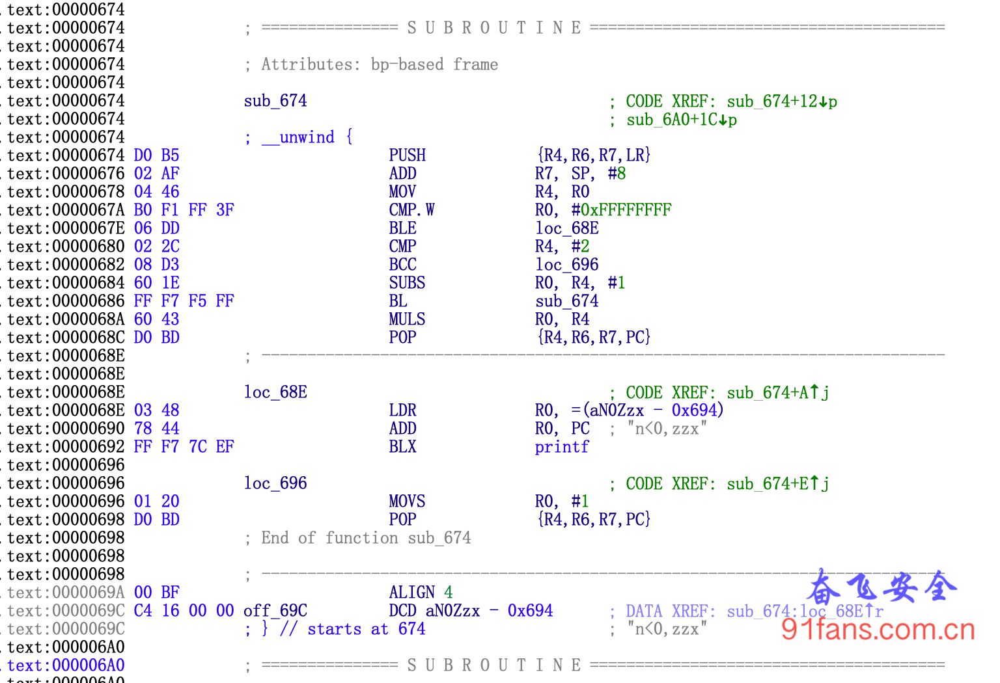

# Unicorn用法示例(一)


## 一、目标

Unicorn 是一款非常优秀的跨平台模拟执行框架，该框架可以跨平台执行多种指令集的原生程序。本文介绍如何用Unicorn来执行Android原生的so

## 二、分析

1. 先用Android NDK来编译一个so
2. ida分析

## 三、代码

我们先用Android NDK 来编译一个so

main.c

```c
#include <stdio.h>
#include <string.h>
#include <dlfcn.h>
#include <jni.h>
#include <stdlib.h>

// 用递归方法求n!
int fac(int n)
{
    int f;
    if(n<0)
        printf("n<0,zzx");
    else if(n == 0||n == 1)
        f = 1;
    else
        f = fac(n-1)*n;
    return(f);
}


int main(int argc,char** argv)
{
    int a;
    scanf("%d", &a);
    printf("%d",fac(a));
	return 0;
}
```

编译之后， 输入4， 返回值是 24。

编译之后的so有arm64-v8a，armeabi-v7a， x86 ，x86_64等平台，我们这里选用armeabi-v7a来执行，用ida打开生成baseso，可以看出这次生成的fac函数在偏移0x674处。

1:facSub

现在我们用unicorn载入baseso，unicorn支持c++，python，go等多种语言，本文使用python

runmu.py

```python
from __future__ import print_function

import logging
import sys

from unicorn import *
from unicorn.arm_const import *

ADDRESS = 0x674         # 开始执行的地址
BASE = 0x00400000       # 代码段地址 #0xaef52000
CODE_SIZE = 8*1024*1024
STACK_ADDR = BASE + CODE_SIZE
STACK_SIZE = 1024 * 1024
PARAM_ADDR = STACK_ADDR + STACK_SIZE
PARAM_SIZE = 1024 * 1024

# Configure logging
logging.basicConfig(
    stream=sys.stdout,
    level=logging.DEBUG,
    format="%(asctime)s %(levelname)7s %(name)34s | %(message)s"
)

logger = logging.getLogger(__name__)

# callback for tracing instructions
def hook_code(uc, address, size, user_data):
    print(">>> Tracing instruction at 0x%x, instruction size = 0x%x" %(address, size))

    pass

def main():
    print("Emulate ARM code")
    try:
        # 初始化模拟器为 ARCH_ARM 模式
        mu = Uc(UC_ARCH_ARM, UC_MODE_THUMB)

        # 初始化数据内存段
        mu.mem_map(PARAM_ADDR, PARAM_SIZE, UC_PROT_ALL)
        # 初始化代码内存段
        mu.mem_map(BASE, CODE_SIZE, UC_PROT_ALL)
        # 初始化堆栈内存段
        mu.mem_map(STACK_ADDR,STACK_SIZE,UC_PROT_ALL)

        with open('./base.so', 'rb') as fstream:
            data = fstream.read()
            # 把代码数据写入模拟器的代码段
            mu.mem_write(BASE,data)
            # print(len(data))

            # 设置参数为 4
            mu.reg_write(UC_ARM_REG_R0, 0x4)
            # 初始化sp寄存器
            mu.reg_write(UC_ARM_REG_SP, STACK_ADDR)

            # 写入执行完函数之后的 返回地址
            mu.reg_write(UC_ARM_REG_LR, BASE + 0x6A0)

            # 执行每条指令之前调用hook
            mu.hook_add(UC_HOOK_CODE, hook_code)


            # 通过BX Rn指令进行切换THUMB和ARM模式，如下图所示，Rn最低位是1时，通过BX Rn就切换到THUMB状态，为什么可以这样操作，因为不管是THUMB状态（地址2字节对齐）或者是ARM状态（地址四字节对齐）都不允许跳转到一个非对齐的地址，作为地址时Rn的最低位是被忽略的。这样就可以通过BX和Rn的最低有效位来判断跳转时跳到ARM状态（bit0为0），还是THUMB状态（最低有效位为1）
            # 开始运行虚拟CPU，因为是Thumb模式，所以地址的最低位需要置位。
            mu.emu_start(BASE + ADDRESS | 1, BASE + 0x6A0, 0, 0)

            # 执行完之后读取返回值， 这里应该是 24
            r0 = mu.reg_read(UC_ARM_REG_R0)

            print("rc %s" % r0)

    except UcError as e:
        print("ERROR: %s" % e)

    pass

if __name__ == '__main__':
    main()
```

执行python runmu.py , 结果 rc = 24。

本文代码下载 [unicornone.zip](http://d.91fans.com.cn/unicornone.zip)

### 参考

https://bbs.pediy.com/thread-253868.htm Unicorn 在 Android 的应用


# Unicorn用法示例(二)

## 一、目标

前一篇文章中，我们学习了如何用Unicorn来运行一段代码，但是它的执行过程我们看不见，出了bug也没法调试，所以我们需要一个调试器来分析代码。

###### Tip:

本文节选自看雪，无名侠的 "Unicorn 在 Android 的应用", 原文链接在文末参考处

这个调试器需要有如下功能:

- 下断点
- 读写寄存器
- 反汇编
- dump内存
- 单步调试（步入/步过）
- 快速接入各种不同的Unicorn项目

## 二、分析

Unicorn 提供了强大的指令级Hook（UC_HOOK_CODE）， 使得每一条指令执行前，我们都有机会处理。 UC_HOOK_CODE 的callback原型定义如下

```c++
typedef void (*uc_cb_hookcode_t)(uc_engine *uc, uint64_t address, uint32_t size, void *user_data);
```

- address: 当前执行的指令地址
- size: 当前指令的长度，如果长度未知，则为0
- user_data: hook_add 设置的user_data参数 调用hook_add 函数可以为指定的代码范围添加hook的callback。 python包中的hook_add函数原型如下

```python
def hook_add(self, htype, callback, user_data=None, begin=1, end=0, arg1=0):
pass
```

UC_HOOK_CODE 的功能是每条指令执行前调用callback。

callback中，我们可以通过参数得知指令执行地址、指令执行长度、虚拟机指针。 有了虚拟机指针，我们可以很方便的访问各种寄存器、内存等资源。在UC_HOOK_CODE的callback中，也可以直接修改PC寄存器来改变流程。

本文将编写一个UnicornDebugger 类，调试器的各种功能均在该类中实现， 调用该类的构造函数即可附加到一个Uc虚拟机对象上。 类的定义

### 附加调试器

```python
def test_arm():
		print("Emulate ARM code")
		try:
        # Initialize emulator in ARM mode
			    mu = Uc(UC_ARCH_ARM, UC_MODE_ARM)
		        mu.hook_add(UC_HOOK_CODE, hook_code, begin=ADDRESS, end=ADDRESS)

		        #debugger attach
			    udbg = UnicornDebugger(mu)
			    udbg.add_bpt(ADDRESS)

		except UcError as e:
			  print("ERROR: %s" % e)

if __name__ == '__main__':
    test_arm()
```

### 反汇编

Unicorn 并没有反汇编功能，虽然它的内部一定有与反汇编相关的代码。我们只能自己想办法反汇编。Unicorn 有一个兄弟，它叫Capstone。Capstone是一款支持多种处理器和开发语言的反汇编框架。 [Capstone 官方地址](http://www.capstone-engine.org/) 我将使用Capstone 作为调试模块的反汇编器。

#### 安装 Capstone

Capstone 对python的支持特别好，我们的开发语言是python3，所以直接使用pip 安装capstone 即可。

```python
pip install capstone
```

#### 快速入门 Capstone

Capstone 很强大，也可以很简单， 下面一段代码就是Capstone的入门例子。

```python
from capstone import *
from capstone.arm import *

CODE = b"\xf1\x02\x03\x0e\x00\x00\xa0\xe3\x02\x30\xc1\xe7\x00\x00\x53\xe3"

md = Cs(CS_ARCH_ARM, CS_MODE_ARM)
for i in md.disasm(CODE, 0x1000):
    print("%x:\t%s\t%s" %(i.address, i.mnemonic, i.op_str))
```

上面这段代码的输出如下

```python
1000:    mcreq    p2, #0, r0, c3, c1, #7
1004:    mov    r0, #0
1008:    strb    r3, [r1, r2]
100c:    cmp    r3, #0
```

## 三、代码

完整的代码在这里 [UnicornDebugger.py](http://d.91fans.com.cn/UnicornDebugger.py)

### 参考

https://bbs.pediy.com/thread-253868.htm Unicorn 在 Android 的应用