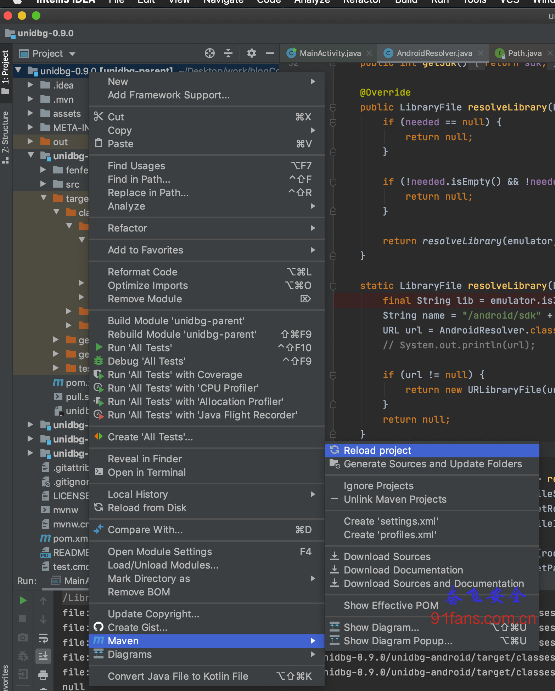
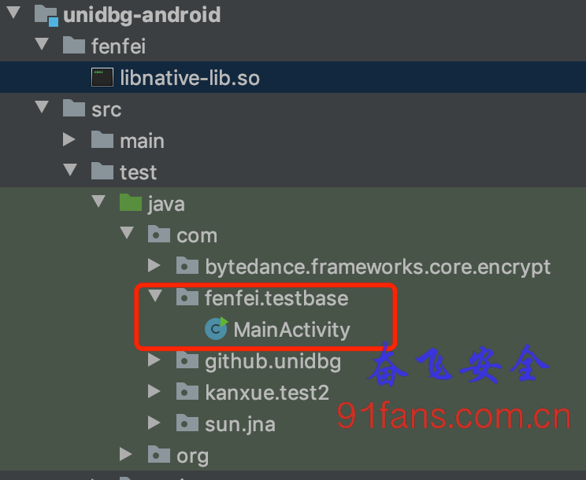
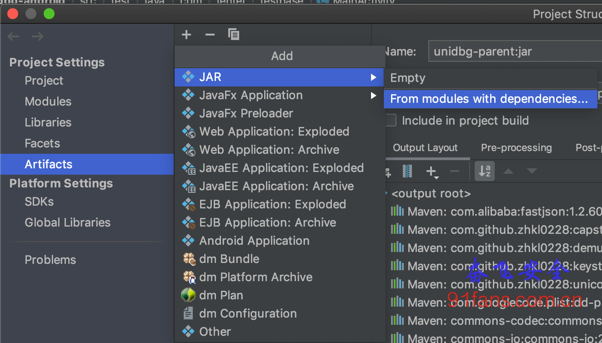
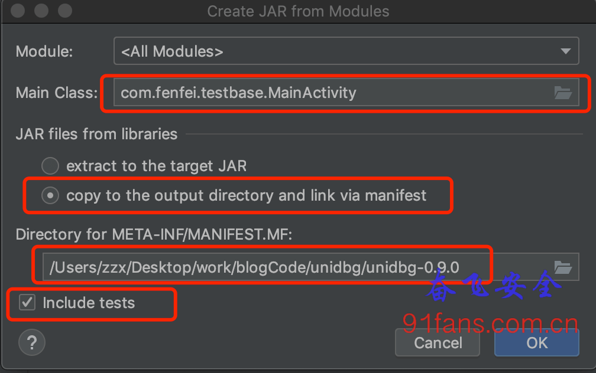
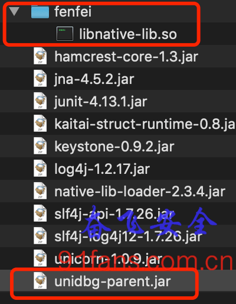

# Unidbg使用指南

## 一、目标

除了AndroidNativeEmu我们还有一个选择 Unidbg 来实现模拟执行so，

GitHub链接

https://github.com/zhkl0228/unidbg

特色

- 模拟JNI调用API，以便可以调用JNI_OnLoad。
- 支持JavaVM，JNIEnv。
- 模拟syscalls调用。
- 支持ARM32和ARM64。
- 基于HookZz实现的inline hook。
- 基于xHook实现的import hook。
- 支持 iOS fishhook 、 substrate 、 whale hook。
- 支持简单的控制台调试器，gdb，IDA android调试器服务器，指令跟踪，内存读/写跟踪。
- 支持iOS objc和Swift运行时。

好吧，看上去很强大的样子，我们来跑个Demo

## 二、步骤

### 先把IDEA配置好(java大佬忽略这一步)

奋飞不会java开发，所以装好IDEA就开始迫不及待的导入unidbg工程开始编译：

###### Tip:

IDEA导入unidbg工程参见 https://code.newban.cn/151.html

1. 报错 Error:(5, 24) java: 程序包io.kaitai.struct不存在

   ```
   好吧，装一个 brew install kaitai-struct-compiler
   ```

2. 继续报错 Error:(3, 34) java: 程序包org.apache.commons.logging不存在

   ```
   行吧，下载一个  commons-logging-1.2.jar
   ```

3. 还报错？ 不对劲，大神不可能这么难为凡人，一定是哪出了问题？？

google之，原来是Maven没有配置好。搞他

###### Tip:

Maven配置参见 https://zhuanlan.zhihu.com/p/28133184

搞定Maven之后如果还报错，那是因为依赖包没有下载下来，需要 reload 一下，静静的等依赖包下载完，反正奋飞是花了十多分钟。

1:reload

好了，这次完美编译过去了

### 执行so中的stringFromJNI函数

- 在unidbg-android目录下新建fenfei文件夹，把libnative-lib.so文件放进去

1:sofile

- 在unidbg-android/src/test/java/com下新建fenfei/testbase文件夹，然后新建个java类MainActivity

1:leipath

- 开始写代码了

```java
public class MainActivity {
    public static void main(String[] args) {
        MainActivity mainActivity = new MainActivity();
        mainActivity.stringFromJNI();
    }

    private final AndroidEmulator emulator;
    private final VM vm;
    private DvmClass cNative;


    private MainActivity() {
        emulator = new AndroidARMEmulator();
        Memory memory = emulator.getMemory();
        // 设置 sdk版本 23
        LibraryResolver resolver = new AndroidResolver(23);
        memory.setLibraryResolver(resolver);

        //创建DalvikVM，可以载入apk，也可以为null
        vm = emulator.createDalvikVM(null);
        // 是否打印日志
        vm.setVerbose(false);

        // System.out.println(getPath());
        // 载入要执行的 so
        DalvikModule dm = vm.loadLibrary(new File(getPath() + "/fenfei/libnative-lib.so"), false);
        dm.callJNI_OnLoad(emulator);
    }

    private void stringFromJNI() {
        // Jni调用的类
        cNative = vm.resolveClass("com/fenfei/myndk/MainActivity");
        DvmObject<?> strRc = cNative.callStaticJniMethodObject(emulator,"stringFromJNI()Ljava/lang/String;");

        System.out.println("call stringFromJNI rc = " + strRc.getValue());
    }

    public String getPath()
    {
        String path = this.getClass().getProtectionDomain().getCodeSource().getLocation().getPath();
        if(System.getProperty("os.name").contains("dows"))
        {
            path = path.substring(1,path.length());
        }
        if(path.contains("jar"))
        {
            // System.out.println("jar = " + path);
            path = path.substring(0,path.lastIndexOf("."));
            return path.substring(0,path.lastIndexOf("/"));
        }

        // System.out.println(path);
        // path.replace("target/classes/", "");
        return path.replace("/target/test-classes/", "");
    }
}
```

跑一下，成功输出,收工

```bash
call stringFromJNI rc = Hello from C++
```

慢着！李老板又出场了，

奋飞呀，调用so你得给我一个可执行程序呀，总不能让我老板的机器上也装个IDEA来陪你玩吧？

### 打包成jar包

1. File → Project Structure … 然后选择 Artifacts, 点加号 Add

1:add

1. jar → From modules with dependencies… 然后如下配置， 别忘了勾上 Include tests

1:createjar

1. OK了，Build → Build Artifacts 编译成功之后就在 unidbg-0.9.0/out/artifacts/unidbg_parent_jar 目录下生成了一堆依赖jar包和unidbg-parent.jar 我们把要载入的 fenfei/libnative-lib.so 放到和 unidbg-parent.jar同级目录

1:filepath

泡一下，成功输出，手工。 (努力的字都不会打了)

```bash
fenfeideMacBook-Pro:unidbg_parent_jar fenfei$ java -jar unidbg-parent.jar
call stringFromJNI rc = Hello from C++
```

## 三、总结

学好java，走遍天下都不怕

╮(‵▽′)╭ 时间就应该浪费在美好的代码上