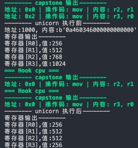
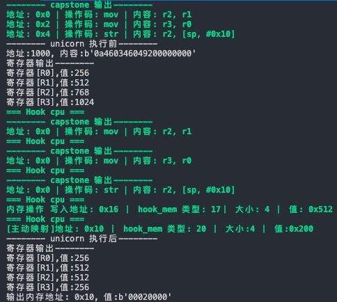
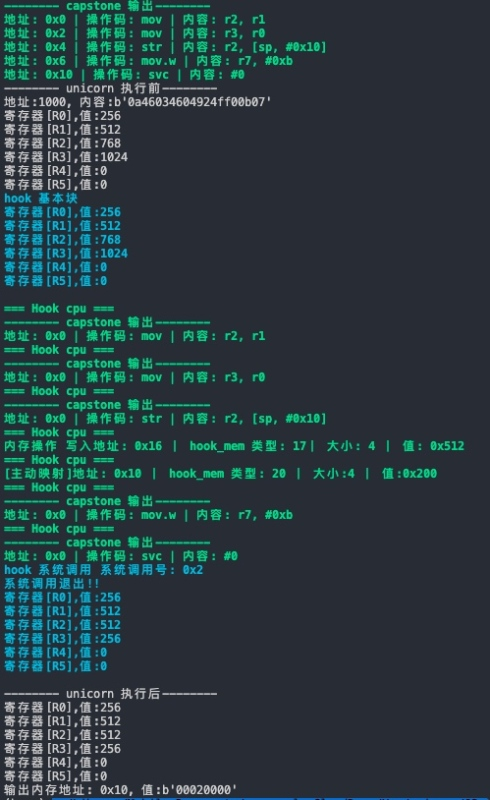

# 抖音数据采集教程，Unicorn 模拟 CPU 指令并 Hook CPU 执行状态


> 短视频、直播数据实时采集接口，请查看文档： [TiToData](https://www.titodata.com/?from=douyinarticle)


免责声明：本文档仅供学习与参考，请勿用于非法用途！否则一切后果自负。

# 添加内存访问 hook 回调

参数

- type: 内存操作类型 READ, or WRITE
- address: 当前指令地址
- size: 读或写的长度
- value: 写入的值（type=read时无视）
- user_data: hook_add 设置的 user_data 参数

# 添加内存访问异常处理 hook 回调

参数

- type: 内存操作类型 READ, or WRITE
- address: 当前指令地址
- size: 读或写的长度
- value: 写入的值（type=read时无视）
- user_data: hook_add 设置的 user_data 参数
- 返回值: 真（继续模拟执行） 假（停止模拟执行）

# 模拟 cpu 执行 mov 指令

目标:
执行普通的 汇编代码, 模拟让他跑起来
`.text:00008ACA 0A 46 MOV R2, R1 ; Rd = Op2 // 将 R1 放到 R2`
`.text:00008ACC 03 46 MOV R3, R0 ; Rd = Op2 // 将 R0 放到 R3`
上面的指令代码为： `\x0A\x46\x03\x46`

```
import unicorn
import capstone
import binascii
CODE = b'\x0A\x46\x03\x46'  # 测试指令 IDA 中拉来的, mov 命令，未涉及到内存读写命令
def print_result(mu):
    """输出调试结果, 源码中，这些都是常量
    UC_ARM_REG_R0 = 66
    UC_ARM_REG_R1 = 67
    UC_ARM_REG_R2 = 68
    UC_ARM_REG_R3 = 69
    UC_ARM_REG_R4 = 70
    """
    msg = """
    寄存器输出 --------
    寄存器[R0], 值:{}
    寄存器[R1], 值:{}
    寄存器[R2], 值:{}
    寄存器[R3], 值:{}
    """.format(
        mu.reg_read(66),  # UC_ARM_REG_R0 源码对应常量 66
        mu.reg_read(67),
        mu.reg_read(68),
        mu.reg_read(69),
    )
    print(msg.strip().replace(' ', ''))
def capstone_print(code):
    """capstone 测试"""
    print("\033[1;32m-------- capstone 输出--------\033[0m")
    CP = capstone.Cs(capstone.CS_ARCH_ARM, capstone.CS_MODE_THUMB)  # 指定 THUMB 指令集
    for i in CP.disasm(code, 0, len(code)):  
        print('\033[1;32m地址: %s | 操作码: %s | 内容: %s\033[0m'%(i.address, i.mnemonic, i.op_str))
def uni_test():
    "将汇编片段，映射到 unicorn 虚拟内存中，将 pc 指向第一条指令处并执行"
    print('-------- unicorn 执行前--------')
    # 1. 创建实例
    mu = unicorn.Uc(unicorn.UC_ARCH_ARM, unicorn.UC_MODE_THUMB)  # 要指定架构和模式, 这里用 arm 架构， 指定 THUMB 指令集
    # 2. 将代码片段映射到模拟器的虚拟地址
    ADDRESS = 0x1000 # 映射开始地址
    SIZE = 1024  # 分配映射大小
    # 3. 开始映射
    mu.mem_map(ADDRESS, SIZE)  # 初始化映射 参数1：地址 参数2:空间大小  默认初始化后默认值：0
    mu.mem_write(ADDRESS, CODE)  # 写入指令 参数1: 写入位置 参数2:写入内容
    # 4. 测试读取 [测试]
    bytes=mu.mem_read(ADDRESS, 10)  # 参数1: 读出位置 参数2:读出字节数
    print('地址:%x, 内容:%s'%(ADDRESS, binascii.b2a_hex(bytes)))  # 读出来是 bates， 要用 binascii 转换一下
    # 写入寄存器
    # 5. 寄存器初始化 指令集涉及到 R0，R1，R2，R3 4个寄存器
    mu.reg_write(unicorn.arm_const.UC_ARM_REG_R0, 0x100)  # 在 r0 寄存器上写入 0x100
    mu.reg_write(unicorn.arm_const.UC_ARM_REG_R1, 0x200)  # 在 r1 寄存器上写入 0x200
    mu.reg_write(unicorn.arm_const.UC_ARM_REG_R2, 0x300)  # 在 r2 寄存器上写入 0x100
    mu.reg_write(unicorn.arm_const.UC_ARM_REG_R3, 0x400)  # 在 r3 寄存器上写入 0x200
    # 6. pc 指针指向地址开始执行
    follow_cpu(mu)  # 跟踪 CPU 进行 hook
    print_result(mu)  # 输出
    mu.emu_start(ADDRESS+1, ADDRESS+4)  # THUMB 指令集所以要 ADDRESS +1,    参数1:起始位置，参数2:结束位置
    print('-------- unicorn 执行后--------')
    print_result(mu)  # 输出
def follow_cpu(mu):
    """跟踪 cpu 执行状态进行 hook 堆栈显示"""
    mu.hook_add(unicorn.UC_HOOK_CODE, hook_code)  # 这里默认跟踪所有，具体也可以配置
def hook_code(mu, address, size, user_data):
    """定义回调函数， 在进入汇编指令之前就会先运行这里
    mu: 模拟器
    address: 执行地址
    size: 汇编指令大小
    user_data: 通过 hook_add 添加的参数
    """
    code=mu.mem_read(address,size)  # 读取
    print('\033[1;32m=== Hook cpu ===\033[0m')
    capstone_print(code)
    return
if __name__ == "__main__":
    capstone_print(CODE)
    uni_test()
```

**Python**
_ 复制_
[](javascript:void(0))

# 执行 STR 等内存操作命令

在上面例子中加入一条 STR 指令
`.text:00008B04 04 92 STR R2, [SP,#0x40+var_30] ; Store to Memory // 存寄存器`
整个指令代码变成`\x0A\x46\x03\x46\x04\x92`
这种情况下如果只是像上面那样写就不行了，因为需要内存操作，与提前映射，否则 hook cpu 操作的时候就会报错。
**需要自行添加一个回调函数来主动映射**

```
def hook_mem_write_unmapped(mu, type, address, size, value, user_data):
    print('\033[1;32m=== Hook cpu ===\033[0m')
    if type==unicorn.UC_MEM_WRITE_UNMAPPED:
        mu.mem_map(0x0,0x1000)  # 主动映射进去 注意：映射的时候需要对齐！！和最开始设定的位置和大小！
        print("\033[1;32m[主动映射]地址: 0x%x ｜ hook_mem 类型: %d ｜ 大小:%d ｜ 值:0x%x\033[0m" % (address, type, size, value))
    return True  # 返回 True 继续执行，返回 False 则不执行后面的
```

**Python**
_ 复制_
如此才能执行 STR 指令并成功 Hook CPU 状态
[](javascript:void(0))

## 执行系统指令与基本块

如果要模拟执行汇编系统指令与基本块的 Hook， 那么我们也要自行添加回调函数

```
def hook_syscall(mu,intno,user_data):
    print("\033[1;36mhook 系统调用 系统调用号: 0x%d"%intno)
    if intno==2:  # 例子 2 是退出
        print("系统调用退出!!")
    print_result(mu)
    print("\033[0m")
    return
def hook_block(mu, address, size, user_data):
    # code = mu.mem_read(address,size)
    print("\033[1;36mhook 基本块")
    print_result(mu)
    print("\033[0m")
    return
```

**Python**
_ 复制_
当然这只是个例子代码，执行推出的
[](javascript:void(0))

标签: [爬虫](https://www.cnblogs.com/titodata/tag/爬虫/), [抖音](https://www.cnblogs.com/titodata/tag/抖音/), [大数据](https://www.cnblogs.com/titodata/tag/大数据/), [api](https://www.cnblogs.com/titodata/tag/api/)