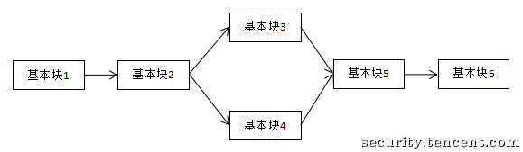
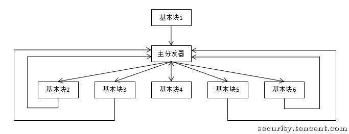

# Unicorn反混淆：恢复被OLLVM保护的程序(一)

## 一、目标

现在很多程序利用ollvm的控制流平坦化来增加逆向分析的难度。 控制流平坦化 (control flow flattening)的基本思想主要是通过一个主分发器来控制程序基本块的执行流程，例如下图是正常的执行流程

1:show1

经过控制流平坦化后的执行流程就如下图:

1:show2

这样可以模糊基本块之间的前后关系，增加程序分析的难度。

## 二、分析

这里我们以 check_passwd_arm_flat 为例来尝试恢复被ollvm混淆后的程序。先拖进ida，从流程图上可以看到典型的 **控制流平台化** 之后的结果：

1:cfg

恢复的流程是 分块→找出真实块→确定真实块之间的调用关系→Patch二进制程序

### 分块

分块我们使用 angr 来实现。

```python
filename = "./check_passwd_arm_flat"
start_addr = 0x83B0
end_addr = 0x87D4

project = angr.Project(filename, load_options={'auto_load_libs': False})
print(hex(project.entry))
cfg = project.analyses.CFGFast(regions=[(start_addr,end_addr)],normalize='True',force_complete_scan=False)

target_function = cfg.functions.get(start_addr)
#将angr的cfg转化为转化为类似ida的cfg
supergraph = am_graph.to_supergraph(target_function.transition_graph)
```

### 找出真实块、序言、retn块和无用块

1. 函数的开始地址为序言块的地址
2. 无后继的块为retn块

```python
# get prologue_node and retn_node
prologue_node = None
for node in supergraph.nodes():
    if supergraph.in_degree(node) == 0:
        prologue_node = node
    if supergraph.out_degree(node) == 0 and len(node.out_branches) == 0:
        retn_node = node

print("序言块={},retn块={}".format(hex(prologue_node.addr),hex(retn_node.addr)))
```

在本例中，真实块的特点如下:

1. 序言的后继为主分发器
2. 后继为主分发器的块为预处理器
3. 后继为预处理器的块为真实块
4. 剩下的为无用块

###### Tip:

在实战中，需要具体分析出 主分发器, 不一定序言块之后的就一定是主分发器，也不一定存在预处理器。

```python
def get_relevant_nop_nodes(supergraph, main_dispatcher_node, prologue_node, retn_node):
    # relevant_nodes = list(supergraph.predecessors(pre_dispatcher_node))
    relevant_nodes = []
    nop_nodes = []
    for node in supergraph.nodes():
        # print(hex(node.addr))
        # 和主分发器有联系，并且size大于8的，认为是真实块
        if supergraph.has_edge(node, main_dispatcher_node) and node.size > 8:
            # XXX: use node.size is faster than to create a block
            relevant_nodes.append(node)
            # print(hex(node.addr))
            continue
        if node.addr in (prologue_node.addr, retn_node.addr, main_dispatcher_node.addr):
            continue
        # 非真实块的默认要干掉
        nop_nodes.append(node)
    return relevant_nodes, nop_nodes
```

输出结果:

```bash
******************* 真实块 ************************
序言块: 0x83b0
主分发器: 0x87d0
retn块: 0x87c0
真实块: ['0x875c', '0x86f4', '0x8794', '0x8658', '0x8628', '0x8714', '0x86d4', '0x87ac', '0x8770', '0x8694', '0x864c', '0x8734', '0x8788', '0x86b0', '0x867c']
```

### 确定真实块之间的调用关系

网上确定真实块之间的调用关系大多都是用 angr 的符号执行来实现，不过angr是个强大的工程，强练容易走火入魔，需要从基础练起。 无名侠 提供了一个Unicorn模拟执行的思路来寻找两个真实块的关系。所以本文使用Unicorn来确定真实块之前的调用关系。

我们只想得到ollvm路径，而不是真实代码块的运行结果，因此要尽可能屏蔽非ollvm的内存操作。具体屏蔽方法稍后介绍。下面这段代码初始化Unicorn的虚拟CPU，并映射程序代码内存以及栈空间，最后调用hook_add设置UC_HOOK_CODE和UC_HOOK_MEM_UNMAPPED的事件回调。UC_HOOK_CODE回调会在每条指令执行前被调用，UC_HOOK_MEM_UNMAPPED会在内存异常的时候调用。

```python
# 初始化
load_base = 0
emu = Uc(UC_ARCH_ARM, UC_MODE_ARM | UC_MODE_LITTLE_ENDIAN)

# 映射代码段 0x8000是 check_passwd_arm_flat 代码段的基址
emu.mem_map(0x8000, 4 * 1024 * 1024)
emu.mem_write(0x8000,binByte)

STACK_ADDR = 0x7F000000
STACK_SIZE = 1024 * 1024
start_addr = None

emu.mem_map(STACK_ADDR, STACK_SIZE)
emu.hook_add(UC_HOOK_CODE, hook_code)
emu.hook_add(UC_HOOK_MEM_UNMAPPED,hook_mem_access)
```

真实块之间的关系有两种：1、顺序 2、分支，针对本文的例子，真实块里面的分支指令有 moveq movne movlt movgt，是时候祭出这个表了：

Table 1. 条件字段表

| 条件后缀 | 标志寄存器        | 含义                    |
| :------- | :---------------- | :---------------------- |
| EQ       | Z == 1            | 等于                    |
| NE       | Z == 0            | 不等于                  |
| CS/HS    | C == 1            | 无符号大于或相同        |
| CC/LO    | C == 0            | 无符号小于              |
| MI       | N == 1            | 负数                    |
| PL       | N == 0            | 整数或零                |
| VS       | V == 1            | 溢出                    |
| VC       | V == 0            | 无溢出                  |
| HI       | C == 1 and Z == 0 | 无符号大于              |
| LS       | C == 1 or Z == 0  | 无符号小于或相同        |
| GE       | N == V            | 有符号大于或等于        |
| LT       | N != V            | 有符号小于              |
| GT       | Z == 0 and N == V | 有符号大于              |
| LE       | Z == 1 or N != V  | 有符号小于或等于        |
| AL       | 任何              | 始终。不可用于B{cond}中 |

###### Tip:

分支指令需要具体情况具体分析，没有通用一劳永逸的解决。除非多费点功夫把所有的分支指令都处理一遍。我怀疑angr的符号执行就是把这个活给干了。

```python
# 分支处理
if ins.mnemonic != 'mov' and ins.mnemonic.startswith('mov'):
    print(">>> branch 0x%x:\t%s\t%s" %(ins.address, ins.mnemonic, ins.op_str))

    if branch_control == 1 :
        vZ = (uc.reg_read(UC_ARM_REG_CPSR) & 0x40000000) >> 30
        vN = (uc.reg_read(UC_ARM_REG_CPSR) & 0x80000000) >> 31
        vV = (uc.reg_read(UC_ARM_REG_CPSR) & 0x10000000) >> 28

        if ins.mnemonic == 'moveq' or ins.mnemonic == 'movne' :
            if vZ == 0:
                uc.reg_write(UC_ARM_REG_CPSR,uc.reg_read(UC_ARM_REG_CPSR) | 0x40000000)
                print("Z 0->1 change cpsr = 0x%x" % uc.reg_read(UC_ARM_REG_CPSR))
            else:
                uc.reg_write(UC_ARM_REG_CPSR,uc.reg_read(UC_ARM_REG_CPSR) & 0xBFFFFFFF)
                print("Z 1->0 change cpsr = 0x%x" % uc.reg_read(UC_ARM_REG_CPSR))
        elif ins.mnemonic == 'movgt':
            if vZ == 0 and vN == vV:
                uc.reg_write(UC_ARM_REG_CPSR,uc.reg_read(UC_ARM_REG_CPSR) | 0x40000000)
                print("GT 0->1 change cpsr = 0x%x" % uc.reg_read(UC_ARM_REG_CPSR))
            else:
                uc.reg_write(UC_ARM_REG_CPSR,uc.reg_read(UC_ARM_REG_CPSR) & 0x2FFFFFFF)
                print("GT 1->0 change cpsr = 0x%x" % uc.reg_read(UC_ARM_REG_CPSR))
        elif ins.mnemonic == 'movlt':
            if vN != vV :
                uc.reg_write(UC_ARM_REG_CPSR,uc.reg_read(UC_ARM_REG_CPSR) & 0x6FFFFFFF)
                print("lt != -> = change cpsr = 0x%x" % uc.reg_read(UC_ARM_REG_CPSR))
            else:
                uc.reg_write(UC_ARM_REG_CPSR,uc.reg_read(UC_ARM_REG_CPSR) & 0xEFFFFFFF)
                print("lt = -> != change cpsr = 0x%x" % uc.reg_read(UC_ARM_REG_CPSR))

        else:
            print(">>> None " + ins.mnemonic)
```

启动虚拟机的函数叫find_path，用于寻找真实块的下一个代码块。branch为分支控制。 如果branch = 1，则虚拟机在遇到movxx指令的时候会走movxx条件分支。

```python
def find_path(uc,start_addr,branch = None):
    global block_startaddr
    global distAddr
    global isSucess
    global branch_control

    try:
        block_startaddr = start_addr
        isSucess = False
        distAddr = 0
        branch_control = branch
        uc.emu_start(start_addr,0x10000)
        print("emu end..")

    except UcError as e:
        pc = uc.reg_read(UC_ARM_REG_PC)
        if pc != 0:
            print("find_path UcError: %s  pc:%x" % (e,pc))
            return None
        else:
            print("find_path ERROR: %s  pc:%x" % (e,pc))
    if isSucess:
        return distAddr
    return None
```

控制流集成 使用队列的方式来路径搜索，起始搜索从函数入口开始。函数入口根据offset变量指定。 queue中的元素是一个二元组，第一项为执行地址，第二项为寄存器环境。每次搜索开始的时候从queue中获取一个将要搜索的真实块，设置寄存器，调用find_path搜索下一个真实块，将搜索到的真实块与新寄存器放入队列（保证上下文完整）使用这样做的好处就是可以搜索任意队列中的代码块，并且寄存器环境一定是和该代码块一致的。

```python
queue = [(push_entry,None)]
flow = defaultdict(list)
patch_instrs = {}

while len(queue) != 0:
    env = queue.pop()
    pc = env[0]
    set_context(emu,env[1])

    if pc in flow:
        #print "???"
        continue
    flow[pc] = []

    print('------------------- run %#x---------------------' % pc)
    block = project.factory.block(pc)
    has_branches = False

    # 寻找有分支的代码块
    for ins in block.capstone.insns:
        if ins.insn.mnemonic != 'mov' and ins.insn.mnemonic.startswith('mov'):
            if pc not in patch_instrs:
                patch_instrs[pc] = ins
                has_branches = True


    if has_branches:
        # 有分支的代码块跑两次，一次正常，一次分支
        ctx = get_context(emu)
        p1 = find_path(emu,pc,0)
        if p1 != None:
            queue.append((p1,get_context(emu)))
            flow[pc].append(p1)

        set_context(emu,ctx)
        p2 = find_path(emu,pc,1)

        if p1 == p2:
            p2 = None

        if p2 != None:
            queue.append((p2,get_context(emu)))
            flow[pc].append(p2)
    else:
        p = find_path(emu,pc)
        if p != None:
            queue.append((p,get_context(emu)))
            flow[pc].append(p)

print("Emulation arm code done")
```

路径探索，需要禁用掉一切函数调用、非栈空间内存访问，当虚拟机指令有内存操作需求时，判断目标内存地址范围是否在栈中，如果不在栈中则跳过该指令, 在本例中有一些内存访问代码段的固定值，这部分指令需要支持。 禁用的指令有bl、blx，只要识别bl前缀即可。

```python
flag_pass = False

for b in ban_ins:
    if ins.mnemonic.find(b) != -1:
        flag_pass = True
        break

if ins.op_str.find('[') != -1:
    if ins.op_str.find('[sp') == -1:
        flag_pass = True
        for op in ins.operands:
            # print(op.type)
            if op.type == ARM_OP_MEM:
                addr = 0
                if op.value.mem.base != 0:
                    addr += uc.reg_read(reg_ctou(ins.reg_name(op.value.mem.base)))
                elif op.value.index != 0:
                    addr += uc.reg_read(reg_ctou(ins.reg_name(op.value.mem.index)))
                elif op.value.disp != 0:
                    addr += op.value.disp
                # 内存操作在栈区域
                if addr >= 0x7F000000 and addr < 0x7F000000 + 1024 * 1024 :
                    flag_pass = False
                # 内存操作在代码区域
                if addr >= 0x8000 and addr < 0x9000:
                   flag_pass = False

if flag_pass:
    print("will pass 0x%x:\t%s\t%s" %(ins.address, ins.mnemonic, ins.op_str))
    uc.reg_write(UC_ARM_REG_PC, address + size)
    return
```

最后打印出找到的真实块之前的调用关系

```bash
************************flow******************************
0x83b0:  ['0x8628']
0x8628:  ['0x864c', '0x8658']
0x8658:  ['0x867c']
0x867c:  ['0x8628']
0x864c:  ['0x8694']
0x8694:  ['0x8794', '0x86b0']
0x86b0:  ['0x8788', '0x86d4']
0x86d4:  ['0x8788', '0x86f4']
0x86f4:  ['0x8714', '0x8788']
0x8788:  ['0x87ac']
0x87ac:  ['0x87c0']
0x87c0:  []
0x8714:  ['0x8788', '0x8734']
0x8734:  ['0x8770', '0x875c']
0x875c:  ['0x87c0']
0x8770:  ['0x8788']
0x8794:  ['0x87ac']
```

### Patch二进制程序

首先把无用块都改成nop指令

```python
for nop_node in nop_nodes:
    fill_nop(origin_data, nop_node.addr-base_addr,nop_node.size, project.arch)
```

然后针对没有产生分支的真实块把最后一条指令改成jmp指令跳转到下一真实块

```python
print("{} jmp {}".format(hex(parent),hex(childs[0])) )
# 把最后一条指令改成jmp指令跳转到下一真实块
parent_block = project.factory.block(parent)
last_instr = parent_block.capstone.insns[-1]
file_offset = last_instr.address - base_addr

patch_value = ins_b_jmp_hex_arm(last_instr.address, childs[0], 'b')
if project.arch.memory_endness == "Iend_BE":
   patch_value = patch_value[::-1]
patch_instruction(origin_data, file_offset, patch_value)
```

针对产生分支的真实块把MOVX指令改成相应的条件跳转指令跳向符合条件的分支，例如moveq 改成beq ，再在这条之后添加b 指令跳向另一分支

```python
instr = patch_instrs[parent]
# print("0x%x: %s \t%s\t%s" % (instr.insn.address,getByteStr(instr.insn.bytes), instr.insn.mnemonic, instr.insn.op_str))
file_offset = instr.insn.address - base_addr

parent_block = project.factory.block(parent)
fill_nop(origin_data, file_offset, parent_block.addr + parent_block.size - base_addr - file_offset, project.arch)

# patch the movx instruction to bx instruction
bx_cond = 'b' + instr.insn.mnemonic[len('mov'):]
patch_value = ins_b_jmp_hex_arm(instr.insn.address, childs[0], bx_cond)
if project.arch.memory_endness == 'Iend_BE':
    patch_value = patch_value[::-1]
patch_instruction(origin_data, file_offset, patch_value)

file_offset += 4
# patch the next instruction to b instrcution
patch_value = ins_b_jmp_hex_arm(instr.insn.address+4, childs[1], 'b')
if project.arch.memory_endness == 'Iend_BE':
    patch_value = patch_value[::-1]
patch_instruction(origin_data, file_offset, patch_value)
```

最后用ida查看修复之后的cfg

1:cfgex

可以看到CFG跟原来的大致一样，然后反编译恢复出原始代码

```c
bool __fastcall check_password(_BYTE *a1)
{
  int v2; // [sp+18h] [bp-10h]
  int i; // [sp+1Ch] [bp-Ch]

  v2 = 0;
  for ( i = 0; a1[i]; ++i )
    v2 += (unsigned __int8)a1[i];
  return i == 4
      && v2 == 0x1A1
      && (signed int)(unsigned __int8)a1[3] > 'c'
      && (signed int)(unsigned __int8)a1[3] >= 'e'
      && *a1 == 'b'
      && ((unsigned __int8)a1[3] ^ 0xD) == (unsigned __int8)a1[1];
}
```

## 三、总结

本文主要针对arm架构下Obfuscator-LLVM的控制流平坦化，重要的是采用unicorn模拟执行来确定真实块的关系。

参考:

https://bbs.pediy.com/thread-252321.htm ARM64 OLLVM反混淆[无名侠] https://security.tencent.com/index.php/blog/msg/112 利用符号执行去除控制流平坦化