# 一种通过后端编译优化脱虚拟机壳的方法

# 摘要

1. 接下去把vmp统称为全部的虚拟机壳。
2. 尽量不复述书中的内容
3. 简单的想直接用llvm或者Ghidra是复现不了本文的内容的，建议认真看。
4. 本文是根据Ghidra深改的，重写了大部分的底层模块。重写的原因有几个
   4.1 Ghidra的耦合网状的，没法只抽1-2个模块出来用
   4.2 Ghidra的部分代码有点问题不符合应用场景，后面会总结需要改的地方
   4.3 有部分代码我看不懂，随意加入怕引入某些深层次的bug。
5. 优化没有完全做完，但是已经成功脱开vmengine了，整个框架已经出来了。
6. 样本来自:https://bbs.pediy.com/thread-258511.htm
7. 整个代码是没有移植性的，只能演示算法，因为ELF的加载部分，我做了部分硬编码

所有对被虚拟机壳保护的破解探索，都会回归到一问题上：我们是否可以在完全不理解vmp的虚拟handler的具体语义从而还原出vmp需要保护的内容？答案是可以的。

# 代码编译运行

## 下载编译

https://github.com/baikaishiuc/fastvm

## 原始cfg:

[cfg**Z10**arm_a_21v_orig0.svg](https://github.com/baikaishiuc/fastvm/blob/master/wiki/_Z10__arm_a_21v/cfg__Z10__arm_a_21v_orig0.svg)

## 优化过cfg

[cfg**Z10**arm_a_21v_final.svg](https://github.com/baikaishiuc/fastvm/blob/master/wiki/_Z10__arm_a_21v/cfg__Z10__arm_a_21v_final.svg)

# 简单的示例

我们从一个最简单的demo开始，这个demo从如何构建一个vmp壳分析其原理，然后我们逐步还原。

 

以下的vmp内容部分参考自(https://www.cnblogs.com/LittleHann/p/3344261.html)

 

\##VMP简单规范
行为编号

```
action          number
vPushReg32      1
vPopReg32       2
vAdd            3
```

寄存器索引

```
eax    0
ebx    1
ecx    2
edx    3
esi    4
edi    5
ebp    6
efl     7
```

### 行为定义

```
vPushReg32:
    mov eax, dword ptr [esi] ;从字节码中得到VMContext中的寄存器偏移
    add esi, 4
    mov eax, dword ptr [edi+eax] ;得到寄存器的值
    push eax ;压入寄存器
    jmp VMDispatcher
 
vadd:
    mov eax, [esp+4] ;取源操作数
    mov ebx, [esp] ;取目的操作数
    add ebx, eax
    add esp, 8 ;平衡堆栈
    push ebx ;压入堆栈
 
vPopReg32:
    mov eax, dword ptr [esi] ;得到reg偏移
    add esi, 4
    pop dword ptr [edi+eax] ;弹回寄存器
    jmp VMDispatcher
```

### 被保护代码

```
vmp_begin()
int sum(int a, int b)
{
    add eax, esi
}
vmp_end();
 
int main()
{
    int a = 1, b = 2
    int s = sum(a, b);
    return 0;
}
```

Vmp保护过以后代码如下(只列出了一个大概的框架):

```
int sum(int a, int b)
{
char vm_bytecode[] = {xx, xx, xx, xx};
int vm_bytelen = sizeof(vm_bytecode);
 
vm_enter();
for (int I = 0; I < vm_bytelen; i++) {
   vm_opcode = vm_bytecode[i];
   switch (vm_opcode) {
        case n:
             vPushReg32(); I += n;
        case n + 1:
             vPopReg32(); I += n;
        case n + 2:
             vAddReg32();  I += n;
        …
   }
}
vm_return();
}
```

生成字节码
1 0 1 4 3 2 0

## 传统的方法

以前老方法是去做了展开，理解了每个vm_handler的特征码，尝试还原了代码，
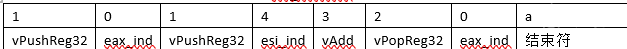
最后的
a + b 被转换成了如下形式

```
vPushReg32 eax_index    ;eax在VMContext下的偏移
vPushReg32 esi_index
vadd
vPopReg32 eax_index
```

转换出来的代码如上，然后在做一些硬编码，得到 c = a + b。

 

但实际上不用理解vmhandler的，我们直接做循环展开

## 循环展开

普通的循环展开如下:

```
for (int I = 0; I < 100; i++)
  j = I + 1;
 
展开一次如下:
 
j = I + 1;
for (I = 1; I < 100; i++)
   j = I + 1;
```

我们这里先不讲述复杂的展开，先假设vmp用的就是一个简单的大型的while do ，然后内部包含一个switch case的结构，后面会在《360加固》章节中完整的讲述循环展开的细节。有些复杂。

 

我们展开以后，得到的代码如下:

 


## 预处理:

1. 加上VMBegin和VMEnd（或者后面加上）
2. 把esi指向vm_bytecode地址，假设为 0x8cf0
   
3. 某些指令做了很复杂的行为，我们把其中部分展开成类似于Ghidra中的pcode，比如
   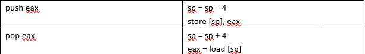
4. 在循环展开时，需要跟踪指令的流向，所以夹在在中间的跳转指令统一去除( jmp指令无法通过活跃分析去除的)
5. 生成堆栈高度信息
6. Edi指向vMContext
7. Esi是vm_bytecode_ptr

## SSA和SoN

原图可以看这个:[示例](https://raw.githubusercontent.com/baikaishiuc/fastvm/8d4e8878fbfc55ee36615cf832e73b7e15760aeb/wiki/doc/vmp_f1.svg)

 

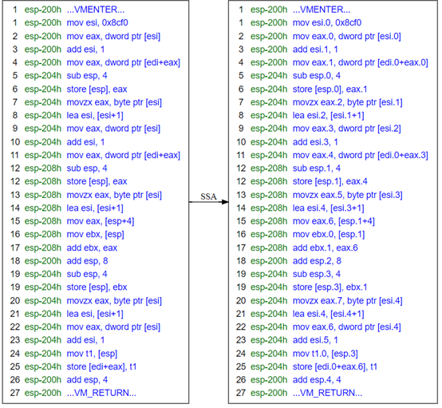
SSA生成以后，du链的关系大家自己请脑部，这个图真的是不好画。

 

SoN是什么？参考《From Quads to Graph》，组织pcode和其中变量（值）的已经不是传统的block list这个结构了，而是一种Program Dependece Graph。

## 常量传播和持久化

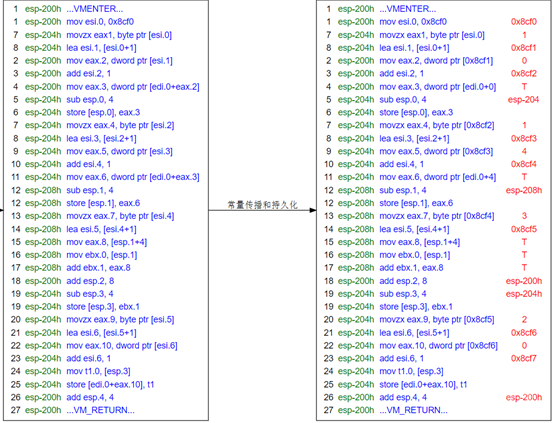

### 什么是常量持久化

```
1. mov eax.0, 1
2. add ebx, eax.0
```

常量传播以后，我们意识到eax.0为1
我们把上面的代码重写成

```
1. mov eax.0, 1
2. add ebx, 1
```

这样改完以后，eax.0的use就减少了，假入uses.size == 0，则可以直接做死代码删除了

## 死代码删除

### 死代码标注

用黄色标注了一下，大家看清楚一点，然后我们把死代码清理掉

 

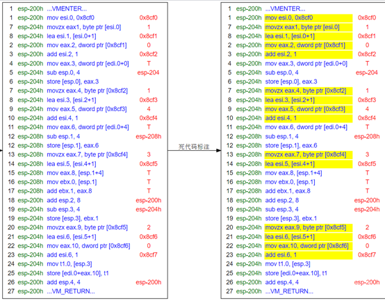
清理过以后，变成这样:
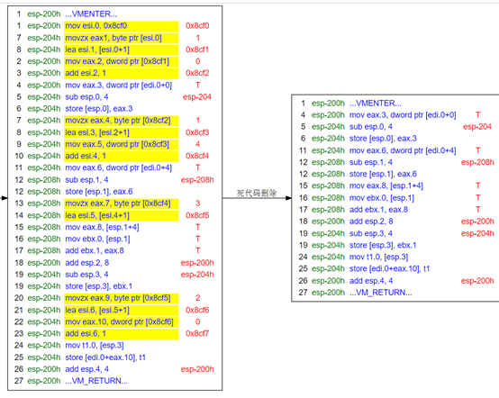

## 别名分析

\###生成别名
别名其实就是获取变量的地址信息，现在我们的地址都是堆栈(esp)上的，后面会讲解不可计算的地址如何分析:
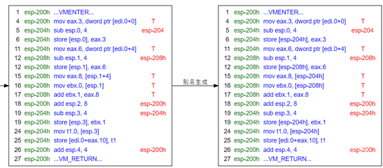
别名生成其实就是把load, store指令的地址转换成一个更具体的地址。从而判断某些指令是否再操作同一个地址。

 

我们把带版本号的地址，基本都改成了基于esp的地址，这样看起来会更加清楚一些

#### SSAPRE

效果不明显。

### 别名关联

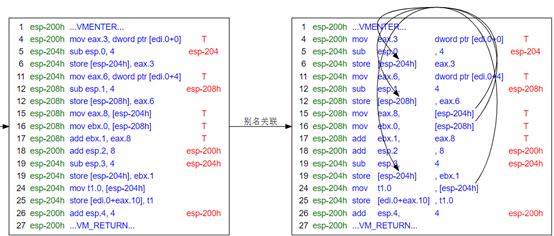

 

那个别名关联的箭头画的不好，大家将就看吧，简单的说就是相同的地址要关联到一起。

 

**或者说 别名关联就是生成 load, store节点的du链**

## 寄存器分配和Peephole

我没上标准的寄存器分配，而是打算用类似于peephole或者复写传播等方式来实现寄存器分配。再正式讲这个问题我先说下活跃性分析的一些概念。让大家先对这个问题有点概念性的认识。

 

看以下代码:

```
1. mov r2.0, r3.0
2. mov r3.1, 4
3. add r1.0, r2.0
```

请问，上面的代码是否可以复写成？

```
1. mov r2.0, r3.0
2. mov r3.1, 4
3. add r1.0, r3.0
```

答案是不行的，因为指令3不在r3.0的活跃范围内。

 

**Ghidra的活跃性分析分析缺陷: 请参考《活跃性分析》章节**
所以基于以上的认识，我们尝试用复写传播和peephole做优化，看:
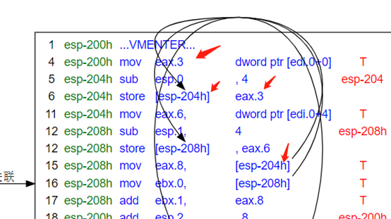

 

红色箭头已经标出了传播链上的几个关键节点。

```
[edi.0 + 0] -> eax.3 -> [esp-204] -> eax.8
```

所以以上代码可以直接被改写成:

```
mov eax.8, [edi.0 + 0]
```

记住，这个传导链，不能分批执行，先把:

```
mov eax.8, [esp-204h] ->. mov eax.8, eax.3
```

这样转换以后，eax.6还活着呢，生成的结果会出错。

 

这样改写以后，新的代码如下:
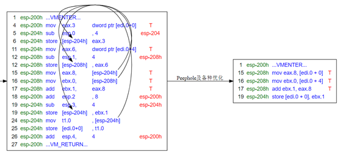

 

这里说下第17条指令:

```
add ebx.1, eax.8
```

它实际上等价于:

```
add ebx.1, ebx.0, eax.8
```

所以看起来好像ebx.0的use好像没了。
注:看到这里，可能很多人还不是很理解，为什么有些store是如何被判定为死代码的。可以看下一章节《活跃性分析》。

## 重新加上VMEnter和VMReturn

由于VMEnter和VMReturn的体积庞大，我们把它化简以后，加上去，否则代码过于庞大，对于说明问题，也说不清楚。


 

然后把一些复杂的表达式展开成pcode类型，比如push [edi.0 + 0] ，展开成如下:

```
t1 = load [edi.0 + 0]
sub esp, 4
store [esp], t1
```

然后:
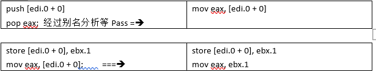
这样的代码再按照上面的优化Pass多来几次就能化简成

```
add eax, esi
```

上文就是脱虚拟机壳的一个简陋的部分核心思想

# 活跃性分析

书上在讲书活跃性分析的时候，似乎只讲了简单寄存器的活跃性分析。而对别名的讲述的很少，其实都是一样的:

 

对同一个变量(别名)的定值，会终止此变量(别名)的上一个活跃链。

## 活跃范围的扩大:

```
1. mov r0.0, r7.0
2. mov r1.0, r0.0
3. mov r2.0, r1.0
4. add r2, r4
5. mov r0.1, 1
```

在Ghidra中基于SSA的活跃链来生成的Varnode->Cover结构，看起来似乎是到自己的use为止，比如上图中r0.0的活跃范围是pcode: 2-2(def自己的不算)。

 

但是我们打算把它扩展到下一个def为止，也就是5。

 

为什么要这么做呢？因为不这样做有些peephole无法做。
比如我想把上图中的指令3，从

```
3. mov r2.0, r1.0
```

改成

```
3. mov r2.0, r0.0
```

按以前的方式就不行，因为它计算的范围过小了，扩大范围才能正常工作。

## 活跃范围的缩小:

标准的活跃性分析，会横跨多个block，但是这个太费时间了，我实现了一个简易版本的活跃性计算，接口是

```
add_def_point_simple
add_use_point_simple
```

这个版本的活跃性计算，只计算单个block内的范围，它不会不停回溯自己的in节点。

 

这样实现的坏处是范围变小了，你不能再上面做基于web的寄存器分配之类的动作。但是好处就是速度块了几十倍。

 

在peephole阶段，范围变小了，只是说某些优化不能做，但不会产生错误的代码。

 

假如你要计算完整的活跃链，要切换活跃分析的版本。

```
add_def_point
add_use_point
```

我会在最后脱出vmengine后，调用这个方法。

## Store节点的活跃性分析

```
1. store [esp – 4], eax
2. store [esp – 4], ebx
```

指令1被指令2覆盖了，所以指令1是死的

```
1. store [esp – 4], eax
2. load [esp – 4], ecx
3. store [esp – 4], ebx
```

指令3，虽然覆盖了指令1，但是指令2 use指令1的def，所以指令1是活的。

## sp寄存器的隐藏行为

```
1. store [esp – 4], eax
2. add esp, 4
```

当esp确实是被当作堆栈寄存器来使用时，我们认为esp的加减隐含了对内存分配和销毁的动作。这个算是一种工程上的 corner case。**这个操作是很危险的。**

 

一定要非常小心，因为esp寄存器在某些平台上可能被挪作它用，简单的认为esp指向堆栈也不能保证它一定就在做内存分配。需要做很多的边界检查。

 

假如esp在按我们预期的那样工作，那么上文中的指令1可以被删除，因为它store了以后，这个内存立即被销毁了。

 

建议把这个优化作为可选项。

# 复杂的示例

虽然说是复杂，但是内容很少。因为我不打算画太多图了，太累了。

 

在讲这一章的时候，我们一定要有一个核心的概念:

 

原始代码中的任意一条指令，都会以相同的指令出现在被vm过后的代码中。

## 如何处理跳转

以下代码:

```
1. add r0, 1
2. cmp r0, r1
3. jle label_1
```

对上述的代码执行vmp保护以后，假设生成一个vmp字节序列:

 

Vmp_bytecode = x0x1x2x3x4x5

 

我们在解析vmp_bytecode的时候，每个虚拟指令，在展开以后，都会得到一个block，我们把这个block和展开它时，得到的vmp_bytecode_index关联起来。

 

举个简单的例子:

```
i = 0
while (i < vm_bytecode_len) {
   vm_engine_run_body();
}
```

我们对上述代码做展开，展开一次，假设i走了2格:

```
i = 0
 
label_vm_bytecode0:
{  // block n
  // vm_bytecode[i] 展开以后的代码
  i = 2
}
 
while (i < vm_bytecode_len) {
   vm_engine_run_body();
}
```

再展开一次，假设这个vm_op也消耗了2格得到的代码约如下:

```
i = 0
 
label_vm_bytecode0:
{  // block n
  // vm_bytecode[0] 展开以后的代码
  i = 2
}
 
label_vm_bytecode2:
{ // block n+ 1
  // vm_bytecode[2] 展开以后的代码
  I = 4;
}
 
while (i < vm_bytecode_len) {
   vm_engine_run_body();
}
```

最后展开那个jle指令会得到一个cbranch指令，即使当前block内没有这个cbranch，也可能只是它暂时压栈，放到后面去处理，我们不关心，反正总有一个block需要去理解这个条件，然后生成一个cbranch。

 

展开最后一个vm_op，假设已经走到终点，vmengine的代码脱出。

```
i = 0
 
label_vm_bytecode0:
{  // block n
  // vm_bytecode[0] 展开以后的代码
  i = 2
}
 
label_vm_bytecode2:
{ // block n+ 1
  // vm_bytecode[2] 展开以后的代码
  I = 4;
}
 
label_vm_bytecode4:
{ // block n + 2
  if (xxx) {
      vm_bytecode_ptr= 0; // 这个语句本来指向vmengine的头的，直接指向前面的label_vm_bytecode0这个label即可。改成 goto label_vm_bytecode0，或者往block(n+2)-> block(b) 上加一条边
  }
  else {
     goto exit;
  }
}
```

上面代码中，最后的vmp跳转修复，要放到最后进行，这里涉及到phi节点的一些问题，这个优化按标准的编译算法来说，是有问题的，但是因为虚拟机壳的特殊性，在这里应该是合适的。（？）

## 如何处理store指令

我们在简单的示例中，所有的地址信息都是可以计算的。比如这个图:

我们可以看到，每个地址都在当前的堆栈上，即使暂时无法查看的edi.0也可以通过把vmenter纳入计算来得到精确的地址的。

 

但是用户的代码中一定有大量的无法计算的store节点，比如

```
function (r0)
{
   store [r0 + 4], 1
}
```

那么在你加了保护以后生成的代码中，假设出现如下的代码：

```
1.    store [esp + 8], r0
2.    store [rn], r2
3.    r3 = load [esp + 8];
```

现在问题来了，因为rn暂时没算出来，指令2可能maydef 了 esp + 8的位置，你不敢把指令链到pcode.1上。我们在《别名分析》章节上详细说明这个问题。

# 360加固

## 框架分析

360加固把程序切成了几段。它自己的框架方面差不多，分为:

1. vm_enter
2. vm_begin
3. vm_run
4. vm_return
5. vm_do_ops1
6. vm_do_ops2
7. vm_lshift_op
8. vm_rshift_op
9. vm_mathop
   可能是这样吧，我画个图说明下:
   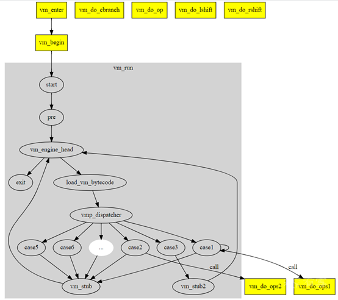
   用黄色标明的方块和整个灰色背景的块，都是函数。
   Vm_do_cbranch, vm_do_lshift, … 没有边指向它，是因为我不想把图画的太乱，实际上有不同的case分支指向它。

打开ida 用libjiagu.so做对照，_Z10**arm_a_21v地址83d0:
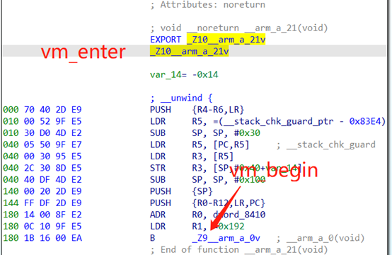
然后我们打开 _Z9**arm_a_0v
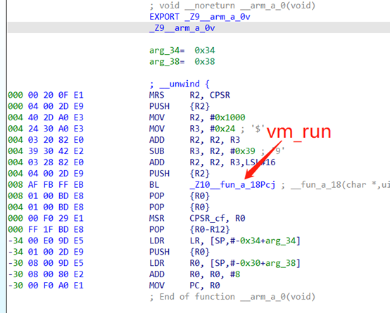
然后我们从最外层的vm_enter开始，inline掉 vm_begin和vm_run函数。
让框架上变成这样:

严格上来说，所有的vm框架函数都要inline，但是这样会导致代码体积膨胀的非常厉害。我们采取部分完全inline，然后还有部分按需inline的方式来做优化

## 2种handler

360加固在把代码转成了vm_bytecode以后，生成了2种handler:

 

第一种handler搞不清作用，是在最外层的vm_engine上执行的case，我们称为main_handler
第二种handler看起来是vm op。

 

初步怀疑外层的handler可能是用来描述原始汇编指令的，比如一个mov指令，可能转成2个vm操作

```
mov r0, r1  // 原始的mov可能有个编号，在外层
 
VM_PUSH r1 // 然后虚拟的hanlder也有个编号
VM_POP r0
```

但我们不关心这些细节。反正不停的循环展开即可。

## 删除可计算循环

## VM_BYTEINDEX的0生成

我们开始走vm的虚拟机，在360中，r12是vm_byteindex，需要先初始化他为0，360的初始化采用了一些特殊规则来生成。

1. 
2. 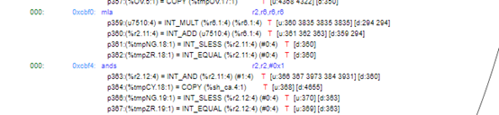
3. 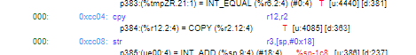

以上的代码简化以后如下:

```
r0 = lrand48();
r6 = r0
r2 = r6 * r6 + r6 (这里r2一定为偶数)
r2 = r2 & 1 -> r2 = 0
r12 = r2 -> r12 = 0
```

推导出r12为0

## VM_BYTEINDEX和归纳变量判断

这个地方我偷懒了，没有严格按照书上来，做了一些硬编码，按如下规则来:

1. 生成spanning tree，标注边类型，a_tree_edge, forward, cross, back edge
2. 扫描整个block list，找到哪个block的回边最多的，就是vmhead block
3. Ghidra中根据 https://core.ac.uk/download/pdf/82032035.pdf 这篇论文来识别不可归约流图，我在这个上面又改了下，变成识别循环的函数。
4. 根据哪些节点属于循环来标识循环内外，主要用来标识loop的exit节点，正向编译器开发中，这些都是现成的，上层的ir传给低层的ir，会使用gated-ssa来强化ssa的一些表达能力。
5. 找到vmhead，直接扫描比较指令，扫描到，比如cmp r9, r12
6. 根据loop的pre节点，获取它反向输入索引，pre->get_rev_index(vmhead)，替换到vmhead的phi节点中，得到r9 和 r12的值，
7. R9为0x192，r12为0，我直接判定r12为归纳变量，或者vm_byteindex，这里其实不是很对

## 循环展开

基本算法:

1. 获取头的pre节点
2. 根据pre的inslot值，跟新node上的phi节点
3. 一直在cfg上走
4. 假如直接走到了vmhead，复制经过的所有节点，形成一个cfg块
5. 假如走到了undefined bcond，复制经过的所有节点，形成一个cfg节点a，然后从undefined bcond节点的out边开始复制，把整个web递归复制到vmhead节点为止。和前面的cfg a拼接在一起。行为一个cfg块
6. 删除pre节点和vmhead节点的把，把cfg块加入进去。

### 普通展开

估计你们看的头晕，直接上图吧，针对4的情况
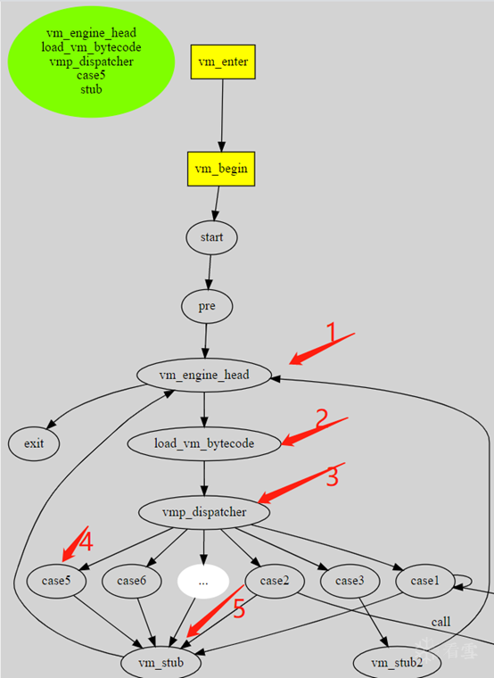
我们假设先走的case5，直接按途中1, 2 ,3 ,4 ,5的顺序把代码全走出来。然后生成一个新的绿色节点。重新插入到pre和vm_engine_head中。
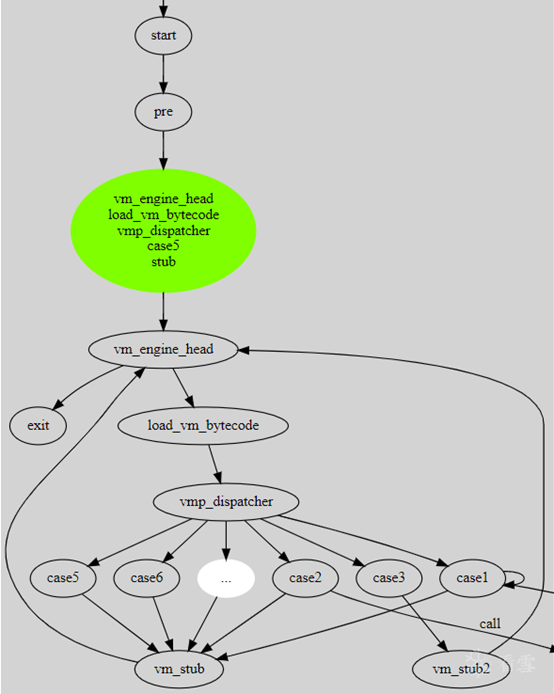

 

这是好的情况，大部分运气都非常糟糕，走的是上图中case1的分支，接下去我们直接上libjiagu.so中的真实数据。

### 复杂展开:

我们直接把_Z10__arm_a_21v的第一个vm_bytecode展开
它经过了以下节点:

```
process flowblock sub_cc10
process flowblock sub_cc18
process flowblock sub_cc20
process flowblock sub_cc24
process flowblock sub_cc88
process flowblock sub_d278
process flowblock sub_d29c
process flowblock sub_d2ac
```


Cc24还有cc28，以及最后的3个节点。
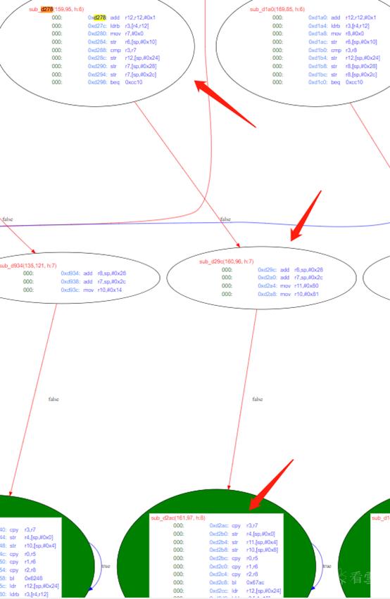
我在cfg流图中用绿色或者粉红表示有循环的点，d2ac已经无法分析了，我们直接把从它的出边开始到vmhead的所有node以及关系都复制出去。

 


那到了这里该如何优化呢，看下面的lazy inline

## lazy inline

我在框架分析中说过，原则上来说要inline掉框架内所有的框架函数，但是假如一开始就inline全部函数，会导致代码体积过大。所以我们是一边循环展开一边inline。我们看下上图中，那个被展开的节点:
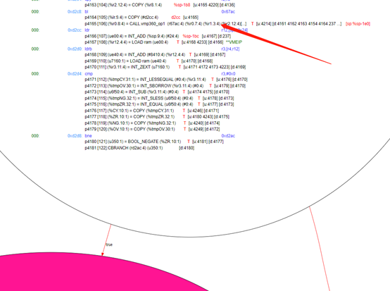
我们到了这一步才开始决定inline它

## argument inline

传统的inline功能会把整个代码全部inline入函数，这样会导致整个程序流图变的巨大，

1. 我们直接把整个参数全部传进去
2. 别名分析时，可以直接搜caller的堆栈
3. 让它优化完了，在传送出来。这样可以巨大的减小体积。
4. 假如函数内还有调用其他的call，只要时框架函数全部带参数inline掉

上图中的vmp_math_op1没优化前长这样:
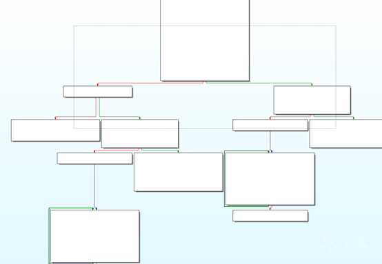
优化以后长这样:
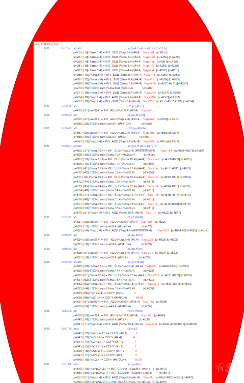
就只剩下一个唯一的块了，这样就方便多了。最后嵌入到原先的代码中。

 

嵌入到原先的块后，
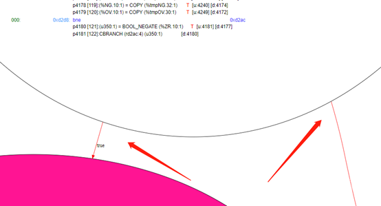
原先块的末尾那个cbranch就变得可以计算了。会删除其中一边

1. 假如删除左边，那么左边整个模块都变成unreachable了，可以开始下一轮对vmhead的循环展开了。

2. 假如是右边的话，左边保留了下来，因为左边长这样:
   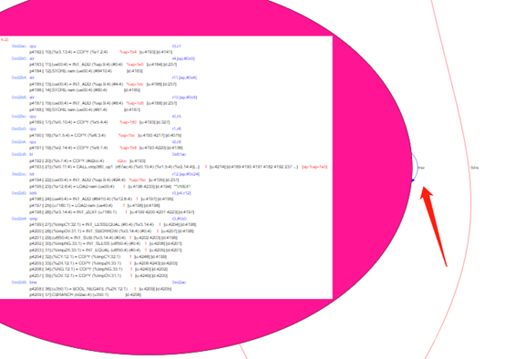
   它是一个循环，所以需要继续对do..while代码做循环展开。展开的方式都是一样的。一直到展开不动为止。
   最后上面那一坨循环就会变成下面这样一个标准快了。

   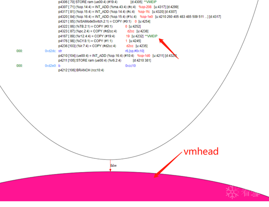
   然后我们发现，上面箭头指向的vmeip(vm_bytecode_index)的值被跟新到0x19了

这个图好像不是很清晰的样子

# 值和格

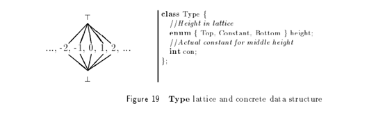
我们需要扩展数据的一些类型定义

 

我们扩展了数据类型的定义，增加了一种namespace的概念。为什么要加呢？

```
	
store [esp], eax ; esp = esp.0 - 200
```

我们在分析别名的时候，你打算如何标注函数的数据类型为esp – 200，esp-200是一个我们推导出的值。

 

我们不打算把esp设为一个默认的常量，这其实是一种模拟执行的思路，在编译优化时，可能会引入一些意想不到的bug。
新的类型定义变成这样:
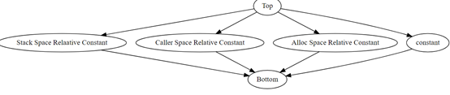

```
struct type {
enum {
    a_top,
    a_constant,
    a_rel_constant,
    bottom
}
int con;
void *space;
}
```

常量不能和相对常量比较，相同空间的常量可以互相比较，不同空间是正交的。相同空间的常量可以比较大小。

 

比如 : esp – 200 会大于 esp – 100

 

上面还有2个奇怪的空间，其中一个是alloc space，这个来源于另外一个问题

```
1.    store [sp + 200], r0
2.    store [r1], r3
3.    r4 = load [sp + 200]
```

假如这个r1是alloc space的，那么3可以关联到1，因为alloc space，代表r1是malloc或者new出来的，malloc出的内存，你在上面操作，不会和堆栈和其他的空间发生重叠。Caller space也类似。

 

现在只支持stack space.

# 别名分析

## 别名分析.正（抛弃）

这一章是用比较传统的别名分析来做的，但是在深入分析vmp时碰到了一些难以解决的问题，在成功解码一个被vmp保护的函数后抛弃了。

 

正向的别名分析，就是严格计算哪些别名时安全，哪些是may def, may use，这个在正向编译开发中很有用，因为编译器可以拿到全部的数据结构，和全部的调用链，但是你在逆向的编译开发中拿不到全部的信息。

 

**更重要的一点是，内存的位置是由开发者决定的，逆向的时候，你没资格决定哪个结构在哪里。**

## 别名分析.反

我们不再追求分析出每一个别名的must def, must use，may def, may use。而是假设某一块内存区域绝对安全。或者说是隔离。

 

什么是别名的绝对安全，也就是说它不会被may def, may use。它的所有must def , must use都是可以计算的，假如碰到不能计算的节点的store, load，那么操作的也一定不是这块区域的内存。

 

先来看一段示例代码

```
1.    store [sp], r0  
2.    store [r1], r2;   r1 = T
3.    r3 = load [sp]
```

指令1,3都在操作 sp + 0的位置，指令2在操作一个未知位置，并且在常量传播以后，也依然是 T 的。

 

接下我我们使用安全区域标注:

```
set_safe_room(sp, 0, 4);
```

直接标注这个区域是安全，那么我们认为所有计算不出来得位置和安全区域都是正交的。这样指令3的load和指令1的store就关联起来，并且可以近一步转换成:

```
1. store [sp], r0
2. store [r1], r2
3. mov r3, r0
```

## 实际项目中如何应用？

标注安全区域确实方便，但是如何知道哪些区域绝对安全呢？

 

VMP在生成vm_enter的时候，会生成一个区域保护用户堆栈，在生成一个堆栈操作operand， 我们认为这个区域，这个是相对于整个算法的 vmp-dependent 的部分。我们认为这个区域的操作不会和任何非vm-dependent call产生交互。

## 函数如何处理

```
store [sp], r0
mov r0, sp
call.mathop (r0)
load r1, [r0]
```

假如这个函数是vmp生成的框架函数必须得inline掉，具体如何inline参考章节 《360加固.lazy inline》 和 《360加固.argument inline》

## 引入的问题

```
1. store [sp], r0
2. store [r2], r3
3. r5 = load [sp]
```

假如我们在没有充分计算的前提下就把指令 1, 3关联起来。那么也许在常量传播到后面，我们才发现

```
1. store [sp], r0
2. store [r2], r3  ; r2 = sp
3. r5 = load [sp]
```

实际上应该关联的是 3和2。

 

所以我们必须得计算到完全不能在计算为止，才能进行关联，或者标注某个store指令不可计算。

 

下一节会讲述什么是充分性计算。

## 充分性计算

定义:

1. 假如一个pccode的所有in节点都是
   1.1 常量
   1.2 输入参数
   1.3 充分计算过的
2. 那么此pcode的output也都是充分计算过的
3. 递归遍历此output的use，重复1-3过程
   伪代码:

```
worklist = pcodelist;
foreach(p : worklist.front) {
    worklist.erase(worklist.begin());
    bool ad = true;
    foreach(v : p->inrefs) {
      if (v->is_constant()) continue;
      if (v->is_input()) continue;
      if (v->is_adequacy()) conintue;
      ad = false;
   }
   p->output->set_adequacy(ad);
   if (p->is_adequayc()) {
          foreach(use: p->output->uses) {
               worklist.push_back();
          }
   }
}
```

这个代码性能很低的，就是一个不动点算法。我只是为了解释这个问题写的，具体应用要优化。

 

在做了充分性计算以后，就可以标注某个节点不可计算了。但是,

 

**注意:**

1. 你标注的某个pcode所在的block，到支配树root的路径上，不能出现back-edge
2. 假如有多个不可计算的别名，按拓扑序标注不可计算节点。一次只能标注一个。因为当每次跨越一个不可计算别名时，都有更多的信息被关联起来，以前不能计算的节点会变的重新可以计算。

# 代码生成

# Ghidra 的一些问题

## overrideFlow?

这个函数某些情况下会修改某些函数的branch指令为return

## generateBlocks

这个函数严重依赖于deadlist的opcode顺序，在后面的循环展开时，已经无法满足需要。

## Instruction selector

缺少代码生成模块，当我们重新优化过pcode以后，需要有指令生成模块把pcode重新转换回来

## DF算法

原先的有错，对于unsplice的cfg流图，没有正确生成结果，我们采用经典的基于djgraph的算法重新生成了df边界以后正常。

## 活跃性分析调整

Ghdira中使用Cover结构来表达活跃范围
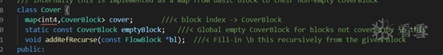
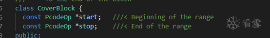
CoverBlock用pcodeop来表示start, stop，这个有问题，在peephole优化中，pcode可能会被删除，我们使用SeqNum.Order的字段来表示，这样计师pcode被删除以后，我们依然可以正确的计算活跃性范围。
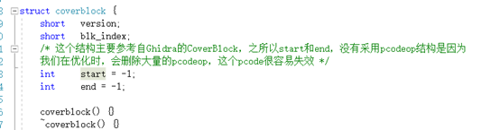

# 问题总结和遗留问题

## 为什么不采用llvm

1. 框架上不支持扫描整个so（好像最近有了）
2. 别名分析需要重写
3. 循环展开需要重写
4. 我对llvm不熟悉

## 函数参数数量和类型判断

再有意的防护下，想不经过函数间分析，判断出参数个数和类型个人认为是不可能的?

## 网络上其他的编译优化思路

不成体系

## SSA的性质修复

反复的inline和循环展开，需要重新对代码做ssa-deconstruction和ssa-construction，非常的麻烦。

 

我很希望能在只修改部分代码的情况下，只对ssa的性质做修复而不是重建。导致性能非常低。

 

Llvm内似乎提供了一种这样的方式。

# 参考书籍

[ssa-fullbook](http://ssabook.gforge.inria.fr/latest/book-full.pdf)
[MCIC](https://www.amazon.com/Modern-Compiler-Implement-Andrew-Appel/dp/0521607655)
[Ghidra source code](https://github.com/NationalSecurityAgency/ghidra)


# 评论

关注，之前看到楼主在研究 miasm。
最近越来越多看到做逆向的开始从工程化的方向解决问题了。编译原理，数据流分析等等的从 IR 层面对抗。


最后一点关于llvm参数类型的问题，其实汇编里所谓参数类型，可以认为每个参数都是四个字节的整数（32bit下），关键是多少个这样的32bit需要对被调用的函数头做分析.
楼主的思路非常不错，网上这方面的资料非常凌乱，如果可以帮忙整理出有体系的学习路线或者资料那就更好了


你起的好早啊，其实我写错了，我本来想写的是参数个数的。

不过你说的也由道理，类型也是判断不出来的，只能靠函数间分析


只有魔法才能打败魔法


楼主这个太屌了...
后端优化目前公开的基本上都是llvm ir,这些都缺少针对性的优化.不太合适对混淆代码(vmp)之流效果不好.
还有就是优化部分要点的技能点真的是太多,而且比较抽象,看的头大.
前端时间出了个vtil(https://github.com/vtil-project/VTIL-Core),不知道楼主看过没.
他这个用的是自定义的IR.对vmp效果非常好.但但但是缺少 IL->(x86/ARM).

\1. 我用的ir是Ghidra的pcode，不是自己整的
\2. novmp就用的vtil-core，但是novmp思路还是依赖于特征的提取[novmp特征](https://github.com/can1357/NoVmp/blob/master/NoVmp/vmprotect/il2vtil.cpp)
\3. 这里的问题不在于ir的应用，而是在于你采用的很多优化是不标准的，在正经的compiler书籍上可能没有提及，要自己琢磨


