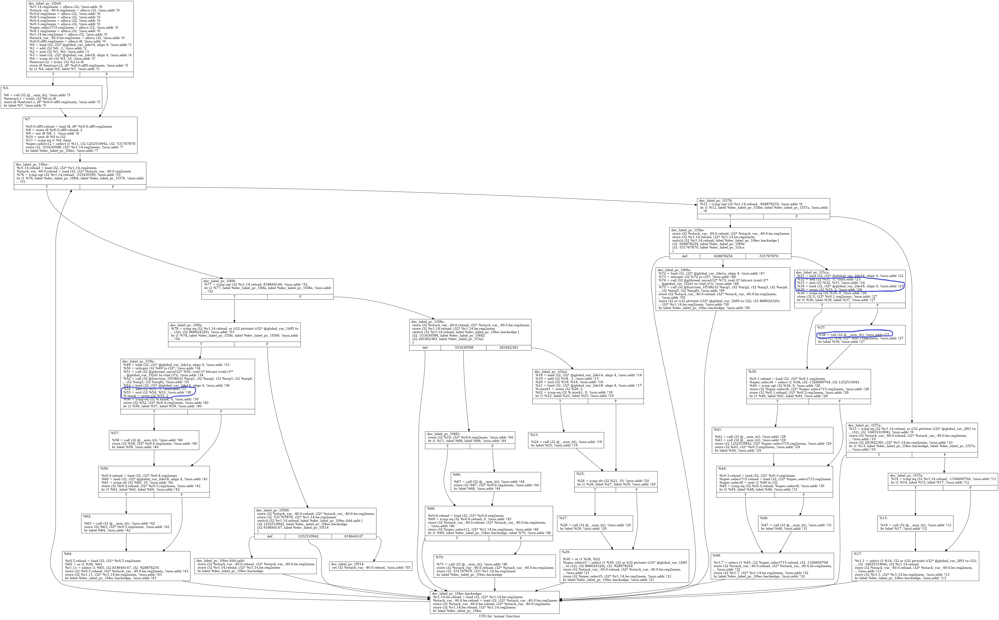
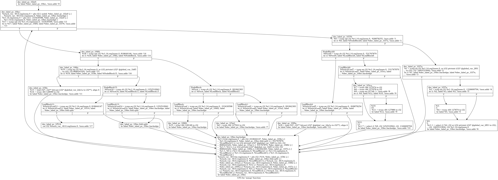

# 利用编译器优化干掉虚假控制流

url：https://bbs.pediy.com/thread-265335.htm


首先，感谢极目楚天舒大佬提供的学习资料，本人通过断断续续的学习，懂了点llvm的皮毛，简单运用下，介绍一下这两个工具

1.强大的recdec反编译器，项目地址[https://github.com/avast/retdec ](https://github.com/avast/retdec) 类似于f5的反编译功能：

  capstone2llvmir与bin2llvmir，这个模块通过最流行的capstone反汇编引擎把汇编还原为llvmir，这是此次操作的开始

  llvmir2hll，这个模块把llvm ir还原为c代码，这里的效果与f5不相上下

2.llvm10的opt优化与dot画图，用于优化ir和画图看cfg流程


## **第一步，把so里混淆的函数还原为ir**

1.执行retdec-decompiler.py这个脚本

python retdec-decompiler.py libshell-super.2019.so  --select-decode-only --select-functions mmap --backend-no-opts  --backend-emit-cfg --stop-after  bin2llvmir

2.简单画个图看一下，观察这几个需要处理的点：x*(x-1)%2相关的混淆，gloabal全局变量有关的cmp和call i32 @__asm_it()这种引用了保存当前地址的metadata的函数


```
opt -dot-cfg libshell-super.2019.so.ll  
dot -Tpng -o $1.png .mmap.dot
```



## 第二步，简单处理ir，替换类型为i32的全局变量global为它的值，类似这种语句 

%r1.1 = select i1 %2, i32 or (i32 ptrtoint (i32* @global_var_2f01 to i32), i32 -1665531904), i32 %r1.14.reg2mem.0  @global_var_2f01 = constant i32 6815836

把@global_var_2f01替换为i32 6815836，方便下一步常量传播与死代码消除等优化，关键pass代码如下

```
    bool runOnModule(Module &M) {
      for (Module::global_iterator gi = M.global_begin(), ge = M.global_end();gi != ge; ++gi) {
          // errs() << "global:" << gi->getName()<< '\n';
          GlobalVariable* gv = &(*gi);
          std::vector<Value*>obj;
          std::vector<Constant*>obj2;
          for (User *U : gv->users()) {
            if(U->getType()->isIntegerTy()){//这里只替换作为整数使用的global
              for (Use &U1 : U->operands()) {
                Value *v = U1.get();
                obj.push_back(v);
                errs() << "valueV:" <<*v<< '\n';
                if(cast<GlobalVariable>(v)){
                  Constant *initializer = gv->getInitializer();
                  errs() << "valueC:" <<*initializer<< '\n';
                  obj2.push_back(initializer);
                }
              }
            }
          }
          for(int i=0;i<obj2.size();i++)
          {
            errs() << "obj:" <<*obj[i]<< '\n';
            errs() << "obj2:" <<*obj2[i]<< '\n'; 
            if(dyn_cast<ConstantInt>(obj2[i])){
              obj[i]->replaceAllUsesWith(obj2[i]);
            }
          }          
      }
      return false;
    }
```

## 第三步，继续处理ir，把call i32 @__asm_it()这种函数生成的局部变量替换为它的值，方便之后优化，例如下面例子就是 %4就是!5 metadata的值 


 %4 = call i32 @__asm_it(), !insn.addr !5   !5 = !{i64 127874}，把 %4 替换为127874

这里替换之后，不知道为何call语句还没有被清除掉，还需要再循环一次清除所有call i32 @__asm_it()的语句，

```
bool runOnFunction(Function &F){
      Function *tmp=&F;
      for (Function::iterator bb = tmp->begin(); bb != tmp->end(); ++bb) {
        for (BasicBlock::iterator inst = bb->begin(); inst != bb->end(); ++inst) {
          if(isa<CallInst>(inst)){            
            if(inst->getOperand(0)->getName()=="__asm_it"){
              CallInst *instt=cast<CallInst>(inst);
              errs() << "getcall:" << *instt << '\n';
              MDNode *N = inst->getMetadata("insn.addr");
              Metadata *n1;
              n1=&*(N->getOperand(0));
              Value *v= cast< ValueAsMetadata >(n1)->getValue();
              ConstantInt *a=cast<ConstantInt>(v);
              TruncInst *t=new TruncInst(a,inst->getType(),"",instt);
              errs() << "t:" << *t<< '\n';
              instt->replaceAllUsesWith(t);
              // instt->eraseFromParent();//这里不知道为啥CallInst没有被清除掉
           }
          }
        }
      }
      Function *tmp2=&*tmp;
    for (auto &B : *tmp2) {
        auto It = B.begin();
        // we modify B, so we must reevaluate end()
        while(It != B.end()) {
            auto &I = *It;
            if(isa<CallInst>(&I)) {             
              if(I.getOperand(0)->getName()=="__asm_it")
               errs() << "getcall:" << I << '\n';
                // we continue with the next element
                It = I.eraseFromParent();
            } else {
                ++It;
            }
        }
     }
      return false;
    }
```

## 第四步，去除bcf。


看ollvm的源码可知，bcf主要有两种不可到达分支，一种是工具确定不了值(其实值是确定的)的全局变量，好像叫不透明谓词，这里我用的笨方法，把它们一个一个手工添加上去；

另一种是类似(x*(x-1))%2这种恒为0控制的不可到达分支，原文这么写的

For this, we declare two global values: x and y, and replace the FCMP_TRUE
predicate with (y < 10 || x * (x + 1) % 2 == 0) (this could be improved, as the global
values give a hint on where are the opaque predicates)//  values give a hint on where are the opaque predicates


这里我们通过pass把类似(x*(x-1))%2或者(x*(x-1))&1这种全部优化为0，具体步骤如下

1.手动修复未识别的global数据，通过opt进行sccp+ipsccp常量传播优化，simplifycfg+adcecfg简化和死代码消除优化，-mem2reg促进内存引用为寄存器引用


opt -sccp -ipsccp -simplifycfg -adce libshell-super.2019.so.ll -S

2.-instcombine指令优化，这之后rem取余会被等价优化成and 1，优化后如下

%1 = add i32 %0, -1, !insn.addr !1
%2 = mul i32 %1, %0, !insn.addr !2
%3 = and i32 %2, 1//这里本来是urem指令

3.最关键的，写一个pass识别这种三句模式(x*(x-1))&1的ir，直接替换为0，然后adce+simplifycfg优化掉不可达分支


opt -load libdbcfPass.so -dbcf d2dbcf.ll -S

关键代码如下

```
bool runOnFunction(Function &F) override {
        Function *tmp=&F;
        errs() << "Function：" << F.getName() << '\n';
     for (Function::iterator bb = tmp->begin(); bb != tmp->end(); ++bb) {
            //errs() << "block:" << *bb << '\n';
        for (BasicBlock::iterator inst = bb->begin(); inst != bb->end(); ++inst) {
            ConstantInt *a=(ConstantInt *)ConstantInt::get(inst->getType(),-1);
            ConstantInt *b=(ConstantInt *)ConstantInt::get(inst->getType(),0);
            if(inst->getOpcode() == 15){
                errs() << "inst:" << *inst << '\n';
                BasicBlock::iterator instb=(--inst);
                ++inst;
                BasicBlock::iterator insta=(++inst);
                --inst;
                if(instb->getOpcode() == 11){
                    errs() << "inst:" << *instb << '\n';
                    if(instb->getOperand(1) == a){
                        if(inst->getOperand(1) == instb->getOperand(0)){
                            errs() << "inst:" << *insta << '\n';
                            BinaryOperator *instt=cast<BinaryOperator>(inst);
                            BinaryOperator *op=BinaryOperator::Create(Instruction::And,b,b,"",instt);
                            
                            instt->replaceAllUsesWith(op);
                            errs() << "inst:" << *instt << '\n';
                        }
                    }
                }
            }            
        }
   
        }
      return false;
    }
```

优化过后，所有bcf已经消除了，下面可以继续编译成arm，用ida打开看或者直接反编译为c，可以用retdec-llvmir2hll这个工具，此时就能发现虚假控制流已经没了，下一步可以着手处理其他混淆



还原为c看一下，x*x-1类似的bcf已经全部没有了，只剩下flatten平坦化了

F:\retdec\bin\retdec-llvmir2hll -target-hll=c -output-format=plain -var-renamer=readable -var-name-gen=fruit -var-name-gen-prefix= -call-info-obtainer=optim -arithm-expr-evaluator=c -validate-module **-o F:\MY_reverse\lightstart\a.c F:\MY_reverse\lightstart\a.bc** -enable-debug -emit-debug-comments -config-path=**F:\MY_reverse\lightstart\libshell-super.2019.so.config.json** -max-memory-half-ram

```
#include <stdbool.h>
#include <stdint.h>
 
// ------------------- Function Prototypes --------------------
 
int32_t function_1f538(int32_t a1, int32_t a2, int32_t a3, int32_t a4, int32_t a5, int32_t a6);
int32_t mmap(int32_t a1, int32_t a2, int32_t a3, int32_t a4, int32_t a5, int32_t a6);
 
// ------------------------ Functions -------------------------
 
// Address range: 0x1f2e0 - 0x1f51e
int32_t mmap(int32_t a1, int32_t a2, int32_t a3, int32_t a4, int32_t a5, int32_t a6) {
    int32_t v1 = -0x13dfbf46;
    int32_t v2; // 0x1f2e0
    int32_t v3; // 0x1f2e0
    int32_t result; // 0x1f2e0
    while (true) {
      lab_0x1f4ec_2:
        if (v1 > -0x13dfbf47) {
            if (v1 > 0x30cb84b2) {
                if (v1 == ((int32_t)-0x6fffff87 || 0x33bd0000)) {
                    // 0x1f3fe
                    v2 = 0x30cb84b3;
                    v3 = 0x1f45a;
                    goto lab_0x1f4ec;
                } else {
                    if (v1 < 0x4aa7ccde) {
                        if (v1 == 0x30cb84b3) {
                            // break -> 0x1f514
                            break;
                        }
                        goto lab_0x1f4ec_3;
                    } else {
                        if (v1 == 0x4aa7ccde) {
                            v2 = -0x1fb2223e;
                            v3 = result;
                            goto lab_0x1f4ec;
                        } else {
                            goto lab_0x1f4ec_3;
                        }
                    }
                }
            } else {
                if (v1 < 0x10cc92cf) {
                    if (v1 == -0x13dfbf46) {
                        // 0x1f482
                        v2 = -0x1fb2223e;
                        v3 = result;
                    } else {
                        v2 = v1;
                        v3 = result;
                    }
                } else {
                    if (v1 == 0x10cc92cf) {
                        // 0x1f3a2
                        v2 = (int32_t)-0x6fffff87 | 0x33bd0000;
                        v3 = result;
                    } else {
                        v2 = v1;
                        v3 = result;
                    }
                }
                goto lab_0x1f4ec;
            }
        } else {
            if (v1 > -0x375d8eaf) {
                if (v1 < -0x1fb2223e) {
                    if (v1 == -0x375d8eae) {
                        // 0x1f49a
                        v2 = (int32_t)-0x6fffff87 | 0x33bd0000;
                        v3 = result;
                    } else {
                        v2 = v1;
                        v3 = result;
                    }
                } else {
                    if (v1 == -0x1fb2223e) {
                        // branch -> 
                        v2 = -0x4f125200;
                        v3 = result;
                    } else {
                        v2 = v1;
                        v3 = result;
                    }
                }
            } else {
                if (v1 != ((int32_t)0x68005c || -0x63460000)) {
                    if (v1 == -0x4f125200) {
                        // branch -> 
                    }
                    int32_t v4 = v1 == -0x4f125200 ? (int32_t)0x68005c | -0x63460000 : v1;
                    v2 = v4;
                    v3 = result;
                } else {
                    v2 = 0x10cc92cf;
                    v3 = result;
                }
            }
            goto lab_0x1f4ec;
        }
    }
    // 0x1f514
    return result;
  lab_0x1f4ec:
    result = v3;
    v1 = v2;
    goto lab_0x1f4ec_2;
  lab_0x1f4ec_3:
    v2 = v1;
    v3 = result;
    goto lab_0x1f4ec;
}
 
// --------------- Dynamically Linked Functions ---------------
 
// int pthread_once(pthread_once_t * once_control, void(* init_routine)(void));
```


最后，我还尝试用它去除flatten，但我的c++和llvm都很垃圾，写的程序一直都跑不起来，希望得到大佬帮助，大概思路如下：


0.把ir中所有switch指令转换为cmp+br指令

1.遍历所有block，如果某个block的Predecessor >6,可能是混淆节点，也就是switch块，标记为ob

2.遍历ob的Successor后续块的Terminator指令，如果是条件跳转cmp+br，getOperand(0)就得到switchvar

3.根据switchvar这个Value类的实例，遍历所有使用这个值的Users ，挑出其中指令为cmp且switchvar为op0的Users，标记为case分发块

其中指令为

4.其余块为真实块

5.根据所有分发块建立二叉树，根节点为ob节点，往下遍历block寻找结尾cmp+br指令，左节点为true，右为false，直到没有br指令或者cmp不为switchvar，就到达真实块

6.根据switchvar的Use往上追踪所有赋值，遇到phi继续追踪直到定值


附录

1.获取metadata的值

```
!meta.test = !{!0}     
!0 = !{"str1", "str2", !1} 
!1 = !{!2, !3, null} 
!2 = !{"str3", i8 5} 

!0=M→getNamedMetadata("meta.test")→getOperand(0) 
!2=!0→getOperand(2)→getOperand(0) cast< ValueAsMetadata >(!2→getOperand(1))→getvalue()
 
```


2.遍历global，必须要runonmodule，不能runonfuction，只有module里含有全局变量

```
for (Module::global_iterator gi = M.global_begin(), ge = M.global_end();gi != ge; ++gi) {
          GlobalVariable* gv = &(*gi);
          }
```

3.清除无用call语句

```
Function *tmp2=&*tmp;
    for (auto &B : *tmp2) {
        auto It = B.begin();
        // we modify B, so we must reevaluate end()
        while(It != B.end()) {
            auto &I = *It;
            if(isa<CallInst>(&I)) {             
              if(I.getOperand(0)->getName()=="__asm_it")
               errs() << "getcall:" << I << '\n';
                // we continue with the next element
                It = I.eraseFromParent();
            } else {
                ++It;
            }
        }
     }
```