# 基于LLVM Pass实现控制流平坦化

提到代码混淆时，我首先想到的是著名的代码混淆工具**OLLVM**。OLLVM(Obfuscator-LLVM)是瑞士西北应用科技大学安全实验室于2010年6月份发起的一个项目，该项目旨在提供一套开源的基于LLVM的代码混淆工具，以增加逆向工程的难度。

 

OLLVM的核心功能，也就是代码混淆，基于LLVM的一个重要框架——**LLVM Pass**。简单来说，LLVM Pass可以对代码编译的结果产生影响，以达到优化、混淆等目的。本文的主要内容即是讲解基于LLVM Pass框架的代码混淆方法，以及动手实现一个简易的控制流平坦化混淆。

# 0x00. 什么是LLVM和LLVM Pass

在学习LLVM Pass之前，我们有必要对LLVM有一些简单的了解。简单来说，我们可以把LLVM看成一个先进的编译器。

 

传统编译器（比如我们熟悉的GCC）的工作原理基本上都是三段式的，可以分为前端（Frontend）、优化器（Optimizer）、后端（Backend）。前端负责解析源代码，将其翻译为抽象的语法树（Abstract Syntax Tree）；优化器对这一中间代码进行优化；后端则负责将优化器优化后的中间代码转换为目标机器的代码。
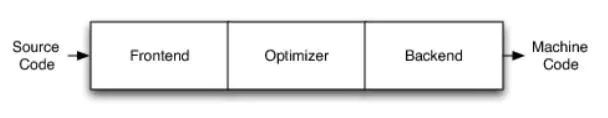

 

LLVM本质上还是三段式，但LLVM框架不同语言的前端，会产生**语言无关**的的中间代码LLVM Intermediate Representation (**LLVM IR**)。优化器对LLVM IR进行处理，产生新的LLVM IR，最后后端将LLVM IR转化为目标平台的机器码。其过程如下图所示：
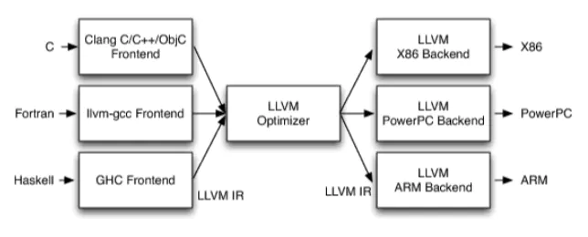

 

这样设计的好处是当我们需要新支持一种语言时，由于统一的中间代码LLVM IR的存在，我们只需要实现该语言的前端即可，可拓展性极强。并且我们可以通过LLVM提供的一系列丰富的函数库操控LLVM IR的生成过程，我们用来操控LLVM IR生成过程的框架被叫做**LLVM Pass**，官方文档称其为“where most of the interesting parts of the compiler exist”，可见其功能之强大。

 

还有一个容易混淆的点是Clang与LLVM的关系，可以用一张图来解释：

更详细的内容可以看：[深入浅出让你理解什么是LLVM](https://www.jianshu.com/p/1367dad95445)

# 0x01. 首先写一个能跑起来的LLVM Pass

我们的第一个目标是让我们写的LLVM Pass能够顺利运行，之后的工作无非是往我们的Pass里不断添加内容罢了。

 

首先我们需要从官网下载LLVM Project中LLVM和Clang部分的源码，将其放在同一个目录，编译。这个过程可以参考知乎上的一个教程——[LLVM Pass入门导引](https://zhuanlan.zhihu.com/p/122522485)以及官方文档，这里不再赘述了。我的编译环境是**Ubuntu 18.04**、**gcc (Ubuntu 7.5.0-3ubuntu1~18.04) 7.5.0**。

 

官方的教程[Writing an LLVM Pass](https://llvm.org/docs/WritingAnLLVMPass.html)中提供了一个示例，它的作用是打印所有函数的名称：
**test.sh**

```
./build/bin/clang -c -emit-llvm test.cpp -o test.bc
./build/bin/opt -load ./build/lib/LLVMHello.so -hello test.bc -o /dev/null
```

**test.cpp**

```
#include <cstdio>
 
void func1(){}
 
void func2(){}
 
int main(){
    puts("Hello!");
}
```

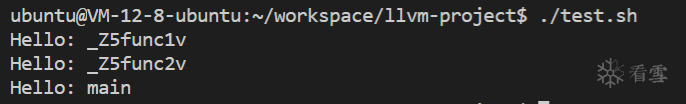
然而示例代码还是有点复杂，可以把它的代码简化一下，方便我们理解：
**Obfu.cpp**

```
#include "llvm/IR/Function.h"
#include "llvm/Pass.h"
#include "llvm/Support/raw_ostream.h"
using namespace llvm;
 
namespace{
    struct Obfu : public FunctionPass{
        static char ID;
        Obfu() : FunctionPass(ID){}
 
        bool runOnFunction(Function &F) override{
            outs() << "Function: " << F.getName() << "\n";
            return false;
        }
    };
}
 
char Obfu::ID = 0;
static RegisterPass<Obfu> X("obfu", "My obfuscating pass");
```

写好之后重新编译LLVM，之前编译过的话重新编译的速度会很快，然后运行一下我们写的Pass：
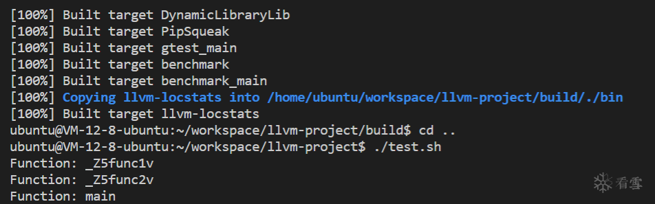
OK！这样后续的混淆功能只需要在这个框架上添加行了。

# 0x02. 控制流平坦化的基本思想和实现思路

控制流平坦化(Control Flow Flattening)的基本思想主要是通过一个主分发器来控制程序基本块的执行流程，例如下图是正常的执行流程：
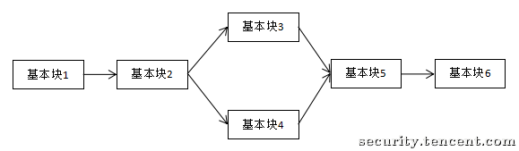
经过控制流平坦化后的执行流程就如下图：
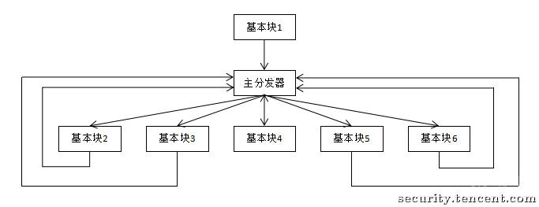
可以看到除了基本块1外，其他的基本块都集中到了同一个层次上。不同基本块的调度顺序由主分发器决定（在程序里可以看做一个switch，不同的基本块就对应不同的case）。这样可以模糊基本块之间的前后关系，增加程序分析的难度。

 

控制流平坦化的过程相当于把原有程序正常的逻辑改为**一个循环嵌套一个switch**的逻辑。

 

以上图代表的程序为例，执行完基本块1后程序进入主分发器，然后执行基本块2对应的case。在原逻辑中基本块2的末尾是一个**条件跳转**，可以跳转到基本块3或者基本块4，在平坦化中基本块2的末尾会根据原有跳转的条件修改switch变量的值，使其接下来能执行到基本块3或者基本块4对应的case，然后返回主分发器（即进入下一个循环）。

 

如果是非条件跳转的话，比如基本块5到基本块6，在基本块5的末尾修改switch变量的值，使下一个循环中switch能到达基本块6对应的case即可。

 

用伪代码表示，未混淆的逻辑是这样：

```
基本块1
基本块2
if(condition){
    基本块3
}else{
    基本块4
}
基本块5
基本块6
```

控制流平坦化的逻辑是这样：

```
基本块1
switchVar = 2;
while(true){
    switch(switchVar){
        case 2:
            基本块2
            switchVar = condition ? 3 : 4;
        case 3:
            基本块3
            switchVar = 5
        case 4:
            基本块4
            switchVar = 5
        case 5:
            基本块5
            switchVar = 6
        case 6:
            基本块6
            goto end;
    }
}
end:
```

# 0x03. 基于LLVM Pass实现控制流平坦化

LLVM Pass的所有操作都是基于LLVM IR的，因此你需要对**LLVM IR**有所了解：[LLVM IR Tutorial](https://link.zhihu.com/?target=https%3A//llvm.org/devmtg/2019-04/slides/Tutorial-Bridgers-LLVM_IR_tutorial.pdf)
LLVM Pass的一些重要API也很有必要看一看：[LLVM Programmer’s Manual](https://llvm.org/docs/ProgrammersManual.html)

 

控制流平坦化的实现代码我参考的是：[OLLVM控制流平坦化源代码](https://github.com/obfuscator-llvm/obfuscator/blob/llvm-4.0/lib/Transforms/Obfuscation/Flattening.cpp)

 

首先把函数的定义移到外面去，让重点更突出一点，现在我们只需要关注flatten函数的实现就可以了：

```
#include "llvm/IR/Function.h"
#include "llvm/Pass.h"
#include "llvm/Support/raw_ostream.h"
#include "llvm/IR/Instructions.h"
#include <vector>
using namespace llvm;
 
namespace{
    struct Obfu : public FunctionPass{
        static char ID;
        Obfu() : FunctionPass(ID){}
 
        bool flatten(Function *f);
 
        bool runOnFunction(Function &F);
    };
}
 
bool Obfu::runOnFunction(Function &F){
    return flatten(&F);
}
 
bool Obfu::flatten(Function *f){
 
}
 
char Obfu::ID = 0;
static RegisterPass<Obfu> X("obfu", "My obfuscating pass");
```

首先遍历函数中所有基本块，将其存到一个vector中：

```
// 遍历函数所有基本块，将其存到vector中
vector<BasicBlock*> origBB;
for(BasicBlock &BB: *f){
    origBB.push_back(&BB);
}
// 基本块数量不超过1则无需平坦化
if(origBB.size() <= 1){
    return false;
}
```

根据平坦化的基本思想，第一个基本块是要单独拿出来处理的：

```
// 从vector中去除第一个基本块
origBB.erase(origBB.begin());
BasicBlock *firstBB = &f->front();
```

如果第一个基本块的末尾是一个条件分支，则把条件跳转的**两个IR指令**（类似于汇编里的cmp和jmp）单独分离出来作为一个基本块，方便与非条件跳转统一处理：

```
// 如果第一个基本块的末尾是条件跳转
if(isa<BranchInst>(firstBB->getTerminator())){
    BranchInst *br = cast<BranchInst>(firstBB->getTerminator());
    if(br->isConditional()){
        CmpInst *cmpInst = cast<CmpInst>(firstBB->getTerminator()->getPrevNode());
        BasicBlock *newBB = firstBB->splitBasicBlock(cmpInst,"newBB");
        origBB.insert(origBB.begin(), newBB);
    }
}
```

这里出现了一个函数**splitBasicBlock**，如果你想知道这个函数到底做了什么操作，可以直接阅读源码内的注释，其他函数也是一样。简而言之，**splitBasicBlock**函数在给定位置将一个基本块分为两个，并且在第一个基本块的末尾加上一个非条件跳转：
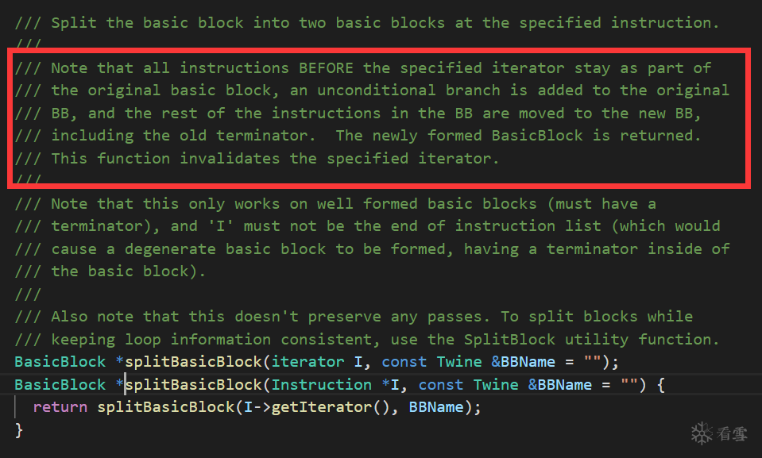
有关**isa**和**cast**两个泛型函数的用法，参考上面提到的重要API文档：
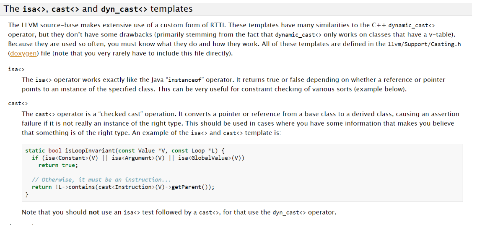
接下来创建循环的循环头和循环尾，注意到新创建的基本块是被插入到**firstBB**前面的，所以还需要把**firstBB**移回顶部：

```
// 创建循环
BasicBlock *loopEntry = BasicBlock::Create(f->getContext(), "loopEntry", f, firstBB);
BasicBlock *loopEnd = BasicBlock::Create(f->getContext(), "loopEnd", f, firstBB);
firstBB->moveBefore(loopEntry);
```

对第一个基本块做一些处理，主要包括去除第一个基本块原来的跳转，插入初始化switch on变量的指令，插入新的跳转使其进入循环：

```
// 去除第一个基本块末尾的跳转
firstBB->getTerminator()->eraseFromParent();
// 用随机数初始化switch on变量
srand(time(0));
int randNumCase = rand();
AllocaInst *swVarPtr = new AllocaInst(int32Type, 0, "swVar.ptr", firstBB);
new StoreInst(ConstantInt::get(int32Type, randNumCase), swVarPtr, firstBB);
// 使第一个基本块跳转到loopEntry
BranchInst::Create(loopEntry, firstBB);
```

在loopEntry中插入load指令，load指令类似于C语言里的指针取值：

```
// 在进入loopEntry读取switch on变量
LoadInst *swVar = new LoadInst(int32Type, swVarPtr, "swVar", false, loopEntry);
BranchInst::Create(loopEntry, loopEnd);
```

创建循环内的switch。这里swVar是**LoadInst**类型，它被当做switch on的变量传入了SwitchInst的构造函数，在LLVM Pass中，常数（Constant）、参数（Argument）、指令（Instruction）和函数（Function）都有一个共同的父类**Value**。**Value** class是LLVM Pass很重要的基类（参见：[The Value class](https://llvm.org/docs/ProgrammersManual.html#the-value-class)）：

```
// 初始化switch的default case
// default case实际上不会被执行
BasicBlock *swDefault = BasicBlock::Create(f->getContext(), "swDefault", f, loopEnd);
BranchInst::Create(loopEnd, swDefault);
SwitchInst *swInst = SwitchInst::Create(swVar, swDefault, 0, loopEntry);
```

创建完switch之后，插入原基本块到switch中，注意这里仅是**位置意义上**的插入，而不是逻辑意义上的：

```
for(BasicBlock *BB : origBB){
        ConstantInt *numCase = cast<ConstantInt>(ConstantInt::get(int32Type, randNumCase));
        BB->moveBefore(loopEnd);
        swInst->addCase(numCase,BB);
        randNumCase = rand();
}
```

接下来要从逻辑意义上往switch中插入基本块了，即添加新的case。
所有基本块按后继基本块的数量分成了三类：

- 第一类是没有后继基本块，这类基本块一般是以**retn**或者**call exit**结尾的基本块，统一叫做**retn BB**这类基本块不用做处理。
- 第二类是仅有一个后继基本块，即以**非条件跳转**结尾的基本块，在这类基本块的末尾我们需要更新switch on的变量，使下一轮循环中能够按原有的逻辑到达下一个基本块。
- 第三类是有两个后继基本块，即以**条件跳转**结尾的基本块，在这类基本块的末尾我们要插入**select**指令，类似于C语言的三元运算符。

实现代码如下：

```
// 添加case
for(BasicBlock *BB : origBB){
    // retn BB
    if(BB->getTerminator()->getNumSuccessors() == 0){
        continue;
    }
    if(BB->getTerminator()->getNumSuccessors() == 1){
        BasicBlock *sucBB = BB->getTerminator()->getSuccessor(0);
        BB->getTerminator()->eraseFromParent();
        ConstantInt *numCase = swInst->findCaseDest(sucBB);
        new StoreInst(numCase, swVarPtr, BB);
        BranchInst::Create(loopEnd, BB);
        continue;
    }
    if(BB->getTerminator()->getNumSuccessors() == 2){
        ConstantInt *numCaseTrue = swInst->findCaseDest(BB->getTerminator()->getSuccessor(0));
        ConstantInt *numCaseFalse = swInst->findCaseDest(BB->getTerminator()->getSuccessor(1));
        BranchInst *br = cast<BranchInst>(BB->getTerminator());
        SelectInst *sel = SelectInst::Create(br->getCondition(), numCaseTrue, numCaseFalse, "", BB->getTerminator());
        BB->getTerminator()->eraseFromParent();
        new StoreInst(sel, swVarPtr, BB);
        BranchInst::Create(loopEnd, BB);
    }
}
```

至此整个平坦化的过程就已经完成了。

# 0x04. 混淆效果测试

编译，运行test.sh测试：

```
./build/bin/clang -c -emit-llvm test.cpp -o obfu.bc
./build/bin/opt -load ./build/lib/LLVMObfu.so -obfu obfu.bc -o obfu.bc
./build/bin/llvm-dis obfu.bc -o obfu.ll
./build/bin/clang obfu.bc -o test
```

IDA打开，查看CFG：
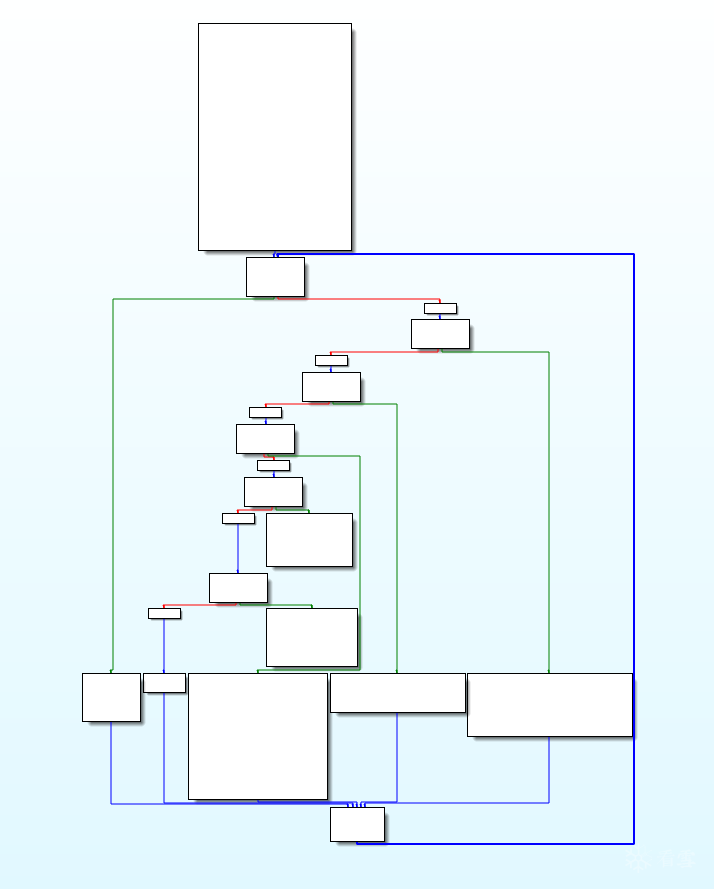
是不是有内味了：
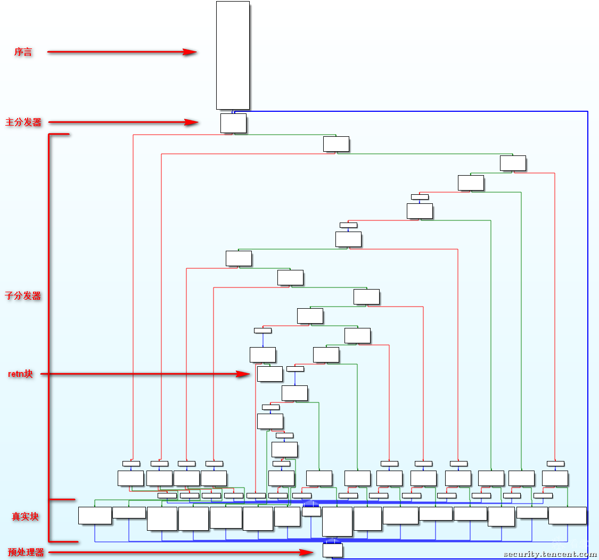
F5查看伪代码，可以看到IDA并没有像我们预想的那样识别出switch。经过我的测试如果switch on的变量很规律（比如1,2,3,4,5,6...），IDA就能准确识别出switch，如果是随机数则不行，所以随机数的混淆效果比单纯的递增要好：
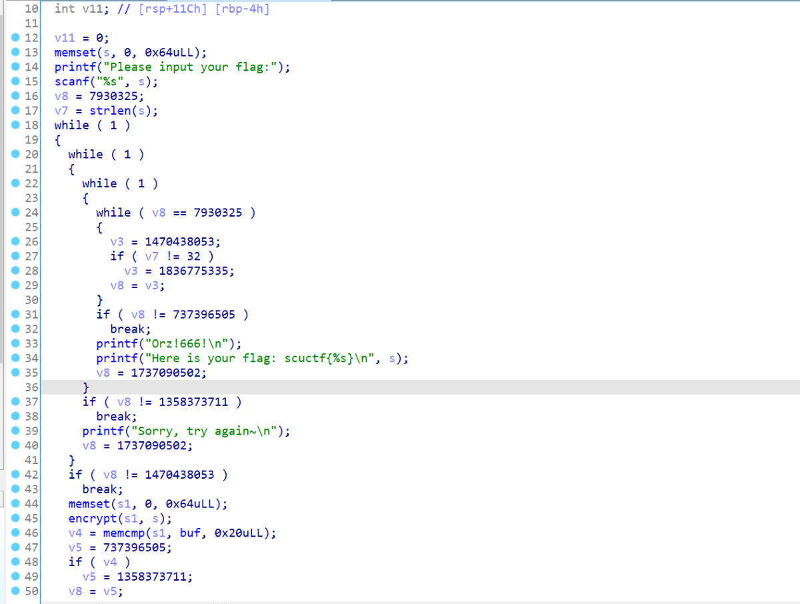

# 0x05. Pass完整代码

**obfu.cpp**

```
#include "llvm/IR/Function.h"
#include "llvm/Pass.h"
#include "llvm/Support/raw_ostream.h"
#include "llvm/IR/Instructions.h"
#include <vector>
#include <cstdlib>
#include <ctime>
using namespace llvm;
using std::vector;
 
namespace{
    struct Obfu : public FunctionPass{
        static char ID;
        Obfu() : FunctionPass(ID){}
 
        bool flatten(Function *f);
 
        bool runOnFunction(Function &F);
    };
}
 
bool Obfu::runOnFunction(Function &F){
    return flatten(&F);
}
 
bool Obfu::flatten(Function *f){
    IntegerType *int32Type = Type::getInt32Ty(f->getContext());
    // 遍历函数所有基本块，将其存到vector中
    vector<BasicBlock*> origBB;
    for(BasicBlock &BB: *f){
        origBB.push_back(&BB);
    }
    // 基本块数量不超过1则无需平坦化
    if(origBB.size() <= 1){
        return false;
    }
    // 从vector中去除第一个基本块
    origBB.erase(origBB.begin());
    BasicBlock *firstBB = &f->front();
    // 如果第一个基本块的末尾是条件跳转
    if(isa<BranchInst>(firstBB->getTerminator())){
        BranchInst *br = cast<BranchInst>(firstBB->getTerminator());
        if(br->isConditional()){
            CmpInst *cmpInst = cast<CmpInst>(firstBB->getTerminator()->getPrevNode());
            BasicBlock *newBB = firstBB->splitBasicBlock(cmpInst,"newBB");
            origBB.insert(origBB.begin(), newBB);
        }
    }
    // 创建循环
    BasicBlock *loopEntry = BasicBlock::Create(f->getContext(), "loopEntry", f, firstBB);
    BasicBlock *loopEnd = BasicBlock::Create(f->getContext(), "loopEnd", f, firstBB);
    firstBB->moveBefore(loopEntry);
    // 去除第一个基本块末尾的跳转
    firstBB->getTerminator()->eraseFromParent();
    // 初始化switch on变量
    srand(time(0));
    int randNumCase = rand();
    AllocaInst *swVarPtr = new AllocaInst(int32Type, 0, "swVar.ptr", firstBB);
    new StoreInst(ConstantInt::get(int32Type, randNumCase), swVarPtr, firstBB);
    // 使第一个基本块跳转到loopEntry
    BranchInst::Create(loopEntry, firstBB);
    // 在进入loopEntry读取switch on变量
    LoadInst *swVar = new LoadInst(int32Type, swVarPtr, "swVar", false, loopEntry);
    BranchInst::Create(loopEntry, loopEnd);
    // 初始化switch的default case
    // default case实际上不会被执行
    BasicBlock *swDefault = BasicBlock::Create(f->getContext(), "swDefault", f, loopEnd);
    BranchInst::Create(loopEnd, swDefault);
    SwitchInst *swInst = SwitchInst::Create(swVar, swDefault, 0, loopEntry);
    // 插入原基本块到switch中，仅是位置意义上的插入，而不是逻辑意义上的
    for(BasicBlock *BB : origBB){
        ConstantInt *numCase = cast<ConstantInt>(ConstantInt::get(int32Type, randNumCase));
        BB->moveBefore(loopEnd);
        swInst->addCase(numCase,BB);
        randNumCase = rand();
    }
    // 添加case
    for(BasicBlock *BB : origBB){
        // retn BB
        if(BB->getTerminator()->getNumSuccessors() == 0){
            continue;
        }
        // 非条件跳转
        if(BB->getTerminator()->getNumSuccessors() == 1){
            BasicBlock *sucBB = BB->getTerminator()->getSuccessor(0);
            BB->getTerminator()->eraseFromParent();
            ConstantInt *numCase = swInst->findCaseDest(sucBB);
            new StoreInst(numCase, swVarPtr, BB);
            BranchInst::Create(loopEnd, BB);
            continue;
        }
        // 条件跳转
        if(BB->getTerminator()->getNumSuccessors() == 2){
            ConstantInt *numCaseTrue = swInst->findCaseDest(BB->getTerminator()->getSuccessor(0));
            ConstantInt *numCaseFalse = swInst->findCaseDest(BB->getTerminator()->getSuccessor(1));
            BranchInst *br = cast<BranchInst>(BB->getTerminator());
            SelectInst *sel = SelectInst::Create(br->getCondition(), numCaseTrue, numCaseFalse, "", BB->getTerminator());
            BB->getTerminator()->eraseFromParent();
            new StoreInst(sel, swVarPtr, BB);
            BranchInst::Create(loopEnd, BB);
        }
    }
    return true;
}
 
char Obfu::ID = 0;
static RegisterPass<Obfu> X("obfu", "My obfuscating pass");
```

# 0x06. 混淆魔改

Rimao大佬的文章：[基于LLVM的控制流平坦化的魔改和混淆Pass实战](https://www.52pojie.cn/thread-1369130-1-1.html)